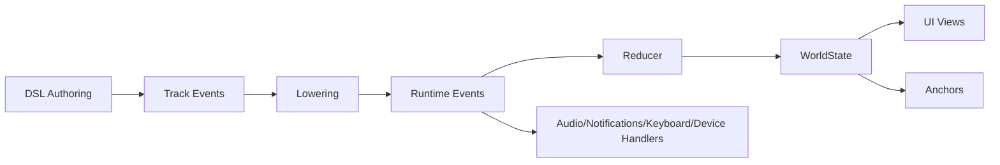

# Architecture Overview

This reference describes the Tokovo app plugin architecture end-to-end and how generator output maps to the runtime pipeline.

## Full Pipeline

### Key Stages
- **DSL**: Builders produce TrackEvents with `_declarationOrder` for determinism.
- **Lowering**: Maps TrackEvents to RuntimeEvents. Payloads must be deterministic.
- **Reducer**: Mutates WorldState using Immer. No wall clock time or randomness.
- **Views**: UI renders from WorldState only.
- **Anchors**: Prefer `AnchorProvider` (pixel-space `Rect` anchors, layout-aware). Legacy plugins may use normalized (0–1) anchors.
- **Device + System Handlers**: Audio/notifications/keyboard/device systems consume RuntimeEvents.

## Plugin Contract (Tiered)
- **Tier A**: `id`, `version`, `displayName`, `reducer`, `views`, `eventKinds`, `createInitialState`
- **Tier B**: `v2Lowering`, `layouts`, `anchors`
- **Tier C**: `dsl`
- **Tier D**: `compileHandlers`

## Registries and Lifecycle
When a plugin registers (via `PluginManagerClass`):
- Reducer is registered for appId.
- `eventKinds` are registered for routing.
- Initial state factory is registered.
- Views are registered with app registry.
- Layouts are registered with layout registry.
- Anchors are registered by `appId` provider. Anchor IDs are plain strings within a snapshot; device-owned anchors are merged in.
- Assets and audio rules are wired into registries.

## Determinism Contract
- No `Date.now()` or `Math.random()` in DSL/lowering/reducer/runtime.
- Use frame-derived values or seeded RNG.
- For IDs, default to `(event.at, _declarationOrder)`.

## Reference Paths in Repo
- Plugin contract: `packages/core/src/types/plugin-contract.ts`
- Runtime event types: `packages/core/src/types/runtime-event.ts`
- Track event types: `packages/ir/src/v2/track-event.ts`
- Plugin manager lifecycle: `packages/core/src/plugin` (register/registry logic)
