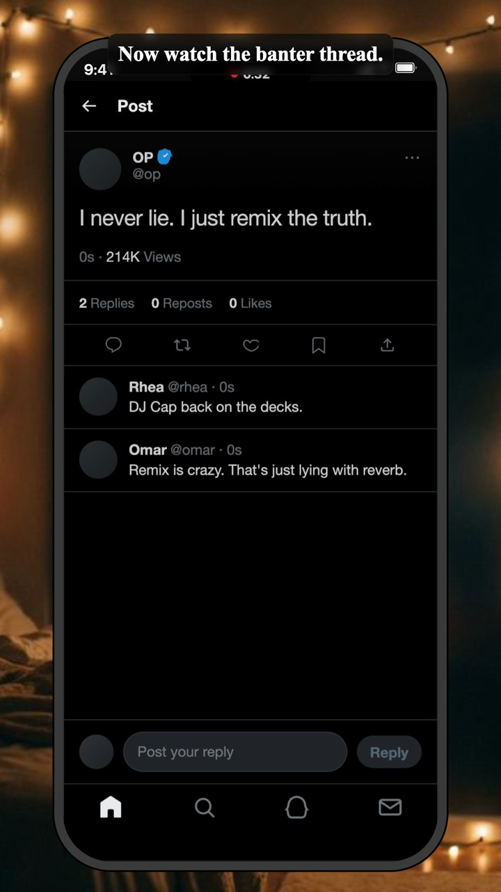

# Tokovo

[](https://github.com/nishit-g/tokovo/actions/workflows/release-gate.yml)
[](LICENSE)
[](package.json)

Tokovo is an AI-native studio for multi-device shows that happen inside phones.

Create cinematic chat dramas, social-feed stories, screen-recorded episodes, and short-form series without rebuilding phone screens in After Effects. Tokovo gives AI and creators a full phone-native production stage: one or many simulated devices, app worlds, OS surfaces, camera direction, sound, voice, backgrounds, overlays, and deterministic rendering.



[Watch the demo clip](apps/docs/public/showcase/launch-clip.mp4)

## What Tokovo Does

Tokovo turns a phone-native story into a repeatable production pipeline:

1. Generate or write a script, characters, tone, and episode arc.
2. Place the action inside one or many simulated devices: chats, feeds, DMs, notifications, calls, lockscreens, and screen recordings.
3. Direct pacing, camera moves, captions, keyboard input, sound, voice, and cliffhangers.
4. Preview the episode in browser.
5. Render a vertical MP4 for Shorts, Reels, TikTok, and serialized story formats.

The public repo exposes the engine behind that studio: TypeScript episode definitions, app simulators, device systems, render orchestration, validation, and showcase assets.

## Why It Exists

Phone-native stories are already a format. People watch drama, comedy, product narratives, and social arcs through chats, feeds, DMs, screenshots, and recordings. Production is still too manual: screen recording, editing layers, recreating messages, nudging timelines, and fixing every variant by hand.

AI can now generate scripts, branches, edits, translations, captions, and variations. Tokovo gives that AI a controlled studio instead of a blank video canvas:

- generate one episode concept and render many platform-ready cuts
- stage one phone, split-screen phones, or multi-device narrative beats in the same episode
- direct the phone OS, app state, camera, sound, voice, and timing as structured data
- keep every story beat and render artifact reviewable
- ship repeatable series instead of one-off timeline projects
- avoid manual After Effects work for phone-screen stories

## What You Can Build

Tokovo's v1 target surface covers:

| Surface            | Package                                                             | What it covers                                                                               |
| ------------------ | ------------------------------------------------------------------- | -------------------------------------------------------------------------------------------- |
| Device and OS      | `@tokovo/devices`, `@tokovo/device-*`                               | iPhone-style frames, multi-device scenes, status UI, keyboard, notifications, camera anchors |
| Messaging          | `@tokovo/apps-whatsapp`, `@tokovo/apps-imessage`                    | chats, group threads, typing, read states, media-style cards                                 |
| Social apps        | `@tokovo/apps-instagram`, `@tokovo/apps-x`, `@tokovo/apps-snapchat` | feeds, stories, profiles, DMs, notifications                                                 |
| Work apps          | `@tokovo/apps-linkedin`, `@tokovo/apps-teams`                       | message threads, channels, profiles, activity surfaces                                       |
| Storytelling tools | `@tokovo/overlay`, `@tokovo/background`, `@tokovo/voice`            | captions, backgrounds, procedural sound, music/audio cues, voice tracks                      |
| Rendering          | `video-runner`, `@tokovo/render-service`                            | local preview, MP4 export, render-service primitives                                         |

## Render The Showcase

Start with the creator-series showcase:

```bash
EPISODE_ID=v2-creator-series-showcase pnpm --filter video-runner render:fast
```

The render writes an MP4 and manifest under `apps/video-runner/out/`.

Then try app-specific showcases:

```bash
EPISODE_ID=whatsapp-flagship-v2 pnpm --filter video-runner render:fast
EPISODE_ID=instagram-flagship-v2 pnpm --filter video-runner render:fast
EPISODE_ID=x-flagship-v2 pnpm --filter video-runner render:fast
EPISODE_ID=typewriter-flagship-v2 pnpm --filter video-runner render:fast
```

## First 10 Minutes

```bash
pnpm install
pnpm validate
EPISODE_ID=v2-creator-series-showcase pnpm --filter video-runner render:fast
```

For interactive preview:

```bash
pnpm --filter video-runner dev
```

## Local Development

Requirements:

- Node.js 20 or newer
- pnpm 10.28.2

Install dependencies:

```bash
pnpm install
```

Open the main development surfaces:

```bash
pnpm dev
```

Preview only the renderer:

```bash
pnpm --filter video-runner dev
```

## Showcase Episodes

These are good first renders when checking the v1 target surface:

| Episode ID                    | Shows                                                                      |
| ----------------------------- | -------------------------------------------------------------------------- |
| `v2-creator-series-showcase`  | lockscreen, notifications, app switching, typed keyboard, camera direction |
| `multi-device-exhaustive`     | parallel phones, split pacing, screen recording, cross-app continuity      |
| `whatsapp-flagship-v2`        | chat list, group thread, updates, calls, typed replies                     |
| `instagram-flagship-v2`       | story, DM, profile, creator-facing pacing                                  |
| `x-flagship-v2`               | timeline, post detail, replies, notifications                              |
| `typewriter-flagship-v2`      | typewriter app, procedural sound effects, text timing                      |
| `screen-recording-exhaustive` | OS chrome and screen-recording realism                                     |

The full showcase matrix is documented in `apps/docs/app/showcase/page.mdx`.

## Repo Map

| Path                  | Purpose                                                              |
| --------------------- | -------------------------------------------------------------------- |
| `packages/episodes`   | canonical episode definitions, release/studio catalogs, validation   |
| `packages/dsl`        | timeline builder primitives for devices, camera, OS, audio, overlays |
| `packages/compiler`   | lowers episode definitions into renderable IR                        |
| `packages/core`       | deterministic runtime, registries, logging, validation               |
| `packages/renderer`   | React render surface and camera-aware layout                         |
| `packages/apps-*`     | app simulators for phone-native stories                              |
| `packages/device-*`   | OS-owned interactions: camera, keyboard, notifications               |
| `apps/video-runner`   | preview/render app                                                   |
| `apps/docs`           | public documentation site                                            |
| `apps/web`            | marketing site                                                       |
| `apps/render-service` | render-service CLI and render orchestration primitives               |

## Authoring Flow

1. Create a `*.episode.ts` file in `packages/episodes/src`.
2. Define metadata with `defineEpisode`.
3. Build the timeline with the code-first episode builder.
4. Register the episode in the release or studio catalog.
5. Validate with `pnpm validate`.
6. Preview in `video-runner`.
7. Render with `pnpm --filter video-runner render:fast`.

## Release Gate

The canonical release gate is:

```bash
pnpm verify:release
```

For focused local work, these are the checks most contributors will use:

```bash
pnpm lint:ox
pnpm lint:release
pnpm -s typecheck:solution
pnpm validate
pnpm --filter @tokovo/episodes test
pnpm --filter video-runner typecheck
pnpm --filter docs build
```

## Documentation

- `apps/docs/app/page.mdx` is the documentation home.
- `llms.txt`, `AGENTS.md`, `CLAUDE.md`, and `.skills/tokovo-authoring/SKILL.md` provide LLM and coding-agent context.
- `apps/docs/app/showcase/page.mdx` lists the current v1 showcase surface.
- `apps/docs/app/getting-started/quickstart/page.mdx` is the fastest render path.
- `apps/docs/app/getting-started/first-episode/page.mdx` explains the authoring shape.
- `apps/docs/app/guides/object-storage-assets/page.mdx` explains local and object-storage assets.
- `docs/ARCHITECTURE.md` describes runtime boundaries.
- `docs/V1_STABILITY.md` defines the v1 readiness bar.
- `docs/operations/release.md` documents the release gate.
- `docs/operations/public-release.md` tracks public-release readiness.
- `ASSET_LICENSES.md` records bundled asset provenance.

Run the docs site locally:

```bash
pnpm --filter docs dev
```

## V1 Readiness

The public v1 bar is intentionally strict:

- app simulators must own their reducers, views, anchors, and DSL helpers
- episodes must validate before they are rendered
- multi-device episodes should author device focus intentionally
- camera targets should resolve to semantic anchors instead of fallback boxes
- audio cues, generated sounds, voice tracks, and backgrounds should be declared as episode data
- docs assets must be intentional, licensed, and listed in `ASSET_LICENSES.md`
- generated renders stay out of git unless they are part of the docs showcase

## Contributing

Start with `CONTRIBUTING.md`, keep changes scoped, and run the relevant checks before opening a pull request.

For security issues, follow `SECURITY.md` instead of opening a public issue.

## License

Tokovo is released under the MIT License. See `LICENSE`.
