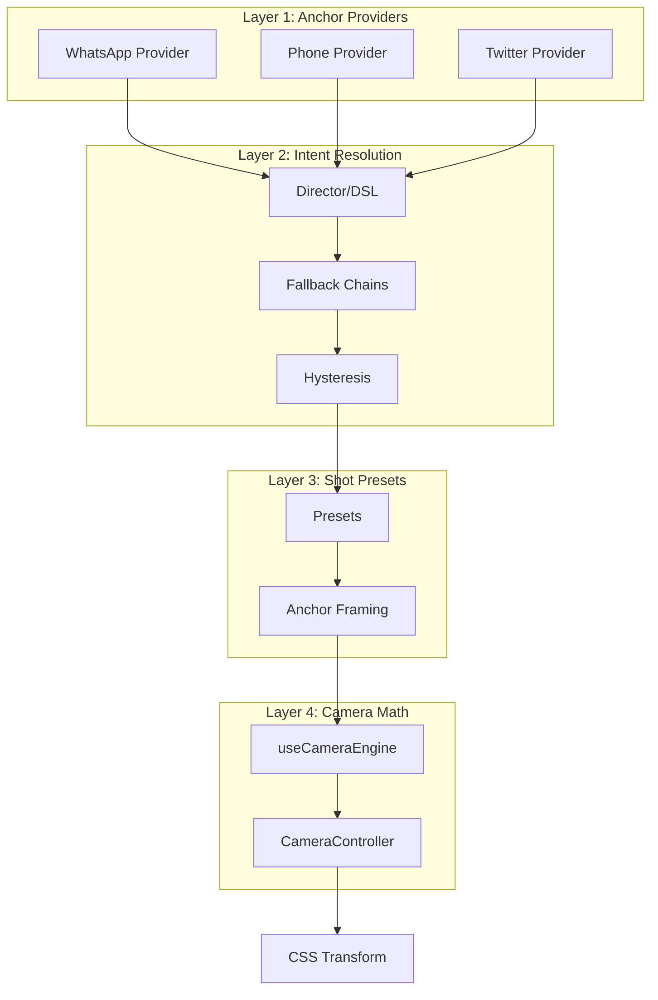

import { Callout, Tabs, Tab, Steps } from 'nextra/components'

# Camera System

<Callout type="info">
**The camera follows meaning, not pixels.**
</Callout>

The Semantic Anchor-Driven Camera System (SACS) provides production-grade cinematic effects that target **semantic anchors** (like "lastMessage" or "inputArea") rather than hardcoded pixel coordinates.

## The New Way

**Before (hardcoded):**
```typescript
// ❌ What does originY: 0.8 mean?
dsl.zoom(60, 1.25, 20, { originY: 0.8 })
```

**After (semantic):**
```typescript
// ✅ Camera follows the last message
dsl.anchorFocus(60, "lastMessage", "dramatic")
```

---

## Architecture



### Four Layers

| Layer | Responsibility | Example |
|-------|----------------|---------|
| **Anchor Providers** | Define *what* can be focused | WhatsApp extracts `lastMessage` rect |
| **Intent Resolution** | Decide *when* to focus | "On MESSAGE_RECEIVED → FOCUS lastMessage" |
| **Shot Presets** | Define *how* to look | `dramatic` = scale 1.3, shake 4 |
| **Camera Math** | Execute transforms | Convert rect center → CSS origin |

---

## How It Works

<Steps>

### World State Update

```typescript
dsl.receive(60, "Bestie 💕", "I got the job!!! 🎉")
// Result: message added to world.conversations
```

### Layout Computes Pixels

```typescript
// Layout engine produces:
messageLayouts["m_42"] = {
  rect: { x: 50, y: 650, width: 280, height: 45 }
}
```

### Anchor Provider Extracts Meaning

```typescript
// WhatsAppAnchorProvider.getAnchors()
anchors.lastMessage = { x: 50, y: 650, width: 280, height: 45 }
```

### Camera Effect Triggers

```typescript
dsl.anchorFocus(60, "lastMessage", "dramatic", 5)
```

### Anchor Resolution (The Key Math)

```typescript
// In useCameraEngine:
const rect = resolveAnchorWithFallback("lastMessage", anchors);

// Convert rect center → normalized origin
const centerX = rect.x + rect.width / 2;    // 190
const centerY = rect.y + rect.height / 2;   // 672.5
const originX = centerX / viewportWidth;    // 0.442
const originY = centerY / viewportHeight;   // 0.721
```

### CSS Output

```css
.camera {
  transform: scale(1.3);
  transform-origin: 44.2% 72.1%;
}
```

</Steps>

---

## Semantic Anchors

### Core Anchors

| Anchor | Description | Apps |
|--------|-------------|------|
| `lastMessage` | Most recent message bubble | WhatsApp, Instagram DM |
| `inputArea` | Text input field | All chat apps |
| `typingIndicator` | Typing dots (volatile) | WhatsApp |
| `callPoster` | Contact poster image | Phone |
| `device` | Full screen (fallback) | All |

### Anchor Snapshot

```typescript
interface AnchorSnapshot {
  appId: string;
  deviceId: string;
  anchors: Partial<Record<SemanticAnchorId, LayoutRect>>;
}

// Example:
{
  appId: "app_whatsapp",
  anchors: {
    lastMessage: { x: 50, y: 650, width: 280, height: 45 },
    inputArea: { x: 0, y: 880, width: 430, height: 52 },
    device: { x: 0, y: 0, width: 430, height: 932 },
  }
}
```

### Fallback Chains

When an anchor isn't available:

```typescript
const FALLBACK_CHAINS = {
  typingIndicator: ["inputArea", "lastMessage", "device"],
  lastMessage: ["inputArea", "device"],
  inputArea: ["device"],
};
```

---

## Shot Presets

### Available Presets

| Preset | Scale | Shake | Duration | Use Case |
|--------|-------|-------|----------|----------|
| `dramatic` | 1.3 | 4 | 25 frames | Big reveals |
| `subtle` | 1.08 | 0 | 30 frames | Typing anticipation |
| `snap` | 1.15 | 0 | 10 frames | Quick reactions |
| `impact` | 1.4 | 8 | 15 frames | Maximum intensity |
| `message` | 1.1 | 0 | 25 frames | Standard follow |
| `reset` | 1.0 | 0 | 20 frames | Return to neutral |

### Preset Definition

```typescript
const SHOT_PRESETS = {
  dramatic: {
    scale: 1.3,
    durationFrames: 25,
    easing: "ease-out",
    shake: 4,
  },
  // ...
};
```

---

## Camera Effects

### ANCHOR_FOCUS (Recommended)

```typescript
{
  at: 100,
  kind: "CAMERA",
  type: "ANCHOR_FOCUS",
  anchor: "lastMessage",   // Semantic anchor
  preset: "dramatic",      // Shot preset
  shake: 5,                // Optional override
}
```

### ZOOM (Manual)

```typescript
{
  at: 100,
  kind: "CAMERA",
  type: "ZOOM",
  scale: 1.5,
  duration: 30,
  originX: 0.5,
  originY: 0.8,
  easing: "ease-out",
}
```

### SHAKE

```typescript
{
  at: 200,
  kind: "CAMERA",
  type: "SHAKE",
  intensity: 20,
  duration: 30,
  decay: true,
  frequency: 3,
}
```

### RESET

```typescript
{
  at: 300,
  kind: "CAMERA",
  type: "RESET",
  duration: 45,
}
```

---

## Easing Functions

| Easing | Description |
|--------|-------------|
| `linear` | Constant speed |
| `ease-in` | Accelerate from start |
| `ease-out` | Decelerate to end |
| `ease-in-out` | Accelerate then decelerate |
| `cinematic` | Film-style S-curve |

---

## Hysteresis (Anti-Jitter)

Anchors must be stable for 3 frames before the camera switches:

```typescript
const ANCHOR_STABILITY_FRAMES = 3;

// Prevents: typing dots flicker → camera doesn't spaz
```

---

## CameraTransform

The output of camera calculations:

```typescript
interface CameraTransform {
  scale: number;      // 1.0 = no zoom
  translateX: number;
  translateY: number;
  rotation: number;
  originX: number;    // 0-1 normalized
  originY: number;
  shakeX: number;     // Shake offset
  shakeY: number;
}
```

---

## Usage Example

```typescript
const events = [
  // Message arrives → camera follows
  dsl.receive(60, "Bestie 💕", "I got the job!!! 🎉"),
  dsl.anchorFocus(60, "lastMessage", "dramatic", 5),
  
  // Reply → quick snap
  dsl.send(120, "OMG CONGRATS!!!"),
  dsl.anchorFocus(120, "lastMessage", "snap", 2),
  
  // Reset to neutral
  dsl.reset(200, 40),
];
```

---

## Related

- [DSL Semantic](/dsl/semantic) - Semantic DSL helpers
- [DirectorLite](/director) - Automatic camera effects
- [Anchor Providers](/architecture/plugins) - Creating custom anchors
