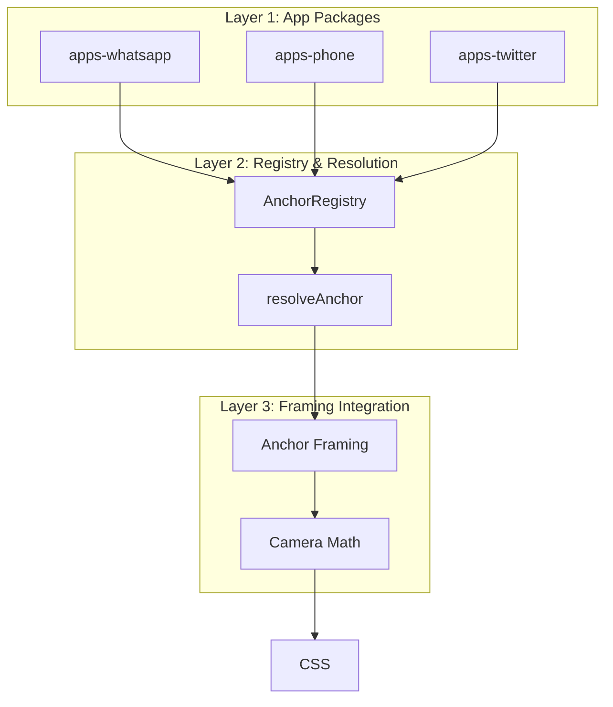

import { Callout, Tabs, Tab, Steps } from 'nextra/components'

# Camera System

<Callout type="info">
<strong>The camera follows meaning, not pixels.</strong>
</Callout>

The Semantic Anchor-Driven Camera System (SACS) provides production-grade cinematic effects that target **semantic anchors** (like "lastMessage" or "inputArea") rather than hardcoded pixel coordinates. This 665-line engine powers all camera behavior in Tokovo.

## The New Way

**Before (hardcoded):**
```typescript
// ❌ What does originY: 0.8 mean?
dsl.zoom(60, 1.25, 20, { originY: 0.8 })
```

**After (semantic):**
```typescript
// ✅ Camera follows the last message
dsl.camera.anchorFocus(60, "lastMessage", "dramatic")
```

---

## Architecture



### Four Layers

| Layer | Responsibility | Key Files |
|-------|----------------|-----------|
| **App Packages** | Define anchors & framing | `packages/apps-*/src/provider.ts` |
| **Registry** | Central lookup for providers | `@tokovo/core/src/anchors.ts` |
| **Resolution** | Fallback & stability logic | `@tokovo/core/src/anchors.ts` |
| **Camera Math** | Execute transforms | `@tokovo/renderer/engines/useCameraEngine.ts` |

---

## Camera Effects

### ANCHOR_FOCUS (One-Time Focus)

Focus on a semantic anchor with a shot preset. Sets origin once and zooms.

```typescript
{
  at: 100,
  kind: "CAMERA",
  type: "ANCHOR_FOCUS",
  anchor: "lastMessage",   // Semantic anchor
  preset: "dramatic",      // Shot preset (see table below)
  shake: 5,                // Optional shake intensity
  duration: 25,            // Frames
  easing: "ease-out",
}

// DSL shorthand:
dsl.camera.anchorFocus(100, "lastMessage", "dramatic", 5)
```

### Sticky vs. Scrolled Anchors

<Callout type="info">
<strong>Smart Coordinate Handling</strong>: The engine automatically handles coordinate spaces for sticky vs. scrolled elements.
</Callout>

*   **Scrolled Elements** (e.g., `lastMessage`): The engine subtracts the current scroll offset to map the element's content position to viewport space.
*   **Sticky Elements** (e.g., `profile`, `header`, `inputArea`): Must be flagged with `metadata: { sticky: true }` in the Anchor Provider. The engine uses their raw coordinates without scroll adjustment.

This ensures that a focus on `lastMessage` works correctly even deep in a chat history, while `profile` remains rock-steady at the top.

### ANCHOR_TRACK (Continuous Following)

<Callout type="warning">
<strong>NEW in v1</strong>: Unlike ANCHOR_FOCUS which sets origin once, ANCHOR_TRACK continuously follows the anchor with exponential smoothing. This is the "webseries camera operator" feel.
</Callout>

```typescript
{
  at: 100,
  kind: "CAMERA",
  type: "ANCHOR_TRACK",
  anchor: "lastMessage",
  duration: 35,            // Frames to track
  smoothing: 0.18,         // 0.08=slow, 0.18=operator, 0.35=snappy, 0.6=whip
  preset: "operatorFollow",
  easing: "ease-out",
}

// DSL shorthand:
dsl.camera.anchorTrack(100, "lastMessage", 35, 0.18, "operatorFollow")
```

**Smoothing Values:**

| Value | Behavior | Use Case |
|-------|----------|----------|
| `0.08` | Very slow, dreamy | Emotional moments |
| `0.18` | Operator feel | Standard webseries |
| `0.35` | Snappy response | Action sequences |
| `0.60` | Whip-fast | Dramatic cuts |

### HOLD (Intentional Stillness)

Let the viewer breathe and read.

```typescript
dsl.camera.hold(100, 18)  // Hold for 18 frames (minimum 12 recommended)
```

### PUNCH + GLIDE (Webseries Signature)

Fast zoom-in, then smooth follow. Combines impact + tracking.

```typescript
// Returns array of TWO events:
const events = dsl.camera.punchGlide(100, "lastMessage");
// [0]: ANCHOR_FOCUS with impactPunch preset (10f)
// [1]: ANCHOR_TRACK with operatorFollow (35f)
```

### Legacy: ZOOM, SHAKE, RESET

```typescript
// Manual zoom (deprecated - prefer anchorFocus)
dsl.camera.zoom(100, 1.5, 30, { originX: 0.5, originY: 0.8 })

// Shake effect
dsl.camera.shake(100, 5, 12)  // intensity, duration

// Reset to neutral
dsl.camera.reset(100, 20)
```

---

## Shot Presets

<Callout type="error">
<strong>v1 Presets are LOCKED.</strong> Do not modify their values. They define the "Tokovo look."
</Callout>

### v1 Core Presets (Production Ship Set)

| Preset | Scale | Shake | Duration | Easing | Use Case |
|--------|-------|-------|----------|--------|----------|
| `message` | 1.08 | 0 | 22f | ease-out | Default message follow |
| `subtle` | 1.04 | 0 | 30f | cinematic | Typing anticipation |
| `impact` | 1.35 | 6 | 14f | expoOut | Big reveals, breakups |
| `snap` | 1.15 | 1 | 8f | ease-out | Quick reactions |

### v1 Motion Presets

| Preset | Scale | Tracking | Smoothing | Duration | Use Case |
|--------|-------|----------|-----------|----------|----------|
| `operatorFollow` | 1.22 | ✅ | 0.18 | 40f | Standard tracking |
| `punchGlide` | 1.35 | ✅ | 0.18 | 40f | Punch + glide sequence |

### v1 Interruption Presets

| Preset | Scale | Shake | Duration | Use Case |
|--------|-------|-------|----------|----------|
| `interrupt` | 1.25 | 4 | 10f | Notification breaks flow |
| `takeover` | 0.85 | 0 | 20f | Call takes full screen |

### v1 Structural Presets

| Preset | Scale | Duration | Use Case |
|--------|-------|----------|----------|
| `reset` | 1.0 | 20f | Return to neutral |
| `establish` | 0.9 | 30f | Scene-opening wide shot |

### v2 Presets (Feature-Flagged)

<Callout>
v2 presets require emotional state model and are not included in the standard ship set.
</Callout>

| Preset | Scale | Category | Notes |
|--------|-------|----------|-------|
| `suspenseHold` | 1.1 | Psychological | Tension stretch |
| `voyeur` | 0.92 | Psychological | Distant observation |
| `isolation` | 0.88 | Psychological | Emotional withdrawal |
| `whipSnap` | 1.18 | Dynamic | Fast pan with overshoot |
| `floatFollow` | 1.15 | Dynamic | Very slow dreamy follow |
| `panic` | 1.4 | Meta | Loss of control |
| `collapse` | 0.8 | Meta | Aftermath pullback |

---

## Semantic Anchors

### Anchor Types by App

<Tabs items={['WhatsApp', 'Phone', 'Twitter', 'Notification']}>
  <Tab>
    ```typescript
    type WhatsAppAnchorId =
      | "lastMessage"      // Most recent message rect
      | "typingIndicator"  // Typing dots (volatile!)
      | "inputArea"        // Input bar (stable)
      | "reactionBubble"   // Reaction popup
      | "voiceNote"        // Voice message waveform
      | "imagePreview"     // Image in chat
      | "device";          // Full frame fallback
    ```
  </Tab>
  <Tab>
    ```typescript
    type PhoneAnchorId =
      | "callPoster"       // Contact poster/photo
      | "acceptButton"     // Green answer button
      | "declineButton"    // Red decline button
      | "callTimer"        // Active call timer
      | "device";          // Full frame fallback
    ```
  </Tab>
  <Tab>
    ```typescript
    type TwitterAnchorId =
      | "lastTweet"        // Most recent tweet
      | "composeTweet"     // Tweet composer
      | "profileHeader"    // Profile banner
      | "device";          // Full frame fallback
    ```
  </Tab>
  <Tab>
    ```typescript
    type NotificationAnchorId =
      | "headsUpBanner"    // Notification banner
      | "dynamicIsland"    // iOS Dynamic Island
      | "device";          // Full frame fallback
    ```
  </Tab>
</Tabs>

### Anchor Framing Configuration

Each anchor has a **framing config** that defines where it should appear in frame. **This is now owned by the App Package**, not hardcoded in the core.

```typescript
// packages/apps-whatsapp/src/provider.ts
export const WhatsAppFraming = {
  lastMessage: {
    anchorPoint: { x: 0.5, y: 0.75 },  // Lower-third
    paddingPx: 24,
    targetFill: 0.55,
  },
  // ...
};
```

### Fallback Chains

When an anchor isn't available, the system falls back:

```typescript
const ANCHOR_FALLBACK_CHAINS = {
  typingIndicator: ["inputArea", "lastMessage", "device"],
  lastMessage: ["inputArea", "device"],
  inputArea: ["device"],
  callPoster: ["device"],
  reactionBubble: ["lastMessage", "device"],
};
```

---

## Creating Anchor Providers

To add semantic anchors for a new app:

```typescript
// packages/apps-myapp/src/provider.ts
import { AnchorProvider, AnchorSnapshot } from "@tokovo/core";

export const MyAppAnchorProvider: AnchorProvider = {
  appId: "app_myapp",
  
  // App defines its own framing!
  framing: {
      myFeature: {
          anchorPoint: { x: 0.5, y: 0.5 },
          paddingPx: 20,
          targetFill: 0.8
      }
  },
  
  getAnchors(world, layout, deviceId): AnchorSnapshot {
    const anchors: Record<string, LayoutRect> = {};
    
    // ... logic to extract anchors
    
    return { anchors, deviceId, appId: "app_myapp" };
  }
};
```

Then register it in your app's entry point:

```typescript
// packages/apps-myapp/src/index.ts
import { AnchorRegistry } from "@tokovo/core";
import { MyAppAnchorProvider } from "./provider";

AnchorRegistry.register(MyAppAnchorProvider);
```

---

## App Behaviors (Event → Intent Mapping)

Apps define how their events map to camera intents:

```typescript
// packages/apps-whatsapp/src/behaviors.ts
import { AppBehavior, CameraIntent } from "@tokovo/core";

export const WhatsAppBehavior: AppBehavior = {
  appId: "app_whatsapp",
  
  eventMappings: {
    MESSAGE_RECEIVED: { type: "FOCUS", anchor: "lastMessage", preset: "dramatic" },
    MESSAGE_SENT: { type: "FOCUS", anchor: "lastMessage", preset: "message" },
    TYPING_START: { type: "FOCUS", anchor: "inputArea", preset: "subtle" },
    TYPING_END: { type: "RESET", preset: "reset" },
    REACTION_ADDED: { type: "FOCUS", anchor: "reactionBubble", preset: "snap" },
  },
  
  // Optional: override global presets
  presetOverrides: {
    dramatic: { scale: 1.25 },  // WhatsApp uses slightly less zoom
    snap: { scale: 1.18 },      // Snaps are snappier
  },
};
```

---

## Hysteresis (Anti-Jitter)

Anchors must be stable for 3 frames before the camera switches:

```typescript
const ANCHOR_STABILITY_FRAMES = 3;

// Prevents: typing dots flash → camera doesn't spaz
// The camera ignores volatile anchors that appear briefly
```

---

## CameraTransform Output

The final output applied to CSS:

```typescript
interface CameraTransform {
  scale: number;      // 1.0 = no zoom
  translateX: number; // Pan X offset
  translateY: number; // Pan Y offset
  rotation: number;   // Degrees
  originX: number;    // 0-1 normalized X
  originY: number;    // 0-1 normalized Y
  shakeX: number;     // Current shake X offset
  shakeY: number;     // Current shake Y offset
}
```

Applied as:
```css
.camera {
  transform: 
    translate(var(--shakeX), var(--shakeY))
    scale(var(--scale));
  transform-origin: 
    calc(var(--originX) * 100%) 
    calc(var(--originY) * 100%);
}
```

---

## Complete Example

```typescript
import { dsl } from "@tokovo/dsl";

const events = [
  // Scene opens with establishing shot
  dsl.camera.anchorFocus(0, "device", "establish"),
  
  // Message arrives → dramatic focus with shake
  dsl.messages.receive(60, "conv_1", "Alice", "I got the job!!! 🎉"),
  dsl.camera.anchorFocus(60, "lastMessage", "impact", 5),
  
  // Let viewer read
  dsl.camera.hold(85, 18),
  
  // Reply with standard follow
  dsl.messages.send(120, "conv_1", "OMG CONGRATS!!!"),
  dsl.camera.anchorFocus(120, "lastMessage", "message"),
  
  // Typing anticipation → track the input area
  dsl.messages.typingStart(160, "conv_1", "Alice"),
  dsl.camera.anchorTrack(160, "inputArea", 40, 0.18, "subtle"),
  
  // Message arrives → punch + glide signature move
  dsl.messages.typingEnd(200, "conv_1", "Alice"),
  dsl.messages.receive(200, "conv_1", "Alice", "We need to celebrate! 🥳"),
  ...dsl.camera.punchGlide(200, "lastMessage"),  // Spreads to 2 events
  
  // Scene ends → reset to neutral
  dsl.camera.reset(280, 30),
];
```

---

## Debugging Camera Issues

| Symptom | Likely Cause | Fix |
|---------|--------------|-----|
| Camera jumps erratically | Anchor not stable | Check hysteresis, use stable anchors like `inputArea` |
| Wrong zoom level | Preset mismatch | Verify preset exists, check presetOverrides |
| Camera targets wrong area | Anchor provider bug | Log `getAnchors()` output, check layout.kind |
| No camera movement | DirectorLite disabled | Set `directorEnabled: true` in TokovoRenderer |
| Shake feels wrong | Decay/frequency | Adjust shake intensity, frequency, decay |

---

## Related

- [Renderer Engines](/architecture/renderer-engines) - The 3-engine architecture
- [DirectorLite](/director) - Automatic camera effects from events
- [Plugin System](/architecture/plugins) - Creating apps with behaviors
- [DSL Events: Camera](/dsl/events#camera) - Camera event factories
