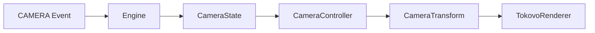

import { Callout, Tabs, Tab } from 'nextra/components'

# Camera System

The Camera System provides production-grade cinematic effects including zoom, pan, shake, focus, and more. All effects are deterministic and frame-accurate.

## Architecture



## Camera Effects

### ZOOM

Scale the view with configurable origin and easing.

```typescript
{
    at: 100,
    kind: "CAMERA",
    type: "ZOOM",
    scale: 1.5,           // Target scale
    duration: 30,         // Frames
    originX: 0.5,         // Origin X (0-1, default center)
    originY: 0.3,         // Origin Y (0-1)
    easing: "ease-out",   // Easing curve
}
```

### PAN

Translate the camera position smoothly.

```typescript
{
    at: 150,
    kind: "CAMERA",
    type: "PAN",
    translateX: 100,      // Pixels to pan X
    translateY: 50,       // Pixels to pan Y
    duration: 45,
    easing: "ease-in-out",
}
```

### SHAKE

Screen tremor with intensity and decay for dramatic moments.

```typescript
{
    at: 200,
    kind: "CAMERA",
    type: "SHAKE",
    intensity: 20,        // Max pixels of shake
    duration: 30,
    decay: true,          // Intensity fades over duration
    frequency: 3,         // Shakes per second
    seed: 42,             // Seed for deterministic randomness
}
```

### FOCUS

Zoom to a specific target or element.

```typescript
{
    at: 250,
    kind: "CAMERA",
    type: "FOCUS",
    target: "message_3",  // Element ID to focus
    zoom: 1.8,            // Zoom level
    duration: 60,
    easing: "cinematic",
}
```

### RESET

Return to default camera position.

```typescript
{
    at: 300,
    kind: "CAMERA",
    type: "RESET",
    duration: 45,
    easing: "ease-out",
}
```

## Easing Functions

| Easing | Description |
|--------|-------------|
| `linear` | Constant speed |
| `ease-in` | Accelerate from start |
| `ease-out` | Decelerate to end |
| `ease-in-out` | Accelerate then decelerate |
| `bounce` | Bouncy spring effect |
| `cinematic` | Film-style smooth curve |

```typescript
import { easingFunctions, applyEasing } from "@tokovo/core";

const progress = 0.5;
const eased = applyEasing(progress, "cinematic");
// eased ≈ 0.35 (slow start, fast middle, slow end)
```

## CameraController

The `CameraController` class computes final transforms from active effects:

```typescript
import { CameraController } from "@tokovo/core";

const controller = new CameraController(30); // 30 fps

// Compute transform at frame 150
const transform = controller.computeTransform(cameraState, 150);

// Result: { scale: 1.3, translateX: 50, translateY: 20, ... }
```

**Features:**
- Memoized for performance
- Handles overlapping effects correctly
- Deterministic (seeded randomness for shake)

## CameraTransform

The output of camera calculations:

```typescript
interface CameraTransform {
    scale: number;      // 1.0 = no zoom
    translateX: number; // Pixels
    translateY: number;
    rotation: number;   // Degrees
    originX: number;    // Transform origin (0-1)
    originY: number;
    shakeX: number;     // Current shake offset
    shakeY: number;
}
```

## Camera Presets

Pre-built camera effects for common scenarios:

```typescript
import { cameraPresets } from "@tokovo/core";

// Dramatic zoom-in
const zoomIn = cameraPresets.dramaticZoomIn(100); // at frame 100

// Subtle shake for tension
const shake = cameraPresets.microShake(200, "low");

// Smooth pan to follow action
const pan = cameraPresets.followPan(300, { x: 100, y: 50 });
```

## DirectorLite Integration

DirectorLite automatically adds camera effects based on content:

```typescript
// Cliffhanger message triggers zoom
// Incoming message triggers shake
// Long typing triggers push-in

// Configure in your episode:
{
    directorEnabled: true,
    directorRules: "ViralDramaV1", // Preset rules
}
```

## Effect Layering

When multiple effects are active:

| Property | Behavior |
|----------|----------|
| `scale` | Multiplied together |
| `translateX/Y` | Added together |
| `rotation` | Added together |
| `origin` | Uses most recent effect |
| `shake` | Added together |

```typescript
// Two overlapping zooms:
// Effect 1: scale 1.5
// Effect 2: scale 1.2
// Final: scale 1.8 (1.5 * 1.2)
```

## Usage Example

```typescript
import { CameraController, CameraState } from "@tokovo/core";

// Initial camera state
const initialState: CameraState = {
    baseView: "APP_VIEW",
    activeDeviceId: "phone",
    layout: { mode: "SINGLE", primaryDeviceId: "phone" },
    activeEffects: [],
    transform: {
        scale: 1, translateX: 0, translateY: 0,
        rotation: 0, originX: 0.5, originY: 0.5,
        shakeX: 0, shakeY: 0,
    },
    deviceTransforms: {},
};

// Events trigger effect addition
const events = [
    { at: 100, kind: "CAMERA", type: "ZOOM", scale: 1.5, duration: 30 },
    { at: 120, kind: "CAMERA", type: "SHAKE", intensity: 15, duration: 20 },
];
```

## Related

- [DirectorLite](/director) - Automatic camera effects
- [Effects](/director/effects) - Effect types
- [Signals](/director/signals) - Signal detection
