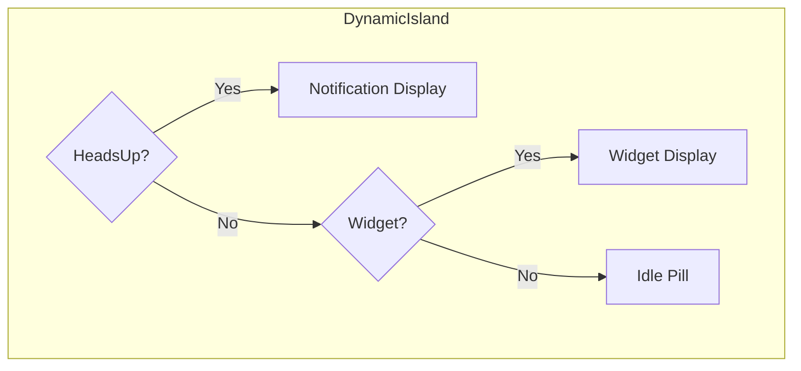

import { Callout, Tabs, Tab } from 'nextra/components'

# Dynamic Island

The Dynamic Island is iOS's floating status indicator that appears at the top of iPhone screens. Tokovo provides a complete implementation for rendering notifications, widgets, and app activities.

## Priority Stack

The Dynamic Island renders content in priority order:

1. **HeadsUp Notifications** (highest priority)
2. **Active Widgets** (music, calls, timers)
3. **Idle State** (black pill)



## Notification Display

When a notification is in headsUp state and within its display window, it renders in an expanded Dynamic Island:

```tsx
const NotificationDynamicIsland = ({ config, notification }) => {
    const formatted = NotificationAdapterRegistry.format(notification);
    
    return (
        <div style={{
            position: "absolute",
            top: config.topY - 20,
            left: "50%",
            transform: "translateX(-50%)",
            width: config.expandedWidth,
            background: "#000000",
            borderRadius: config.cornerRadius,
            padding: "24px 30px",
        }}>
            {/* App Icon */}
            <div style={{ background: formatted.iconBackground }}>
                {formatted.icon}
            </div>
            
            {/* Content */}
            <div>
                <div>{formatted.title}</div>
                <div>{formatted.body}</div>
            </div>
            
            {/* Preview Image */}
            {formatted.preview?.kind === "image" && (
                
            )}
        </div>
    );
};
```

## Time-Based Visibility

Notifications appear for a duration based on priority:

| Priority | Duration | Frames (30fps) |
|----------|----------|----------------|
| `passive` | No display | 0 |
| `active` | 3 seconds | 90 |
| `timeSensitive` | 5 seconds | 150 |
| `critical` | 8 seconds | 240 |

The visibility check:

```tsx
const shownAt = notification.headsUp?.shownAt ?? notification.at;
const duration = notification.headsUp?.duration ?? 90;
const hideAt = shownAt + duration;

// Only show if current frame is within display window
if (t >= shownAt && t < hideAt) {
    return <NotificationDynamicIsland ... />;
}
```

## Widget Integration

When no notification is active, the Dynamic Island renders active widgets:

```tsx
// Get active background apps
const activeAppIds = device.backgroundApps?.map(a => a.appId) || [];

// Resolve which widget should render
const resolved = WidgetRegistry.resolve("dynamicIsland", platform, activeAppIds);

if (resolved) {
    return <WidgetComponent {...widgetProps} />;
}

// Fallback to idle state
return <IdleDynamicIsland config={config} />;
```

## Device Profile Configuration

Dynamic Island dimensions are defined in device profiles:

```typescript
// packages/devices/src/iphone16/profile.ts
export const iPhone16Profile: DeviceProfile = {
    // ...
    dynamicIsland: {
        topY: 36,
        centerX: 585,
        collapsedWidth: 360,
        collapsedHeight: 111,
        expandedWidth: 1020,
        expandedHeight: 360,
        cornerRadius: 100,
    },
};
```

## Modes

- **Idle**: Small black pill (no activity)
- **Minimal**: Tiny indicator (background activity)
- **Compact**: Small expanded (single widget)
- **Expanded**: Full expanded (notification or focused widget)

## Related

- [Widget System](/architecture/widgets) - Creating widgets
- [Notification IR](/ir/notification-ir) - Notification data model
- [Device Profiles](/architecture/device-profiles) - Device configuration
