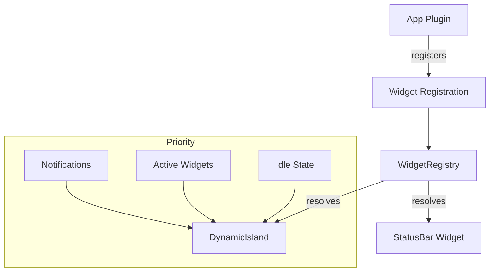

import { Callout, Steps, Tabs, Tab } from 'nextra/components'

# Widget System

The Widget System allows apps to display persistent UI in the Dynamic Island (iOS) or status bar (Android). Widgets are used for background activities like music playback, calls, timers, and navigation.

## Architecture



## Widget Registration

Widgets are registered through the plugin system:

```typescript
import { WidgetRegistry, WidgetProps } from "@tokovo/core";

// Register a Dynamic Island widget
WidgetRegistry.register({
    appId: "app_spotify",
    slot: "dynamicIsland",
    platform: "ios",
    priority: 50,
    component: SpotifyDynamicIslandWidget,
    expansionModes: ["minimal", "compact", "expanded"],
});
```

## WidgetRegistration Interface

```typescript
interface WidgetRegistration {
    /** App that owns this widget */
    appId: string;
    
    /** Where the widget appears */
    slot: "dynamicIsland" | "statusBar" | "lockscreen";
    
    /** Platform filter */
    platform: "ios" | "android" | "all";
    
    /** Higher = shown first when multiple compete */
    priority: number;
    
    /** React component to render */
    component: React.ComponentType<WidgetProps>;
    
    /** Expansion modes (Dynamic Island only) */
    expansionModes?: ("minimal" | "compact" | "expanded")[];
}
```

## WidgetProps

Props passed to widget components:

```typescript
interface WidgetProps {
    /** Dynamic Island configuration */
    config: DynamicIslandConfig;
    
    /** Current app state */
    appState: Record<string, any>;
    
    /** Background app info */
    backgroundApp: BackgroundAppState;
    
    /** Full world state for context */
    world: WorldState;
    
    /** Current frame */
    t: number;
}
```

## Creating a Widget

<Steps>

### Define the Component

```tsx
// packages/apps-spotify/src/widgets/DynamicIslandWidget.tsx
import React from "react";
import { WidgetProps } from "@tokovo/core";

export const SpotifyDynamicIslandWidget: React.FC<WidgetProps> = ({
    config,
    appState,
    backgroundApp,
}) => {
    const track = appState.currentTrack;
    const progress = appState.playbackProgress;
    
    return (
        <div style={{
            position: "absolute",
            top: config.topY - 10,
            left: "50%",
            transform: "translateX(-50%)",
            width: config.expandedWidth,
            height: config.expandedHeight,
            background: "#000",
            borderRadius: config.cornerRadius,
            display: "flex",
            alignItems: "center",
            padding: "0 30px",
        }}>
            {/* Album art */}
            
            
            {/* Track info */}
            <div style={{ marginLeft: 20, flex: 1 }}>
                <div style={{ color: "#fff", fontSize: 28, fontWeight: 600 }}>
                    {track?.title}
                </div>
                <div style={{ color: "#888", fontSize: 22 }}>
                    {track?.artist}
                </div>
            </div>
            
            {/* Progress waveform */}
            <div style={{ width: 100, height: 40 }}>
                {/* Waveform visualization */}
            </div>
        </div>
    );
};
```

### Register in Plugin

```typescript
// packages/apps-spotify/src/plugin.ts
import { WidgetRegistry } from "@tokovo/core";
import { SpotifyDynamicIslandWidget } from "./widgets/DynamicIslandWidget";

export const spotifyPlugin = {
    id: "app_spotify",
    name: "Spotify",
    
    register() {
        // Register Dynamic Island widget
        WidgetRegistry.register({
            appId: "app_spotify",
            slot: "dynamicIsland",
            platform: "ios",
            priority: 50,
            component: SpotifyDynamicIslandWidget,
            expansionModes: ["compact", "expanded"],
        });
    },
};
```

### Activate via Background App

```typescript
// In your episode DSL
{
    at: 100,
    kind: "DEVICE",
    type: "ADD_BACKGROUND_APP",
    deviceId: "phone",
    appId: "app_spotify",
    data: {
        currentTrack: {
            title: "Blinding Lights",
            artist: "The Weeknd",
            albumArt: "...",
        },
        isPlaying: true,
    },
}
```

</Steps>

## Widget Resolution

When multiple widgets are active, the registry resolves which one to display:

```typescript
// WidgetRegistry.resolve()
const resolved = WidgetRegistry.resolve(
    "dynamicIsland",  // slot
    "ios",            // platform
    activeAppIds      // array of active background app IDs
);

// Returns: { appId, component, priority }
```

**Resolution rules:**
1. Filter by slot and platform
2. Filter by active background apps
3. Sort by priority (highest first)
4. Return the winner

## Priority Guidelines

| Priority | Use Case |
|----------|----------|
| 100+ | Critical (emergency, incoming call) |
| 70-99 | High priority (active navigation, timer) |
| 50-69 | Standard (music, podcasts) |
| 30-49 | Low priority (passive background) |
| 0-29 | Ambient (rarely shown) |

## Expansion Modes

Dynamic Island widgets can specify which modes they support:

| Mode | Size | Use Case |
|------|------|----------|
| `minimal` | Tiny dot | Background presence indicator |
| `compact` | Small pill | Basic info display |
| `expanded` | Large bubble | Rich interaction UI |

## Related

- [Dynamic Island](/architecture/dynamic-island) - iOS rendering
- [Plugins](/architecture/plugins) - Plugin system
- [Notification IR](/ir/notification-ir) - Notifications (higher priority than widgets)
