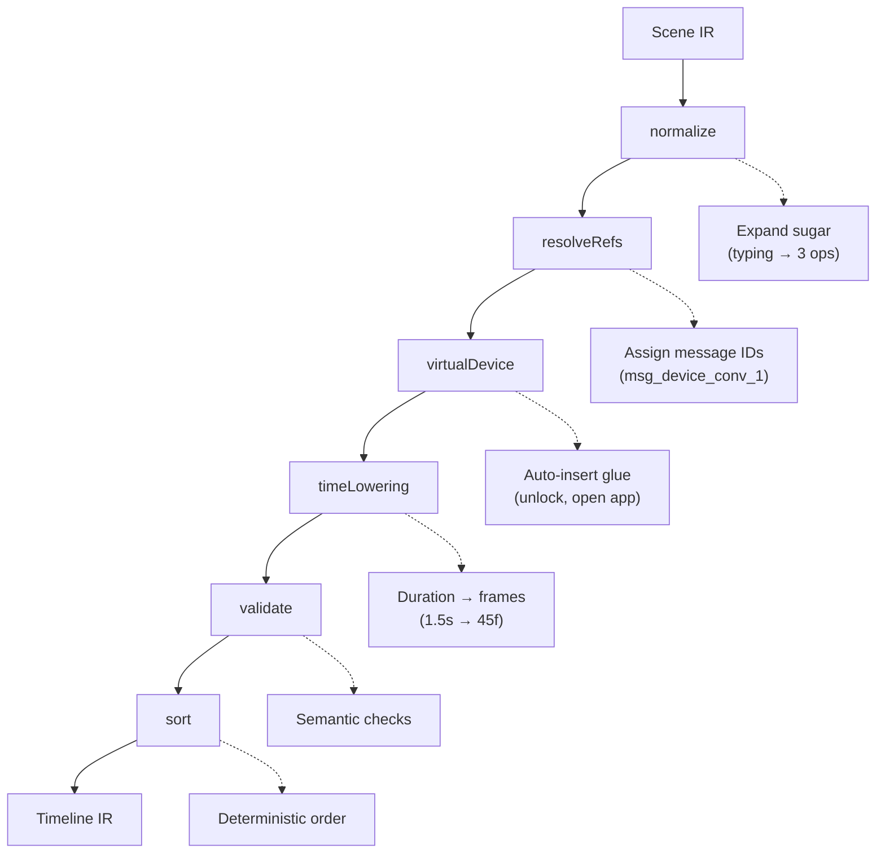

# Compiler Overview

import { Callout, Tabs, Tab } from 'nextra/components'

<Callout type="info">
**Pure transformation.** The compiler converts semantic Scene IR into frame-based Timeline IR. Same input = same output, always.
</Callout>

The Tokovo Compiler transforms **Scene IR** into **Timeline IR** through a series of pure passes.

---

## Quick Usage

```typescript
import { compile } from "@tokovo/compiler";

const { timeline, validation, durationInFrames } = compile(sceneIR, {
  mode: "lenient",  // or "strict"
  debug: true,
});

console.log(`Duration: ${durationInFrames} frames (${durationInFrames/30}s at 30fps)`);
console.log(`Events: ${timeline.ops.length}`);
```

---

## Pipeline Architecture



---

## Pass Details

<Tabs items={['normalize', 'resolveRefs', 'virtualDevice', 'timeLowering', 'validate', 'sort']}>
  <Tab>
    **Expands syntactic sugar to atomic operations.**

    ```typescript
    // Input (DSL sugar)
    b.typing("Bob").for("1.5s")

    // Output (3 separate ops)
    { kind: "TypingStart", actor: "Bob", conversationId: "dm_bob" }
    { kind: "Wait", duration: "1.5s" }
    { kind: "TypingEnd", actor: "Bob", conversationId: "dm_bob" }
    ```

    Also normalizes: `.receive()` → structured message, `.send()` → with sender "me".
  </Tab>
  <Tab>
    **Assigns stable, deterministic message IDs.**

    ```typescript
    // Before
    const msg = b.receive("Bob", "Hello");
    b.read(msg);

    // After resolveRefs
    msg._resolvedMessageId = "msg_AlicePhone_dm_bob_1"
    readOp.targetMessageId = "msg_AlicePhone_dm_bob_1"
    ```

    Pattern: `msg_{deviceId}_{conversationId}_{index}`
  </Tab>
  <Tab>
    **Tracks virtual device state and auto-inserts glue events.**

    ```typescript
    // Tracks this virtual state:
    {
      isLocked: true,
      foregroundAppId: undefined,
      activeConversationId: undefined,
    }

    // When you use b.receive() but device is locked,
    // auto-inserts at frame 0:
    { kind: "DeviceUnlocked" }
    { kind: "AppOpened", appId: "app_whatsapp" }
    { kind: "ConversationOpened", conversationId: "dm_bob" }
    ```
  </Tab>
  <Tab>
    **Converts durations to absolute frame numbers.**

    ```typescript
    // Input (Scene IR has durations)
    { kind: "Wait", duration: "1.5s" }
    { kind: "ReceiveMessage", text: "Hello" }

    // At 30 FPS: 1.5s = 45 frames
    // Output (Timeline IR has frames)
    { at: 0, kind: "Wait" }  // Cursor at 0
    { at: 45, kind: "MessageReceived", text: "Hello" }  // After wait
    ```

    Supports: `"1.5s"`, `"500ms"`, `"30f"` (frames), `"2b"` (beats).
  </Tab>
  <Tab>
    **Semantic correctness checks.**

    | Check | Strict Mode | Lenient Mode |
    |-------|-------------|--------------|
    | Read undelivered message | Error | Warning |
    | Delete non-existent message | Error | Warning |
    | Negative frame number | Error | Error |
    | Reference undefined conversation | Error | Warning |
    | Duplicate message ID | Error | Warning |
  </Tab>
  <Tab>
    **Canonical ordering for determinism.**

    ```typescript
    // Sort key: (at, phase, priority, trackId, sceneOpIndex)

    enum Phase {
      DEVICE = 0,   // unlock, lock
      NAV = 10,     // open app, navigate
      SETUP = 15,   // conversation setup
      APP = 20,     // messages, typing
      CAMERA = 25,  // camera events
      FX = 30,      // effects
    }
    ```

    Events at same frame always sort in same order.
  </Tab>
</Tabs>

---

## Complete Example

```typescript
import { compile } from "@tokovo/compiler";
import { episode } from "@tokovo/dsl";

// 1. Create Scene IR using DSL
const sceneIR = episode("demo", ep => {
  ep.config({ fps: 30 });
  
  ep.device("phone", "iphone16", d => {
    d.app("app_whatsapp");
    d.conversation("dm_alice", { name: "Alice" });
    
    d.beat("greeting", b => {
      b.wait("1s");
      b.typing("Alice").for("2s");
      b.receive("Alice", "Hey there!");
    });
  });
});

// 2. Compile to Timeline IR
const result = compile(sceneIR, { mode: "lenient" });

// 3. Inspect output
console.log("Duration:", result.durationInFrames, "frames");
console.log("Events:", result.timeline.ops.length);
console.log("Validation:", result.validation.errors);

// Example output:
// Duration: 120 frames
// Events: 8
// Validation: []
```

---

## Options

| Option | Default | Description |
|--------|---------|-------------|
| `mode` | `"lenient"` | `"strict"` throws on warnings |
| `debug` | `false` | Include trace info in output |
| `fps` | From `sceneIR.meta.fps` | Override FPS |
| `strict` | `false` | Alias for `mode: "strict"` |

---

## Output

```typescript
interface CompileResult {
  /** The compiled timeline */
  timeline: TimelineIR;
  
  /** Validation results (errors and warnings) */
  validation: ValidationResult;
  
  /** Total duration in frames */
  durationInFrames: number;
  
  /** Debug traces (if debug: true) */
  traces?: Trace[];
}

interface ValidationResult {
  errors: ValidationError[];
  warnings: ValidationWarning[];
  isValid: boolean;
}
```

---

## Debugging Compilation

```typescript
const result = compile(sceneIR, { debug: true });

// Check for errors
if (!result.validation.isValid) {
  console.error("Compilation errors:");
  result.validation.errors.forEach(e => {
    console.error(`  ${e.message} at ${e.location}`);
  });
}

// Inspect individual ops
result.timeline.ops.forEach(op => {
  console.log(`Frame ${op.at}: ${op.kind}`);
});
```

---

## Related

- [Scene IR](/ir/scene-ir) — Input format
- [Timeline IR](/ir/timeline-ir) — Output format
- [Compiler Passes](/compiler/passes) — Individual pass details

