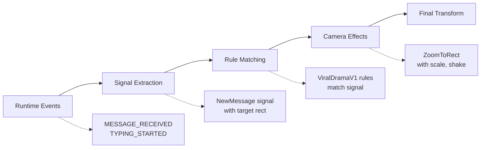

# DirectorLite Overview

import { Callout, Cards, Card } from 'nextra/components'

<Callout type="info">
<strong>Automatic cinematography.</strong> DirectorLite watches events and moves the camera. Writers focus on story, not camera positions.
</Callout>

DirectorLite is Tokovo's **automatic camera director**. It observes runtime events and applies cinematic camera effects without manual choreography.

---

## Philosophy

> "Don't tell writers about cameras. Let the drama drive the frame."

Writers focus on **story**. DirectorLite handles **cinematography**.

---

## How It Works



### Event → Signal → Rule → Effect → Transform

| Step | Input | Output |
|------|-------|--------|
| **Events** | `{ at: 45, type: "MESSAGE_RECEIVED" }` | Timeline event |
| **Signals** | Event + Layout | `{ type: "NewMessage", rect: {...} }` |
| **Rules** | Signal | Effect type + parameters |
| **Effects** | Rule match | `{ effect: "ZoomToRect", scale: 1.2 }` |
| **Transform** | Effect + progress | `{ translateX, translateY, scale }` |

---

## Enabling DirectorLite

```tsx
<TokovoRenderer
  world={world}
  t={frame}
  directorEnabled={true}   // Enable automatic camera
  directorDebug={true}     // Optional: log decisions
/>
```

---

## Relationship to Semantic Camera

<Callout type="warning">
<strong>DirectorLite vs Manual Camera:</strong> DirectorLite is automatic. For precise control, use the semantic camera system with `dsl.camera.anchorFocus()`.
</Callout>

| Approach | Use Case | Control Level |
|----------|----------|---------------|
| **DirectorLite** | Let events drive camera | Automatic |
| **Semantic Camera** | Specific dramatic moments | Manual |
| **Both** | General + overrides | Hybrid |

DirectorLite effects can be overridden by explicit camera events:

```typescript
// DirectorLite handles general movement
// Manual overrides for key moments
dsl.camera.anchorFocus(120, "lastMessage", "dramatic", 5);
```

---

## Key Properties

### Pure & Stateless

Same inputs → Same outputs. No accumulated state.

```typescript
const output1 = deriveDirectorEffects({ t: 45, signals, layout });
const output2 = deriveDirectorEffects({ t: 45, signals, layout });
// output1 === output2 (functionally identical)
```

### Scrubbing-Safe

Jump to any frame instantly. No state to reset.

### Cooldown-Aware

Won't spam zooms. Respects cooldowns per signal type:

```typescript
// Frame 45: NewMessage → ZoomToRect ✅
// Frame 55: NewMessage → SKIPPED (cooldown active)
// Frame 75: NewMessage → ZoomToRect ✅
```

---

## ViralDramaV1 Style

Current implementation uses a baked style optimized for **viral drama videos**:

| Signal | Effect | Scale | Shake |
|--------|--------|-------|-------|
| NewMessage | ZoomToRect | 1.2 | 0 |
| TypingStarted | PushIn | 1.08 | 0 |
| MessageDeleted | ShakeAndZoom | 1.15 | 4 |
| CallIncoming | Interrupt | 1.25 | 3 |

---

## Architecture

```
packages/core/src/director-lite/
├── types.ts      # Signal, Effect, Output types
├── signals.ts    # Extract signals from events
├── rules.ts      # ViralDramaV1 rule definitions
├── derive.ts     # Main pure function
└── index.ts      # Exports
```

---

## Debug Mode

Enable logging to understand decisions:

```tsx
<TokovoRenderer
  directorEnabled={true}
  directorDebug={true}
/>
```

Console output:
```
[DirectorLite] Frame 45: NewMessage → ZoomToRect (msg_1)
[DirectorLite] Frame 60: TypingStarted → PushIn (cooldown OK)
[DirectorLite] Frame 65: NewMessage → SKIPPED (cooldown 5 remaining)
```

---

## Related

<Cards>
  <Card title="Camera System" href="/architecture/camera">
    Semantic camera with manual control
  </Card>
  <Card title="Camera Workflow" href="/guides/camera-workflow">
    Practical patterns and anti-patterns
  </Card>
  <Card title="Rules Reference" href="/director/rules">
    Complete rule definitions
  </Card>
</Cards>

