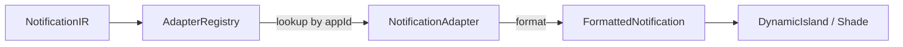

import { Callout, Steps, Tabs, Tab, FileTree } from 'nextra/components'

# Notification Adapters

Notification Adapters allow apps to customize how their notifications appear and behave. Each app can register an adapter that controls:

- **Formatting**: Custom icons, colors, preview rendering
- **Actions**: App-specific action handling
- **Measurement**: Height calculation for animations

## Architecture



## Creating an Adapter

<Steps>

### Define the Adapter

```typescript
// packages/apps-whatsapp/src/notification-adapter.ts
import { 
    NotificationAdapter, 
    NotificationAdapterRegistry, 
    Notification, 
    FormattedNotification 
} from "@tokovo/core";

const WHATSAPP_GREEN = "#25D366";

const whatsappAdapter: NotificationAdapter = {
    appId: "app_whatsapp",
    
    format(notification: Notification): FormattedNotification {
        return {
            title: notification.title,
            body: notification.body,
            icon: "💬",
            iconBackground: WHATSAPP_GREEN,
            accentColor: WHATSAPP_GREEN,
            preview: notification.preview,
            actions: notification.actions || [
                { id: "reply", label: "Reply" },
                { id: "mark_read", label: "Mark as Read" },
            ],
            sender: notification.metadata?.sender,
        };
    },
    
    handleAction(actionId: string, notification: Notification) {
        if (actionId === "reply") {
            return [{
                at: Date.now(),
                kind: "DEVICE",
                deviceId: notification.deviceId || "phone",
                type: "OPEN_APP",
                appId: "app_whatsapp",
            }];
        }
        return [];
    },
    
    measureHeight(notification: Notification, viewport: { width: number }) {
        let height = 180;
        if (notification.preview?.kind === "image") {
            height += 200;
        }
        return height;
    },
};

export { whatsappAdapter };
```

### Register the Adapter

```typescript
// At module initialization
NotificationAdapterRegistry.register(whatsappAdapter);
```

### Export from Package

```typescript
// packages/apps-whatsapp/src/index.ts
export * from "./notification-adapter";
```

</Steps>

## Interface Reference

### NotificationAdapter

```typescript
interface NotificationAdapter {
    /** App ID this adapter handles */
    appId: string;
    
    /** Format notification for display */
    format(notification: Notification): FormattedNotification;
    
    /** Handle action - returns events to emit */
    handleAction?(actionId: string, notification: Notification): TimelineEvent[];
    
    /** Measure height for deterministic layout */
    measureHeight?(notification: Notification, viewport: { width: number; height: number }): number;
}
```

### FormattedNotification

```typescript
interface FormattedNotification {
    title: string;
    body: string;
    icon?: string;
    iconBackground?: string;
    accentColor?: string;
    preview?: { 
        kind: "text" | "image" | "video"; 
        value: string; 
        aspectRatio?: number 
    };
    actions?: Array<{ id: string; label: string; icon?: string }>;
    sender?: { name: string; avatar?: string };
}
```

## Default Behavior

If no adapter is registered for an app, the registry provides default formatting:

```typescript
// Default formatting (no adapter)
{
    title: notification.title,
    body: notification.body,
    icon: notification.icon,
    preview: notification.preview,
    actions: notification.actions,
}
```

## Example Adapters

<Tabs items={['WhatsApp', 'Instagram', 'Uber']}>
<Tab>
```typescript
const whatsappAdapter: NotificationAdapter = {
    appId: "app_whatsapp",
    format: (n) => ({
        title: n.title,
        body: n.body,
        icon: "💬",
        iconBackground: "#25D366",
        accentColor: "#25D366",
    }),
};
```
</Tab>
<Tab>
```typescript
const instagramAdapter: NotificationAdapter = {
    appId: "app_instagram",
    format: (n) => ({
        title: n.title,
        body: n.body,
        icon: "📸",
        iconBackground: "#E1306C",
        accentColor: "#E1306C",
    }),
};
```
</Tab>
<Tab>
```typescript
const uberAdapter: NotificationAdapter = {
    appId: "app_uber",
    format: (n) => ({
        title: n.title,
        body: n.body,
        icon: "🚗",
        iconBackground: "#000000",
        accentColor: "#000000",
    }),
};
```
</Tab>
</Tabs>

## Best Practices

<Callout type="tip">
<strong>App-Specific Theming</strong>: Always use your app's brand colors for `iconBackground` and `accentColor`.
</Callout>

1. **Register early**: Adapters should be registered at module load time
2. **Keep formatting pure**: `format()` should have no side effects
3. **Handle all actions**: Implement `handleAction()` for any custom actions you define
4. **Measure accurately**: `measureHeight()` enables smooth animations

## Related

- [Notification IR](/ir/notification-ir) - Data model
- [Notification DSL](/dsl/notification-dsl) - Event creation
- [Creating an App](/guides/creating-an-app) - Full app setup
