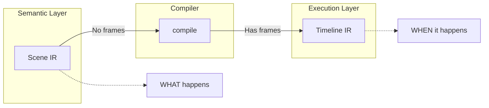

# IR Overview

import { Callout, Cards, Card } from 'nextra/components'

<Callout type="info">
<strong>IR = Source of Truth.</strong> Scene IR describes WHAT happens. Timeline IR describes WHEN (at which frame). The compiler transforms one to the other.
</Callout>

The Intermediate Representation (IR) is the **source of truth** between layers.

---

## Two IRs



| IR | Purpose | Has Frames? | Example |
|----|---------|-------------|---------|
| **Scene IR** | Semantic truth | No | `{ kind: "Wait", duration: "1.5s" }` |
| **Timeline IR** | Execution contract | Yes | `{ at: 45, kind: "MessageReceived" }` |

---

## Why Two IRs?

### Scene IR is Stable

Scene IR doesn't change when:
- FPS changes (30 → 60)
- Camera rules update
- Rendering engine changes
- App adapters evolve

This means your DSL scripts are **future-proof**.

### Timeline IR is Executable

Timeline IR is the frame-by-frame plan:
- Every event has an `at` frame number
- Sorted deterministically
- Ready for the engine's `replay()` function

---

## Package Structure

```
packages/ir/src/
├── semantic.ts    # EpisodeConfig, SemanticMeta, BeatMeta, Mood
├── trace.ts       # Debug traces with source locations
├── scene.ts       # SceneIR, SceneOp, Beat, DeviceScene
├── timeline.ts    # TimelineIR, TimelineOp types
├── ordering.ts    # Phase, Priority for deterministic sorting
├── validate.ts    # IR validation utilities
├── constraints.ts # Narrative constraint checking
└── index.ts       # All exports
```

---

## Type Imports

```typescript
// Scene IR types
import {
  SceneIR,
  SceneOp,
  WaitOp,
  TypingStartOp,
  SendMessageOp,
  ReceiveMessageOp,
  Beat,
  DeviceScene,
  EpisodeMeta,
} from "@tokovo/ir";

// Timeline IR types
import {
  TimelineIR,
  TimelineOp,
  MessageReceivedOp,
  Phase,
} from "@tokovo/ir";

// Semantic types (for AI-readable metadata)
import {
  SemanticMeta,
  BeatMeta,
  Mood,
} from "@tokovo/ir";

// Utilities
import {
  parseDuration,
  messageRef,
} from "@tokovo/ir";
```

---

## Design Principles

### 1. Readonly Everywhere

All IR types enforce immutability:

```typescript
interface SceneOp {
  readonly kind: string;
  readonly _trace?: Trace;
}
```

### 2. Discriminated Unions

Operations use `kind` for type-safe switching:

```typescript
type SceneOp =
  | WaitOp          // kind: "Wait"
  | TypingStartOp   // kind: "TypingStart"
  | SendMessageOp   // kind: "SendMessage"
  | ReceiveMessageOp
  // ...

// Type-safe switching
switch (op.kind) {
  case "Wait":
    // TypeScript knows op is WaitOp
    console.log(op.duration);
    break;
  case "SendMessage":
    // TypeScript knows op is SendMessageOp
    console.log(op.text);
    break;
}
```

### 3. No Optional Hell

Required fields are required. Optional only when truly optional.

---

## Explore IR Types

<Cards>
  <Card title="Scene IR" href="/ir/scene-ir">
    Semantic operations (WHAT happens)
  </Card>
  <Card title="Timeline IR" href="/ir/timeline-ir">
    Frame-based events (WHEN it happens)
  </Card>
  <Card title="Constraints" href="/ir/constraints">
    Narrative validation rules
  </Card>
  <Card title="Traces" href="/ir/trace">
    Debug source tracking
  </Card>
</Cards>

