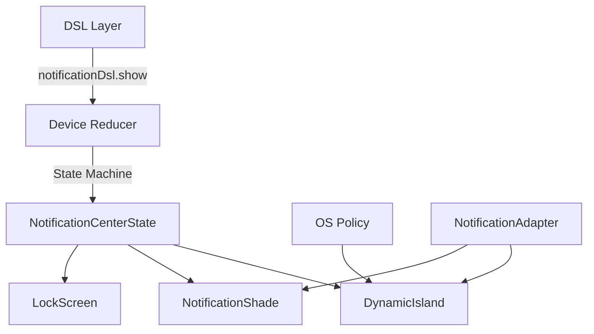

import { Callout, Tabs, Tab, FileTree, Steps } from 'nextra/components'

# Notification IR

The Notification IR (Intermediate Representation) provides a complete, production-grade model for managing notifications across iOS and Android platforms. It captures the full notification lifecycle, OS policy rules, and interaction semantics.

<Callout type="info">
The Notification IR was designed to be **platform-agnostic** at the core, with platform-specific policies applied at render time.
</Callout>

## Architecture Overview



## NotificationIR Interface

The core `NotificationIR` interface captures everything about a notification:

```typescript
export interface NotificationIR {
    id: string;
    appId: string;
    deviceId?: string;
    
    // Content
    title: string;
    body: string;
    icon?: string;
    preview?: { kind: "text" | "image" | "video"; value: string; aspectRatio?: number };
    actions?: Array<{ id: string; label: string; icon?: string; destructive?: boolean }>;
    replyable?: boolean;
    
    // Lifecycle
    state: "queued" | "delivered" | "headsUp" | "inShade" | "dismissed";
    at: number;
    deliveredAt?: number;
    dismissedAt?: number;
    
    // HeadsUp timing
    headsUp?: {
        shownAt: number;
        duration: number;
        hideAt?: number;
    };
    
    // Grouping
    groupKey?: string;
    threadId?: string;
    
    // Priority
    priority: "passive" | "active" | "timeSensitive" | "critical";
    mode?: "lockscreen" | "headsup" | "both" | "silent";
    
    // Metadata
    metadata?: Record<string, any>;
}
```

## Lifecycle State Machine

Notifications progress through a deterministic state machine:

```
            ┌─────────┐
            │ queued  │ ──────────────────────┐
            └────┬────┘                       │
                 │ deliverWhen satisfied      │
                 ▼                            │
            ┌─────────┐                       │
            │delivered│                       │
            └────┬────┘                       │
                 │ priority != passive        │
                 ▼                            │
            ┌─────────┐                       │
            │ headsUp │  ◄── Shows in         │
            └────┬────┘      Dynamic Island   │
                 │ duration expires           │
                 ▼                            │
            ┌─────────┐                       │
            │ inShade │  ◄── Notification     │
            └────┬────┘      center           │
                 │                            │
                 ▼                            │
            ┌─────────┐ ◄─────────────────────┘
            │dismissed│   user dismisses or
            └─────────┘   app clears
```

## OS Policy Rules

Platform-specific policies determine notification behavior:

### iOS Policy

```typescript
export const IOS_NOTIFICATION_POLICY: NotificationPolicyIR = {
    maxHeadsUpVisible: 1,
    headsUpDurationByPriority: {
        passive: 0,           // No headsUp
        active: 90,           // 3 seconds
        timeSensitive: 150,   // 5 seconds
        critical: 240,        // 8 seconds
    },
    replaceOnNewFromSameThread: true,
    groupCollapseThreshold: 3,
    autoGroupByApp: true,
    statusBarIconLimit: 0,    // iOS doesn't show status bar icons
    expandDurationMs: 300,
};
```

### Android Policy

```typescript
export const ANDROID_NOTIFICATION_POLICY: NotificationPolicyIR = {
    maxHeadsUpVisible: 1,
    headsUpDurationByPriority: {
        passive: 0,
        active: 120,          // 4 seconds
        timeSensitive: 180,   // 6 seconds
        critical: 300,        // 10 seconds
    },
    replaceOnNewFromSameThread: true,
    groupCollapseThreshold: 5,
    autoGroupByApp: false,
    statusBarIconLimit: 5,    // Android shows up to 5 icons
    expandDurationMs: 200,
};
```

## Priority Levels

| Priority | HeadsUp | Sound | Vibrate | Use Case |
|----------|---------|-------|---------|----------|
| `passive` | No | No | No | Silent updates, weather |
| `active` | Yes | Yes | Yes | Messages, social |
| `timeSensitive` | Yes (longer) | Yes | Yes | Uber arriving, alarms |
| `critical` | Yes (longest) | Yes | Yes | Emergency alerts |

## Display Modes

| Mode | HeadsUp | LockScreen | Shade |
|------|---------|------------|-------|
| `headsup` | ✅ | ❌ | ✅ |
| `lockscreen` | ❌ | ✅ | ✅ |
| `both` | ✅ | ✅ | ✅ |
| `silent` | ❌ | ❌ | ✅ |

## NotificationCenterState

The device maintains notification state:

```typescript
export interface NotificationCenterState {
    items: NotificationIR[];
    headsUp: string | null;        // Currently displayed notification ID
    headsUpQueue: string[];        // Pending headsUp notifications
    groups: NotificationGroup[];   // Collapsed groups
}
```

## Related Documentation

- [Notification DSL](/dsl/notification-dsl) - Event creation helpers
- [Notification Adapters](/guides/notification-adapters) - App-specific formatting
- [Dynamic Island](/architecture/dynamic-island) - iOS rendering
