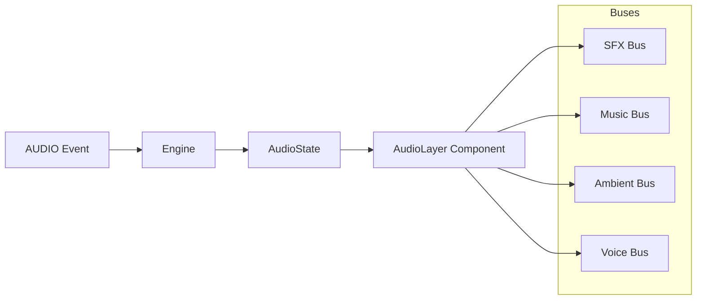

import { Callout, Tabs, Tab } from 'nextra/components'

# Audio System

The Audio System manages all audio playback in Tokovo, including sound effects, music, and ambient audio. It uses a bus-based architecture for mixing and provides deterministic audio timing.

## Architecture



## AudioState

The world state includes audio configuration:

```typescript
interface AudioState {
    /** Currently active sounds keyed by ID */
    activeSounds: Record<string, ActiveSound>;
    
    /** Bus configuration */
    buses: BusConfig;
}

interface ActiveSound {
    id: string;
    src: string;
    bus: "sfx" | "music" | "ambient" | "voice";
    startFrame: number;
    volume: number;
    loop?: boolean;
    fadeIn?: number;
    fadeOut?: number;
}

interface BusConfig {
    sfx: { volume: number; muted: boolean };
    music: { volume: number; muted: boolean };
    ambient: { volume: number; muted: boolean };
    voice: { volume: number; muted: boolean };
    master: { volume: number; muted: boolean };
}
```

## Default Bus Configuration

```typescript
export const DEFAULT_BUS_CONFIG: BusConfig = {
    sfx: { volume: 1.0, muted: false },
    music: { volume: 0.8, muted: false },
    ambient: { volume: 0.5, muted: false },
    voice: { volume: 1.0, muted: false },
    master: { volume: 1.0, muted: false },
};
```

## Audio Events

### PLAY_SOUND

```typescript
{
    at: 100,
    kind: "AUDIO",
    type: "PLAY_SOUND",
    soundId: "notification_ding",
    src: "/sounds/notification.mp3",
    bus: "sfx",
    volume: 0.8,
    loop: false,
}
```

### STOP_SOUND

```typescript
{
    at: 200,
    kind: "AUDIO",
    type: "STOP_SOUND",
    soundId: "notification_ding",
    fadeOut: 30, // frames to fade out
}
```

### SET_BUS_VOLUME

```typescript
{
    at: 150,
    kind: "AUDIO",
    type: "SET_BUS_VOLUME",
    bus: "music",
    volume: 0.5,
}
```

### MUTE_BUS

```typescript
{
    at: 200,
    kind: "AUDIO",
    type: "MUTE_BUS",
    bus: "ambient",
    muted: true,
}
```

## AudioLayer Component

The `AudioLayer` component renders all active sounds:

```tsx
import { Audio, staticFile } from "remotion";

export const AudioLayer: React.FC<{ audio: AudioState; t: number }> = ({
    audio,
    t,
}) => {
    return (
        <>
            {Object.values(audio.activeSounds).map(sound => {
                const elapsed = t - sound.startFrame;
                if (elapsed < 0) return null;
                
                const busVolume = audio.buses[sound.bus]?.volume ?? 1;
                const masterVolume = audio.buses.master?.volume ?? 1;
                const finalVolume = sound.volume * busVolume * masterVolume;
                
                return (
                    <Audio
                        key={sound.id}
                        src={staticFile(sound.src)}
                        volume={finalVolume}
                        startFrom={0}
                        loop={sound.loop}
                    />
                );
            })}
        </>
    );
};
```

## Sound Effects Registry

Common sound effects are defined in `sounds.ts`:

```typescript
export const SOUNDS = {
    // WhatsApp
    whatsapp_send: "/sounds/whatsapp/send.mp3",
    whatsapp_receive: "/sounds/whatsapp/receive.mp3",
    whatsapp_typing: "/sounds/whatsapp/typing.mp3",
    
    // Notifications
    notification_default: "/sounds/notification/default.mp3",
    notification_ios: "/sounds/notification/ios.mp3",
    notification_android: "/sounds/notification/android.mp3",
    
    // UI
    ui_tap: "/sounds/ui/tap.mp3",
    ui_swipe: "/sounds/ui/swipe.mp3",
    
    // Calls
    call_ringtone: "/sounds/call/ringtone.mp3",
    call_hangup: "/sounds/call/hangup.mp3",
};
```

## Usage Example

```typescript
import { SOUNDS } from "@tokovo/core";

const events = [
    // Play notification sound
    {
        at: 100,
        kind: "AUDIO",
        type: "PLAY_SOUND",
        soundId: "notif_1",
        src: SOUNDS.notification_ios,
        bus: "sfx",
        volume: 1.0,
    },
    
    // Start background music
    {
        at: 0,
        kind: "AUDIO",
        type: "PLAY_SOUND",
        soundId: "bg_music",
        src: "/sounds/ambient/lofi.mp3",
        bus: "music",
        volume: 0.6,
        loop: true,
    },
    
    // Duck music when notification plays
    {
        at: 100,
        kind: "AUDIO",
        type: "SET_BUS_VOLUME",
        bus: "music",
        volume: 0.3,
    },
    
    // Restore music volume
    {
        at: 150,
        kind: "AUDIO",
        type: "SET_BUS_VOLUME",
        bus: "music",
        volume: 0.6,
    },
];
```

## Best Practices

<Callout type="tip">
**Deterministic Audio**: All audio events use frame numbers, ensuring consistent playback across renders.
</Callout>

1. **Use buses appropriately**: Route sounds to the correct bus for proper mixing
2. **Duck background audio**: Lower music volume when important sounds play
3. **Consider mobile speakers**: Test with various volume levels
4. **Fade transitions**: Use `fadeIn`/`fadeOut` for smooth audio transitions

## Related

- [Events](/runtime/events) - Event system
- [WorldState](/runtime/world-state) - State structure
