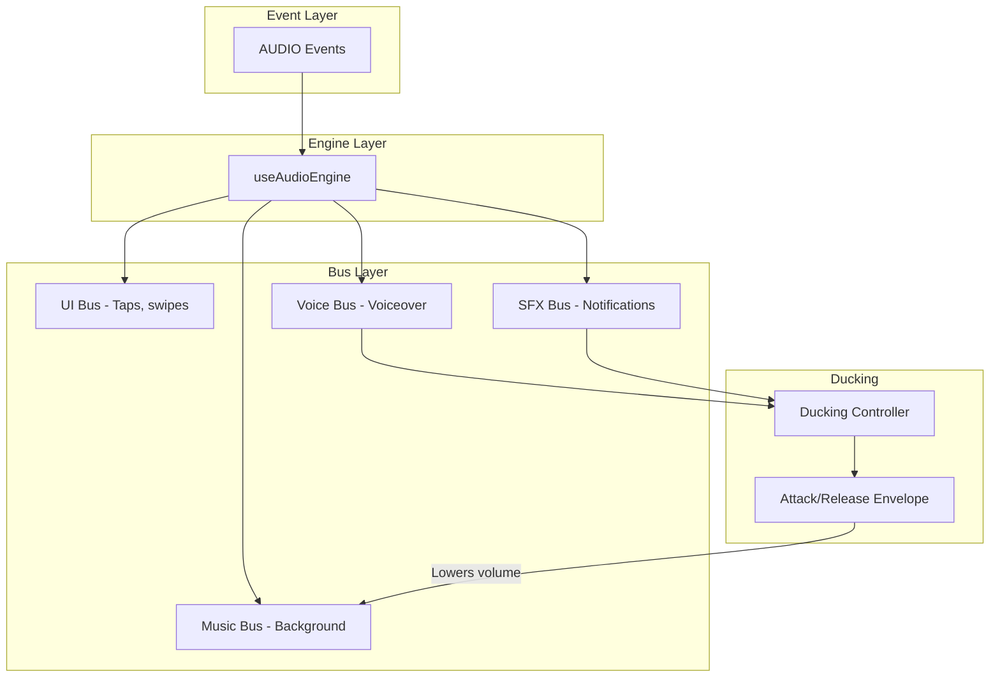

import { Callout, Tabs, Tab } from 'nextra/components'

# Audio System

<Callout type="info">
<strong>Professional audio mixing.</strong> Tokovo uses bus-based routing with automatic ducking, attack/release envelopes, and frame-perfect timing.
</Callout>

The Audio System manages all audio playback in Tokovo, including sound effects, music, and ambient audio. It uses a bus-based architecture for mixing and provides deterministic audio timing.

---

## Architecture



---

## Audio Buses

| Bus | Priority | Volume | Use Case |
|-----|----------|--------|----------|
| `ui` | 1 (highest) | 1.0 | Taps, keyboard clicks, swipes |
| `sfx` | 2 | 1.0 | Notifications, message sounds |
| `voice` | 3 | 1.0 | Voiceover, speech |
| `music` | 4 (lowest) | 0.7 | Background music, ambient |
| `master` | N/A | 1.0 | Overall volume multiplier |

### Bus Priority and Ducking

Higher priority buses **duck** lower priority buses:

```typescript
// When voice plays, music ducks to 30%
// When SFX plays, music ducks to 50%
const DUCKING_RULES = {
  voice: { targets: ['music'], amount: 0.3 },
  sfx: { targets: ['music'], amount: 0.5 },
  ui: { targets: ['music'], amount: 0.7 },
};
```

---

## Ducking System

<Callout type="warning">
<strong>Ducking is automatic.</strong> When higher-priority sounds play, lower-priority buses automatically reduce volume with configurable attack/release curves.
</Callout>

### Attack/Release Envelope

```typescript
interface DuckingEnvelope {
  attackFrames: number;   // Frames to reach duck level (fast: 3-6)
  releaseFrames: number;  // Frames to return to normal (slow: 15-30)
  holdFrames: number;     // Minimum frames to hold duck
}

const DEFAULT_DUCKING: DuckingEnvelope = {
  attackFrames: 4,    // Quick attack (133ms at 30fps)
  releaseFrames: 20,  // Slow release (667ms at 30fps)
  holdFrames: 10,     // Hold for at least 333ms
};
```

### How Ducking Works

```
Volume
  1.0 ├────┐                    ┌────────
      │    │                    │
  0.5 │    └───────────────────┘
      │    ↑        ↑           ↑
      └────────────────────────────────▶ time
           attack  hold        release
           (4f)    (sound)     (20f)
```

---

## AudioState

The world state includes audio configuration:

```typescript
interface AudioState {
  /** Currently active sounds keyed by ID */
  activeSounds: Record<string, ActiveSound>;
  
  /** Bus configuration */
  buses: BusConfig;
  
  /** Background music (if any) */
  musicBed?: MusicBed;
  
  /** Ducking state per bus */
  duckingState: Record<string, DuckingState>;
}

interface ActiveSound {
  id: string;
  src: string;
  bus: "ui" | "sfx" | "music" | "voice";
  startFrame: number;
  volume: number;
  loop?: boolean;
  fadeIn?: number;   // Frames
  fadeOut?: number;  // Frames
  durationFrames?: number;
}

interface BusConfig {
  ui: { volume: number; muted: boolean };
  sfx: { volume: number; muted: boolean };
  music: { volume: number; muted: boolean };
  voice: { volume: number; muted: boolean };
  master: { volume: number; muted: boolean };
}
```

---

## DSL Event Factories

Use the `dsl.audio` module for convenient audio control:

```typescript
import { dsl } from "@tokovo/dsl";

const events = [
  // Play sound on UI bus
  dsl.audio.play(0, "tap.mp3", { bus: "ui", volume: 0.8 }),
  
  // Play notification (ducks music automatically)
  dsl.audio.play(60, "notification.mp3", { bus: "sfx" }),
  
  // Start looping background music
  dsl.audio.backgroundMusic(0, "lofi.mp3", { volume: 0.6 }),
  
  // Fade out music over 30 frames
  dsl.audio.fade(180, "music", { to: 0, duration: 30 }),
  
  // Stop a specific sound
  dsl.audio.stop(200, "notification.mp3", { fadeOut: 15 }),
];
```

### Available Functions

| Function | Parameters | Description |
|----------|------------|-------------|
| `play(frame, src, opts)` | `bus`, `volume`, `loop`, `fadeIn` | Play single sound |
| `stop(frame, id, opts)` | `fadeOut` | Stop specific sound |
| `backgroundMusic(frame, src, opts)` | `volume` | Start looping music |
| `fade(frame, bus, opts)` | `to`, `duration` | Fade bus volume |
| `mute(frame, bus)` | - | Mute specific bus |
| `unmute(frame, bus)` | - | Unmute specific bus |

---

## Raw Audio Events

<Tabs items={['PLAY_SOUND', 'STOP_SOUND', 'SET_BUS_VOLUME', 'MUTE_BUS']}>
  <Tab>
```typescript
{
  at: 100,
  kind: "AUDIO",
  type: "PLAY_SOUND",
  soundId: "notification_ding",
  src: "/sounds/notification.mp3",
  bus: "sfx",
  volume: 0.8,
  loop: false,
  fadeIn: 0,
}
```
  </Tab>
  <Tab>
```typescript
{
  at: 200,
  kind: "AUDIO",
  type: "STOP_SOUND",
  soundId: "notification_ding",
  fadeOut: 30,  // frames
}
```
  </Tab>
  <Tab>
```typescript
{
  at: 150,
  kind: "AUDIO",
  type: "SET_BUS_VOLUME",
  bus: "music",
  volume: 0.5,
}
```
  </Tab>
  <Tab>
```typescript
{
  at: 200,
  kind: "AUDIO",
  type: "MUTE_BUS",
  bus: "music",
  muted: true,
}
```
  </Tab>
</Tabs>

---

## Sound Effects Registry

Common sound effects are defined in app plugins:

```typescript
// From @tokovo/apps-whatsapp
sounds: {
  "message_in": "whatsapp-received.mp3",
  "message_out": "whatsapp-sent.mp3",
  "typing": "whatsapp-typing.mp3",
}

// Usage
PluginManager.getSound("app_whatsapp", "message_in")
// → "whatsapp-received.mp3"
```

---

## Complete Usage Example

```typescript
import { dsl } from "@tokovo/dsl";

const events = [
  // Start background music (loops)
  dsl.audio.backgroundMusic(0, "/sounds/ambient/lofi.mp3", { volume: 0.7 }),
  
  // Message received - notification ducks music automatically
  dsl.messages.receive(60, "conv_1", "Alice", "Hey!"),
  dsl.audio.play(60, "/sounds/whatsapp/receive.mp3", { bus: "sfx" }),
  
  // User types response - keyboard on UI bus
  dsl.keyboard.show(120, "phone"),
  // (Keyboard clicks auto-play from keyboard events)
  
  // Message sent
  dsl.messages.send(180, "conv_1", "Hi there!"),
  dsl.audio.play(180, "/sounds/whatsapp/send.mp3", { bus: "sfx" }),
  
  // Incoming call - switch music for ringtone
  dsl.audio.fade(240, "music", { to: 0.2, duration: 15 }),
  dsl.audio.play(240, "/sounds/call/ringtone.mp3", { bus: "sfx", loop: true }),
  
  // Call answered - stop ringtone
  dsl.call.answer(300),
  dsl.audio.stop(300, "ringtone", { fadeOut: 10 }),
];
```

---

## Best Practices

<Callout type="tip">
<strong>Frame-perfect audio.</strong> All audio events use frame numbers (not timestamps), ensuring consistent playback across renders.
</Callout>

1. **Use buses appropriately** — Route UI sounds to `ui`, notifications to `sfx`
2. **Let ducking work** — Don't manually lower music; the system handles it
3. **Fade transitions** — Use `fadeIn`/`fadeOut` for smooth transitions (15-30 frames)
4. **Test on mobile speakers** — Videos often play on phone speakers
5. **Match app sounds** — Use accurate WhatsApp/iOS sounds for authenticity

---

## Debugging Audio

| Symptom | Cause | Fix |
|---------|-------|-----|
| No sound | Wrong bus or muted | Check `buses.{bus}.muted` |
| Too quiet | Ducking active | Check if voice/sfx playing |
| Distorted | Volume > 1 | Clamp volumes to 1.0 max |
| Cuts off | No loop flag | Set `loop: true` for music |
| Timing off | Wrong frame | Verify `at` frame number |

---

## Related

- [Events](/runtime/events) - Event system
- [WorldState](/runtime/world-state) - State structure
- [Renderer Engines](/architecture/renderer-engines) - useAudioEngine

