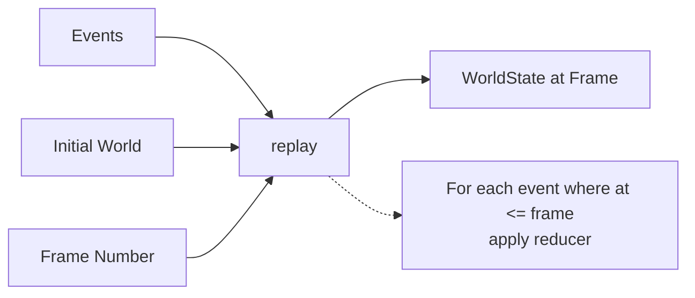

# Engine

import { Callout } from 'nextra/components'

<Callout type="info">
<strong>Pure reducer.</strong> The engine processes events into world state. Same events + same initial state = same world, every time. This is what makes scrubbing work.
</Callout>

The Engine is a **pure reducer** that processes events into world state.

---

## How It Works



---

## Core Function: replay()

```typescript
import { replay } from "@tokovo/core";

// Compute world state at any frame
const world = replay(initialWorld, events, frame);

// The engine applies all events where event.at <= frame
```

---

## WorldState

Complete snapshot of everything:

```typescript
interface WorldState {
  // All devices and their state
  devices: Record<string, DeviceState>;
  
  // Camera state
  camera: CameraState;
  
  // Audio state
  audio: AudioState;
  
  // Internal: last processed event frame
  _eventCursor: number;
}
```

## DeviceState

Per-device state:

```typescript
interface DeviceState {
  deviceId: string;
  profileId: string;
  isLocked: boolean;
  foregroundAppId?: string;
  apps: Record<string, AppState>;
}
```

## AppState (WhatsApp)

```typescript
interface WhatsAppState {
  screen: "home" | "chat";
  activeConversationId?: string;
  conversations: Record<string, ConversationState>;
}

interface ConversationState {
  id: string;
  name: string;
  messages: Message[];
  typingUsers: Set<string>;
}

interface Message {
  id: string;
  from: string;
  text: string;
  status: "sending" | "sent" | "delivered" | "read";
  timestamp: string;
}
```

## Reducer Pattern

```typescript
function reduceEvent(state: WorldState, event: RuntimeEvent): WorldState {
  switch (event.kind) {
    case "DEVICE":
      return reduceDeviceEvent(state, event);
    case "APP":
      return reduceAppEvent(state, event);
    case "CAMERA":
      return reduceCameraEvent(state, event);
    default:
      return state;
  }
}

function reduceDeviceEvent(state: WorldState, event: DeviceEvent): WorldState {
  switch (event.type) {
    case "UNLOCK":
      return {
        ...state,
        devices: {
          ...state.devices,
          [event.deviceId]: {
            ...state.devices[event.deviceId],
            isLocked: false,
          }
        }
      };
    // ... other cases
  }
}
```

## Pure by Design

The reducer is **pure**:

```typescript
// Same inputs → Same outputs
const world1 = reduceEvent(state, event);
const world2 = reduceEvent(state, event);
expect(world1).toEqual(world2);
```

No mutation:

```typescript
// ❌ Never mutate
state.devices[deviceId].isLocked = false;

// ✅ Always return new objects
return {
  ...state,
  devices: {
    ...state.devices,
    [deviceId]: {
      ...state.devices[deviceId],
      isLocked: false,
    }
  }
};
```

## Building World at Frame

```typescript
function buildWorldAtFrame(
  initialWorld: WorldState,
  events: RuntimeEvent[],
  frame: number
): WorldState {
  let world = { ...initialWorld, _eventCursor: -1 };
  
  for (const event of events) {
    if (event.at <= frame) {
      world = reduceEvent(world, event);
    }
  }
  
  return { ...world, _eventCursor: frame };
}
```

## Scrubbing Support

Because the reducer is pure, scrubbing works:

```typescript
// Forward
const world100 = buildWorldAtFrame(init, events, 100);

// Jump backward (from scratch)
const world50 = buildWorldAtFrame(init, events, 50);

// Same result as stepping through
const worldStepped = step(step(step(/*...*/)));
expect(world50).toEqual(worldStepped);
```

## Event Processing Examples

### UNLOCK

```typescript
case "UNLOCK":
  return updateDevice(state, event.deviceId, {
    isLocked: false,
  });
```

### MESSAGE_RECEIVED

```typescript
case "MESSAGE_RECEIVED":
  return updateConversation(state, event, conv => ({
    ...conv,
    messages: [
      ...conv.messages,
      {
        id: event.message.id,
        from: event.from,
        text: event.message.text,
        status: event.from === "me" ? "sent" : "delivered",
        timestamp: event.message.timestamp,
      }
    ]
  }));
```

### TYPING_START

```typescript
case "TYPING_START":
  return updateConversation(state, event, conv => ({
    ...conv,
    typingUsers: new Set([...conv.typingUsers, event.from]),
  }));
```

### MESSAGE_READ

```typescript
case "MESSAGE_READ":
  return updateConversation(state, event, conv => ({
    ...conv,
    messages: conv.messages.map(msg =>
      msg.id === event.messageId
        ? { ...msg, status: "read" }
        : msg
    )
  }));
```

## Initial World

```typescript
function createInitialWorld(sceneIR: SceneIR): WorldState {
  const devices: Record<string, DeviceState> = {};
  
  for (const device of sceneIR.devices) {
    devices[device.deviceId] = {
      deviceId: device.deviceId,
      profileId: device.profileId,
      isLocked: true,  // Starts locked
      apps: {},
    };
  }
  
  return {
    devices,
    camera: createInitialCamera(),
    audio: createInitialAudio(),
    _eventCursor: -1,
  };
}
```
