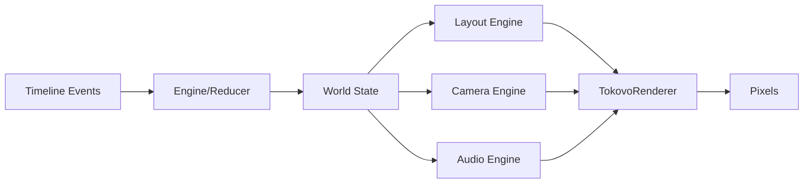

# Runtime Overview

import { Callout, Cards, Card } from 'nextra/components'

<Callout type="info">
<strong>Stories → Pixels.</strong> The runtime executes events and renders frames. It's deterministic: same events always produce the same video.
</Callout>

The runtime is where stories become pixels. It executes events and renders frames.

---

## Architecture



### 3 Renderer Engines

| Engine | Responsibility |
|--------|----------------|
| **Layout Engine** | View kind detection, device positions, app sizing |
| **Camera Engine** | Transforms, anchors, DirectorLite, smoothing |
| **Audio Engine** | Bus states, ducking, active sounds |

> TokovoRenderer just paints — no computation. Engines do all the heavy lifting.

---

## The Engine

The engine is a pure reducer:

```typescript
function reduceEvent(state: WorldState, event: RuntimeEvent): WorldState
```

Given a state and event, produces a new state. No side effects.

## World State

Complete snapshot of everything at a point in time:

```typescript
interface WorldState {
  devices: Record<string, DeviceState>;
  camera: CameraState;
  audio: AudioState;
  _eventCursor: number;  // Current timeline position
}
```

## Event Processing

```typescript
// Build world at frame t
function buildWorldAtFrame(
  initialWorld: WorldState,
  events: RuntimeEvent[],
  frame: number
): WorldState {
  let world = initialWorld;
  
  for (const event of events) {
    if (event.at <= frame) {
      world = reduceEvent(world, event);
    }
  }
  
  return world;
}
```

## Rendering with Remotion

```tsx
import { TokovoRenderer } from "@tokovo/renderer";
import { useCurrentFrame } from "remotion";

export const MyVideo: React.FC = () => {
  const frame = useCurrentFrame();
  
  const world = useMemo(() => 
    buildWorldAtFrame(initialWorld, events, frame),
    [frame]
  );

  return (
    <TokovoRenderer
      world={world}
      t={frame}
      eventIndex={eventIndex}
      directorEnabled={true}
    />
  );
};
```

## Event Index

For DirectorLite, create an event index:

```typescript
const eventIndex = new Map<number, RuntimeEvent[]>();

for (const event of events) {
  const bucket = eventIndex.get(event.at) || [];
  bucket.push(event);
  eventIndex.set(event.at, bucket);
}
```

This enables O(1) lookup of events at any frame.

## Determinism Guarantee

The runtime is completely deterministic:

1. Same events → Same world state
2. Same world state → Same render
3. Same render → Same pixels

This enables:
- **Scrubbing** — Jump to any frame instantly
- **Golden tests** — Compare output frame-by-frame
- **Reproducibility** — AI can generate and test reliably

## TokovoRenderer Props

```typescript
interface TokovoRendererProps {
  // Required
  world: WorldState;        // Current world state
  t: number;                // Current frame

  // Optional
  eventIndex?: Map<number, RuntimeEvent[]>; // For DirectorLite
  directorEnabled?: boolean;  // Enable auto-camera
  directorDebug?: boolean;    // Log camera decisions
  viewportWidth?: number;     // Override viewport
  viewportHeight?: number;
}
```

## Complete Example

```tsx
import { Composition } from "remotion";
import { episode } from "@tokovo/dsl";
import { compile } from "@tokovo/compiler";
import { adapterRegistry } from "@tokovo/adapters";

// 1. Define story
const sceneIR = episode("demo", ep => {
  ep.device("Phone", d => {
    d.conversation("dm_friend");
    d.beat("hello", b => {
      b.receive("Friend", "Hey!");
    });
  });
});

// 2. Compile
const { timeline } = compile(sceneIR);

// 3. Lower to runtime events
const events = adapterRegistry.lowerAll(timeline);

// 4. Create initial world
const initialWorld = createInitialWorld(sceneIR);

// 5. Render
export const DemoVideo: React.FC = () => {
  const frame = useCurrentFrame();
  const world = buildWorldAtFrame(initialWorld, events, frame);
  
  return (
    <TokovoRenderer
      world={world}
      t={frame}
      directorEnabled={true}
    />
  );
};
```
