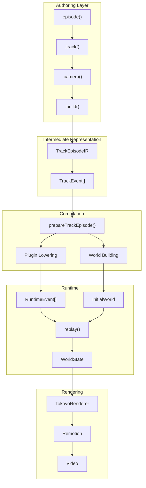
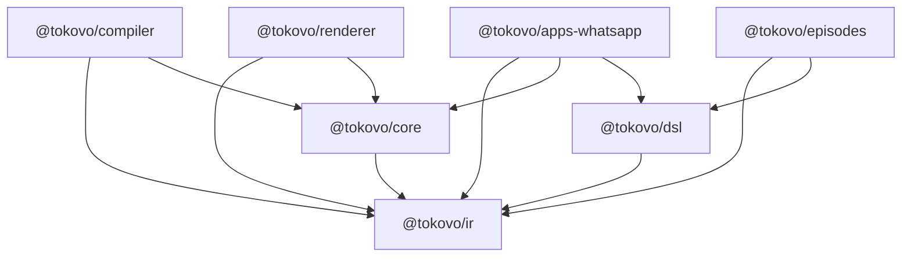
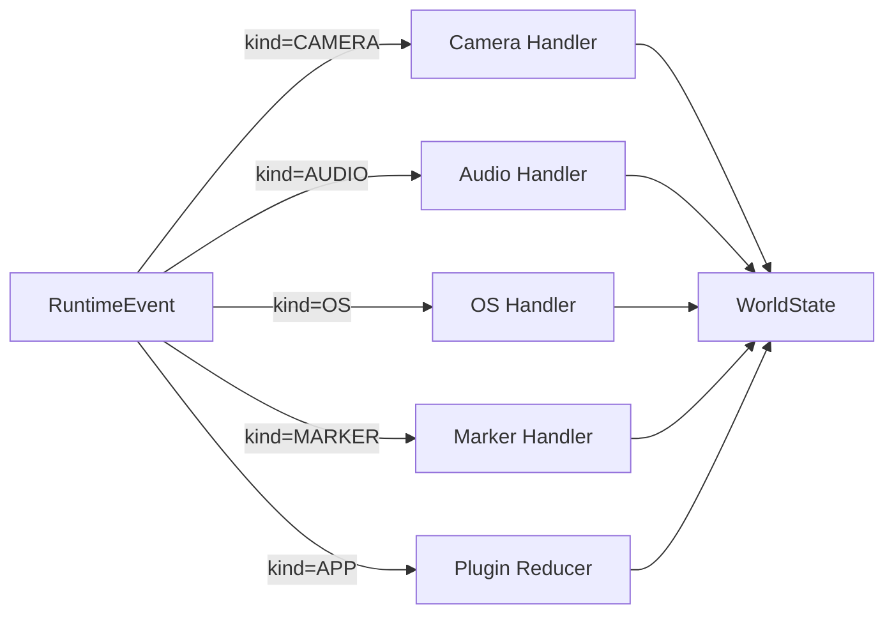
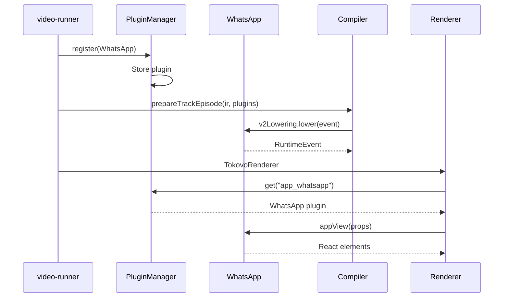
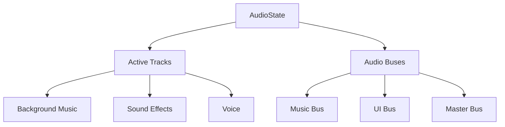
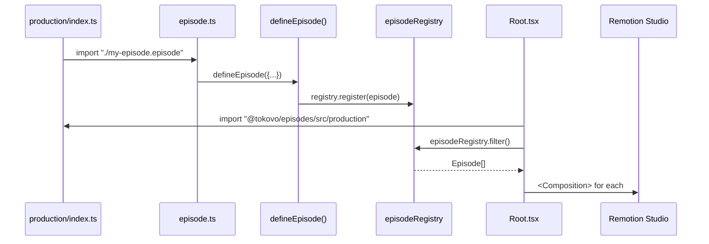

# Tokovo Architecture

> **Complete system architecture with data flow, patterns, and dependencies.**

---

## High-Level Pipeline



---

## Package Dependencies



---

## Data Structures

### TrackEpisodeIR (DSL Output)

```typescript
{
    id: "my-episode",
    fps: 30,
    durationInFrames: 900,
    devices: [
        { id: "phone", profile: "iphone16", app: "app_whatsapp" }
    ],
    events: [
        { at: 60, kind: "CAMERA", type: "ANIMATE_START", payload: { scale: 1.2 } },
        { at: 90, kind: "APP", appId: "app_whatsapp", type: "MESSAGE", payload: {...} }
    ],
    markers: [{ id: "intro_end", frame: 150 }],
    sections: [{ id: "main", startFrame: 0, endFrame: 900 }]
}
```

### PreparedTrackEpisode (Compiler Output)

```typescript
{
    id: "my-episode",
    fps: 30,
    durationInFrames: 900,
    events: RuntimeEvent[],      // Lowered events
    initialWorld: WorldState,     // Starting state
    plugins: TokovoPlugin[],
    metadata: { markers, sections }
}
```

### WorldState (Runtime State)

```typescript
{
    devices: {
        phone: { id: "phone", foregroundAppId: "app_whatsapp", isLocked: false }
    },
    conversations: {
        dm_alex: { id: "dm_alex", name: "Alex", messages: [], typing: null }
    },
    camera: { scale: 1, translateX: 0, translateY: 0, rotation: 0 },
    audio: { tracks: Map, masterVolume: 1 },
    os: { time: Date, battery: 100, network: "5G" },
    notifications: [],
    apps: {}
}
```

---

## Event Processing

### Event Kind → Handler



### Frame-Based Execution

```typescript
// For frame 150 (5 seconds at 30fps):

// 1. Start with initial world
let world = initialWorld;

// 2. Apply all events where event.at <= 150
for (const event of events) {
    if (event.at <= 150) {
        world = handleEvent(world, event);
    }
}

// 3. Return world at frame 150
return world;
```

---

## Plugin System

### Plugin Contract

```typescript
interface TokovoPlugin {
    appId: string;                    // "app_whatsapp"
    name: string;                     // "WhatsApp"
    appView: React.FC<AppViewProps>;  // UI component
    reducer: AppReducer;              // State updates
    v2Lowering: {                     // Compiler hook
        eventTypes: string[];
        lower: (event, ctx) => RuntimeEvent;
    };
    notificationAdapter?: NotificationAdapter;
    anchors?: AnchorDefinition[];
    sounds?: SoundDefinition[];
}
```

### Plugin Registration Flow



---

## Camera System

```mermaid
stateDiagram-v2
    [*] --> Default: Initial
    Default --> Animating: ANIMATE_START
    Animating --> Default: ANIMATE_END
    Default --> Focused: FOCUS
    Focused --> Default: RESET
    Default --> Shaking: SHAKE_START
    Shaking --> Default: SHAKE_END
    Default --> Tracking: TRACK_START
    Tracking --> Default: TRACK_END
```

### Camera State

```typescript
{
    scale: 1,           // Zoom (1 = 100%)
    translateX: 0,      // Pan X (pixels)
    translateY: 0,      // Pan Y (pixels)
    rotation: 0,        // Degrees
    isAnimating: false,
    focusTarget: null,
    shake: null
}
```

---

## Audio System



---

## Auto-Discovery (Episodes)



---

## Design Patterns

### 1. Pure Functions (Determinism)

```typescript
// replay() is pure - same inputs → same output
const world1 = replay(initial, events, 100);
const world2 = replay(initial, events, 100);
assert(deepEqual(world1, world2));  // Always true
```

### 2. Module Augmentation (Extensibility)

```typescript
// Plugins extend type registry
declare module "@tokovo/ir" {
    interface AppTrackEventRegistry {
        app_whatsapp: WhatsAppTrackEvent;
    }
}
```

### 3. Builder Pattern (Fluent API)

```typescript
episode("id", config)
    .device(...)
    .camera(...)
    .track(...)
    .build();  // Returns IR
```

### 4. Registry Singleton (Discovery)

```typescript
// Global registry - import triggers registration
import "@tokovo/episodes/src/production";
const episodes = episodeRegistry.all();
```

---

## Performance Considerations

1. **Memoize replay()** - WorldState computation is expensive
2. **Lazy IR building** - `build()` only called when needed
3. **Event index** - O(1) event lookup by frame
4. **Immer drafts** - Efficient immutable updates

---

## Testing Strategy

| Layer | Test Type |
|-------|-----------|
| IR | Type tests, validation |
| DSL | Builder output snapshots |
| Compiler | Lowering output tests |
| Core | replay() determinism |
| Renderer | Component tests |
| Episodes | Integration tests |
