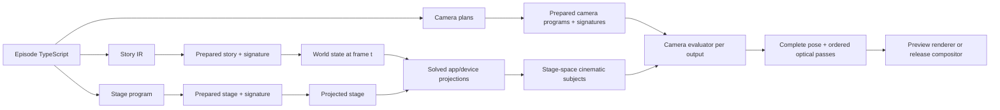

# Tokovo Camera

**Status:** Canonical implemented camera architecture and authoring reference  
**Scope:** deterministic 2D cinematography across one or more simulated devices

**Migration in progress:** explicit shot-local direction is implemented as an opt-in contract.
Exact boundary geometry, frozen/live handoff sources, and hold/follow-position framing are now wired
through the composition and renderer. Opt-in exponential tracking is prepared before frame evaluation.
General constraint-conflict reporting and the visual acceptance reel are not implemented yet. Existing shots retain their previous
motion interpretation. This is the first migration slice, not a completed replacement engine.

Tokovo has one camera architecture. Story replay, stage placement, and cinematography are
independent prepared programs with independent signatures. A camera plan observes an already solved
stage; it cannot mutate app state, device state, or stage placement.

The previous event/effect camera implementation was removed in full. There is no adapter, dual
runtime, deprecated export layer, heuristic subject resolver, or compatibility compiler.

## Architecture invariants

1. The same prepared input and frame produce the same pose, passes, trace, and pixels.
2. Evaluating a frame directly equals evaluating every preceding frame in order.
3. `WorldState` contains story state only; camera state is never replayed into it.
4. Stage layout owns device and scene-node placement.
5. Apps and device packages own the exact geometry they paint.
6. Camera targets typed cinematic subjects, never DOM measurements or pixel guesses.
7. Every shot produces a complete pose; no value leaks from an earlier shot.
8. Every output evaluates independently.
9. Missing registrations, layouts, subjects, or projection backends fail with stable errors.
10. Release rendering never substitutes a lower-fidelity optical implementation.



Tokovo camera direction is authored as deterministic data beside the story. It is not a sequence of
runtime effects. A story can ship several camera plans, and changing the selected plan must not
change story replay or stage pixels.

## Mental model

```text
story events ---> world at frame t -----------+
stage program -> device placement at frame t -+--> cinematic subjects --> camera plan --> outputs
app/device projection ------------------------+                         lenses/modifiers/filters
```

- Story owns what happens inside apps and devices.
- Stage owns where devices and scene nodes exist.
- Camera owns framing, movement, optics, grading, and output composition.
- Apps and devices expose typed subjects from the same geometry they paint.

Do not use camera direction to rearrange the stage, mutate runtime state, or guess DOM geometry.

## Authoring a program

### Cut, hold, push, and hold within one shot

Use `direct()` on either shot builder to separate the entrance from movement. This example is a
120-frame shot for insertion in a plan-family sequence; it requires the referenced message to
exist and be visible. At 30 fps it holds for one second, pushes for two seconds, then holds.

```ts
import { cameraSubject, cinematicShot as shot } from "@tokovo/dsl";

const message = cameraSubject.scope("phone", "app_whatsapp").entity("message", "reveal", "bubble");
const revealShot = shot("read-the-reveal", 120, message)
  .allowDeviceTravel("Frame the message rather than the whole phone")
  .frame({ fill: 0.6, mode: "width", padding: 24 })
  .direct({
    entrance: { type: "cut" },
    movement: {
      interpolation: "minimum-jerk",
      keyframes: [
        { frame: 0, offsetX: 0, offsetY: 0, scaleMultiplier: 1, rotationOffsetDeg: 0 },
        { frame: 30, offsetX: 0, offsetY: 0, scaleMultiplier: 1, rotationOffsetDeg: 0 },
        { frame: 90, offsetX: 0, offsetY: 0, scaleMultiplier: 1.2, rotationOffsetDeg: 0 },
        { frame: 119, offsetX: 0, offsetY: 0, scaleMultiplier: 1.2, rotationOffsetDeg: 0 },
      ],
    },
  });
```

- Movement frame zero is the shot start, not episode frame zero. Moving the shot on the timeline
  does not require rewriting its keyframes.
- `entrance` accepts `cut`, `minimum-jerk`, `critically-damped`, or `whip` profiles. Durations in
  this explicit IR-shaped API are frames. It takes precedence over legacy rig motion; the DSL
  does not emit inferred `blendIn` for an explicitly directed shot.
- Movement uses the existing trajectory math: stage-unit offsets, multiplicative zoom, and
  degree rotation offsets. Repeated values create holds; zoom interpolates logarithmically.
- Movement defaults to the **live composition**. Set `framing: "hold"` inside `direct()` to hold
  the shot-start composition, or `framing: "follow-position"` to follow the full subject center
  while fitting its shot-start size. Stable modes use full bounds rather than a clipped fragment.
  Independent movement and accents can still change the resulting pose.
- Stable framing requires intentional travel without a live framing guard; conflicting constraints
  fail preparation with `CAM_STABLE_FRAMING_CONSTRAINT_CONFLICT`, rather than overriding the shot.
- During a live outgoing blend, local movement is capped at the outgoing shot's final frame.
  This does not freeze the outgoing subject geometry. Set `source: "freeze"` inside `direct()` to
  blend from the actual preceding frame, including any partially completed transition. The default
  remains `source: "live"`. Frozen sources preserve camera pose and projection passes, not old app
  pixels; app transitions still belong to the app/device renderer.
  A frozen blend requires intentional travel: an incoming phone mount could otherwise move the
  frozen source pose, so preparation rejects it with `CAM_FROZEN_SOURCE_CONSTRAINT_CONFLICT`.
- The normal episode composition supplies historical replay via `worldAtFrame`. The renderer
  computes exact layouts using the existing layout engine and caches the requested boundary
  geometry per composition context. Direct camera consumers must supply `subjectFrameAt` when
  using frozen sources or stable framing. Missing history fails with `CAM_SUBJECT_HISTORY_REQUIRED`;
  a missing opening subject fails with `CAM_REFERENCE_SUBJECT_MISSING`.
- Geometry caching retains requested shot-start/boundary frames, not every full layout used for
  tracking. Interrupted frozen blends resolve through an explicit evaluation stack rather than
  recursive JavaScript calls. A 2,000-interruption regression checks continuity and one history
  read per boundary. Work and temporary storage remain linear in interruption depth; this is not
  constant-time seeking. Prepared boundary-output caching and production benchmarks remain pending.
- Add `tracking: { halfLifeSeconds: 0.18 }` alongside `framing: "follow-position"` to smooth the
  target position while retaining opening fit. The per-frame coefficient is
  `1 - 2 ** (-1 / (fps * halfLifeSeconds))`; after one half-life, half the error toward a stationary
  target remains. There is no overshoot. This is first-order damping, not a spring, dead zone,
  velocity-limited path, or predictive tracker.
- `prepareCameraTracking(program, subjectFrameAt)` samples each opted-in shot in ascending frame
  order and stores two position coordinates per frame. The normal renderer prepares it once per
  program/history context; direct consumers pass the result as `tracking` to `evaluateCameraOutput`.
  Preparation is linear in the total tracked shot frames; position lookup during rendering is O(1).
  No full-world snapshots are retained by the tracking result. Reprepare when story/layout inputs
  change, even if the camera plan itself is unchanged.
- Damping requires `follow-position`; invalid combinations fail with `CAM_TRACKING_FRAMING_INVALID`.
  A missing or mismatched prepared track fails with `CAM_TRACKING_NOT_PREPARED`. Preparation requires
  resolvable geometry throughout the shot (including explicit fallbacks); missing, duplicate, or
  frame-mismatched geometry fails with `CAM_TRACKING_GEOMETRY_INVALID`, including skip-shot policies.
- Keyframes must start at zero, strictly increase, and stay within `[0, shotDuration)`.
  Invalid sequences fail preparation with `CAM_MOVEMENT_TIMELINE_INVALID`; overlong entrances
  fail with `CAM_ENTRANCE_OUT_OF_RANGE`. Mixing raw `blendIn` with `direction`, or combining
  its movement with a rig-level baked trajectory, fails with `CAM_DIRECTION_LEGACY_CONFLICT`.
- Keyframe lookup is logarithmic, and evaluation has no playback-order state.

Evidence: `packages/camera/src/__tests__/camera-kernel.test.ts` exercises the cut/hold/push sequence,
shuffled frame evaluation, curve preservation, invalid timelines, and whip backend selection.
`packages/dsl/src/v2/shot-direction.test.ts` covers authoring. These tests establish numerical
behavior; they do not replace visual review of an episode.

### Migration checkpoints

| Checkpoint | Status | Acceptance condition |
| --- | --- | --- |
| Independent entrance and local movement | Implemented | Cut/hold/push sequence survives shuffled frame evaluation |
| Cut quality classification | Implemented | Only the cut boundary is exempted from jump detection |
| Boundary geometry and stable framing | Implemented, numerically tested | Hold/follow-position retain opening fit despite resized/clipped subjects |
| Damped tracking preparation | Implemented, numerically tested | Half-life response and shuffled evaluation preserve fit without replaying tracking history |
| Live/frozen transition sources and interruptions | Implemented, numerically tested | Frozen source equals actual preceding frame even during an interrupted blend |
| Explicit constraint priority and diagnostics | Pending | Mounts cannot silently defeat intended framing |
| Travel-driven whip and bounded impact accents | Opt-in, numerically tested | Travel blur uses handoff displacement; impact returns exactly to rest |
| Acceptance reel and performance comparison | Pending | Same story compared visually and with measured timings |

The `surprise-group-chat` episode has an opt-in `directed` plan for comparison with its unchanged
default `story` plan. It exercises a held/pushed X receipt and frozen entrance/exit with damped
position following. Frames 510–690 have been rendered at half resolution and sampled for visual
review. The revised framing uses less padding and a restrained 6% push to keep the post readable.
The sparse destination screen still leaves substantial empty space; this short proof is not
full-story visual acceptance or a production performance benchmark.

Composition fitting accounts for the rotated padded subject bounds, so a rolled portrait target
does not retain an incorrect unrotated fit. Authored min/max scale, guards, and mounts still apply.
Pose transitions use the shortest angular path even after multiple signed turns; deliberate
multi-turn rotation belongs in an authored movement trajectory. Both cases have regression tests
in `packages/camera/src/__tests__/camera-kernel.test.ts`.

### Existing plan-family authoring

For a frozen handoff followed by a held reveal, sequence shots have two shorthand helpers:

```typescript
shot("receipt", 180, x.entity("tweet", "karaoke", "card"))
  .frame("receipt")
  .allowDeviceTravel("Read the public evidence")
  .handoff(15)
  .pushIn(1.06, 45, 135);
```

This uses the existing direction IR: a 15-frame minimum-jerk entrance from the preceding pose,
then a 6% push between shot-local frames 45 and 135, holding before and after. `handoff()` defaults
to 12 frames and preserves authored movement. `pushIn()` replaces the movement track, preserves
an existing entrance, and otherwise defaults to a cut. Both helpers use integer frames, not
seconds; the endpoint must be inside the shot. Invalid helper arguments fail immediately;
shot-duration and incompatible mount/guard combinations are checked during camera preparation.
Use `direct()` for more elaborate trajectories. These helpers add no new runtime motion system.

To keep one conversation magnification while following only messages that leave a reading window,
use `readWithin()` on a sequence shot (with `wa` from the episode's WhatsApp subject scope):

```typescript
shot("read-the-exchange", 330, wa.semantic("last-message"))
  .frame("phone")
  .readWithin(wa.screen, {
    scale: 1.4,
    region: { x: 0.05, y: 0.35, width: 0.9, height: 0.45 },
    halfLifeSeconds: 0.22,
  });
```

The first argument supplies the opening composition reference; the shot subject remains the
tracked content. Scale sets equal composer minimum/maximum values. The normalized region uses
the full output viewport, not the device screen. While the complete projected subject fits,
the prepared center stays unchanged. Overflow produces an exponentially damped correction;
the first frame establishes the composition immediately. Half-life defaults to 0.18 seconds.

This is a **soft window**, not a hard visibility constraint: recovery may temporarily leave
content outside it. Subsequent movement, modifiers, and entrance blending can also move content
outside the window. Do not combine these when testing the window alone. A subject too large
for the region fails with `CAM_READING_REGION_TOO_SMALL`; enlarge the region or reduce scale.
Missing opening geometry fails with `CAM_REFERENCE_SUBJECT_MISSING`. The existing tracking
preparation retains two coordinates per frame and performs constant-time lookup at evaluation.

The opt-in `reading-room` plan in `the-quiet-night` exercises this behavior without replacing
the default edit. It is a mechanics proof, not a completed cinematic edit. Velocity-aware
held handoffs are available separately below; glyph-level readability gates remain future work.

### Interrupting moves without restarting at zero speed

```typescript
shot("interrupt", 90, wa.body)
  .frame("phone")
  .handoff(30, { continuity: "velocity" });
```

The opt-in helper authors frozen-source, held framing. The kernel samples the preceding two
rendered camera poses and carries their displacement into a quintic Hermite curve, including
log-scale velocity and shortest-angle rotation. Unlike a pose-only handoff, its first frame
advances from the preceding frame; the last entrance frame lands exactly on the held destination.
An intentional cut contributes no inherited jump velocity. Existing `handoff(30)` stays unchanged.
Use `.handoff(30, { continuity: "velocity", framing: "follow-position" })` for a moving
destination. It preserves opening magnification while following current target position. The
blend reaches the moving destination with its own velocity, rather than freezing it on arrival.

This is sampled velocity continuity, not acceleration continuity or a speed-limited spring.
It can overshoot while braking. It requires a minimum-jerk entrance of at least two frames,
no shot movement, and no rig trajectory or pose modifiers; incompatible inputs fail with
`CAM_VELOCITY_HANDOFF_INVALID`. It does not predict future geometry or preserve nonlinear
optical-pass velocity. A discontinuously jumping destination is still a discontinuity; use
prepared tracking for those targets. Per-call boundary memoization keeps interrupted sample branches linear;
it does not cache across independently rendered frames. Regression tests cover first-step
velocity, exact arrival, shuffled seeking, and 500 nested velocity interruptions.

### Checking framing and bounding accents

Use `cameraQualitySample(output, { checkFraming: true })` when the selected semantic subjects
must remain completely readable. The quality analyzer checks their full rectangle corners,
after the final affine camera pose, against the editorial safe viewport. It reports
`CAM_QUALITY_SUBJECT_CROPPED` even if the motion itself is smooth. This is opt-in because full
device crops can be intentional. It detects unsafe framing; it does not repair it automatically.
Headless projection passes are marked `CAM_QUALITY_PROJECTION_UNCHECKED`, not certified
safe from affine geometry. The texture export gate then uses the production compositor's
projective/crop model and conservative displacement/smear support bounds, including rounded
viewport clipping. Old captures without protected geometry remain unchecked. This can reject
a close framing conservatively; it is not a pixel-level legibility or preview-parity certificate.
Author `checkFraming: true` in a shot's `direct()` data to run the same check in the normal export
quality capture. Export now uses the shared sampler: only the exact cut boundary, not every
frame in a cut-led shot, is exempt from jump detection.

### Protecting a reading hold

Safe reading is opt-in and separate from entrances, optical effects, and bounded movement.
Keep those in adjacent shots: a sudden message jump cannot simultaneously guarantee hard
containment and an arbitrarily low speed limit.

```typescript
shot("read-reply", 90, wa.semantic("last-message"))
  .frame("phone")
  .readWithin(wa.screen, {
    scale: 1.3,
    minimumReadingScale: 0.8,
    minimumTextPx: 24,
    region: { x: 0.05, y: 0.15, width: 0.9, height: 0.7 },
    avoidSubjects: [wa.device("keyboard"), wa.notification],
  });
```

Preparation intersects the reading region with editorial insets, samples the complete shot,
and finds one scale that fits its largest protected rectangle. It retains authored scale
when translation suffices and widens only if required. Magnification stays constant throughout
the hold, avoiding zoom pumping. Hard containment uses an immediate position correction;
it does not promise smooth movement when the app teleports content. Legacy soft reading
continues using half-life damping without these hard guarantees.

`minimumTextPx` is the projected body-text em size, not an estimate from bubble width. WhatsApp
text messages and iMessage text messages emit the font token used to paint them. The metric
passes through app/device scaling and a conservative stage-transform scale. Other subjects
must supply their own metric; media-only or unsupported subjects fail instead of guessing.
This is not OCR, glyph x-height measurement, or a universal readability threshold.

`CAM_READING_FIT_IMPOSSIBLE` means the safe region and size floor cannot both be satisfied.
`CAM_READING_TEXT_METRICS_MISSING` identifies missing app metrics. `CAM_READING_OCCLUDED`
identifies overlap with a visible authored obstacle: scroll the app, delay the beat, or dismiss
the surface. Camera transforms cannot uncover text covered inside the same phone.

### Bounding tracking speed and braking

For a moving subject, omit hard safe-reading options and add:

```typescript
shot("follow-reply", 150, wa.semantic("last-message"))
  .readWithin(wa.screen, {
    scale: 1.3,
    region: { x: 0.05, y: 0.15, width: 0.9, height: 0.7 },
    panLimits: { speedPxPerSecond: 900, accelerationPxPerSecondSquared: 2400 },
  });
```

The prepared translation track brakes using discrete stopping distance and bounds vector
acceleration, including reversals. Bounds use the maximum authored scale conservatively.
The camera can lag a fast target or overshoot while reversing; it never snaps to catch up.
Preparation is linear in shot frames; render-time track access remains constant-time and
seek-order independent. Safe preflight temporarily retains one shot's geometry for its two
passes; ordinary tracking streams geometry. These limits cover tracking translation, not
arbitrary handoffs, zoom, rotation, shake, or nonlinear optical displacement. Conflicting
modifiers, entrances, stabilization, or hard containment fail with `CAM_PAN_LIMIT_CONFLICT`.

### Reusing conversation, reveal and return styles

`style()` copies an existing `CameraSequenceShotStyle`; subsequent builder calls override it.
Nested fields replace rather than deep-merge. Keep target and duration explicit per beat.

```typescript
const conversation = { frame: "phone", direction: {
  entrance: { type: "cut" as const }, framing: "hold" as const,
} };
const reply = shot("reply", 90, wa.semantic("last-message")).style(conversation);
const reveal = shot("reveal", 90, wa.notification).style(conversation)
  .handoff(12).pushIn(1.1, 20, 70);
const returnToPhone = shot("return", 60, wa.body).style(conversation).handoff(18);
```

These remain the existing plan-family shots, not a separate runtime recipe registry. Style
isolation, moving arrival, readable fit, obstacle rejection, and vector braking have runnable
regression checks in the DSL, camera, stage, and texture-compositor test suites.

An explicit whip entrance can use `direction: "travel"`. Its smear follows the projected
source-to-destination displacement, with spread based on minimum-jerk translation speed and
a half-frame shutter, capped at 64 output pixels. Pure zoom adds no directional smear.
This models the handoff segment, not arbitrary simultaneous curved motion or live target velocity.
Legacy named directions retain their original behavior.

The `impact-shake` modifier takes `startFrame`, `durationFrames` (default 18), `amplitudePx`
(default 12, maximum 32 per translation axis), `rotationDeg` (default 0.4, maximum 3), and `seed`.
Its seeded signal has a finite, eased decay envelope and returns exactly to the unmodified
pose outside the interval. Translation is divided by camera scale, so its bound is in output
pixels rather than magnified stage units. Keep impacts away from reading holds.

The `camera-motion-stress` system fixture exercises two interrupted moves, keyboard-driven
reflow, burst/wrapped messages, notification focus, navigation, travel smear, and bounded impact.
It is a regression fixture, not an editorial showcase. Render it with the normal video runner;
the fast reference projection preview is not a certification of the texture export backend.

The default `cinematic` plan in `the-quiet-night` edits 13 shots over 30 seconds: fixed-scale
left/right dialogue cuts, two notification-driven pans, a held/pushed X text reveal, and a
pushed final reply. Dialogue cuts land 12 frames after message arrival. The story does not name
the venue before the notification reveals it. The older `rally` and `reading-room` plans remain
selectable for comparison; the default now demonstrates an edited story rather than tracking alone.

`cameraSubject.scope("phone").notification` targets `notification.banner`, the exact device
subject emitted by the renderer. It is available only while a banner is projected. Use
`.device("notification.center")` for Notification Center instead; do not substitute guessed
screen coordinates when a transient surface is absent. The DSL shortcut and the cinematic
episode's notification rig have regression tests.

The retained `rally` plan uses three compositions over 30 seconds: a stationary phone view
through dialogue and navigation, one 45-frame move toward the public receipt followed by a hold,
and a 45-frame return to the identical opening composition. The return settles before the next
notification. Its regression test checks equal opening/closing poses, stationary camera poses
at message and navigation beats, shot coverage, and both notification routes.

For conversational back-and-forth, let the message lanes alternate attention inside a stable
reading frame. Do not fit every bubble independently: short replies otherwise enlarge the phone,
long replies shrink it, and bottom-aligned message insertion moves the tracked target again.
Keep navigation and camera movement separate in time. A camera can be numerically deterministic
and still be a poor edit; inspect a short exchange before rendering a full story.

Use a declarative plan family for normal production work. It authors one shared output, look,
framing vocabulary, and sequential shot list, then compiles every named variant to the canonical
`CameraPlanIR` contract:

```ts
import {
  cameraSubject,
  cinematicProgram,
  cinematicShot as shot,
} from "@tokovo/dsl";

const phone = cameraSubject.scope("hero-phone", "app_whatsapp");

export const cinematics = cinematicProgram(
  {
    fps: 30,
    duration: "8s",
    stage: {
      width: 1080,
      height: 1920,
      devices: [
        {
          deviceId: "hero-phone",
          x: 330,
          y: 510,
          width: 420,
          height: 889,
        },
      ],
    },
  },
  (program) => {
    program.planFamily({
      plans: [{ id: "editorial", default: true }, { id: "optical" }],
      look: {
        lenses: {
          "typing-fisheye": {
            model: "fisheye",
            center: [0.5, 0.72],
            strength: 0.1,
            radius: 1.15,
            cropCompensation: 1.04,
          },
        },
        filters: {
          night: {
            model: "color-grade",
            contrast: 1.08,
            saturation: 0.94,
            temperature: -0.04,
          },
        },
      },
      framings: {
        device: { fill: 0.84, mode: "contain", padding: 28 },
        keyboard: {
          position: [0.5, 0.7],
          fill: 0.78,
          mode: "width",
          min: 0.4,
          max: 1.2,
        },
      },
      outputs: [
        {
          id: "main",
          viewport: { x: 0, y: 0, width: 1080, height: 1920 },
          coveragePolicy: "require-shots",
          compositionProfileId: "hero-device",
          travel: {
            mode: "stabilized",
            subject: phone.body,
            maxDriftPx: [54, 72],
          },
          defaultRig: {
            id: "neutral",
            subject: phone.body,
            frame: { fill: 0.84, padding: 28 },
            framingGuard: {
              subject: phone.body,
              paddingPx: 28,
              screenPosition: [0.5, 0.5],
            },
            motion: { type: "minimum-jerk", durationFrames: 18 },
          },
        },
      ],
      sequences: [
        {
          outputId: "main",
          end: "8s",
          defaults: { frame: "device", filters: ["night"] },
          shots: [
            shot("establish", "3s", phone.body).dollyIn("600ms", {
              amount: 0.06,
            }),
            shot("typing", "3s", phone.keyboard)
              .frame("keyboard")
              .fallback(phone.semantic("input_area"))
              .dollyIn("420ms", { amount: 0.08 })
              .when("optical", { lens: "typing-fisheye" }),
            shot("reply", "2s", phone.semantic("last-message"))
              .fallback(phone.screen)
              .settle("360ms"),
          ],
        },
      ],
    });
  },
);
```

Attach the resulting value with `.cinematics(cinematics)`.

The sequence cursor removes start/end arithmetic: each shot begins when the previous shot ends.
`end` is a compile-time timing assertion. Named framing recipes and optical records are ordinary
data in the same file, while `.when(planId, ...)` expresses only the delta between cuts. Unknown
recipes, variants, outputs, and timing drift fail with stable `CinematicAuthoringError` codes.
Plan variants may also own additive/overriding optical records and per-output default-rig deltas, so
a restrained plan does not carry unused texture models and an expressive plan can add neutral
breathing without cloning the output.

The lower-level `program.plan(...)`, rig, and absolute shot builders remain the explicit escape
hatch for shared-rig interval editing, unusual overlap graphs, and IR-level tests. Both surfaces
emit the same immutable CameraPlan contract; there is no compact-runtime mode or compatibility
translation.

## Subjects and coordinate spaces

Prefer the narrowest stable subject:

- `cameraSubject.scope(deviceId, appId)` to bind device/app identity once and expose body, screen,
  keyboard, notification, semantic, entity, and group subjects;
- `cameraSubject.entity(...)` for an exact message, image, reaction, or other authored entity;
- `cameraSubject.semantic(...)` for a stable app-owned region such as a header or composer;
- `cameraSubject.device(...)` for body, screen, keyboard, notification, or OS surfaces;
- `cameraSubject.group(...)` when the composition must contain several subjects.

Device body and device display are distinct spaces. Screen/app/keyboard/notification geometry is
offset through the profile's physical display inset before stage projection; body geometry is not.
Never compensate for the hardware rail with episode-authored pixel offsets.

Missing-subject behavior must be explicit: fail, skip the shot, or use one explicit fallback
subject. There is no heuristic chain that invents a broader target.

## Attention targets and physical mounts

A semantic focus target is not a physical camera mount. A keyboard, message, notification, or
story card tells the composer what deserves attention; the device body or a multi-device group
tells the stabilizer what should remain compositionally grounded:

```text
semantic target ---> fill + focus position ---> desired camera pose ---+
                                                                       +--> final pose
device/group mount -> output position + dead zone -> translation guard +
```

Every rig must make device travel explicit. A plan-family output normally declares one stable
mount, inherited by its default rig and every shot:

```ts
travel: {
  mode: "stabilized",
  subject: phone.body,
  position: [0.5, 0.5],
  maxDriftPx: [54, 72],
}
```

The dead zone permits restrained editorial drift. Crossing its horizontal or vertical limit
corrects translation only; it does not flatten authored dolly scale, rotation, baked trajectory,
lenses, modifiers, or filters. This prevents a low message or keyboard target from dragging the
entire phone hundreds of pixels across a fixed composition.

A shot that genuinely needs physical device travel must declare and explain it:

```ts
shot("macro-swipe", "1.2s", phone.keyboard)
  .allowDeviceTravel("Full-bleed macro crosses the hardware edge.")
  .dollyIn("420ms", { amount: 0.12 });
```

The low-level builder exposes the same choice through `.mount(subject, options)` and
`.allowDeviceTravel(reason)`. There is no implicit unconstrained or compatibility mode. A missing
mount and a missing intentional-travel reason are authoring errors.

## Output coverage and editorial insets

Every output declares a coverage policy. `require-shots` rejects any uncovered frame interval at
preparation; `allow-default` intentionally fills gaps with the output's default rig. This is a
compile-time contract, not a renderer guess.

`compositionProfileId` supplies the normal editorial insets and composition guidance.
`editorialInsets` is an intentional output-specific override. It reduces the effective composition viewport for every rig on that output. Composer
positioning and framing guards solve inside the editorial viewport, while final clipping still uses the
full output rectangle. Invalid or over-constrained insets fail with stable camera diagnostic codes.

Authoring fails immediately with `CinematicAuthoringError` when IDs collide, a shot leaves the
episode interval, a default rig belongs to the wrong output, or a rig references undeclared camera
data. Preparation performs the independent schema/registry validation required for raw IR and
non-DSL producers; release behavior never assumes the builder was used.

## Movement vocabulary

Compact and low-level shots expose the same typed movement verbs: `dollyIn`, `dollyOut`,
`truckLeft`, `truckRight`, `pedestalUp`,
`pedestalDown`, `panLeft`, `panRight`, `tiltUp`, `tiltDown`, `roll`, `craneUp`, `craneDown`, and
`orbit`. Cuts, critically damped settles, and editorial whips are also explicit.

These verbs compile to complete deterministic poses and carry a movement intent in trace data.
`orbit` currently means a projective 2.5D plate move using perspective tilt; it is not true
multi-plane 3D parallax. A future 3D renderer can implement that intent without changing episode
story code.

Incoming blend and rig motion are separate controls. Normal shots infer a minimum-jerk blend from
their motion; `.blend(duration, curve)` pins editorial transition timing independently, and
`.noBlend()` intentionally removes it.

## Tracking and baked trajectories

Rigs use deterministic direct tracking by default: each requested frame resolves the current
subject projection and recomputes the complete desired pose without consulting an earlier frame.
This preserves random access and makes sequential and shuffled evaluation identical.

For reviewed editorial paths, a rig may declare absolute baked offsets:

```ts
camera.rig("reviewed-path", {
  outputId: "main",
  subject: phone,
  travel: {
    mode: "stabilized",
    mount: {
      subject: phone,
      screenPosition: [0.5, 0.5],
      maxDriftPx: [54, 72],
    },
  },
  composer: {
    screenPosition: [0.5, 0.5],
    targetFill: 0.82,
    fillMode: "contain",
  },
  tracking: { mode: "direct" },
  bakedTrajectory: {
    interpolation: "minimum-jerk",
    keyframes: [
      {
        frame: 0,
        offsetX: 0,
        offsetY: 0,
        scaleMultiplier: 1,
        rotationOffsetDeg: 0,
      },
      {
        frame: 120,
        offsetX: -24,
        offsetY: 18,
        scaleMultiplier: 1.08,
        rotationOffsetDeg: -1.5,
      },
    ],
  },
});
```

Keyframes are compact, absolute-frame data. Preparation rejects duplicates and out-of-range
frames; evaluation interpolates scale in log space and never integrates frame-to-frame velocity.

## Lenses, modifiers, and filters

- A lens changes projection geometry: barrel, fisheye, perspective tilt, or anamorphic edge stretch.
- A modifier changes pose/optical behavior, such as lens breathing or directional smear.
- A filter changes the image without changing geometry. The built-in deterministic color grade
  controls brightness, contrast, saturation, gamma, temperature, and tint.

Reference registrations by ID from rigs or shots. Unknown IDs fail preparation. Non-linear release
passes use the offline texture compositor; release rendering does not silently fall back to a lower
quality browser approximation.

## Recutting and debugging

Give a program several named plans and select one with `CAMERA_PLAN_ID=<plan-id>`. The story and
stage signatures must remain stable while the camera signature changes. Evaluation trace records
the selected plan, output, shot, rig, movement intent, resolved subject provenance, framing guard,
semantic mount, measured mount drift, and ordered projection passes.

Preparation compiles definitions into JSON-safe integer indexes and non-overlapping shot intervals.
Runtime selection uses those indexes and does not scan or sort the authored plan per frame.

Inspect prepared programs without opening Remotion:

```bash
mise exec -- pnpm camera programs --episode whatsapp-cinematic-flagship
mise exec -- pnpm camera explain --episode whatsapp-cinematic-flagship \
  --camera-plan kinetic --output main --frame 420
mise exec -- pnpm camera diff --episode whatsapp-cinematic-flagship \
  --left restrained --right kinetic
mise exec -- pnpm camera subjects
```

Render metadata embeds the complete selected camera artifact: independent story/stage signatures,
plan signature, coverage map, required projection backend, stable IDs, preparation diagnostics, and
the immutable plan. Preview debug mode additionally draws editorial insets, projected subjects, framing
guards, desired/final pose, tracking/trajectory state, and ordered projection passes.

Release camera quality analyzes every output frame. In addition to coverage, fill validity, and
unauthored pose discontinuities, it fails any stabilized frame whose projected semantic mount
exceeds its declared dead zone. Intentional-travel frames are counted separately in render
metadata instead of silently bypassing the policy.

Verify hero work with a real render:

```bash
EPISODE_ID=whatsapp-cinematic-flagship \
CAMERA_PLAN_ID=kinetic \
mise exec -- pnpm --filter video-runner render:fast
```

`render:fast` is a watchable preview and may use the deterministic reference painter. A review or
release artifact with texture-only passes must use `mise exec -- pnpm render:episode`; the direct
Remotion path fails closed instead of silently approximating release pixels. Inspect the opening,
peak distortion, transition, notification, close-up, and final neutral frames. Tests alone cannot
prove clipping, typography, physical screen inset, or clean optical settlement.

For a deterministic release probe or distributed render chunk, provide an inclusive source range:

```bash
mise exec -- pnpm --filter @tokovo/render-service render \
  --episode whatsapp-cinematic-flagship \
  --profile release \
  --camera-plan kinetic \
  --start-frame 180 \
  --end-frame 191 \
  --job camera-probe
```

Both frame flags are required together. Metadata and projection hashes record the exact source
range; all three camera-independent layer-plate caches key it independently from CameraPlan
identity.

Release camera composition also caches verified 30-frame H.264 chunks by exact local camera pixels.
Changing one shot reuses chunks outside the changed range; renaming a plan does not invalidate
pixels. Run the full 38-second cold/warm performance and byte-identity gate with:

```bash
mise exec -- pnpm render:benchmark
```

See [Rendering and Performance](./RENDERING.md) for phase budgets, cache controls, environment
pinning, and measured results.

## Ownership and extension

| Package             | Camera responsibility                                                           |
| ------------------- | ------------------------------------------------------------------------------- |
| `@tokovo/ir`        | JSON-safe stage, subject, plan, rig, shot, lens, modifier, and filter contracts |
| `@tokovo/dsl`       | plan-family and low-level validated builders                                    |
| `@tokovo/compiler`  | cross-reference validation, preparation, and signatures                         |
| `@tokovo/stage`     | deterministic scene graph, transforms, paint order, and stage subjects          |
| `@tokovo/camera`    | composition math, interval selection, tracking, constraints, optics, and trace  |
| app/device packages | exact solved geometry and semantic subjects                                     |
| `@tokovo/renderer`  | stage painting, independent outputs, and registered visual backends             |
| render service      | plates, offline optics, chunks, artifacts, integrity, and upload                |

To add a lens or filter:

1. add or extend the versioned IR pass;
2. validate parameters strictly;
3. register one headless evaluator;
4. map preview and release backends;
5. define crop, alpha-edge, and neutral-state behavior;
6. add mathematical, random-access, determinism, text-fidelity, and temporal tests;
7. prove it in an app-agnostic fixture.

The hard-cut policy scans the repository for retired camera packages, mutable world-camera state,
camera runtime events, heuristic subject fallback, old director APIs, and raw camera IR authored
inside episode packages. A match fails the release gate.
