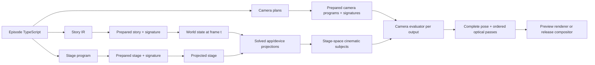

# Tokovo Camera

**Status:** Canonical implemented camera architecture and authoring reference  
**Scope:** deterministic 2D cinematography across one or more simulated devices

Tokovo has one camera architecture. Story replay, stage placement, and cinematography are
independent prepared programs with independent signatures. A camera plan observes an already solved
stage; it cannot mutate app state, device state, or stage placement.

The previous event/effect camera implementation was removed in full. There is no adapter, dual
runtime, deprecated export layer, heuristic subject resolver, or compatibility compiler.

## Architecture invariants

1. The same prepared input and frame produce the same pose, passes, trace, and pixels.
2. Evaluating a frame directly equals evaluating every preceding frame in order.
3. `WorldState` contains story state only; camera state is never replayed into it.
4. Stage layout owns device and scene-node placement.
5. Apps and device packages own the exact geometry they paint.
6. Camera targets typed cinematic subjects, never DOM measurements or pixel guesses.
7. Every shot produces a complete pose; no value leaks from an earlier shot.
8. Every output evaluates independently.
9. Missing registrations, layouts, subjects, or projection backends fail with stable errors.
10. Release rendering never substitutes a lower-fidelity optical implementation.



Tokovo camera direction is authored as deterministic data beside the story. It is not a sequence of
runtime effects. A story can ship several camera plans, and changing the selected plan must not
change story replay or stage pixels.

## Mental model

```text
story events ---> world at frame t -----------+
stage program -> device placement at frame t -+--> cinematic subjects --> camera plan --> outputs
app/device projection ------------------------+                         lenses/modifiers/filters
```

- Story owns what happens inside apps and devices.
- Stage owns where devices and scene nodes exist.
- Camera owns framing, movement, optics, grading, and output composition.
- Apps and devices expose typed subjects from the same geometry they paint.

Do not use camera direction to rearrange the stage, mutate runtime state, or guess DOM geometry.

## Authoring a program

Use a declarative plan family for normal production work. It authors one shared output, look,
framing vocabulary, and sequential shot list, then compiles every named variant to the canonical
`CameraPlanIR` contract:

```ts
import {
  cameraSubject,
  cinematicProgram,
  cinematicShot as shot,
} from "@tokovo/dsl";

const phone = cameraSubject.scope("hero-phone", "app_whatsapp");

export const cinematics = cinematicProgram(
  {
    fps: 30,
    duration: "8s",
    stage: {
      width: 1080,
      height: 1920,
      devices: [
        {
          deviceId: "hero-phone",
          x: 330,
          y: 510,
          width: 420,
          height: 889,
        },
      ],
    },
  },
  (program) => {
    program.planFamily({
      plans: [{ id: "editorial", default: true }, { id: "optical" }],
      look: {
        lenses: {
          "typing-fisheye": {
            model: "fisheye",
            center: [0.5, 0.72],
            strength: 0.1,
            radius: 1.15,
            cropCompensation: 1.04,
          },
        },
        filters: {
          night: {
            model: "color-grade",
            contrast: 1.08,
            saturation: 0.94,
            temperature: -0.04,
          },
        },
      },
      framings: {
        device: { fill: 0.84, mode: "contain", padding: 28 },
        keyboard: {
          position: [0.5, 0.7],
          fill: 0.78,
          mode: "width",
          min: 0.4,
          max: 1.2,
        },
      },
      outputs: [
        {
          id: "main",
          viewport: { x: 0, y: 0, width: 1080, height: 1920 },
          coveragePolicy: "require-shots",
          compositionProfileId: "hero-device",
          travel: {
            mode: "stabilized",
            subject: phone.body,
            maxDriftPx: [54, 72],
          },
          defaultRig: {
            id: "neutral",
            subject: phone.body,
            frame: { fill: 0.84, padding: 28 },
            framingGuard: {
              subject: phone.body,
              paddingPx: 28,
              screenPosition: [0.5, 0.5],
            },
            motion: { type: "minimum-jerk", durationFrames: 18 },
          },
        },
      ],
      sequences: [
        {
          outputId: "main",
          end: "8s",
          defaults: { frame: "device", filters: ["night"] },
          shots: [
            shot("establish", "3s", phone.body).dollyIn("600ms", {
              amount: 0.06,
            }),
            shot("typing", "3s", phone.keyboard)
              .frame("keyboard")
              .fallback(phone.semantic("input_area"))
              .dollyIn("420ms", { amount: 0.08 })
              .when("optical", { lens: "typing-fisheye" }),
            shot("reply", "2s", phone.semantic("last-message"))
              .fallback(phone.screen)
              .settle("360ms"),
          ],
        },
      ],
    });
  },
);
```

Attach the resulting value with `.cinematics(cinematics)`.

The sequence cursor removes start/end arithmetic: each shot begins when the previous shot ends.
`end` is a compile-time timing assertion. Named framing recipes and optical records are ordinary
data in the same file, while `.when(planId, ...)` expresses only the delta between cuts. Unknown
recipes, variants, outputs, and timing drift fail with stable `CinematicAuthoringError` codes.
Plan variants may also own additive/overriding optical records and per-output default-rig deltas, so
a restrained plan does not carry unused texture models and an expressive plan can add neutral
breathing without cloning the output.

The lower-level `program.plan(...)`, rig, and absolute shot builders remain the explicit escape
hatch for shared-rig interval editing, unusual overlap graphs, and IR-level tests. Both surfaces
emit the same immutable CameraPlan contract; there is no compact-runtime mode or compatibility
translation.

## Subjects and coordinate spaces

Prefer the narrowest stable subject:

- `cameraSubject.scope(deviceId, appId)` to bind device/app identity once and expose body, screen,
  keyboard, notification, semantic, entity, and group subjects;
- `cameraSubject.entity(...)` for an exact message, image, reaction, or other authored entity;
- `cameraSubject.semantic(...)` for a stable app-owned region such as a header or composer;
- `cameraSubject.device(...)` for body, screen, keyboard, notification, or OS surfaces;
- `cameraSubject.group(...)` when the composition must contain several subjects.

Device body and device display are distinct spaces. Screen/app/keyboard/notification geometry is
offset through the profile's physical display inset before stage projection; body geometry is not.
Never compensate for the hardware rail with episode-authored pixel offsets.

Missing-subject behavior must be explicit: fail, skip the shot, or use one explicit fallback
subject. There is no heuristic chain that invents a broader target.

## Attention targets and physical mounts

A semantic focus target is not a physical camera mount. A keyboard, message, notification, or
story card tells the composer what deserves attention; the device body or a multi-device group
tells the stabilizer what should remain compositionally grounded:

```text
semantic target ---> fill + focus position ---> desired camera pose ---+
                                                                       +--> final pose
device/group mount -> output position + dead zone -> translation guard +
```

Every rig must make device travel explicit. A plan-family output normally declares one stable
mount, inherited by its default rig and every shot:

```ts
travel: {
  mode: "stabilized",
  subject: phone.body,
  position: [0.5, 0.5],
  maxDriftPx: [54, 72],
}
```

The dead zone permits restrained editorial drift. Crossing its horizontal or vertical limit
corrects translation only; it does not flatten authored dolly scale, rotation, baked trajectory,
lenses, modifiers, or filters. This prevents a low message or keyboard target from dragging the
entire phone hundreds of pixels across a fixed composition.

A shot that genuinely needs physical device travel must declare and explain it:

```ts
shot("macro-swipe", "1.2s", phone.keyboard)
  .allowDeviceTravel("Full-bleed macro crosses the hardware edge.")
  .dollyIn("420ms", { amount: 0.12 });
```

The low-level builder exposes the same choice through `.mount(subject, options)` and
`.allowDeviceTravel(reason)`. There is no implicit unconstrained or compatibility mode. A missing
mount and a missing intentional-travel reason are authoring errors.

## Output coverage and editorial insets

Every output declares a coverage policy. `require-shots` rejects any uncovered frame interval at
preparation; `allow-default` intentionally fills gaps with the output's default rig. This is a
compile-time contract, not a renderer guess.

`compositionProfileId` supplies the normal editorial insets and composition guidance.
`editorialInsets` is an intentional output-specific override. It reduces the effective composition viewport for every rig on that output. Composer
positioning and framing guards solve inside the editorial viewport, while final clipping still uses the
full output rectangle. Invalid or over-constrained insets fail with stable camera diagnostic codes.

Authoring fails immediately with `CinematicAuthoringError` when IDs collide, a shot leaves the
episode interval, a default rig belongs to the wrong output, or a rig references undeclared camera
data. Preparation performs the independent schema/registry validation required for raw IR and
non-DSL producers; release behavior never assumes the builder was used.

## Movement vocabulary

Compact and low-level shots expose the same typed movement verbs: `dollyIn`, `dollyOut`,
`truckLeft`, `truckRight`, `pedestalUp`,
`pedestalDown`, `panLeft`, `panRight`, `tiltUp`, `tiltDown`, `roll`, `craneUp`, `craneDown`, and
`orbit`. Cuts, critically damped settles, and editorial whips are also explicit.

These verbs compile to complete deterministic poses and carry a movement intent in trace data.
`orbit` currently means a projective 2.5D plate move using perspective tilt; it is not true
multi-plane 3D parallax. A future 3D renderer can implement that intent without changing episode
story code.

Incoming blend and rig motion are separate controls. Normal shots infer a minimum-jerk blend from
their motion; `.blend(duration, curve)` pins editorial transition timing independently, and
`.noBlend()` intentionally removes it.

## Tracking and baked trajectories

Rigs use deterministic direct tracking by default: each requested frame resolves the current
subject projection and recomputes the complete desired pose without consulting an earlier frame.
This preserves random access and makes sequential and shuffled evaluation identical.

For reviewed editorial paths, a rig may declare absolute baked offsets:

```ts
camera.rig("reviewed-path", {
  outputId: "main",
  subject: phone,
  travel: {
    mode: "stabilized",
    mount: {
      subject: phone,
      screenPosition: [0.5, 0.5],
      maxDriftPx: [54, 72],
    },
  },
  composer: {
    screenPosition: [0.5, 0.5],
    targetFill: 0.82,
    fillMode: "contain",
  },
  tracking: { mode: "direct" },
  bakedTrajectory: {
    interpolation: "minimum-jerk",
    keyframes: [
      {
        frame: 0,
        offsetX: 0,
        offsetY: 0,
        scaleMultiplier: 1,
        rotationOffsetDeg: 0,
      },
      {
        frame: 120,
        offsetX: -24,
        offsetY: 18,
        scaleMultiplier: 1.08,
        rotationOffsetDeg: -1.5,
      },
    ],
  },
});
```

Keyframes are compact, absolute-frame data. Preparation rejects duplicates and out-of-range
frames; evaluation interpolates scale in log space and never integrates frame-to-frame velocity.

## Lenses, modifiers, and filters

- A lens changes projection geometry: barrel, fisheye, perspective tilt, or anamorphic edge stretch.
- A modifier changes pose/optical behavior, such as lens breathing or directional smear.
- A filter changes the image without changing geometry. The built-in deterministic color grade
  controls brightness, contrast, saturation, gamma, temperature, and tint.

Reference registrations by ID from rigs or shots. Unknown IDs fail preparation. Non-linear release
passes use the offline texture compositor; release rendering does not silently fall back to a lower
quality browser approximation.

## Recutting and debugging

Give a program several named plans and select one with `CAMERA_PLAN_ID=<plan-id>`. The story and
stage signatures must remain stable while the camera signature changes. Evaluation trace records
the selected plan, output, shot, rig, movement intent, resolved subject provenance, framing guard,
semantic mount, measured mount drift, and ordered projection passes.

Preparation compiles definitions into JSON-safe integer indexes and non-overlapping shot intervals.
Runtime selection uses those indexes and does not scan or sort the authored plan per frame.

Inspect prepared programs without opening Remotion:

```bash
mise exec -- pnpm camera programs --episode whatsapp-cinematic-flagship
mise exec -- pnpm camera explain --episode whatsapp-cinematic-flagship \
  --camera-plan kinetic --output main --frame 420
mise exec -- pnpm camera diff --episode whatsapp-cinematic-flagship \
  --left restrained --right kinetic
mise exec -- pnpm camera subjects
```

Render metadata embeds the complete selected camera artifact: independent story/stage signatures,
plan signature, coverage map, required projection backend, stable IDs, preparation diagnostics, and
the immutable plan. Preview debug mode additionally draws editorial insets, projected subjects, framing
guards, desired/final pose, tracking/trajectory state, and ordered projection passes.

Release camera quality analyzes every output frame. In addition to coverage, fill validity, and
unauthored pose discontinuities, it fails any stabilized frame whose projected semantic mount
exceeds its declared dead zone. Intentional-travel frames are counted separately in render
metadata instead of silently bypassing the policy.

Verify hero work with a real render:

```bash
EPISODE_ID=whatsapp-cinematic-flagship \
CAMERA_PLAN_ID=kinetic \
mise exec -- pnpm --filter video-runner render:fast
```

`render:fast` is a watchable preview and may use the deterministic reference painter. A review or
release artifact with texture-only passes must use `mise exec -- pnpm render:episode`; the direct
Remotion path fails closed instead of silently approximating release pixels. Inspect the opening,
peak distortion, transition, notification, close-up, and final neutral frames. Tests alone cannot
prove clipping, typography, physical screen inset, or clean optical settlement.

For a deterministic release probe or distributed render chunk, provide an inclusive source range:

```bash
mise exec -- pnpm --filter @tokovo/render-service render \
  --episode whatsapp-cinematic-flagship \
  --profile release \
  --camera-plan kinetic \
  --start-frame 180 \
  --end-frame 191 \
  --job camera-probe
```

Both frame flags are required together. Metadata and projection hashes record the exact source
range; all three camera-independent layer-plate caches key it independently from CameraPlan
identity.

Release camera composition also caches verified 30-frame H.264 chunks by exact local camera pixels.
Changing one shot reuses chunks outside the changed range; renaming a plan does not invalidate
pixels. Run the full 38-second cold/warm performance and byte-identity gate with:

```bash
mise exec -- pnpm render:benchmark
```

See [Rendering and Performance](./RENDERING.md) for phase budgets, cache controls, environment
pinning, and measured results.

## Ownership and extension

| Package             | Camera responsibility                                                           |
| ------------------- | ------------------------------------------------------------------------------- |
| `@tokovo/ir`        | JSON-safe stage, subject, plan, rig, shot, lens, modifier, and filter contracts |
| `@tokovo/dsl`       | plan-family and low-level validated builders                                    |
| `@tokovo/compiler`  | cross-reference validation, preparation, and signatures                         |
| `@tokovo/stage`     | deterministic scene graph, transforms, paint order, and stage subjects          |
| `@tokovo/camera`    | composition math, interval selection, tracking, constraints, optics, and trace  |
| app/device packages | exact solved geometry and semantic subjects                                     |
| `@tokovo/renderer`  | stage painting, independent outputs, and registered visual backends             |
| render service      | plates, offline optics, chunks, artifacts, integrity, and upload                |

To add a lens or filter:

1. add or extend the versioned IR pass;
2. validate parameters strictly;
3. register one headless evaluator;
4. map preview and release backends;
5. define crop, alpha-edge, and neutral-state behavior;
6. add mathematical, random-access, determinism, text-fidelity, and temporal tests;
7. prove it in an app-agnostic fixture.

The hard-cut policy scans the repository for retired camera packages, mutable world-camera state,
camera runtime events, heuristic subject fallback, old director APIs, and raw camera IR authored
inside episode packages. A match fails the release gate.
