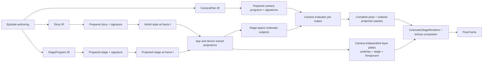

# Camera VNext Architecture

Status: Implemented hard cut

Audience: engine, compiler, renderer, app-plugin, episode-authoring, and render-service maintainers

Scope: deterministic 2D cinematography across one or more simulated devices

Implementation record: [CAMERA_VNEXT_IMPLEMENTATION_PLAN.md](./CAMERA_VNEXT_IMPLEMENTATION_PLAN.md)

Authoring reference: [CAMERA_REFERENCE.md](./CAMERA_REFERENCE.md)

## Outcome

Tokovo has one camera architecture. Story replay, stage placement, and cinematography are independent
programs with independent signatures. A camera plan is a deterministic projection of an already
solved stage; it cannot mutate app state, device state, or stage placement.

The hard cut removed the previous event/effect camera implementation in full. There is no adapter,
dual runtime, deprecated export layer, heuristic subject resolver, or compatibility compiler.

## Invariants

1. The same prepared input and frame produce the same pose, passes, trace, and pixels.
2. Evaluating frame 420 directly equals evaluating frames 0 through 420 in order.
3. `WorldState` contains story state only; camera state is never replayed into it.
4. Stage layout owns device and scene-node placement.
5. Apps and device packages own the exact geometry they paint.
6. Camera targets typed cinematic subjects, never DOM measurements or pixel guesses.
7. Every shot produces a complete pose; no value leaks from an earlier shot.
8. Every output evaluates independently.
9. Missing registrations, profiles, layouts, subjects, or projection backends fail with stable errors.
10. Release rendering never substitutes a lower-fidelity optical implementation.

## System Flow



Changing only the selected CameraPlan changes `G`, `L`, and final projection. It does not rebuild
the story or change any camera-independent layer-plate identity.

## Ownership

| Package            | Owns                                                                                 | Must not own                                  |
| ------------------ | ------------------------------------------------------------------------------------ | --------------------------------------------- |
| `@tokovo/ir`       | JSON-safe stage, camera, subject, lens, modifier, and filter contracts               | React or runtime behavior                     |
| `@tokovo/dsl`      | validated builders for stages, plans, outputs, rigs, shots, motion, and optics       | a second runtime model                        |
| `@tokovo/compiler` | preparation, cross-reference validation, signatures, and episode envelope            | app-specific camera rules                     |
| `@tokovo/core`     | deterministic story replay and plugin contracts                                      | rendered camera state                         |
| `@tokovo/stage`    | stage preparation, transforms, paint order, and subject projection                   | camera selection                              |
| `@tokovo/camera`   | composer math, interval selection, blends, tracking, constraints, optics, and trace  | React, Remotion, browser APIs, or app imports |
| app packages       | canonical solved UI layout and app-owned cinematic subjects                          | global shot timing                            |
| device packages    | physical geometry and OS-owned cinematic subjects                                    | app semantics                                 |
| `@tokovo/renderer` | stage painting, independent outputs, debug guides, and registered visual backends    | subject fallback or shot selection            |
| render service     | reusable layer plates, offline optical composition, artifacts, integrity, and upload | story or camera semantics                     |

## Prepared Envelope

The compiler prepares three independent products:

```ts
interface PreparedEpisodeCinematics {
  storySignature: string;
  stageSignature: string;
  cameraPrograms: readonly PreparedCameraProgram[];
  defaultCameraPlanId: string;
}
```

The story signature is the replay event signature. Stage and camera signatures are derived from
their own JSON-safe contracts. Render jobs record all three so a pixel change can be attributed to
story, staging, or cinematography.

## Stage Model

`StageProgramIR` is a deterministic scene graph. A stage node has:

- a stable node ID;
- a source such as a group or device;
- local bounds;
- an initial transform;
- an optional parent;
- deterministic z-order;
- optional transform keyframes.

Preparation validates node identity, parent references, cycles, finite geometry, and keyframe order.
It stores topological and paint-order indexes once. Frame evaluation never sorts the graph or scans
all keyframes repeatedly.

Device placement belongs here. PIP is a camera output viewport over the same stage, not a mutation
that promotes or duplicates a device.

## Cinematic Subjects

Camera-critical geometry is emitted beside the projection that paints the UI. The provider and view
therefore consume one layout result rather than reimplementing rectangles in separate systems.

The public reference is structured:

```ts
type CinematicSubjectRefIR =
  | { kind: "semantic"; deviceId: string; appId: string; subjectId: string }
  | {
      kind: "entity";
      deviceId: string;
      appId: string;
      entityType: string;
      entityId: string;
      region: string;
    }
  | { kind: "device"; deviceId: string; subjectId: string }
  | { kind: "group"; members: readonly CinematicSubjectRefIR[] };
```

Examples include an exact message bubble, a media region, the current composer, a keyboard, a
notification banner, a device screen, a physical device body, or a group spanning two devices.

Stable entity handles returned by story authoring should be preferred over repeated strings. A
semantic query is acceptable only when its selection and lifecycle are deterministic.

### Coordinate chain

```text
app-logical
  -> device-screen
  -> device-body
  -> stage-world
  -> output-viewport
```

The device profile supplies the physical display inset. The visual system supplies the platform
`AppViewportFrame`, and the app plugin supplies its design width. Missing values fail preparation
or projection; no canonical-phone rectangle is invented.

### Missing-subject policy

Every shot chooses one explicit policy:

- `error`: required hero geometry must exist;
- `skip-shot`: an optional shot may be omitted;
- `use-explicit`: use a declared typed fallback subject.

There is no implicit chain from entity to app surface to device screen.

## Camera Program

`CameraPlanIR` owns:

- outputs;
- rigs;
- shots;
- lenses;
- modifiers;
- filters;
- fps and duration.

Preparation validates identifiers, references, numeric ranges, interval semantics, output coverage,
model registrations, and JSON safety. It builds a non-overlapping interval index per output, compact
lookup tables, coverage diagnostics, and the required projection backend.

### Output

An output declares its viewport, source stage node, z-order, clipping, shadow, composition profile,
optional editorial-inset override, coverage policy, and default rig. Main and PIP outputs run
separate evaluators and cannot change one another's pose.

### Rig

A rig declares a subject, composer, optional framing guard, direct tracking, baked trajectory,
rotation, opacity, lens, modifiers, filters, and motion profile. It is reusable composition intent,
not mutable state.

### Shot

A shot activates one rig over a half-open frame interval. Selection is deterministic by prepared
interval precedence. A shot owns its incoming blend and missing-subject policy.

### Complete pose

Each evaluated output gets one `CameraPose2D`:

```ts
interface CameraPose2D {
  centerX: number;
  centerY: number;
  scale: number;
  rotationDeg: number;
  opacity: number;
  clipRect: CameraRectIR;
}
```

The composer solves desired position and scale against the output's editorial viewport. A framing guard
can keep a wider context subject—commonly the physical device body—inside the editorial region while the
primary subject receives close framing.

## Motion and Tracking

Supported motion is declared as data:

- exact cut;
- minimum-jerk blend;
- critically damped intent represented as deterministic random-access evaluation;
- bounded whip with directional smear;
- dolly in/out;
- truck and pedestal;
- pan and tilt intent;
- crane;
- roll;
- projective orbit.

Tracking has no mutable previous-frame dependency. Direct tracking solves from current subject
geometry. Baked trajectories store compact keyframes and deterministic interpolation, allowing
future-aware art direction without changing story replay.

Blend interpolation covers the complete pose. A wider incoming shot can zoom out; a settled shot
cannot reveal values from an earlier shot.

## Optics and Filters

Lens names resolve through the headless camera model registry. Models emit a small ordered
projection-pass vocabulary:

- projective warp;
- barrel radial warp;
- fisheye warp;
- horizontal or vertical anamorphic edge stretch;
- directional smear;
- color grade.

Lens breathing is a deterministic modifier. A look is normally a named combination of existing
models and parameters, so adding or changing a look touches plan data only.

To add new mathematics:

1. add one versioned IR/pass contract;
2. add one headless model with strict parameter validation;
3. register the pass version explicitly in the renderer;
4. implement preview and release behavior, or reject an unsupported mode;
5. add neutral, peak, settling, invalid-parameter, and repeated-frame tests;
6. document the model in `CAMERA_REFERENCE.md`.

Unknown models, versions, fields, or out-of-range values fail. There is no pass-through mode.

## Renderer

`CinematicStageRenderer` paints the evaluated StageProgram once and composes each evaluated camera
output using `CameraProjectionSurface`.

The render pipeline is:

1. prepare story, stage, and selected camera plan;
2. evaluate world and stage at frame `t`;
3. project app/device nodes and cinematic subjects;
4. evaluate a complete camera output;
5. paint or reuse camera-independent underlay, stage, and foreground layer plates;
6. apply each output view matrix, clip, opacity, and ordered passes to the stage layer;
7. composite underlay, evaluated camera outputs by z-order, and intentionally unwarped foreground;
8. encode bounded deterministic video chunks, concatenate them without another video encode, mux
   the original underlay audio, and emit the deterministic camera trace.

The renderer uses an explicit `(pass kind, version) -> backend capability` registry. Affine and
projective-only paths stay on the composited fast path. Non-linear release passes require the
texture backend and fail with a stable error if it is unavailable.

## Offline Texture Composition

The render service caches three camera-independent plates using story/stage/render identity, not
CameraPlan identity: opaque underlay, RGBA device stage, and RGBA foreground. Each entry has a
versioned manifest, exact identity, byte length, and SHA-256 checksum. A new plan can reuse all
three pixel sources and render only its tiny projection-data composition before offline
composition.

The texture compositor applies framing/projective transforms, deterministic displacement maps,
directional smear, grading, clipping, and output composition. Projective corners are frame-evaluated
expressions because FFmpeg's perspective coordinates are not runtime-commandable. Every mutable
command-capable filter has its own immediately adjacent local command stream, so buffered branches
cannot mutate one another. Optical warps split color and alpha, apply the same displacement to both,
and merge them again; transparent device silhouettes therefore remain attached to their pixels.

Composition is divided into contiguous 120-frame chunks. Each chunk uses local frame indices,
local expressions, local command files, and an explicit source-frame seek. The encoded chunks are
stream-concatenated, then the camera-independent underlay audio is muxed into the final artifact.
The topology is exact and gap-free, and it bounds FFmpeg graph and expression size without changing
the camera program. Encoder thread counts and metadata are normalized for byte-identical repeated
release output. Release output never silently falls back to an SVG or CSS approximation.

## Diagnostics

Every evaluated output includes a deterministic trace:

- plan and program signature;
- output, selected shot, and rig;
- resolved subjects and provenance;
- editorial-frame constraint and effective viewport;
- framing guard;
- desired and final pose;
- tracking and baked-trajectory segment;
- transition state and movement intent;
- ordered projection-pass kinds.

The debug overlay displays stage nodes, cinematic subjects, editorial insets, framing guards, desired and
final pose points, and passes. Diagnostics cannot affect rendered pixels.

CLI inspection:

```bash
mise exec -- pnpm camera programs --episode whatsapp-cinematic-flagship
mise exec -- pnpm camera explain --episode whatsapp-cinematic-flagship --camera-plan kinetic --frame 420
mise exec -- pnpm camera diff --episode whatsapp-cinematic-flagship --left restrained --right kinetic
mise exec -- pnpm camera subjects --episode whatsapp-cinematic-flagship
```

Release jobs emit:

- `camera-program.json`;
- `camera-diagnostics.json`;
- `projection-hashes.json`;
- `camera-trace.ndjson`;
- `camera-failure-packet.json` when a render fails.

## Performance Model

Preparation pays validation, sorting, indexing, and reference-resolution cost once. Per-frame camera
selection is `O(log shots)` per output. Stage evaluation uses prepared topological, paint, and
keyframe indexes. Subject lookup is collision-safe and indexed for the frame.

No production path uses DOM measurement, live network state, wall-clock time, unseeded randomness,
per-frame declaration sorting, or mutable previous-frame camera state.

The release goals are:

- camera selection and pose evaluation below 0.2ms p95 per output/frame;
- subject lookup below 0.2ms p95;
- one-device projection overhead below 1ms p95 excluding app layout;
- two-device projection overhead below 2ms p95 excluding app layout;
- bounded trace memory and no debug work when disabled.

## Failure Policy

Stable failure categories cover invalid authoring, invalid preparation, missing registration,
missing device/profile/layout/design geometry, unresolved required subjects, incomplete output
coverage, non-finite poses, unsupported projection passes, and unavailable release backends.

Preview may show a structured error surface where explicitly allowed. Release rendering throws and
emits a failure packet; it never encodes an error card as a successful video.

## Extension Recipes

### Change cinematography after the episode is built

Add or modify a CameraPlan sidecar and select it with `cameraPlanId`. The story and stage signatures
must remain identical; only the camera signature and projection artifacts change.

### Add a new app

The app plugin registers a design width, canonical layout/projector, cinematic subject schema, and
subject provider. It does not import the camera kernel or encode global shots.

### Add a new device profile

Register exact physical body/display geometry, platform profile, chrome, and OS surface projection. Do not
copy an existing phone as a fallback.

### Add a new semantic region

Add it to the app/device projection and schema from the same solved bounds used by the view. Tests
compare projected and painted geometry. No renderer change is required.

### Add a new lens look

Compose registered lenses, modifiers, and filters in plan data. Renderer code changes only when the
look requires genuinely new projection mathematics.

## Flagship Contract

`whatsapp-cinematic-flagship` is the acceptance episode. It proves:

- iPhone and Pixel stage nodes;
- English and Arabic RTL WhatsApp geometry;
- keyboard, notification, screen-recording, gesture, reply, Calls, Updates, and media surfaces;
- main and independent PIP outputs;
- cross-device handoff;
- exact entity, semantic, device, and group subjects;
- restrained and kinetic plans over one story;
- dolly, truck, settle, whip, barrel, fisheye, anamorphic, smear, breathing, and grading;
- a clean two-device neutral ending;
- render artifacts and repeatability evidence.

## Hard-Cut Ledger

The completed tree contains none of the superseded implementation's package, mutable core camera
state, runtime camera events, reducer/processor lifecycle, event lowering, automatic effect
director, behavior registries, heuristic geometry providers, renderer hook, DSL builder, CLI,
dependencies, mechanical tests, or public reference pages.

The release-hardening suite owns a denylist for retired identifiers and package references. A match
in production code, tests, configuration, or public documentation fails the release gate.

## Definition of Done

Camera VNext is complete when:

- all invariants in this document hold;
- every repository episode prepares through the current program model;
- app/device subject bounds come from painted projections;
- full output coverage and editorial-frame constraints validate;
- main and PIP evaluate independently;
- all registered optical models reach a neutral state cleanly;
- controlled repeated renders have matching decoded-frame hashes;
- focused suites and solution typecheck pass;
- the final repository release gate passes;
- the hard-cut denylist remains empty.
