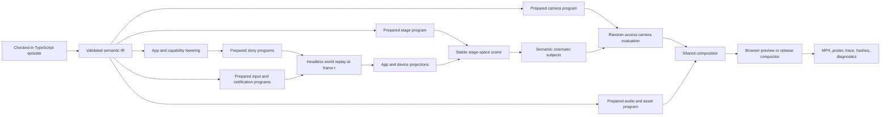
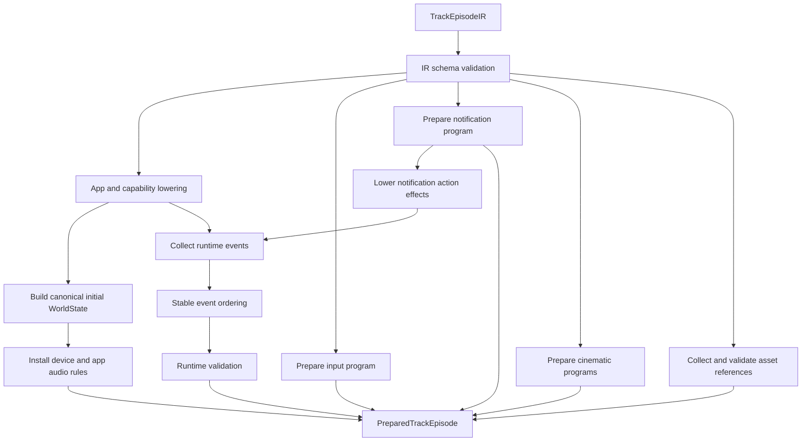
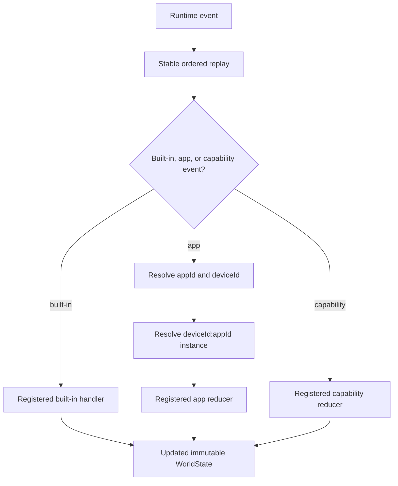
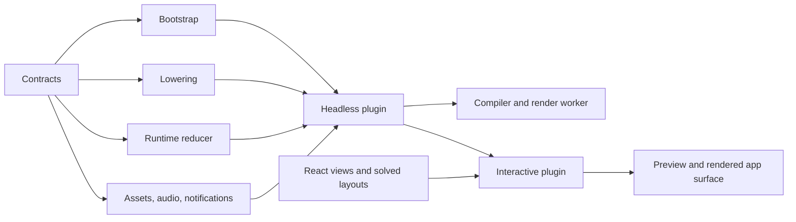
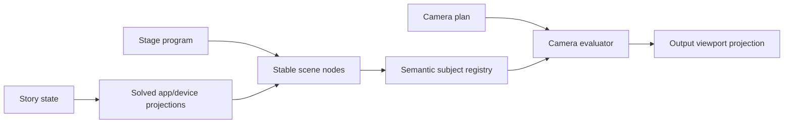
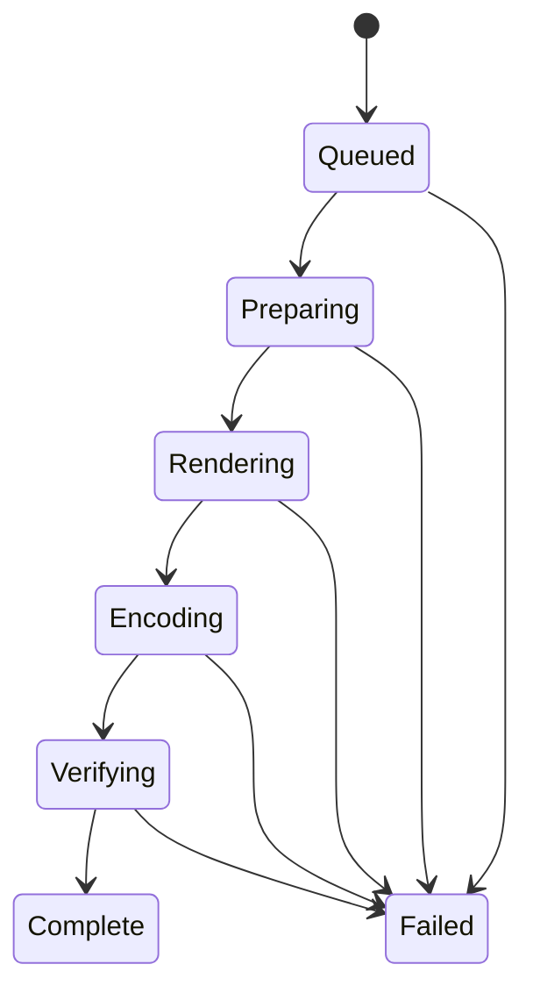
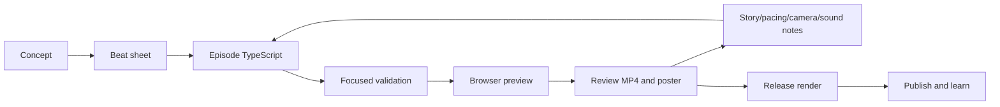

# Tokovo Engineering Handbook

**Status:** Canonical current-state architecture  
**Audience:** product, content, app, device, compiler, camera, renderer, and operations engineers  
**Last reviewed:** 2026-07-24  
**Active product priority:** code-first, LLM-assisted content production  
**Visual editor:** deleted

This is the complete map of how Tokovo works today. It explains the shipping engine, the hard-cut
architecture, the reference app migrations, the content-production workflow, the deleted
visual-editor boundary, and the evidence required before a render or architectural claim is
considered complete.

Use this document to understand the system end to end. Use the companion references for exact
authoring APIs, package-specific contracts, implementation history, and operating procedures.

## 1. Executive Summary

Tokovo is a deterministic production engine for shows that happen inside phones. Authors describe
story events, app state, devices, OS behavior, camera direction, sound, voice, assets, backgrounds,
and overlays in checked-in TypeScript. Tokovo validates that intent, prepares immutable programs,
replays the logical world at any frame, projects app and device geometry, evaluates an independent
camera program, and produces preview or release pixels.

The product is not:

- browser automation;
- a screen recording with post-production patches;
- a DOM-measurement camera;
- a set of React mockups sharing mutable global state;
- a Remotion timeline used as the domain model;
- a visual editor that owns a second version of the episode.

The central contract is:

> Given identical authored input, registered packages, render profile, and frame, Tokovo produces
> identical logical state, projections, camera output, pixels, and audio.

The current architecture makes every important concern independently authored, prepared, signed,
cached, evaluated, and diagnosed:



No downstream layer is allowed to reconstruct or silently repair an upstream decision.

## 2. Current Product Decision

### 2.1 Content creation is the priority

The active workflow is code-first and LLM-assisted. The immediate product goal is to create,
review, render, publish, and learn from excellent episodes.

Engine work is justified when real content repeatedly exposes a central limitation. The preferred
sequence is:

1. write the story and attempt the episode with current contracts;
2. identify the exact repeated authoring, fidelity, or rendering bottleneck;
3. improve the smallest correct central boundary;
4. add regression evidence;
5. return to content production.

This prevents infrastructure from becoming a substitute for publishing.

### 2.2 The visual editor is deleted

The visual-editor app, model, interaction engine, compiler adapter, app contributions, and
editor-specific render-job bridge were removed. They are not maintenance surfaces and no
compatibility aliases remain. A future visual editor would require a new evidence-backed product
and architecture decision. See [Visual Editor Decision](./STUDIO.md).

### 2.3 Supported surfaces are intentionally different

Tokovo distinguishes two support questions:

1. **Can an app render in code-first episodes?**
2. **Has the app completed the stricter reference headless-package migration?**

WhatsApp and X are the reference migrated headless app packages. Other app simulators may still
render in code-first episodes, but they are not represented as completed reference migrations.
Missing headless registration must fail explicitly; the system must not silently import a React
plugin.

## 3. Non-Negotiable Invariants

These rules outrank local convenience.

### 3.1 Determinism

- Direct evaluation at frame `t` must equal sequential evaluation through frame `t`.
- Event ordering must be stable and independent of object enumeration accidents.
- Runtime behavior must not depend on `Date.now()`, `Math.random()`, host locale, host timezone,
  live network data, or import order.
- Mutable defaults must not be shared across episode instances.
- Operational wall-clock timings may be recorded as metadata but may not enter signatures or
  replay.

### 3.2 One canonical owner

- Apps own app semantics.
- Device packages own OS semantics.
- The compiler owns orchestration and cross-boundary validation.
- Core owns replay and registries.
- Stage owns scene placement.
- Camera owns observation and cinematography.
- Renderer owns painting solved projections.
- Render service owns release execution, artifacts, integrity, and operational policy.

If two layers can independently decide the same behavior, the architecture is wrong.

### 3.3 Explicit identity

- Every app event carries `appId` and `deviceId`.
- Every app instance is keyed by `${deviceId}:${appId}`.
- Every durable authored item has a stable ID.
- Camera targets semantic or entity subjects, not array indexes or DOM coordinates.
- Assets have explicit ownership and provenance.
- Runtime registration is explicit; duplicates and missing registrations throw.

### 3.4 Fail loudly

Missing plugins, app instances, devices, layouts, profiles, subjects, assets, sounds, or render
backends must produce stable, contextual errors. An owned invalid event may never disappear through
`[]`, `null`, a placeholder, or a warning-only fallback.

Preview may present a structured diagnostic. Release rendering must fail.

### 3.5 No permanent legacy paths

Architecture migrations are hard cuts. Do not retain:

- global app-state aliases;
- single-device and multi-device state shapes;
- compatibility re-exports;
- old and new event vocabularies routed in parallel;
- fallback device shells;
- renderer-side app semantics;
- DOM-derived camera boxes;
- guessed sound or asset paths;
- duplicate preview compositions;
- editor-only source formats that become a second truth.

When migration is complete, repository tests and scans should make restoration of deleted
architecture difficult.

## 4. Repository and Package Map

### 4.1 Authoring and catalog

| Path                | Responsibility                                                                                       |
| ------------------- | ---------------------------------------------------------------------------------------------------- |
| `packages/episodes` | Canonical episode definitions, metadata, catalogs, runtime manifests, workspace validation           |
| `packages/dsl`      | Fluent authoring for devices, apps, camera, audio, overlays, input, notifications, and device tracks |
| `packages/ir`       | JSON-safe semantic contracts shared between authoring and preparation                                |

### 4.2 Compilation and runtime

| Path                | Responsibility                                                                                       |
| ------------------- | ---------------------------------------------------------------------------------------------------- |
| `packages/compiler` | IR validation, app/capability lowering, bootstrap, program preparation, signatures, asset collection |
| `packages/core`     | Headless world state, replay, event indexing, registries, middleware, lifecycle, logging contracts   |
| `packages/stage`    | Deterministic scene graph, transforms, ordering, and stage subjects                                  |

### 4.3 App and OS simulation

| Path                            | Responsibility                                                                                           |
| ------------------------------- | -------------------------------------------------------------------------------------------------------- |
| `packages/apps-*`               | App-owned contracts, snapshots, views, reducers, selectors, layouts, subjects, assets, DSL, lowering, UI |
| `packages/devices`              | Device profiles, frames, status strategies, physical/logical geometry, system surfaces                   |
| `packages/device-keyboard`      | Input sessions, keyboard compilation, frame evaluation, projection, themes, painters, audio              |
| `packages/device-notifications` | Delivery/lifecycle/actions, projection, grouping, privacy, themes, painters, audio                       |
| `packages/visual-system`        | Versioned platform visual profiles, typography, materials, safe-area and appearance policy               |

### 4.4 Cinematography and presentation

| Path                   | Responsibility                                                                                   |
| ---------------------- | ------------------------------------------------------------------------------------------------ |
| `packages/camera`      | Camera program, shot composition, subject tracking, motion, optics, evaluation, quality analysis |
| `packages/renderer`    | React composition of solved world, stage, device, app, and camera projections                    |
| `packages/react`       | Shared runtime-aware React integration                                                           |
| `packages/composition` | Shared composition boundary used by preview and render consumers                                 |
| `packages/background`  | Authored stage backgrounds                                                                       |
| `packages/overlay`     | Editorial overlays and captions                                                                  |
| `packages/voice`       | Voice manifests, sync, and voice asset handling                                                  |
| `packages/assets`      | Central static asset ownership and public render assets                                          |

### 4.5 Applications and operations

| Path                  | Responsibility                                                                |
| --------------------- | ----------------------------------------------------------------------------- |
| `apps/video-runner`   | Interactive Remotion preview and local render entrypoint                      |
| `apps/render-service` | Release orchestration, durable jobs, caches, encoding, artifacts, diagnostics |
| `apps/docs`           | Public documentation site                                                     |
| `apps/web`            | Marketing surface                                                             |

## 5. Code-First Authoring

### 5.1 Episode definition

A canonical episode is a checked-in `*.episode.ts` module wrapped by `defineEpisode`. It has:

- stable metadata and catalog identity;
- output format, duration, and app declaration;
- a deterministic `build()` function;
- optional separate camera direction;
- explicit assets and configuration.

The episode builder emits semantic IR. Authors describe intent rather than component mutations.

```ts
export default defineEpisode({
  meta: {
    id: "incident-room",
    title: "Incident Room",
    category: "production",
    catalogType: "story",
    visibility: "public",
    sortOrder: 100,
    tags: ["story", "whatsapp", "camera"],
  },
  config: {
    format: "1080x1920",
    durationInFrames: 900,
    apps: ["app_whatsapp"],
  },
  build: () =>
    episode("incident-room", {
      fps: 30,
      duration: "30s",
      title: "Incident Room",
    })
      .device("phone", "iphone16", {
        app: "app_whatsapp",
        appearance: "dark",
        installedApps: ["app_whatsapp"],
        os: { time: 1784833800000, battery: 58, network: "5G" },
      })
      .snapshot("app_whatsapp", "phone", {
        conversations: [{ id: "war-room", name: "War Room", type: "group" }],
      })
      .whatsapp("phone", "war-room", (whatsapp) => {
        whatsapp
          .at("1.0s")
          .receive("Mira", "Did that deploy go to production?", {
            messageId: "deploy-question",
          });
      })
      .cinematics(cameraDirection)
      .build(),
});
```

The example is deliberately explicit. Story decisions remain visible in the episode instead of
being hidden inside unrelated helper functions.

### 5.2 Frame-zero state

Frame-zero app state has exactly two app-owned authoring concepts:

- `snapshot(appId, deviceId, data)` seeds domain data;
- `view(appId, deviceId, data)` selects the initial product surface.

Device state does not contain app histories. The compiler does not invent chats, feeds, threads, or
messages. Each plugin validates and hydrates its own snapshot and initial view.

### 5.3 Timeline mutations

Tracks describe behavior after frame zero:

- app tracks emit package-owned semantic events;
- device tracks open apps and change OS/device behavior;
- input sessions drive text fields and the system keyboard;
- notification tracks declare delivery and interaction;
- audio and voice tracks declare sound;
- overlays and backgrounds declare editorial presentation;
- cinematics declares an independent camera plan.

Events use authored frame positions and stable entity IDs. Index-based targeting is rejected because
inserting an earlier item would silently retarget later direction.

### 5.4 Stable handles

An author should be able to name a message, tweet, conversation, field, notification, device, or
camera subject once and use that identity across:

- later app events;
- input submission;
- notification action effects;
- layout;
- camera targeting;
- diagnostics;
- tests.

The DSL may provide fluent helpers, but it must preserve the canonical identity and event payload
that the package owns.

### 5.5 Authoring cost standard

A polished 30–45 second episode should aim for roughly 100–200 intentional lines of story and
direction, not hundreds of lines of state plumbing. This is a product target, not a license to hide
logic.

Reusable abstractions should compress repeated mechanics:

- snapshot factories for recurring casts or worlds;
- app-owned point DSLs;
- named cinematic framings and optical looks;
- plan-family shot sequences;
- reusable audio and notification patterns;
- explicit templates whose generated semantics remain inspectable.

They should not obscure plot order, content, important timing, camera subject choices, or failure
behavior.

## 6. Compilation and Preparation

`prepareTrackEpisode()` is the main bridge from semantic IR to engine-ready programs.

### 6.1 Preparation sequence



The prepared result contains:

- `id`, `fps`, and `durationInFrames`;
- ordered runtime `events`;
- event indexes and keyframed indexes;
- keyframe interval and event signature;
- canonical `initialWorld`;
- immutable `inputProgram`;
- immutable `notificationProgram`;
- independently prepared `cinematics`;
- exact registered plugins;
- collected asset references;
- markers and sections.

### 6.2 Bootstrap ownership

For every mounted `(deviceId, appId)` pair, the compiler:

1. resolves the explicitly registered plugin;
2. creates the plugin's base initial state;
3. passes exact device, IR, snapshot, and view context to the plugin bootstrap contract;
4. runs schema-version checks, migration only where explicitly supported, and validation;
5. stores one hydrated object at `appInstanceId(deviceId, appId)`.

Missing plugins, duplicate app instances, unsupported versions, invalid references, or invalid
bootstrap data fail preparation. There is no reducer-side “create state if missing” fallback.

### 6.3 Lowering ownership

App DSL events are not generic runtime patches. An app package:

- defines its authored vocabulary;
- validates strict payloads;
- lowers those events;
- may emit OS intents, such as a notification;
- returns exact runtime events for its reducer.

The compiler orchestrates lowerers. It does not know what a WhatsApp message or X post means.

### 6.4 Prepared programs

Input, notifications, stage, camera, and story replay are separate because they have different
evaluation and caching behavior.

- Input is random-access and produces field state, keyboard state, and submission effects.
- Notifications have delivery, lifecycle, grouping, privacy, action, and presentation state.
- Story replay produces app/device/capability world state.
- Stage defines where scene nodes exist.
- Camera defines how outputs observe that stage.

A camera-only revision should not invalidate story preparation. A color-grade revision should not
rehydrate app snapshots.

## 7. Canonical Runtime

### 7.1 World state

The exact top-level model is:

```ts
interface WorldState {
  devices: Record<DeviceId, DeviceState>;
  appInstances: Record<`${DeviceId}:${string}`, unknown>;
  capabilityState: Record<string, unknown>;
  audio: AudioState;
  config?: VideoConfig;
  touches?: TouchState[];
}
```

`appInstances` always has the same shape. Single-device episodes do not get an alias or simplified
container. Multi-device episodes do not switch state in and out of a global selected-app slot.

### 7.2 Event routing



App reducers mutate only the canonical mounted instance. Core supplies ordering, middleware,
lifecycle, registries, error wrapping, indexes, and caches; it does not understand app payloads.

### 7.3 Preview and render replay

Uncached replay exists only for preview diagnostics and convenience. Render mode requires
`replayIncremental()` with a keyframed event index and state cache. This prevents release rendering
from accidentally using a path that repeatedly replays the entire episode for every frame.

### 7.4 Error policy

In preview, configured graceful degradation can collect structured event failures so an author can
inspect them. In release mode, reducer errors are wrapped with plugin, event, and frame context and
must fail unless an explicitly approved release policy says otherwise.

### 7.5 Observability

Core logging is scoped and structured. Diagnostic fields should include stable identities—episode,
device, app, event, frame, subject, output, shot, or asset—not only prose.

Debugging must be able to answer:

- Which event changed this state?
- Which app instance received it?
- Which prepared program generated it?
- Which subject did the camera resolve?
- Which projection and optical passes produced this pixel?

## 8. App Plugin Architecture

### 8.1 Package-owned truth

A production app package owns:

- app ID and authored event vocabulary;
- strict payload schemas;
- snapshot and initial-view contracts;
- bootstrap validation and deterministic hydration;
- lowering;
- initial state and reducer;
- selectors and state invariants;
- layout;
- semantic cinematic subjects;
- themes, typography, localization, accessibility, and presentation strategy;
- assets and audio rules;
- notification formatting or intent;
- DSL helpers;
- interactive UI;
- determinism, fidelity, performance, and failure tests.

### 8.2 Entrypoint boundaries

Migrated packages expose explicit entrypoints:

| Entrypoint | React allowed | Purpose                                                           |
| ---------- | ------------: | ----------------------------------------------------------------- |
| `contract` |            no | IDs, types, snapshot/view contracts, schemas, semantic references |
| `dsl`      |            no | Fluent semantic authoring helpers                                 |
| `lowering` |            no | Strict authored-event lowering                                    |
| `runtime`  |            no | State, reducer, selectors, invariants                             |
| `headless` |            no | Server-safe plugin composition                                    |
| `ui`       |           yes | App painters and interactive presentation                         |
| `plugin`   |           yes | `headless` composition plus UI and layouts                        |

The `headless` entrypoint must not transitively load `.tsx`, hooks, CSS, browser globals, or Remotion
views. Compiler and render workers can prepare an episode without bundling app UI.

### 8.3 Headless and interactive composition



WhatsApp and X are the reference implementations. See
[WhatsApp Architecture](./WHATSAPP.md) and [X Architecture](./X.md).

### 8.4 Other app packages

Instagram, iMessage, LinkedIn, Snapchat, Teams, and Typewriter remain usable where their existing
code-first runtime contracts support the episode, but they must not be described as fully migrated
to the WhatsApp/X reference headless architecture.

If future migration resumes, each app must pass the entire
migration requirements in this handbook. There is no partial-registration shortcut.

## 9. WhatsApp in One Page

WhatsApp is the primary reference for a deep, app-owned simulation:

- one canonical state object per device/app instance;
- strict snapshot and initial-view hydration;
- 62 schema-backed public app event types;
- one event discriminator from authoring through runtime;
- exhaustive handler registration;
- deterministic timestamp derivation;
- exact message and surface geometry;
- bounded long-thread projection;
- stable cinematic subjects emitted from the same layout used by UI;
- OS-owned keyboard sessions;
- OS-owned notifications emitted through app lowering;
- app-owned presentation, localization, accessibility, assets, and audio rules;
- a headless plugin composed into an interactive plugin;
- architecture tests that prevent deleted aliases and theme surfaces from returning.

The migration did not put WhatsApp rules into the compiler or renderer. It made package boundaries
strong enough that those central layers no longer need WhatsApp exceptions.

## 10. X in One Page

X follows the same package boundary with a distinct domain:

- schema-versioned users, posts, threads, DMs, notifications, profiles, and initial views;
- explicit authored vocabulary separate from runtime state transitions where needed;
- exhaustive event-specific schema table;
- deterministic post, reply, DM, navigation, and notification actions;
- entity-level timeline, post, thread, profile, composer, and keyboard camera subjects;
- iOS/Android and light/dim/lights-out presentation policy;
- large-feed and message-thread performance contracts;
- server-safe headless composition.

The common architecture is the plugin contract. The app behavior remains local to X.

## 11. Device and Visual System

### 11.1 Device profiles

Device profiles describe physical display geometry and platform identity. `@tokovo/devices`
registers profiles such as `iphone16` and `pixel`, frame painters, status-bar strategies, chrome
metrics, safe areas, and system surfaces.

Missing profiles throw. A generic phone silhouette is not an acceptable release fallback.

### 11.2 App viewport and screen inset

The physical device frame, display glass, screen content, system chrome, and logical app viewport
are separate geometries. App UI receives a required `AppViewportFrame` with logical dimensions; it
does not guess bezel thickness or safe areas.

This separation prevents the “screen pasted on top of the device” look and makes spacing between the
outer hardware, glass, screen, and app content intentional.

### 11.3 Platform visual profiles

`@tokovo/visual-system` owns versioned iOS and Android visual profiles. They do not share one
Noto-derived metric table and hope CSS makes them look native. Profiles govern:

- typography metrics and fallback stacks;
- light and dark palette seeds;
- material depth and blur policy;
- safe-area behavior;
- keyboard and notification appearance;
- status and system-surface hierarchy;
- composition guidance and backdrop policy.

Apps consume the resolved experience instead of copying platform constants.

### 11.4 Keyboard

The keyboard is an OS capability, not an app component. An app declares input intent for a semantic
field; the device-keyboard compiler prepares immutable input sessions.

At a frame, keyboard evaluation resolves:

- active field and session;
- typed text, cursor, and corrections;
- language and layout;
- suggestions and prediction state;
- appearance and platform geometry;
- entrance/exit progression;
- submit/cancel behavior;
- key and typing audio cues.

The painter uses platform-specific layouts and metrics. App layouts reserve keyboard-safe space
through the central viewport/projection contract, so WhatsApp, X, and future apps do not independently
solve keyboard spacing.

### 11.5 Notifications

Notifications are also OS-owned. Apps emit typed notification intent; the notification package owns:

- scheduled delivery;
- interruption level;
- lockscreen, banner, and notification-center projection;
- grouping and thread behavior;
- privacy and redaction;
- foreground policy;
- DND effects;
- quick actions and reply;
- lifecycle and dismissal;
- platform material, spacing, blur, and audio.

Notification actions can lower into deterministic app or device effects. A WhatsApp quick reply
does not mutate WhatsApp from the notification painter.

### 11.6 Lockscreen, homescreen, island, and recording

Lockscreen and homescreen are deterministic device projections, not special app routes. Dynamic
Island and screen-recording activity are system state with explicit compact, expanded, active,
stopping, and completed behavior.

Recording remains compact by default, expands only when authored, and stays active until a stop
event occurs. The expanded surface must remain visually distinct from dark app content. Transition
geometry is resolved by the device system so camera scale does not create a second animation path.

## 12. Stage and Camera

### 12.1 Why stage and camera are separate

Moving the device to fake a camera move creates an eerie result: shadows, background relationship,
negative space, multi-device composition, and PIP all drift with the subject. Tokovo keeps stage
placement stable and moves the camera projection.



Changing a lens, filter, shot duration, or camera plan does not mutate the episode's app state or
device transforms.

### 12.2 Subjects

Camera targets are typed identities:

- device body, screen, or keyboard;
- app screen or semantic region;
- exact entities such as a WhatsApp message or X post;
- stage nodes;
- authored groups.

App packages emit subject rectangles from the same solved layout that paints the UI. The camera
never calls `getBoundingClientRect()` or guesses a message rectangle from render pixels.

Subject policies are explicit:

- require the subject and fail;
- use an authored fallback subject;
- apply an explicitly allowed missing-subject policy.

Every fallback use is diagnostic data.

### 12.3 Plan-family authoring

Most episodes author cinematography through:

- scoped subjects;
- named framing presets;
- named lenses, modifiers, and filters;
- one or more plan variants;
- output definitions;
- sequential duration-based shots;
- per-plan deltas.

This makes the camera code read like an edit decision list:

```ts
shot("reveal", 90, target.message)
  .frame("message")
  .fallback(whatsapp.semantic("last-message"))
  .filters("panic-cold")
  .dollyIn(24, { amount: 0.06 })
  .when("optical", {
    lens: "wide-angle-barrel",
    modifiers: ["held-breath"],
  });
```

Low-level absolute outputs, rigs, intervals, priorities, and custom motion profiles remain available
when a special sequence genuinely requires them.

### 12.4 Outputs and multi-screen composition

Each camera output has its own:

- editorial viewport;
- coverage policy;
- selected plan;
- default rig;
- pose;
- framing guard;
- travel/stabilization policy;
- subject and fallback chain;
- optical passes.

PIP and multi-screen views are independent outputs occupying authored composition space. A PIP must
not cover the hero device by accident; the composition should reserve intentional negative space.

### 12.5 Camera motion

The camera supports deterministic:

- cuts;
- minimum-jerk transitions;
- damped settle motion;
- dolly in and out;
- truck left and right;
- pedestal up and down;
- pan and tilt intent;
- crane motion;
- roll;
- whip transitions;
- projective orbit;
- direct and baked tracking.

Motion is evaluated by frame. It cannot depend on the order in which frames are requested.

### 12.6 Lenses, modifiers, and filters

The optical model is registry-based and app-agnostic. Current direction includes:

- wide-angle barrel distortion;
- fisheye;
- anamorphic edge stretch;
- projective warp;
- directional smear;
- lens breathing;
- crop compensation;
- color grade with brightness, contrast, saturation, gamma, temperature, and tint.

An episode references named look definitions. Adding a new lens should require a versioned IR
contract, strict validation, a registered headless model, preview and release backend mapping, and
mathematical/visual/temporal tests—not edits to WhatsApp, X, or episode replay.

### 12.7 Camera diagnostics

For every output and frame range, quality analysis can inspect:

- coverage gaps;
- unauthored pose discontinuities;
- missing or fallback subjects;
- subject fill;
- framing-guard violations;
- velocity, acceleration, and jerk;
- crop-compensation changes;
- pass order and projection hashes.

Release profiles fail on configured temporal-quality violations.

## 13. Renderer and Shared Composition

The renderer is a composition root. It:

1. obtains the prepared episode;
2. replays the world at the requested frame;
3. evaluates input, notifications, device, stage, and camera;
4. resolves app layouts and semantic subjects;
5. paints the shared composition.

It must not:

- initialize missing app state;
- choose a camera target;
- infer an app route;
- repair invalid safe areas;
- synthesize an asset path;
- convert a missing subject into a generic box;
- maintain hidden frame-to-frame mutable state.

`packages/composition` exists so video-runner and render-service consumers use the
same Tokovo composition boundary. A consumer may choose preview or render optics, but it may not
create a second logical renderer.

## 14. Preview and Release Optics

### 14.1 Preview

Preview prioritizes fast iteration and interactive seeking. It may use browser projection for
release-only texture effects, but the difference must be explicit:

- a visible preview-optics indicator;
- preview-named output;
- sidecar metadata declaring `projectionMode: "preview"`;
- no presentation of a preview artifact as release output.

### 14.2 Release

Release rendering uses deterministic texture composition where required:

- camera-independent plates;
- displacement maps and optical passes;
- bounded parallel composition;
- content-addressed chunks;
- normalized encoding metadata;
- temporal-quality enforcement;
- integrity hashes and traces.

The logical app/device projection is shared. Only the optical execution path differs.

## 15. Assets, Audio, and Voice

### 15.1 Asset contract

Assets are episode data, not arbitrary strings discovered by painters. References include:

- owner;
- usage;
- source;
- frame range;
- load strategy;
- priority;
- provenance.

App asset collectors receive exact device/app context. The central provenance gate rejects missing,
deleted placeholder, unknown, or improperly licensed bundled assets.

Static public assets now have a central package boundary rather than being owned implicitly by
video-runner.

### 15.2 Audio

Runtime audio supports explicit play, stop, stop-all, fade, crossfade, buses, and ducking policy.
Apps contribute deterministic auto-sound rules for their canonical event vocabulary. Device
capabilities contribute keyboard and notification sounds.

A bare unregistered sound ID is an error. The engine does not guess `sounds/<id>.wav`.

### 15.3 Voice

Voice tracks and manifests are declared content assets. Sync data, source identity, and provenance
must be reproducible. Voice ducking and mixing policy belong to prepared audio behavior, not
component-local effects.

## 16. Render Service and Performance

### 16.1 Durable job contract

Release jobs are immutable requests tied to a saved source revision. A job records enough identity
to prove what was rendered:

- episode/document identity;
- revision;
- source signature;
- bundle-source signature;
- render profile;
- selected camera plan/output;
- input asset identities;
- lifecycle status and phase;
- artifacts and failure data.

The service must never render unsaved browser memory.

### 16.2 Two different signatures

The system separates:

- **source signature:** semantic authoring content;
- **bundle-source signature:** source/build closure that affects executable rendering.

This allows the service to distinguish an unchanged story from a changed render implementation.
Camera and stage programs also carry independent identity so narrower cache reuse is possible.

### 16.3 Job lifecycle



The durable store and worker use explicit locking and revision verification. Duplicate or stale work
must be detected using identity, not filenames or UI state.

### 16.4 Cache hierarchy

Potential reusable layers include:

- workspace/package build output;
- Remotion bundle;
- prepared story program;
- prepared stage and camera program;
- app/device frame plates;
- camera-compositor chunks;
- encoded segments where codec constraints allow safe reuse.

Camera-only revisions should reuse story preparation and camera-independent plates. Optical changes
should invalidate only outputs affected by the changed pass and signature.

### 16.5 Measured performance status

The under-five-minute release target is proven for the 38-second `x-the-last-frame` reference on the
pinned Darwin arm64 environment. The recorded 2026-07-23 run completed in 150.127 seconds from an
isolated cold cache and 10.648 seconds with reusable camera chunks. Cold and warm MP4/poster outputs
were byte-identical.

The benchmark command enforces a 300-second cold budget, a 60-second warm budget, a warm/cold ratio
of at most 0.5, expected frame count, and byte identity. The result is a reference-machine proof,
not a throughput promise for arbitrary hardware.

Full-cache reuse is measured. Localized invalidation is implemented by frame-local chunk identity,
but a separately recorded benchmark for a real one-shot camera revision is still useful evidence.
See [Rendering and Performance](./RENDERING.md) for the exact environment, phases, cache contracts,
and command.

### 16.6 MediaBunny

MediaBunny is useful for browser-side or worker-side media analysis, metadata extraction, waveform
work, and supported media operations. It does not automatically make Remotion frame rendering
faster. The dominant release cost remains React/Chromium frame production, optical composition,
encoding, and cache effectiveness.

Use MediaBunny where it removes an actual media-processing bottleneck; do not introduce a second
video pipeline on the assumption that a library name implies global speedup.

## 17. Content Production Workflow

### 17.1 Story before plumbing

A strong 30–45 second phone-native episode needs:

- an immediate hook;
- a legible social or emotional premise;
- escalation every few seconds;
- a turn or reveal;
- a clean payoff or cliffhanger;
- app choices that serve the story;
- camera and sound that clarify or intensify the beat.

Architecture cannot rescue an uninteresting script.

### 17.2 Recommended production loop



During iteration, run only checks proportional to the change. Do not rebuild and lint the whole
monorepo after every line. Before release, run the full gate.

### 17.3 Episode deliverable

A finished episode should have:

- checked-in source;
- catalog metadata;
- deterministic snapshots and explicit dates;
- stable entity IDs;
- intentional device and app transitions;
- intentional camera plan;
- intentional keyboard, notification, sound, and voice direction;
- validated asset provenance;
- focused package and episode tests;
- reviewed preview;
- review MP4 and poster;
- release MP4 and manifest;
- brief production notes for reusable friction.

### 17.4 Composition review

Review the actual frames, not only tests:

- Is the screen seated inside the device rather than pasted over it?
- Does keyboard appearance preserve app context and safe spacing?
- Are notification hierarchy, material, spacing, and blur platform-credible?
- Does the camera focus attention without making the device itself drift unnaturally?
- Does the wide shot have designed negative space?
- Does a close shot preserve enough context?
- Is PIP placed into reserved space?
- Is the background supporting the product rather than overpowering it?
- Are empty states intentional and free of emoji/placeholders?
- Does every golden represent an approved target, not merely a stable mistake?

## 18. Testing and Evidence

### 18.1 Test layers

| Layer               | Required evidence                                                          |
| ------------------- | -------------------------------------------------------------------------- |
| Contracts           | strict schemas, stable IDs, invalid-reference failures                     |
| Bootstrap           | deterministic hydration, version checks, cross-reference validation        |
| Runtime             | every event kind, state invariants, multi-device isolation                 |
| Input/notifications | random access, lifecycle, actions, platform projection                     |
| Layout              | exact rectangles, bounded windows, width variants                          |
| Camera              | math, subject resolution, fallback policy, random access, temporal quality |
| Renderer            | composition integration, preview/release distinction                       |
| Assets/audio        | provenance, registry resolution, missing-reference failures                |
| Performance         | recorded fixture budgets, cache telemetry                                  |
| Pixels              | independent-process determinism and reviewed goldens                       |
| Episode             | end-to-end flagship and exhaustive matrices                                |

### 18.2 Golden policy

A golden screenshot proves that future renders repeat an accepted image. It does not prove that the
accepted image has good spacing, authentic typography, correct blur, or strong composition.

Goldens must be created only after human product review of:

- geometry and safe areas;
- platform typography;
- materials and depth;
- keyboard and notification behavior;
- camera framing;
- content quality;
- empty states;
- device/screen integration.

### 18.3 Canonical commands

Use the repository toolchain:

```bash
mise install
mise exec -- pnpm install
```

Focused checks:

```bash
mise exec -- pnpm lint:ox
mise exec -- pnpm lint:release
mise exec -- pnpm -s typecheck:solution
mise exec -- pnpm --filter @tokovo/episodes test
mise exec -- pnpm --filter @tokovo/apps-whatsapp test
mise exec -- pnpm --filter @tokovo/apps-x test
mise exec -- pnpm --filter video-runner typecheck
mise exec -- pnpm --filter docs build
```

Preview and fast render:

```bash
mise exec -- pnpm --filter video-runner dev
EPISODE_ID=v2-creator-series-showcase \
  mise exec -- pnpm --filter video-runner render:fast
```

Release gate:

```bash
mise exec -- pnpm verify:release
```

`.mise.toml` pins Node.js `22.22.0` and pnpm `10.28.2`. Non-interactive commands must use
`mise exec --` so they cannot fall through to unsupported system Node installations.

## 19. Failure Taxonomy

Failures should identify both category and owner.

| Category     | Examples                                           | Owner                   |
| ------------ | -------------------------------------------------- | ----------------------- |
| Authoring    | duplicate ID, invalid duration, dangling reference | DSL/IR/package contract |
| Registration | missing or duplicate plugin/profile/model          | registry owner          |
| Bootstrap    | unsupported version, malformed snapshot/view       | app package             |
| Lowering     | unknown owned event, invalid payload               | app/capability package  |
| Replay       | missing app instance, reducer invariant            | core + owning package   |
| Projection   | invalid safe area, absent layout                   | device/app projection   |
| Subject      | missing entity, invalid fallback                   | app/stage/camera        |
| Optics       | invalid pass parameters/backend                    | camera/compositor       |
| Asset        | missing file, provenance failure                   | asset owner/compiler    |
| Audio        | unknown sound or malformed cue                     | audio owner             |
| Render       | stale revision, lock, encode, hash failure         | render service          |
| Quality      | coverage, jerk, crop, pixel drift                  | camera/release gate     |

A useful failure packet contains episode/revision, frame range, device/app, event or subject ID,
selected plan/output/shot, signatures, relevant logs, and artifact paths.

## 20. Extension Playbooks

### 20.1 Add an app to the migrated architecture

1. Define one authored vocabulary and strict schemas.
2. Define snapshot and initial-view contracts.
3. Implement deterministic bootstrap and state invariants.
4. Implement exhaustive lowering and reducer handlers.
5. Add selectors, solved layouts, and cinematic subjects.
6. Add platform presentation, localization, accessibility, assets, audio, input, and notifications.
7. Export strict `contract`, `dsl`, `lowering`, `runtime`, `headless`, `ui`, and `plugin`
   boundaries.
8. Add package, multi-device, long-data, deterministic, and visual evidence.
9. Delete replaced paths and add architecture scans.
10. Register the app only after every migration gate passes.

### 20.2 Add a camera lens or filter

1. Define or extend a versioned IR pass.
2. Validate all parameters strictly.
3. Register a headless evaluator.
4. Implement preview mapping.
5. Implement release compositor mapping.
6. Define crop compensation and alpha behavior.
7. Add mathematical, determinism, edge, text-fidelity, and temporal tests.
8. Prove it in an app-agnostic fixture.
9. Document its visual intent and unsafe ranges.

### 20.3 Add a device or platform revision

1. Register a new versioned visual profile.
2. Register exact device geometry and chrome.
3. Implement keyboard, notification, status, lock/home, island/activity policies.
4. Prove light/dark and relevant locales.
5. Add safe-area, screen-inset, platform typography, and visual tests.

Do not branch every app painter for the new device.

### 20.4 Add a content abstraction

1. Prove the repetition in at least one real episode.
2. Keep stable IDs and deterministic output.
3. Preserve story and timing visibility.
4. Emit canonical existing IR rather than a parallel runtime model.
5. Add a compact authoring example and failure test.
6. Measure whether it actually reduces intentional authoring lines.

## 21. Honest Current-State Ledger

### 21.1 Implemented architecture

- canonical device-scoped app-instance world state;
- explicit plugin and capability registration;
- deterministic indexed replay and render-mode cache requirements;
- app-owned snapshot/view bootstrap;
- prepared input and notification programs;
- separated stage and camera programs;
- semantic subject targeting;
- deterministic motion, lens, modifier, and filter contracts;
- shared composition boundary;
- centralized asset ownership and provenance checks;
- preview/release optical distinction;
- render-service job, cache, diagnostic, and performance primitives;
- WhatsApp and X headless package contributions;
- hard-cut architecture and regression tests across major migrated boundaries.

### 21.2 Deliberately absent

- no visual editor or second episode document model;
- no editor-specific app contributions or render-job bridge;
- no compatibility layer for the deleted editor packages;
- no generic event inspector that bypasses app-owned semantics.

### 21.3 Not yet proven or intentionally deferred

- migration of every app package to the WhatsApp/X reference headless standard;
- a separately recorded partial-cache benchmark for a real one-shot camera revision;
- broad production evidence across many published episodes;
- any future platform/device revision not represented by a registered profile.

### 21.4 What “10/10” means

“10/10” is not a code-completion label. A surface is excellent only when:

- its architecture has one owner and no fallback legacy path;
- its behavior is deterministic and extensible;
- invalid intent fails clearly;
- it performs within a measured budget;
- close, medium, and wide frames look intentional;
- platform typography, spacing, safe areas, and materials survive visual review;
- real episodes prove that it is pleasant to author;
- reviewed outputs are good enough to publish without apology.

## 22. Documentation Governance

Architecture documentation must distinguish:

- **current contract** — implemented and required;
- **target** — desired but not yet proven;
- **deleted** — intentionally absent and guarded against accidental restoration.

Completed implementation plans are deleted after their durable contracts and evidence are folded
into the owning current document. Git is the historical record.

When source and documentation disagree, source plus passing tests define actual behavior, but the
documentation discrepancy is a release defect and should be fixed in the same change.

### Authoritative reading order

1. This handbook for the complete system.
2. [Camera](./CAMERA.md) for production cinematography and camera internals.
3. [WhatsApp](./WHATSAPP.md) for the reference app migration.
4. [X](./X.md) for the second reference app.
5. [Platform Visuals](./PLATFORM_VISUALS.md) for device and OS fidelity.
6. [Rendering and Performance](./RENDERING.md) for caches, benchmarks, and release rendering.
7. [Visual Editor Decision](./STUDIO.md) for the deleted editor boundary.
8. [Operations](./OPERATIONS.md) for release, logging, and failure response.

## 23. Glossary

| Term                    | Meaning                                                                        |
| ----------------------- | ------------------------------------------------------------------------------ |
| authored intent         | Human- or LLM-written semantic episode data                                    |
| IR                      | Validated, JSON-safe semantic episode representation                           |
| prepared program        | Immutable compiler output evaluated by frame                                   |
| world state             | Canonical logical devices, app instances, capabilities, and audio              |
| app instance            | State for exactly one `(deviceId, appId)` pair                                 |
| capability              | Non-app domain such as keyboard, notifications, or overlays                    |
| projection              | Deterministic read-only presentation data at a frame                           |
| stage                   | Stable spatial arrangement of scene nodes                                      |
| subject                 | Typed camera-targetable semantic or entity region                              |
| camera plan             | Independent cinematographic direction                                          |
| output                  | One camera/editorial viewport, including PIP or split views                    |
| optics                  | Lens, modifier, filter, and compositor behavior                                |
| preview optics          | Fast browser representation for iteration                                      |
| release optics          | Deterministic final compositor path                                            |
| source signature        | Identity of semantic authored content                                          |
| bundle-source signature | Identity of executable source/build closure                                    |
| golden                  | Reviewed expected pixel output used for regression                             |
| hard cut                | Migration that deletes the superseded path instead of preserving compatibility |
| headless plugin         | Server-safe app composition without React UI imports                           |

## 24. Final Architectural Standard

Authors describe narrative and cinematic intent. Apps own app truth. Devices own OS truth. The
compiler resolves and validates boundaries. Core replays exact registered transitions. Stage places
stable scene nodes. Camera observes semantic subjects without moving the world. Renderer paints
solved projections without improvising. Render service proves revision, performance, integrity, and
quality.

If a new feature preserves that chain, it can become a durable part of Tokovo. If it creates a
second truth, a hidden fallback, or an unmeasured claim, it is not the current architecture.
