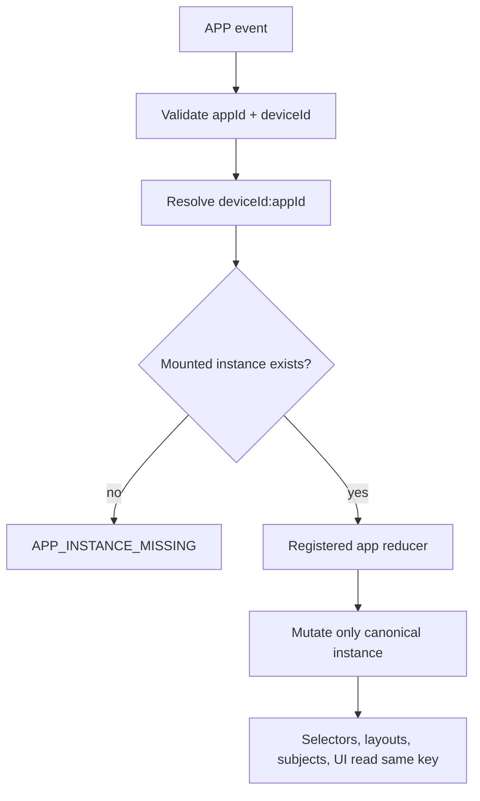

# Tokovo Engine VNext Architecture

**Status:** Implemented hard cut
**Audience:** engine, compiler, app, device, renderer, and render-service maintainers
**Last reviewed:** 2026-07-22
**Companions:** [Camera VNext Architecture](./CAMERA_VNEXT_ARCHITECTURE.md), [Camera VNext Implementation Record](./CAMERA_VNEXT_IMPLEMENTATION_PLAN.md), and [Visual System VNext Implementation Record](./VISUAL_SYSTEM_VNEXT_IMPLEMENTATION_PLAN.md)

## Product Contract

Tokovo is a deterministic cinematic operating system for episodes that happen inside phones. An
episode is checked-in TypeScript data, not a browser automation recording. Given the same prepared
episode, frame, render profile, and registered packages, Tokovo must produce the same logical state,
camera projection, pixels, and audio.

The governing invariant is:

> Every concern has one canonical owner, every authored intent either survives compilation or fails
> loudly, and rendering is a pure projection of prepared episode data and replayed world state.

## Canonical Flow

```mermaid
flowchart LR
  A["TypeScript episode + app-owned DSL"] --> B["Validated semantic IR"]
  B --> C["Capability compilers"]
  C --> D["Prepared story, stage, camera, input, notification, audio programs"]
  D --> E["Headless replay at frame t"]
  E --> F["Solved app + device projections"]
  F --> G["Stage-space cinematic subjects"]
  G --> H["Random-access camera evaluation"]
  H --> I["React/Remotion painters or release texture compositor"]
  I --> J["Pixels, audio, trace, hashes, and quality report"]
```



No layer is allowed to recreate an earlier layer's decisions. The renderer does not infer app
semantics, the camera does not move stage nodes, and core does not know product-specific behavior.

## Non-Negotiable Invariants

1. Direct evaluation of frame `t` equals sequential evaluation through frame `t`.
2. Core depends on no React, Remotion, browser, wall-clock, network, or app implementation.
3. Runtime registration is explicit and duplicate registration throws.
4. Every app event declares `appId` and `deviceId`.
5. Missing app instances, plugins, profiles, layouts, subjects, assets, sounds, or projection
   backends throw stable errors.
6. App state cardinality never changes its shape.
7. App and device geometry is emitted from the same solved layout that paints the frame.
8. Stage placement and camera direction have independent programs and signatures.
9. Preview optics are visibly and mechanically distinct from release optics.
10. Golden pixels supplement structural and product review; they never define correctness alone.

## Canonical World State

`WorldState` has three state domains:

```ts
interface WorldState {
  devices: Record<DeviceId, DeviceState>;
  appInstances: Record<`${DeviceId}:${string}`, unknown>;
  capabilityState: Record<string, unknown>;
  audio: AudioState;
}
```

An app instance is always addressed by the canonical key returned by
`appInstanceId(deviceId, appId)`. There is no global app-state alias, cardinality-dependent
container, device projection, state swapping, or reducer-side implicit initialization.



System features such as overlays own named entries in `capabilityState`; they are not disguised as
apps. Feature reducers may create their own capability entry when their first authored event occurs.

`AudioState` is created once through `createDefaultAudioState()`, so mutable maps, bus configuration,
policy state, and rule arrays are never shared between episodes. Runtime audio accepts only `PLAY`,
`STOP`, `STOP_ALL`, `FADE_OUT`, and `CROSSFADE`; malformed state, missing sound IDs, and unknown audio
events fail with stable errors. App auto-sound actions are a separate registered rule contract, not
runtime-event aliases.

## Ownership

| Package                                   | Owns                                                                                                                           | Must not own                                                        |
| ----------------------------------------- | ------------------------------------------------------------------------------------------------------------------------------ | ------------------------------------------------------------------- |
| `@tokovo/ir`                              | JSON-safe episode, stage, camera, device, input, notification, audio, and app-event contracts                                  | runtime behavior or React                                           |
| `@tokovo/dsl`                             | validated fluent builders and stable entity handles                                                                            | a second runtime model                                              |
| `@tokovo/compiler`                        | lowering, cross-reference validation, bootstrap orchestration, prepared programs, signatures, asset collection                 | app semantics or pixel layout                                       |
| `@tokovo/core`                            | event order, canonical world state, replay, registries, cache and lifecycle contracts                                          | app, camera, device-surface, or render policy                       |
| `packages/apps-*`                         | snapshot/view schemas, hydration, reducer, selectors, layouts, subjects, UI, DSL helpers, lowering, app assets and audio rules | global stage or camera timing                                       |
| `packages/device-*` and `@tokovo/devices` | physical profiles, OS programs, projection, themes, keyboard, notifications, lock/home, island and system activity             | app semantics                                                       |
| `@tokovo/stage`                           | deterministic scene graph, transforms, paint order, stage subjects                                                             | shot selection                                                      |
| `@tokovo/camera`                          | composition, shots, motion, tracking, lenses, modifiers, filters, traces and temporal-quality analysis                         | story mutation, stage placement, React or Remotion                  |
| `@tokovo/renderer`                        | composing and painting solved projections                                                                                      | state fallback, product policy, implicit layout or subject recovery |
| render service                            | release plates, texture composition, bounded chunks, artifacts, hashes, quality enforcement and upload                         | story or camera semantics                                           |

## App Package Contract

Every mounted app provides one initial-state creator and may provide app-owned snapshot and view
hydration. Compilation creates one state object per mounted device, even when only one device uses
the app. Reducers and selectors require the event or caller's `deviceId`; missing state is an error.

App UI receives an exact render context:

- `deviceId` and platform;
- frame `t`;
- logical width and height;
- a required `AppViewportFrame`;
- the unprojected canonical world;
- app-owned layout and semantic-subject registrations.

Adding a new app therefore requires no OS safe-area guesses, global theme aliases, device shell
fallbacks, or renderer-specific state adapters.

## Device and Visual System

`@tokovo/visual-system` owns versioned platform visual profiles. Profiles define physical display
geometry, typography metrics, material behavior, palette seeds, composition guidance, and governed
backdrops. iOS and Android use separate metrics and painters.

The device capability resolves one profile into:

- exact frame/display inset and logical app viewport;
- status bar and home-indicator behavior;
- lockscreen and homescreen projection;
- platform keyboard geometry and language layout;
- notification hierarchy and material depth;
- Dynamic Island and screen-recording projection.

Keyboard state comes from compiled input sessions. Notification state comes from a compiled
notification program. Both evaluate by frame and paint exactly once. Screen recording remains
compact unless an authored event expands it and remains active until an authored stop event occurs.

## Camera and Stage

Story, stage, and camera are independent prepared artifacts with independent signatures. Recutting an
episode changes only the selected CameraPlan and camera signature.

Camera targets typed semantic, entity, device, or group subjects. It never measures DOM nodes. Each
output owns a complete pose, editorial viewport, framing guard, lens, modifiers, filters, and explicit
missing-subject policy. PIP is an independently evaluated output positioned in authored negative
space, not a foreground-device mutation.

Supported direction includes cuts, minimum-jerk blends, deterministic damped motion, whip, dolly,
truck, pedestal, pan/tilt intent, crane, roll, projective orbit, direct or baked tracking, lens
breathing, projective warp, barrel distortion, fisheye, anamorphic stretch, smear, and color grade.

The render service analyzes every captured output for frame gaps, unauthored pose discontinuities,
invalid subject fill, velocity, acceleration, jerk, crop-compensation changes, and explicit subject
fallback usage. Release profiles fail when the temporal report fails.

## Renderer and Render Modes

The renderer is a composition root. It receives prepared data, replays the requested frame, resolves
registered layouts and profiles, projects device and app surfaces, and paints them. It may show a
structured error in preview; release rendering throws.

There are two explicit optical modes:

- `preview`: fast browser projection with a visible `PREVIEW OPTICS` badge and a sidecar metadata
  file whose output name contains `preview`;
- `render`: release texture composition with camera-independent plates, deterministic displacement
  maps, bounded frame chunks, normalized encoding metadata, and temporal-quality enforcement.

A preview artifact cannot be mistaken for a release artifact.

## Assets and Audio

Assets are episode data with owner, usage, source, frame range, strategy, priority, and provenance.
Compilation walks canonical app instances and calls each app collector with the exact `deviceId` and
app state. The repository provenance gate rejects deleted placeholders, unlicensed files, and unknown
bundled assets.

Sound IDs must be absolute/relative asset paths or explicit sound-registry entries. An unregistered
bare sound ID throws `SOUND_NOT_REGISTERED`; no guessed `.wav` path is produced.

## Determinism and Visual Proof

Logical tests cover reducers, compilation, random access, layouts, subjects, camera math, system
programs, and failure contracts. Pixel proof renders the same frame in two independent browser
processes and compares channels with tolerance `3`, then compares against reviewed goldens. A
separate isolated-raster budget permits at most 16 transformed image-antialias pixels with a maximum
channel delta of 16; geometric or widespread pixel drift still fails.

The proof command builds the complete video-runner dependency closure before bundling, so a golden
can never be written from stale workspace output.

The canonical mega fixture is `os-surface-mega-exhaustive`. Its reviewed probes cover:

- iOS and Android lock/home surfaces;
- light and dark platform materials;
- Hindi, Arabic/RTL, Japanese, and English input;
- keyboard entrance, correction, submit, and exit;
- banner, center, grouping, privacy, DND, foreground policy, and quick reply;
- compact recording, explicit expansion, stop, completion, and dark-content separation;
- multi-device editorial composition and camera-safe negative space.

Goldens prove repeatability only after product review confirms geometry, hierarchy, language layout,
safe areas, device/display inset, camera framing, and material depth.

## Diagnostics and Artifacts

Release jobs emit enough deterministic data to explain any frame:

- story, stage, and camera signatures;
- selected plan, output, shot, rig, subject provenance, framing guard and final pose;
- ordered optical passes and projection hashes;
- `camera-program.json`;
- `camera-diagnostics.json`, including temporal quality;
- `projection-hashes.json`;
- `camera-trace.ndjson`;
- render metadata with `projectionMode: "render"`;
- a failure packet when preparation, projection, quality, encoding, or upload fails.

Operational wall-clock timings remain metadata and never participate in replay or signatures.

## Extension Rules

To add an app:

1. define app-owned snapshot/view contracts and initial state;
2. define device-required track events and lowering;
3. register one reducer and selectors over canonical app instances;
4. emit layout and cinematic subjects from the same solved geometry;
5. render from the exact app context;
6. declare assets, sounds, notification adapters, and proof episodes;
7. add reducer, layout, random-access, visual, and failure tests.

To add a lens or filter:

1. add or reuse a versioned IR projection-pass contract;
2. register one headless model with strict parameter validation;
3. map the pass in both preview and release backends;
4. add mathematical, alpha-edge, text-fidelity, determinism, and temporal-quality tests;
5. prove it in an app-agnostic episode.

To add a platform revision, register a new visual and device profile. Do not branch painters by app,
copy safe-area constants, or add generic renderer substitutions.

## Release Gates

A release is blocked unless all of the following pass:

1. formatting, lint, solution typecheck, and package tests;
2. episode validation and exact registration checks;
3. asset-provenance and public-repository hygiene checks;
4. camera mathematical, random-access, backend and temporal-quality tests;
5. independent-browser pixel determinism and reviewed goldens;
6. full mega-episode preview proof and release render smoke test;
7. render artifact integrity, hashes, trace, and metadata validation;
8. repository scans for deleted app-state aliases, generic device shells, no-op events, placeholder
   assets, compatibility re-exports, and unregistered sound fallbacks.

## Final Standard

Authors describe narrative and cinematographic intent. Apps own app truth. Device capabilities own OS
truth. The compiler resolves ambiguity. Core replays exact registered transitions. Projection solves
the complete frame. Camera observes a stable stage. Renderer paints without improvising. The render
service proves quality and repeatability before it calls an artifact complete.
