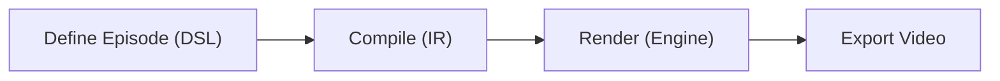

# Tokovo Documentation

> **Enterprise video generation engine for programmatic social media content.**

---

## What is Tokovo?

Tokovo is a **programmatic video engine** that generates viral-style social media videos using code:

- **WhatsApp conversations**
- **Twitter threads**
- **Multi-app scenarios**
- **Automated camera, audio, and effects**



---

## Quick Start

### 1. Run Dev Server

```bash
cd apps/video-runner
pnpm dev
```

### 2. Open Remotion Studio

```
http://localhost:3000
```

### 3. Create New Episode

```bash
pnpm turbo gen episode
```

### 4. Write Episode Code

```typescript
import { defineEpisode } from "@tokovo/episodes";
import { episode } from "@tokovo/dsl";

export default defineEpisode({
    meta: { id: "my-video", title: "My Video", category: "production" },
    config: { format: "1080x1920", durationInFrames: 900, apps: ["app_whatsapp"] },
    build: () => episode("my-video", { fps: 30, duration: "30s" })
        .device("phone", "iphone16", { app: "app_whatsapp" })
        .build(),
});
```

---

## Documentation

### Package Reference

| Package | Purpose |
|---------|---------|
| [**@tokovo/ir**](packages/ir.md) | Intermediate Representation types |
| [**@tokovo/core**](packages/core.md) | Runtime engine and WorldState |
| [**@tokovo/dsl**](packages/dsl.md) | Track-based authoring DSL |
| [**@tokovo/compiler**](packages/compiler.md) | DSL to runtime compilation |
| [**@tokovo/renderer**](packages/renderer.md) | React/Remotion rendering |
| [**@tokovo/apps-whatsapp**](packages/apps-whatsapp.md) | WhatsApp simulation plugin |
| [**@tokovo/episodes**](packages/episodes.md) | Episode management |

### Guides (Coming Soon)

- DSL Reference
- Plugin Development
- Camera System
- Audio System
- Episode Authoring

### Architecture

See [ARCHITECTURE.md](ARCHITECTURE.md) for full system overview.

### Remaining Work

See [REMAINING.md](REMAINING.md) for honest tracking of incomplete items.

---

## Architecture Overview

```
┌──────────────────────────────────────────────────────────────┐
│                        Episode DSL                            │
│   episode("id", config).device().camera().track().build()    │
└─────────────────────────┬────────────────────────────────────┘
                          │
                          ▼
┌──────────────────────────────────────────────────────────────┐
│                    TrackEpisodeIR                            │
│   { id, fps, devices, events: TrackEvent[], markers }        │
└─────────────────────────┬────────────────────────────────────┘
                          │
                          ▼
┌──────────────────────────────────────────────────────────────┐
│               prepareTrackEpisode()                          │
│   Lowering: TrackEvent → RuntimeEvent                        │
│   World Building: DeviceConfig → WorldState                  │
└─────────────────────────┬────────────────────────────────────┘
                          │
                          ▼
┌──────────────────────────────────────────────────────────────┐
│                      replay()                                 │
│   Computes WorldState at frame t                             │
│   Pure function: (initial, events, t) → WorldState           │
└─────────────────────────┬────────────────────────────────────┘
                          │
                          ▼
┌──────────────────────────────────────────────────────────────┐
│                  TokovoRenderer                              │
│   Renders WorldState using React + Remotion                  │
│   DeviceFrame → PluginAppView → Video Frame                  │
└──────────────────────────────────────────────────────────────┘
```

---

## Project Structure

```
tokovo/
├── apps/
│   └── video-runner/         # Remotion application
│
├── packages/
│   ├── ir/                   # Type definitions
│   ├── core/                 # Runtime engine
│   ├── dsl/                  # Authoring DSL
│   ├── compiler/             # Compilation
│   ├── renderer/             # Rendering
│   ├── episodes/             # Episode management
│   ├── apps-whatsapp/        # WhatsApp plugin
│   ├── apps-twitter/         # Twitter plugin (WIP)
│   └── devices/              # Device profiles
│
├── docs-v3/                  # Documentation (you are here)
│   ├── README.md
│   ├── ARCHITECTURE.md
│   ├── REMAINING.md
│   └── packages/
│
└── turbo/                    # Turbo generators
    └── generators/
```

---

## Key Commands

| Command | Purpose |
|---------|---------|
| `pnpm dev --filter=video-runner` | Start Remotion Studio |
| `pnpm turbo gen episode` | Create new episode |
| `pnpm turbo gen plugin` | Create new plugin |
| `pnpm build` | Build all packages |
| `pnpm test` | Run tests |
