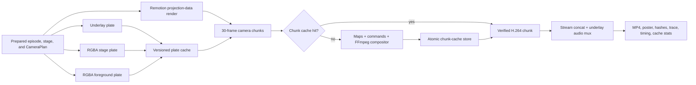

# Rendering and Performance

Status: implemented and measured on 2026-07-23

## Budget

The reference release is `x-the-last-frame`, camera plan `optical`, 1080x1920 at 30fps for 1,140
frames (38 seconds).

| Path                      |       Budget | Measured | Result |
| ------------------------- | -----------: | -------: | ------ |
| isolated cold cache       |         300s | 150.127s | pass   |
| unchanged camera rerender |          60s |  10.648s | pass   |
| cached/cold ratio         | at most 0.50 |    0.071 | pass   |

The previous measured implementation took 954.410s cold and 207.717s with reusable layer plates.
The current path is 6.4x faster cold and 19.5x faster when all camera chunks are reusable. The cold
and cached MP4 and poster artifacts were byte-identical.

The numbers above were recorded on Darwin arm64 with the mise-pinned Node 22.22.0 and pnpm 10.28.2.
They are a local reference, not a promise that arbitrary hardware will have identical throughput.
The benchmark command enforces the same absolute budgets on the machine that runs it.

## Pipeline



Camera-independent pixels and camera-dependent composition are separate products:

- Remotion paints underlay, stage, and foreground once per story/stage/render identity.
- Remotion emits the evaluated per-frame camera program through its typed `Artifact` channel. Camera
  data is not tunneled through browser console logs.
- The compositor divides captures into contiguous 30-frame chunks. Four independent FFmpeg
  processes run concurrently by default, while each process keeps filter and x264 threads at one.
- A content-addressed chunk key contains exact frame-local transforms and optical passes, plate
  keys, source range, dimensions, fps, bitrate, preset, and compositor version.
- Whole-plan IDs and the global camera signature are deliberately absent from the frame-local
  capture hash. Editing one shot therefore invalidates the affected seconds rather than the entire
  episode.
- Concatenation copies already encoded video and muxes the underlay audio; it does not encode the
  complete release a second time.

## Cache Contracts

### Camera-independent plates

`.remotion/camera-layer-plates` stores the underlay, RGBA stage, and RGBA foreground. Identity
includes:

- cache version and layer;
- episode, story, stage, and camera-layer painter signatures;
- exact source-frame range;
- dimensions and fps;
- Chromium GL backend;
- plate codec, profile, pixel format, and audio mode.

CameraPlan identity is intentionally excluded.

### Camera compositor chunks

`.remotion/camera-compositor-chunks` stores one-second H.264 chunks. Identity includes:

- cache and compositor versions;
- the three exact plate-cache keys;
- exact per-frame viewport, matrix, opacity, clipping, shadow, and ordered projection passes;
- absolute source-frame range;
- dimensions, fps, bitrate, x264 preset, pixel format, and thread policy.

Quality diagnostics, plan name, and whole-plan signature do not affect pixels and are excluded.

Every entry has a versioned JSON manifest, byte length, and SHA-256 checksum. A malformed,
truncated, or checksum-mismatched entry becomes a diagnosed miss. Stores use a temporary file and
atomic rename. A cache write failure does not fail an otherwise valid render.

The caches are local accelerators, never sources of truth. They can be regenerated from checked-in
episode code. Remote distribution and bounded eviction are still operational extensions; a full
reference entry currently occupies about 0.8GB, so production workers must monitor the cache
volume.

## Release Environment

The release profile uses:

- reusable Remotion browser instances;
- Chromium `angle`;
- Remotion concurrency 8, clamped by CPU and `TOKOVO_RENDER_MAX_CONCURRENCY`;
- compositor concurrency 4;
- PNG browser frames where alpha is required;
- normalized H.264 chunk metadata and fixed inner encoder/filter thread counts.

The GL backend is part of cache identity because ANGLE and SwANGLE are not pixel-identical. On the
pinned macOS reference host, two independent ANGLE captures of the same frame were byte-identical.
A 60-frame stage-plate probe took 2.36s with ANGLE versus 21.08s with SwANGLE. SwANGLE concurrency
2, 4, and 8 measured 22.68s, 21.70s, and 21.08s, showing that browser concurrency could not recover
the software-GL bottleneck.

A release farm must pin OS, browser/Remotion, FFmpeg, fonts, GL backend, and Node toolchain as one
declared render environment. Caches must not be shared across incompatible environments.

## Benchmark

Run the cold/warm budget and byte-identity gate:

```bash
mise exec -- pnpm render:benchmark
```

The command:

1. creates an isolated temporary render cache;
2. renders the complete reference episode cold;
3. rerenders it against the populated cache in the same process and reusable browser;
4. verifies cold and warm video/poster SHA-256 values match;
5. fails if cold exceeds 300s, warm exceeds 60s, or warm exceeds half of cold;
6. removes the temporary cache while retaining normal job artifacts and metadata.

For a focused release probe:

```bash
mise exec -- pnpm --filter @tokovo/render-service render -- \
  --episode x-the-last-frame \
  --camera-plan optical \
  --profile release \
  --start-frame 120 \
  --end-frame 239 \
  --job optical-probe
```

Render metadata records top-level timings, projection-data time, each plate, displacement maps,
compositor chunks, mux time, layer hit/miss counts, and compositor chunk hit/miss counts.

## Cache Controls

| Variable                                   | Effect                                                        |
| ------------------------------------------ | ------------------------------------------------------------- |
| `TOKOVO_RENDER_CACHE=off`                  | disables both release caches                                  |
| `TOKOVO_CAMERA_LAYER_PLATE_CACHE=off`      | disables only plate reuse                                     |
| `TOKOVO_CAMERA_COMPOSITOR_CHUNK_CACHE=off` | disables only composed-chunk reuse                            |
| `TOKOVO_RENDER_CACHE_ROOT=/path`           | moves both caches under an explicit root                      |
| `TOKOVO_KEEP_CAMERA_WORKDIR=1`             | retains maps, command files, graphs, and chunks for diagnosis |
| `TOKOVO_RENDER_MAX_CONCURRENCY=N`          | caps Remotion and compositor concurrency                      |

Use a new `TOKOVO_RENDER_CACHE_ROOT` for cold measurements. Disabling only one cache measures that
layer but is not a complete cold render.

## Remotion and Mediabunny Decision

Tokovo follows the Remotion renderer path rather than implementing a frame renderer:

- [`renderMedia()`](https://www.remotion.dev/docs/renderer/render-media) remains the preferred
  browser-frame render/encode API.
- [`openBrowser()`](https://www.remotion.dev/docs/renderer/open-browser) is reused within a render
  process.
- Concurrency is measured rather than assumed, following Remotion's
  [performance](https://www.remotion.dev/docs/performance) and
  [benchmark](https://www.remotion.dev/docs/cli/benchmark) guidance.
- Projection data uses Remotion
  [`<Artifact>`](https://www.remotion.dev/docs/artifact) instead of browser-log IPC.
- `renderFrames()` plus `stitchFramesToVideo()` is not used for the main path because Remotion
  documents `renderMedia()` as faster when an external frame cache is not required.

[Mediabunny](https://mediabunny.dev/guide/introduction) is not a direct Tokovo dependency after the
visual-editor deletion. Synchronized Remotion media packages may still include it transitively. It
remains relevant for measured media inspection, conversion, or server-side hardware-codec
experiments, but it does not replace React/DOM frame painting or Tokovo's custom perspective,
displacement, smear, clipping, and layer-composition filter graph. Adding it directly or adding
`@mediabunny/server` only for the final encoder would introduce another codec/runtime boundary
without removing the measured bottleneck. Any future adoption must prove byte or decoded-frame
determinism, alpha behavior, audio sync, cache identity, and a material end-to-end speedup first.
See Mediabunny's
[server environment](https://mediabunny.dev/guide/extensions/server) and
[conversion](https://mediabunny.dev/guide/converting-media-files) documentation.

Remotion packages are version-synchronized in the workspace. Upgrade them together in a dedicated
visual/determinism change; do not independently upgrade the transitive Mediabunny version.

## Remaining Opportunities

These are useful only after measurement:

- headless projection-data evaluation could remove most of the remaining 7.9s cached-render floor;
- a remote content-addressed cache could share plates and chunks across homogeneous workers;
- cache leases plus bounded eviction are required before running a long-lived multi-tenant farm;
- hardware encoding is worth evaluating only if it preserves the release-quality and determinism
  contract;
- distributing independent chunks becomes relevant when one host no longer meets the cold budget.

Do not replace the current path with image-sequence rendering, hardware encoding, or a new media
stack based on synthetic microbenchmarks. The acceptance metric is complete cold and camera-revision
latency for the reference release with identical output.
