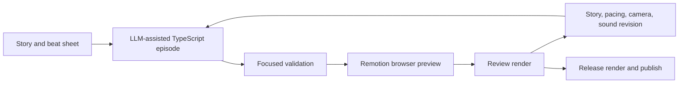

# Visual Editor Decision

**Decision date:** 2026-07-24  
**Status:** Deleted  
**Active product priority:** Checked-in TypeScript episodes with LLM-assisted authoring  
**Decision owner:** Tokovo product and engineering

## Decision

Tokovo's visual-editor experiment has been removed from the current product and repository.
It is not paused, preserved as an internal alpha, or maintained as a compatibility surface.

The production workflow is code-first because the existing DSL, compiler, preview, render service,
and LLM-assisted editing are sufficient to create and revise episodes without maintaining a second
episode model or editor product.

## Deleted Scope

The hard cut removed:

- `apps/studio`;
- `packages/studio-model`;
- `packages/studio-interactions`;
- the compiler adapter that lowered editor documents;
- WhatsApp, X, keyboard, and notification editor contributions;
- the editor-specific render-job store, runner, and worker;
- workspace scripts, exports, dependencies, TypeScript references, and lockfile importers;
- the old `studio` episode-catalog profile, renamed to `showcase`.

There is no compatibility alias for these paths or contracts.

## What Remains

The following are production engine boundaries, not remnants of the deleted editor:

- checked-in TypeScript episode definitions in `packages/episodes`;
- semantic authoring builders in `packages/dsl`;
- the IR, compiler, deterministic core runtime, camera, renderer, and composition packages;
- app-owned headless plugins used by compiler and render workers;
- `apps/video-runner` for interactive Remotion preview and local renders;
- `apps/render-service` for render orchestration, artifacts, caches, and diagnostics;
- `release` and `showcase` episode catalog profiles.

The headless plugin boundary must remain server-safe. It exists so preparation and rendering do not
need to import React app presentation, independently of any visual editor.

## Current Authoring Workflow

Engine work is justified when published-content work repeatedly exposes a central authoring,
fidelity, or rendering limitation. Improve the smallest owning contract, add regression evidence,
and return to content production.

## Reconsideration Gate

A future visual editor would be a new product decision and a new architecture, not a resumption of
the deleted implementation. Reconsider only after evidence from multiple completed episodes shows
that code-first LLM authoring is the dominant production bottleneck and that a smaller DSL,
template, validation, or preview improvement cannot solve it.

Any proposal must identify:

- the repeated production task that is materially slower or less reliable in code;
- the episodes that demonstrated the problem;
- the smallest editor workflow that removes it;
- the content throughput or quality it will unlock;
- the single source of truth for authored semantics;
- the contracts it will delete rather than preserve through compatibility.

## Related Documents

- [Tokovo Engineering Handbook](./ENGINEERING_HANDBOOK.md)
- [Camera](./CAMERA.md)
- [Rendering and Performance](./RENDERING.md)
- [Operations](./OPERATIONS.md)
