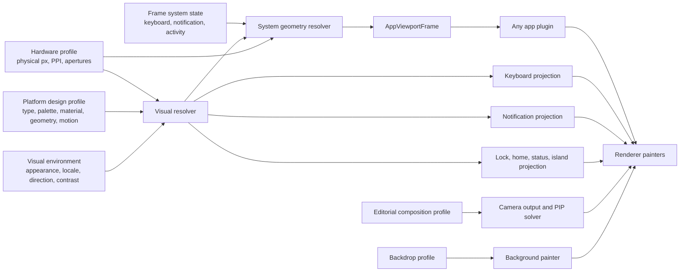

# Visual System VNext Architecture

Status: Implemented hard cut

Audience: device, app-plugin, camera, renderer, episode, and render-service maintainers

Governs: platform themes, typography, system geometry, keyboards, notifications, lock/home surfaces, Dynamic Island, composition profiles, and studio backdrops

## Outcome

Tokovo has one deterministic visual-environment contract. Hardware describes physical facts. A
versioned platform profile describes OS design language. The resolved system geometry produces one
`AppViewportFrame`, and every app consumes that frame. App packages own brand semantics and content;
they do not guess device insets or repaint OS surfaces.

There is no safe-area compatibility object, Noto-for-every-platform shortcut, app-owned keyboard or
notification theme, generic layout fallback, device-frame substitution, or unknown-profile fallback.

## Architecture



## Package Ownership

| Package                        | Owns                                                                                                             | Must not own                                          |
| ------------------------------ | ---------------------------------------------------------------------------------------------------------------- | ----------------------------------------------------- |
| `@tokovo/visual-system`        | platform profiles, materials, typography roles, system geometry, app viewport, composition and backdrop profiles | React, app semantics, replay state                    |
| `@tokovo/devices`              | physical profiles, device chrome, lock/home projection, status bar, Dynamic Island                               | app insets, app themes                                |
| `@tokovo/device-keyboard`      | input program, locale/layout projection, key interaction, keyboard painter                                       | duplicated platform palette or type metrics           |
| `@tokovo/device-notifications` | lifecycle program, grouping, privacy, actions, projection, notification painter                                  | app notification semantics or duplicated materials    |
| `packages/apps-*`              | snapshots, reducers, views, app brand theme, semantic layout and anchors                                         | OS chrome geometry, device detection, fallback insets |
| `@tokovo/camera`               | deterministic framing, motion, optics, editorial constraints and trace                                           | app/device layout guesses                             |
| `@tokovo/background`           | painting custom assets and resolved backdrop profiles                                                            | an independent preset design system                   |
| `@tokovo/renderer`             | composition of prepared projections                                                                              | product policy, generic app layout invention          |

## Coordinate Spaces

All geometry identifies its coordinate space. Conversion is explicit and one-way:

```text
device-physical px
  -> platform-logical pt/dp
  -> app-logical coordinates
  -> stage-world coordinates
  -> output pixels
```

`VisualHardwareProfile.pointScale` is the physical-pixel to platform-point ratio. It is not a CSS
device-pixel-ratio hint. `AppSurface` performs the later app-design-width conversion.

## Hardware Profiles

Hardware profiles contain only facts that change with the body or display:

- body dimensions and depth;
- display aperture, PPI, corner radius, and physical inset;
- platform and versioned platform-profile ID;
- physical camera/sensor regions;
- whether OS surfaces exist on the profile;
- optional device capability geometry such as Dynamic Island.

The checked-in iPhone and Pixel profiles use their native display pixel dimensions. The display is
physically inset inside the device body; the screen never sits flush on the outer frame.

## Platform Design Profiles

The built-in profiles are `ios:liquid-glass@1` and `android:material3@1`. A profile contains:

- licensed deterministic font assets and script fallback families;
- semantic typography roles;
- light/dark palettes;
- structured material recipes;
- minimum content geometry;
- keyboard and notification geometry;
- motion durations.

iOS and Android never share primary typography metrics. Fonts are bundled by the video runner; no
host font or network lookup can alter a render.

Materials remain structured until a painter calls `materialToPaintStyle`. This keeps blur,
saturation, brightness, stroke, shadow, and contrast inspectable and testable.

## System Geometry and App Viewport

`resolveSystemGeometry` combines hardware, platform visuals, and frame state. It emits:

- the platform-logical viewport;
- hardware and system regions with explicit behavior and z-order;
- keyboard, notification, and activity occupancy;
- one content rectangle and inset set;
- one deterministic signature.

Apps receive the complete `AppViewportFrame`. They may use `contentInsets`, `contentRect`, and
occlusions, but cannot supply defaults. A missing viewport is a contract failure.

## System Surfaces

Keyboard, notifications, lock screen, home screen, status bar, and Dynamic Island share the same
resolved platform profile. Their app or capability package owns behavior; their visual tokens come
from the platform profile.

The keyboard has platform-specific Devanagari InScript geometry, script-aware font families, a
real toolbar when suggestions are unavailable, deterministic key previews, and platform motion.

Notifications use structured elevated materials, group depth, native spacing, interruption labels,
privacy projection, and a separate center material. Notification center is an OS layer rather than
an app overlay.

Dynamic Island is state-driven. Idle is the physical aperture. Compact recording shows only the
recording signal. Expanded recording appears only when authored state requests it, morphs through
deterministic geometry, and stops only on the authored stop event. Completion feedback is a
notification material, not a dark rectangle merged into app content.

## App Theme Boundary

An app theme owns brand color, app-specific surfaces, app typography choices, and component
semantics. It may not own status-bar height, gesture insets, keyboard height, notification
materials, hardware detection, or system font fallbacks.

This boundary preserves the strong plugin shape used by WhatsApp while making every other app
receive the same correct platform environment.

## Editorial Composition

Camera outputs name a `CompositionProfileId`. The profile owns target-fill guidance, editorial
insets, preferred position, protected-region padding, and negative-space preference. Editorial
insets are not device content insets.

`solveEditorialOverlayViewport` places PIP and other overlays against protected regions with a
deterministic overlap score. This makes call PIP an intentional part of the composition instead of
an arbitrary rectangle over the main device.

Lens geometry, camera modifiers, and color filters remain independent registered data. An episode
can swap its camera plan without changing replay, stage, app snapshots, or OS projection.

## Backdrops

The built-in backdrop catalog is intentionally small:

- `studio-quiet-dark`;
- `studio-quiet-light`;
- `ambient-depth`;
- `editorial-neon`.

Every profile declares visual energy, orientation safety, subject-safe regions, contrast, parallax
depth, and whether signage is permitted. Built-ins are orientation-free and forbid signage, so an
upside-down word or logo cannot accidentally become part of the product composition.

## Failure Policy

The following are stable failures, never visual substitutions:

- unknown hardware or platform profile;
- platform/profile mismatch;
- missing app metadata, layout, frame, or status-bar strategy;
- invalid geometry or an overlay that cannot fit;
- unknown backdrop or composition profile;
- missing background asset source;
- app CHAT/STORY modes without their required entity ID.

## Extension Workflow

To add a platform revision:

1. add a new versioned platform profile;
2. bundle and register deterministic font assets;
3. map exact hardware profiles to it;
4. add light/dark and locale/script pairwise tests;
5. render system-surface proof frames;
6. migrate hardware only after the new profile passes release gates.

To add a lens, filter, or composition mode, register a new model/profile and keep episode data
referencing its stable ID. No app package or camera evaluator switch should be required.

## Determinism and Performance

- resolvers are pure and frame-addressable;
- resolved artifacts carry stable signatures;
- registries prepare outside the frame loop;
- camera shot selection uses prepared interval indexes;
- platform materials serialize through one painter function;
- local fonts and assets eliminate host/network variance;
- animated surfaces use transforms and opacity without layout readback;
- golden renders are paired with structural geometry assertions so repeatable mistakes cannot pass.
