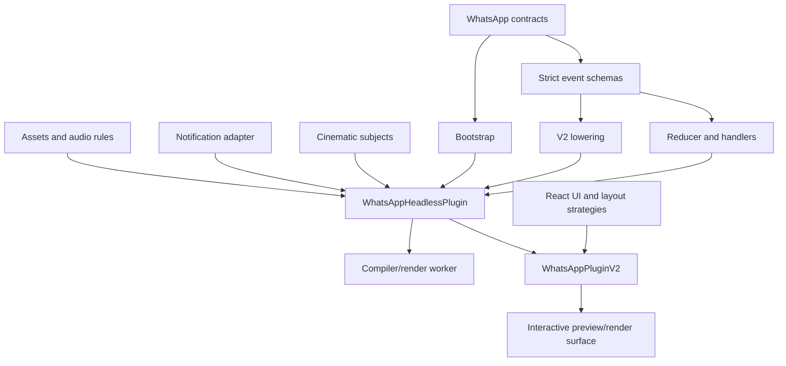
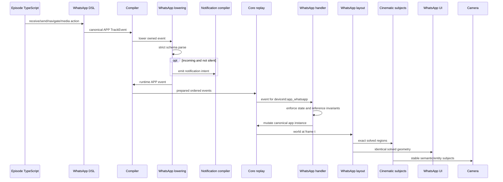

# WhatsApp Architecture and Hard-Cut Migration

**Status:** Implemented reference app architecture  
**Package:** `@tokovo/apps-whatsapp`  
**App ID:** `app_whatsapp`  
**Runtime version:** `2.0.0`  
**Last reviewed:** 2026-07-24

WhatsApp is Tokovo's primary reference for a production app simulator. It demonstrates how a deep,
stateful phone app can remain deterministic, multi-device safe, camera-addressable, platform-aware,
headless where required, and pleasant to author without leaking app behavior into the compiler or
renderer.

This document explains the current package, the completed hard-cut migration, the complete data
flow, ownership boundaries, tests, deletion rules, and remaining product-quality work.

## 1. Why the Migration Was Necessary

The old failure mode for a simulated app is deceptively attractive:

- keep one global state object;
- allow reducers to create missing state;
- let components infer routes from whatever data exists;
- share generic theme and typography values across platforms;
- use array indexes as message identities;
- measure DOM nodes for camera targeting;
- put keyboard spacing into the chat component;
- let incoming messages directly paint notifications;
- export everything through one React-heavy package root;
- add compatibility branches whenever an episode breaks.

That architecture can produce a screenshot. It cannot reliably produce a deterministic,
multi-device, extensible cinematic episode.

The WhatsApp migration was a hard cut toward one package-owned semantic system. Its goals were:

1. one canonical state instance per device;
2. one public event discriminator from authored event through reducer;
3. strict schemas and exhaustive handlers;
4. deterministic bootstrap and time;
5. stable entity IDs;
6. layout and camera subjects from the same geometry;
7. OS-owned keyboard and notifications;
8. app-owned platform presentation;
9. a server-safe headless entrypoint;
10. no retained legacy alias or fallback path.

## 2. Current Package Boundary

The package exports:

```json
{
  "exports": {
    ".": {},
    "./plugin": {},
    "./contract": {},
    "./dsl": {},
    "./lowering": {},
    "./runtime": {},
    "./headless": {},
    "./ui": {}
  }
}
```

### 2.1 Entrypoint responsibilities

| Entrypoint | React allowed | Owns                                                         |
| ---------- | ------------: | ------------------------------------------------------------ |
| root       |           yes | Public convenience surface                                   |
| `plugin`   |           yes | Interactive plugin composition, views, layouts, registration |
| `contract` |            no | Public app types, IDs, bootstrap and semantic contracts      |
| `dsl`      |            no | WhatsApp authoring helpers                                   |
| `lowering` |            no | Strict authored-event lowering and notification intent       |
| `runtime`  |            no | State, reducer, selectors, runtime invariants                |
| `headless` |            no | Compiler/server-safe plugin contribution                     |
| `ui`       |           yes | App painters and interactive/render presentation             |

The headless entrypoint is intentionally safe for compilers, API routes, and render workers. It
contains no React view or hook import.

### 2.2 Interactive composition

The interactive plugin composes the headless contribution and adds:

- `WhatsappChatView`;
- platform view strategies;
- `FEED` and `CHAT` layout strategies;
- interactive registration.

It does not define a second reducer, event list, bootstrap path, asset table, or cinematic-subject
provider.



## 3. Source Organization

The package is organized by ownership rather than component type alone:

| Area                             | Responsibility                                                              |
| -------------------------------- | --------------------------------------------------------------------------- |
| `bootstrap.ts`                   | Snapshot/view validation and deterministic hydration                        |
| `types/`                         | Canonical state and event types                                             |
| `schemas/`                       | Strict runtime event schemas derived with Zod                               |
| `dsl/`                           | Fluent episode authoring                                                    |
| `lowering/`                      | Authored events to runtime events and OS intents                            |
| `runtime/`                       | Initial state, reducer, selectors                                           |
| `handlers/`                      | Exhaustive event-domain transitions                                         |
| `layout/`                        | Solved feed/chat/entity geometry and caches                                 |
| `camera/`                        | Semantic cinematic subject provider                                         |
| `presentation/`                  | Platform and appearance strategies                                          |
| `localization/`                  | Locale strings and direction                                                |
| `accessibility/`                 | Roles, labels, and semantic presentation support                            |
| `notifications/`                 | WhatsApp-specific notification formatting/adapter                           |
| `assets/`                        | App-owned audio rule declarations                                           |
| `asset-refs.ts`                  | Static asset discovery for compilation                                      |
| `components/`, `screens/`, `ui/` | React presentation only                                                     |
| `headless/`                      | Server-safe plugin composition                                              |
| `__tests__/`                     | Architecture, correctness, fidelity, performance, and integration contracts |

The folder structure is not cosmetic. It keeps runtime and compiler consumers from accidentally
depending on React presentation.

## 4. End-to-End WhatsApp Data Flow



Every arrow has one owner. UI is not an event validator. Camera is not a layout engine.
Notifications are not painted by the WhatsApp reducer.

## 5. Canonical Identity and State

### 5.1 App instance key

WhatsApp state exists only at:

```ts
world.appInstances[appInstanceId(deviceId, "app_whatsapp")];
```

There is no `world.whatsapp`, `world.apps.whatsapp`, selected-device alias, or single-device
shortcut.

Every event and selector carries the exact `deviceId`. Two phones can mount WhatsApp with independent:

- conversations;
- current screen;
- selected conversation;
- locale;
- settings;
- statuses;
- channels;
- calls;
- communities;
- media viewers;
- gestures;
- reply composer;
- layout revision.

### 5.2 Canonical state domains

The state includes:

- conversation record keyed by stable conversation ID;
- message arrays contained only by their canonical conversation;
- typing state;
- current screen and view mode;
- selected conversation identity;
- chat filter;
- locale;
- status updates and status viewer;
- channels;
- call log;
- communities;
- account profile and settings;
- media viewer and per-message media lifecycle;
- active gesture;
- reply composer;
- thread viewport;
- layout revision.

Architecture tests forbid restoration of duplicate message collections, selected-conversation
aliases, and deleted theme surfaces.

### 5.3 Stable entity IDs

Messages, conversations, statuses, channels, calls, communities, and interaction overlays use
stable semantic IDs. The point DSL and camera contracts reject:

- message indexes;
- ambiguous ID aliases;
- `messageRef` compatibility forms;
- duplicate message IDs;
- unknown references.

Stable IDs make insertions, edits, camera revisions, notifications, and diagnostics safe.

## 6. Bootstrap and Frame-Zero State

### 6.1 Snapshot

The WhatsApp snapshot can author:

- locale;
- conversations and participants;
- messages;
- typing state;
- statuses;
- channels;
- call log;
- communities;
- profile;
- settings.

Each message type has type-specific validation. Examples include:

- text requires text;
- voice requires positive duration;
- poll requires a question and at least two valid options;
- system messages require an allowed authored system type;
- documents validate file metadata;
- contacts validate canonical contact fields;
- locations validate coordinates and presentation data;
- replies validate referenced message shape.

### 6.2 Initial view

The view contract selects one canonical screen:

- `chat`;
- `chats`;
- `updates`;
- `calls`;
- `communities`;
- `settings`;
- `profile`.

Chat and profile surfaces require a valid conversation context where the product semantics need one.
The package maps screens to the correct `CHAT` or `FEED` layout family and rejects impossible
navigation state.

### 6.3 Deterministic hydration

Bootstrap:

1. validates the raw snapshot and view;
2. validates cross-references;
3. hydrates message-specific state;
4. normalizes participants;
5. derives canonical initial navigation;
6. returns a complete state object.

It does not read the network, call the wall clock, generate random IDs, or rely on host locale.

Malformed dates, dangling references, duplicate IDs, invalid media state, deleted voice-only fields,
and impossible product entities fail before replay.

## 7. Event Vocabulary and Validation

### 7.1 One public discriminator

WhatsApp currently has 62 public `APP` event types. The event type remains the runtime discriminator;
lowering does not translate into an unrelated parallel reducer vocabulary.

The list is an exhaustive `Record<WhatsAppEventType, true>`, and the schemas form a strict
discriminated union. A new event cannot be added safely by editing only one array.

### 7.2 Event families

The event surface covers:

| Family                  | Events                                                         |
| ----------------------- | -------------------------------------------------------------- |
| Messages                | receive, send, read, delete, edit, forward, reaction           |
| Media                   | image, video, voice, GIF, sticker, document, contact, location |
| Delivery                | failed, retry started, retry completed                         |
| Typing                  | typing start and end                                           |
| Transfer                | download start, progress, complete, fail                       |
| Playback                | start, progress, pause, complete                               |
| Viewers                 | media viewer open/close, status viewer open/advance/close      |
| Gestures                | start, update, complete, cancel                                |
| Reply                   | reply composer dismissal and reply data                        |
| Navigation              | conversation open and screen navigation                        |
| Locale                  | explicit locale change                                         |
| Groups                  | member add/remove, admin change, info update                   |
| Conversation management | pin, mute, archive, unpin, unmute, unarchive, draft            |

### 7.3 Strict payloads

Schemas use strict objects and reject unknown fields. They validate:

- non-empty semantic IDs;
- finite and bounded progress values;
- allowed enum values;
- positive durations;
- media-specific payload shape;
- required sender and conversation data;
- reply and group fields;
- gesture state;
- navigation requirements.

TypeScript event types are derived from schemas. Runtime validation happens again at the reducer
boundary, so hand-created runtime events cannot bypass the contract.

### 7.4 Failure behavior

WhatsApp lowering throws when:

- the event is not owned by `app_whatsapp`;
- the event type is unknown;
- device ID is missing;
- the strict schema rejects the payload;
- required notification data is absent.

The reducer throws when:

- app state is missing;
- required state fields are malformed;
- a conversation or message reference is missing;
- an event has no registered handler;
- a media transition is impossible;
- navigation violates view invariants.

There is no log-and-continue path for an owned invalid event.

## 8. Lowering and Notification Intent

### 8.1 Runtime event

For a valid WhatsApp event, lowering preserves:

- frame;
- app ID;
- device ID;
- `kind: "APP"`;
- public event type;
- copied payload.

This makes event traces understandable from authoring through replay.

### 8.2 Incoming notification types

Incoming message, image, video, voice, GIF, sticker, document, contact, and location events can emit
notification intent unless marked `silent`.

The intent includes:

- stable notification ID;
- exact device and app;
- delivery frame and declaration sequence;
- title and body;
- optional media;
- category and conversation grouping;
- interruption and privacy;
- quick-reply action;
- deterministic app-event target.

The WhatsApp package decides what the notification means. The device-notifications package decides
how the current platform presents and manages it.

### 8.3 Quick reply

The reply action targets a canonical `MESSAGE_SENT` app event with conversation and message identity.
The notification compiler lowers the action effect into the prepared program. The painter never
mutates WhatsApp state directly.

## 9. Reducer and Handler Architecture

### 9.1 Exhaustive routing

The reducer:

1. strictly parses the runtime event;
2. resolves the registered handler by public event type;
3. resolves canonical state for the exact device;
4. distinguishes global from conversation-scoped behavior;
5. executes the handler with constrained context;
6. increments `layoutRevision`;
7. synchronizes navigation/view-mode invariants.

An absent handler throws.

### 9.2 Constrained handler context

Conversation-scoped handlers receive helpers for:

- adding a message;
- reading or requiring a message by stable ID;
- deterministic timestamps;
- canonical conversation access.

Global handlers receive a context whose conversation operations deliberately throw. This catches a
handler that accidentally assumes every event has a conversation.

### 9.3 Message invariants

Adding a message:

- initializes valid media lifecycle where applicable;
- rejects duplicate IDs;
- appends only to the canonical conversation;
- updates canonical last-message time.

Message lookup is by stable ID. Missing targets fail with operation and conversation context.

### 9.4 Deterministic time

Where a message needs display time, the reducer derives it from:

1. authored device clock plus frame/fps; or
2. a deterministic frame-derived fallback.

Formatting uses explicit UTC behavior where required. The render host's timezone cannot change the
episode.

### 9.5 Media lifecycle

Lifecycle media supports canonical transfer and playback state. Events enforce allowed transitions
for:

- remote/queued/downloading/ready/failed transfer behavior;
- bounded transfer progress;
- idle/playing/paused/completed playback;
- viewer state;
- retry behavior.

Non-media messages cannot carry media lifecycle state. Impossible transitions throw.

## 10. Navigation and Product Surfaces

The package supports deep product state rather than a single chat mock:

- Chats list and filters;
- individual and group chat;
- Updates, statuses, and channels;
- Calls;
- Communities;
- Settings;
- direct-message and group profile/info;
- media viewer;
- status viewer;
- reply composer;
- gestures and message actions.

`currentScreen`, `conversationId`, and `viewMode` have explicit invariants:

- `chat` uses `CHAT` and requires a conversation;
- `profile` preserves explicit conversation context while using the feed layout family;
- non-contextual feed screens clear stale selected conversation state.

Components do not guess the route from whether a message array happens to be non-empty.

## 11. Layout, Long Threads, and Cinematic Subjects

### 11.1 One solved geometry

WhatsApp computes deterministic logical geometry for:

- chat list rows;
- headers and navigation;
- message bubbles and message-type cards;
- dates and unread separators;
- quoted replies;
- reactions;
- composer;
- typing indicators;
- status/channel/call/community/settings/profile rows;
- media and gesture overlays;
- bounded thread viewport.

The UI and cinematic-subject provider consume the same solved layout.

### 11.2 No DOM camera measurement

The camera provider publishes subjects such as:

- app body and screen;
- current/last message semantics;
- exact message bubble by message ID;
- reply, reaction, and system-message regions;
- composer and keyboard-related regions;
- feed rows and navigation regions;
- status, channel, call, community, settings, and profile entities;
- media/status viewers and interaction overlays.

Subjects use app-space rectangles projected into the stable stage. They are not browser DOM
rectangles.

### 11.3 Bounded rendering

Long conversations use a thread projector and render window. The camera provider publishes the same
bounded window that UI mounts, using bottom-aligned viewport coordinates rather than raw full-thread
coordinates.

This prevents:

- rendering all 10,000 messages;
- camera targets pointing to unmounted geometry;
- layout and UI disagreeing about scroll position;
- performance depending on total history length.

### 11.4 Layout revision and caching

Accepted events increment a static-layout revision. Layout caches also account for content that
changes geometry, including:

- message text;
- edits;
- reactions;
- link/media presentation;
- message count.

Identical input yields a stable hash; changed geometry invalidates the right cache.

## 12. Presentation, Themes, Localization, and Accessibility

### 12.1 Resolved experience

WhatsApp UI routes presentation through a resolved experience rather than importing scattered theme
constants. The experience combines:

- platform;
- light/dark appearance;
- app semantic tokens;
- typography;
- navigation and composer policy;
- locale and direction;
- accessibility labels.

Deleted legacy theme surfaces are guarded by architecture tests.

### 12.2 Platform policy

iOS and Android can differ in:

- navigation structure;
- composer treatment;
- spacing and typography metrics;
- icons and chrome;
- safe-area handling;
- keyboard integration;
- system material.

The package preserves semantic groupings while allowing platform presentation strategies. It does
not copy the same Noto metrics into both platforms.

### 12.3 Localization and RTL

Canonical product chrome uses localization keys. Architecture tests reject literal English chrome
in canonical surfaces.

The current locale contract includes `en-US` and `ar` at runtime. RTL direction affects layout and
accessibility, not only string translation. Tests cover localized labels, roles, direction, and
semantic output.

### 12.4 Accessibility

The package owns app-specific:

- labels;
- roles;
- message and status descriptions;
- localized semantic names;
- interaction descriptions.

OS painters own system-surface accessibility. Camera subjects remain semantic and do not replace
accessibility structure.

## 13. Keyboard Ownership

WhatsApp does not paint its own keyboard. Authored send actions may declare a structured input
session:

- semantic target field;
- text;
- duration/style;
- keyboard appearance;
- locale/layout;
- submit behavior.

The device-keyboard package prepares and evaluates that session. WhatsApp consumes the resulting
field/composer state and reserves the correct viewport space.

This ensures:

- WhatsApp and X use the same OS keyboard contract;
- platform spacing is fixed centrally;
- camera can target keyboard and composer separately;
- typing remains random-access;
- suggestions, corrections, entrance, and exit are not component-local animations.

If structured input is not connected through the canonical integration, the package fails instead
of secretly generating app events character by character.

## 14. Notification Ownership

WhatsApp owns notification content and action meaning. The device-notifications package owns:

- banner/lockscreen/center presentation;
- grouping;
- blur and material depth;
- spacing;
- privacy;
- interruption;
- DND and foreground behavior;
- quick-action UI;
- lifecycle.

This boundary allows notification visual quality to improve globally without editing WhatsApp, while
preserving app-specific title, body, media, grouping, and reply behavior.

## 15. Audio and Assets

### 15.1 Audio rules

WhatsApp contributes auto-sound rules keyed to canonical public events. Typing-loop IDs include
stable payload identity so multiple conversations/devices do not collide.

Headless assets currently expose canonical sound paths for sent and typing behavior; additional
owned audio files are discovered through package asset references and provenance.

### 15.2 Asset collection

`collectWhatsAppAssetRefs` walks canonical state for the exact app instance and reports media,
avatars, icons, sounds, and other render dependencies to the compiler.

The UI does not silently fetch live WhatsApp data or invent missing assets.

## 16. Authoring Example

```ts
episode("whatsapp-example", {
  fps: 30,
  duration: "24s",
  title: "The Deploy",
})
  .device("phone", "iphone16", {
    app: "app_whatsapp",
    appearance: "dark",
    installedApps: ["app_whatsapp"],
    os: {
      time: new Date("2026-07-24T18:30:00.000Z").getTime(),
      battery: 61,
      network: "5G",
    },
  })
  .snapshot("app_whatsapp", "phone", {
    locale: "en-US",
    conversations: [
      {
        id: "launch-room",
        name: "Launch Room",
        type: "group",
        members: [
          { id: "me", name: "You" },
          { id: "mira", name: "Mira" },
        ],
      },
    ],
  })
  .view("app_whatsapp", "phone", {
    screen: "chat",
    conversationId: "launch-room",
  })
  .whatsapp("phone", "launch-room", (whatsapp) => {
    whatsapp.at("1.0s").receive("Mira", "Please tell me that was staging.", {
      messageId: "staging-question",
    });

    whatsapp.at("4.0s").send("It depends what you mean by staging.", {
      messageId: "bad-answer",
      input: {
        duration: "2.6s",
        style: "fast",
        keyboard: { appearance: "dark" },
      },
    });

    whatsapp.at("8.0s").react("staging-question", "💀");
  });
```

Important characteristics:

- explicit device clock;
- stable conversation and message IDs;
- app-owned DSL;
- OS-owned structured input;
- no component state;
- no runtime-generated identity;
- deterministic at arbitrary frames.

Camera direction should live in a separate camera module when it becomes substantial. It can target
`staging-question` and `bad-answer` by semantic entity identity.

## 17. Testing Strategy

The package has focused suites for:

### 17.1 Architecture

- deleted legacy theme surfaces remain absent;
- messages remain in one canonical collection;
- selected conversation has one canonical field;
- UI uses resolved experience;
- removed snapshot fields stay rejected;
- public event type remains the runtime discriminator;
- canonical chrome is localized.

### 17.2 Bootstrap and contracts

- complete snapshot acceptance;
- malformed message-specific payload rejection;
- dangling reference rejection;
- missing runtime state failure;
- index/alias targeting rejection;
- duplicate ID rejection;
- multi-device isolation.

### 17.3 Runtime

- deterministic timestamps;
- contact, location, document, reply, and reaction behavior;
- unread and read behavior;
- delivery failure and retry;
- status playback;
- date separators;
- media/gesture/locale state machines;
- group membership invariants;
- layout revision.

### 17.4 Layout and subjects

- exact message rectangles;
- width variants;
- subject availability per screen;
- reply/reaction/system entities;
- viewport coordinates;
- bounded-window agreement between UI and camera.

### 17.5 Experience

- platform presentation policy;
- localization and RTL;
- accessibility labels and roles;
- audio rules;
- timestamp timezone independence.

### 17.6 Performance

- 10,000-message thread projection and layout budget;
- stable layout caching;
- bounded mounted/rendered window.

Focused verification:

```bash
mise exec -- pnpm --filter @tokovo/apps-whatsapp typecheck
mise exec -- pnpm --filter @tokovo/apps-whatsapp test
mise exec -- pnpm --filter @tokovo/apps-whatsapp benchmark:long-thread
```

## 18. Hard-Cut Deletion Ledger

The migration standard requires the following architecture to remain deleted:

- global or selected-device WhatsApp state aliases;
- duplicate conversation message collections;
- alternate selected-conversation fields;
- index and compatibility message references;
- reducer-side implicit state initialization;
- loose unknown-event fallthrough;
- parallel runtime discriminator aliases;
- component-local keyboard simulation;
- app-painted system notifications;
- DOM-measured cinematic targets;
- literal-English canonical chrome;
- deleted theme barrels and generic presentation bypasses;
- React-dependent headless compilation;
- guessed assets or sound filenames.
- the deleted visual-editor contribution and its package export.

Architecture tests, strict schemas, exact registration tests, and public entrypoint boundaries are
the enforcement mechanism. A code comment saying “legacy removed” is not sufficient.

## 19. Remaining Work and Honest Limits

### 19.1 Complete architecture claims

The following are implemented and test-backed:

- device-scoped state;
- strict bootstrap and runtime events;
- 62-event canonical vocabulary;
- exhaustive handlers;
- deterministic time;
- stable entity targeting;
- bounded long-thread projection;
- shared UI/camera geometry;
- app/OS keyboard and notification boundary;
- headless and interactive plugin composition;
- strict public entrypoint boundaries.

### 19.2 Product-quality work remains continuous

No app surface is permanently “done.” New episodes may expose:

- a missing real WhatsApp interaction;
- an inaccurate platform-specific detail;
- weak empty-state art;
- a message/media geometry edge case;
- a locale not yet supported;
- a performance issue on a new device width;
- a camera subject missing from an uncommon product surface;
- an audio or notification fidelity gap.

Those should be fixed in the package's canonical contract, not patched in one episode.

### 19.3 Explicit current limitations

- Runtime locale support is not universal; current canonical validation includes `en-US` and `ar`.
- Visual goldens prove only reviewed targets; they are not a substitute for current platform review.
- Brand fidelity must remain compatible with public-repository asset licensing and presentation
  policy.

## 20. How to Extend WhatsApp Correctly

### Add an event

1. Add the public event type.
2. Add one strict discriminated schema.
3. Derive/update TypeScript payload typing.
4. Add it to the exhaustive event record.
5. Implement one handler.
6. Add DSL authoring if content authors need it.
7. Add notification/audio intent if semantically required.
8. Add reducer success and invalid-transition tests.

### Add a message or media type

1. Extend snapshot validation.
2. Extend canonical message type.
3. Define lifecycle behavior.
4. Implement deterministic geometry.
5. Add painter/accessibility/localization.
6. Emit exact cinematic subjects.
7. Add asset collection.
8. Prove narrow/wide and long-thread behavior.

### Add a screen

1. Add a canonical screen ID and view validation.
2. Define navigation and conversation-context invariants.
3. Add selector/projector.
4. Add solved layout.
5. Add localized platform presentation.
6. Add semantic/entity subjects.
7. Add runtime, layout, camera, and accessibility tests.

### Add a theme/platform revision

1. Extend the versioned visual/experience strategy.
2. Keep semantic app tokens separate from platform metrics.
3. Prove system keyboard, notification, status, and safe-area integration.
4. Do not add component-by-component platform conditionals.

## 21. Definition of Done for a WhatsApp Change

A WhatsApp change is complete only when:

1. the owning contract is clear;
2. invalid data fails before or at the correct boundary;
3. direct and sequential frame evaluation agree;
4. two devices remain isolated;
5. layout and UI use one geometry;
6. camera targets remain semantic and stable;
7. keyboard/notifications stay OS-owned;
8. localization/accessibility are not bypassed;
9. assets and sounds are registered and licensed;
10. focused tests and typecheck pass;
11. no replaced compatibility path remains;
12. a real episode frame looks intentional at close, medium, and wide scale.

## 22. Related Documents

- [Tokovo Engineering Handbook](./ENGINEERING_HANDBOOK.md)
- [Camera](./CAMERA.md)
- [Platform Visuals](./PLATFORM_VISUALS.md)
- [Visual Editor Decision](./STUDIO.md)

## 23. Final Standard

WhatsApp is not a collection of chat components. It is one deterministic app domain with
strict source data, stable identity, exact runtime behavior, solved geometry, platform presentation,
OS integration, semantic cinematography, and a server-safe package boundary.

The architecture succeeds when a content author can write a complex WhatsApp episode, change its
camera or device, render any frame in any order, and trust that no hidden compatibility path is
deciding the result.
