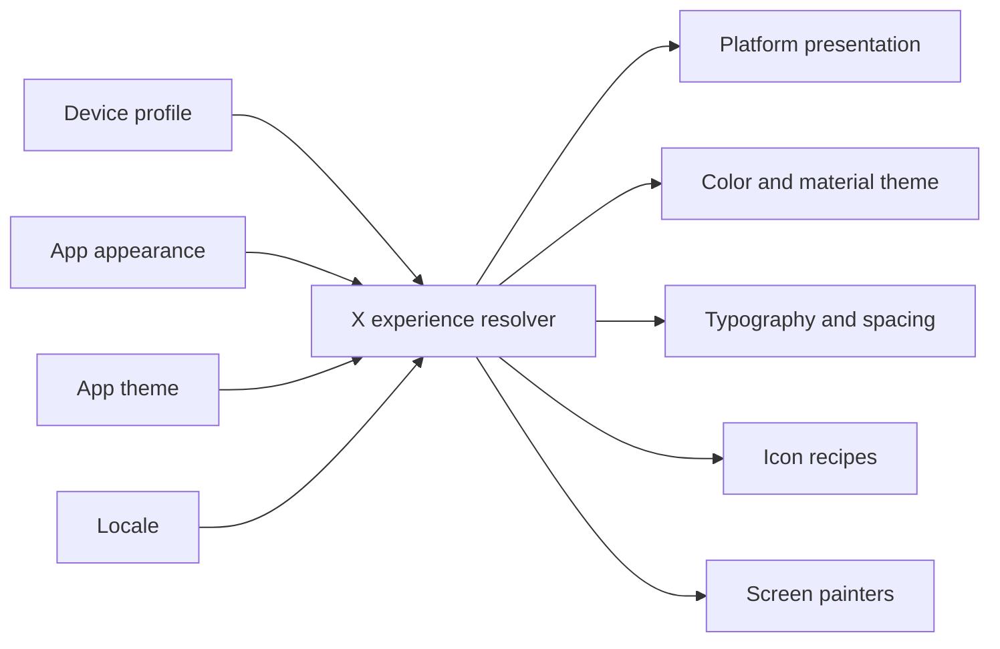
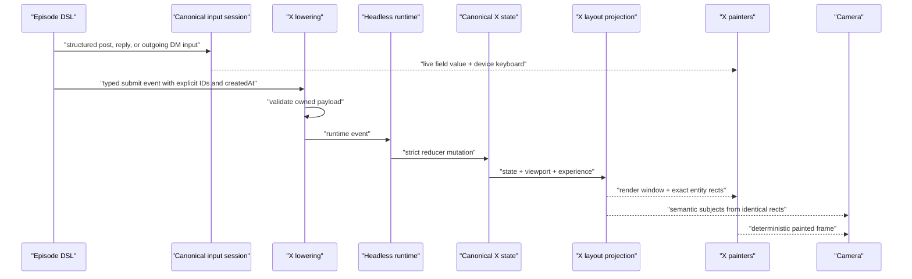

# X App Architecture

> **Current context:** X is one of the two reference migrated headless packages. The former visual
> editor and X-specific editor contribution were deleted. See
> [Visual Editor Decision](./STUDIO.md) and the
> [Tokovo Engineering Handbook](./ENGINEERING_HANDBOOK.md).

Status: implemented and visually reviewed

Owner: `@tokovo/apps-x`
Replacement policy: hard cut; no legacy runtime state, compatibility reducer, or guessed camera geometry

## Product bar

X is a deterministic, app-owned simulation of the core product surfaces. It must look credible in a close phone shot, remain readable in a wide composition, replay identically at any frame order, and expose semantic geometry so an episode can change cinematography without changing app code.

This is not a skin over the current package. The existing package has a useful plugin boundary and useful domain vocabulary, but its runtime repair paths, array-scanning model, approximate layouts, placeholder-heavy UI, generic audio, and weak visual proof are replaced.

## Visual direction

The direction is restrained editorial utility:

- content is the visual lead; chrome is quiet and exact
- density matches a real social feed rather than a marketing card stack
- light, dim, and lights-out palettes are authored as coherent experiences
- iOS and Android share semantics but receive platform-specific type, navigation, touch-target, and safe-area recipes
- media, avatars, polls, quote posts, metrics, typing, and notifications have finished states; no emoji or grey-circle placeholders appear in curated proof
- motion is deterministic and short: route transitions, optimistic action feedback, composer progress, media state, and typing only
- backgrounds and camera effects support the app rather than overpower it

## Runtime invariants

1. Every mounted X instance is canonical before the first runtime event.
2. Reducers mutate canonical state only. They never create missing arrays, records, users, posts, threads, messages, routes, timestamps, or defaults.
3. Duplicate entity creation and unknown references throw stable `X_*` errors.
4. Every time shown by the UI comes from an explicit epoch-millisecond value. Frame numbers are never interpreted as Unix timestamps.
5. Required render selectors throw when the app instance or required route target is absent. Optional lookup selectors are named `find*` and may return `undefined`.
6. Entity lookup is constant-time. Ordered collections use ID arrays plus normalized records.
7. Layout computation is a pure function of canonical app state, viewport, platform, appearance, locale, and authored scroll state.
8. Cinematic subjects are projected from the same layout model that paints the UI. No subject may invent a rectangle.
9. App code depends on no wall clock, live network, global mutable cache, random number, DOM measurement, or browser-only state.
10. The same episode and frame render identically in fresh browser processes and arbitrary frame order.

## Canonical state

```ts
interface XStateV2 {
  schemaVersion: 2;
  layoutRevision: number;
  locale: "en-US" | "ar-SA" | "hi-IN";
  viewMode: "FEED" | "CHAT" | "FULLSCREEN";
  conversationId?: string;

  usersById: Record<string, XUser>;
  tweetsById: Record<string, XTweet>;
  timelineIds: string[];
  notificationIds: string[];
  notificationsById: Record<string, XNotification>;
  dmThreadIds: string[];
  dmThreadsById: Record<string, XDMThread>;
  dmMessagesById: Record<string, XDMMessage>;

  route: XRoute;
  navigationStack: XRoute[];
  currentUserId: string | null;
  composer: XComposerState;
  threadDrafts: Record<string, string>;
  timelineTab: "forYou" | "following";
  notificationsTab: "all" | "verified" | "mentions";
  profileTab: "posts" | "replies" | "media" | "likes";
  scroll: {
    timeline: number;
    tweetById: Record<string, number>;
    notifications: number;
    messages: number;
    profileById: Record<string, number>;
    threadFromBottomById: Record<string, number>;
  };
  recentInteraction: XRecentInteraction | null;
  lastTransition: XRouteTransition | null;
}
```

Snapshots remain author-friendly arrays, but validation and hydration convert them once into this shape. Snapshot schema version 2 is the only accepted schema.

## Experience resolution

The app resolves one immutable experience object at its root:



- `device.appAppearance` owns light versus dark.
- `device.appTheme` owns the X palette variant: default, `x-dim`, or `x-lights-out`.
- OS appearance is used only when app appearance is not explicitly authored.
- Locale and text direction come from canonical state, seeded from the device during compilation or explicitly authored in the snapshot.
- Platform presentation is selected from the device profile; it is never inferred from CSS or user agent data.

## Package boundaries

```text
@tokovo/apps-x
├── contract/       public snapshots, views, events, schemas
├── bootstrap/      strict validation and one-time hydration
├── runtime/        canonical state, reducer, required/optional selectors
├── experience/     platform + appearance + theme + locale resolution
├── presentation/   iOS/Android recipes and screen routing
├── components/
│   ├── primitives/ app-owned icons, text, avatar, controls, materials
│   ├── posts/      post, media, poll, quote, metrics, thread line
│   └── screens/    timeline, detail, compose, notifications, profile, DMs
├── layout/         pure canonical layout projection and render windows
├── anchors/        versioned entity anchor IDs
├── camera/         cinematic subject mapping from layout only
├── lowering/       authored events -> strict runtime events
├── dsl/            typed authoring facade
├── notifications/  semantic device notification adapter
└── localization/   deterministic copy, numbers, and timestamps
```

App semantics do not enter the compiler, core, renderer, or episode overlay layer.

## Event flow



Input fields are public semantic IDs, not a shared `composer` string:

```text
post
tweet:{tweetId}:reply
thread:{threadId}:composer
```

The X DSL creates input sessions through the canonical episode builder. The screen reads that same session via `useInputField`, and the authored post/reply/DM event is the submit boundary. Manual draft jumps are reserved for intentionally prefilled or failed-draft states; they are not a typing animation mechanism.

## Domain scope

The package owns these complete flows:

- For You and Following timelines
- original post, reply, quote, repost, like, bookmark, share, and view metrics
- image grid, video poster/playback state, link card, poll voting, and sensitive-media cover
- conversation detail with oldest-first ancestors, focused post, stable nested descendants, authored scroll, and exact reply entity anchors
- compose and reply compose with deterministic character count, media attachment, send, failure, and retry states
- notifications for likes, reposts, replies, follows, mentions, and verified activity
- profile header and Posts/Replies/Media/Likes tabs
- DM inbox, pinned/unread threads, outgoing versus incoming semantics, per-thread drafts, concurrent typing participants, replies, emoji reactions, unread rules, and sending/sent/delivered/read/failed delivery state

Search, Spaces, Communities, Premium purchase, and live Grok responses are out of scope until their state and episode value are specified. They must not appear as non-functional chrome.

## Layout and anchor contract

All IDs are namespaced and entity-addressable:

```text
x.nav.primary
x.timeline.header
x.timeline.feed
x.tweet.conversation
x.post.{postId}
x.post.{postId}.author
x.post.{postId}.body
x.post.{postId}.media
x.post.{postId}.poll
x.post.{postId}.metrics
x.notification.{notificationId}
x.profile.{userId}.header
x.dm.{threadId}
x.dm.{threadId}.message.{messageId}
x.composer.editor
x.composer.actions
x.reply.composer
x.thread.typing
```

Legacy singleton names such as `tweet_card` and `dm_message_latest` are removed. Episode code targets semantic entity IDs through exported helpers, not raw DOM selectors.

The layout engine computes only the visible render window plus overscan. Long feeds and threads may contain at least 10,000 entities without linear lookup during paint.

## Accessibility and localization

- root uses `role="application"`, a localized name, `lang`, and `dir`
- navigation, action counts, verification, media, poll progress, and unread status expose localized labels
- minimum authored touch target is 44 logical pixels on iOS and 48 on Android
- body copy remains readable at the supported device widths without clipping
- English, Arabic, and Hindi are tested; RTL reverses directional composition without reversing time or numeric meaning
- number and date formatting use explicit locale and `UTC`; never host defaults

## Asset and audio policy

- curated episodes use checked-in, license-recorded media and a deliberately designed deterministic identity treatment when no approved portrait exists
- blurred, grey-disc, emoji, and broken-image avatar placeholders are forbidden
- every bundled asset is collected by the plugin and verified before render
- X owns semantic sound IDs for post send, DM send/receive, like, repost, and notification; generic `tap` is not the public contract
- audio playback is declared by plugin rules and episode data

## Proof matrix

Required before the package is complete:

| Area          | Proof                                                                                             |
| ------------- | ------------------------------------------------------------------------------------------------- |
| Strictness    | invalid snapshot, duplicate IDs, unknown references, missing timestamps, malformed event payloads |
| Runtime       | every event, navigation invariant, failure/retry, notification and DM unread behavior             |
| Layout        | exact entity rectangles, anchor absence, render-window bounds, narrow/wide device widths          |
| Experience    | iOS/Android × light/dim/lights-out × en/ar/hi                                                     |
| Accessibility | localized labels, roles, direction, contrast/touch-target token tests                             |
| Performance   | 10k-post timeline and 10k-message thread budget                                                   |
| Determinism   | arbitrary frame order and two fresh browser processes                                             |
| Visual        | reviewed flagship frames and approved golden matrix                                               |
| Episode       | one cinematic flagship, one exhaustive interaction matrix, and one native theme matrix            |

Golden images are added only after visual review. They prove an approved target, not merely repeatability.

## Definition of 10/10

X is complete only when:

1. no legacy X runtime field, route, selector, reducer repair, compatibility branch, or singleton anchor remains
2. every curated screen looks intentional with real content at close and wide camera scales
3. light, dim, and lights-out appearances hold across iOS and Android
4. keyboard, notifications, status bar, and safe areas feel like one device system
5. all important entities are independently camera-targetable
6. a cinematography-only episode edit requires no X component change
7. invalid content fails before rendering with an actionable stable error
8. long-feed and random-access proofs pass within the recorded budget
9. determinism and release gates pass on Node 22 or 24 through mise
10. the flagship render is good enough to be the public package demo without excuses
