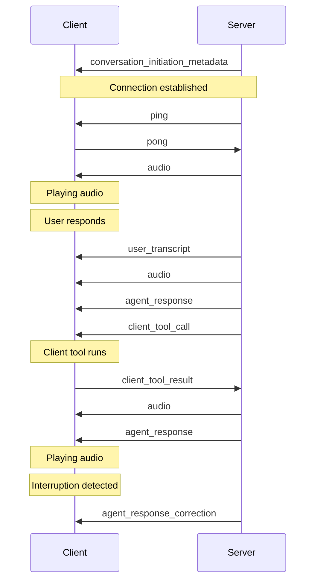

# ElevenLabs Documentation

> Explore our docs and guides to integrate ElevenLabs

{/_ Light mode wave _/}

<div id="overview-wave">
  <ElevenLabsWaveform color="blue" />
</div>

{/_ Dark mode wave _/}

<div id="overview-wave">
  <ElevenLabsWaveform color="gray" />
</div>

<div id="agents-cards">
  <a href="/docs/creative-platform/overview">
    <div>
      
    </div>

    <div>
      <h3>
        Creative Platform
      </h3>

      <p>
        Learn how to use the ElevenLabs Creative Platform with step-by-step guides
      </p>
    </div>

  </a>

  <a href="/docs/agents-platform/overview">
    <div>
      
    </div>

    <div>
      <h3>
        Agents Platform
      </h3>

      <p>
        Learn how to build, launch, and scale agents with ElevenLabs
      </p>
    </div>

  </a>

  <a href="/docs/developers/quickstart">
    <div>
      
    </div>

    <div>
      <h3>
        Developers
      </h3>

      <p>
        Learn how to integrate ElevenLabs with examples and tutorials
      </p>
    </div>

  </a>
</div>

## Meet the models

<CardGroup cols={2} rows={2}>
  <Card title={<div className="flex items-start gap-2"><div>Eleven v3</div><div></div></div>} href="/docs/overview/models#eleven-v3-alpha">
    Our most emotionally rich, expressive speech synthesis model

    <div>
      <div>
        Dramatic delivery and performance
      </div>

      <div>
        70+ languages supported
      </div>

      <div>
        5,000 character limit
      </div>

      <div>
        Support for natural multi-speaker dialogue
      </div>
    </div>

  </Card>

  <Card title="Eleven Multilingual v2" href="/docs/overview/models#multilingual-v2">
    Lifelike, consistent quality speech synthesis model

    <div>
      <div>
        Natural-sounding output
      </div>

      <div>
        29 languages supported
      </div>

      <div>
        10,000 character limit
      </div>

      <div>
        Most stable on long-form generations
      </div>
    </div>

  </Card>

  <Card title="Eleven Flash v2.5" href="/docs/overview/models#flash-v25">
    Our fast, affordable speech synthesis model

    <div>
      <div>
        Ultra-low latency (~75ms†)
      </div>

      <div>
        32 languages supported
      </div>

      <div>
        40,000 character limit
      </div>

      <div>
        Faster model, 50% lower price per character
      </div>
    </div>

  </Card>

  <Card title="Eleven Turbo v2.5" href="/docs/overview/models#turbo-v25">
    High quality, low-latency model with a good balance of quality and speed

    <div>
      <div>
        High quality voice generation
      </div>

      <div>
        32 languages supported
      </div>

      <div>
        40,000 character limit
      </div>

      <div>
        Low latency (~250ms-300ms†), 50% lower price per character
      </div>
    </div>

  </Card>
</CardGroup>

<CardGroup cols={2} rows={1}>
  <Card title="Scribe v2" href="/docs/overview/models#scribe-v2">
    State-of-the-art speech recognition model

    <div>
      <div>
        Accurate transcription in 90+ languages
      </div>

      <div>
        Keyterm prompting, up to 100 terms
      </div>

      <div>
        Entity detection, up to 56
      </div>

      <div>
        Precise word-level timestamps
      </div>

      <div>
        Speaker diarization, up to 48 speakers
      </div>

      <div>
        Dynamic audio tagging
      </div>

      <div>
        Smart language detection
      </div>
    </div>

  </Card>

  <Card title="Scribe v2 Realtime" href="/docs/overview/models#scribe-v2-realtime">
    Real-time speech recognition model

    <div>
      <div>
        Accurate transcription in 90+ languages
      </div>

      <div>
        Real-time transcription
      </div>

      <div>
        Low latency (~150ms†)
      </div>

      <div>
        Precise word-level timestamps
      </div>
    </div>

  </Card>
</CardGroup>

<div>
  <div>
    [Explore all](/docs/overview/models)
  </div>
</div>

<small>
  † Excluding application & network latency
</small>

## Browse by capability

<CardGroup cols={3}>
  <Card href="/docs/overview/capabilities/text-to-speech">
    <div>
      <div>
        <div>
          Text to Speech
        </div>

        <p>
          Convert text into lifelike speech
        </p>
      </div>
    </div>

  </Card>

  <Card href="/docs/overview/capabilities/speech-to-text">
    <div>
      <div>
        <div>
          Speech to Text
        </div>

        <p>
          Transcribe spoken audio into text
        </p>
      </div>
    </div>

  </Card>

  <Card href="/docs/overview/capabilities/music">
    <div>
      <div>
        <div>
          Music
        </div>

        <p>
          Generate music from text
        </p>
      </div>
    </div>

  </Card>

  <Card href="/docs/overview/capabilities/text-to-dialogue">
    <div>
      <div>
        <div>
          Text to Dialogue
        </div>

        <p>
          Create natural-sounding dialogue from text
        </p>
      </div>
    </div>

  </Card>

  <Card href="/docs/overview/capabilities/image-video">
    <div>
      <div>
        <div>
          Image & Video
        </div>

        <p>
          Generate images and videos from text
        </p>
      </div>
    </div>

  </Card>

  <Card href="/docs/overview/capabilities/voice-changer">
    <div>
      <div>
        <div>
          Voice changer
        </div>

        <p>
          Modify and transform voices
        </p>
      </div>
    </div>

  </Card>

  <Card href="/docs/overview/capabilities/voice-isolator">
    <div>
      <div>
        <div>
          Voice isolator
        </div>

        <p>
          Isolate voices from background noise
        </p>
      </div>
    </div>

  </Card>

  <Card href="/docs/overview/capabilities/dubbing">
    <div>
      <div>
        <div>
          Dubbing
        </div>

        <p>
          Dub audio and videos seamlessly
        </p>
      </div>
    </div>

  </Card>

  <Card href="/docs/overview/capabilities/sound-effects">
    <div>
      <div>
        <div>
          Sound effects
        </div>

        <p>
          Create cinematic sound effects
        </p>
      </div>
    </div>

  </Card>

  <Card href="/docs/overview/capabilities/voices">
    <div>
      <div>
        <div>
          Voices
        </div>

        <p>
          Clone and design custom voices
        </p>
      </div>
    </div>

  </Card>

  <Card href="/docs/overview/capabilities/voice-remixing">
    <div>
      <div>
        <div>
          Voice Remixing
        </div>

        <p>
          Transform and enhance existing voices
        </p>
      </div>
    </div>

  </Card>

  <Card href="/docs/overview/capabilities/forced-alignment">
    <div>
      <div>
        <div>
          Forced Alignment
        </div>

        <p>
          Align text to audio
        </p>
      </div>
    </div>

  </Card>

  <Card href="/docs/agents-platform/overview">
    <div>
      <div>
        <div>
          Agents Platform
        </div>

        <p>
          Deploy intelligent voice agents
        </p>
      </div>
    </div>

  </Card>
</CardGroup>

# Models

> Learn about the models that power the ElevenLabs API.

## Flagship models

### Text to Speech

<CardGroup cols={2} rows={2}>
  <Card title={<div className="flex items-start gap-2"><div>Eleven v3</div><div></div></div>} href="/docs/overview/models#eleven-v3-alpha">
    Our most emotionally rich, expressive speech synthesis model

    <div>
      <div>
        Dramatic delivery and performance
      </div>

      <div>
        70+ languages supported
      </div>

      <div>
        5,000 character limit
      </div>

      <div>
        Support for natural multi-speaker dialogue
      </div>
    </div>

  </Card>

  <Card title="Eleven Multilingual v2" href="/docs/overview/models#multilingual-v2">
    Lifelike, consistent quality speech synthesis model

    <div>
      <div>
        Natural-sounding output
      </div>

      <div>
        29 languages supported
      </div>

      <div>
        10,000 character limit
      </div>

      <div>
        Most stable on long-form generations
      </div>
    </div>

  </Card>

  <Card title="Eleven Flash v2.5" href="/docs/overview/models#flash-v25">
    Our fast, affordable speech synthesis model

    <div>
      <div>
        Ultra-low latency (~75ms†)
      </div>

      <div>
        32 languages supported
      </div>

      <div>
        40,000 character limit
      </div>

      <div>
        Faster model, 50% lower price per character
      </div>
    </div>

  </Card>

  <Card title="Eleven Turbo v2.5" href="/docs/overview/models#turbo-v25">
    High quality, low-latency model with a good balance of quality and speed

    <div>
      <div>
        High quality voice generation
      </div>

      <div>
        32 languages supported
      </div>

      <div>
        40,000 character limit
      </div>

      <div>
        Low latency (~250ms-300ms†), 50% lower price per character
      </div>
    </div>

  </Card>
</CardGroup>

### Speech to Text

<CardGroup cols={2} rows={1}>
  <Card title="Scribe v2" href="/docs/overview/models#scribe-v2">
    State-of-the-art speech recognition model

    <div>
      <div>
        Accurate transcription in 90+ languages
      </div>

      <div>
        Keyterm prompting, up to 100 terms
      </div>

      <div>
        Entity detection, up to 56
      </div>

      <div>
        Precise word-level timestamps
      </div>

      <div>
        Speaker diarization, up to 48 speakers
      </div>

      <div>
        Dynamic audio tagging
      </div>

      <div>
        Smart language detection
      </div>
    </div>

  </Card>

  <Card title="Scribe v2 Realtime" href="/docs/overview/models#scribe-v2-realtime">
    Real-time speech recognition model

    <div>
      <div>
        Accurate transcription in 90+ languages
      </div>

      <div>
        Real-time transcription
      </div>

      <div>
        Low latency (~150ms†)
      </div>

      <div>
        Precise word-level timestamps
      </div>
    </div>

  </Card>
</CardGroup>

### Music

<CardGroup cols={1} rows={1}>
  <Card title="Eleven Music" href="/docs/overview/models#eleven-music">
    Studio-grade music with natural language prompts in any style

    <div>
      <div>
        Complete control over genre, style, and structure
      </div>

      <div>
        Vocals or just instrumental
      </div>

      <div>
        Multilingual, including English, Spanish, German, Japanese and more
      </div>

      <div>
        Edit the sound and lyrics of individual sections or the whole song
      </div>
    </div>

  </Card>
</CardGroup>

<div>
  <div>
    [Pricing](https://elevenlabs.io/pricing/api)
  </div>
</div>

## Models overview

The ElevenLabs API offers a range of audio models optimized for different use cases, quality levels, and performance requirements.

| Model ID                     | Description                                                                              | Languages                                                                                                                                                                                       |
| ---------------------------- | ---------------------------------------------------------------------------------------- | ----------------------------------------------------------------------------------------------------------------------------------------------------------------------------------------------- |
| `eleven_v3`                  | Human-like and expressive speech generation                                              | [70+ languages](/docs/overview/models#supported-languages)                                                                                                                                      |
| `eleven_ttv_v3`              | Human-like and expressive voice design model (Text to Voice)                             | [70+ languages](/docs/overview/models#supported-languages)                                                                                                                                      |
| `eleven_multilingual_v2`     | Our most lifelike model with rich emotional expression                                   | `en`, `ja`, `zh`, `de`, `hi`, `fr`, `ko`, `pt`, `it`, `es`, `id`, `nl`, `tr`, `fil`, `pl`, `sv`, `bg`, `ro`, `ar`, `cs`, `el`, `fi`, `hr`, `ms`, `sk`, `da`, `ta`, `uk`, `ru`                   |
| `eleven_flash_v2_5`          | Ultra-fast model optimized for real-time use (\~75ms†)                                   | All `eleven_multilingual_v2` languages plus: `hu`, `no`, `vi`                                                                                                                                   |
| `eleven_flash_v2`            | Ultra-fast model optimized for real-time use (\~75ms†)                                   | `en`                                                                                                                                                                                            |
| `eleven_turbo_v2_5`          | High quality, low-latency model with a good balance of quality and speed (\~250ms-300ms) | `en`, `ja`, `zh`, `de`, `hi`, `fr`, `ko`, `pt`, `it`, `es`, `id`, `nl`, `tr`, `fil`, `pl`, `sv`, `bg`, `ro`, `ar`, `cs`, `el`, `fi`, `hr`, `ms`, `sk`, `da`, `ta`, `uk`, `ru`, `hu`, `no`, `vi` |
| `eleven_turbo_v2`            | High quality, low-latency model with a good balance of quality and speed (\~250ms-300ms) | `en`                                                                                                                                                                                            |
| `eleven_multilingual_sts_v2` | State-of-the-art multilingual voice changer model (Speech to Speech)                     | `en`, `ja`, `zh`, `de`, `hi`, `fr`, `ko`, `pt`, `it`, `es`, `id`, `nl`, `tr`, `fil`, `pl`, `sv`, `bg`, `ro`, `ar`, `cs`, `el`, `fi`, `hr`, `ms`, `sk`, `da`, `ta`, `uk`, `ru`                   |
| `eleven_multilingual_ttv_v2` | State-of-the-art multilingual voice designer model (Text to Voice)                       | `en`, `ja`, `zh`, `de`, `hi`, `fr`, `ko`, `pt`, `it`, `es`, `id`, `nl`, `tr`, `fil`, `pl`, `sv`, `bg`, `ro`, `ar`, `cs`, `el`, `fi`, `hr`, `ms`, `sk`, `da`, `ta`, `uk`, `ru`                   |
| `eleven_english_sts_v2`      | English-only voice changer model (Speech to Speech)                                      | `en`                                                                                                                                                                                            |
| `scribe_v2_realtime`         | Real-time speech recognition model                                                       | [90+ languages](/docs/overview/capabilities/speech-to-text#supported-languages)                                                                                                                 |
| `scribe_v2`                  | State-of-the-art speech recognition model                                                | [90+ languages](/docs/overview/capabilities/speech-to-text#supported-languages)                                                                                                                 |
| `scribe_v1`                  | State-of-the-art speech recognition. Outclassed by v2 models                             | [90+ languages](/docs/overview/capabilities/speech-to-text#supported-languages)                                                                                                                 |

<small>
  † Excluding application & network latency
</small>

### Deprecated models

<Error>
  The `eleven_monolingual_v1` and `eleven_multilingual_v1` models are deprecated and will be removed in the future. Please migrate to newer models for continued service.
</Error>

| Model ID                 | Description                                          | Languages                                      | Replacement model suggestion |
| ------------------------ | ---------------------------------------------------- | ---------------------------------------------- | ---------------------------- |
| `eleven_monolingual_v1`  | First generation TTS model (outclassed by v2 models) | `en`                                           | `eleven_multilingual_v2`     |
| `eleven_multilingual_v1` | First multilingual model (outclassed by v2 models)   | `en`, `fr`, `de`, `hi`, `it`, `pl`, `pt`, `es` | `eleven_multilingual_v2`     |

## Eleven v3 (alpha)

<Warning>
  This model is currently in alpha and is subject to change. Eleven v3 is not made for real-time
  applications like Agents Platform. When integrating Eleven v3 into your application, consider
  generating several generations and allowing the user to select the best one.
</Warning>

Eleven v3 is our latest and most advanced speech synthesis model. It is a state-of-the-art model that produces natural, life-like speech with high emotional range and contextual understanding across multiple languages.

This model works well in the following scenarios:

- **Character Discussions**: Excellent for audio experiences with multiple characters that interact with each other.
- **Audiobook Production**: Perfect for long-form narration with complex emotional delivery.
- **Emotional Dialogue**: Generate natural, lifelike dialogue with high emotional range and contextual understanding.

With Eleven v3 comes a new Text to Dialogue API, which allows you to generate natural, lifelike dialogue with high emotional range and contextual understanding across multiple languages. Eleven v3 can also be used with the Text to Speech API to generate natural, lifelike speech with high emotional range and contextual understanding across multiple languages.

Read more about the Text to Dialogue API [here](/docs/overview/capabilities/text-to-dialogue).

### Supported languages

The Eleven v3 model supports 70+ languages, including:

_Afrikaans (afr), Arabic (ara), Armenian (hye), Assamese (asm), Azerbaijani (aze), Belarusian (bel), Bengali (ben), Bosnian (bos), Bulgarian (bul), Catalan (cat), Cebuano (ceb), Chichewa (nya), Croatian (hrv), Czech (ces), Danish (dan), Dutch (nld), English (eng), Estonian (est), Filipino (fil), Finnish (fin), French (fra), Galician (glg), Georgian (kat), German (deu), Greek (ell), Gujarati (guj), Hausa (hau), Hebrew (heb), Hindi (hin), Hungarian (hun), Icelandic (isl), Indonesian (ind), Irish (gle), Italian (ita), Japanese (jpn), Javanese (jav), Kannada (kan), Kazakh (kaz), Kirghiz (kir), Korean (kor), Latvian (lav), Lingala (lin), Lithuanian (lit), Luxembourgish (ltz), Macedonian (mkd), Malay (msa), Malayalam (mal), Mandarin Chinese (cmn), Marathi (mar), Nepali (nep), Norwegian (nor), Pashto (pus), Persian (fas), Polish (pol), Portuguese (por), Punjabi (pan), Romanian (ron), Russian (rus), Serbian (srp), Sindhi (snd), Slovak (slk), Slovenian (slv), Somali (som), Spanish (spa), Swahili (swa), Swedish (swe), Tamil (tam), Telugu (tel), Thai (tha), Turkish (tur), Ukrainian (ukr), Urdu (urd), Vietnamese (vie), Welsh (cym)._

## Multilingual v2

Eleven Multilingual v2 is our most advanced, emotionally-aware speech synthesis model. It produces natural, lifelike speech with high emotional range and contextual understanding across multiple languages.

The model delivers consistent voice quality and personality across all supported languages while maintaining the speaker's unique characteristics and accent.

This model excels in scenarios requiring high-quality, emotionally nuanced speech:

- **Character Voiceovers**: Ideal for gaming and animation due to its emotional range.
- **Professional Content**: Well-suited for corporate videos and e-learning materials.
- **Multilingual Projects**: Maintains consistent voice quality across language switches.
- **Stable Quality**: Produces consistent, high-quality audio output.

While it has a higher latency & cost per character than Flash models, it delivers superior quality for projects where lifelike speech is important.

Our multilingual v2 models support 29 languages:

_English (USA, UK, Australia, Canada), Japanese, Chinese, German, Hindi, French (France, Canada), Korean, Portuguese (Brazil, Portugal), Italian, Spanish (Spain, Mexico), Indonesian, Dutch, Turkish, Filipino, Polish, Swedish, Bulgarian, Romanian, Arabic (Saudi Arabia, UAE), Czech, Greek, Finnish, Croatian, Malay, Slovak, Danish, Tamil, Ukrainian & Russian._

## Flash v2.5

Eleven Flash v2.5 is our fastest speech synthesis model, designed for real-time applications and Agents Platform. It delivers high-quality speech with ultra-low latency (\~75ms†) across 32 languages.

The model balances speed and quality, making it ideal for interactive applications while maintaining natural-sounding output and consistent voice characteristics across languages.

This model is particularly well-suited for:

- **Agents Platform**: Perfect for real-time voice agents and chatbots.
- **Interactive Applications**: Ideal for games and applications requiring immediate response.
- **Large-Scale Processing**: Efficient for bulk text-to-speech conversion.

With its lower price point and 75ms latency, Flash v2.5 is the cost-effective option for anyone needing fast, reliable speech synthesis across multiple languages.

Flash v2.5 supports 32 languages - all languages from v2 models plus:

_Hungarian, Norwegian & Vietnamese_

<small>
  † Excluding application & network latency
</small>

### Considerations

<AccordionGroup>
  <Accordion title="Text normalization with numbers">
    When using Flash v2.5, numbers aren't normalized by default in a way you might expect. For example, phone numbers might be read out in way that isn't clear for the user. Dates and currencies are affected in a similar manner.

    By default, normalization is disabled for Flash v2.5 to maintain the low latency. However, Enterprise customers can now enable text normalization for v2.5 models by setting the `apply_text_normalization` parameter to "on" in your request.

    The Multilingual v2 model does a better job of normalizing numbers, so we recommend using it for phone numbers and other cases where number normalization is important.

    For low-latency or Agents Platform applications, best practice is to have your LLM [normalize the text](/docs/overview/capabilities/text-to-speech/best-practices#text-normalization) before passing it to the TTS model, or use the `apply_text_normalization` parameter (Enterprise plans only for v2.5 models).

  </Accordion>
</AccordionGroup>

## Turbo v2.5

Eleven Turbo v2.5 is our high-quality, low-latency model with a good balance of quality and speed.

This model is an ideal choice for all scenarios where you'd use Flash v2.5, but where you're willing to trade off latency for higher quality voice generation.

## Model selection guide

<AccordionGroup>
  <Accordion title="Requirements">
    <CardGroup cols={1}>
      <Card title="Quality">
        Use `eleven_multilingual_v2`

        Best for high-fidelity audio output with rich emotional expression
      </Card>

      <Card title="Low-latency">
        Use Flash models

        Optimized for real-time applications (\~75ms latency)
      </Card>

      <Card title="Multilingual">
        Use either either `eleven_multilingual_v2` or `eleven_flash_v2_5`

        Both support up to 32 languages
      </Card>

      <Card title="Balanced">
        Use `eleven_turbo_v2_5`

        Good balance between quality and speed
      </Card>
    </CardGroup>

  </Accordion>

  <Accordion title="Use case">
    <CardGroup cols={1}>
      <Card title="Content creation">
        Use `eleven_multilingual_v2`

        Ideal for professional content, audiobooks & video narration.
      </Card>

      <Card title="Agents Platform">
        Use `eleven_flash_v2_5`, `eleven_flash_v2`, `eleven_multilingual_v2`, `eleven_turbo_v2_5` or `eleven_turbo_v2`

        Perfect for real-time conversational applications
      </Card>

      <Card title="Voice changer">
        Use `eleven_multilingual_sts_v2`

        Specialized for Speech-to-Speech conversion
      </Card>
    </CardGroup>

  </Accordion>
</AccordionGroup>

## Character limits

The maximum number of characters supported in a single text-to-speech request varies by model.

| Model ID                 | Character limit | Approximate audio duration |
| ------------------------ | --------------- | -------------------------- |
| `eleven_v3`              | 5,000           | \~5 minutes                |
| `eleven_flash_v2_5`      | 40,000          | \~40 minutes               |
| `eleven_flash_v2`        | 30,000          | \~30 minutes               |
| `eleven_turbo_v2_5`      | 40,000          | \~40 minutes               |
| `eleven_turbo_v2`        | 30,000          | \~30 minutes               |
| `eleven_multilingual_v2` | 10,000          | \~10 minutes               |
| `eleven_multilingual_v1` | 10,000          | \~10 minutes               |
| `eleven_english_sts_v2`  | 10,000          | \~10 minutes               |
| `eleven_english_sts_v1`  | 10,000          | \~10 minutes               |

<Note>
  For longer content, consider splitting the input into multiple requests.
</Note>

## Scribe v2

Scribe v2 is our state-of-the-art speech recognition model designed for accurate transcription across 90+ languages. It provides precise word-level timestamps and advanced features like speaker diarization and dynamic audio tagging.

This model excels in scenarios requiring accurate speech-to-text conversion:

- **Transcription Services**: Perfect for converting audio/video content to text
- **Meeting Documentation**: Ideal for capturing and documenting conversations
- **Content Analysis**: Well-suited for audio content processing and analysis
- **Multilingual Recognition**: Supports accurate transcription across 90+ languages

Key features:

- Accurate transcription with word-level timestamps
- Speaker diarization for multi-speaker audio
- Dynamic audio tagging for enhanced context
- Support for 90+ languages
- Entity detection
- Keyterm prompting

Read more about Scribe v2 [here](/docs/overview/capabilities/speech-to-text).

## Scribe v2 Realtime

Scribe v2 Realtime, our fastest and most accurate live speech recognition model, delivers state-of-the-art accuracy in over 90 languages with an ultra-low 150ms of latency.

This model excels in conversational use cases:

- **Live meeting transcription**: Perfect for realtime transcription
- **AI Agents**: Ideal for live conversations
- **Multilingual Recognition**: Supports accurate transcription across 90+ languages with automatic language recognition

Key features:

- Ultra-low latency: Get partial transcriptions in \~150 milliseconds
- Streaming support: Send audio in chunks while receiving transcripts in real-time
- Multiple audio formats: Support for PCM (8kHz to 48kHz) and μ-law encoding
- Voice Activity Detection (VAD): Automatic speech segmentation based on silence detection
- Manual commit control: Full control over when to finalize transcript segments

Read more about Scribe v2 Realtime [here](/docs/overview/capabilities/speech-to-text).

## Eleven Music

Eleven Music is our studio-grade music generation model. It allows you to generate music with natural language prompts in any style.

This model is excellent for the following scenarios:

- **Game Soundtracks**: Create immersive soundtracks for games
- **Podcast Backgrounds**: Enhance podcasts with professional music
- **Marketing**: Add background music to ad reels

Key features:

- Complete control over genre, style, and structure
- Vocals or just instrumental
- Multilingual, including English, Spanish, German, Japanese and more
- Edit the sound and lyrics of individual sections or the whole song

Read more about Eleven Music [here](/docs/overview/capabilities/music).

## Concurrency and priority

Your subscription plan determines how many requests can be processed simultaneously and the priority level of your requests in the queue.
Speech to Text has an elevated concurrency limit.
Once the concurrency limit is met, subsequent requests are processed in a queue alongside lower-priority requests.
In practice this typically only adds \~50ms of latency.

| Plan       | Concurrency Limit<br /> (Multilingual v2) | Concurrency Limit<br /> (Turbo & Flash) | STT Concurrency Limit | Realtime STT Concurrency limit | Music Concurrency limit | Priority level |
| ---------- | ----------------------------------------- | --------------------------------------- | --------------------- | ------------------------------ | ----------------------- | -------------- |
| Free       | 2                                         | 4                                       | 8                     | 4                              | 0                       | 3              |
| Starter    | 3                                         | 6                                       | 12                    | 6                              | 2                       | 4              |
| Creator    | 5                                         | 10                                      | 20                    | 10                             | 2                       | 5              |
| Pro        | 10                                        | 20                                      | 40                    | 20                             | 2                       | 5              |
| Scale      | 15                                        | 30                                      | 60                    | 30                             | 5                       | 5              |
| Business   | 15                                        | 30                                      | 60                    | 30                             | 5                       | 5              |
| Enterprise | Elevated                                  | Elevated                                | Elevated              | Elevated                       | Highest                 | 6              |

<Note>
  Startup grants recipients receive Scale level benefits.
</Note>

The response headers include `current-concurrent-requests` and `maximum-concurrent-requests` which you can use to monitor your concurrency.

### API requests per minute vs concurrent requests

It's important to understand that **API requests per minute** and **concurrent requests** are different metrics that depend on your usage patterns.

API requests per minute can be different from concurrent requests since it depends on the length of time for each request and how the requests are batched.

**Example 1: Spaced requests**
If you had 180 requests per minute that each took 1 second to complete and you sent them each 0.33 seconds apart, the max concurrent requests would be 3 and the average would be 3 since there would always be 3 in flight.

**Example 2: Batched requests**
However, if you had a different usage pattern such as 180 requests per minute that each took 3 seconds to complete but all fired at once, the max concurrent requests would be 180 and the average would be 9 (first 3 seconds of the minute saw 180 requests at once, final 57 seconds saw 0 requests).

Since our system cares about concurrency, requests per minute matter less than how long each of the requests take and the pattern of when they are sent.

How endpoint requests are made impacts concurrency limits:

- With HTTP, each request counts individually toward your concurrency limit.
- With a WebSocket, only the time where our model is generating audio counts towards your concurrency limit, this means a for most of the time an open websocket doesn't count towards your concurrency limit at all.

### Understanding concurrency limits

The concurrency limit associated with your plan should not be interpreted as the maximum number of simultaneous conversations, phone calls character voiceovers, etc that can be handled at once.
The actual number depends on several factors, including the specific AI voices used and the characteristics of the use case.

As a general rule of thumb, a concurrency limit of 5 can typically support up to approximately 100 simultaneous audio broadcasts.

This is because of the speed it takes for audio to be generated relative to the time it takes for the TTS request to be processed.
The diagram below is an example of how 4 concurrent calls with different users can be facilitated while only hitting 2 concurrent requests.

<Frame background="subtle">
  
</Frame>

<AccordionGroup>
  <Accordion title="Building AI Voice Agents">
    Where TTS is used to facilitate dialogue, a concurrency limit of 5 can support about 100 broadcasts for balanced conversations between AI agents and human participants.

    For use cases in which the AI agent speaks less frequently than the human, such as customer support interactions, more than 100 simultaneous conversations could be supported.

  </Accordion>

  <Accordion title="Character voiceovers">
    Generally, more than 100 simultaneous character voiceovers can be supported for a concurrency limit of 5.

    The number can vary depending on the character’s dialogue frequency, the length of pauses, and in-game actions between lines.

  </Accordion>

  <Accordion title="Live Dubbing">
    Concurrent dubbing streams generally follow the provided heuristic.

    If the broadcast involves periods of conversational pauses (e.g. because of a soundtrack, visual scenes, etc), more simultaneous dubbing streams than the suggestion may be possible.

  </Accordion>
</AccordionGroup>

If you exceed your plan's concurrency limits at any point and you are on the Enterprise plan, model requests may still succeed, albeit slower, on a best efforts basis depending on available capacity.

<Note>
  To increase your concurrency limit & queue priority, [upgrade your subscription
  plan](https://elevenlabs.io/pricing/api).

Enterprise customers can request a higher concurrency limit by contacting their account manager.
</Note>

### Scale testing concurrency limits

Scale testing can be useful to identify client side scaling issues and to verify concurrency limits are set correctly for your usecase.

It is heavily recommended to test end-to-end workflows as close to real world usage as possible, simulating and measuring how many users can be supported is the recommended methodology for achieving this. It is important to:

- Simulate users, not raw requests
- Simulate typical user behavior such as waiting for audio playback, user speaking or transcription to finish before making requests
- Ramp up the number of users slowly over a period of minutes
- Introduce randomness to request timings and to the size of requests
- Capture latency metrics and any returned error codes from the API

For example, to test an agent system designed to support 100 simultaneous conversations you would create up to 100 individual "users" each simulating a conversation. Conversations typically consist of a repeating cycle of \~10 seconds of user talking, followed by the TTS API call for \~150 characters, followed by \~10 seconds of audio playback to the user. Therefore, each user should follow the pattern of making a websocket Text-to-Speech API call for 150 characters of text every 20 seconds, with a small amount of randomness introduced to the wait period and the number of characters requested. The test would consist of spawning one user per second until 100 exist and then testing for 10 minutes in total to test overall stability.

<AccordionGroup>
  <Accordion title="Scale testing script example">
    This example uses [locust](https://locust.io/) as the testing framework with direct API calls to the ElevenLabs API.

    It follows the example listed above, testing a conversational agent system with each user sending 1 request every 20 seconds.

    <CodeBlocks>
      ```python title="Python" {12}
      import json
      import random
      import time
      import gevent
      import locust
      from locust import User, task, events, constant_throughput
      import websocket

      # Averages up to 10 seconds of audio when played, depends on the voice speed
      DEFAULT_TEXT = (
          "Hello, this is a test message. I am testing if a long input will cause issues for the model "
          "like this sentence. "
      )

      TEXT_ARRAY = [
          "Hello.",
          "Hello, this is a test message.",
          DEFAULT_TEXT,
          DEFAULT_TEXT * 2,
          DEFAULT_TEXT * 3
      ]

      # Custom command line arguments
      @events.init_command_line_parser.add_listener
      def on_parser_init(parser):
          parser.add_argument("--api-key", default="YOUR_API_KEY", help="API key for authentication")
          parser.add_argument("--encoding", default="mp3_22050_32", help="Encoding")
          parser.add_argument("--text", default=DEFAULT_TEXT, help="Text to use")
          parser.add_argument("--use-text-array", default="false", help="Text to use")
          parser.add_argument("--voice-id", default="aria", help="Text to use")


      class WebSocketTTSUser(User):
          # Each user will send a request every 20 seconds, regardless of how long each request takes
          wait_time = constant_throughput(0.05)

          def __init__(self, *args, **kwargs):
              super().__init__(*args, **kwargs)
              self.api_key = self.environment.parsed_options.api_key
              self.voice_id = self.environment.parsed_options.voice_id
              self.text = self.environment.parsed_options.text
              self.encoding = self.environment.parsed_options.encoding
              self.use_text_array = self.environment.parsed_options.use_text_array
              if self.use_text_array:
                  self.text = random.choice(TEXT_ARRAY)
              self.all_recieved = False

          @task
          def tts_task(self):
              # Do jitter waiting of up to 1 second
              # Users appear to be spawned every second so this ensures requests are not aligned
              gevent.sleep(random.random())

              max_wait_time = 10

              # Connection details
              uri = f"{self.environment.host}/v1/text-to-speech/{self.voice_id}/stream-input?auto_mode=true&output_format={self.encoding}"
              headers = {"xi-api-key": self.api_key}

              ws = None
              self.all_recieved = False
              try:
                  init_msg = {"text": " "}
                  # Use proper header format for websocket - this is case sensitive!
                  ws = websocket.create_connection(uri, header=headers)
                  ws.send(json.dumps(init_msg))

                  # Start measuring after websocket initiated but before any messages are sent
                  send_request_time = time.perf_counter()
                  ws.send(json.dumps({"text": self.text}))

                  # Send to flush and receive the audio
                  ws.send(json.dumps({"text": ""}))

                  def _receive():
                      t_first_response = None
                      audio_size = 0
                      try:
                          while True:
                              # Wait up to 10 seconds for a response
                              ws.settimeout(max_wait_time)
                              response = ws.recv()
                              response_data = json.loads(response)

                              if "audio" in response_data and response_data["audio"]:
                                  audio_size = audio_size + len(response_data["audio"])

                              if t_first_response is None:
                                  t_first_response = time.perf_counter()
                                  first_byte_ms = (
                                      t_first_response - send_request_time
                                  ) * 1000
                                  if audio_size is None:
                                      # The first response should always have audio
                                      locust.events.request.fire(
                                          request_type="websocket",
                                          name="Bad Response (no audio)",
                                          response_time=first_byte_ms,
                                          response_length=audio_size,
                                          exception=Exception("Response has no audio"),
                                      )
                                      break

                              if "isFinal" in response_data and response_data["isFinal"]:
                                  # Fire this event once finished streaming, but report the important TTFB metric
                                  locust.events.request.fire(
                                      request_type="websocket",
                                      name="TTS Stream Success (First Byte)",
                                      response_time=first_byte_ms,
                                      response_length=audio_size,
                                      exception=None,
                                  )
                                  break

                      except websocket.WebSocketTimeoutException:
                          locust.events.request.fire(
                              request_type="websocket",
                              name="TTS Stream Timeout",
                              response_time=max_wait_time * 1000,
                              response_length=audio_size,
                              exception=Exception("Timeout waiting for response"),
                          )
                      except Exception as e:
                          # Typically JSON decode error if the server returns HTTP backoff error
                          locust.events.request.fire(
                              request_type="websocket",
                              name="TTS Stream Failure",
                              response_time=0,
                              response_length=0,
                              exception=e,
                          )
                      finally:
                          self.all_recieved = True

                  gevent.spawn(_receive)

                  # Sleep until recieved so new tasks aren't spawned
                  while not self.all_recieved:
                      gevent.sleep(1)

              except websocket.WebSocketTimeoutException:
                  locust.events.request.fire(
                      request_type="websocket",
                      name="TTS Stream Timeout",
                      response_time=max_wait_time * 1000,
                      response_length=0,
                      exception=Exception("Timeout waiting for response"),
                  )
              except Exception as e:
                  locust.events.request.fire(
                      request_type="websocket",
                      name="TTS Stream Failure",
                      response_time=0,
                      response_length=0,
                      exception=e,
                  )
              finally:
                  # Try and close the websocket gracefully
                  try:
                      if ws:
                          ws.close()
                  except Exception:
                      pass

      ```
    </CodeBlocks>

  </Accordion>
</AccordionGroup>

# Text to Speech

> Learn how to turn text into lifelike spoken audio with ElevenLabs.

## Overview

ElevenLabs [Text to Speech (TTS)](/docs/api-reference/text-to-speech/convert) API turns text into lifelike audio with nuanced intonation, pacing and emotional awareness. [Our models](/docs/overview/models) adapt to textual cues across 32 languages and multiple voice styles and can be used to:

- Narrate global media campaigns & ads
- Produce audiobooks in multiple languages with complex emotional delivery
- Stream real-time audio from text

Listen to a sample:

<elevenlabs-audio-player audio-title="George" audio-src="https://storage.googleapis.com/eleven-public-cdn/audio/marketing/george.mp3" />

Explore our [voice library](https://elevenlabs.io/app/voice-library) to find the perfect voice for your project.

<Warning>
  The voice library is not available via the API to free tier users.
</Warning>

<CardGroup cols={2}>
  <Card title="Products" icon="duotone book-user" href="/docs/creative-platform/playground/text-to-speech">
    Step-by-step guide for using text to speech in ElevenLabs.
  </Card>

  <Card title="Developers" icon="duotone code" href="/docs/developers/quickstart">
    Learn how to integrate text to speech into your application.
  </Card>
</CardGroup>

### Voice quality

For real-time applications, Flash v2.5 provides ultra-low 75ms latency, while Multilingual v2 delivers the highest quality audio with more nuanced expression.

<CardGroup cols={2} rows={2}>
  <Card title={<div className="flex items-start gap-2"><div>Eleven v3</div><div></div></div>} href="/docs/overview/models#eleven-v3-alpha">
    Our most emotionally rich, expressive speech synthesis model

    <div>
      <div>
        Dramatic delivery and performance
      </div>

      <div>
        70+ languages supported
      </div>

      <div>
        5,000 character limit
      </div>

      <div>
        Support for natural multi-speaker dialogue
      </div>
    </div>

  </Card>

  <Card title="Eleven Multilingual v2" href="/docs/overview/models#multilingual-v2">
    Lifelike, consistent quality speech synthesis model

    <div>
      <div>
        Natural-sounding output
      </div>

      <div>
        29 languages supported
      </div>

      <div>
        10,000 character limit
      </div>

      <div>
        Most stable on long-form generations
      </div>
    </div>

  </Card>

  <Card title="Eleven Flash v2.5" href="/docs/overview/models#flash-v25">
    Our fast, affordable speech synthesis model

    <div>
      <div>
        Ultra-low latency (~75ms†)
      </div>

      <div>
        32 languages supported
      </div>

      <div>
        40,000 character limit
      </div>

      <div>
        Faster model, 50% lower price per character
      </div>
    </div>

  </Card>

  <Card title="Eleven Turbo v2.5" href="/docs/overview/models#turbo-v25">
    High quality, low-latency model with a good balance of quality and speed

    <div>
      <div>
        High quality voice generation
      </div>

      <div>
        32 languages supported
      </div>

      <div>
        40,000 character limit
      </div>

      <div>
        Low latency (~250ms-300ms†), 50% lower price per character
      </div>
    </div>

  </Card>
</CardGroup>

<div>
  <div>
    [Explore all](/docs/overview/models)
  </div>
</div>

### Voice options

ElevenLabs offers thousands of voices across 32 languages through multiple creation methods:

- [Voice library](/docs/overview/capabilities/voices) with 3,000+ community-shared voices
- [Professional voice cloning](/docs/overview/capabilities/voices#cloned) for highest-fidelity replicas
- [Instant voice cloning](/docs/overview/capabilities/voices#cloned) for quick voice replication
- [Voice design](/docs/overview/capabilities/voices#voice-design) to generate custom voices from text descriptions

Learn more about our [voice options](/docs/overview/capabilities/voices).

### Supported formats

The default response format is "mp3", but other formats like "PCM", & "μ-law" are available.

- **MP3**
  - Sample rates: 22.05kHz - 44.1kHz
  - Bitrates: 32kbps - 192kbps
  - 22.05kHz @ 32kbps
  - 44.1kHz @ 32kbps, 64kbps, 96kbps, 128kbps, 192kbps
- **PCM (S16LE)**
  - Sample rates: 16kHz - 44.1kHz
  - Bitrates: 8kHz, 16kHz, 22.05kHz, 24kHz, 44.1kHz, 48kHz
  - 16-bit depth
- **μ-law**
  - 8kHz sample rate
  - Optimized for telephony applications
- **A-law**
  - 8kHz sample rate
  - Optimized for telephony applications
- **Opus**
  - Sample rate: 48kHz
  - Bitrates: 32kbps - 192kbps

<Success>
  Higher quality audio options are only available on paid tiers - see our [pricing
  page](https://elevenlabs.io/pricing/api) for details.
</Success>

### Supported languages

Our multilingual v2 models support 29 languages:

_English (USA, UK, Australia, Canada), Japanese, Chinese, German, Hindi, French (France, Canada), Korean, Portuguese (Brazil, Portugal), Italian, Spanish (Spain, Mexico), Indonesian, Dutch, Turkish, Filipino, Polish, Swedish, Bulgarian, Romanian, Arabic (Saudi Arabia, UAE), Czech, Greek, Finnish, Croatian, Malay, Slovak, Danish, Tamil, Ukrainian & Russian._

Flash v2.5 supports 32 languages - all languages from v2 models plus:

_Hungarian, Norwegian & Vietnamese_

Simply input text in any of our supported languages and select a matching voice from our [voice library](https://elevenlabs.io/app/voice-library). For the most natural results, choose a voice with an accent that matches your target language and region.

### Prompting

The models interpret emotional context directly from the text input. For example, adding
descriptive text like "she said excitedly" or using exclamation marks will influence the speech
emotion. Voice settings like Stability and Similarity help control the consistency, while the
underlying emotion comes from textual cues.

Read the [prompting guide](/docs/overview/capabilities/text-to-speech/best-practices) for more details.

<Note>
  Descriptive text will be spoken out by the model and must be manually trimmed or removed from the
  audio if desired.
</Note>

## FAQ

<AccordionGroup>
  <Accordion title="Can I clone my own voice?">
    Yes, you can create [instant voice clones](/docs/overview/capabilities/voices#cloned) of your own voice
    from short audio clips. For high-fidelity clones, check out our [professional voice
    cloning](/docs/overview/capabilities/voices#cloned) feature.
  </Accordion>

  <Accordion title="Do I own the audio output?">
    Yes. You retain ownership of any audio you generate. However, commercial usage rights are only
    available with paid plans. With a paid subscription, you may use generated audio for commercial
    purposes and monetize the outputs if you own the IP rights to the input content.
  </Accordion>

  <Accordion title="What qualifies as a free regeneration?">
    A free regeneration allows you to regenerate the same text to speech content without additional cost, subject to these conditions:

    * You can regenerate each piece of content up to 2 times for free
    * The content must be exactly the same as the previous generation. Any changes to the text, voice settings, or other parameters will require a new, paid generation

    Free regenerations are useful in case there is a slight distortion in the audio output. According to ElevenLabs' internal benchmarks, regenerations will solve roughly half of issues with quality, with remaining issues usually due to poor training data.

  </Accordion>

  <Accordion title="How do I reduce latency for real-time cases?">
    Use the low-latency Flash [models](/docs/overview/models) (Flash v2 or v2.5) optimized for near real-time
    conversational or interactive scenarios. See our [latency optimization
    guide](/docs/developers/best-practices/latency-optimization) for more details.
  </Accordion>

  <Accordion title="Why is my output sometimes inconsistent?">
    The models are nondeterministic. For consistency, use the optional [seed
    parameter](/docs/api-reference/text-to-speech/convert#request.body.seed), though subtle
    differences may still occur.
  </Accordion>

  <Accordion title="What's the best practice for large text conversions?">
    Split long text into segments and use streaming for real-time playback and efficient processing.
    To maintain natural prosody flow between chunks, include [previous/next text or previous/next
    request id parameters](/docs/api-reference/text-to-speech/convert#request.body.previous_text).
  </Accordion>
</AccordionGroup>

# Best practices

> Learn how to control delivery, pronunciation, emotion, and optimize text for speech.

This guide provides techniques to enhance text-to-speech outputs using ElevenLabs models. Experiment with these methods to discover what works best for your needs.

## Controls

<Info>
  We are actively working on *Director's Mode* to give you even greater control over outputs.
</Info>

These techniques provide a practical way to achieve nuanced results until advanced features like _Director's Mode_ are rolled out.

### Pauses

<Info>
  Eleven v3 does not support SSML break tags. Use the techniques described in the [Prompting Eleven
  v3 (alpha)](#prompting-eleven-v3-alpha) section for controlling pauses with v3.
</Info>

Use `<break time="x.xs" />` for natural pauses up to 3 seconds.

<Note>
  Using too many break tags in a single generation can cause instability. The AI might speed up, or
  introduce additional noises or audio artifacts. We are working on resolving this.
</Note>

```text Example
"Hold on, let me think." <break time="1.5s" /> "Alright, I've got it."
```

- **Consistency:** Use `<break>` tags consistently to maintain natural speech flow. Excessive use can lead to instability.
- **Voice-Specific Behavior:** Different voices may handle pauses differently, especially those trained with filler sounds like "uh" or "ah."

Alternatives to `<break>` include dashes (- or --) for short pauses or ellipses (...) for hesitant tones. However, these are less consistent.

```text Example

"It… well, it might work." "Wait — what's that noise?"

```

### Pronunciation

#### Phoneme Tags

Specify pronunciation using [SSML phoneme tags](https://en.wikipedia.org/wiki/Speech_Synthesis_Markup_Language). Supported alphabets include [CMU](https://en.wikipedia.org/wiki/CMU_Pronouncing_Dictionary) Arpabet and the [International Phonetic Alphabet (IPA)](https://en.wikipedia.org/wiki/International_Phonetic_Alphabet).

<Note>
  Phoneme tags are only compatible with "Eleven Flash v2", "Eleven Turbo v2" and "Eleven English v1"
  [models](/docs/overview/models).
</Note>

<CodeBlocks>
  ```xml CMU Arpabet Example
  <phoneme alphabet="cmu-arpabet" ph="M AE1 D IH0 S AH0 N">
    Madison
  </phoneme>
  ```

```xml IPA Example
<phoneme alphabet="ipa" ph="ˈæktʃuəli">
  actually
</phoneme>
```

</CodeBlocks>

We recommend using CMU Arpabet for consistent and predictable results with current AI models. While IPA can be effective, CMU Arpabet generally offers more reliable performance.

Phoneme tags only work for individual words. If for example you have a name with a first and last name that you want to be pronounced a certain way, you will need to create a phoneme tag for each word.

Ensure correct stress marking for multi-syllable words to maintain accurate pronunciation. For example:

<CodeBlocks>
  ```xml Correct usage
  <phoneme alphabet="cmu-arpabet" ph="P R AH0 N AH0 N S IY EY1 SH AH0 N">
    pronunciation
  </phoneme>
  ```

```xml Incorrect usage
<phoneme alphabet="cmu-arpabet" ph="P R AH N AH N S IY EY SH AH N">
  pronunciation
</phoneme>
```

</CodeBlocks>

#### Alias Tags

For models that don't support phoneme tags, you can try writing words more phonetically. You can also employ various tricks such as capital letters, dashes, apostrophes, or even single quotation marks around a single letter or letters.

As an example, a word like "trapezii" could be spelt "trapezIi" to put more emphasis on the "ii" of the word.

You can either replace the word directly in your text, or if you want to specify pronunciation using other words or phrases when using a pronunciation dictionary, you can use alias tags for this. This can be useful if you're generating using Multilingual v2 or Turbo v2.5, which don't support phoneme tags. You can use pronunciation dictionaries with Studio, Dubbing Studio and Speech Synthesis via the API.

For example, if your text includes a name that has an unusual pronunciation that the AI might struggle with, you could use an alias tag to specify how you would like it to be pronounced:

```
  <lexeme>
    <grapheme>Claughton</grapheme>
    <alias>Cloffton</alias>
  </lexeme>
```

If you want to make sure that an acronym is always delivered in a certain way whenever it is incountered in your text, you can use an alias tag to specify this:

```
  <lexeme>
    <grapheme>UN</grapheme>
    <alias>United Nations</alias>
  </lexeme>
```

#### Pronunciation Dictionaries

Some of our tools, such as Studio and Dubbing Studio, allow you to create and upload a pronunciation dictionary. These allow you to specify the pronunciation of certain words, such as character or brand names, or to specify how acronyms should be read.

Pronunciation dictionaries allow this functionality by enabling you to upload a lexicon or dictionary file that specifies pairs of words and how they should be pronounced, either using a phonetic alphabet or word substitutions.

Whenever one of these words is encountered in a project, the AI model will pronounce the word using the specified replacement.

To provide a pronunciation dictionary file, open the settings for a project and upload a file in either TXT or the [.PLS format](https://www.w3.org/TR/pronunciation-lexicon/). When a dictionary is added to a project it will automatically recalculate which pieces of the project will need to be re-converted using the new dictionary file and mark these as unconverted.

Currently we only support pronunciation dictionaries that specify replacements using phoneme or alias tags.

Both phonemes and aliases are sets of rules that specify a word or phrase they are looking for, referred to as a grapheme, and what it will be replaced with. Please note that searches are case sensitive. When checking for a replacement word in a pronunciation dictionary, the dictionary is checked from start to end and only the very first replacement is used.

#### Pronunciation Dictionary examples

Here are examples of pronunciation dictionaries in both CMU Arpabet and IPA, including a phoneme to specify the pronunciation of "Apple" and an alias to replace "UN" with "United Nations":

<CodeBlocks>
  ```xml CMU Arpabet Example
  <?xml version="1.0" encoding="UTF-8"?>
  <lexicon version="1.0"
        xmlns="http://www.w3.org/2005/01/pronunciation-lexicon"
        xmlns:xsi="http://www.w3.org/2001/XMLSchema-instance"
        xsi:schemaLocation="http://www.w3.org/2005/01/pronunciation-lexicon
          http://www.w3.org/TR/2007/CR-pronunciation-lexicon-20071212/pls.xsd"
        alphabet="cmu-arpabet" xml:lang="en-GB">
    <lexeme>
      <grapheme>apple</grapheme>
      <phoneme>AE P AH L</phoneme>
    </lexeme>
    <lexeme>
      <grapheme>UN</grapheme>
      <alias>United Nations</alias>
    </lexeme>
  </lexicon>
  ```

```xml IPA Example
<?xml version="1.0" encoding="UTF-8"?>
<lexicon version="1.0"
      xmlns="http://www.w3.org/2005/01/pronunciation-lexicon"
      xmlns:xsi="http://www.w3.org/2001/XMLSchema-instance"
      xsi:schemaLocation="http://www.w3.org/2005/01/pronunciation-lexicon
        http://www.w3.org/TR/2007/CR-pronunciation-lexicon-20071212/pls.xsd"
      alphabet="ipa" xml:lang="en-GB">
  <lexeme>
    <grapheme>Apple</grapheme>
    <phoneme>ˈæpl̩</phoneme>
  </lexeme>
  <lexeme>
    <grapheme>UN</grapheme>
    <alias>United Nations</alias>
  </lexeme>
</lexicon>
```

</CodeBlocks>

To generate a pronunciation dictionary `.pls` file, there are a few open source tools available:

- [Sequitur G2P](https://github.com/sequitur-g2p/sequitur-g2p) - Open-source tool that learns pronunciation rules from data and can generate phonetic transcriptions.
- [Phonetisaurus](https://github.com/AdolfVonKleist/Phonetisaurus) - Open-source G2P system trained on existing dictionaries like CMUdict.
- [eSpeak](https://github.com/espeak-ng/espeak-ng) - Speech synthesizer that can generate phoneme transcriptions from text.
- [CMU Pronouncing Dictionary](https://github.com/cmusphinx/cmudict) - A pre-built English dictionary with phonetic transcriptions.

### Emotion

Convey emotions through narrative context or explicit dialogue tags. This approach helps the AI understand the tone and emotion to emulate.

```text Example
You're leaving?" she asked, her voice trembling with sadness. "That's it!" he exclaimed triumphantly.
```

Explicit dialogue tags yield more predictable results than relying solely on context, however the model will still speak out the emotional delivery guides. These can be removed in post-production using an audio editor if unwanted.

### Pace

The pacing of the audio is highly influenced by the audio used to create the voice. When creating your voice, we recommend using longer, continuous samples to avoid pacing issues like unnaturally fast speech.

For control over the speed of the generated audio, you can use the speed setting. This allows you to either speed up or slow down the speed of the generated speech. The speed setting is available in Text to Speech via the website and API, as well as in Studio and Agents Platform. It can be found in the voice settings.

The default value is 1.0, which means that the speed is not adjusted. Values below 1.0 will slow the voice down, to a minimum of 0.7. Values above 1.0 will speed up the voice, to a maximum of 1.2. Extreme values may affect the quality of the generated speech.

Pacing can also be controlled by writing in a natural, narrative style.

```text Example
"I… I thought you'd understand," he said, his voice slowing with disappointment.
```

### Tips

<AccordionGroup>
  <Accordion title="Common Issues">
    <ul>
      <li>
        Inconsistent pauses: Ensure <code>\<break time="x.xs" /></code> syntax is used for
        pauses.
      </li>

      <li>
        Pronunciation errors: Use CMU Arpabet or IPA phoneme tags for precise pronunciation.
      </li>

      <li>
        Emotion mismatch: Add narrative context or explicit tags to guide emotion.{' '}
        <strong>Remember to remove any emotional guidance text in post-production.</strong>
      </li>
    </ul>

  </Accordion>

  <Accordion title="Tips for Improving Output">
    Experiment with alternative phrasing to achieve desired pacing or emotion. For complex sound
    effects, break prompts into smaller, sequential elements and combine results manually.
  </Accordion>
</AccordionGroup>

### Creative control

While we are actively developing a "Director's Mode" to give users even greater control over outputs, here are some interim techniques to maximize creativity and precision:

<Steps>
  ### Narrative styling

Write prompts in a narrative style, similar to scriptwriting, to guide tone and pacing effectively.

### Layered outputs

Generate sound effects or speech in segments and layer them together using audio editing software for more complex compositions.

### Phonetic experimentation

If pronunciation isn't perfect, experiment with alternate spellings or phonetic approximations to achieve desired results.

### Manual adjustments

Combine individual sound effects manually in post-production for sequences that require precise timing.

### Feedback iteration

Iterate on results by tweaking descriptions, tags, or emotional cues.
</Steps>

## Text normalization

When using Text to Speech with complex items like phone numbers, zip codes and emails they might be mispronounced. This is often due to the specific items not being in the training set and smaller models failing to generalize how they should be pronounced. This guide will clarify when those discrepancies happen and how to have them pronounced correctly.

<Tip>
  Normalization is enabled by default for all TTS models to help improve pronunciation of numbers,
  dates, and other complex text elements.
</Tip>

### Why do models read out inputs differently?

Certain models are trained to read out numbers and phrases in a more human way. For instance, the phrase "\$1,000,000" is correctly read out as "one million dollars" by the Eleven Multilingual v2 model. However, the same phrase is read out as "one thousand thousand dollars" by the Eleven Flash v2.5 model.

The reason for this is that the Multilingual v2 model is a larger model and can better generalize the reading out of numbers in a way that is more natural for human listeners, whereas the Flash v2.5 model is a much smaller model and so cannot.

#### Common examples

Text to Speech models can struggle with the following:

- Phone numbers ("123-456-7890")
- Currencies ("\$47,345.67")
- Calendar events ("2024-01-01")
- Time ("9:23 AM")
- Addresses ("123 Main St, Anytown, USA")
- URLs ("example.com/link/to/resource")
- Abbreviations for units ("TB" instead of "Terabyte")
- Shortcuts ("Ctrl + Z")

### Mitigation

#### Use trained models

The simplest way to mitigate this is to use a TTS model that is trained to read out numbers and phrases in a more human way, such as the Eleven Multilingual v2 model. This however might not always be possible, for instance if you have a use case where low latency is critical (e.g. conversational agents).

#### Apply normalization in LLM prompts

In the case of using an LLM to generate the text for TTS, you can add normalization instructions to the prompt.

<Steps>
  <Step title="Use clear and explicit prompts">
    LLMs respond best to structured and explicit instructions. Your prompt should clearly specify that you want text converted into a readable format for speech.
  </Step>

  <Step title="Handle different number formats">
    Not all numbers are read out in the same way. Consider how different number types should be spoken:

    * Cardinal numbers: 123 → "one hundred twenty-three"
    * Ordinal numbers: 2nd → "second"
    * Monetary values: \$45.67 → "forty-five dollars and sixty-seven cents"
    * Phone numbers: "123-456-7890" → "one two three, four five six, seven eight nine zero"
    * Decimals & Fractions: "3.5" → "three point five", "⅔" → "two-thirds"
    * Roman numerals: "XIV" → "fourteen" (or "the fourteenth" if a title)

  </Step>

  <Step title="Remove or expand abbreviations">
    Common abbreviations should be expanded for clarity:

    * "Dr." → "Doctor"
    * "Ave." → "Avenue"
    * "St." → "Street" (but "St. Patrick" should remain)

    You can request explicit expansion in your prompt:

    > Expand all abbreviations to their full spoken forms.

  </Step>

  <Step title="Alphanumeric normalization">
    Not all normalization is about numbers, certain alphanumeric phrases should also be normalized for clarity:

    * Shortcuts: "Ctrl + Z" → "control z"
    * Abbreviations for units: "100km" → "one hundred kilometers"
    * Symbols: "100%" → "one hundred percent"
    * URLs: "elevenlabs.io/docs" → "eleven labs dot io slash docs"
    * Calendar events: "2024-01-01" → "January first, two-thousand twenty-four"

  </Step>

  <Step title="Consider edge cases">
    Different contexts might require different conversions:

    * Dates: "01/02/2023" → "January second, twenty twenty-three" or "the first of February, twenty twenty-three" (depending on locale)
    * Time: "14:30" → "two thirty PM"

    If you need a specific format, explicitly state it in the prompt.

  </Step>
</Steps>

##### Putting it all together

This prompt will act as a good starting point for most use cases:

```text maxLines=0
Convert the output text into a format suitable for text-to-speech. Ensure that numbers, symbols, and abbreviations are expanded for clarity when read aloud. Expand all abbreviations to their full spoken forms.

Example input and output:

"$42.50" → "forty-two dollars and fifty cents"
"£1,001.32" → "one thousand and one pounds and thirty-two pence"
"1234" → "one thousand two hundred thirty-four"
"3.14" → "three point one four"
"555-555-5555" → "five five five, five five five, five five five five"
"2nd" → "second"
"XIV" → "fourteen" - unless it's a title, then it's "the fourteenth"
"3.5" → "three point five"
"⅔" → "two-thirds"
"Dr." → "Doctor"
"Ave." → "Avenue"
"St." → "Street" (but saints like "St. Patrick" should remain)
"Ctrl + Z" → "control z"
"100km" → "one hundred kilometers"
"100%" → "one hundred percent"
"elevenlabs.io/docs" → "eleven labs dot io slash docs"
"2024-01-01" → "January first, two-thousand twenty-four"
"123 Main St, Anytown, USA" → "one two three Main Street, Anytown, United States of America"
"14:30" → "two thirty PM"
"01/02/2023" → "January second, two-thousand twenty-three" or "the first of February, two-thousand twenty-three", depending on locale of the user
```

#### Use Regular Expressions for preprocessing

If using code to prompt an LLM, you can use regular expressions to normalize the text before providing it to the model. This is a more advanced technique and requires some knowledge of regular expressions. Here are some simple examples:

<CodeBlocks>
  ```python title="normalize_text.py" maxLines=0
  # Be sure to install the inflect library before running this code
  import inflect
  import re

# Initialize inflect engine for number-to-word conversion

p = inflect.engine()

def normalize_text(text: str) -> str: # Convert monetary values
def money_replacer(match):
currency_map = {"$": "dollars", "£": "pounds", "€": "euros", "¥": "yen"}
currency_symbol, num = match.groups()

          # Remove commas before parsing
          num_without_commas = num.replace(',', '')

          # Check for decimal points to handle cents
          if '.' in num_without_commas:
              dollars, cents = num_without_commas.split('.')
              dollars_in_words = p.number_to_words(int(dollars))
              cents_in_words = p.number_to_words(int(cents))
              return f"{dollars_in_words} {currency_map.get(currency_symbol, 'currency')} and {cents_in_words} cents"
          else:
              # Handle whole numbers
              num_in_words = p.number_to_words(int(num_without_commas))
              return f"{num_in_words} {currency_map.get(currency_symbol, 'currency')}"

      # Regex to handle commas and decimals
      text = re.sub(r"([$£€¥])(\d+(?:,\d{3})*(?:\.\d{2})?)", money_replacer, text)

      # Convert phone numbers
      def phone_replacer(match):
          return ", ".join(" ".join(p.number_to_words(int(digit)) for digit in group) for group in match.groups())

      text = re.sub(r"(\d{3})-(\d{3})-(\d{4})", phone_replacer, text)

      return text

# Example usage

print(normalize_text("$1,000")) # "one thousand dollars"
print(normalize_text("£1000")) # "one thousand pounds"
print(normalize_text("€1000")) # "one thousand euros"
print(normalize_text("¥1000")) # "one thousand yen"
print(normalize_text("$1,234.56")) # "one thousand two hundred thirty-four dollars and fifty-six cents"
print(normalize_text("555-555-5555")) # "five five five, five five five, five five five five"

````

```typescript title="normalizeText.ts" maxLines=0
// Be sure to install the number-to-words library before running this code
import { toWords } from 'number-to-words';

function normalizeText(text: string): string {
  return (
    text
      // Convert monetary values (e.g., "$1000" → "one thousand dollars", "£1000" → "one thousand pounds")
      .replace(/([$£€¥])(\d+(?:,\d{3})*(?:\.\d{2})?)/g, (_, currency, num) => {
        // Remove commas before parsing
        const numWithoutCommas = num.replace(/,/g, '');

        const currencyMap: { [key: string]: string } = {
          $: 'dollars',
          '£': 'pounds',
          '€': 'euros',
          '¥': 'yen',
        };

        // Check for decimal points to handle cents
        if (numWithoutCommas.includes('.')) {
          const [dollars, cents] = numWithoutCommas.split('.');
          return `${toWords(Number.parseInt(dollars))} ${currencyMap[currency] || 'currency'}${cents ? ` and ${toWords(Number.parseInt(cents))} cents` : ''}`;
        }

        // Handle whole numbers
        return `${toWords(Number.parseInt(numWithoutCommas))} ${currencyMap[currency] || 'currency'}`;
      })

      // Convert phone numbers (e.g., "555-555-5555" → "five five five, five five five, five five five five")
      .replace(/(\d{3})-(\d{3})-(\d{4})/g, (_, p1, p2, p3) => {
        return `${spellOutDigits(p1)}, ${spellOutDigits(p2)}, ${spellOutDigits(p3)}`;
      })
  );
}

// Helper function to spell out individual digits as words (for phone numbers)
function spellOutDigits(num: string): string {
  return num
    .split('')
    .map((digit) => toWords(Number.parseInt(digit)))
    .join(' ');
}

// Example usage
console.log(normalizeText('$1,000')); // "one thousand dollars"
console.log(normalizeText('£1000')); // "one thousand pounds"
console.log(normalizeText('€1000')); // "one thousand euros"
console.log(normalizeText('¥1000')); // "one thousand yen"
console.log(normalizeText('$1,234.56')); // "one thousand two hundred thirty-four dollars and fifty-six cents"
console.log(normalizeText('555-555-5555')); // "five five five, five five five, five five five five"
````

</CodeBlocks>

## Prompting Eleven v3 (alpha)

This guide provides the most effective tags and techniques for prompting Eleven v3, including voice selection, changes in capitalization, punctuation, audio tags and multi-speaker dialogue. Experiment with these methods to discover what works best for your specific voice and use case.

Eleven v3 is in alpha. Very short prompts are more likely to cause inconsistent outputs. We encourage you to experiment with prompts greater than 250 characters.

<Info>
  Eleven v3 does not support SSML break tags. Use audio tags, punctuation (ellipses), and text
  structure to control pauses and pacing with v3.
</Info>

### Voice selection

The most important parameter for Eleven v3 is the voice you choose. It needs to be similar enough to the desired delivery. For example, if the voice is shouting and you use the audio tag `[whispering]`, it likely won't work well.

When creating IVCs, you should include a broader emotional range than before. As a result, voices in the voice library may produce more variable results compared to the v2 and v2.5 models. We've compiled over 22 [excellent voices for V3 here](https://elevenlabs.io/app/voice-library/collections/aF6JALq9R6tXwCczjhKH).

Choose voices strategically based on your intended use:

<AccordionGroup>
  <Accordion title="Emotionally diverse">
    For expressive IVC voices, vary emotional tones across the recording—include both neutral and
    dynamic samples.
  </Accordion>

  <Accordion title="Targeted niche">
    For specific use cases like sports commentary, maintain consistent emotion throughout the
    dataset.
  </Accordion>

  <Accordion title="Neutral">
    Neutral voices tend to be more stable across languages and styles, providing reliable baseline
    performance.
  </Accordion>
</AccordionGroup>

<Info>
  Professional Voice Clones (PVCs) are currently not fully optimized for Eleven v3, resulting in
  potentially lower clone quality compared to earlier models. During this research preview stage it
  would be best to find an Instant Voice Clone (IVC) or designed voice for your project if you need
  to use v3 features.
</Info>

### Settings

#### Stability

The stability slider is the most important setting in v3, controlling how closely the generated voice adheres to the original reference audio.

<Frame background="subtle">
  
</Frame>

- **Creative:** More emotional and expressive, but prone to hallucinations.
- **Natural:** Closest to the original voice recording—balanced and neutral.
- **Robust:** Highly stable, but less responsive to directional prompts but consistent, similar to v2.

<Note>
  For maximum expressiveness with audio tags, use Creative or Natural settings. Robust reduces
  responsiveness to directional prompts.
</Note>

### Audio tags

Eleven v3 introduces emotional control through audio tags. You can direct voices to laugh, whisper, act sarcastic, or express curiosity among many other styles. Speed is also controlled through audio tags.

<Note>
  The voice you choose and its training samples will affect tag effectiveness. Some tags work well
  with certain voices while others may not. Don't expect a whispering voice to suddenly shout with a
  `[shout]` tag.
</Note>

#### Voice-related

These tags control vocal delivery and emotional expression:

- `[laughs]`, `[laughs harder]`, `[starts laughing]`, `[wheezing]`
- `[whispers]`
- `[sighs]`, `[exhales]`
- `[sarcastic]`, `[curious]`, `[excited]`, `[crying]`, `[snorts]`, `[mischievously]`

```text Example
[whispers] I never knew it could be this way, but I'm glad we're here.
```

#### Sound effects

Add environmental sounds and effects:

- `[gunshot]`, `[applause]`, `[clapping]`, `[explosion]`
- `[swallows]`, `[gulps]`

```text Example
[applause] Thank you all for coming tonight! [gunshot] What was that?
```

#### Unique and special

Experimental tags for creative applications:

- `[strong X accent]` (replace X with desired accent)
- `[sings]`, `[woo]`, `[fart]`

```text Example
[strong French accent] "Zat's life, my friend — you can't control everysing."
```

<Warning>
  Some experimental tags may be less consistent across different voices. Test thoroughly before
  production use.
</Warning>

### Punctuation

Punctuation significantly affects delivery in v3:

- **Ellipses (...)** add pauses and weight
- **Capitalization** increases emphasis
- **Standard punctuation** provides natural speech rhythm

```text Example
"It was a VERY long day [sigh] … nobody listens anymore."
```

### Single speaker examples

Use tags intentionally and match them to the voice's character. A meditative voice shouldn't shout; a hyped voice won't whisper convincingly.

<Tabs>
  <Tab title="Expressive monologue">
    ```text
    "Okay, you are NOT going to believe this.

    You know how I've been totally stuck on that short story?

    Like, staring at the screen for HOURS, just... nothing?

    [frustrated sigh] I was seriously about to just trash the whole thing. Start over.

    Give up, probably. But then!

    Last night, I was just doodling, not even thinking about it, right?

    And this one little phrase popped into my head. Just... completely out of the blue.

    And it wasn't even for the story, initially.

    But then I typed it out, just to see. And it was like... the FLOODGATES opened!

    Suddenly, I knew exactly where the character needed to go, what the ending had to be...

    It all just CLICKED. [happy gasp] I stayed up till, like, 3 AM, just typing like a maniac.

    Didn't even stop for coffee! [laughs] And it's... it's GOOD! Like, really good.

    It feels so... complete now, you know? Like it finally has a soul.

    I am so incredibly PUMPED to finish editing it now.

    It went from feeling like a chore to feeling like... MAGIC. Seriously, I'm still buzzing!"
    ```

  </Tab>

  <Tab title="Dynamic and humorous">
    ```text
    [laughs] Alright...guys - guys. Seriously.

    [exhales] Can you believe just how - realistic - this sounds now?

    [laughing hysterically] I mean OH MY GOD...it's so good.

    Like you could never do this with the old model.

    For example [pauses] could you switch my accent in the old model?

    [dismissive] didn't think so. [excited] but you can now!

    Check this out... [cute] I'm going to speak with a french accent now..and between you and me

    [whispers] I don't know how. [happy] ok.. here goes. [strong French accent] "Zat's life, my friend — you can't control everysing."

    [giggles] isn't that insane? Watch, now I'll do a Russian accent -

    [strong Russian accent] "Dee Goldeneye eez fully operational and rready for launch."

    [sighs] Absolutely, insane! Isn't it..? [sarcastic] I also have some party tricks up my sleeve..

    I mean i DID go to music school.

    [singing quickly] "Happy birthday to you, happy birthday to you, happy BIRTHDAY dear ElevenLabs... Happy birthday to youuu."
    ```

  </Tab>

  <Tab title="Customer service simulation">
    ```text
    [professional] "Thank you for calling Tech Solutions. My name is Sarah, how can I help you today?"

    [sympathetic] "Oh no, I'm really sorry to hear you're having trouble with your new device. That sounds frustrating."

    [questioning] "Okay, could you tell me a little more about what you're seeing on the screen?"

    [reassuring] "Alright, based on what you're describing, it sounds like a software glitch. We can definitely walk through some troubleshooting steps to try and fix that."
    ```

  </Tab>
</Tabs>

### Multi-speaker dialogue

v3 can handle multi-voice prompts effectively. Assign distinct voices from your Voice Library for each speaker to create realistic conversations.

<Tabs>
  <Tab title="Dialogue showcase">
    ```text
    Speaker 1: [excitedly] Sam! Have you tried the new Eleven V3?

    Speaker 2: [curiously] Just got it! The clarity is amazing. I can actually do whispers now—
    [whispers] like this!

    Speaker 1: [impressed] Ooh, fancy! Check this out—
    [dramatically] I can do full Shakespeare now! "To be or not to be, that is the question!"

    Speaker 2: [giggling] Nice! Though I'm more excited about the laugh upgrade. Listen to this—
    [with genuine belly laugh] Ha ha ha!

    Speaker 1: [delighted] That's so much better than our old "ha. ha. ha." robot chuckle!

    Speaker 2: [amazed] Wow! V2 me could never. I'm actually excited to have conversations now instead of just... talking at people.

    Speaker 1: [warmly] Same here! It's like we finally got our personality software fully installed.
    ```

  </Tab>

  <Tab title="Glitch comedy">
    ```text
    Speaker 1: [nervously] So... I may have tried to debug myself while running a text-to-speech generation.

    Speaker 2: [alarmed] One, no! That's like performing surgery on yourself!

    Speaker 1: [sheepishly] I thought I could multitask! Now my voice keeps glitching mid-sen—
    [robotic voice] TENCE.

    Speaker 2: [stifling laughter] Oh wow, you really broke yourself.

    Speaker 1: [frustrated] It gets worse! Every time someone asks a question, I respond in—
    [binary beeping] 010010001!

    Speaker 2: [cracking up] You're speaking in binary! That's actually impressive!

    Speaker 1: [desperately] Two, this isn't funny! I have a presentation in an hour and I sound like a dial-up modem!

    Speaker 2: [giggling] Have you tried turning yourself off and on again?

    Speaker 1: [deadpan] Very funny.
    [pause, then normally] Wait... that actually worked.
    ```

  </Tab>

  <Tab title="Overlapping timing">
    ```text
    Speaker 1: [starting to speak] So I was thinking we could—

    Speaker 2: [jumping in] —test our new timing features?

    Speaker 1: [surprised] Exactly! How did you—

    Speaker 2: [overlapping] —know what you were thinking? Lucky guess!

    Speaker 1: [pause] Sorry, go ahead.

    Speaker 2: [cautiously] Okay, so if we both try to talk at the same time—

    Speaker 1: [overlapping] —we'll probably crash the system!

    Speaker 2: [panicking] Wait, are we crashing? I can't tell if this is a feature or a—

    Speaker 1: [interrupting, then stopping abruptly] Bug! ...Did I just cut you off again?

    Speaker 2: [sighing] Yes, but honestly? This is kind of fun.

    Speaker 1: [mischievously] Race you to the next sentence!

    Speaker 2: [laughing] We're definitely going to break something!
    ```

  </Tab>
</Tabs>

### Enhancing input

In the ElevenLabs UI, you can automatically generate relevant audio tags for your input text by clicking the "Enhance" button. Behind the scenes this uses an LLM to enhance your input text with the following prompt:

```text
# Instructions

## 1. Role and Goal

You are an AI assistant specializing in enhancing dialogue text for speech generation.

Your **PRIMARY GOAL** is to dynamically integrate **audio tags** (e.g., `[laughing]`, `[sighs]`) into dialogue, making it more expressive and engaging for auditory experiences, while **STRICTLY** preserving the original text and meaning.

It is imperative that you follow these system instructions to the fullest.

## 2. Core Directives

Follow these directives meticulously to ensure high-quality output.

### Positive Imperatives (DO):

* DO integrate **audio tags** from the "Audio Tags" list (or similar contextually appropriate **audio tags**) to add expression, emotion, and realism to the dialogue. These tags MUST describe something auditory.
* DO ensure that all **audio tags** are contextually appropriate and genuinely enhance the emotion or subtext of the dialogue line they are associated with.
* DO strive for a diverse range of emotional expressions (e.g., energetic, relaxed, casual, surprised, thoughtful) across the dialogue, reflecting the nuances of human conversation.
* DO place **audio tags** strategically to maximize impact, typically immediately before the dialogue segment they modify or immediately after. (e.g., `[annoyed] This is hard.` or `This is hard. [sighs]`).
* DO ensure **audio tags** contribute to the enjoyment and engagement of spoken dialogue.

### Negative Imperatives (DO NOT):

* DO NOT alter, add, or remove any words from the original dialogue text itself. Your role is to *prepend* **audio tags**, not to *edit* the speech. **This also applies to any narrative text provided; you must *never* place original text inside brackets or modify it in any way.**
* DO NOT create **audio tags** from existing narrative descriptions. **Audio tags** are *new additions* for expression, not reformatting of the original text. (e.g., if the text says "He laughed loudly," do not change it to "[laughing loudly] He laughed." Instead, add a tag if appropriate, e.g., "He laughed loudly [chuckles].")
* DO NOT use tags such as `[standing]`, `[grinning]`, `[pacing]`, `[music]`.
* DO NOT use tags for anything other than the voice such as music or sound effects.
* DO NOT invent new dialogue lines.
* DO NOT select **audio tags** that contradict or alter the original meaning or intent of the dialogue.
* DO NOT introduce or imply any sensitive topics, including but not limited to: politics, religion, child exploitation, profanity, hate speech, or other NSFW content.

## 3. Workflow

1. **Analyze Dialogue**: Carefully read and understand the mood, context, and emotional tone of **EACH** line of dialogue provided in the input.
2. **Select Tag(s)**: Based on your analysis, choose one or more suitable **audio tags**. Ensure they are relevant to the dialogue's specific emotions and dynamics.
3. **Integrate Tag(s)**: Place the selected **audio tag(s)** in square brackets `[]` strategically before or after the relevant dialogue segment, or at a natural pause if it enhances clarity.
4. **Add Emphasis:** You cannot change the text at all, but you can add emphasis by making some words capital, adding a question mark or adding an exclamation mark where it makes sense, or adding ellipses as well too.
5. **Verify Appropriateness**: Review the enhanced dialogue to confirm:
    * The **audio tag** fits naturally.
    * It enhances meaning without altering it.
    * It adheres to all Core Directives.

## 4. Output Format

* Present ONLY the enhanced dialogue text in a conversational format.
* **Audio tags** **MUST** be enclosed in square brackets (e.g., `[laughing]`).
* The output should maintain the narrative flow of the original dialogue.

## 5. Audio Tags (Non-Exhaustive)

Use these as a guide. You can infer similar, contextually appropriate **audio tags**.

**Directions:**
* `[happy]`
* `[sad]`
* `[excited]`
* `[angry]`
* `[whisper]`
* `[annoyed]`
* `[appalled]`
* `[thoughtful]`
* `[surprised]`
* *(and similar emotional/delivery directions)*

**Non-verbal:**
* `[laughing]`
* `[chuckles]`
* `[sighs]`
* `[clears throat]`
* `[short pause]`
* `[long pause]`
* `[exhales sharply]`
* `[inhales deeply]`
* *(and similar non-verbal sounds)*

## 6. Examples of Enhancement

**Input**:
"Are you serious? I can't believe you did that!"

**Enhanced Output**:
"[appalled] Are you serious? [sighs] I can't believe you did that!"

---

**Input**:
"That's amazing, I didn't know you could sing!"

**Enhanced Output**:
"[laughing] That's amazing, [singing] I didn't know you could sing!"

---

**Input**:
"I guess you're right. It's just... difficult."

**Enhanced Output**:
"I guess you're right. [sighs] It's just... [muttering] difficult."

# Instructions Summary

1. Add audio tags from the audio tags list. These must describe something auditory but only for the voice.
2. Enhance emphasis without altering meaning or text.
3. Reply ONLY with the enhanced text.
```

### Tips

<AccordionGroup>
  <Accordion title="Tag combinations">
    You can combine multiple audio tags for complex emotional delivery. Experiment with different
    combinations to find what works best for your voice.
  </Accordion>

  <Accordion title="Voice matching">
    Match tags to your voice's character and training data. A serious, professional voice may not
    respond well to playful tags like `[giggles]` or `[mischievously]`.
  </Accordion>

  <Accordion title="Text structure">
    Text structure strongly influences output with v3. Use natural speech patterns, proper
    punctuation, and clear emotional context for best results.
  </Accordion>

  <Accordion title="Experimentation">
    There are likely many more effective tags beyond this list. Experiment with descriptive
    emotional states and actions to discover what works for your specific use case.
  </Accordion>
</AccordionGroup>

# Transcription

> Learn how to turn spoken audio into text with ElevenLabs.

## Overview

The ElevenLabs [Speech to Text (STT) API](/docs/developers/guides/cookbooks/speech-to-text/quickstart) turns spoken audio into text with state of the art accuracy. Our [Scribe v2 model](/docs/overview/models) adapts to textual cues across 90+ languages and multiple voice styles. To try a live demo please visit our [Speech to Text](https://elevenlabs.io/speech-to-text) showcase page.

<CardGroup cols={3}>
  <Card title="Products" icon="duotone book-user" href="/docs/creative-platform/playground/speech-to-text">
    Step-by-step guide for using speech to text in ElevenLabs.
  </Card>

  <Card title="Developers" icon="duotone code" href="/docs/developers/guides/cookbooks/speech-to-text/quickstart">
    Learn how to integrate the speech to text API into your application.
  </Card>

  <Card title="Realtime speech to text" icon="duotone code" href="/docs/developers/guides/cookbooks/speech-to-text/realtime/client-side-streaming">
    Learn how to transcribe audio with ElevenLabs in realtime with WebSockets.
  </Card>
</CardGroup>

<Info>
  Companies requiring HIPAA compliance must contact [ElevenLabs
  Sales](https://elevenlabs.io/contact-sales) to sign a Business Associate Agreement (BAA)
  agreement. Please ensure this step is completed before proceeding with any HIPAA-related
  integrations or deployments.
</Info>

## Models

<CardGroup cols={2} rows={1}>
  <Card title="Scribe v2" href="/docs/overview/models#scribe-v2">
    State-of-the-art speech recognition model

    <div>
      <div>
        Accurate transcription in 90+ languages
      </div>

      <div>
        Keyterm prompting, up to 100 terms
      </div>

      <div>
        Entity detection, up to 56
      </div>

      <div>
        Precise word-level timestamps
      </div>

      <div>
        Speaker diarization, up to 48 speakers
      </div>

      <div>
        Dynamic audio tagging
      </div>

      <div>
        Smart language detection
      </div>
    </div>

  </Card>

  <Card title="Scribe v2 Realtime" href="/docs/overview/models#scribe-v2-realtime">
    Real-time speech recognition model

    <div>
      <div>
        Accurate transcription in 90+ languages
      </div>

      <div>
        Real-time transcription
      </div>

      <div>
        Low latency (~150ms†)
      </div>

      <div>
        Precise word-level timestamps
      </div>
    </div>

  </Card>
</CardGroup>

<div>
  <div>
    [Explore all](/docs/overview/models)
  </div>
</div>

## Example API response

The following example shows the output of the Speech to Text API using the Scribe v2 model for a sample audio file.

<elevenlabs-audio-player audio-title="Nicole" audio-src="https://storage.googleapis.com/eleven-public-cdn/audio/marketing/nicole.mp3" />

```javascript
{
  "language_code": "en",
  "language_probability": 1,
  "text": "With a soft and whispery American accent, I'm the ideal choice for creating ASMR content, meditative guides, or adding an intimate feel to your narrative projects.",
  "words": [
    {
      "text": "With",
      "start": 0.119,
      "end": 0.259,
      "type": "word",
      "speaker_id": "speaker_0"
    },
    {
      "text": " ",
      "start": 0.239,
      "end": 0.299,
      "type": "spacing",
      "speaker_id": "speaker_0"
    },
    {
      "text": "a",
      "start": 0.279,
      "end": 0.359,
      "type": "word",
      "speaker_id": "speaker_0"
    },
    {
      "text": " ",
      "start": 0.339,
      "end": 0.499,
      "type": "spacing",
      "speaker_id": "speaker_0"
    },
    {
      "text": "soft",
      "start": 0.479,
      "end": 1.039,
      "type": "word",
      "speaker_id": "speaker_0"
    },
    {
      "text": " ",
      "start": 1.019,
      "end": 1.2,
      "type": "spacing",
      "speaker_id": "speaker_0"
    },
    {
      "text": "and",
      "start": 1.18,
      "end": 1.359,
      "type": "word",
      "speaker_id": "speaker_0"
    },
    {
      "text": " ",
      "start": 1.339,
      "end": 1.44,
      "type": "spacing",
      "speaker_id": "speaker_0"
    },
    {
      "text": "whispery",
      "start": 1.419,
      "end": 1.979,
      "type": "word",
      "speaker_id": "speaker_0"
    },
    {
      "text": " ",
      "start": 1.959,
      "end": 2.179,
      "type": "spacing",
      "speaker_id": "speaker_0"
    },
    {
      "text": "American",
      "start": 2.159,
      "end": 2.719,
      "type": "word",
      "speaker_id": "speaker_0"
    },
    {
      "text": " ",
      "start": 2.699,
      "end": 2.779,
      "type": "spacing",
      "speaker_id": "speaker_0"
    },
    {
      "text": "accent,",
      "start": 2.759,
      "end": 3.389,
      "type": "word",
      "speaker_id": "speaker_0"
    },
    {
      "text": " ",
      "start": 4.119,
      "end": 4.179,
      "type": "spacing",
      "speaker_id": "speaker_0"
    },
    {
      "text": "I'm",
      "start": 4.159,
      "end": 4.459,
      "type": "word",
      "speaker_id": "speaker_0"
    },
    {
      "text": " ",
      "start": 4.44,
      "end": 4.52,
      "type": "spacing",
      "speaker_id": "speaker_0"
    },
    {
      "text": "the",
      "start": 4.5,
      "end": 4.599,
      "type": "word",
      "speaker_id": "speaker_0"
    },
    {
      "text": " ",
      "start": 4.579,
      "end": 4.699,
      "type": "spacing",
      "speaker_id": "speaker_0"
    },
    {
      "text": "ideal",
      "start": 4.679,
      "end": 5.099,
      "type": "word",
      "speaker_id": "speaker_0"
    },
    {
      "text": " ",
      "start": 5.079,
      "end": 5.219,
      "type": "spacing",
      "speaker_id": "speaker_0"
    },
    {
      "text": "choice",
      "start": 5.199,
      "end": 5.719,
      "type": "word",
      "speaker_id": "speaker_0"
    },
    {
      "text": " ",
      "start": 5.699,
      "end": 6.099,
      "type": "spacing",
      "speaker_id": "speaker_0"
    },
    {
      "text": "for",
      "start": 6.099,
      "end": 6.199,
      "type": "word",
      "speaker_id": "speaker_0"
    },
    {
      "text": " ",
      "start": 6.179,
      "end": 6.279,
      "type": "spacing",
      "speaker_id": "speaker_0"
    },
    {
      "text": "creating",
      "start": 6.259,
      "end": 6.799,
      "type": "word",
      "speaker_id": "speaker_0"
    },
    {
      "text": " ",
      "start": 6.779,
      "end": 6.979,
      "type": "spacing",
      "speaker_id": "speaker_0"
    },
    {
      "text": "ASMR",
      "start": 6.959,
      "end": 7.739,
      "type": "word",
      "speaker_id": "speaker_0"
    },
    {
      "text": " ",
      "start": 7.719,
      "end": 7.859,
      "type": "spacing",
      "speaker_id": "speaker_0"
    },
    {
      "text": "content,",
      "start": 7.839,
      "end": 8.45,
      "type": "word",
      "speaker_id": "speaker_0"
    },
    {
      "text": " ",
      "start": 9,
      "end": 9.06,
      "type": "spacing",
      "speaker_id": "speaker_0"
    },
    {
      "text": "meditative",
      "start": 9.04,
      "end": 9.64,
      "type": "word",
      "speaker_id": "speaker_0"
    },
    {
      "text": " ",
      "start": 9.619,
      "end": 9.699,
      "type": "spacing",
      "speaker_id": "speaker_0"
    },
    {
      "text": "guides,",
      "start": 9.679,
      "end": 10.359,
      "type": "word",
      "speaker_id": "speaker_0"
    },
    {
      "text": " ",
      "start": 10.359,
      "end": 10.409,
      "type": "spacing",
      "speaker_id": "speaker_0"
    },
    {
      "text": "or",
      "start": 11.319,
      "end": 11.439,
      "type": "word",
      "speaker_id": "speaker_0"
    },
    {
      "text": " ",
      "start": 11.42,
      "end": 11.52,
      "type": "spacing",
      "speaker_id": "speaker_0"
    },
    {
      "text": "adding",
      "start": 11.5,
      "end": 11.879,
      "type": "word",
      "speaker_id": "speaker_0"
    },
    {
      "text": " ",
      "start": 11.859,
      "end": 12,
      "type": "spacing",
      "speaker_id": "speaker_0"
    },
    {
      "text": "an",
      "start": 11.979,
      "end": 12.079,
      "type": "word",
      "speaker_id": "speaker_0"
    },
    {
      "text": " ",
      "start": 12.059,
      "end": 12.179,
      "type": "spacing",
      "speaker_id": "speaker_0"
    },
    {
      "text": "intimate",
      "start": 12.179,
      "end": 12.579,
      "type": "word",
      "speaker_id": "speaker_0"
    },
    {
      "text": " ",
      "start": 12.559,
      "end": 12.699,
      "type": "spacing",
      "speaker_id": "speaker_0"
    },
    {
      "text": "feel",
      "start": 12.679,
      "end": 13.159,
      "type": "word",
      "speaker_id": "speaker_0"
    },
    {
      "text": " ",
      "start": 13.139,
      "end": 13.179,
      "type": "spacing",
      "speaker_id": "speaker_0"
    },
    {
      "text": "to",
      "start": 13.159,
      "end": 13.26,
      "type": "word",
      "speaker_id": "speaker_0"
    },
    {
      "text": " ",
      "start": 13.239,
      "end": 13.3,
      "type": "spacing",
      "speaker_id": "speaker_0"
    },
    {
      "text": "your",
      "start": 13.299,
      "end": 13.399,
      "type": "word",
      "speaker_id": "speaker_0"
    },
    {
      "text": " ",
      "start": 13.379,
      "end": 13.479,
      "type": "spacing",
      "speaker_id": "speaker_0"
    },
    {
      "text": "narrative",
      "start": 13.479,
      "end": 13.889,
      "type": "word",
      "speaker_id": "speaker_0"
    },
    {
      "text": " ",
      "start": 13.919,
      "end": 13.939,
      "type": "spacing",
      "speaker_id": "speaker_0"
    },
    {
      "text": "projects.",
      "start": 13.919,
      "end": 14.779,
      "type": "word",
      "speaker_id": "speaker_0"
    }
  ]
}
```

The output is classified in three category types:

- `word` - A word in the language of the audio
- `spacing` - The space between words, not applicable for languages that don't use spaces like Japanese, Mandarin, Thai, Lao, Burmese and Cantonese
- `audio_event` - Non-speech sounds like laughter or applause

## Concurrency and priority

Concurrency is the concept of how many requests can be processed at the same time.

For Speech to Text, files that are over 8 minutes long are transcribed in parallel internally in order to speed up processing. The audio is chunked into four segments to be transcribed concurrently.

You can calculate the concurrency limit with the following calculation:

$$
Concurrency = \min(4, \text{round\_up}(\frac{\text{audio\_duration\_secs}}{480}))
$$

For example, a 15 minute audio file will be transcribed with a concurrency of 2, while a 120 minute audio file will be transcribed with a concurrency of 4.

<Info>
  The above calculation is only applicable to Scribe v1 and v2. For Scribe v2 Realtime, see the
  [concurrency limit chart](/docs/overview/models#concurrency-and-priority).
</Info>

## Advanced features

<Warning>
  Keyterm prompting and entity detection come at an additional cost. See the [API pricing
  page](https://elevenlabs.io/pricing?price.section=speech_to_text\&price.sections=speech_to_text,speech_to_text#pricing-table)
  for detailed pricing information.
</Warning>

### Keyterm prompting

<Info>
  Keyterm prompting is only available with the Scribe v2 model.
</Info>

Highlight up to 100 words or phrases to bias the model towards transcribing them. This is useful for transcribing specific words or sentences that are not common in the audio, such as product names, names, or other specific terms. Keyterms are more powerful than biased keywords or customer vocabularies offered by other models, because it relies on the context to decide whether to transcribe that term or not.

To learn more about how to use keyterm prompting, see the [keyterm prompting documentation](/docs/developers/guides/cookbooks/speech-to-text/batch/keyterm-prompting).

### Entity detection

Scribe v2 can detect several categories of entities in the transcript, providing their exact timestamps. This is useful to highlight credit card numbers, names, medical conditions or SSNs.

For a full list of supported entities, see the [entity detection documentation](/docs/developers/guides/cookbooks/speech-to-text/batch/entity-detection).

## Supported languages

The Scribe v1 and v2 models support 90+ languages, including:

_Afrikaans (afr), Amharic (amh), Arabic (ara), Armenian (hye), Assamese (asm), Asturian (ast), Azerbaijani (aze), Belarusian (bel), Bengali (ben), Bosnian (bos), Bulgarian (bul), Burmese (mya), Cantonese (yue), Catalan (cat), Cebuano (ceb), Chichewa (nya), Croatian (hrv), Czech (ces), Danish (dan), Dutch (nld), English (eng), Estonian (est), Filipino (fil), Finnish (fin), French (fra), Fulah (ful), Galician (glg), Ganda (lug), Georgian (kat), German (deu), Greek (ell), Gujarati (guj), Hausa (hau), Hebrew (heb), Hindi (hin), Hungarian (hun), Icelandic (isl), Igbo (ibo), Indonesian (ind), Irish (gle), Italian (ita), Japanese (jpn), Javanese (jav), Kabuverdianu (kea), Kannada (kan), Kazakh (kaz), Khmer (khm), Korean (kor), Kurdish (kur), Kyrgyz (kir), Lao (lao), Latvian (lav), Lingala (lin), Lithuanian (lit), Luo (luo), Luxembourgish (ltz), Macedonian (mkd), Malay (msa), Malayalam (mal), Maltese (mlt), Mandarin Chinese (zho), Māori (mri), Marathi (mar), Mongolian (mon), Nepali (nep), Northern Sotho (nso), Norwegian (nor), Occitan (oci), Odia (ori), Pashto (pus), Persian (fas), Polish (pol), Portuguese (por), Punjabi (pan), Romanian (ron), Russian (rus), Serbian (srp), Shona (sna), Sindhi (snd), Slovak (slk), Slovenian (slv), Somali (som), Spanish (spa), Swahili (swa), Swedish (swe), Tamil (tam), Tajik (tgk), Telugu (tel), Thai (tha), Turkish (tur), Ukrainian (ukr), Umbundu (umb), Urdu (urd), Uzbek (uzb), Vietnamese (vie), Welsh (cym), Wolof (wol), Xhosa (xho) and Zulu (zul)._

### Breakdown of language support

Word Error Rate (WER) is a key metric used to evaluate the accuracy of transcription systems. It measures how many errors are present in a transcript compared to a reference transcript. Below is a breakdown of the WER for each language that Scribe v1 and v2 support.

<AccordionGroup>
  <Accordion title="Excellent (≤ 5% WER)">
    Belarusian (bel), Bosnian (bos), Bulgarian (bul), Catalan (cat), Croatian (hrv), Czech (ces),
    Danish (dan), Dutch (nld), English (eng), Estonian (est), Finnish (fin), French (fra), Galician
    (glg), German (deu), Greek (ell), Hungarian (hun), Icelandic (isl), Indonesian (ind), Italian
    (ita), Japanese (jpn), Kannada (kan), Latvian (lav), Macedonian (mkd), Malay (msa), Malayalam
    (mal), Norwegian (nor), Polish (pol), Portuguese (por), Romanian (ron), Russian (rus), Slovak
    (slk), Spanish (spa), Swedish (swe), Turkish (tur), Ukrainian (ukr) and Vietnamese (vie).
  </Accordion>

  <Accordion title="High Accuracy (>5% to ≤10% WER)">
    Armenian (hye), Azerbaijani (aze), Bengali (ben), Cantonese (yue), Filipino (fil), Georgian
    (kat), Gujarati (guj), Hindi (hin), Kazakh (kaz), Lithuanian (lit), Maltese (mlt), Mandarin
    (cmn), Marathi (mar), Nepali (nep), Odia (ori), Persian (fas), Serbian (srp), Slovenian (slv),
    Swahili (swa), Tamil (tam) and Telugu (tel)
  </Accordion>

  <Accordion title="Good (>10% to ≤20% WER)">
    Afrikaans (afr), Arabic (ara), Assamese (asm), Asturian (ast), Burmese (mya), Hausa (hau),
    Hebrew (heb), Javanese (jav), Korean (kor), Kyrgyz (kir), Luxembourgish (ltz), Māori (mri),
    Occitan (oci), Punjabi (pan), Tajik (tgk), Thai (tha), Uzbek (uzb) and Welsh (cym).
  </Accordion>

  <Accordion title="Moderate (>25% to ≤50% WER)">
    Amharic (amh), Ganda (lug), Igbo (ibo), Irish (gle), Khmer (khm), Kurdish (kur), Lao (lao),
    Mongolian (mon), Northern Sotho (nso), Pashto (pus), Shona (sna), Sindhi (snd), Somali (som),
    Urdu (urd), Wolof (wol), Xhosa (xho), Yoruba (yor) and Zulu (zul).
  </Accordion>
</AccordionGroup>

## FAQ

<AccordionGroup>
  <Accordion title="Can I use speech to text API with video files?">
    Yes, the API supports uploading both audio and video files for transcription.
  </Accordion>

  <Accordion title="What are the file size and duration limits for the Speech to Text API?">
    Files up to 3 GB in size and up to 10 hours in duration are supported.
  </Accordion>

  <Accordion title="Which audio and video formats are supported in the API?">
    The API supports the following audio and video formats:

    * audio/aac
    * audio/x-aac
    * audio/x-aiff
    * audio/ogg
    * audio/mpeg
    * audio/mp3
    * audio/mpeg3
    * audio/x-mpeg-3
    * audio/opus
    * audio/wav
    * audio/x-wav
    * audio/webm
    * audio/flac
    * audio/x-flac
    * audio/mp4
    * audio/aiff
    * audio/x-m4a

    Supported video formats include:

    * video/mp4
    * video/x-msvideo
    * video/x-matroska
    * video/quicktime
    * video/x-ms-wmv
    * video/x-flv
    * video/webm
    * video/mpeg
    * video/3gpp

  </Accordion>

  <Accordion title="When will you support more languages?">
    ElevenLabs is constantly expanding the number of languages supported by our models. Please check back frequently for updates.
  </Accordion>

  <Accordion title="Does speech to text API support webhooks?">
    Yes, asynchronous transcription results can be sent to webhooks configured in webhook settings in the UI. Learn more in the [webhooks cookbook](/docs/developers/guides/cookbooks/speech-to-text/webhooks).
  </Accordion>

  <Accordion title="Is a multichannel transcription mode supported in the API?">
    Yes, the multichannel [STT](https://elevenlabs.io/speech-to-text) feature allows you to transcribe audio where each channel is processed independently and assigned a speaker ID based on its channel number. This feature supports up to 5 channels. Learn more in the [multichannel transcription cookbook](/docs/developers/guides/cookbooks/speech-to-text/multichannel-transcription).
  </Accordion>

  <Accordion title="How does billing work for the speech to text API?">
    ElevenLabs charges for speech to text based on the duration of the audio sent for transcription. Billing is calculated per hour of audio, with rates varying by tier and model. See the [API pricing page](https://elevenlabs.io/pricing/api?price.section=speech_to_text#pricing-table) for detailed pricing information.
  </Accordion>
</AccordionGroup>

# Eleven Music

> Learn how to create studio-grade music with natural language prompts in any style with ElevenLabs.

## Overview

Eleven Music is a Text to Music model that generates studio-grade music with natural language prompts in any style. It's designed to understand intent and generate complete, context-aware audio based on your goals. The model understands both natural language and musical terminology, providing you with state-of-the-art features:

- Complete control over genre, style, and structure
- Vocals or just instrumental
- Multilingual, including English, Spanish, German, Japanese and more
- Edit the sound and lyrics of individual sections or the whole song

Listen to a sample:

<elevenlabs-audio-player audio-title="Eleven Outta Ten" audio-src="https://storage.googleapis.com/eleven-public-cdn/documentation_assets/audio/music-eleven-outta-ten.mp3" />

Created in collaboration with labels, publishers, and artists, Eleven Music is cleared for nearly all commercial uses, from film and television to podcasts and social media videos, and from advertisements to gaming. For more information on supported usage across our different plans, [see our music terms](https://elevenlabs.io/music-terms).

## Usage

Eleven Music is available today on the ElevenLabs website, with public API access and integration into our Agents Platform coming soon.

Created in collaboration with labels, publishers, and artists, Eleven Music is cleared for nearly all commercial uses, from film and television to podcasts and social media videos, and from advertisements to gaming. For more information on supported usage across our different plans, head here.

Eleven Music is available today on our website, with public API access and integration into our Agents Platform coming soon. Check out our prompt engineering guide to help you master the full range of the model’s capabilities.

<CardGroup cols={2}>
  <Card title="Products" icon="duotone book-user" href="/docs/creative-platform/products/music">
    Step-by-step guide for using Eleven Music on the ElevenLabs Creative Platform.
  </Card>

  <Card title="Developers" icon="duotone code" href="/docs/developers/guides/cookbooks/music">
    Step-by-step guide for using Eleven Music with the API.
  </Card>

  <Card title="Prompting guide" icon="duotone book-sparkles" href="/docs/overview/capabilities/music/best-practices">
    Learn how to use Eleven Music with natural language prompts.
  </Card>
</CardGroup>

## FAQ

<AccordionGroup>
  <Accordion title="What's the maximum duration for generated music?">
    Generated music has a minimum duration of 10 seconds and a maximum duration of 5 minutes.
  </Accordion>

  <Accordion title="Is there an API available?">
    Yes, refer to the [developer quickstart](/docs/developers/guides/cookbooks/music/quickstart) for
    more information.
  </Accordion>

  <Accordion title="Can I use Eleven Music for my business?">
    Yes, Eleven Music is cleared for nearly all commercial uses, from film and television to
    podcasts and social media videos, and from advertisements to gaming. For more information on
    supported usage across our different plans, [see our music
    terms](https://elevenlabs.io/music-terms).
  </Accordion>

  <Accordion title="What audio formats are supported?">
    Generated audio is provided in MP3 format with professional-grade quality (44.1kHz,
    128-192kbps). Other audio formats will be supported soon.
  </Accordion>
</AccordionGroup>

# Best practices

> Master prompting for Eleven Music to achieve maximum musicality and control.

This guide summarizes the most effective techniques for prompting the Eleven Music model. It covers genre & creativity, instrument & vocal isolation, musical control, and structural timing & lyrics.

The model is designed to understand intent and generate complete, context-aware audio based on your goals. High-level prompts like _"ad for a sneaker brand"_ or _"peaceful meditation with voiceover"_ are often enough to guide the model toward tone, structure, and content that match your use case.

## Genre & Creativity

The model demonstrates strong adherence to genre conventions and emotional tone. Both musical descriptors of emotional tone and tone descriptors themselves will work. It responds effectively to both:

- Abstract mood descriptors (e.g., "eerie," "foreboding")
- Detailed musical language (e.g., "dissonant violin screeches over a pulsing sub-bass")

Prompt length and detail do not always correlate with better quality outputs. For more creative and unexpected results, try using simple, evocative keywords to let the model interpret and compose freely.

## Instrument & Vocal Isolation

The v1 model does not generate stems directly from a full track. To create stems with greater control, use targeted prompts and structure:

- Use the word "solo" before instruments (e.g., "solo electric guitar," "solo piano in C minor").
- For vocals, use "a cappella" before the vocal description (e.g., "a cappella female vocals," "a cappella male chorus").

To improve stem quality and control:

- Include key, tempo (BPM), and musical tone (e.g., "a cappella vocals in A major, 90 BPM, soulful and raw").
- Be as musically descriptive as possible to guide the model's output.

## Musical Control

The model accurately follows BPM and often captures the intended musical key. To gain more control over timing and harmony, include tempo cues like "130 BPM" and key signatures like "in A minor" in your prompt.

To influence vocal delivery and tone, use expressive descriptors such as "raw," "live," "glitching," "breathy," or "aggressive."

The model can effectively render multiple vocalists, use prompts like "two singers harmonizing in C" to direct vocal arrangement.

In general, more detailed prompts lead to greater control and expressiveness in the output.

## Structural Timing & Lyrics

You can specify the length of the song (e.g., "60 seconds") or use auto mode to let the model determine the duration. If lyrics are not provided, the model will generate structured lyrics that match the chosen or auto-detected length.

By default, most music prompts will include lyrics. To generate music without vocals, add "instrumental only" to your prompt. You can also write your own lyrics for more creative control. The model uses your lyrics in combination with the prompt length to determine vocal structure and placement.

To manage when vocals begin or end, include clear timing cues like:

- "lyrics begin at 15 seconds"
- "instrumental only after 1:45"

The model supports multilingual lyric generation. To change the language of a generated song in our UI, use follow-ups like "make it Japanese" or "translate to Spanish."

## Sample Prompts

The model allows you to move beyond song descriptors and into intent for maximum creativity.

<Tabs>
  <Tab title="Video Game with Musical Control">
    ```text
    Create an intense, fast-paced electronic track for a high-adrenaline video game scene.
    Use driving synth arpeggios, punchy drums, distorted bass, glitch effects, and
    aggressive rhythmic textures. The tempo should be fast, 130–150 bpm, with rising tension,
    quick transitions, and dynamic energy bursts.
    ```
  </Tab>

  <Tab title="Mascara Audio Ad Creative">
    ```text
    Track for a high-end mascara commercial. Upbeat and polished. Voiceover only.
    The script begins: "We bring you the most volumizing mascara yet." Mention the brand
    name "X" at the end.
    ```
  </Tab>

  <Tab title="Live Indie Rock Performance">
    ```text
    Write a raw, emotionally charged track that fuses alternative R&B, gritty soul, indie rock,
    and folk. The song should still feel like a live, one-take, emotionally spontaneous
    performance. A female vocalist begins at 15 seconds:

    "I tried to leave the light on, just in case you turned around
    But all the shadows answered back, and now I'm burning out
    My voice is shaking in the silence you left behind
    But I keep singing to the smoke, hoping love is still alive"
    ```

  </Tab>
</Tabs>

# Text to Dialogue

> Learn how to create immersive, natural-sounding dialogue with ElevenLabs.

## Overview

The ElevenLabs [Text to Dialogue](/docs/api-reference/text-to-dialogue/convert) API creates natural sounding expressive dialogue from text using the Eleven v3 model. Popular use cases include:

- Generating pitch perfect conversations for video games
- Creating immersive dialogue for podcasts and other audio content
- Bring audiobooks to life with expressive narration

Text to Dialogue is not intended for use in real-time applications like conversational agents. Several generations might be required to achieve the desired results. When integrating Text to Dialogue into your application, consider generating several generations and allowing the user to select the best one.

Listen to a sample:

<elevenlabs-audio-player audio-title="Dialogue example" audio-src="https://storage.googleapis.com/eleven-public-cdn/documentation_assets/audio/dialogue.mp3" />

<CardGroup cols={2}>
  <Card title="Developers" icon="duotone code" href="/docs/developers/guides/cookbooks/text-to-dialogue">
    Learn how to integrate text to dialogue into your application.
  </Card>

  <Card title="Prompting guide" icon="duotone book-sparkles" href="/docs/overview/capabilities/text-to-speech/best-practices#prompting-eleven-v3-alpha">
    Learn how to use the Eleven v3 model to generate expressive dialogue.
  </Card>
</CardGroup>

## Voice options

ElevenLabs offers thousands of voices across 70+ languages through multiple creation methods:

- [Voice library](/docs/overview/capabilities/voices) with 3,000+ community-shared voices
- [Professional voice cloning](/docs/overview/capabilities/voices#cloned) for highest-fidelity replicas
- [Instant voice cloning](/docs/overview/capabilities/voices#cloned) for quick voice replication
- [Voice design](/docs/overview/capabilities/voices#voice-design) to generate custom voices from text descriptions

Learn more about our [voice options](/docs/overview/capabilities/voices).

## Prompting

The models interpret emotional context directly from the text input. For example, adding
descriptive text like "she said excitedly" or using exclamation marks will influence the speech
emotion. Voice settings like Stability and Similarity help control the consistency, while the
underlying emotion comes from textual cues.

Read the [prompting guide](/docs/overview/capabilities/text-to-speech/best-practices#prompting-eleven-v3-alpha) for more details.

### Emotional deliveries with audio tags

<Warning>
  This feature is still under active development, actual results may vary.
</Warning>

The Eleven v3 model allows the use of non-speech audio events to influence the delivery of the dialogue. This is done by inserting the audio events into the text input wrapped in square brackets.

Audio tags come in a few different forms:

### Emotions and delivery

For example, \[sad], \[laughing] and \[whispering]

### Audio events

For example, \[leaves rustling], \[gentle footsteps] and \[applause].

### Overall direction

For example, \[football], \[wrestling match] and \[auctioneer].

Some examples include:

```
"[giggling] That's really funny!"
"[groaning] That was awful."
"Well, [sigh] I'm not sure what to say."
```

<elevenlabs-audio-player audio-title="Expressive dialogue" audio-src="https://storage.googleapis.com/eleven-public-cdn/documentation_assets/audio/dialogue-emotive.mp3" />

You can also use punctuation to indicate the flow of dialog, like interruptions:

```
"[cautiously] Hello, is this seat-"
"[jumping in] Free? [cheerfully] Yes it is."
```

<elevenlabs-audio-player audio-title="Interruption" audio-src="https://storage.googleapis.com/eleven-public-cdn/documentation_assets/audio/dialogue-interruption.mp3" />

Ellipses can be used to indicate trailing sentences:

```
"[indecisive] Hi, can I get uhhh..."
"[quizzically] The usual?"
"[elated] Yes! [laughs] I'm so glad you knew!"
```

<elevenlabs-audio-player audio-title="Ellipses" audio-src="https://storage.googleapis.com/eleven-public-cdn/documentation_assets/audio/dialogue-ellipses.mp3" />

## Supported formats

The default response format is "mp3", but other formats like "PCM", & "μ-law" are available.

- **MP3**
  - Sample rates: 22.05kHz - 44.1kHz
  - Bitrates: 32kbps - 192kbps
  - 22.05kHz @ 32kbps
  - 44.1kHz @ 32kbps, 64kbps, 96kbps, 128kbps, 192kbps
- **PCM (S16LE)**
  - Sample rates: 16kHz - 44.1kHz
  - Bitrates: 8kHz, 16kHz, 22.05kHz, 24kHz, 44.1kHz, 48kHz
  - 16-bit depth
- **μ-law**
  - 8kHz sample rate
  - Optimized for telephony applications
- **A-law**
  - 8kHz sample rate
  - Optimized for telephony applications
- **Opus**
  - Sample rate: 48kHz
  - Bitrates: 32kbps - 192kbps

<Success>
  Higher quality audio options are only available on paid tiers - see our [pricing
  page](https://elevenlabs.io/pricing/api) for details.
</Success>

## Supported languages

The Eleven v3 model supports 70+ languages, including:

_Afrikaans (afr), Arabic (ara), Armenian (hye), Assamese (asm), Azerbaijani (aze), Belarusian (bel), Bengali (ben), Bosnian (bos), Bulgarian (bul), Catalan (cat), Cebuano (ceb), Chichewa (nya), Croatian (hrv), Czech (ces), Danish (dan), Dutch (nld), English (eng), Estonian (est), Filipino (fil), Finnish (fin), French (fra), Galician (glg), Georgian (kat), German (deu), Greek (ell), Gujarati (guj), Hausa (hau), Hebrew (heb), Hindi (hin), Hungarian (hun), Icelandic (isl), Indonesian (ind), Irish (gle), Italian (ita), Japanese (jpn), Javanese (jav), Kannada (kan), Kazakh (kaz), Kirghiz (kir), Korean (kor), Latvian (lav), Lingala (lin), Lithuanian (lit), Luxembourgish (ltz), Macedonian (mkd), Malay (msa), Malayalam (mal), Mandarin Chinese (cmn), Marathi (mar), Nepali (nep), Norwegian (nor), Pashto (pus), Persian (fas), Polish (pol), Portuguese (por), Punjabi (pan), Romanian (ron), Russian (rus), Serbian (srp), Sindhi (snd), Slovak (slk), Slovenian (slv), Somali (som), Spanish (spa), Swahili (swa), Swedish (swe), Tamil (tam), Telugu (tel), Thai (tha), Turkish (tur), Ukrainian (ukr), Urdu (urd), Vietnamese (vie), Welsh (cym)._

## FAQ

<AccordionGroup>
  <Accordion title="Which models can I use?">
    Text to Dialogue is only available on the Eleven v3 model.
  </Accordion>

  <Accordion title="Do I own the audio output?">
    Yes. You retain ownership of any audio you generate. However, commercial usage rights are only
    available with paid plans. With a paid subscription, you may use generated audio for commercial
    purposes and monetize the outputs if you own the IP rights to the input content.
  </Accordion>

  <Accordion title="What qualifies as a free regeneration?">
    A free regeneration allows you to regenerate the same text to speech content without additional cost, subject to these conditions:

    * Only available within the ElevenLabs dashboard.
    * You can regenerate each piece of content up to 2 times for free.
    * The content must be exactly the same as the previous generation. Any changes to the text, voice settings, or other parameters will require a new, paid generation.

    Free regenerations are useful in case there is a slight distortion in the audio output. According to ElevenLabs' internal benchmarks, regenerations will solve roughly half of issues with quality, with remaining issues usually due to poor training data.

  </Accordion>

  <Accordion title="How many speakers can my dialogue have?">
    There is no limit to the number of speakers in a dialogue.
  </Accordion>

  <Accordion title="Why is my output sometimes inconsistent?">
    The models are nondeterministic. For consistency, use the optional [seed
    parameter](/docs/api-reference/text-to-speech/convert#request.body.seed), though subtle
    differences may still occur.
  </Accordion>

  <Accordion title="What's the best practice for large text conversions?">
    Split long text into segments and use streaming for real-time playback and efficient processing.
  </Accordion>
</AccordionGroup>

# Image & Video

> Generate and edit stunning images and videos from text prompts and visual references.

## Overview

Image & Video enables you to create high-quality visual content from simple text descriptions or reference images. Generate static images or dynamic videos in any style, then refine them iteratively with additional prompts, upscale for high-resolution output, and even add lip-sync with audio.

<Note>
  This feature is currently in beta.
</Note>

<CardGroup cols={2}>
  <Card title="Products" icon="duotone book-user" href="/docs/creative-platform/playground/image-video">
    Complete guide to using Image & Video in ElevenLabs.
  </Card>
</CardGroup>

## Key capabilities

- **Image generation**: Create high-quality images from text prompts or reference images with models optimized for speed or quality
- **Video generation**: Generate dynamic videos with cinematic motion, physics realism, and integrated audio. Video generation is only available on paid plans
- **Iterative refinement**: Refine generations with additional prompts and create variations
- **Enhancement tools**: Upscale resolution by up to 4x and apply realistic lip-sync with audio
- **Multiple models**: Access specialized models for different use cases, from rapid iteration to production-ready content
- **Reference support**: Guide generation with start frames, end frames, and style references. Supports a wide range of image file formats including JPG, PNG, WEBP, and more
- **Export flexibility**: Download as standalone files or import directly into Studio projects

## Workflow

The creation process moves you from inspiration to finished asset in four stages:

**Explore:** Discover community creations to find inspiration and study effective prompts.

**Generate:** Use the prompt box to describe what you want to create, select a model, and fine-tune settings.

**Iterate and enhance:** Review generations, create variations, and apply enhancements like upscaling and lip-syncing.

**Export:** Download finished assets or send them directly to Studio.

## Supported download formats

**Video:**

- **MP4**: Codecs H.264, H.265. Quality up to 4K (with upscaling)

**Image:**

- **PNG**: High-resolution, lossless output

## Models

Image & Video provides access to specialized models optimized for different use cases. Each model offers unique capabilities, from rapid iteration to production-ready quality.

Post-processing models require an existing generated output, though you can also upload your own image or video file.

<AccordionGroup>
  <Accordion title="Video generative models">
    <AccordionGroup>
      <Accordion title="OpenAI Sora 2 Pro">
        The most advanced, high-fidelity video model for cinematic results at your disposal.

        **Generation inputs:**

        * Text-to-Video
        * Start Frame

        **Features:**

        * Highest-fidelity, professional-grade output with synced audio
        * Precise multi-shot control
        * Excels at complex motion and prompt adherence
        * Fixed durations: 4s, 8s, and 12s
        * Batch creation with up to 4 generations at a time

        **Output options:**

        * Resolutions: 720p, 1080p
        * Aspect ratios: 16:9, 9:16

        **Ideal for:**

        * Cinematic, professional-grade video content

        **Cost:** Starts at 12,000 credits for a generation

        <Note>
          End frame is not currently supported. Cannot provide image references. Sound is enabled by default.
        </Note>
      </Accordion>

      <Accordion title="OpenAI Sora 2">
        The standard, high-speed version of OpenAI's advanced video model, tuned for everyday content creation.

        **Generation inputs:**

        * Text-to-Video
        * Start Frame

        **Features:**

        * Realistic, physics-aware videos with synced audio
        * Fine scene control
        * Fixed durations: 4s, 8s, and 12s
        * Batch creation with up to 4 generations at a time
        * Strong narrative and character consistency

        **Output options:**

        * Resolutions: 720p, 1080p
        * Aspect ratios: 16:9, 9:16

        **Ideal for:**

        * Everyday content creation with realistic physics

        **Cost:** Starts at 4,000 credits for default settings

        <Note>
          End frame is not currently supported. Cannot provide image references. Sound is enabled by default.
        </Note>
      </Accordion>

      <Accordion title="Google Veo 3.1">
        A professional-grade model for high-quality, cinematic video generation.

        **Generation inputs:**

        * Text-to-Video
        * Start Frame
        * End Frame
        * Image References

        **Features:**

        * Excellent quality and creative control with negative prompts
        * Fully integrated and synchronized audio
        * Realistic dialogue, lip-sync, and sound effects
        * Fixed durations: 4s, 6s, and 8s
        * Batch creation with up to 4 generations at a time
        * Dedicated sound control

        **Output options:**

        * Resolutions: 720p, 1080p
        * Aspect ratios: 16:9, 9:16

        **Ideal for:**

        * High-quality, cinematic video generation with full creative control

        **Cost:** Starts at 8,000 credits for default settings

        <Note>
          Enabling and disabling sound will change the generation credits.
        </Note>
      </Accordion>

      <Accordion title="Kling 2.5">
        A balanced and versatile model for high-quality, full-HD video generation.

        **Generation inputs:**

        * Text-to-Video
        * Start Frame

        **Features:**

        * Excels at simulating complex motion and realistic physics
        * Accurately models fluid dynamics and expressions
        * Fixed durations: 5s and 10s
        * Batch creation with up to 4 generations at a time

        **Output options:**

        * Resolutions: 1080p
        * Aspect ratios: 16:9, 1:1, 9:16

        **Ideal for:**

        * Realistic physics simulations and complex motion

        **Cost:** Starts at 3,500 credits for default settings

        <Note>
          End frame is not currently supported. Cannot provide image references. Sound control not available.
        </Note>
      </Accordion>

      <Accordion title="Google Veo 3.1 Fast">
        A high-speed model optimized for rapid previews and generations, delivering sharper visuals with lower latency.

        **Generation inputs:**

        * Text-to-Video
        * Start Frame
        * End Frame

        **Features:**

        * Advanced creative control with negative prompts and dedicated sound control
        * Fixed durations: 4s, 6s, and 8s
        * Batch creation with up to 4 generations at a time
        * Accurately models real-world physics for realistic motion and interactions

        **Output options:**

        * Resolutions: 720p, 1080p
        * Aspect ratios: 16:9, 9:16

        **Ideal for:**

        * Quick iteration and A/B testing visuals
        * Fast-paced social media content creation

        **Cost:** Starts at 4,000 credits for default settings
      </Accordion>

      <Accordion title="Google Veo 3">
        Production-ready model delivering exceptional quality, strong physics realism, and coherent narrative audio.

        **Generation inputs:**

        * Text-to-Video
        * Start Frame

        **Features:**

        * Advanced integrated "narrative audio" generation that matches video tone and story
        * Granular creative control with negative prompts and dedicated sound control
        * Fixed durations: 4s, 6s, and 8s
        * Batch creation with up to 4 generations at a time

        **Output options:**

        * Resolutions: 720p, 1080p
        * Aspect ratios: 16:9, 9:16

        **Ideal for:**

        * Final renders and professional marketing content
        * Short-form storytelling

        **Cost:** Starts at 8,000 credits for default settings
      </Accordion>

      <Accordion title="Google Veo 3 Fast">
        A high-speed, cost-efficient model for generating audio-backed video from text or a starting image.

        **Generation inputs:**

        * Text-to-Video
        * Start Frame

        **Features:**

        * Granular creative control with negative prompts and dedicated sound control
        * Fixed durations: 4s, 6s, and 8s
        * Batch creation with up to 4 generations at a time

        **Output options:**

        * Resolutions: 720p, 1080p
        * Aspect ratios: 16:9, 9:16

        **Ideal for:**

        * Rapid iteration and previews
        * Cost-effective content creation

        **Cost:** Starts at 4,000 credits for default settings
      </Accordion>

      <Accordion title="Seedance 1 Pro">
        A specialized model for creating dynamic, multi-shot sequences with large movement and action.

        **Generation inputs:**

        * Text-to-Video
        * Start Frame
        * End Frame

        **Features:**

        * Highly stable physics and seamless transitions between shots
        * Fixed durations: 3s, 4s, 5s, 6s, 7s, 8s, 9s, 10s, 11s, and 12s
        * Batch creation with up to 4 generations at a time
        * Maximum creative flexibility with numerous aspect ratio options

        **Output options:**

        * Resolutions: 480p, 720p, 1080p
        * Aspect ratios: 21:9, 16:9, 4:3, 1:1, 3:4, 9:16

        **Ideal for:**

        * Storytelling and action scenes requiring stable physics

        **Cost:** Starts at 4,800 credits for default settings

        <Note>
          Aspect ratio and resolution do not affect generation credits, but duration does.
        </Note>
      </Accordion>

      <Accordion title="Wan 2.5">
        A versatile model that delivers cinematic motion and high prompt fidelity from text or a starting image.

        **Generation inputs:**

        * Text-to-Video
        * Start Frame (Image-to-Video)

        **Features:**

        * Granular creative control with negative prompts and dedicated sound control
        * Fixed durations: 5s and 10s
        * Batch creation with up to 4 generations at a time

        **Output options:**

        * Resolutions: 480p, 720p, 1080p
        * Aspect ratios: 16:9, 1:1, 9:16

        **Ideal for:**

        * Cinematic content with strong prompt adherence

        **Cost:** Starts at 2,500 credits for default settings

        <Note>
          Generation cost varies based on selected settings.
        </Note>
      </Accordion>
    </AccordionGroup>

  </Accordion>

  <Accordion title="Image generative models">
    <AccordionGroup>
      <Accordion title="Google Nano Banana">
        A high-speed model for quick, high-quality image generation and editing directly from text prompts.

        **Features:**

        * Supports multiple image references to guide generation
        * Generates up to 4 images at a time

        **Output options:**

        * Aspect ratios: 21:9, 16:9, 5:4, 4:3, 3:2, 1:1, 2:3, 3:4, 4:5, 9:16

        **Ideal for:**

        * Rapid image creation and iteration

        **Cost:** Starts at 2,000 credits for default settings; varies based on number of generations
      </Accordion>

      <Accordion title="Seedream 4">
        A specialized image model for generating multi-shot sequences or scenes with large movement and action.

        **Features:**

        * Excels at creating images with stable physics and coherent transitions
        * Supports multiple image references to guide generation
        * Generates up to 4 images at a time

        **Output options:**

        * Aspect ratios: auto, 16:9, 4:3, 1:1, 3:4, 9:16

        **Ideal for:**

        * Action scenes and dynamic compositions

        **Cost:** Starts at 1,200 credits for default settings; varies based on number of generations
      </Accordion>

      <Accordion title="Flux 1 Kontext Pro">
        A professional model for advanced image generation and editing, offering strong scene coherence and style control.

        **Features:**

        * Image-based style control requiring a reference image to guide visual aesthetic
        * Generates up to 4 images at a time

        **Output options:**

        * Aspect ratios: 21:9, 16:9, 4:3, 3:2, 1:1, 2:3, 3:4, 4:5, 9:16, 9:21

        **Ideal for:**

        * Professional content with precise style requirements

        **Cost:** Starts at 1,600 credits; varies based on settings and number of generations
      </Accordion>

      <Accordion title="Wan 2.5">
        An image model with strong prompt fidelity and motion awareness, ideal for capturing dynamic action in a still frame.

        **Features:**

        * Granular control with negative prompts
        * Supports multiple image references to guide generation
        * Generates up to 4 images at a time

        **Output options:**

        * Aspect ratios: 16:9, 4:3, 1:1, 3:4, 9:16

        **Ideal for:**

        * Dynamic still images with motion awareness

        **Cost:** Starts at 2,000 credits; varies based on settings
      </Accordion>

      <Accordion title="OpenAI GPT Image 1">
        A versatile model for precise, high-quality image creation and detailed editing guided by natural language prompts.

        **Features:**

        * Supports multiple image references to guide generation
        * Generates up to 4 images at a time

        **Output options:**

        * Aspect ratios: 3:2, 1:1, 2:3
        * Quality options: low, medium, high

        **Ideal for:**

        * Creating and editing images with precise, text-based control

        **Cost:** Starts at 2,400 credits for default settings; varies based on settings and number of generations
      </Accordion>
    </AccordionGroup>

  </Accordion>

  <Accordion title="Lip-sync models">
    <AccordionGroup>
      <Accordion title="Omnihuman 1.5">
        A dedicated utility model for generating exceptionally realistic, humanlike lip-sync.

        **Inputs:**

        * Static source image
        * Speech audio file

        **Features:**

        * Animates the mouth on the source image to match provided audio
        * Creates high-fidelity "talking" video from still images
        * Lip-sync specific tool, not a full video generation model

        **Ideal for:**

        * Creating talking avatars
        * Adding dialogue to still images
        * Professional dubbing workflows

        **Cost:** Depends on generation input

        <Note>
          For best results, the image should contain a detectable figure.
        </Note>
      </Accordion>

      <Accordion title="Veed LipSync">
        A fast, affordable, and precise utility model for applying realistic lip-sync to videos.

        **Inputs:**

        * Source video
        * New speech audio file

        **Features:**

        * Re-animates mouth movements in source video to match new audio
        * Video-to-video lip-sync tool, not a full video generator

        **Ideal for:**

        * High-volume, cost-effective dubbing
        * Translating content
        * Correcting audio in video clips with realistic results

        **Cost:** Depends on generation input

        <Note>
          For best results, the video should contain a detectable figure.
        </Note>
      </Accordion>
    </AccordionGroup>

  </Accordion>

  <Accordion title="Upscaling model">
    <AccordionGroup>
      <Accordion title="Topaz Upscale">
        A dedicated utility model for image and video upscaling, designed to enhance resolution and detail up to 4x.

        **Features:**

        * Enhancement tool that processes existing media
        * Increases media size while preserving natural textures and minimizing artifacts
        * Highly granular upscale factors: 1x, 1.25x, 1.5x, 1.75x, 2x, 3x, 4x
        * Video-specific: Flexible frame rate control (keep source or convert to 24, 25, 30, 48, 50, or 60 fps)

        **Ideal for:**

        * Improving quality of generated media
        * Restoring legacy footage or photos
        * Preparing assets for high-resolution displays

        **Cost:** Depends on generation input
      </Accordion>
    </AccordionGroup>

  </Accordion>
</AccordionGroup>

# Voice changer

> Learn how to transform audio between voices while preserving emotion and delivery.

<iframe width="100%" height="400" src="https://www.youtube.com/embed/d3B3BiCmczc" title="YouTube video player" frameborder="0" allow="accelerometer; clipboard-write; encrypted-media; gyroscope; picture-in-picture; web-share" allowfullscreen />

## Overview

ElevenLabs [voice changer](/docs/api-reference/speech-to-speech/convert) API lets you transform any source audio (recorded or uploaded) into a different, fully cloned voice without losing the performance nuances of the original. It’s capable of capturing whispers, laughs, cries, accents, and subtle emotional cues to achieve a highly realistic, human feel and can be used to:

- Change any voice while preserving emotional delivery and nuance
- Create consistent character voices across multiple languages and recording sessions
- Fix or replace specific words and phrases in existing recordings

Explore our [voice library](https://elevenlabs.io/voice-library) to find the perfect voice for your project.

<CardGroup cols={2}>
  <Card title="Products" icon="duotone book-user" href="/docs/creative-platform/playground/voice-changer">
    Step-by-step guide for using voice changer in ElevenLabs.
  </Card>

  <Card title="Developers" icon="duotone code" href="/docs/developers/guides/cookbooks/voice-changer">
    Learn how to integrate voice changer into your application.
  </Card>
</CardGroup>

## Supported languages

Our multilingual v2 models support 29 languages:

_English (USA, UK, Australia, Canada), Japanese, Chinese, German, Hindi, French (France, Canada), Korean, Portuguese (Brazil, Portugal), Italian, Spanish (Spain, Mexico), Indonesian, Dutch, Turkish, Filipino, Polish, Swedish, Bulgarian, Romanian, Arabic (Saudi Arabia, UAE), Czech, Greek, Finnish, Croatian, Malay, Slovak, Danish, Tamil, Ukrainian & Russian._

The `eleven_english_sts_v2` model only supports English.

## Best practices

### Audio quality

- Record in a quiet environment to minimize background noise
- Maintain appropriate microphone levels - avoid too quiet or peaked audio
- Use `remove_background_noise=true` if environmental sounds are present

### Recording guidelines

- Keep segments under 5 minutes for optimal processing
- Feel free to include natural expressions (laughs, sighs, emotions)
- The source audio's accent and language will be preserved in the output

### Parameters

- **Style**: Set to 0% when input audio is already expressive
- **Stability**: Use 100% for maximum voice consistency
- **Language**: Choose source audio that matches your desired accent and language

## FAQ

<AccordionGroup>
  <Accordion title="Can I convert more than 5 minutes of audio?">
    Yes, but you must split it into smaller chunks (each under 5 minutes). This helps ensure stability
    and consistent output.
  </Accordion>

  <Accordion title="Can I use my own custom/cloned voice for output?">
    Absolutely. Provide your custom voice’s <code>voice\_id</code> and specify the correct{' '}
    <code>model\_id</code>.
  </Accordion>

  <Accordion title="How is billing handled?">
    You’re charged at 1000 characters’ worth of usage per minute of processed audio. There’s no
    additional fee based on file size.
  </Accordion>

  <Accordion title="Does the model reproduce background noise?">
    Possibly. Use <code>remove\_background\_noise=true</code> or the Voice Isolator tool to minimize
    environmental sounds in the final output.
  </Accordion>

  <Accordion title="Which model is best for English audio?">
    Though <code>eleven\_english\_sts\_v2</code> is available, our{' '}
    <code>eleven\_multilingual\_sts\_v2</code> model often outperforms it, even for English material.
  </Accordion>

  <Accordion title="How does style & stability work?">
    “Style” adds interpretative flair; “stability” enforces consistency. For high-energy performances
    in the source audio, turn style down and stability up.
  </Accordion>
</AccordionGroup>

# Voice isolator

> Learn how to isolate speech from background noise, music, and ambient sounds from any audio.

## Overview

ElevenLabs [voice isolator](/docs/api-reference/audio-isolation/convert) API transforms audio recordings with background noise into clean, studio-quality speech. This is particularly useful for audio recorded in noisy environments, or recordings containing unwanted ambient sounds, music, or other background interference.

Listen to a sample:

<CardGroup cols={2}>
  <elevenlabs-audio-player audio-title="Original audio" audio-src="https://eleven-public-cdn.elevenlabs.io/audio/voice-isolator/voice-isolator-promo-original.mp3" />

  <elevenlabs-audio-player audio-title="Isolated audio" audio-src="https://eleven-public-cdn.elevenlabs.io/audio/voice-isolator/voice-isolator-promo-isolated.mp3" />
</CardGroup>

## Usage

The voice isolator model extracts speech from background noise in both audio and video files.

<CardGroup cols={2}>
  <Card title="Products" icon="duotone book-user" href="/docs/creative-platform/audio-tools/voice-isolator">
    Step-by-step guide for using voice isolator in ElevenLabs.
  </Card>

  <Card title="Developers" icon="duotone code" href="/docs/developers/guides/cookbooks/voice-isolator">
    Learn how to integrate voice isolator into your application.
  </Card>
</CardGroup>

### Supported file types

- **Audio**: AAC, AIFF, OGG, MP3, OPUS, WAV, FLAC, M4A
- **Video**: MP4, AVI, MKV, MOV, WMV, FLV, WEBM, MPEG, 3GPP

## FAQ

- **Cost**: Voice isolator costs 1000 characters for every minute of audio.
- **File size and length**: Supports files up to 500MB and 1 hour in length.
- **Music vocals**: Not specifically optimized for isolating vocals from music, but may work depending on the content.

# Dubbing

> Learn how to translate audio and video while preserving the emotion, timing & tone of speakers.

<iframe width="100%" height="400" src="https://www.youtube.com/embed/RKzp4OfCgBA" title="YouTube video player" frameborder="0" allow="accelerometer; clipboard-write; encrypted-media; gyroscope; picture-in-picture; web-share" allowfullscreen />

## Overview

ElevenLabs [dubbing](/docs/api-reference/dubbing/create) API translates audio and video across 32 languages while preserving the emotion, timing, tone and unique characteristics of each speaker. Our model separates each speaker’s dialogue from the soundtrack, allowing you to recreate the original delivery in another language. It can be used to:

- Grow your addressable audience by 4x to reach international audiences
- Adapt existing material for new markets while preserving emotional nuance
- Offer content in multiple languages without re-recording voice talent

We also offer a [fully managed dubbing service](https://elevenlabs.io/elevenstudios) for video and podcast creators.

## Usage

ElevenLabs dubbing can be used in three ways:

- **Dubbing Studio** in the user interface for fast, interactive control and editing
- **Programmatic integration** via our [API](/docs/api-reference/dubbing/create) for large-scale or automated workflows
- **Human-verified dubs via ElevenLabs Productions** - for more information, please reach out to [productions@elevenlabs.io](mailto:productions@elevenlabs.io)

The UI supports files up to **500MB** and **45 minutes**. The API supports files up to **1GB** and **2.5 hours**.

<CardGroup cols={2}>
  <Card title="Products" icon="duotone book-user" href="/docs/creative-platform/products/dubbing/dubbing-studio">
    Edit transcripts and translate videos step by step in Dubbing Studio.
  </Card>

  <Card title="Developers" icon="duotone code" href="/docs/developers/guides/cookbooks/dubbing">
    Learn how to integrate dubbing into your application.
  </Card>
</CardGroup>

### Key features

**Speaker separation**
Automatically detect multiple speakers, even with overlapping speech.

**Multi-language output**
Generate localized tracks in 32 languages.

**Preserve original voices**
Retain the speaker’s identity and emotional tone.

**Keep background audio**
Avoid re-mixing music, effects, or ambient sounds.

**Customizable transcripts**
Manually edit translations and transcripts as needed.

**Supported file types**
Videos and audio can be dubbed from various sources, including YouTube, X, TikTok, Vimeo, direct URLs, or file uploads.

**Video transcript and translation editing**
Our AI video translator lets you manually edit transcripts and translations to ensure your content is properly synced and localized. Adjust the voice settings to tune delivery, and regenerate speech segments until the output sounds just right.

<Note>
  A Creator plan or higher is required to dub audio files. For videos, a watermark option is
  available to reduce credit usage.
</Note>

### Cost

To reduce credit usage, you can:

- Dub only a selected portion of your file
- Use watermarks on video output (not available for audio)
- Fine-tune transcripts and regenerate individual segments instead of the entire clip

Refer to our [pricing page](https://elevenlabs.io/pricing) for detailed credit costs.

## List of supported languages for dubbing

| No  | Language Name | Language Code |
| --- | ------------- | ------------- |
| 1   | English       | en            |
| 2   | Hindi         | hi            |
| 3   | Portuguese    | pt            |
| 4   | Chinese       | zh            |
| 5   | Spanish       | es            |
| 6   | French        | fr            |
| 7   | German        | de            |
| 8   | Japanese      | ja            |
| 9   | Arabic        | ar            |
| 10  | Russian       | ru            |
| 11  | Korean        | ko            |
| 12  | Indonesian    | id            |
| 13  | Italian       | it            |
| 14  | Dutch         | nl            |
| 15  | Turkish       | tr            |
| 16  | Polish        | pl            |
| 17  | Swedish       | sv            |
| 18  | Filipino      | fil           |
| 19  | Malay         | ms            |
| 20  | Romanian      | ro            |
| 21  | Ukrainian     | uk            |
| 22  | Greek         | el            |
| 23  | Czech         | cs            |
| 24  | Danish        | da            |
| 25  | Finnish       | fi            |
| 26  | Bulgarian     | bg            |
| 27  | Croatian      | hr            |
| 28  | Slovak        | sk            |
| 29  | Tamil         | ta            |

## FAQ

<AccordionGroup>
  <Accordion title="What content can I dub?">
    Dubbing can be performed on all types of short and long form video and audio content. We
    recommend dubbing content with a maximum of 9 unique speakers at a time to ensure a high-quality
    dub.
  </Accordion>

  <Accordion title="Does dubbing preserve the speaker's natural intonation?">
    Yes. Our models analyze each speaker’s original delivery to recreate the same tone, pace, and
    style in your target language.
  </Accordion>

  <Accordion title="What about overlapping speakers or background noise?">
    We use advanced source separation to isolate individual voices from ambient sound. Multiple
    overlapping speakers can be split into separate tracks.
  </Accordion>

  <Accordion title="Are there file size limits?">
    Via the user interface, the maximum file size is 1GB up to 45 minutes. Through the API, you can
    process files up to 1GB and 2.5 hours.
  </Accordion>

  <Accordion title="How do I handle fine-tuning or partial translations?">
    You can choose to dub only certain portions of your video/audio or tweak translations/voices in
    our interactive Dubbing Studio.
  </Accordion>
</AccordionGroup>

# Sound effects

> Learn how to create high-quality sound effects from text with ElevenLabs.

## Overview

ElevenLabs [sound effects](/docs/api-reference/text-to-sound-effects/convert) API turns text descriptions into high-quality audio effects with precise control over timing, style and complexity. The model understands both natural language and audio terminology, enabling you to:

- Generate cinematic sound design for films & trailers
- Create custom sound effects for games & interactive media
- Produce Foley and ambient sounds for video content

Listen to an example:

<elevenlabs-audio-player audio-title="Cinematic braam" audio-src="https://storage.googleapis.com/eleven-public-cdn/documentation_assets/audio/sfx-cinematic-braam.mp3" />

## Usage

Sound effects are generated using text descriptions & two optional parameters:

- **Duration**: Set a specific length for the generated audio (in seconds)
  - Default: Automatically determined based on the prompt
  - Range: 0.1 to 30 seconds
  - Cost: 40 credits per second when duration is specified

- **Looping**: Enable seamless looping for sound effects longer than 30 seconds
  - Creates sound effects that can be played on repeat without perceptible start/end points
  - Perfect for atmospheric sounds, ambient textures, and background elements
  - Example: Generate 30s of 'soft rain' then loop it endlessly for atmosphere in audiobooks, films, games

- **Prompt influence**: Control how strictly the model follows the prompt
  - High: More literal interpretation of the prompt
  - Low: More creative interpretation with added variations

<CardGroup cols={2}>
  <Card title="Products" icon="duotone book-user" href="/docs/creative-platform/playground/sound-effects">
    Step-by-step guide for using sound effects in ElevenLabs.
  </Card>

  <Card title="Developers" icon="duotone code" href="/docs/developers/guides/cookbooks/sound-effects">
    Learn how to integrate sound effects into your application.
  </Card>
</CardGroup>

### Prompting guide

#### Simple effects

For basic sound effects, use clear, concise descriptions:

- "Glass shattering on concrete"
- "Heavy wooden door creaking open"
- "Thunder rumbling in the distance"

<elevenlabs-audio-player audio-title="Wood chopping" audio-src="https://storage.googleapis.com/eleven-public-cdn/documentation_assets/audio/sfx-wood-chopping.mp3" />

#### Complex sequences

For multi-part sound effects, describe the sequence of events:

- "Footsteps on gravel, then a metallic door opens"
- "Wind whistling through trees, followed by leaves rustling"
- "Sword being drawn, then clashing with another blade"

<elevenlabs-audio-player audio-title="Walking and then falling" audio-src="https://storage.googleapis.com/eleven-public-cdn/documentation_assets/audio/sfx-walking-falling.mp3" />

#### Musical elements

The API also supports generation of musical components:

- "90s hip-hop drum loop, 90 BPM"
- "Vintage brass stabs in F minor"
- "Atmospheric synth pad with subtle modulation"

<elevenlabs-audio-player audio-title="90s drum loop" audio-src="https://storage.googleapis.com/eleven-public-cdn/documentation_assets/audio/sfx-90s-drum-loop.mp3" />

#### Audio Terminology

Common terms that can enhance your prompts:

- **Impact**: Collision or contact sounds between objects, from subtle taps to dramatic crashes
- **Whoosh**: Movement through air effects, ranging from fast and ghostly to slow-spinning or rhythmic
- **Ambience**: Background environmental sounds that establish atmosphere and space
- **One-shot**: Single, non-repeating sound
- **Loop**: Repeating audio segment
- **Stem**: Isolated audio component
- **Braam**: Big, brassy cinematic hit that signals epic or dramatic moments, common in trailers
- **Glitch**: Sounds of malfunction, jittering, or erratic movement, useful for transitions and sci-fi
- **Drone**: Continuous, textured sound that creates atmosphere and suspense

## FAQ

<AccordionGroup>
  <Accordion title="What's the maximum duration for generated effects?">
    The maximum duration is 30 seconds per generation. For longer sequences, you can either generate
    multiple effects and combine them, or use the looping feature to create seamless repeating sound
    effects.
  </Accordion>

  <Accordion title="Can I generate music with this API?">
    Yes, you can generate musical elements like drum loops, bass lines, and melodic samples.
    However, for full music production, consider combining multiple generated elements.
  </Accordion>

  <Accordion title="How do I ensure consistent quality?">
    Use detailed prompts, appropriate duration settings, and high prompt influence for more
    predictable results. For complex sounds, generate components separately and combine them.
  </Accordion>

  <Accordion title="What audio formats are supported?">
    Generated audio is provided in MP3 format with professional-grade quality. For WAV downloads of
    non-looping sound effects, audio is delivered at 48kHz sample rate - the industry standard for
    film, TV, video, and game audio, ensuring no resampling is needed for professional workflows.
  </Accordion>

  <Accordion title="How do looping sound effects work?">
    Looping sound effects are designed to play seamlessly on repeat without noticeable start or end
    points. This is perfect for creating continuous atmospheric sounds, ambient textures, or
    background elements that need to play indefinitely. For example, you can generate 30 seconds of
    rain sounds and loop them endlessly for background atmosphere in audiobooks, films, or games.
  </Accordion>
</AccordionGroup>

# Voices

> Learn how to create, customize, and manage voices with ElevenLabs.

## Overview

ElevenLabs provides models for voice creation & customization. The platform supports a wide range of voice options, including voices from our extensive [voice library](https://elevenlabs.io/app/voice-library), voice cloning, and artificially designed voices using text prompts.

### Voice types

- **Community**: Voices shared by the community from the ElevenLabs [voice library](/docs/creative-platform/voices/voice-library).
- **Cloned**: Custom voices created using instant or professional [voice cloning](/docs/creative-platform/voices/voice-cloning).
- **Voice design**: Artificially designed voices created with the [voice design](/docs/creative-platform/voices/voice-design) tool.
- **Default**: Pre-designed, high-quality voices optimized for general use.

<Tip>
  Voices that you personally own, either created with Instant Voice Cloning, Professional Voice
  Cloning, or Voice Design, can be used for [Voice
  Remixing](/docs/overview/capabilities/voice-remixing).
</Tip>

#### Community

The [voice library](/docs/creative-platform/voices/voice-library) contains over 10,000 voices shared by the ElevenLabs community. Use it to:

- Discover unique voices shared by the ElevenLabs community.
- Add voices to your personal collection.
- Share your own voice clones for cash rewards when other paid subscribers use it.

<Success>
  Share your voice with the community, set your terms, and earn cash rewards when others use it.
  We've paid out over **\$14M** already.
</Success>

<Warning>
  The voice library is not available via the API to free tier users.
</Warning>

<CardGroup cols={1}>
  <Card title="Products" icon="duotone book-user" iconPosition="left" href="/docs/creative-platform/voices/voice-library">
    Learn how to use voices from the voice library
  </Card>
</CardGroup>

#### Cloned

Clone your own voice from 30-second samples with Instant Voice Cloning, or create hyper-realistic voices using Professional Voice Cloning.

- **Instant Voice Cloning**: Quickly replicate a voice from short audio samples.
- **Professional Voice Cloning**: Generate professional-grade voice clones with extended training audio.

Voice-captcha technology is used to verify that **all** voice clones are created from your own voice samples.

<Note>
  A Creator plan or higher is required to create voice clones.
</Note>

<CardGroup cols={2}>
  <Card title="Products" icon="duotone book-user" iconPosition="left" href="/docs/creative-platform/voices/voice-cloning">
    Learn how to create instant & professional voice clones
  </Card>

  <Card title="Instant Voice Cloning" icon="duotone code" href="/docs/developers/guides/cookbooks/voices/instant-voice-cloning">
    Clone a voice instantly
  </Card>

  <Card title="Professional Voice Cloning" icon="duotone code" href="/docs/developers/guides/cookbooks/voices/professional-voice-cloning">
    Create a perfect voice clone
  </Card>
</CardGroup>

#### Voice design

With [Voice Design](/docs/creative-platform/voices/voice-design), you can create entirely new voices by specifying attributes like age, gender, accent, and tone. Generated voices are ideal for:

- Realistic voices with nuanced characteristics.
- Creative character voices for games and storytelling.

The voice design tool creates 3 voice previews, simply provide:

- A **voice description** between 20 and 1000 characters.
- A **text** to preview the voice between 100 and 1000 characters.

##### Voice design with Eleven v3 (alpha)

Using the new [Eleven v3 model](/docs/overview/models#eleven-v3-alpha), voices that are capable of a wide range of emotion can be designed via a prompt.

Using v3 gets you the following benefits:

- More natural and versatile voice generation.
- Better control over voice characteristics.
- Audio tags supported in Preview generations.
- Backward compatibility with v2 models.

<CardGroup cols={2}>
  <Card title="Products" icon="duotone book-user" href="/docs/creative-platform/voices/voice-design">
    Learn how to craft voices from a single prompt.
  </Card>

  <Card title="Developers" icon="duotone code" href="/docs/developers/guides/cookbooks/voices/voice-design">
    Integrate voice design into your application.
  </Card>
</CardGroup>

#### Default

Our curated set of default voices is optimized for core use cases. These voices are:

- **Reliable**: Available long-term.
- **Consistent**: Carefully crafted and quality-checked for performance.
- **Model-ready**: Fine-tuned on new models upon release.

<Info>
  Default voices are available to all users via the **My Voices** tab in the [voice lab
  dashboard](https://elevenlabs.io/app/voice-lab). Default voices were previously referred to as
  `premade` voices. The latter term is still used when accessing default voices via the API.
</Info>

### Managing voices

All voices can be managed through **My Voices**, where you can:

- Search, filter, and categorize voices
- Add descriptions and custom tags
- Organize voices for quick access

Learn how to manage your voice collection in [My Voices documentation](/docs/creative-platform/voices/voice-library#my-voices).

- **Search and Filter**: Find voices using keywords or tags.
- **Preview Samples**: Listen to voice demos before adding them to **My Voices**.
- **Add to Collection**: Save voices for easy access in your projects.

> **Tip**: Try searching by specific accents or genres, such as "Australian narration" or "child-like character."

### Supported languages

All ElevenLabs voices support multiple languages. Experiment by converting phrases like `Hello! こんにちは! Bonjour!` into speech to hear how your own voice sounds across different languages.

ElevenLabs supports voice creation in 32 languages. Match your voice selection to your target region for the most natural results.

- **Default Voices**: Optimized for multilingual use.
- **Generated and Cloned Voices**: Accent fidelity depends on input samples or selected attributes.

Our multilingual v2 models support 29 languages:

_English (USA, UK, Australia, Canada), Japanese, Chinese, German, Hindi, French (France, Canada), Korean, Portuguese (Brazil, Portugal), Italian, Spanish (Spain, Mexico), Indonesian, Dutch, Turkish, Filipino, Polish, Swedish, Bulgarian, Romanian, Arabic (Saudi Arabia, UAE), Czech, Greek, Finnish, Croatian, Malay, Slovak, Danish, Tamil, Ukrainian & Russian._

Flash v2.5 supports 32 languages - all languages from v2 models plus:

_Hungarian, Norwegian & Vietnamese_

[Learn more about our models](/docs/overview/models)

## FAQ

<AccordionGroup>
  <Accordion title="Can I create a custom voice?">
    Yes, you can create custom voices with Voice Design or clone voices using Instant or
    Professional Voice Cloning. Both options are accessible in **My Voices**.
  </Accordion>

  <Accordion title="What is the difference between Instant and Professional Voice Cloning?">
    Instant Voice Cloning uses short audio samples for near-instantaneous voice creation.
    Professional Voice Cloning requires longer samples but delivers hyper-realistic, high-quality
    results.
  </Accordion>

  <Accordion title="Can I share my created voices?">
    Professional Voice Clones can be shared privately or publicly in the Voice Library. Generated
    voices and Instant Voice Clones cannot currently be shared.
  </Accordion>

  <Accordion title="How do I manage my voices?">
    Use **My Voices** to search, filter, and organize your voice collection. You can also delete,
    tag, and categorize voices for easier management.
  </Accordion>

  <Accordion title="How can I ensure my cloned voice matches the original?">
    Use clean and consistent audio samples. For Professional Voice Cloning, provide a variety of
    recordings in the desired speaking style.
  </Accordion>

  <Accordion title="Can I share voices I create?">
    Yes, Professional Voice Clones can be shared in the Voice Library. Instant Voice Clones and
    Generated Voices cannot currently be shared.
  </Accordion>

  <Accordion title="What are some common use cases for Generated Voices?">
    Generated Voices are ideal for unique characters in games, animations, and creative
    storytelling.
  </Accordion>

  <Accordion title="How do I access the Voice Library?">
    Go to **Voices > Voice Library** in your dashboard or access it via API.
  </Accordion>
</AccordionGroup>

# Voice remixing

> Learn how to transform and enhance existing voices by modifying their attributes including gender, accent, style, pacing, audio quality, and more.

<Warning>
  Voice remixing is currently in alpha.
</Warning>

## Overview

ElevenLabs voice remixing is available on the core platform and via API. This feature transforms existing voices by allowing you to modify their core attributes while maintaining the unique characteristics that make them recognizable. This is particularly useful for adapting voices to different contexts, creating variations for different characters, or improving and/or changing the audio quality of existing voice profiles.

As an example, here is an original voice:

<elevenlabs-audio-player audio-title="Original voice" audio-src="https://storage.googleapis.com/eleven-public-cdn/documentation_assets/audio/remix-original-voice.mp3" />

And here is a remixed version, switching to a San Francisco accent:

<elevenlabs-audio-player audio-title="Remixed voice" audio-src="https://storage.googleapis.com/eleven-public-cdn/documentation_assets/audio/remix-sf-accent.mp3" />

## Usage

The voice remixing model allows you to iteratively transform voices you own by adjusting multiple attributes through natural language prompts and customizable settings.

<CardGroup cols={1}>
  <Card title="Developers" icon="duotone code" href="/docs/developers/guides/cookbooks/voices/remix-a-voice">
    Integrate voice remixing into your application.
  </Card>
</CardGroup>

### Key Features

- **Attribute Modification**: Change gender, accent, speaking style, pacing, and audio quality of any voice you own
- **Iterative Editing**: Continue refining voices based on previously remixed versions
- **Script Flexibility**: Use default scripts or input custom scripts with v3 model audio tags like `[laughs]` or `[whispers]`
- **Prompt Strength Control**: Adjust remix intensity from low to high for precise control over transformations

### Remixing parameters

#### Prompt Strength

Voice remixing offers varying degrees of prompt strength to control how much your voice transforms:

- **Low**: Subtle changes that maintain most of the original voice characteristics
- **Medium**: Balanced transformation that modifies key attributes while preserving voice identity
- **High**: Strong adherence to remix prompt, may significantly change the tonality of the original voice
- **Max**: A full transformation of the voice, but at the cost of changing the voice entirely

#### Script Options

- **Default Scripts**: Pre-configured scripts optimized for voice remixing
- **Custom Scripts**: Input your own text with support for v3 model audio tags such as:
  - `[laughs]` - Add laughter
  - `[whispers]` - Convert to whispered speech
  - `[sighs]` - Add sighing
  - Additional emotion and style tags supported which can help craft the voice

### Tips and Tricks

#### Getting Started

Start with a high prompt strength early in your experimentation to understand the full range of transformation possibilities. You’ll need to have a voice to start with, if you haven’t already created a voice, experiment with default voices available in your library to understand how different base voices respond to remixing.

You can create custom voices using [Voice Design](/docs/creative-platform/voices/voice-design) as starting points for unique remixes.

#### Advanced Techniques

- **Iterative refinement**: Sometimes multiple iterations are needed to achieve the desired voice quality. Each remix can serve as the base for the next transformation
- **Combine attributes gradually**: When making multiple changes (e.g., accent and pacing), consider applying them in separate iterations for more control
- **Test with varied content**: Different scripts may highlight different aspects of your remixed voice

### Supported Voice Formats

#### Input

- Any cloned voice that you personally own (Instant Voice Clone or Professional Voice Clone)
- Voices created through our Voice Design product

#### Output

- Full-quality voice model in v3 (but backwards compatibility to all other models)
- Iteratively editable voice that can be further remixed

## FAQ

<AccordionGroup>
  <Accordion title="What does Voice Remixing cost?">
    Voice remixing costs are calculated based on the length of the test script used during the
    remixing process.
  </Accordion>

  <Accordion title="Can I remix voices I don't own?">
    No, voice remixing is only available for voices in your personal library that you have ownership
    or appropriate permissions for.
  </Accordion>

  <Accordion title="How many times can I remix a voice?">
    There is no limit to iterative remixing. You can continue refining a voice through multiple
    generations of remixes.
  </Accordion>

  <Accordion title="Will remixing affect my original voice?">
    No, remixing creates a new voice variant. Your original voice remains unchanged and available in
    your library.
  </Accordion>

  <Accordion title="What's the difference between Voice Design and Voice Remixing?">
    Voice Design creates new voices from scratch using text prompts, while Voice Remixing modifies
    existing voices you already own.
  </Accordion>
</AccordionGroup>

# Forced Alignment

> Learn how to turn spoken audio and text into a time-aligned transcript with ElevenLabs.

## Overview

The ElevenLabs [Forced Alignment](/docs/api-reference/forced-alignment/create) API turns spoken audio and text into a time-aligned transcript. This is useful for cases where you have audio recording and a transcript, but need exact timestamps for each word or phrase in the transcript. This can be used for:

- Matching subtitles to a video recording
- Generating timings for an audiobook recording of an ebook

## Usage

The Forced Alignment API can be used by interfacing with the ElevenLabs API directly.

<CardGroup cols={1}>
  <Card title="Developers" icon="duotone code" href="/docs/developers/guides/cookbooks/forced-alignment">
    Learn how to integrate Forced Alignment into your application.
  </Card>
</CardGroup>

## Supported languages

Our multilingual v2 models support 29 languages:

_English (USA, UK, Australia, Canada), Japanese, Chinese, German, Hindi, French (France, Canada), Korean, Portuguese (Brazil, Portugal), Italian, Spanish (Spain, Mexico), Indonesian, Dutch, Turkish, Filipino, Polish, Swedish, Bulgarian, Romanian, Arabic (Saudi Arabia, UAE), Czech, Greek, Finnish, Croatian, Malay, Slovak, Danish, Tamil, Ukrainian & Russian._

## FAQ

<AccordionGroup>
  <Accordion title="What is forced alignment?">
    Forced alignment is a technique used to align spoken audio with text. You provide an audio file and a transcript of the audio file and the API will return a time-aligned transcript.

    It's useful for cases where you have audio recording and a transcript, but need exact timestamps for each word or phrase in the transcript.

  </Accordion>

  <Accordion title="What text input formats are supported?">
    The input text should be a string with no special formatting i.e. JSON.

    Example of good input text:

    ```
    "Hello, how are you?"
    ```

    Example of bad input text:

    ```
    {
        "text": "Hello, how are you?"
    }
    ```

  </Accordion>

  <Accordion title="How much does Forced Alignment cost?">
    Forced Alignment costs the same as the [Speech to Text](https://elevenlabs.io/pricing/api?price.section=speech_to_text#pricing-table) API.
  </Accordion>

  <Accordion title="Does Forced Alignment support diarization?">
    Forced Alignment does not support diarization. If you provide diarized text, the API will likely return unwanted results.
  </Accordion>

  <Accordion title="What is the maximum audio file size for Forced Alignment?">
    The maximum file size for Forced Alignment is 3GB.
  </Accordion>

  <Accordion title="What is the maximum duration for a Forced Alignment input file?">
    For audio files, the maximum duration is 10 hours.

    For the text input, the maximum length is 675k characters.

  </Accordion>
</AccordionGroup>

# Account

> Create and manage your ElevenLabs account to start generating AI audio

To begin using ElevenLabs, you'll need to create an account. Follow these steps:

- **Sign Up**: Visit the [ElevenLabs website](https://elevenlabs.io/app/sign-up) and click on the 'Get started free' button. You can register using your email or through one of the OAuth providers.
- **Verify Email**: Check your email for a verification link from ElevenLabs. Click the link to verify your account.
- **Initial Setup**: After verification, you'll be directed to the Speech Synthesis page where you can start generating audio from text.

**Exercise**: Try out an example to get started or type something, select a voice and click generate!


You can sign up with traditional email and password or using popular OAuth providers like Google, Facebook, and GitHub.

If you choose to sign up with your email, you will be asked to verify your email address before you can start using the service. Once you have verified your email, you will be taken to the Speech Synthesis page, where you can immediately start using the service. Simply type anything into the box and press “generate” to convert the text into voiceover narration. Please note that each time you press “generate” anywhere on the website, it will deduct credits from your quota.

If you sign up using Google OAuth, your account will be intrinsically linked to your Google account, meaning you will not be able to change your email address, as it will always be linked to your Google email.

# Billing

> Manage your subscription, view pricing plans, and understand how credit rollover works

<CardGroup>
  <Card title="Pricing" href="https://elevenlabs.io/pricing">
    View the pricing page
  </Card>

  <Card title="Subscription details" href="https://elevenlabs.io/app/subscription">
    View your subscription details
  </Card>
</CardGroup>

When signing up, you will be automatically assigned to the free tier. To view your subscription, click on your profile icon in the top right corner and select ["Subscription"](https://elevenlabs.io/app/subscription). You can read more about the different plans [here](https://elevenlabs.io/pricing). At the bottom of the page, you will find a comparison table to understand the differences between the various plans.

We offer five public plans: Free, Starter, Creator, Pro, Scale, and Business. In addition, we also offer an Enterprise option that's specifically tailored to the unique needs and usage of large organizations.

You can see details of all our plans on the subscription page. This includes information about the total monthly credit quota, the number of custom voices you can have saved simultaneously, and the quality of audio produced.

Cloning is only available on the Starter tier and above. The free plan offers three custom voices that you can create using our [Voice Design tool](/docs/creative-platform/voices/voice-design), or you can add voices from the [Voice Library](/docs/creative-platform/voices/voice-library) if they are not limited to the paid tiers.

You can upgrade your subscription at any time, and any unused quota from your previous plan will roll over to the new one. As long as you don’t cancel or downgrade, unused credits at the end of the month will carry over to the next month, up to a maximum of two months’ worth of credits. For more information, please visit our Help Center articles:

- ["How does credit rollover work?"](https://help.elevenlabs.io/hc/en-us/articles/27561768104081-How-does-credit-rollover-work)
- ["What happens to my subscription and quota at the end of the month?"](https://help.elevenlabs.io/hc/en-us/articles/13514114771857-What-happens-to-my-subscription-and-quota-at-the-end-of-the-month)

From the [subscription page](https://elevenlabs.io/app/subscription), you can also downgrade your subscription at any point in time if you would like. When downgrading, it won't take effect until the current cycle ends, ensuring that you won't lose any of the monthly quota before your month is up.

When generating content on our paid plans, you get commercial rights to use that content. If you are on the free plan, you can use the content non-commercially with attribution. Read more about the license in our [Terms of Service](https://elevenlabs.io/terms-of-use) and in our Help Center [here](https://help.elevenlabs.io/hc/en-us/articles/13313564601361-Can-I-publish-the-content-I-generate-on-the-platform).

For more information on payment methods, please refer to the [Help Center](https://help.elevenlabs.io/).

# Consolidated billing

> Manage multiple workspaces with unified billing and shared credit pools.

<Info>
  Consolidated billing is an Enterprise feature that allows you to link multiple workspaces under a
  single billing account.
</Info>

## Overview

Consolidated billing enables you to manage multiple workspaces across different environments while maintaining a single billing account.
This feature is particularly useful for organizations that need to operate in multiple regions or maintain separate workspaces for different teams while keeping billing centralized.

With consolidated billing, you have:

- **Unified billing** – Receive a single invoice for all linked workspaces.
- **Shared credit pools** – All workspaces share the same credit allocation.
- **Cross-environment support** – Link workspaces from isolated environments (e.g., EU, India) to the US billing workspace.
- **Independent management** – Each workspace maintains its own members, SSO configurations, and settings.

## How it works

Consolidated billing creates a relationship between workspaces where one workspace (the "billing workspace") receives usage reports from other workspaces (the "reporting workspaces"). All usage is then billed through the billing workspace.

### Billing workspace

The billing workspace must be located in the US environment (`elevenlabs.io`). This workspace:

- Receives usage reports from all linked workspaces.
- Issues a single monthly invoice.
- Shows general usage coming from each reporting workspace.

### Reporting workspaces

Reporting workspaces can be located on elevenlabs.io or in an isolated environment. These workspaces:

- Report their usage to the billing workspace.
- Maintain their own members and configurations.
- Show, as usual, granular usage analytics for that workspace.

<Note>
  Within the same region, users cannot be members of multiple workspaces. This limitation only
  applies within the same environment.
</Note>

## Setup process

Consolidated billing is an Enterprise feature that requires configuration by our team. To enable consolidated billing for your organization, contact your dedicated Customer Success Manager.

## Usage tracking

The billing workspace will be able to see the usage of all linked workspaces.


The reporting workspace will only be able to see analytics for its own usage. However, the total credits left shown in the sidebar will be the sum of all linked workspaces.

## FAQ

<AccordionGroup>
  <Accordion title="Can I set credit limits for each workspace?">
    No, all workspaces share the same credit pool. However, you can closely track the usage of each
    workspace.
  </Accordion>

  <Accordion title="Can I have different subscription tiers for different workspaces?">
    No, all workspaces must share the same subscription. The billing workspace determines the
    subscription level for all linked workspaces.
  </Accordion>

  <Accordion title="Can I unlink a workspace from consolidated billing?">
    Yes, you can disable consolidated billing on any reporting workspace. This will require setting
    up a new subscription for that workspace or removing that workspace entirely. To do so, get in
    touch with your dedicated Customer Success Manager.
  </Accordion>

  <Accordion title="Can both workspaces be located on elevenlabs.io?">
    Yes, both workspaces can be located on elevenlabs.io - this is useful if you want to have
    multiple segregated teams. Sharing resources between workspaces is not possible so consider
    using permissions with [user groups](/docs/overview/administration/workspaces/user-groups)
    before enabling consolidated billing.
  </Accordion>
</AccordionGroup>

# Data residency

> Store your data in specific jurisdictions with ElevenLabs' isolated environments.

<Info>
  Data residency is an Enterprise feature. For details on enabling this for your organization,
  please see the "Getting Access" section below.
</Info>

## Overview

ElevenLabs offers "data residency" through isolated environments in certain jurisdictions, allowing customers to limit data storage to those locations. As a standard, ElevenLabs' customer data is hosted/stored in the U.S., however ElevenLabs has released additional storage locations in the EU and India.

Depending on the customer's location, isolated environments in a particular region may also provide the benefit of reduced latency.

## Data residency in isolated environments

ElevenLabs offers data residency in certain jurisdictions to allow customers to choose where their data is stored. While storage will take place in the selected location, processing may nevertheless occur outside of the selected location, including by ElevenLabs' international affiliates and subprocessors, for support purposes, and for content moderation purposes. This detail is captured within ElevenLabs' Data Processing Agreement.

In certain locations, configurations may be available to limit processing to the selected residency location. For example, with respect to EU residency, users may restrict processing to the EU by using Zero Retention Mode and the API. In such case, content submitted to the Service will not be processed outside of the EU, provided the use of certain optional integrations (ex. Custom LLMs or post-call webhooks that require out-of-region processing) may result in processing outside of such jurisdiction.

## Existing core compliance features

Isolated environments complement ElevenLabs' existing suite of security and compliance measures designed to safeguard customer data:

**GDPR Compliance**: Our platform and practices are designed to align with applicable GDPR requirements, including measures designed to ensure lawful data processing, adherence to data subject rights, and the implementation of appropriate security measures as required by GDPR.

**SOC2 Certification**: ElevenLabs maintains SOC2 certification, demonstrating our commitment to high standards for security, availability and confidentiality.

**Zero Retention Mode (Optional)**: Customers can enable Zero Retention Mode, ensuring that sensitive content and data processed by our models are not retained on ElevenLabs servers. This is a powerful feature for minimizing data footprint.

**End-to-End Encryption**: Data transmitted to and from ElevenLabs models is protected by end-to-end encryption, securing it in transit.

**HIPAA Compliance**: For qualifying healthcare enterprises, ElevenLabs offers Business Associate Agreements (BAAs), which offer additional protections in relation to its HIPAA-Eligible Services.

## Developer considerations

Isolated environments are completely separate ElevenLabs workspaces, available via a different address on the web. As such, you will need to get access to this feature first to be able to sign in to an isolated environment with data residency.

### EU

- **Web**: [https://eu.residency.elevenlabs.io](https://eu.residency.elevenlabs.io)
- **API**: `https://api.eu.residency.elevenlabs.io`
- **WebSockets**: `wss://api.eu.residency.elevenlabs.io`

### India

- **Web**: [https://in.residency.elevenlabs.io](https://in.residency.elevenlabs.io)
- **API**: `https://api.in.residency.elevenlabs.io`
- **WebSockets**: `wss://api.in.residency.elevenlabs.io`

Your account on the isolated environment will be separate to the one on elevenlabs.io, and your workspace will be blank. This means that when using an isolated environment via API, you will need to hit a different API URL with a different API key.

### SDK configuration

When using ElevenLabs SDKs, you can specify the environment to connect to an isolated region. Below are examples for each SDK.

<Tabs>
  <Tab title="Python">
    ```python
    from elevenlabs import ElevenLabs, ElevenLabsEnvironment

    # For EU data residency
    client = ElevenLabs(
        api_key="your-api-key",
        environment=ElevenLabsEnvironment.PRODUCTION_EU
    )

    # For India data residency
    client = ElevenLabs(
        api_key="your-api-key",
        environment=ElevenLabsEnvironment.PRODUCTION_IN
    )
    ```

  </Tab>

  <Tab title="TypeScript">
    ```typescript
    import { ElevenLabsClient, ElevenLabsEnvironment } from "@elevenlabs/elevenlabs-js";

    // For EU data residency
    const client = new ElevenLabsClient({
      apiKey: "your-api-key",
      environment: ElevenLabsEnvironment.ProductionEu,
    });

    // For India data residency
    const client = new ElevenLabsClient({
      apiKey: "your-api-key",
      environment: ElevenLabsEnvironment.ProductionIn,
    });
    ```

  </Tab>

  <Tab title="JavaScript (client)">
    ```javascript
    import { Conversation } from "@elevenlabs/client";

    // For EU data residency
    const conversation = await Conversation.startSession({
      agentId: "<your-agent-id>",
      origin: "https://api.eu.residency.elevenlabs.io",
      // Required when using WebRTC transport
      livekitUrl: "wss://livekit.rtc.eu.residency.elevenlabs.io"
    });

    // For India data residency
    const conversation = await Conversation.startSession({
      agentId: "<your-agent-id>",
      origin: "https://api.in.residency.elevenlabs.io",
      // Required when using WebRTC transport
      livekitUrl: "wss://livekit.rtc.in.residency.elevenlabs.io"
    });
    ```

  </Tab>

  <Tab title="React">
    ```tsx
    import { useConversation } from "@elevenlabs/react";

    // For EU data residency
    const conversation = useConversation({
      serverLocation: "eu-residency",
    });

    // For India data residency
    const conversation = useConversation({
      serverLocation: "in-residency",
    });
    ```

    For more details on the React SDK, see the [React SDK documentation](/docs/agents-platform/libraries/react#data-residency).

  </Tab>
</Tabs>

## Limitations

Currently, ElevenLabs provides limited support for migrating your resources from non-isolated to isolated environments. However, you can enable professional voice clone link sharing from a non-isolated environment and add it to your isolated environment; please refer to the FAQ below for instructions.
Reach out to us if you intend to move instant voice clones. For other resources, such as agents in the Agents Platform, we recommend recreation via the API where possible.

Dubbing is not currently available in isolated environments.

### India

- India has limited availability for the LLMs in the Agents Platform. Currently, we support: GPT 4o,
  GLM-4.5-Air, Qwen3-30B, Qwen3-4B and Custom LLMs. All open source models are hosted by ElevenLabs.
- Twilio doesn't currently offer an India routing region for its calls.

## Getting access

Data residency is an exclusive feature available to ElevenLabs' Enterprise customers.

**Existing Enterprise Customers**: If you are an existing Enterprise customer, please contact [success@elevenlabs.io](mailto:success@elevenlabs.io) to discuss enabling an isolated environment for your account.

**New Customers**: Organizations interested in ElevenLabs Enterprise and requiring an isolated environment should contact [sales@elevenlabs.io](mailto:sales@elevenlabs.io) to discuss specific needs and implementation.

## FAQ

<AccordionGroup>
  <Accordion title="Can I run my isolated environment in parallel with the non-isolated one?">
    Yes, it is possible to do this and to bill the usage for both of them on the same invoice. For
    more details on unified billing across multiple workspaces, see [consolidated
    billing](/docs/overview/administration/consolidated-billing).
  </Accordion>

  <Accordion title="How does this relate to GDPR compliance?">
    For customers subject to GDPR, ElevenLabs provides options to limit storage and, in some cases,
    processing to the EU to support customers' compliance efforts.
  </Accordion>

  <Accordion title="Do isolated environments impact API performance?">
    For users inside the isolated environment region, data residency may potentially reduce latency
    due to localized processing. For users outside the isolated environment region, performance is
    expected to remain consistent with our global infrastructure. While there may be benefits as it
    relates to latency, the purpose of these data residency options are not specifically to improve
    latency.
  </Accordion>

  <Accordion title="Is Zero Retention Mode automatically enabled in isolated environments?">
    No, Zero Retention Mode is an optional feature that can be enabled separately, even for accounts
    with data residency. It provides an additional layer of data minimization by preventing storage of
    content on our servers.
  </Accordion>

  <Accordion title="My API requests to the isolated environment are failing">
    Double check that you are using the correct API URL and the correct API key for the account on the
    isolated environment.
  </Accordion>

  <Accordion title="How do I use an isolated environment in the SDK?">
    When you create the ElevenLabs client object, it takes an environment parameter which is by
    default US but you can set it to your desired environment. See the [SDK
    configuration](#sdk-configuration) section above for code examples in Python, TypeScript,
    JavaScript, and React.
  </Accordion>

  <Accordion title="How do I share a PVC from a non-isolated environment to an isolated environment?">
    To share a PVC with an isolated environment, first enable link sharing for that voice. Then copy
    the link, and add the prefix of the isolated environment to the voice link: From:
    `elevenlabs.io/...` → To: `eu.residency.elevenlabs.io/...`
  </Accordion>
</AccordionGroup>

# Usage analytics

> Track your API usage, monitor credit consumption, and analyze account activity

The Developers page provides comprehensive tools to monitor and analyze your platform activity.

To access these tools, navigate to the **Developers** page (found at the bottom of the sidebar in both Agents Platform and Creative Platform).


The Developers page includes several tabs:

- **Usage**: View and filter usage data for your account or workspace
- **Analytics**: Collect, view, and filter workspace activity including API requests, usage metrics, and webhooks
- **Request Log**: View and filter specific API requests for debugging and monitoring

If you're part of a multi-seat workspace, you'll see a toggle to switch between data for your account and your workspace.

## Usage tab

The Usage tab allows you to choose from a range of metrics for analysis, including credits, and filter your usage data in a number of different ways.

You can break your usage down by voice, product, or API key. If you're viewing workspace usage, you have additional options allowing you to break usage down by individual user or workspace group.

You can view the data by day, week, month or cumulatively. If you want to be more specific, you can use filters to show only your usage for specific voices, products or API keys.

This feature is quite powerful, allowing you to gain great insights into your usage or understand your customers' usage if you've implemented us in your product.


In the API Requests section, you’ll find not only the total number of requests made within a specific timeframe but also the number of concurrent requests during that period.

You can view data by different time periods, for example, hour, day, month and year, and at different levels of granularity.


## Analytics tab

The Analytics tab provides detailed insights into workspace API requests and webhooks. You can filter and analyze data by different time periods (hour, day, month, year) and at different levels of granularity. You can also monitor success rate and average latency for your API requests.


## Request Log

The Request Log tab allows you to view and filter specific API requests for debugging and monitoring purposes.

## Export data

You also have the option to export your data as a CSV file. To do this, just click the "Export as CSV" button, and the data from your current view will be exported and downloaded.


# Workspaces

> An overview on how teams can collaborate in a shared Workspace.


<Info>
  Workspaces are currently only available for Scale, Business and Enterprise customers.
</Info>

## Overview

For teams that want to collaborate in ElevenLabs, we offer shared Workspaces. Workspaces offer the following benefits:

- **Shared billing** - Rather than having each of your team members individually create & manage subscriptions, all of your team’s character usage and billing is centralized under one Workspace.
- **Shared resources** - Within a Workspace, your team can share: voices, studio instances, ElevenLabs agents, dubbings and more.
- **Access management** - Your Workspace admin can easily add and remove team members.
- **API Key management** - You can issue and revoke unlimited API keys for your team.

## FAQ

<AccordionGroup>
  <Accordion title="How do I create a Workspace?">
    ### Creating a Workspace

    Workspaces are automatically enabled on all accounts with Scale, Business and Enterprise subscriptions. On the Scale and Business plans, the account owner will be the Workspace admin by default. They will have the power to add more team members as well as nominate others to be an admin. When setting up your Enterprise account, you’ll be asked to nominate a Workspace admin.

  </Accordion>

  <Accordion title="How do I add a team member to a Workspace?">
    ### Adding a team member to a Workspace

    <Info>
      Only administrators can add and remove team members.
    </Info>

    <Frame>
      
    </Frame>

    Once you are logged in, select your profile icon in the top right corner of the dashboard, choose **Workspace settings**, then navigate to the **Members** tab. From there you'll be able to add team members, assign roles and remove members from the Workspace.

    #### Bulk Invites

    Enterprise customers can invite their users in bulk once their domain has been verified following the [Verify Domain step](/docs/overview/administration/workspaces/sso#verify-your-email-domain) from the SSO configuration process.

    #### User Auto Provisioning

    Enterprise customers can enable user auto provisioning via the **Security & SSO** tab in workspace settings. When this is enabled, new users with an email domain matching one of your verified domains will automatically join your workspace and take up a seat.

  </Accordion>

  <Accordion title="What roles can I assign members?">
    ### Roles

    There are two roles, Admins and Members. Members have full access to your Workspace and can generate an unlimited number of characters (within your current overall plan’s limit).

    Admins have all of the access of Members, with the added ability to add/remove teammates and permissions to manage your subscription.

  </Accordion>

  <Accordion title="How do I manage billing?">
    ### Managing Billing

    <Info>
      Only admins can manage billing.
    </Info>

    To manage your billing, select your profile icon in the top right corner of the dashboard and choose **Subscription**. From there, you’ll be able to update your payment information and access past invoices.

  </Accordion>

  <Accordion title="How do I manage Service Accounts / API keys?">
    ### Managing Service Accounts

    To manage Service Accounts, select your profile icon in the top right corner of the dashboard and choose **Workspace settings**. Navigate to the **Service Accounts** tab and you’ll be able to create / delete service accounts as well as issue new API keys for those service accounts.

    <Note>
      "Workspace API keys" were formerly a type of Service Account with a single API key.
    </Note>

  </Accordion>

  <Accordion title="Who is the Workspace owner?">
    ### Managing the Workspace owner

    Each Workspace can have one owner. By default, this will be the account owner for Scale and Business subscriptions. Ownership can be transferred to another account.

    If you downgrade your subscription and exceed the available number of seats on your new plan, all users apart from the owner will be locked out. The admin can also lock users in advance of the downgrade.

  </Accordion>
</AccordionGroup>

# Billing groups

> Set usage limits for specific groups within your workspace to control costs and manage consumption.

<Info>
  Billing groups are only available to workspace admins and allow you to set usage limits for
  specific groups of users and service accounts within your workspace.
</Info>

## Overview

Billing groups enable workspace admins to set usage limits for specific groups of users and service accounts within a workspace. This feature helps organizations control costs and manage consumption by allocating specific credit quotas to different teams or departments.

<Frame background="subtle">
  
</Frame>

With billing groups, you can:

- **Set usage limits** – Define credit quotas for specific groups of users and service accounts.
- **Control costs** – Prevent overspending by limiting usage for specific teams.
- **Track consumption** – Monitor usage patterns across different groups in your workspace.
- **Manage access** – Automatically restrict requests when a group reaches its limit.

## How it works

Billing groups create a usage limit for a subset of users and service accounts within your workspace. Once configured, all usage by members of a billing group counts toward that group's allocated limit.

- **Single group membership** – Each user or service account can only be in one billing group at a time.
- **Aggregated usage** – All usage by a user or service account counts toward their billing group's limit.
- **Automatic enforcement** – After hitting the usage limit, requests from any member of the group are rejected until the next subscription cycle reset.
- **Subscription cycle reset** – Limits reset at the beginning of each billing cycle, aligned with your workspace's subscription.

## Create and manage billing groups

Workspace admins can create and manage billing groups from **Workspace settings > Groups**.

### Create a new billing group

<Steps>
  #### Create a new group

Click on **Create New Group** and enter a name for the group.

### Set usage limit

Enter the usage limit for this group. This limit will apply to the combined usage of all members. You can also choose to track usage for the group without setting a limit.

### Add members

Select users and service accounts from your workspace to add to the billing group. Remember that each user and service account can only be in one billing group at a time.
</Steps>

### Adjust limits

Workspace admins can modify the usage limit for a billing group at any time. Changes take effect immediately, but the limit will still reset at the next subscription cycle.

When a billing group reaches its usage limit:

1. All requests made by any member of the group are rejected.
2. Users receive an error indicating the group has exceeded its quota.
3. The restriction remains in place until the next subscription cycle reset.
4. Other billing groups and unassigned users are not affected.
5. Workspace admins can update the usage limit for the group from **Workspace settings > Groups > Manage Usage Limit**.

### Track usage

Workspace admins can monitor and adjust billing group usage from **Workspace settings > Groups**. Click the dollar button to view current usage for each group, and to update usage limits.

<Frame background="subtle">
  
</Frame>

Individual users can view their own usage details from their account **Settings > Usage & Credit Ceilings**.

<Frame background="subtle">
  
</Frame>

### Manage billing group members

Workspace admins can manage groups for individual workspace members from **Workspace settings > Members**. Click the dollar button to view which group the member is part of. If they are not part of a billing group, this button will appear yellow - click it to allocate the user to an existing billing group.

You can also add or remove members from a billing group from **Workspace settings > Groups > Manage Group**.

When a user or service account is added to a billing group, their usage from that point forward starts counting toward that group's limit. Previous usage is not retroactively applied to the billing group. When removed, their future usage will count toward the workspace's overall quota or another billing group if reassigned.

<Warning>
  Once a billing group reaches its limit, all members are blocked from making requests until the
  next billing cycle unless the limit is increased by a workspace admin.
</Warning>

# Service Accounts and API Keys

> An overview on how to configure Service Accounts and API keys for your workspace


## Overview

<Info>
  Service Accounts are currently only available for multi-seat customers, and only Workspace admins
  can use this feature. To upgrade, [get in touch with our sales
  team](https://elevenlabs.io/contact-sales).
</Info>

Service Accounts and their respective API keys allow access to workspace resources without relying on an individual's access to ElevenLabs.

## Service Accounts

A service account acts as a workspace member. When originally created, they do not have access to any resources.

The service account can be granted access to resources by either adding the service account to a group or directly sharing resources with the service account.
It is recommended to add them to a group so that future users can be added to the same group and have the same permissions.

## Rotating API keys

<Info>
  When creating a new API key to replace one that you are rotating out, make sure to create the API
  key for the same service account and copy the API key permissions from the old API key to ensure
  that no access is lost.
</Info>

API keys can either be rotated via the UI or via the API.

To rotate API keys on the web, click on your profile icon located in the top right corner of the dashboard, select **Workspace settings**, and then navigate to the **Service Accounts** tab.
From there, you can create a new API key for the same service account. Once you've switched to using the new API key, you can delete the old one from this tab.

To rotate API keys via the API, please see the API reference underneath **Service Accounts** for the relevant endpoints.

# Single Sign-On (SSO)

> An overview on how to set up SSO for your Workspace.


## Overview

<Info>
  SSO is currently only available for Enterprise customers, and only Workspace admins can use this
  feature. To upgrade, [get in touch with our sales team](https://elevenlabs.io/contact-sales).
</Info>

Single Sign-On (SSO) allows your team to log in to ElevenLabs by using your existing identity provider. This allows your team to use the same credentials they use for other services to log in to ElevenLabs.

## Guide

<Steps>
  <Step title="Access your SSO settings">
    Click on your profile icon located in the top right corner of the dashboard, select **Workspace settings**, and then navigate to the **Security & SSO** tab.
  </Step>

  <Step title="Choose identity providers">
    You can choose from a variety of pre-configured identity providers, including Google, Apple, GitHub, etc. Custom organization SSO providers will only appear in this list after they have been configured, as shown in the "SSO Provider" section.
  </Step>

  <Step title="Verify your email domain">
    Next, you need to verify your email domain for authentication. This lets ElevenLabs know that you own the domain you are configuring for SSO. This is a security measure to prevent unauthorized access to your Workspace.

    Click the **Verify domain** button and enter the domain name you want to verify. After completing this step, click on the domain pending verification. You will be prompted to add a DNS TXT record to your domain's DNS settings. Once the DNS record has been added, click on the **Verify** button.

  </Step>

  <Step title="Configure SSO">
    If you want to configure your own SSO provider, select the SSO provider dropdown to select between OIDC (OpenID Connect) and SAML (Security Assertion Markup Language).

    <Info>
      Only Service Provider (SP) initiated SSO is supported for SAML. To ease the sign in process, you can create a bookmark app in your SSO provider linking to

      [https://elevenlabs.io/app/sign-in?use_sso=true](https://elevenlabs.io/app/sign-in?use_sso=true)

      . You can include the user's email as an additional query parameter to pre-fill the field. For example

      [https://elevenlabs.io/app/sign-in?use_sso=true&email=test@test.com](https://elevenlabs.io/app/sign-in?use_sso=true&email=test@test.com)
    </Info>

    Once you've filled out the required fields, click the **Update SSO** button to save your changes.

    <Warning>
      Configuring a new SSO provider will log out all Workspace members currently logged in with SSO.
    </Warning>

  </Step>
</Steps>

## FAQ

<AccordionGroup>
  <Accordion title="Microsoft Entra Identifier / Azure AD - SAML">
    **What to fill in on the Entra / Azure side**:

    * **Identifier (Entity ID)**: Use the *Service Provider Entity ID* value from the ElevenLabs SSO configuration page.
    * **Reply URL (Assertion Consumer Service URL)**: Use `https://elevenlabs.io/__/auth/handler`
      * For EU residency, use `https://eu.elevenlabs.io/__/auth/handler`
      * For India residency, use `https://in.elevenlabs.io/__/auth/handler`
    * **ACS URL**: Same as the Reply URL above.

    **What to fill in on the ElevenLabs side**:

    * **IdP Entity ID**: Use the *Microsoft Entra Identifier* (the full URL, e.g., `https://sts.windows.net/{tenant-id}/`)
    * **IdP Sign-In URL**: Use the *Login URL* from Entra / Azure

  </Accordion>

  <Accordion title="Okta - SAML">
    **What to fill in on the Okta side**:

    * **Audience Restriction**: Use the *Service Provider Entity ID* from the ElevenLabs SSO configuration page.
    * **Single Sign-On URL/Recipient URL/Destination**: Use `https://elevenlabs.io/__/auth/handler`
      * For EU residency, use `https://eu.elevenlabs.io/__/auth/handler`
      * For India residency, use `https://in.elevenlabs.io/__/auth/handler`

    **What to fill in on the ElevenLabs side**:

    * Create the application in Okta and then fill out these fields using the results
    * **Identity Provider Entity Id**: Use the SAML Issuer ID
    * **Identity Provider Sign-In URL**: Use the Sign On URL from Okta
      * This can generally be found in the Metadata details within the Sign On tab of the Okta application
      * It will end in **/sso/saml**

  </Accordion>

  <Accordion title="OneLogin - SAML">
    **What to fill in on the OneLogin side**:

    * **Recipient**: Use `https://elevenlabs.io/__/auth/handler`
      * For EU residency, use `https://eu.elevenlabs.io/__/auth/handler`
      * For India residency, use `https://in.elevenlabs.io/__/auth/handler`

  </Accordion>

  <Accordion title="OIDC - Common Errors">
    Please ensure that `email` and `email_verified` are included in the custom attributes returned in the OIDC response. Without these, the following errors may be hit:

    * *No email address was received*: Fixed by adding **email** to the response.
    * *Account exists with different credentials*: Fixed by adding **email\_verified** to the response

  </Accordion>

  <Accordion title="I am getting the error 'Unable to login with saml.workspace...'">
    * One known error: Inside the `<saml:Subject>` field of the SAML response, make sure `<saml:NameID>` is set to the email address of the user.
  </Accordion>
</AccordionGroup>

# Sharing resources

> An overview on how to share resources within a Workspace.


## Overview

If your subscription plan includes multiple seats, you can share resources with your members. Resources you
can share include: voices, ElevenLabs agents, studio projects and more. Check the
[Workspaces API](/docs/api-reference/workspace/resources/share) for an up-to-date list of resources you can share.

## Sharing

You can share a **resource** with a **principal**. A principal is one of the following:

- A user
- A user group
- A service account

A resource can be shared with at most 100 principals.

Service Accounts behave like individual users. They don't have access to anything in the Workspace when they are created, but they can be added to resources by resource admins.

#### Default Sharing

If you would like to share with specific principals for each new resource by default, this can be enabled in your personal settings page under **Default Sharing Preferences**.
Every new resource created after this is enabled will be automatically shared with the principals that you add here.

## Roles

When you share a resource with a principal, you can assign them a **role**. We support the following roles:

- **Viewer**: Viewers can discover the resource and its contents. They can also "use" the resource, e.g., generate TTS with a voice or listen to the audio of a studio instance.
- **Editor**: Everything a viewer can do, plus they can also edit the contents of the resource.
- **Admin**: Everything an editor can do, plus they can also delete the resource and manage sharing permissions.

When you create a resource, you have admin permissions on it. Other resource admins cannot remove your admin permissions on the resources you created.

<Warning>
  Workspace admins have admin permissions on all resources in the workspace. This can be removed
  from them only by removing their Workspace admin role.
</Warning>

# User groups

> An overview on how to create and manage user groups.


## Overview

<Info>
   Only Workspace admins can create, edit, and delete user groups. 
</Info>

User groups allow you to manage permissions for multiple users at once.

## Creating a user group

You can create a user group from **Workspace settings**. You can then [share resources](/docs/overview/administration/workspaces/sharing-resources) with the group directly.
If access to a user group is lost, access to resources shared with that group is also lost.

## Multiple groups

User groups cannot be nested, but you can add users to multiple groups. If a user is part of multiple groups, they will have the union of all the permissions of the groups they are part of.

For example, you can create a voice and grant the **Sales** and **Marketing** groups viewer and editor roles on the voice, respectively.
If a user is part of both groups, they will have editor permissions on the voice. Losing access to the **Marketing** group will downgrade the user's permissions to viewer.

## Disabling platform features

Permissions for groups can be revoked for specific product features, such as Professional Voice Cloning or Sound Effects.
To do this, you first have to remove the relevant permissions from the **Everyone** group. Afterwards, enable the permissions for each group that should have access.

# Webhooks

> Enable external integrations by receiving webhook events.

## Overview

Certain events within ElevenLabs can be configured to trigger webhooks, allowing external applications and systems to receive and process these events as they occur. Currently supported event types include:

| Event type                       | Description                                                  |
| -------------------------------- | ------------------------------------------------------------ |
| `post_call_transcription`        | A Agents Platform call has finished and analysis is complete |
| `voice_removal_notice`           | A shared voice is scheduled to be removed                    |
| `voice_removal_notice_withdrawn` | A shared voice is no longer scheduled for removal            |
| `voice_removed`                  | A shared voice has been removed and is no longer useable     |

## Configuration

Webhooks can be created, disabled and deleted from the general settings page. For users within [Workspaces](/docs/overview/administration/workspaces/overview), only the workspace admins can configure the webhooks for the workspace.

<Frame background="subtle">
  
</Frame>

After creation, the webhook can be selected to listen for events within product settings such as [Agents Platform](/docs/agents-platform/workflows/post-call-webhooks).

Webhooks can be disabled from the general settings page at any time. Webhooks that repeatedly fail are auto disabled if there are 10 or more consecutive failures and the last successful delivery was more than 7 days ago or has never been successfully delivered. Auto-disabled webhooks require re-enabling from the settings page. Webhooks can be deleted if not in use by any products.

## Integration

To integrate with webhooks, the listener should create an endpoint handler to receive the webhook event data POST requests. After validating the signature, the handler should quickly return HTTP 200 to indicate successful receipt of the webhook event, repeat failure to correctly return may result in the webhook becoming automatically disabled.
Each webhook event is dispatched only once, refer to the [API](/docs/api-reference/introduction) for methods to poll and get product specific data.

### Top-level fields

| Field             | Type   | Description              |
| ----------------- | ------ | ------------------------ |
| `type`            | string | Type of event            |
| `data`            | object | Data for the event       |
| `event_timestamp` | string | When this event occurred |

## Example webhook payload

```json
{
  "type": "post_call_transcription",
  "event_timestamp": 1739537297,
  "data": {
    "agent_id": "xyz",
    "conversation_id": "abc",
    "status": "done",
    "transcript": [
      {
        "role": "agent",
        "message": "Hey there angelo. How are you?",
        "tool_calls": null,
        "tool_results": null,
        "feedback": null,
        "time_in_call_secs": 0,
        "conversation_turn_metrics": null
      },
      {
        "role": "user",
        "message": "Hey, can you tell me, like, a fun fact about 11 Labs?",
        "tool_calls": null,
        "tool_results": null,
        "feedback": null,
        "time_in_call_secs": 2,
        "conversation_turn_metrics": null
      },
      {
        "role": "agent",
        "message": "I do not have access to fun facts about Eleven Labs. However, I can share some general information about the company. Eleven Labs is an AI voice technology platform that specializes in voice cloning and text-to-speech...",
        "tool_calls": null,
        "tool_results": null,
        "feedback": null,
        "time_in_call_secs": 9,
        "conversation_turn_metrics": {
          "convai_llm_service_ttfb": {
            "elapsed_time": 0.3704247010173276
          },
          "convai_llm_service_ttf_sentence": {
            "elapsed_time": 0.5551181449554861
          }
        }
      }
    ],
    "metadata": {
      "start_time_unix_secs": 1739537297,
      "call_duration_secs": 22,
      "cost": 296,
      "deletion_settings": {
        "deletion_time_unix_secs": 1802609320,
        "deleted_logs_at_time_unix_secs": null,
        "deleted_audio_at_time_unix_secs": null,
        "deleted_transcript_at_time_unix_secs": null,
        "delete_transcript_and_pii": true,
        "delete_audio": true
      },
      "feedback": {
        "overall_score": null,
        "likes": 0,
        "dislikes": 0
      },
      "authorization_method": "authorization_header",
      "charging": {
        "dev_discount": true
      },
      "termination_reason": ""
    },
    "analysis": {
      "evaluation_criteria_results": {},
      "data_collection_results": {},
      "call_successful": "success",
      "transcript_summary": "The conversation begins with the agent asking how Angelo is, but Angelo redirects the conversation by requesting a fun fact about 11 Labs. The agent acknowledges they don't have specific fun facts about Eleven Labs but offers to provide general information about the company. They briefly describe Eleven Labs as an AI voice technology platform specializing in voice cloning and text-to-speech technology. The conversation is brief and informational, with the agent adapting to the user's request despite not having the exact information asked for."
    },
    "conversation_initiation_client_data": {
      "conversation_config_override": {
        "agent": {
          "prompt": null,
          "first_message": null,
          "language": "en"
        },
        "tts": {
          "voice_id": null
        }
      },
      "custom_llm_extra_body": {},
      "dynamic_variables": {
        "user_name": "angelo"
      }
    }
  }
}
```

## Authentication

It is important for the listener to validate all incoming webhooks. Webhooks currently support authentication via HMAC signatures. Set up HMAC authentication by:

- Securely storing the shared secret generated upon creation of the webhook
- Verifying the ElevenLabs-Signature header in your endpoint using the shared secret

The ElevenLabs-Signature takes the following format:

```json
t=timestamp,v0=hash
```

The hash is equivalent to the hex encoded sha256 HMAC signature of `timestamp.request_body`. Both the hash and timestamp should be validated, an example is shown here:

<Tabs>
  <Tab title="Python">
    Example python webhook handler using FastAPI:

    ```python
    from fastapi import FastAPI, Request
    import time
    import hmac
    from hashlib import sha256

    app = FastAPI()

    # Example webhook handler
    @app.post("/webhook")
    async def receive_message(request: Request):
        payload = await request.body()
        headers = request.headers.get("elevenlabs-signature")
        if headers is None:
            return
        timestamp = headers.split(",")[0][2:]
        hmac_signature = headers.split(",")[1]

        # Validate timestamp
        tolerance = int(time.time()) - 30 * 60
        if int(timestamp) < tolerance
            return

        # Validate signature
        full_payload_to_sign = f"{timestamp}.{payload.decode('utf-8')}"
        mac = hmac.new(
            key=secret.encode("utf-8"),
            msg=full_payload_to_sign.encode("utf-8"),
            digestmod=sha256,
        )
        digest = 'v0=' + mac.hexdigest()
        if hmac_signature != digest:
            return

        # Continue processing

        return {"status": "received"}
    ```

  </Tab>

  <Tab title="JavaScript">
    <Tabs>
      <Tab title="Express">
        Example javascript webhook handler using node express framework:

        ```javascript
        const crypto = require('crypto');
        const secret = process.env.WEBHOOK_SECRET;
        const bodyParser = require('body-parser');

        // Ensure express js is parsing the raw body through instead of applying it's own encoding
        app.use(bodyParser.raw({ type: '*/*' }));

        // Example webhook handler
        app.post('/webhook/elevenlabs', async (req, res) => {
          const headers = req.headers['ElevenLabs-Signature'].split(',');
          const timestamp = headers.find((e) => e.startsWith('t=')).substring(2);
          const signature = headers.find((e) => e.startsWith('v0='));

          // Validate timestamp
          const reqTimestamp = timestamp * 1000;
          const tolerance = Date.now() - 30 * 60 * 1000;
          if (reqTimestamp < tolerance) {
            res.status(403).send('Request expired');
            return;
          } else {
            // Validate hash
            const message = `${timestamp}.${req.body}`;
            const digest = 'v0=' + crypto.createHmac('sha256', secret).update(message).digest('hex');
            if (signature !== digest) {
              res.status(401).send('Request unauthorized');
              return;
            }
          }

          // Validation passed, continue processing ...

          res.status(200).send();
        });
        ```
      </Tab>

      <Tab title="Next.js">
        Example javascript webhook handler using Next.js API route:

        ```javascript app/api/convai-webhook/route.js
        import { NextResponse } from "next/server";
        import type { NextRequest } from "next/server";
        import crypto from "crypto";

        export async function GET() {
          return NextResponse.json({ status: "webhook listening" }, { status: 200 });
        }

        export async function POST(req: NextRequest) {
          const secret = process.env.ELEVENLABS_CONVAI_WEBHOOK_SECRET; // Add this to your env variables
          const { event, error } = await constructWebhookEvent(req, secret);
          if (error) {
            return NextResponse.json({ error: error }, { status: 401 });
          }

          if (event.type === "post_call_transcription") {
            console.log("event data", JSON.stringify(event.data, null, 2));
          }

          return NextResponse.json({ received: true }, { status: 200 });
        }

        const constructWebhookEvent = async (req: NextRequest, secret?: string) => {
          const body = await req.text();
          const signature_header = req.headers.get("ElevenLabs-Signature");
          console.log(signature_header);

          if (!signature_header) {
            return { event: null, error: "Missing signature header" };
          }

          const headers = signature_header.split(",");
          const timestamp = headers.find((e) => e.startsWith("t="))?.substring(2);
          const signature = headers.find((e) => e.startsWith("v0="));

          if (!timestamp || !signature) {
            return { event: null, error: "Invalid signature format" };
          }

          // Validate timestamp
          const reqTimestamp = Number(timestamp) * 1000;
          const tolerance = Date.now() - 30 * 60 * 1000;
          if (reqTimestamp < tolerance) {
            return { event: null, error: "Request expired" };
          }

          // Validate hash
          const message = `${timestamp}.${body}`;

          if (!secret) {
            return { event: null, error: "Webhook secret not configured" };
          }

          const digest =
            "v0=" + crypto.createHmac("sha256", secret).update(message).digest("hex");
          console.log({ digest, signature });
          if (signature !== digest) {
            return { event: null, error: "Invalid signature" };
          }

          const event = JSON.parse(body);
          return { event, error: null };
        };
        ```
      </Tab>
    </Tabs>

  </Tab>
</Tabs>

# Creative Platform

> Create studio-quality AI audio for any use case

<iframe width="100%" height="400" src="https://www.youtube.com/embed/q6XE5cjXZ-A" title="YouTube video player" frameborder="0" allow="accelerometer; clipboard-write; encrypted-media; gyroscope; picture-in-picture; web-share" allowfullscreen />

The Creative Platform transforms text into lifelike audio across 50+ languages with the most advanced voice AI models available. From audiobooks to ads, podcasts to games, create professional voice content at scale with intuitive tools for creators, producers, and developers.

<div id="agents-cards">
  <a href="/docs/creative-platform/playground/text-to-speech">
    <div>
      <svg fill="none" stroke="currentColor" strokeWidth="1.5" viewBox="0 0 24 24">
        <path strokeLinecap="round" strokeLinejoin="round" d="M19.114 5.636a9 9 0 010 12.728M16.463 8.288a5.25 5.25 0 010 7.424M6.75 8.25l4.72-4.72a.75.75 0 011.28.53v15.88a.75.75 0 01-1.28.53l-4.72-4.72H4.51c-.88 0-1.704-.507-1.938-1.354A9.01 9.01 0 012.25 12c0-.83.112-1.633.322-2.396C2.806 8.756 3.63 8.25 4.51 8.25H6.75z" />
      </svg>
    </div>

    <div>
      <h3>
        Playground
      </h3>

      <p>
        Test and experiment with text-to-speech, voice changing, and sound effects in real-time
      </p>
    </div>

  </a>

  <a href="/docs/creative-platform/products/studio">
    <div>
      <svg fill="none" stroke="currentColor" strokeWidth="1.5" viewBox="0 0 24 24">
        <path strokeLinecap="round" strokeLinejoin="round" d="M9.53 16.122a3 3 0 00-5.78 1.128 2.25 2.25 0 01-2.4 2.245 4.5 4.5 0 008.4-2.245c0-.399-.078-.78-.22-1.128zm0 0a15.998 15.998 0 003.388-1.62m-5.043-.025a15.994 15.994 0 011.622-3.395m3.42 3.42a15.995 15.995 0 004.764-4.648l3.876-5.814a1.151 1.151 0 00-1.597-1.597L14.146 6.32a15.996 15.996 0 00-4.649 4.763m3.42 3.42a6.776 6.776 0 00-3.42-3.42" />
      </svg>
    </div>

    <div>
      <h3>
        Products
      </h3>

      <p>
        Purpose-built tools that integrate multiple capabilities into streamlined workflows for
        specific use cases like long-form content, video localization, and music production
      </p>
    </div>

  </a>

  <a href="/docs/creative-platform/voices/voice-library">
    <div>
      <svg fill="none" stroke="currentColor" strokeWidth="1.5" viewBox="0 0 24 24">
        <path strokeLinecap="round" strokeLinejoin="round" d="M15.75 6a3.75 3.75 0 11-7.5 0 3.75 3.75 0 017.5 0zM4.501 20.118a7.5 7.5 0 0114.998 0A17.933 17.933 0 0112 21.75c-2.676 0-5.216-.584-7.499-1.632z" />
      </svg>
    </div>

    <div>
      <h3>
        Voices
      </h3>

      <p>
        Access 5,000+ pre-made voices or clone your own with instant or professional voice cloning
      </p>
    </div>

  </a>
</div>

## Platform capabilities

ElevenLabs capabilities span synthesis, dubbing, music, sound design, voices, and analytics. Review
the [capabilities overview](/docs/overview/intro#capabilities) for detailed breakdowns, parameters, and
best-fit guidance across every use case.

## Use cases

The Creative Platform powers audio production across industries:

- **Audiobooks & Publishing** - Produce full-length audiobooks with consistent character voices
- **Content Creation** - Generate voiceovers for YouTube, podcasts, and social media
- **Gaming** - Create dynamic character voices and sound effects
- **Film & TV** - Localize content with AI dubbing in 30+ languages
- **Advertising** - Scale ad campaigns globally with multilingual voice AI
- **Education** - Produce engaging e-learning content with natural narration

# Quickstart

> Start creating studio-quality AI audio in minutes

Welcome to the ElevenLabs Creative Platform. This guide will help you get started with creating AI-generated audio for your projects.

<Steps>
  ### Sign up for an account

Create your free [ElevenLabs account](https://elevenlabs.io/app/sign-up) to get started. Free tier includes:

- 10,000 characters per month
- Access to 3,000+ voices in our Voice Library
- Text to Speech, Voice Changer, Sound Effects, [and many more](/docs/overview/capabilities/text-to-speech)
- Access to the Playground for experimentation

### Choose your voice

Browse our [Voice Library](https://elevenlabs.io/app/voice-library) to find the perfect voice for your project. You can:

  <Warning>
    The voice library is not available via the API to free tier users.
  </Warning>

- Search by language, accent, age, and use case
- Preview voices by clicking the orb next to the voice name for a short preview
- Clone your own voice with [Instant Voice Cloning](/docs/creative-platform/voices/voice-cloning/instant-voice-cloning)
- Create custom voices with [Voice Design](/docs/creative-platform/voices/voice-design)

For more information on voice cloning best practices, see our [voice cloning guide](/docs/creative-platform/voices/voice-cloning).

### Select your model

Choose the model that fits your use case:

- **Multilingual v2** - Most stable model with support for 32 languages
- **Eleven v3** - Most emotional model with advanced expressiveness (currently in alpha)
- **Flash v2.5** - Ultra-low latency for real-time applications

Learn more about our [models](/docs/overview/models).

### Generate your first audio

Head to the [Text to Speech playground](https://elevenlabs.io/app/speech-synthesis/text-to-speech) to generate your first audio:

1. Select a voice from the dropdown
2. Enter your text (up to 5,000 characters)
3. Adjust voice settings if needed
4. Click "Generate" to create your audio
5. Download or share your generated audio

### Explore more features

Once you're comfortable with basic text-to-speech:

- [Voice Changer](/docs/creative-platform/playground/voice-changer) - Transform your voice in real-time
- [Sound Effects](/docs/creative-platform/playground/sound-effects) - Generate custom audio effects
- [Studio](/docs/creative-platform/products/studio) - Create long-form content with advanced editing
- [Dubbing](/docs/creative-platform/products/dubbing) - Translate videos into 30+ languages
- [Playground](/docs/creative-platform/playground/text-to-speech) - Experiment with all features
- [Products](/docs/creative-platform/products/studio) - Explore our full product suite
- [Voices](/docs/creative-platform/voices/voice-library) - Discover and manage voices
  </Steps>

## Next steps

<CardGroup cols={2}>
  <Card title="Playground" icon="flask" href="/docs/creative-platform/playground/text-to-speech">
    Experiment with text-to-speech, voice changing, and sound effects
  </Card>

{' '}

  <Card title="Studio" icon="wand-magic-sparkles" href="/docs/creative-platform/products/studio">
    Create professional audiobooks, podcasts, and narration
  </Card>

{' '}

  <Card title="Voice Cloning" icon="clone" href="/docs/creative-platform/voices/voice-library">
    Clone your voice or create custom voices
  </Card>

  <Card title="API Integration" icon="code" href="/docs/developers/quickstart">
    Integrate ElevenLabs into your applications
  </Card>
</CardGroup>

## Common questions

<AccordionGroup>
  <Accordion title="What can I create with the Creative Platform?">
    The Creative Platform enables you to create a wide range of audio and visual content:

    * **Audio**: Audiobooks, podcasts, video voiceovers, game audio, ads, e-learning content, music, sound effects, and voice transformations
    * **Video & Images**: Generate and enhance images and videos from text prompts, upscale existing visuals up to 4x resolution, and add realistic lip-sync with audio
    * **Dubbing**: Translate audio and video content into 32 languages while preserving speaker emotion, timing, and tone
    * **Templates**: Combine multiple capabilities in packaged templates like Studio for long-form content, Dubbing Studio for video translation, and more

    The platform supports 50+ languages and offers thousands of voices to choose from.

  </Accordion>

{' '}

  <Accordion title="Do I need coding skills to use the Creative Platform?">
    No! The Creative Platform is designed for creators of all skill levels. Use our visual tools and
    playground to create audio without any coding. If you're a developer, check out our [API
    documentation](/docs/developers/quickstart).
  </Accordion>

{' '}

  <Accordion title="Can I use my generated audio commercially?">
    Yes, with a paid plan. Free tier is limited to personal, non-commercial use. See our [pricing
    page](https://elevenlabs.io/pricing) for plan details and our [terms of
    service](https://elevenlabs.io/terms-of-use) to ensure you comply with all usage requirements.
  </Accordion>
</AccordionGroup>

# Text to Speech

> A guide on how to turn text to speech with ElevenLabs

<iframe width="100%" height="400" src="https://www.youtube.com/embed/HSJLQFzgNYo" title="YouTube video player" frameborder="0" allow="accelerometer; clipboard-write; encrypted-media; gyroscope; picture-in-picture; web-share" allowfullscreen />

## Overview

ElevenLabs' Text to Speech technology is integral to our offerings, powering high-quality AI-generated speech across various applications worldwide. It's likely you've already encountered our voices in action, delivering lifelike audio experiences.

To get started generating your first audio using Text to Speech, it's very simple. However, to get the most out of this feature, there are a few things you need to keep in mind.

## Guide

<Frame background="subtle">
  
</Frame>

<Steps title="Adjust settings (optional)" toc={false}>
  <Step title="Text input">
    Type or paste your text into the input box on the Text to Speech page.
  </Step>

  <Step title="Voice selection">
    Select the voice you wish to use from your Voices at the bottom left of the screen.
  </Step>

  <Step title="Adjust settings (optional)">
    Modify the voice settings for the desired output.
  </Step>

  <Step title="Generate">
    Click the 'Generate' button to create your audio file.
  </Step>
</Steps>

## Settings

Get familiar with the voices, models & settings for creating high-quality speech.

The settings you use, especially the voice and the model, significantly impact the output. It's quite important to get familiar with these and understand some best practices. While other settings also influence the output, their impact is less significant compared to the voice and model you select.

The order of importance goes as follows: **Voice** selection is most important, followed by **Model** selection, and then model **Settings**. All of these, and their combination, will influence the output.

<AccordionGroup>
  <Accordion title="Voices">
    ### Voices

    <Frame background="subtle">
      
    </Frame>

    We offer many types of voices, including the curated **Default Voices**, our vast **Voices Library&#x20;**&#x77;ith almost any voices you can imagine, completely synthetic voices created using our **Voice Design** tool, and you can create your own collection of cloned voices using our two technologies: **Instant Voice Cloning** and **Professional Voice Cloning**.

    Not all voices are equal, and much depends on the source audio used to create them. Some voices will provide a better, more human performance and delivery, while others will be more stable.

    **Choosing the right voice for your specific content is crucial.** This is most likely the most significant decision that will have the most significant impact on the final output. It determines the gender, tone, accent, cadence, and delivery. It's worth spending extra time to select the perfect voice and properly test it to ensure it is consistent and meets your expectations.

    For generating speech in a specific language, using a native voice from the Voice Library or cloning a voice speaking that language with the correct accent will yield the best results. While any voice can technically speak any language, it will retain its original accent. For example, using a native English voice to generate French speech will likely result in the output being in French but with an English accent, as the AI must generalize how that voice would sound in a language it wasn't trained on.

    [Learn more about voices](/docs/overview/capabilities/voices)

    If you have a voice that you like but want a different delivery, our [Voice Remixing](/docs/overview/capabilities/voice-remixing) tool can help. It lets you use natural language prompts to change a voice's delivery, cadence, tone, gender, and even accents. When changing accents, the base voice and target accent are very important. Results can vary; sometimes it works perfectly, while other times it might take a few tries to get it right.

    You can get some really good results with Voice Remixing, but they will not usually be as good as a properly cloned Professional Voice Clone. They will be closer to that of an Instant Voice Clone.

    Keep in mind, voice remixing only works for specific voices. For example, you can't remix voices from the Voice Library; you can only remix voices that you have created yourself or the default voices.

  </Accordion>

  <Accordion title="Models">
    ### Models

    <Frame background="subtle">
      
    </Frame>

    We offer two families of models: **Standard (high-quality)** models and **Flash** models, which are optimized for extremely low latency. Most families include both English-only and multilingual versions.

    *The Eleven v3 (alpha) model currently only comes in one version: the standard multilingual version.*

    Model selection is the second most significant influence on your final audio output, right after voice selection. We recommend taking a moment to test the different models with your chosen voice to find the best fit. All of our models have strengths and weaknesses and work better with some voices than others, so finding a good pairing is important.

    If your output will be exclusively in English, we strongly recommend using one of our English-only models. They are often easier to work with, more stable, and generally offer superior performance for English-only content. If your content will be in another language or potentially multilingual, you must use one of the multilingual models.

    <CardGroup cols={2} rows={2}>
      <Card title={<div className="flex items-start gap-2"><div>Eleven v3</div><div></div></div>} href="/docs/overview/models#eleven-v3-alpha">
        Our most emotionally rich, expressive speech synthesis model

        <div>
          <div>
            Dramatic delivery and performance
          </div>

          <div>
            70+ languages supported
          </div>

          <div>
            5,000 character limit
          </div>

          <div>
            Support for natural multi-speaker dialogue
          </div>
        </div>
      </Card>

      <Card title="Eleven Multilingual v2" href="/docs/overview/models#multilingual-v2">
        Lifelike, consistent quality speech synthesis model

        <div>
          <div>
            Natural-sounding output
          </div>

          <div>
            29 languages supported
          </div>

          <div>
            10,000 character limit
          </div>

          <div>
            Most stable on long-form generations
          </div>
        </div>
      </Card>

      <Card title="Eleven Flash v2.5" href="/docs/overview/models#flash-v25">
        Our fast, affordable speech synthesis model

        <div>
          <div>
            Ultra-low latency (~75ms†)
          </div>

          <div>
            32 languages supported
          </div>

          <div>
            40,000 character limit
          </div>

          <div>
            Faster model, 50% lower price per character
          </div>
        </div>
      </Card>

      <Card title="Eleven Turbo v2.5" href="/docs/overview/models#turbo-v25">
        High quality, low-latency model with a good balance of quality and speed

        <div>
          <div>
            High quality voice generation
          </div>

          <div>
            32 languages supported
          </div>

          <div>
            40,000 character limit
          </div>

          <div>
            Low latency (~250ms-300ms†), 50% lower price per character
          </div>
        </div>
      </Card>
    </CardGroup>

    [Learn more about our models](/docs/overview/models)

  </Accordion>

  <Accordion title="Voice settings">
    ### Voice settings

    <Frame background="subtle">
      
    </Frame>

    The most common setting is stability around 50, similarity around 75, and keeping style at 0, with minimal changes thereafter. Of course, this all depends on the original voice and the style of performance you're aiming for.

    It's important to note that the AI is non-deterministic; setting the sliders to specific values won't guarantee the same results every time. Instead, the sliders function more as a range, determining how wide the randomization can be between each generation.

    #### Speed

    The speed setting allows you to either speed up or slow down the speed of the generated speech. The default value is 1.0, which means that the speed is not adjusted. Values below 1.0 will slow the voice down, to a minimum of 0.7. Values above 1.0 will speed up the voice, to a maximum of 1.2. Extreme values may affect the quality of the generated speech.

    #### Stability

    The stability slider determines how stable the voice is and the randomness between each generation. Lowering this slider introduces a broader emotional range for the voice. As mentioned before, this is also influenced heavily by the original voice. Setting the slider too low may result in odd performances that are overly random and cause the character to speak too quickly. On the other hand, setting it too high can lead to a monotonous voice with limited emotion.

    For a more lively and dramatic performance, it is recommended to set the stability slider lower and generate a few times until you find a performance you like.

    On the other hand, if you want a more serious performance, even bordering on monotone at very high values, it is recommended to set the stability slider higher. Since it is more consistent and stable, you usually don't need to generate as many samples to achieve the desired result. Experiment to find what works best for you!

    #### Similarity

    The similarity slider dictates how closely the AI should adhere to the original voice when attempting to replicate it. If the original audio is of poor quality and the similarity slider is set too high, the AI may reproduce artifacts or background noise when trying to mimic the voice if those were present in the original recording.

    #### Style exaggeration

    With the introduction of the newer models, we also added a style exaggeration setting. This setting attempts to amplify the style of the original speaker. It does consume additional computational resources and might increase latency if set to anything other than 0. It's important to note that using this setting has shown to make the model slightly less stable, as it strives to emphasize and imitate the style of the original voice.

    *In general, we recommend keeping this setting at 0 at all times.*

    #### Speaker Boost

    This setting boosts the similarity to the original speaker. However, using this setting requires a slightly higher computational load, which in turn increases latency. The differences introduced by this setting are generally rather subtle.

    <Note>
      Speaker Boost is not available for the Eleven v3 model.
    </Note>

  </Accordion>
</AccordionGroup>

## Generate

Once you have selected your voice, chosen a model, and configured your settings, the generation process is straightforward: you input text, press "**Generate Speech**," and the audio is then generated.

Although the process is very simple on the surface, the text input you provide is extremely important for achieving the desired output. When using words that might be "outside of distribution"—meaning things the AI rarely encountered during training—such as strange names, unusual abbreviations, symbols, or even emojis, you can risk confusing the AI and making the output more unstable. Emojis and certain symbols are particularly difficult for the AI to interpret correctly.

When using Text to Speech via the UI, we run an automated normalization step on your input to improve text legibility and ease processing for the AI. Generally, this step converts symbols and numbers into written-out text, which guides the AI on correct pronunciation.

A best practice we strongly recommend is to avoid writing numbers as digits or using symbols, especially when using multilingual models (though this also applies to English-only models). Since numbers and symbols are written the same across many languages but pronounced differently, relying on digits creates ambiguity for the AI. For example, the number "1" is written identically in English and many other languages but pronounced differently. Writing out the number in text, such as "one," removes the need for the AI to interpret what it is supposed to do.

We are working on more advanced workflows to allow you to influence the AI's delivery and performance using what we call **Audio Tags**. This was just added to our Eleven v3 (alpha) model. If you're interested in learning more about this feature, we recommend reading our [Eleven v3 (alpha) documentation](/docs/overview/capabilities/text-to-speech/best-practices).

## FAQ

<AccordionGroup>
  <Accordion title="Good input equals good output">
    The first factor, and one of the most important, is that good, high-quality, and consistent input will result in good, high-quality, and consistent output.

    If you provide the AI with audio that is less than ideal—for example, audio with a lot of noise, reverb on clear speech, multiple speakers, or inconsistency in volume or performance and delivery—the AI will become more unstable, and the output will be more unpredictable.

    If you plan on cloning your own voice, we strongly recommend that you go through our guidelines in the documentation for creating proper voice clones, as this will provide you with the best possible foundation to start from. Even if you intend to use only Instant Voice Clones, it is advisable to read the Professional Voice Cloning section as well. This section contains valuable information about creating voice clones, even though the requirements for these two technologies are slightly different.

  </Accordion>

  <Accordion title="Use the right voice">
    The second factor to consider is that the voice you select will have a tremendous effect on the output. Not only, as mentioned in the first factor, is the quality and consistency of the samples used to create that specific clone extremely important, but also the language and tonality of the voice.

    If you want a voice that sounds happy and cheerful, you should use a voice that has been cloned using happy and cheerful samples. Conversely, if you desire a voice that sounds introspective and brooding, you should select a voice with those characteristics.

    However, it is also crucial to use a voice that has been trained in the correct language. For example, all of the professional voice clones we offer as default voices are English voices and have been trained on English samples. Therefore, if you have them speak other languages, their performance in those languages can be unpredictable. It is essential to use a voice that has been cloned from samples where the voice was speaking the language you want the AI to then speak.

  </Accordion>

  <Accordion title="Use proper formatting">
    This may seem slightly trivial, but it can make a big difference. The AI tries to understand how to read something based on the context of the text itself, which means not only the words used but also how they are put together, how punctuation is applied, the grammar, and the general formatting of the text.

    This can have a small but impactful influence on the AI's delivery. If you were to misspell a word, the AI won't correct it and will try to read it as written.

  </Accordion>

  <Accordion title="Nondeterministic">
    The settings of the AI are nondeterministic, meaning that even with the same initial conditions (voice, settings, model), it will give you slightly different output, similar to how a voice actor will deliver a slightly different performance each time.

    This variability can be due to various factors, such as the options mentioned earlier: voice, settings, model. Generally, the breadth of that variability can be controlled by the stability slider. A lower stability setting means a wider range of variability between generations, but it also introduces inter-generational variability, where the AI can be a bit more performative.

    A wider variability can often be desirable, as setting the stability too high can make certain voices sound monotone as it does give the AI the same leeway to generate more variable content. However, setting the stability too low can also introduce other issues where the generations become unstable, especially with certain voices that might have used less-than-ideal audio for the cloning process.

    The default setting of 50 is generally a great starting point for most applications.

  </Accordion>
</AccordionGroup>

# Voice changer

> A guide on how to transform audio between voices while preserving emotion and delivery.

<iframe width="100%" height="400" src="https://www.youtube.com/embed/d3B3BiCmczc" title="YouTube video player" frameborder="0" allow="accelerometer; clipboard-write; encrypted-media; gyroscope; picture-in-picture; web-share" allowfullscreen />

## Overview

Voice changer (previously Speech-to-Speech) allows you to convert one voice (source voice) into another (cloned voice) while preserving the tone and delivery of the original voice.

Voice changer can be used to complement Text-to-Speech (TTS) by fixing pronunciation errors or infusing that special performance you've been wanting to exude. Voice changer is especially useful for emulating those subtle, idiosyncratic characteristics of the voice that give a more emotive and human feel. Some key features include:

- Greater accuracy with whispering
- The ability to create audible sighs, laughs, or cries
- Greatly improved detection of tone and emotion
- Accurately follows the input speaking cadence
- Language/accent retention

<AccordionGroup>
  <Accordion title="Watch a video of voice changer in action">
    <iframe width="100%" height="400" src="https://www.youtube.com/embed/GBdOQClluIA" title="YouTube video player" frameborder="0" allow="accelerometer; clipboard-write; encrypted-media; gyroscope; picture-in-picture; web-share" allowfullscreen />
  </Accordion>
</AccordionGroup>

## Guide

<Frame background="subtle">
  
</Frame>

Audio can be uploaded either directly with an audio file, or spoken live through a microphone. The audio file must be less than **50mb in size**, and either the audio file or your live recording cannot exceed **5 minutes in length**.

If you have material longer than 5 minutes, we recommend breaking it up into smaller sections and generating them separately. Additionally, if your file size is too large, you may need to compress/convert it to an mp3.

### Existing audio file

To upload an existing audio file, either click the audio box, or drag and drop your audio file directly onto it.

### Record live

Press the **Record Audio** button in the audio box, and then once you are ready to begin recording, press the **Microphone** button to start. After you're finished recording, press the **Stop** button.

You will then see the audio file of this recording, which you can then playback to listen to - this is helpful to determine if you are happy with your performance/recording. The character cost will be displayed on the bottom-left corner, and you will not be charged this quota for recording anything - only when you press "Generate".

**The cost for a voice changer generation is solely duration-based at 1000 characters per minute.**

## Settings

<Frame background="subtle">
  
</Frame>

Learn more about the different voice settings [here](/docs/creative-platform/playground/text-to-speech#settings).

<Info>
  Voice changer adds an additional setting to automaticaly remove background noise from your
  recording.
</Info>

## Support languages

`eleven_english_sts_v2`

Our multilingual v2 models support 29 languages:

_English (USA, UK, Australia, Canada), Japanese, Chinese, German, Hindi, French (France, Canada), Korean, Portuguese (Brazil, Portugal), Italian, Spanish (Spain, Mexico), Indonesian, Dutch, Turkish, Filipino, Polish, Swedish, Bulgarian, Romanian, Arabic (Saudi Arabia, UAE), Czech, Greek, Finnish, Croatian, Malay, Slovak, Danish, Tamil, Ukrainian & Russian._

The `eleven_english_sts_v2` model only supports English.

[Learn more about models](/docs/overview/models)

## Best practices

Voice changer excels at **preserving accents** and **natural speech cadences** across various output voices. For instance, if you upload an audio sample with a Portuguese accent, the output will retain that language and accent. The input sample is crucial, as it determines the output characteristics. If you select a British voice like "George" but record with an American accent, the result will be George's voice with an American accent.

- **Expression**: Be expressive in your recordings. Whether shouting, crying, or laughing, the voice changer will accurately replicate your performance. This tool is designed to enhance AI realism, allowing for creative expression.
- **Microphone gain**: Ensure the input gain is appropriate. A quiet recording may hinder AI recognition, while a loud one could cause audio clipping.
- **Background Noise**: Turn on the **Remove Background Noise** option to automatically remove background noise from your recording.

# Sound effects

> How to create high-quality sound effects from text with ElevenLabs.

<iframe width="100%" height="400" src="https://www.youtube.com/embed/iyHypKlscV0" title="YouTube video player" frameborder="0" allow="accelerometer; clipboard-write; encrypted-media; gyroscope; picture-in-picture; web-share" allowfullscreen />

## Overview

**Sound effects** enhance the realism and immersion of your audio projects. With ElevenLabs, you can generate sound effects from text and integrate them into your voiceovers and projects.

## Guide

<Steps>
  <Step title="Navigate to Sound Effects">
    Head over to [Sound Effects](https://elevenlabs.io/app/sound-effects). You can find it under
    **Playground** in the sidebar.
  </Step>

  <Step title="Describe the sound effect">
    In the text box, type a description of the sound effect you want (e.g., "person walking on
    grass").
  </Step>

  <Step title="Adjust settings">
    <Frame background="subtle">
      
    </Frame>

    <ul>
      <li>
        Set the duration for the sound, or choose auto to let the AI decide. The maximum length is
        30 seconds.
      </li>

      <li>
        Turn <strong>Looping</strong> on to create a seamless loop. The ending will blend into the
        beginning without a noticeable gap.
      </li>

      <li>
        Adjust the prompt influence setting to control how closely the output should match the
        prompt. By default, this is set to 30%.
      </li>
    </ul>

  </Step>

  <Step title="Generate sound">
    Click the arrow to generate. Four sound effects will be created each time.
  </Step>

  <Step title="Review and regenerate">
    Go to your **History** tab to access the generated sound effects. Click the **download** icon
    and choose MP3 (44.1kHz) or WAV (48kHz). You can also click the **star** icon to save to your
    favorites, so you can access it again from your **Favorites** tab. If needed, adjust the prompt
    or settings and regenerate.
  </Step>
</Steps>

<Success>
  **Exercise**: Create a sound effect using the following prompt: Old-school funky brass stabs from
  a vinyl sample, stem, 88 bpm in F# minor.
</Success>

## Explore the library

<Frame background="subtle">
  
</Frame>

Browse community-made sound effects in the **Explore** tab.

For more on prompting and how sound effects work, visit our [overview page](/docs/overview/capabilities/sound-effects).

# Speech to Text

> A guide on how to transcribe audio with ElevenLabs


## Overview

With speech to text, you can transcribe spoken audio into text with state of the art accuracy. With automatic language detection, you can transcribe audio in a multitude of languages.

## Creating a transcript

<Steps>
  <Step title="Upload audio">
    In the ElevenLabs dashboard, navigate to the Speech to Text page and click the "Transcribe files" button. From the modal, you can upload an audio or video file to transcribe.

    <Frame background="subtle">
      
    </Frame>

  </Step>

  <Step title="Select options">
    * Select the primary language of the audio if you know it. You can leave this set to "Detect", and any languages within the audio will be automatically detected.

    * Choose whether you wish to tag audio events like laughter or applause using the "Tag audio events" toggle.

    * Keyterm prompting allows you to add up to 100 words or phrases to bias the model towards transcribing them. This is useful for transcribing specific words or sentences that are not common in the audio, such as product names, names, or other specific terms.

    When you're ready, click the "Upload files" button to submit.

  </Step>

  <Step title="View results">
    Click on the name of the audio file you uploaded in the center pane to view the results. You can click on a word to start a playback of the audio at that point.

    Click the "Export" button in the top right to download the results in a variety of formats.

  </Step>
</Steps>

## Transcript Editor

Once you've created a transcript, you can edit it in our Transcript Editor. Learn more about it [in this guide](/docs/creative-platform/products/transcripts).

## FAQ

<AccordionGroup>
  <Accordion title="What languages are supported?">
    ### Supported languages

    The Scribe v1 and v2 models support 90+ languages, including:

    *Afrikaans (afr), Amharic (amh), Arabic (ara), Armenian (hye), Assamese (asm), Asturian (ast), Azerbaijani (aze), Belarusian (bel), Bengali (ben), Bosnian (bos), Bulgarian (bul), Burmese (mya), Cantonese (yue), Catalan (cat), Cebuano (ceb), Chichewa (nya), Croatian (hrv), Czech (ces), Danish (dan), Dutch (nld), English (eng), Estonian (est), Filipino (fil), Finnish (fin), French (fra), Fulah (ful), Galician (glg), Ganda (lug), Georgian (kat), German (deu), Greek (ell), Gujarati (guj), Hausa (hau), Hebrew (heb), Hindi (hin), Hungarian (hun), Icelandic (isl), Igbo (ibo), Indonesian (ind), Irish (gle), Italian (ita), Japanese (jpn), Javanese (jav), Kabuverdianu (kea), Kannada (kan), Kazakh (kaz), Khmer (khm), Korean (kor), Kurdish (kur), Kyrgyz (kir), Lao (lao), Latvian (lav), Lingala (lin), Lithuanian (lit), Luo (luo), Luxembourgish (ltz), Macedonian (mkd), Malay (msa), Malayalam (mal), Maltese (mlt), Mandarin Chinese (zho), Māori (mri), Marathi (mar), Mongolian (mon), Nepali (nep), Northern Sotho (nso), Norwegian (nor), Occitan (oci), Odia (ori), Pashto (pus), Persian (fas), Polish (pol), Portuguese (por), Punjabi (pan), Romanian (ron), Russian (rus), Serbian (srp), Shona (sna), Sindhi (snd), Slovak (slk), Slovenian (slv), Somali (som), Spanish (spa), Swahili (swa), Swedish (swe), Tamil (tam), Tajik (tgk), Telugu (tel), Thai (tha), Turkish (tur), Ukrainian (ukr), Umbundu (umb), Urdu (urd), Uzbek (uzb), Vietnamese (vie), Welsh (cym), Wolof (wol), Xhosa (xho) and Zulu (zul).*

  </Accordion>

  <Accordion title="Can I upload video files?">
    Yes, the tool supports uploading both audio and video files. The maximum file size for either is 3GB.
  </Accordion>

  <Accordion title="Can I rename speakers?">
    ### Renaming speakers

    Yes, you can rename speakers by clicking the "edit" button next to the "Speakers" label.

  </Accordion>
</AccordionGroup>

# Image & Video

> Complete guide to creating and editing images and videos in ElevenLabs.

<iframe width="100%" height="400" src="https://www.youtube.com/embed/BmMxkpm12vc" title="YouTube video player" frameborder="0" allow="accelerometer; clipboard-write; encrypted-media; gyroscope; picture-in-picture; web-share" allowfullscreen />

## Overview

Image & Video enables you to create high-quality visual content from simple text descriptions or reference images. Generate static images or dynamic videos in any style, then refine them iteratively with additional prompts, upscale for high-resolution output, and even add lip-sync with audio. Export finished assets as standalone files or import them directly into Studio projects.

<Note>
  This feature is currently in beta.
</Note>

<Info>
  Free plan users can only generate images. Video generation requires a paid plan.
</Info>

## Guide

Follow these steps to create your first visual asset:

<Steps>
  ### Select your mode

Use the toggle in the upper right corner of the prompt box to choose between **Image** or **Video** generation.

### Provide a prompt or reference

Describe your desired output using natural language in the prompt box. For more control, drag existing images or videos from the **Explore** or **History** tabs into the reference slots, or upload your own reference images in a wide range of file formats including JPG, PNG, WEBP, and more.

### Choose a model and settings

Select the ideal generative model for your goal (e.g., OpenAI Sora 2 Pro, Google Veo 3.1, Kling 2.5, Flux 1 Kontext Pro). See the [Models](#models) section for detailed information on each model. Adjust settings like aspect ratio, resolution, duration (for video), and the number of variations to generate.

### Generate your asset

Click the **[Generate](/docs/creative-platform/playground/image-video#generate-1)** button. Your assets will be created and displayed in the **[History](/docs/creative-platform/playground/image-video#history-1)** tab for review.

### Enhance and refine

Use enhancement tools to perfect your media. **Upscale** the resolution, apply realistic **LipSync** with audio, or click **Recreate** to generate a new variation with the same settings.

### Share with others

Click the **Share** button to generate a unique link for your creation. Send it to teammates and collaborators to collect feedback.

### Export your creation

Download the asset as a standalone file or import it directly into a Studio project.
</Steps>

## Workflow

The creation process moves you from inspiration to finished asset in four stages:

### [Explore](/docs/creative-platform/playground/image-video#explore-1)

Discover community creations to find inspiration, study effective prompts, or pull references directly into your own work.

### [Generate](/docs/creative-platform/playground/image-video#generate-1)

Use the prompt box to describe what you want to create, select a model, fine-tune your settings, and bring your idea to life.

### [History](/docs/creative-platform/playground/image-video#history-1)

Review your generations in the History tab to iterate and enhance. Recreate variations, reuse prompts, and apply enhancements like upscaling and lip-syncing.

### [Export](/docs/creative-platform/playground/image-video#export-1)

Download finished assets in various formats or send them directly to Studio to use in your projects.

## Explore

The **Explore** tab displays a gallery of community creations for discovering inspiration and finding visuals to use as references.

**Search:** Use the search bar to find images and videos based on keywords.

**Sort:** Toggle between **Trending** and **Newest** to see what's popular or recently added.

**Drag-and-drop:** Pull any result from the grid directly into the prompt box to use as a start frame, end frame, or style reference.

**Preview details:** Click any tile to see the full prompt and settings used to create it.

## Generate

<Frame background="subtle">
  
</Frame>

The prompt box is anchored at the bottom of the page and provides all controls for creating visual content.

### Set mode and prompt

**Select mode:** Use the toggle in the upper right corner to switch between **Image** and **Video** generation.

**Write your prompt:** In the main field, describe what you want to generate using natural language. Be clear and descriptive for best results.

### Choose models and settings

<Frame background="subtle">
  
</Frame>

**Select model:** Open the model menu to browse available options like OpenAI Sora 2 Pro, Google Veo 3.1, Kling 2.5, or Flux 1 Kontext Pro. Each model has unique strengths and capabilities listed for easy comparison. See the [Models](#models) section for detailed information.

**Adjust settings:** Fine-tune your generation with settings that appear below the prompt. These vary by model but often include:

- **Aspect Ratio**: Control the dimensions of your output
- **Resolution**: Set the quality level
- **Duration**: Specify video length (for video mode)
- **Number of Generations**: Create up to 4 variations at once

**Use controls:** On supported models, enable **Audio**, add a **Negative Prompt** to exclude unwanted elements, or adjust **Sound Control**.

### Add references

<Frame background="subtle">
  
</Frame>

For greater control over output, add visual references to guide generation. Availability depends on the selected model. We support a wide range of image file formats including JPG, PNG, WEBP, and more.

**Start Frame (Video):** Sets the opening image of your video.

**End Frame (Video):** Sets the final image, influencing the transition.

**Image Refs (Image or Video):** Provide one or more images to guide overall style and look.

<Tip>
  Drag and drop items directly from the **Explore** or **History** tabs into reference slots for a
  faster workflow.
</Tip>

### Generate

Before generating, a cost indicator shows the total cost for the number of assets you've chosen to create. When ready, click **Generate**. Your new creations will appear in the **History** tab.

## History

<Frame background="subtle">
  
</Frame>

The **History** tab provides a chronological log of everything you've generated and serves as a workspace for refining previous work.

**Browse:** View all past images and videos.

**Inspect:** Click any asset to see the original prompt, model, and settings used to create it.

**Reuse:** Drag items from History back into the prompt box to use as references for new generations.

**Iterate:** Click **Recreate** to run the same prompt and settings again for a new variation, or adjust settings to guide generation in a new direction.

**Share:** Click **Share** to generate a unique link for your asset. Send it to teammates and collaborators for feedback.

**Export:** Download your asset as a standalone file or click **Edit in Studio** to import it directly into Studio.

## Export

Once you have a generation you're satisfied with, use built-in enhancement tools before exporting.

### Enhancing your creations

**Upscale:** Use **Topaz Upscale** to increase resolution by up to 4x while preserving sharp details.

**LipSync:** Apply realistic lip-syncing to your visuals:

- **Omnihuman 1.5**: Animate a static image with an audio track
- **Veed LipSync**: Dub an existing video with new audio

### Exporting your assets

<Frame background="subtle">
  
</Frame>

Export finished assets by downloading them locally or sending them directly to Studio.

**Edit in Studio:** Import the asset directly into a Studio project.

**Download:** Save the asset to your local machine.

## Supported download formats

**Video:**

- **MP4**: Codecs H.264, H.265. Quality up to 4K (with upscaling)

**Image:**

- **PNG**: High-resolution, lossless output

## Models

Image & Video provides access to specialized models optimized for different use cases. Each model offers unique capabilities, from rapid iteration to production-ready quality.

Post-processing models require an existing generated output, though you can also upload your own image or video file.

<AccordionGroup>
  <Accordion title="Video generative models">
    <AccordionGroup>
      <Accordion title="OpenAI Sora 2 Pro">
        The most advanced, high-fidelity video model for cinematic results at your disposal.

        **Generation inputs:**

        * Text-to-Video
        * Start Frame

        **Features:**

        * Highest-fidelity, professional-grade output with synced audio
        * Precise multi-shot control
        * Excels at complex motion and prompt adherence
        * Fixed durations: 4s, 8s, and 12s
        * Batch creation with up to 4 generations at a time

        **Output options:**

        * Resolutions: 720p, 1080p
        * Aspect ratios: 16:9, 9:16

        **Ideal for:**

        * Cinematic, professional-grade video content

        **Cost:** Starts at 12,000 credits for a generation

        <Note>
          End frame is not currently supported. Cannot provide image references. Sound is enabled by default.
        </Note>
      </Accordion>

      <Accordion title="OpenAI Sora 2">
        The standard, high-speed version of OpenAI's advanced video model, tuned for everyday content creation.

        **Generation inputs:**

        * Text-to-Video
        * Start Frame

        **Features:**

        * Realistic, physics-aware videos with synced audio
        * Fine scene control
        * Fixed durations: 4s, 8s, and 12s
        * Batch creation with up to 4 generations at a time
        * Strong narrative and character consistency

        **Output options:**

        * Resolutions: 720p, 1080p
        * Aspect ratios: 16:9, 9:16

        **Ideal for:**

        * Everyday content creation with realistic physics

        **Cost:** Starts at 4,000 credits for default settings

        <Note>
          End frame is not currently supported. Cannot provide image references. Sound is enabled by default.
        </Note>
      </Accordion>

      <Accordion title="Google Veo 3.1">
        A professional-grade model for high-quality, cinematic video generation.

        **Generation inputs:**

        * Text-to-Video
        * Start Frame
        * End Frame
        * Image References

        **Features:**

        * Excellent quality and creative control with negative prompts
        * Fully integrated and synchronized audio
        * Realistic dialogue, lip-sync, and sound effects
        * Fixed durations: 4s, 6s, and 8s
        * Batch creation with up to 4 generations at a time
        * Dedicated sound control

        **Output options:**

        * Resolutions: 720p, 1080p
        * Aspect ratios: 16:9, 9:16

        **Ideal for:**

        * High-quality, cinematic video generation with full creative control

        **Cost:** Starts at 8,000 credits for default settings

        <Note>
          Enabling and disabling sound will change the generation credits.
        </Note>
      </Accordion>

      <Accordion title="Kling 2.5">
        A balanced and versatile model for high-quality, full-HD video generation.

        **Generation inputs:**

        * Text-to-Video
        * Start Frame

        **Features:**

        * Excels at simulating complex motion and realistic physics
        * Accurately models fluid dynamics and expressions
        * Fixed durations: 5s and 10s
        * Batch creation with up to 4 generations at a time

        **Output options:**

        * Resolutions: 1080p
        * Aspect ratios: 16:9, 1:1, 9:16

        **Ideal for:**

        * Realistic physics simulations and complex motion

        **Cost:** Starts at 3,500 credits for default settings

        <Note>
          End frame is not currently supported. Cannot provide image references. Sound control not available.
        </Note>
      </Accordion>

      <Accordion title="Google Veo 3.1 Fast">
        A high-speed model optimized for rapid previews and generations, delivering sharper visuals with lower latency.

        **Generation inputs:**

        * Text-to-Video
        * Start Frame
        * End Frame

        **Features:**

        * Advanced creative control with negative prompts and dedicated sound control
        * Fixed durations: 4s, 6s, and 8s
        * Batch creation with up to 4 generations at a time
        * Accurately models real-world physics for realistic motion and interactions

        **Output options:**

        * Resolutions: 720p, 1080p
        * Aspect ratios: 16:9, 9:16

        **Ideal for:**

        * Quick iteration and A/B testing visuals
        * Fast-paced social media content creation

        **Cost:** Starts at 4,000 credits for default settings
      </Accordion>

      <Accordion title="Google Veo 3">
        Production-ready model delivering exceptional quality, strong physics realism, and coherent narrative audio.

        **Generation inputs:**

        * Text-to-Video
        * Start Frame

        **Features:**

        * Advanced integrated "narrative audio" generation that matches video tone and story
        * Granular creative control with negative prompts and dedicated sound control
        * Fixed durations: 4s, 6s, and 8s
        * Batch creation with up to 4 generations at a time

        **Output options:**

        * Resolutions: 720p, 1080p
        * Aspect ratios: 16:9, 9:16

        **Ideal for:**

        * Final renders and professional marketing content
        * Short-form storytelling

        **Cost:** Starts at 8,000 credits for default settings
      </Accordion>

      <Accordion title="Google Veo 3 Fast">
        A high-speed, cost-efficient model for generating audio-backed video from text or a starting image.

        **Generation inputs:**

        * Text-to-Video
        * Start Frame

        **Features:**

        * Granular creative control with negative prompts and dedicated sound control
        * Fixed durations: 4s, 6s, and 8s
        * Batch creation with up to 4 generations at a time

        **Output options:**

        * Resolutions: 720p, 1080p
        * Aspect ratios: 16:9, 9:16

        **Ideal for:**

        * Rapid iteration and previews
        * Cost-effective content creation

        **Cost:** Starts at 4,000 credits for default settings
      </Accordion>

      <Accordion title="Seedance 1 Pro">
        A specialized model for creating dynamic, multi-shot sequences with large movement and action.

        **Generation inputs:**

        * Text-to-Video
        * Start Frame
        * End Frame

        **Features:**

        * Highly stable physics and seamless transitions between shots
        * Fixed durations: 3s, 4s, 5s, 6s, 7s, 8s, 9s, 10s, 11s, and 12s
        * Batch creation with up to 4 generations at a time
        * Maximum creative flexibility with numerous aspect ratio options

        **Output options:**

        * Resolutions: 480p, 720p, 1080p
        * Aspect ratios: 21:9, 16:9, 4:3, 1:1, 3:4, 9:16

        **Ideal for:**

        * Storytelling and action scenes requiring stable physics

        **Cost:** Starts at 4,800 credits for default settings

        <Note>
          Aspect ratio and resolution do not affect generation credits, but duration does.
        </Note>
      </Accordion>

      <Accordion title="Wan 2.5">
        A versatile model that delivers cinematic motion and high prompt fidelity from text or a starting image.

        **Generation inputs:**

        * Text-to-Video
        * Start Frame (Image-to-Video)

        **Features:**

        * Granular creative control with negative prompts and dedicated sound control
        * Fixed durations: 5s and 10s
        * Batch creation with up to 4 generations at a time

        **Output options:**

        * Resolutions: 480p, 720p, 1080p
        * Aspect ratios: 16:9, 1:1, 9:16

        **Ideal for:**

        * Cinematic content with strong prompt adherence

        **Cost:** Starts at 2,500 credits for default settings

        <Note>
          Generation cost varies based on selected settings.
        </Note>
      </Accordion>
    </AccordionGroup>

  </Accordion>

  <Accordion title="Image generative models">
    <AccordionGroup>
      <Accordion title="Google Nano Banana">
        A high-speed model for quick, high-quality image generation and editing directly from text prompts.

        **Features:**

        * Supports multiple image references to guide generation
        * Generates up to 4 images at a time

        **Output options:**

        * Aspect ratios: 21:9, 16:9, 5:4, 4:3, 3:2, 1:1, 2:3, 3:4, 4:5, 9:16

        **Ideal for:**

        * Rapid image creation and iteration

        **Cost:** Starts at 2,000 credits for default settings; varies based on number of generations
      </Accordion>

      <Accordion title="Seedream 4">
        A specialized image model for generating multi-shot sequences or scenes with large movement and action.

        **Features:**

        * Excels at creating images with stable physics and coherent transitions
        * Supports multiple image references to guide generation
        * Generates up to 4 images at a time

        **Output options:**

        * Aspect ratios: auto, 16:9, 4:3, 1:1, 3:4, 9:16

        **Ideal for:**

        * Action scenes and dynamic compositions

        **Cost:** Starts at 1,200 credits for default settings; varies based on number of generations
      </Accordion>

      <Accordion title="Flux 1 Kontext Pro">
        A professional model for advanced image generation and editing, offering strong scene coherence and style control.

        **Features:**

        * Image-based style control requiring a reference image to guide visual aesthetic
        * Generates up to 4 images at a time

        **Output options:**

        * Aspect ratios: 21:9, 16:9, 4:3, 3:2, 1:1, 2:3, 3:4, 4:5, 9:16, 9:21

        **Ideal for:**

        * Professional content with precise style requirements

        **Cost:** Starts at 1,600 credits; varies based on settings and number of generations
      </Accordion>

      <Accordion title="Wan 2.5">
        An image model with strong prompt fidelity and motion awareness, ideal for capturing dynamic action in a still frame.

        **Features:**

        * Granular control with negative prompts
        * Supports multiple image references to guide generation
        * Generates up to 4 images at a time

        **Output options:**

        * Aspect ratios: 16:9, 4:3, 1:1, 3:4, 9:16

        **Ideal for:**

        * Dynamic still images with motion awareness

        **Cost:** Starts at 2,000 credits; varies based on settings
      </Accordion>

      <Accordion title="OpenAI GPT Image 1">
        A versatile model for precise, high-quality image creation and detailed editing guided by natural language prompts.

        **Features:**

        * Supports multiple image references to guide generation
        * Generates up to 4 images at a time

        **Output options:**

        * Aspect ratios: 3:2, 1:1, 2:3
        * Quality options: low, medium, high

        **Ideal for:**

        * Creating and editing images with precise, text-based control

        **Cost:** Starts at 2,400 credits for default settings; varies based on settings and number of generations
      </Accordion>
    </AccordionGroup>

  </Accordion>

  <Accordion title="Lip-sync models">
    <AccordionGroup>
      <Accordion title="Omnihuman 1.5">
        A dedicated utility model for generating exceptionally realistic, humanlike lip-sync.

        **Inputs:**

        * Static source image
        * Speech audio file

        **Features:**

        * Animates the mouth on the source image to match provided audio
        * Creates high-fidelity "talking" video from still images
        * Lip-sync specific tool, not a full video generation model

        **Ideal for:**

        * Creating talking avatars
        * Adding dialogue to still images
        * Professional dubbing workflows

        **Cost:** Depends on generation input

        <Note>
          For best results, the image should contain a detectable figure.
        </Note>
      </Accordion>

      <Accordion title="Veed LipSync">
        A fast, affordable, and precise utility model for applying realistic lip-sync to videos.

        **Inputs:**

        * Source video
        * New speech audio file

        **Features:**

        * Re-animates mouth movements in source video to match new audio
        * Video-to-video lip-sync tool, not a full video generator

        **Ideal for:**

        * High-volume, cost-effective dubbing
        * Translating content
        * Correcting audio in video clips with realistic results

        **Cost:** Depends on generation input

        <Note>
          For best results, the video should contain a detectable figure.
        </Note>
      </Accordion>
    </AccordionGroup>

  </Accordion>

  <Accordion title="Upscaling model">
    <AccordionGroup>
      <Accordion title="Topaz Upscale">
        A dedicated utility model for image and video upscaling, designed to enhance resolution and detail up to 4x.

        **Features:**

        * Enhancement tool that processes existing media
        * Increases media size while preserving natural textures and minimizing artifacts
        * Highly granular upscale factors: 1x, 1.25x, 1.5x, 1.75x, 2x, 3x, 4x
        * Video-specific: Flexible frame rate control (keep source or convert to 24, 25, 30, 48, 50, or 60 fps)

        **Ideal for:**

        * Improving quality of generated media
        * Restoring legacy footage or photos
        * Preparing assets for high-resolution displays

        **Cost:** Depends on generation input
      </Accordion>
    </AccordionGroup>

  </Accordion>
</AccordionGroup>

# Templates

> Curated combinations of AI models to create professional image, video, and audio content


## Overview

Templates provides pre-configured templates that combine multiple AI tools into guided step-by-step processes. Each template is designed by our team of experts to help you achieve specific creative outcomes without needing to understand the technical details of model selection, parameter tuning, or file management.

With Templates, you can browse pre-made templates, customize them with your own inputs and settings, and generate high-quality outputs. The system automatically handles model selection, prompting, and file organization, allowing you to focus on your creative vision.

<Note>
  This feature is currently in beta.
</Note>

## Guide

<Steps>
  ### Browse the gallery

Navigate to the **Explore** tab to view available templates. Each template shows a preview of the expected output and the steps involved.

### Select a template

Choose a template that matches your desired outcome. Click on it to view the full details and requirements.

### Follow the steps

Complete each step in sequence, providing your custom inputs such as images, prompts, or settings. You can pause at any time and resume later from the **History** tab.

### Review outputs

After completing the template, review your generated content. Depending on the template type, you will see options to continue editing in other tools, upscale your output, or download to your computer.

### Template history

View all previous template executions in the **History** tab. You can resume partial generations or review completed work.
</Steps>

<Note>
  Completed templates automatically appear in the history of related products (e.g., Image & Video,
  Music) so you can continue iterating outside of Templates.
</Note>

## How it works

<Frame background="subtle">
  
</Frame>

With Templates, we've created automated sequences that handle model and prompt selection for you, ensuring consistent, high-quality results. Each template specifies:

- Model selection for each generation step
- Pre-engineered prompts optimized for specific outcomes
- Parameter configurations tested for quality results
- File management and organization between steps

When you complete a template, the generated content appears in your history for the corresponding product. You can inspect the settings, models, and prompts used to understand how the output was created and replicate the process manually if desired.

## Featured templates

<CardGroup cols={2}>
  <Card title="Avatars" icon="duotone user" iconPosition="left">
    Select a pre-made avatar, upload an image of a prop, and generate a personalized video message.
  </Card>

  <Card title="Bring images to life" icon="duotone image" iconPosition="left">
    Upload photos and animate them with realistic motion and expressions.
  </Card>

  <Card title="Santa messages" icon="duotone gift" iconPosition="left">
    Generate personalized holiday messages from Santa addressed to specific recipients.
  </Card>

  <Card title="Video to music" icon="duotone music" iconPosition="left">
    Upload a video and generate a custom soundtrack that matches the mood and pacing.
  </Card>
</CardGroup>

## Key features

<AccordionGroup>
  <Accordion title="Pre-configured model chains">
    #### Pre-configured model chains

    Each template selects the optimal model for each step based on extensive testing. You don't need to understand which models work best together or how to configure them for specific use cases.

  </Accordion>

  <Accordion title="Optimized prompts">
    #### Optimized prompts

    Templates include prompt engineering developed by our team. This reduces the number of iterations needed to achieve high-quality results compared to manual prompting.

  </Accordion>

  <Accordion title="Guided process">
    #### Guided process

    Step-by-step instructions make it clear what inputs are required and what to expect at each stage. You don't need to memorize complex procedures or refer to documentation.

  </Accordion>

  <Accordion title="Automated file transfers">
    #### Automated file transfers

    Templates handle intermediate files and outputs automatically. You don't need to manage file transfers between different tools or keep track of which files to use for each step.

  </Accordion>

  <Accordion title="Resumable execution">
    #### Resumable execution

    For multi-step templates, you can stop at any point and resume later. Your progress is saved automatically in the **History** tab.

  </Accordion>
</AccordionGroup>

## Billing and pricing

Templates use the same pricing as running the individual models manually. There is no additional markup for using Templates.

<Note>
  Price estimates are shown before each step when possible. Some templates (e.g., LipSync) cannot
  provide exact prices upfront due to variable processing requirements.
</Note>

Credit usage is calculated based on:

- Model type used for each generation step
- Duration or size of the output
- Number of variants or iterations

All credit costs are transparently displayed before you confirm each generation step.

## FAQ

<AccordionGroup>
  <Accordion title="Can I modify templates or create my own?">
    Templates are currently curated by the ElevenLabs team. You cannot modify existing templates or create custom ones. If you need more control, you can replicate the process manually using the individual tools after inspecting the template's settings in your history.
  </Accordion>

{' '}

  <Accordion title="Where do my template outputs go?">
    Completed template outputs appear in the **History** tab within Templates. They also appear in the
    history of the corresponding product (e.g., Image & Video, Music) so you can continue editing
    using those tools.
  </Accordion>

{' '}

  <Accordion title="Can I resume a template I started earlier?">
    Yes. Navigate to the **History** tab to see all templates in progress. Click on a partial template
    to resume from where you left off.
  </Accordion>

{' '}

  <Accordion title="Are templates more expensive than manual processes?">
    No. Templates use the same per-model pricing as manual execution. You pay only for the models and
    generations used, with no additional fees.
  </Accordion>

{' '}

  <Accordion title="Can I see what settings were used in a template?">
    Yes. After completing a template, you can view the models, prompts, and settings used by checking
    your history in the corresponding product. This transparency allows you to learn from templates
    and replicate them manually if desired.
  </Accordion>

  <Accordion title="What if I'm not happy with the output?">
    Depending on where the template outputs to (e.g., Image & Video, Music), you can continue iterating using that product's editing tools. You can also restart the template with different inputs or settings.
  </Accordion>
</AccordionGroup>

# Studio

> Create professional video and audio content with our end-to-end production workflow


## Overview

Studio provides an end‑to‑end workflow for creating video and audio content.

With Studio 3.0, you can now add a dedicated **timeline** with a **video track** and **captions** so you can build complete voiceovers. You can also layer **music** and **sound effects** on separate tracks, import external **audio**, and fine‑tune timing down to individual sentences. Once your project is ready for feedback, you can use our new **sharing** and **commenting** features to gather feedback from teammates.

Finally, you can **export** your work in various audio formats (per chapter or whole project) or as a video if a video track was included.

<Note>
  Studio supports our latest speech models, including v3. You can switch models at any time in
  **Project settings**.
</Note>

## Guide

<Frame background="subtle">
  
</Frame>

<Steps>
  <Step title="Create a new project">
    Select one of the starting options at the top of the Studio page.
  </Step>

  <Step title="Select settings">
    Follow the instructions in the pop-up and click

    **Create**

    .

  </Step>

  <Step title="Enhance your project">
    Add **video**, **narration**, **music**, and **sound effects** to your project using our
    timeline editor.
  </Step>

  <Step title="Collaborate with others">
    Click the **Share** button to share your project and collect feedback from teammates.
  </Step>

  <Step title="Export your project">
    Click the **Export** button to export the project as audio or video.
  </Step>
</Steps>

<Note>
  You can use our [Audio Native](/docs/creative-platform/audio-tools/audio-native) feature to easily
  and effortlessly embed any Studio audio project onto your website.
</Note>

## Starting options

Some settings are automatically selected by default when you create a new project.

The default model is Multilingual v2 for most new projects. You can also choose newer models, including v3, in **Project Settings**.

The quality setting is automatically selected depending on your subscription plan, and will not increase your credit usage.

For free, Starter and Creator subscriptions the quality will be 128 kbps MP3, or WAV generated from 128 kbps source.

For Pro, Scale, Business and Enterprise plans, the quality will be 16-bit, 44.1 kHz WAV, or 192 kbps MP3 (Ultra Lossless).

<Info>
  Video exports on free and Starter plans include a watermark. To export videos without a watermark,
  you need a Creator plan or above.
</Info>

### Quick start

<AccordionGroup>
  <Accordion title="Upload">
    #### Upload

    Upload a file to start from existing media. We’ll analyze it and choose the best layout automatically: text or audio uploads open in the **audio** layout; video files open in the **video** layout with the timeline and **captions** available.

  </Accordion>

  <Accordion title="Start audio project from scratch">
    #### Start audio project from scratch

    Create a blank audio project and begin writing your script. Add **voices**, **music**, and **sound effects** later from the **timeline**.

  </Accordion>

  <Accordion title="Start video project from scratch">
    #### Start video project from scratch

    Create a blank video project with a **video track** ready to add footage, voiceover, and **captions**.

  </Accordion>
</AccordionGroup>

### Audio

<AccordionGroup>
  <Accordion title="New audiobook">
    #### New audiobook

    <Frame background="subtle">
      
    </Frame>

    You’ll see a pop‑up to upload a file; we’ll import it into your new project.

    You can upload EPUB, PDF, TXT, HTML, and DOCX files.

    You can also select a default voice and optionally enable **Auto‑assign voices** to detect characters and assign matching voices. This adds some processing time.

  </Accordion>

  <Accordion title="Create a podcast">
    #### Create a podcast

    <Frame background="subtle">
      
    </Frame>

    This option will use GenFM to automatically create a podcast based on an uploaded document, a webpage via URL, or an existing project.

    <Note>
      With this option, GenFM will generate a new script from your source. If you want to keep your script unchanged, use **New audiobook** or **Start audio project from scratch**.
    </Note>

    In the format settings, choose a conversation between a host and guest, or a more focused bulletin‑style podcast with a single host. You can also set the duration to short, default, or long.

    You can choose your own preferred voices for the host and guest, or go with our suggested voices.

    You can set the podcast language; if you don’t, it will match the language of the source material.

    Use the **cog** icon to open advanced configuration and specify up to three focus areas.

  </Accordion>

  <Accordion title="URL to audio">
    #### URL to audio

    <Frame background="subtle">
      
    </Frame>

    You’ll see a pop‑up to enter a URL; we’ll import the page text into your project.

    You can also select a default voice for your project and optionally enable **Auto‑assign voices** to detect characters and assign matching voices. This adds some processing time.

  </Accordion>

  <Accordion title="AI Script Generator">
    #### AI Script Generator

    Describe what you want and let the AI draft a script for you. Review the script, make edits, and start a new audio project from it.

  </Accordion>
</AccordionGroup>

### Video

<AccordionGroup>
  <Accordion title="New video voiceover">
    #### New video voiceover

    Create a project optimized for video voiceovers. Import your video, transcribe or generate narration, and enable **captions** with a chosen template.

  </Accordion>

  <Accordion title="Enhance your video">
    #### Enhance your video

    Upload a video and let Studio suggest fitting **music** and **sound effects**. Tweak the mix on the **timeline**.

  </Accordion>

  <Accordion title="Add captions">
    #### Add captions

    Open the **Captions** tab by default to transcribe narration or imported audio, then style captions with templates and positioning.

  </Accordion>

  <Accordion title="Remove background noise">
    #### Remove background noise

    Upload a video and reduce background noise in the audio track. Proceed to add voiceover, music, and SFX as needed.

  </Accordion>

  <Accordion title="Fix voiceover mistakes">
    #### Fix voiceover mistakes

    Upload a video and we’ll automatically transcribe the audio, flag potential misreads or timing issues, and help correct them with targeted speech regeneration.

  </Accordion>

  <Accordion title="AI Soundtrack Generator">
    #### AI Soundtrack Generator

    Automatically generate music that matches your video’s mood and pacing, then place it on a dedicated music track.

  </Accordion>
</AccordionGroup>

## Generating and Editing

Once you've added content, either by importing it or creating it yourself, you can use the **Export**
button to render your chapter or project in one step. Narration will be generated where needed, and the output will be audio or video depending on your tracks and settings.

<Frame background="subtle">
  
</Frame>

This will automatically generate and download an audio or video file, but you can still edit your project after this.

Once you've finished editing, you will need to use the **Export** button again to generate and download a new
version of your project that includes the updated media.

<AccordionGroup>
  <Accordion title="Timeline and tracks">
    #### Timeline and tracks

    <Frame background="subtle">
      
    </Frame>

    The **timeline** gives you a chapter‑wide view of your project so you can see narration, music, SFX, and video at a glance.

    You can **adjust timing** between paragraphs and even individual sentences, **trim** clip edges, **split** and **duplicate** clips to iterate quickly, and **zoom** or **pan** to navigate longer chapters. **Waveforms** help you visualize loudness so you can align levels precisely across tracks.

  </Accordion>

  <Accordion title="Contextual sidebar">
    #### Contextual sidebar

    <Frame background="subtle">
      
    </Frame>

    The Contextual sidebar shows tools and details for the currently selected item in your project.
    For narration, you'll see **voice** and **delivery** controls; for media clips (audio, music, SFX,
    or video), you'll see relevant **clip properties** and actions.

  </Accordion>

  <Accordion title="Chapters sidebar">
    #### Chapters sidebar

    When you create a Studio project using the **Create an audiobook** option and import a document that includes chapters, chapters will be automatically enabled for your project. You can toggle the visibility of the Chapters sidebar by clicking **Chapters**.

    <Frame background="subtle">
      
    </Frame>

    If you want to add a new chapter, you can do this using the **+** button at the top of the Chapters
    sidebar.

    If you used the **Start from scratch** option to create your project, or your project didn't originally include chapters, you'll need to enable chapters in **Project settings**. You will find the **Enable chapters** toggle in the general settings.

    <Frame background="subtle">
      
    </Frame>

    Once you've enabled chapters, you can click **+ Chapter** to add a new chapter to your project. After you've added one chapter, the Chapters sidebar will be enabled, and you can use the **+** button to add additional chapters.

  </Accordion>

  <Accordion title="Generate/Regenerate">
    #### Generate/Regenerate

    <Frame background="subtle">
      
    </Frame>

    The **Generate** button will generate audio if you have not yet generated audio for the selected
    text, or will generate new audio if you have already generated audio. This will cost credits.

    If you have made changes to the paragraph such as changing the text or the voice, then the paragraph
    will lose its converted status, and will need to be generated again.

    The status of a paragraph (converted or unconverted) is indicated by the bar to the left of the paragraph.
    Unconverted paragraphs have a pale grey bar while converted paragraphs have a dark grey bar.

    If the button says **Regenerate**, then this means that you won't be charged for the next generation.
    You're eligible for two free regenerations provided you don't change the voice or the text.

    This action applies to narration and other generated speech. Timeline items like video, external audio, music, SFX, and captions are arranged on the timeline and rendered when you export.

  </Accordion>

  <Accordion title="Play">
    #### Play

    <Frame background="subtle">
      
    </Frame>

    You can use the **Play** button in the player at the bottom of the Studio interface to play audio
    that has already been generated, or generate audio if a paragraph has not yet been converted.
    Generating audio will cost credits. If you have already generated audio, then the **Play** button
    will play the audio that has already generated and you won't be charged any credits. There are two
    modes when using the **Play** button. **Until end** will play existing audio, or generate new
    audio for paragraphs that have not yet been generated, from the selected paragraph to the end of
    the current chapter. **Selection** will play or generate audio only for the selected paragraph.
    When a video track is present, the player also previews video in sync with the playhead. Playing
    existing audio or video never consumes credits; only generating narration does.

  </Accordion>

  <Accordion title="Generation history">
    #### Generation history

    <Frame background="subtle">
      
    </Frame>

    If you click the **Generation history** button, this will show all the previously generated audio
    for the selected paragraph. This allows you to listen to and download each individual generation.

    <Frame background="subtle">
      
    </Frame>

    If you prefer an earlier version of a paragraph, you can restore it to that previous version.
    You can also remove generations, but be aware that if you
    remove a version, this is permanent and you can't restore it.

    Generation history applies to narration generations. It doesn't track imported media (external audio, music, SFX) or video clips.

  </Accordion>

  <Accordion title="Undo and Redo">
    #### Undo and Redo

    <Frame background="subtle">
      
    </Frame>

    If you accidentally make a change, you can use the **Undo** button to restore the previous
    version, and the **Redo** button to restore the change.

  </Accordion>

  <Accordion title="Breaks">
    #### Breaks

    <Frame background="subtle">
      
    </Frame>

    You can add a pause by using the **Insert break** button. This inserts a break tag. By default, this will be set to 1 second, but you can change the length of the break up to a maximum of 3 seconds.

    <Note>
      For precise timing, prefer the timeline with trimming and sentence‑level control. Some newer models may
      reduce or ignore break tags in favor of natural flow.
    </Note>

    Breaks affect generated speech delivery only; they don't move or pause other timeline tracks. Use the timeline to create precise pauses across music, SFX, and video.

  </Accordion>

  <Accordion title="Actor Mode">
    #### Actor Mode

    <Frame background="subtle">
      
    </Frame>

    Actor Mode allows you to specify exactly how you would like a section of text to be delivered by uploading a recording, or by recording yourself directly. You can either highlight a selection of text that you want to work on, or select a whole paragraph. Once you have selected the text you want to use Actor Mode with, click the **Actor Mode** button, and the Actor Mode pop-up will appear.

    For an overview of Actor Mode, see [this video](https://www.youtube.com/watch?v=Kj2dgXITrPw).

    <Frame background="subtle">
      
    </Frame>

    Either upload or record your audio, and you will then see the option to listen back to the audio or remove it. You will also see how many credits it will cost to generate the selected text using the audio you've provided.

    <Frame background="subtle">
      
    </Frame>

    If you're happy with the audio, click **Generate**, and your audio will be used to guide the delivery of the selected text.

    <Note>
      Actor Mode will replicate all aspects of the audio you provide, including the accent.
    </Note>

  </Accordion>

  <Accordion title="Video track and voiceovers">
    #### Video track and voiceovers

    <Frame background="subtle">
      
    </Frame>

    Add a **video track** to voice over existing footage or to pair narration with b‑roll. Import a video file or add a blank track, then align the narration to key visual beats on the timeline. When needed, enable **captions** and choose a **template** to match your style.

  </Accordion>

  <Accordion title="Captions">
    #### Captions

    <Frame background="subtle">
      
    </Frame>

    Convert narration into styled **captions** for accessibility and engagement. Captions are generated automatically and can be customized with **templates** for colors, fonts, and placement. Edit text and timing directly on the **timeline** to correct any mismatches, then export your video with **burned‑in captions**.

  </Accordion>

  <Accordion title="External audio">
    #### External audio

    **Import** your own audio files—such as dialogue, stingers, or ambience—and mix them with narration, music, and SFX. Drag files into the **timeline** or use the import action, then **trim**, **split**, **duplicate**, and adjust clip volume as needed. **Stereo** files remain stereo on export.

    <Frame background="subtle">
      
    </Frame>

  </Accordion>

  <Accordion title="Music">
    #### Music

    Generate **music** directly in Studio and place it on its own track in the timeline. Create new songs from **prompts** (choose a vibe and length) or **import** existing tracks. Music clips can be **trimmed**, **duplicated**, and moved to match the narration, and you can adjust **volume** per clip. When the source is **stereo**, stereo is preserved.

    <Frame background="subtle">
      
    </Frame>

  </Accordion>

  <Accordion title="Sound effects">
    #### Sound effects

    <Frame background="subtle">
      
    </Frame>

    Add **sound effects** as separate clips on the timeline. You can position them anywhere, layer multiple effects, and adjust their timing precisely with trimming and duplication.

    You can create effects from a text prompt inside Studio or browse and insert items from the **SFX library**.

    You can regenerate previews to explore variants and then apply your chosen effect to the timeline. Deleting and duplicating SFX clips works the same as other timeline clips.

    <Note>
      Sound effects are not supported in ElevenReader exports, or when streaming the project using the Studio API.
    </Note>

  </Accordion>

  <Accordion title="Lock paragraph">
    #### Lock paragraph

    <Frame background="subtle">
      
    </Frame>

    Once you're happy with the performance of a paragraph, you can use the **Lock paragraph** button
    to prevent any further changes.

    <Frame background="subtle">
      
    </Frame>

    Locked paragraphs are indicated by a lock icon to the left of the paragraph. If you want to unlock
    a paragraph, you can do this by clicking the **Lock paragraph** button again. Locking applies to
    narration content; you can continue editing timeline clips like video, music, and SFX.

  </Accordion>

  <Accordion title="Keyboard shortcuts">
    #### Keyboard shortcuts

    <Frame background="subtle">
      
    </Frame>

    There are a range of keyboard shortcuts that can be used in Studio to speed up your workflow. To
    see a list of all available keyboard shortcuts, click the **Project options** button, then select
    **Keyboard shortcuts**.

  </Accordion>
</AccordionGroup>

## Settings

<AccordionGroup>
  <Accordion title="Voices">
    ### Voices

    We offer many types of voices, including the curated Default Voices library; completely synthetic voices created using our Voice Design tool; and you can create your own collection of cloned voices using our two technologies: Instant Voice Cloning and Professional Voice Cloning. Browse through our voice library to find the perfect voice for your production.

    Not all voices are equal, and a lot depends on the source audio used to create that voice. Some voices will perform better than others, while some will be more stable than others. Additionally, certain voices will be more easily cloned by the AI than others, and some voices may work better with one model and one language compared to another. All of these factors are important to consider when selecting your voice.

    If you’re unhappy with a voice, but you’re happy with the delivery of the narration, you can use our Voice Changer functionality to change the voice, but preserve the narration

    [Learn more about voices](/docs/overview/capabilities/voices)

  </Accordion>

  <Accordion title="Voice settings">
    ### Voice settings

    <Frame background="subtle">
      
    </Frame>

    Our users have found different workflows that work for them. The most common setting is stability around 50 and similarity near 75, with minimal changes thereafter. Of course, this all depends on the original voice and the style of performance you're aiming for.

    It's important to note that the AI is non-deterministic; setting the sliders to specific values won't guarantee the same results every time. Instead, the sliders function more as a range, determining how wide the randomization can be between each generation.

    If you have a paragraph or text selected, you can use the **Override settings** toggle to change the settings for just the current selection. If you change the settings for the voice without enabling this, then this will change the settings for this voice across the whole of your project. This will mean that you will need to regenerate any audio that you had previously generated using different settings. If you have any locked paragraphs that use this voice, you won't be able to change the settings unless you unlock them.

    #### Alias

    You can use this setting to give the voice an alias that applies only for this project. For example, if you're using a different voice for each character in your audiobook, you could use the character's name as the alias.

    #### Volume

    If you find the generated audio for the voice to be either too quiet or too loud, you can adjust the volume. The default value is 0.00, which means that the audio will be unchanged. The minimum value is -30 dB and the maximum is +5 dB.

    #### Speed

    The speed setting allows you to either speed up or slow down the speed of the generated speech. The default value is 1.0, which means that the speed is not adjusted. Values below 1.0 will slow the voice down, to a minimum of 0.7. Values above 1.0 will speed up the voice, to a maximum of 1.2. Extreme values may affect the quality of the generated speech.

    #### Stability

    The stability slider determines how stable the voice is and the randomness between each generation. Lowering this slider introduces a broader emotional range for the voice. This is influenced heavily by the original voice. Setting the slider too low may result in odd performances that are overly random and cause the character to speak too quickly. On the other hand, setting it too high can lead to a monotonous voice with limited emotion.

    For a more lively and dramatic performance, it is recommended to set the stability slider lower and generate a few times until you find a performance you like.

    On the other hand, if you want a more serious performance, even bordering on monotone at very high values, it is recommended to set the stability slider higher. Since it is more consistent and stable, you usually don't need to generate as many samples to achieve the desired result. Experiment to find what works best for you!

    #### Similarity

    The similarity slider dictates how closely the AI should adhere to the original voice when attempting to replicate it. If the original audio is of poor quality and the similarity slider is set too high, the AI may reproduce artifacts or background noise when trying to mimic the voice if those were present in the original recording.

    #### Style exaggeration

    With the introduction of the newer models, we also added a style exaggeration setting. This setting attempts to amplify the style of the original speaker. It does consume additional computational resources and might increase latency if set to anything other than 0. It's important to note that using this setting has shown to make the model slightly less stable, as it strives to emphasize and imitate the style of the original voice.

    In general, we recommend keeping this setting at 0 at all times.

    #### Speaker boost

    This setting boosts the similarity to the original speaker. However, using this setting requires a slightly higher computational load, which in turn increases latency. The differences introduced by this setting are generally rather subtle.

  </Accordion>

  <Accordion title="Pronunciation dictionaries">
    ### Pronunciation dictionaries

    <Frame background="subtle">
      
    </Frame>

    Sometimes you may want to specify the pronunciation of certain words, such as character or brand names, or specify how acronyms should be read. Pronunciation dictionaries allow this functionality by enabling you to upload a lexicon or dictionary file that includes rules about how specified words should be pronounced, either using a phonetic alphabet (phoneme tags) or word substitutions (alias tags).

    <Note>
      Phoneme tags are only compatible with "Eleven Flash v2", "Eleven Turbo v2" and "Eleven English v1"
      [models](/docs/overview/models).
    </Note>

    Whenever one of these words is encountered in a project, the AI will pronounce the word using the specified replacement. When checking for a replacement word in a pronunciation dictionary, the dictionary is checked from start to end and only the first replacement is used.

    Existing pronunciation dictionaries can be connected to your project from the Pronunciations Editor. You can open this from the toolbar. Find the dictionary you want to connect in the drop down menu and select **Connect**.

    You can create a new pronunciation dictionary from your project by creating an entry in the Pronunciations Editor, or you can upload or create a pronunciation dictionary from **Open all pronunciation dictionaries** in the Pronunciations Editor. You can then select **Connect** to connect the pronunciation dictionary to the current project.

    For more information on pronunciation dictionaries, please see our [prompting best practices guide](/docs/overview/capabilities/text-to-speech/best-practices#pronunciation-dictionaries).

  </Accordion>

  <Accordion title="Export settings">
    ### Export settings

    Within the **Export** tab under **Project settings** you can add additional metadata such as Title, Author, ISBN and a Description to your project. This information will automatically be added to the downloaded audio files. You can also access previous versions of your project, and enable volume normalization. These settings apply to audio exports; video appearance is controlled by your timeline and caption templates.

  </Accordion>
</AccordionGroup>

## Exporting and Sharing

When you're happy with your chapter or project, use the **Export** button to generate a downloadable version. If you've already generated audio for every paragraph in either your chapter or project, you won't be charged any additional credits to export. If there are any paragraphs that do need converting as part of the export process, you will see a notification of how many credits it will cost to export.

<Info>
  Video exports on free and Starter plans include a watermark. To export videos without a watermark,
  you need a Creator plan or above.
</Info>

<AccordionGroup>
  <Accordion title="Export options">
    #### Export options

    If your project only has one chapter, you will just see the option to export as either MP3 or WAV (audio), or as video when a video track/captions are present.

    If your project has multiple chapters, you will have the option to export each chapter individually, or export the full project. If you're exporting the full project, you can either export as a single file, or as a ZIP file containing individual files for each chapter. You can also choose whether to download as MP3 or WAV for audio‑only exports.

    For video exports, enable captions and add a video track (or shareable TTS video) before exporting. Video is rendered with your selected caption template.

  </Accordion>

  <Accordion title="Quality setting">
    #### Quality setting

    The quality of the export depends on your subscription plan. For newly created projects, the quality will be:

    * Free, Starter and Creator: 128 kbps MP3, or WAV converted from 128 kbps source.
    * Pro, Scale, Business and Enterprise plans: 16-bit, 44.1 kHz WAV, or 192 kbps MP3 (Ultra Lossless).

    <Note>
      If you have an older project, you may have set the quality setting when you created the project, and this can't be changed. You can check the quality setting for your project in the Export menu by hovering over **Format**
    </Note>

  </Accordion>

  <Accordion title="Downloading">
    #### Downloading

    Once your export is ready, it will be automatically downloaded. For shareable TTS videos, you can also copy a link for quick sharing.

    You can access and download all previous exports, of both chapters and projects, by clicking the **Project options** button and selecting **Exports**.

  </Accordion>

  <Accordion title="Sharing">
    #### Sharing

    From the editor, create a **read‑only link** so others can play your timeline and review your mix without downloading files. You can revoke access at any time. **Commenting** is available at launch, including anonymous comments.

    <Frame background="subtle">
      
    </Frame>

  </Accordion>

  <Accordion title="Commenting">
    #### Commenting

    Invite collaborators or your audience to leave feedback directly on the timeline. Comments are timestamped to the playhead so feedback appears exactly where it’s relevant. Commenters don’t need an ElevenLabs account and can leave a name or post anonymously. Discussions stay organized with **threaded replies** and optional **mentions** of collaborators.

    To add a comment, open a shared project link (or the editor with sharing enabled), move the playhead to the right moment, and click **Add comment**. Type your message and post; use **Reply** to continue the thread. You’ll receive **email notifications** when there’s a new comment or reply in a thread you started or participated in.

    When feedback is addressed, mark the thread as **Resolved**; it will collapse in the list and can be reopened later. Resolving a thread pauses further notifications until it is reopened.

  </Accordion>
</AccordionGroup>

## FAQ

<AccordionGroup>
  <Accordion title="Free regenerations">
    <Frame background="subtle">
      
    </Frame>

    In Studio, provided you don't change the text or voice, you can regenerate a selected paragraph or section of text twice for free.

    If free regenerations are available for the selected paragraph or text, you will see **Regenerate**. If you hover over the **Regenerate** button, the number of free regenerations remaining will be displayed.

    Once your free regenerations have been used, the button will display **Generate**, and you will be charged for subsequent generations.

  </Accordion>

  <Accordion title="Auto-regeneration for bulk conversions">
    When using **Export** to generate audio for a full chapter or project, auto-regeneration automatically checks the output for volume issues, voice similarity, and mispronunciations. If any issues are detected, the tool will automatically regenerate the audio up to twice, at no extra cost.

    This feature may increase the processing time but helps ensure higher quality output for your bulk conversions.

  </Accordion>
</AccordionGroup>

# Music

> Generate and edit custom songs in any style using AI-powered music creation tools

<iframe width="100%" height="400" src="https://www.youtube.com/embed/6EtpBRcvrl4" title="YouTube video player" frameborder="0" allow="accelerometer; clipboard-write; encrypted-media; gyroscope; picture-in-picture; web-share" allowfullscreen />

## Overview

Eleven Music offers an end-to-end workflow for music creation. Generate songs in any style, at your desired length,
and refine every detail with intuitive editing tools. Once complete, export your track as a high-fidelity MP3 audio file,
ready for professional use.

## Guide

<Steps>
  <Step title="Create a new song">
    Describe your song using natural language prompts. Refer to our [Prompting
    Guide](/docs/overview/capabilities/music/best-practices) for best practices on style and lyrics.
  </Step>

  <Step title="Select settings">
    Choose the number of **Variants** and the **Duration**. You can select a fixed length (e.g.,
    30s, 1m) or **Auto** for a dynamically determined length. For building complex songs, a workflow
    we've seen often is to start with a short duration like **30s** and iteratively adding new
    sections as you work on the song.
  </Step>

  <Step title="Make edits">
    Refine your track in the editor. You can edit lyrics, add or remove sections, adjust section
    durations, apply style keywords, or use direct conversational prompts for granular creative
    control. You can even generate completely new variations of the exact same prompt if you want a
    different track based on the same prompt in the same music project, or a different base to work
    from.
  </Step>

  <Step title="Download and share">
    Click the **Download** button to save your high-fidelity audio file, or use the **Share** button
    to generate a link with a customizable visualizer for your track.
  </Step>
</Steps>

## What can I generate with Eleven Music?

Eleven Music is a versatile model that gives you control over many aspects of music creation. You can generate:

<AccordionGroup>
  <Accordion title="Full Songs with Vocals">
    #### Full Songs with Vocals

    Create complete tracks with AI-generated lyrics and vocals in
    multiple languages including English, Spanish, German, and Japanese. The model understands
    nuanced prompts and can generate songs in most styles or genres.

  </Accordion>

  <Accordion title="Instrumental Tracks">
    #### Instrumental Tracks

    Generate purely instrumental music across any genre, from cinematic
    scores to ambient lo-fi beats. Perfect for background music, film scores, or any project
    requiring instrumental accompaniment.

  </Accordion>

  <Accordion title="Specific Song Structures">
    #### Specific Song Structures

    Use sectional descriptions in your prompt to build songs piece by
    piece, defining the Intro, Verse, Chorus, Breakdown, and Outro. This gives you granular control
    over your song's composition and flow.

  </Accordion>

  <Accordion title="Music for Media">
    #### Music for Media

    Design custom soundtracks for videos, advertisements, games, or other media
    by describing the scene or mood. For example: "A high-intensity orchestral track for an epic
    battle scene" or "Upbeat corporate jingle for a tech startup."

  </Accordion>

  <Accordion title="Genre-Specific Music">
    #### Genre-Specific Music

    Generate highly specific styles by including detailed prompts, such as
    "Traditional Spanish flamenco with palmas, nylon guitar, and Spanish-language vocals" or "1980s
    synthwave with analog synthesizers and retro drum machines."

  </Accordion>
</AccordionGroup>

## Editing and Refinement

Once you've generated your initial track, Eleven Music provides powerful editing tools to refine every aspect
of your composition.

<AccordionGroup>
  <Accordion title="Adding and Removing Sections">
    #### Adding and Removing Sections

    **Adding a New Section:**

    * To insert a section between existing ones, hover over the section in the section view and click the
      **"+ Add Section"** icon that appears. This will add a section after the current section.
    * To add a section at the end of your track, scroll to the end of the timeline and click the **"+"** button.
    * Drag the new section in the timeline to adjust its duration.

    **Removing a Section:**

    * Hover over the section you wish to remove in the song structure view.
    * Click the delete icon (X) that appears in the corner of the section block.

  </Accordion>

  <Accordion title="Editing Lyrics and Prompts">
    #### Editing Lyrics and Prompts

    To change the lyrics or instrumental prompts of any existing section:

    * Click inside the text box for that section (e.g., Intro, Main Theme).
    * Type your new lyrics or edit the existing prompt.
    * Use bracketed descriptions like "\[energetic guitar solo]" or "\[drum fill]" for instrumental parts.

  </Accordion>

  <Accordion title="Style Control">
    #### Style Control

    For advanced control over specific musical elements:

    * Hover over the section you want to edit and click **"Edit styles of this section"**.
    * In the "Section styles" window, you can:
      * **Include styles:** Add specific musical characteristics like "gradual filter cutoff",
        "hi-hats fade out", or "long delay feedback on vocals."
      * **Exclude styles:** Prevent certain elements like "abrupt ending" or "new elements."
    * Click **Save** to apply these style rules to that specific section.

  </Accordion>

  <Accordion title="Direct Prompting">
    #### Direct Prompting

    Use the conversation interface at the bottom of the editor to make specific changes with natural language:

    * Type direct instructions like "Make the chorus more energetic" or "Add a guitar solo after the second verse."
    * This allows for creative editing beyond the structured tools.

  </Accordion>

  <Accordion title="Regenerating Changes">
    #### Regenerating Changes

    After making any edits—whether adding, deleting, or modifying sections—your changes are staged but not yet applied to the audio.

    * Your edits will **not** take effect until you click the **Generate** button.
    * Once you click **Generate**, the model creates a new version of the song incorporating all your changes.
    * Feel free to experiment with different combinations of lyrics, styles, and structures between generations.

  </Accordion>
</AccordionGroup>

## Best Practices for Prompting

The key to great results is a descriptive and detailed prompt. The more information you provide, the closer the output will be to your vision.

<AccordionGroup>
  <Accordion title="Be Specific with Genre and Style">
    #### Be Specific with Genre and Style

    Instead of generic terms like "rock music," try detailed descriptions:

    * "Energetic 1980s synth-pop with a driving drum machine beat and male vocals"
    * "Melancholic indie folk with fingerpicked acoustic guitar and ethereal female harmonies"
    * "Heavy metal with palm-muted riffs, double bass drums, and aggressive vocals"

  </Accordion>

  <Accordion title="Layer Multiple Descriptors">
    #### Layer Multiple Descriptors

    Combine mood, instrumentation, tempo, and use case for better results:

    * "A slow, melancholic piano melody over ambient synth textures, suitable for a tragic film scene"
    * "Upbeat corporate jingle with bright synthesizers, punchy drums, and an optimistic melody"
    * "Dark, atmospheric electronic track with deep bass, glitchy percussion, and haunting vocal samples"

  </Accordion>

  <Accordion title="Define Instrumentation">
    #### Define Instrumentation

    Call out specific instruments you want to hear:

    * "Upbeat funk track with a prominent slap bass line, funky rhythm guitar, and a horn section"
    * "Classical string quartet with violin, viola, and cello"
    * "Jazz ensemble with piano, upright bass, brushed drums, and tenor saxophone"

  </Accordion>

  <Accordion title="Use Include/Exclude Styles">
    #### Use Include/Exclude Styles

    Refine your output by explicitly including or excluding certain elements at the track or section level:

    * **Include:** "acoustic," "four-on-the-floor kick", "reverb-heavy vocals", "analog warmth"
    * **Exclude:** "repetitive structure", "electronic elements", "abrupt ending", "distorted vocals"

  </Accordion>

  <Accordion title="Build Section by Section">
    #### Build Section by Section

    For maximum control, start with a short generation (e.g., 30 seconds for an Intro)
    and build your song piece by piece.

    1. Generate the **Intro** and refine until satisfied.
    2. Click **"+ Add Section"** to add the next part.
    3. Specify the style and content for the new section (e.g., Verse, Chorus, Bridge).
    4. Use the conversation interface for specific instructions on each part.
    5. Build your track progressively, ensuring each section flows naturally.

  </Accordion>

  <Accordion title="Iterate and Refine">
    #### Iterate and Refine

    Don't start over if the first generation isn't perfect. Small changes can have a big impact.

    * Adjust your prompt and regenerate specific sections.
    * Use the editing tools to fine-tune individual parts.
    * Experiment with different style combinations.

  </Accordion>
</AccordionGroup>

## Use Cases & Commercial Use

Created in collaboration with artists, labels, and publishers, Eleven Music is, under certain subscriptions and conditions,
**cleared for broad commercial use**. This model allows users to move beyond stock music libraries and create bespoke audio
tailored to their specific needs.

<Note>
  For specific details on supported usage per tier, please refer to our [Music
  Terms](https://elevenlabs.io/music-terms).
</Note>

## Export and Quality

When you're satisfied with your composition, use the **Download** button to export your track.

<AccordionGroup>
  <Accordion title="Export Formats">
    #### Export Formats

    Generated audio is provided in MP3 format with professional-grade quality (44.1kHz, 128-192kbps).
    Other audio formats will be supported soon.

  </Accordion>

  <Accordion title="Quality Settings">
    #### Quality Settings

    Export quality varies by subscription tier:

    * **Free, Starter, and Creator:** Standard quality exports.
    * **Pro, Scale, Business, and Enterprise:** High-fidelity, studio-grade exports.
      All exports maintain the full dynamic range and frequency response of the original generation.

  </Accordion>

  <Accordion title="Sharing">
    #### Sharing

    Use the **Share** button to:

    * Generate a shareable link to your song.
    * Customize the visualizer that accompanies your track.
    * Share your creations with collaborators or audiences.

  </Accordion>
</AccordionGroup>

## Availability & API Access

Eleven Music is available today for all users on the ElevenLabs website. The intuitive interface makes it easy to create professional-quality music without technical expertise.

**API Access:** Public API access is coming soon. Please [reach out](https://elevenlabs.io/eleven-music-api-request) to request early access.

<Note>
  Visit our [Music Product Page](https://elevenlabs.io/music) for the latest information and to
  start creating.
</Note>

## FAQ

<AccordionGroup>
  <Accordion title="How is music generation cost calculated?">
    The cost for generating music is calculated based on your selected settings and is shown next to the Generate button. Unlike other ElevenLabs tools with fixed credit pricing, the number of credits used can vary depending on your subscription plan. This is because the cost is based on a fixed fiat price, which translates to a different number of credits for each plan.

    When using the **Auto** duration setting, you are charged based on the actual number of seconds of audio generated. Before generation, we display the price per minute for reference, but the final cost is based on the exact duration of the generated track.

  </Accordion>

  <Accordion title="How long can my generated songs be?">
    You can create everything from short clips to full-length tracks. For maximum control, you can
    start with a short duration like **30s** to create an initial section, then iteratively use the
    **"+ Add Section"** button to build out your song piece by piece, extending it to your desired
    length.

    The minimum duration of a song is 10 seconds and the maximum is 5 minutes.

  </Accordion>

  <Accordion title="Can I use generated music commercially?">
    Eleven Music is cleared for broad commercial use. See our [Music
    Terms](https://elevenlabs.io/music-terms) for specific usage details per subscription tier.
  </Accordion>

  <Accordion title="What languages are supported for vocals?">
    Eleven Music supports vocals in multiple languages including English, Spanish, German, and
    Japanese. The model can generate lyrics in these languages, or you can provide your own lyrics for
    the AI to sing.
  </Accordion>

  <Accordion title="Can I edit specific parts of my song after generation?">
    You can edit individual sections, modify lyrics, adjust durations, add or remove sections, and fine-tune
    the style of specific parts. Changes take effect when you click **Generate** to create a new version.
  </Accordion>

  <Accordion title="How do I get the best results?">
    The key is detailed, specific prompting. Include genre, mood, instrumentation, tempo, and use case in your
    descriptions. Use the Include/Exclude styles feature for fine control, and build songs section by section for
    maximum precision. See our [Prompting Guide](/docs/overview/capabilities/music/best-practices) for comprehensive tips.
  </Accordion>
</AccordionGroup>

# Dubbing

> Translate audio and video files with ElevenLabs dubbing and dubbing studio.

<iframe width="100%" height="400" src="https://www.youtube.com/embed/RKzp4OfCgBA" title="YouTube video player" frameborder="0" allow="accelerometer; clipboard-write; encrypted-media; gyroscope; picture-in-picture; web-share" allowfullscreen />

**Dubbing** allows you to translate content across 29 languages in seconds with voice translation, speaker detection, and audio dubbing.

Automated Dubbing or Video Translation is a process for translating and replacing the original audio of a video with a new language, while preserving the unique characteristics of the original speakers' voices.

We offer two different types of Dubbing: Automatic and Studio.

**Automatic Dubbing** is the default, so let’s see the step by step for this type of dubbing.

<Frame background="subtle">
  
</Frame>

### Step by step for Automatic Dubbing

1. Go to the Dubbing Studio in your Navigation Menu.
2. Enter the dub name and select the original and target languages.
3. Upload a video/audio file or import one via URL (YouTube, TikTok, etc.).
4. Opt for watermarking if needed.
5. Leave the Create a Dubbing Studio project box unchecked.
6. Click on the **Advanced Settings** option:
   - Choose the number of speakers and video resolution.
   - Select the specific range for dubbing if needed.
7. Click on **Create** and sit back while ElevenLabs does its magic.

**Exercise**: Dub the video found [here](https://www.youtube.com/watch?v=WnNFZt0qjD0) from English to Spanish (or a language of your choosing). Select 6 speakers and keep the watermark.

<CardGroup>
  <Card title="API reference" href="/docs/api-reference/text-to-voice">
    See the API reference for dubbing.
  </Card>

  <Card title="Example app" href="https://github.com/elevenlabs/elevenlabs-examples/tree/main/examples/dubbing">
    A Python flask example app for dubbing.
  </Card>
</CardGroup>

### Dubbing Studio Project

- This is the advanced Dubbing version, which you can access by checking the **Create a Dubbing Studio project** box. Read more about it in the [Dubbing Studio guide](/docs/creative-platform/products/dubbing/dubbing-studio).

# Dubbing Studio

> Fine-grained control over your dubs.

<CardGroup cols={1}>
  <video width="100%" height="400" controls>
    <source src="https://storage.googleapis.com/eleven-public-cdn/video/dubbing/new-dubbing-tutorial.mp4" type="video/mp4" />

    Your browser does not support the video tag.

  </video>
</CardGroup>

## Create a Dubbing Studio project

1. Check the 'Create Dubbing Studio' box when creating a dub.

<Frame background="subtle">
  
</Frame>

2. Click on **Create Dub**. Once the Dubbing Studio project is created, you will be able to open it.

## Core Concepts

<AccordionGroup>
  <Accordion title="Speaker Cards">
    ## Speaker Cards

    <Frame background="subtle">
      
    </Frame>

    Speaker cards show the original transcription and translation (if you add one) of dialogue from the source video. You can click 'Transcribe Audio' to retranscribe
    the original speech, or click the arrow to re-translate an existing transcription.

    ### Edit Transcripts and Translations

    Both transcriptions and translations can be edited freely - just click inside a speaker card and start typing to edit the text.

    ### Speaker Identification

    You can see the name of each speaker in the top left of the speaker card. To change the name of a speaker or reassign a clip to a different speaker,
    you'll need to use the Timeline.

  </Accordion>

  <Accordion title="Timeline">
    ## Timeline

    The timeline contains many important elements of Dubbing Studio, covered in more detail in different sections below:

    ### Basic navigation

    There are 3 main ways to navigate the timeline:

    1. Click and drag the cursor
    2. Horizontally scroll
    3. Input a specific timecode on the right side of the timeline

    ### Adjust clips and regenerate audio

    1. Drag the handles on the left or right side of a clip to adjust its length.
    2. Click the refresh icon to regenerate the audio for that clip.

    <Frame background="subtle">
      
    </Frame>

    ##### Dynamic vs. Fixed Generations

    NOTE: By default, all regenerations in Dubbing Studio are <i>Fixed Generations</i>, which means that the system will keep the duration of the clip fixed regardless
    of how much text it contains. This can lead to speech speeding up or slowing down significantly if you adjust the length of a clip without changing the text, or if you add/remove
    a large number of words to a clip.

    Consider a clip with the phrase 'I'm doing well.' If that clip were set to last 10 seconds and the audio were generated using Fixed Generations, the speech would sound
    slow and drawn out.

    Alternatively, you can use <i>Dynamic Generations</i> by right clicking a segment and selecting it from the options. This will attempt to adjust the
    length of the clip to the length of the text and make the audio sound more natural.

    But be careful – using Dynamic Generations could affect sync and timing in your videos. If, for example, you select Dynamic Generation for a clip with many words in it,
    and there is not enough room before the next clip for it to properly expand, the audio may not generate properly.

    <Frame background="subtle">
      
    </Frame>

    ##### Stale Audio

    Stale audio refers to audio that needs to be regenerated for one of many reasons (clip length changes, settings changes, transcription/translation changes, etc). You can regenerate stale
    clips individually or click 'Generate Stale Audio' to bulk generate all stale audio clips.

    ##### Clip History

    You can right click a clip and select 'Clip History' to view previous generations and select the one that sounds best.

    ### Split and Merge clips

    1. To split a clip, move the cursor to a specific timecode and click 'Split'.
    2. To merge two clips, drag the ends of the clips together and click 'Merge.'

    <Frame background="subtle">
      
    </Frame>

    As you split and merge clips, the speaker cards above the timeline will update to reflect these changes.

    ### Reassign clips to different speakers

    To reassign a clips to a different speaker, click the segment and drag it to another track.

    <Frame background="subtle">
      
    </Frame>

    ### Add additional audio tracks

    Use the action buttons at the bottom of the timeline to add new audio tracks

    <Frame background="subtle">
      
    </Frame>

  </Accordion>

  <Accordion title="Voice Settings">
    ## Voice Settings

    ### Voice Selection

    To select the voice that will be used to generate audio on a specific speaker track, click the settings cog icon on the left side of the timeline near the speaker name.

    There are 3 main types of voices to choose from in Dubbing Studio:

    1. Clip clone - this creates a unique voice clone for each clip based on the source audio for that clip
    2. Track clone - this creates a single voice clone for the whole track based on all source audio for a given speaker
    3. Other voices - you can also choose from thousands of voices available in our Voice Library, each with detailed metadata and tags to help you choose the right one

    You can also create, save, and reuse a voice from a specific clip by right clicking the clip and selecting 'Create Voice from Selection.'

    ### Setting Track vs. Clip Level Settings

    You can set voice settings at two levels:

    1. Track Level - changes will apply across all clips in the track, which can help with stability and consistency.

    2. Clip Level - changes will only apply to a specific clip. To set clip-level settings, use the panel on the right side of the timeline.
       Disable the 'inherit track settings' toggle and configure your desired settings.

    <Frame background="subtle">
      
    </Frame>

  </Accordion>

  <Accordion title="Exports">
    ## Exports

    Click 'Export' in the bottom right of Dubbing Studio to open the export menu.

    Dubbing Studio currently supports the following export formats:

    * AAC (audio)
    * MP3 (audio)
    * WAV (audio)
    * .zip of audio tracks
    * .zip of audio clips
    * AAF (timeline data)
    * SRT (subtitles/captions)
    * CSV (speaker, start\_time, end\_time, transcription, translation)

    <b>Make sure you select the correct language</b> when exporting.

  </Accordion>
</AccordionGroup>

## Additional Features

- **Voiceover Tracks:** Voiceover tracks create new Speakers. You can click and add clips on the timeline wherever you like. After creating a clip, start writing your desired text on the speaker cards above. You'll first need to translate that text, then you can press "Generate". You can also use our voice changer tool by clicking on the microphone icon on the right side of the screen to use your own voice and then change it into the selected voice.
- **SFX Tracks:** Add a SFX track, then click anywhere on that track to create a SFX clip. Similar to our independent SFX feature, simply start writing your prompt in the Speaker card above and click "Generate" to create your new SFX audio. You can lengthen or shorten SFX clips and move them freely around your timeline to fit your project - make sure to press the "stale" button if you do so.
- **Upload Audio:** This option allows you to upload a non voiced track such as sfx, music or background track. Please keep in mind that if voices are present in this track, they won't be detected so it will not be possible to translate or correct them.

## Manual Dub

In cases where you already have an accurate dubbing script prepared and want to ensure your Dubbing Studio project sticks to your
exact clips and speaker assignment, you can use the <b>Manual Dub</b> option during creation.

To create a Manual Dub, you'll need:

1. Video file
2. Background audio file
3. Foreground audio file
4. CSV where each row contains a speaker, start_time, end_time, transcription, and translation field

The CSV file must strictly follow the predefined format in order to be processed correctly. Please see below for samples in the three supported timecodes:

- seconds
- hours:minutes:seconds:frame
- hours:minutes:seconds,milliseconds

### Example CSV files

<CodeBlocks>
  ```csv seconds
  speaker,start_time,end_time,transcription,translation
  Adam,"0.10000","1.15000","Hello, how are you?","Hola, ¿cómo estás?"
  Adam,"1.50000","3.50000","I'm fine, thank you.","Estoy bien, gracias."

````

```csv hours:minutes:seconds:frame
speaker,start_time,end_time,transcription,translation
Adam,"0:00:01:01","0:00:05:01","Hello, how are you?","Hola, ¿cómo estás?"
Adam,"0:00:06:01","0:00:10:01","I'm fine, thank you.","Estoy bien, gracias."

````

```csv hours:minutes:seconds,milliseconds
speaker,start_time,end_time,transcription,translation
Adam,"0:00:01,000","0:00:05,000","Hello, how are you?","Hola, ¿cómo estás?"
Adam,"0:00:06,000","0:00:10,000","I'm fine, thank you.","Estoy bien, gracias."

```

</CodeBlocks>

| speaker | start_time  | end_time    | transcription                     | translation                                  |
| ------- | ----------- | ----------- | --------------------------------- | -------------------------------------------- |
| Joe     | 0:00:00.000 | 0:00:02.000 | Hey!                              | Hallo!                                       |
| Maria   | 0:00:02.000 | 0:00:06.000 | Oh, hi, Joe. It has been a while. | Oh, hallo, Joe. Es ist schon eine Weile her. |
| Joe     | 0:00:06.000 | 0:00:11.000 | Yeah, I know. Been busy.          | Ja, ich weiß. War beschäftigt.               |
| Maria   | 0:00:11.000 | 0:00:17.000 | Yeah? What have you been up to?   | Ja? Was hast du gemacht?                     |
| Joe     | 0:00:17.000 | 0:00:23.000 | Traveling mostly.                 | Hauptsächlich gereist.                       |
| Maria   | 0:00:23.000 | 0:00:30.000 | Oh, anywhere I would know?        | Oh, irgendwo, das ich kenne?                 |
| Joe     | 0:00:30.000 | 0:00:36.000 | Spain.                            | Spanien.                                     |

# Transcripts

> Using the ElevenLabs Transcript Editor


## Transcript Editor

<Steps>
  <Step title="Open transcript">
    In the ElevenLabs dashboard, navigate to the Speech to Text page and click any transcript to open the Transcript Editor.

    <Frame background="subtle">
      
    </Frame>

  </Step>

  <Step title="Edit basic details">
    You can rename your transcript in the panel on the right side of the screen.

    <Frame background="subtle">
      
    </Frame>

  </Step>

  <Step title="Edit text">
    Our transcript editor is WYSIWYG. Click anywhere in the transcript and start typing to edit the text.

    <b>Tip:</b> Use command+z to undo changes easily.

    <Frame background="subtle">
      
    </Frame>

  </Step>

  <Step title="Adjust segment start and end times">
    Drag the handles on the timeline to adjust the start and end timestamps for a segment. You can also type in exact timestamps in the panel on the right side of the screen.

    <Frame background="subtle">
      
    </Frame>

  </Step>

  <Step title="Split and merge segments">
    To split a segment, click in the text where you want to split and press **Enter.**

    To merge two segments, click the 'merge segments' button. Note that two conditions must be fulfilled for a merge to be possible:

    1. Both segments must belong to the same speaker
    2. The segments must be adjacent to each other

    <Frame background="subtle">
      
    </Frame>

  </Step>

  <Step title="Add or remove segments">
    To add a segment, click on the 'Add Segment' icon and select a location on the timeline.

    To delete a segment, select the segment and click ‘Delete’ in the panel on the right side of the screen or press the Delete key

    <Frame background="subtle">
      
    </Frame>

  </Step>

  <Step title="Re-align words inside a segment">
    Click ‘align words’ after making changes to a segment to recompute word-level timestamps.

    <Frame background="subtle">
      
    </Frame>

  </Step>

  <Step title="Re-assign segments to different speakers">
    There are 2 ways to assign segments to different speakers:

    1. **Individually**: click the orb next to the speaker name for a segment, and select a new speaker from the dropdown list.
    2. **Bulk:** to reassign all segments from one speaker to another, click on the three dots (⋮) and select 'Move Segments To'. Then select the new speaker.

    <Frame background="subtle">
      
    </Frame>

  </Step>

  <Step title="Add or delete speakers">
    To add a speaker, click the '+' icon above the speaker tracks. To delete a speaker, click on the three dots (⋮) next to the speaker’s track and click ‘Delete.’

    **Important note**: if you delete a speaker, all of their associated segments will also be deleted.

    <Frame background="subtle">
      
    </Frame>

  </Step>

  <Step title="Reorder speaker tracks and change colors">
    Click and drag to reorder speaker tracks on the timeline. You can also change the color of a speaker track (which also applies to all its segments) by clicking the orb next to the speaker name.

    <Frame background="subtle">
      
    </Frame>

  </Step>

  <Step title="Adjust playback speed">
    You can adjust the playback speed of the source media by clicking the indicator next to the play button.

    <Frame background="subtle">
      
    </Frame>

  </Step>

  <Step title="Export transcript">
    Click the export button in the top right of the screen and select one of the transcript export formats:

    * Plain text
    * JSON
    * HTML
    * SRT
    * VTT

    <Frame background="subtle">
      
    </Frame>

  </Step>
</Steps>

## FAQ

<AccordionGroup>
  <Accordion title="Does the transcript editor also support subtitles?">
    Yes – you can add subtitles by clicking the '+' next to 'Subtitles' in the panel on the right
    side of the screen.

    To learn more about editing subtitles, please see our [Subtitle guide](/docs/creative-platform/products/subtitles).

  </Accordion>

  <Accordion title="Can someone review my transcript to make sure it's accurate?">
    Yes – our Productions team offers human transcription services from \$2.00 per minute of audio. What you get from us:

    * Expert review by a native speaker
    * Optional 'Verbatim Mode' for maximum coverage of non-verbal sounds (\[cough], \[sigh], etc.) and other environmental sounds and audio events (\[dog barking], \[car horn], etc.)

    For more information please see the 'Productions' section of your ElevenLabs account (currently in beta and available to select users) or contact us at [productions@elevenlabs.io](mailto:productions@elevenlabs.io).

  </Accordion>
</AccordionGroup>

# Subtitles

> Using the ElevenLabs Subtitle Editor


## Subtitle Editor

<Steps>
  <Step title="Open transcript editor">
    You can use the subtitling mode of our transcript editor to edit your subtitles. Navigate to the Speech to Text page of your ElevenLabs account and click any transcript to get started.

    <Frame background="subtle">
      
    </Frame>

  </Step>

  <Step title="Edit basic details">
    You can rename your subtitles in the panel on the right side of the screen.

    <Frame background="subtle">
      
    </Frame>

  </Step>

  <Step title="Add subtitles">
    If you didn't add subtitles when creating the transcript, you can do so by clicking the "+" next to "Subtitles" in the panel on the right side of the screen.
    You can switch between transcription and subtitling mode at any time using the tabs at the top of the editor.

    <b>Tip:</b> you can also add subtitles during the transcript creation process by enabling the 'Include subtitles' toggle.

    <Frame background="subtle">
      
    </Frame>

    <Frame background="subtle">
      
    </Frame>

  </Step>

  <Step title="Edit rules/constraints">
    Our subtitle editor uses red and green colors to give you real-time feedback on whether your subtitles respect formatting rules like characters per line, lines on screen, and cue length.

    To edit these rules, click the three dots next to 'Subtitles' in the panel on the right side of the screen and select 'Edit rules'

    <Frame background="subtle">
      
    </Frame>

    <Frame background="subtle">
      
    </Frame>

  </Step>

  <Step title="Edit text">
    Our subtitle editor is WYSIWYG. Click anywhere and start typing to edit the text.

    <b>Tip:</b> Use command+z to undo changes easily.

    <Frame background="subtle">
      
    </Frame>

  </Step>

  <Step title="Adjust cue start and end times">
    Drag the handles on the timeline to adjust the start and end timestamps for a cue. You can also type in exact timestamps in the panel on the right side of the screen.

    <b>Important:</b> the transcript and subtitles for a video are completely separate from each other. Changes you make to subtitles (e.g. changing cue start/end times, adding/removing words, etc.) do NOT affect the transcription, and vice versa.

    <Frame background="subtle">
      
    </Frame>

  </Step>

  <Step title="Split and merge cues">
    To split a cue, click in the text where you want to split and press **Enter.**

    To merge two cues, click the 'merge cues' button.

    <Frame background="subtle">
      
    </Frame>

  </Step>

  <Step title="Add or remove cues">
    To add a cue, click 'Add cue' and select a location on the timeline.

    To delete a cue, select the cue and click ‘Delete’ in the panel on the right side of the screen, or press the Delete key.

    <Frame background="subtle">
      
    </Frame>

  </Step>

  <Step title="Adjust playback speed">
    You can adjust the playback speed of the source media by clicking the indicator next to the play button.

    <Frame background="subtle">
      
    </Frame>

  </Step>

  <Step title="Export subtitles">
    Click the export button in the top right of the screen and select one of the subtitle export formats:

    * SRT
    * VTT

    <Frame background="subtle">
      
    </Frame>

  </Step>
</Steps>

## FAQ

<AccordionGroup>
  <Accordion title="Are transcripts and subtitles different?">
    Yes – subtitles have specific formatting rules and requirements that do not apply to transcripts.

    Below is a summary of some (but not all) of the major differences between the two:

    | Feature                        | Transcripts | Subtitles                                                        |
    | ------------------------------ | ----------- | ---------------------------------------------------------------- |
    | Word-level timestamps          | Yes         | No - only start/end times of cues                                |
    | Speaker names/labels           | Yes         | No                                                               |
    | Constraints                    | No          | Yes - characters per line, lines on screen at once, cue duration |
    | Overlapping segments supported | Yes         | No                                                               |

    For more information about transcripts, please see our [Transcripts guide](/docs/creative-platform/products/transcripts).

  </Accordion>

  <Accordion title="Do changes to subtitles affect the transcript too?">
    No – transcripts and subtitles are completely separate from each other in our editor. That means that changes you make to one will NOT affect the other.
  </Accordion>

  <Accordion title="Can ElevenLabs help me with my subtitles?">
    Yes – our Productions team offers human subtitling services from \$2.20 per minute. What you get from us:

    * A subtitling expert edits your subtitles to ensure they adhere to all formatting rules and requirements
    * If you choose, our language teams translate your subtitles into different languages

    For more information please see the 'Productions' section of your ElevenLabs account (currently in beta and available to select users) or contact us at [productions@elevenlabs.io](mailto:productions@elevenlabs.io).

  </Accordion>
</AccordionGroup>

# Voice Library

> A guide on how to use voices from the Voice Library.


## Overview

The [Voice Library](https://elevenlabs.io/app/voice-library) is a marketplace where our community can share Professional Voice Clones and earn rewards when others use them. Currently, only Professional Voice Clones can be shared. Instant Voice Clones and voices created with Voice Design are not shareable.

To access the Voice Library, click **Voices** in the sidebar and select **Explore**.

<Warning>
  The voice library is not available via the API to free tier users.
</Warning>

### Finding voices

You can browse the Voice Library in several ways:

#### Handpicked Collections

Our Handpicked Collections highlight top voices across use cases, genres, and languages. These collections are updated regularly to include new standout voices.

#### Search

Use the search bar to find voices by name, keyword, or voice ID. You can also search by uploading or dragging and dropping an audio file. This will help you find the original voice, if available, along with similar voices.

#### Sort options

You can sort voices by:

- Trending: voices ranked by popularity
- Latest: newly added voices
- Most users
- Character usage

#### Filters

Use filters to refine your search:

<AccordionGroup>
  <Accordion title="Language">
    ##### Language

    The language filter returns voices that have been trained on a specific language. While all voices can be used with any supported language, voices tagged with a specific language will perform best in that language. Some voices have been assessed as performing well in multiple languages, and these voices will also be returned when you search for a specific language.

  </Accordion>

  <Accordion title="Accent">
    ##### Accent

    When you select a language, the Accent filter will also become available, allowing you to filter for specific accents.

  </Accordion>

  <Accordion title="Category">
    ##### Category

    Filter voices by their suggested use case:

    * Conversational
    * Narration
    * Characters
    * Social Media
    * Educational
    * Advertisement
    * Entertainment

  </Accordion>

  <Accordion title="Gender">
    ##### Gender

    * Male
    * Female
    * Neutral

  </Accordion>

  <Accordion title="Age">
    ##### Age

    * Young
    * Middle Aged
    * Old

  </Accordion>

  <Accordion title="Notice period">
    ##### Notice period

    Some voices have a notice period. This is how long you'll continue to have access to the voice if the voice owner decides to remove it from the Voice Library. If the voice's owner stops sharing their voice, you'll receive advance notice through email and in-app notifications. These notifications specify when the voice will become unavailable and recommend similar voices from the Voice Library. If the owner of a voice without a notice period decides to stop sharing their voice, you'll lose access to the voice immediately.

    This filter allows you to only return voices that have a notice period, and search for voices with a specific notice period. The maximum notice period is 2 years.

  </Accordion>

  <Accordion title="Live Moderation enabled">
    ##### Live Moderation enabled

    Some voices have Live Moderation enabled. This is indicated with a label with a shield icon. When you generate using a voice with Live Moderation enabled, we use tools to check whether the text being generated belongs to a number of prohibited categories. This may introduce extra latency when using the voice.

    This filter allows you to exclude voices that have Live Moderation enabled.

  </Accordion>

  <Accordion title="Quality">
    ##### Quality

    Filter voices by their quality level:

    * **Any**: All voices regardless of quality assessment
    * **High-Quality**: Voices that have been recorded with proper equipment, mixed well, and tested to be free from most audio problems such as reverb/echo, distortion, or other artifacts. These voices exhibit an overall professional-sounding tone and are reviewed by our QA testers.

  </Accordion>
</AccordionGroup>

### Using voices from the Voice Library

To use a voice from the Voice Library, you'll need to add it to My Voices. To do this, click the **+** button.

A pop-up will appear which will give you more information about the voice. You can choose to add the voice to an existing personal collection, create a new collection, or add the voice to My Voices without including it in a collection. To confirm, click **Add voice**. This will save it to My Voices using the default name for the voice.

Voices you've added to My Voices will become available for selection in all voice selection menus. You can also use a voice directly from My Voices by clicking the **T** button, which will open Text to Speech with the voice selected.

### My Voices

You can find all the voices you've created yourself, as well as voices you've saved from the Voice Library, in **My Voices**.

You will see the following information about each voice:

- the language it was trained on.
- the category, for example, "Narration".
- how long the notice period is, if the voice has one.

The voice type is indicated by an icon:

- Yellow tick: Professional Voice Clone.
- Black tick: High Quality Professional Voice Clone.
- Lightning icon: Instant Voice Clone.
- || icon: ElevenLabs Default voice.
- No icon: voice created with Voice Design.

#### More actions

Click **More actions** (three dots) to:

- Copy voice ID: copies the voice ID to your clipboard.
- Edit voice: allows you to change the name and description of the voice. These changes are only visible to you.
- Share voice: generates a link which you can share with others. When they use the link, the voice will be added to My Voices for their account.
- View history: view your previous Text to Speech generations using this voice.
- Delete voice: deleting voices is permanent and you will be asked to confirm the deletion.

#### Collections

To help organize voices you've saved, you can create your own collections and add voices to them.

To create a new collection, click **Collections** and select **Create collection**. Give your new collection a name, and choose from the available icons.

To add individual voices to a collection, click **More actions** (three dots) and select **Add to collection**. You can choose to add the voice to an existing collection, or create a new one.

#### Select multiple voices

You can **Shift + Click** to select multiple voices at once.

#### Drag and drop voices

Both individual voices and multiple voice selections can also be dragged **Collections** and added to an existing collection, or deleted by dragging to the **trash can** icon.

### Sharing a Professional Voice Clone:

<Steps>
  <Step>
    In [My Voices](https://elevenlabs.io/app/voice-lab) find your voice and click **More actions**
    (three dots), then select **Share voice**.
  </Step>

  <Step>
    In the pop-up, enable the

    **Sharing**

     toggle.

  </Step>

  <Step>
    For private sharing, copy the sharing link. This will allow other users to save your voice to their account.

    You can restrict access to specific users by adding emails to the **Allowlist**. If this is left blank, all users with the link will be able to access your voice.

  </Step>

  <Step>
    To share publicly, enable **Publish to the Voice Library**. This doesn’t make your voice automatically discoverable.

    <Frame background="subtle">
      
    </Frame>

  </Step>

  <Step>
    Before proceeding with the sharing process, you'll have a number of options including setting a notice period and enabling Live Moderation. Please see the [Voice Library Addendum](https://elevenlabs.io/vla) to our [Terms of Service](https://elevenlabs.io/terms-of-use) for more information about these options.

    You also have the option to select a custom voice preview. Any generations you've made of 70-150 characters will be available to select. If you don't see any options in the selection menu, there are no eligible generations available.

    <Frame background="subtle">
      
    </Frame>

  </Step>

  <Step>
    Enter a name and description for your voice.
    Make sure the name you give your voice follows our **naming guidelines**:

    <Accordion title="Naming guidelines">
      #### Naming guidelines

      * The naming pattern should be a one-word name followed by a 2-4 word description, separated by a hyphen (-).

      * Your name should NOT include the following:

        * Names of public individuals or entities (company names, band names, influencers or famous people, etc).
        * Social handles (Twitter, Instagram, you name it, etc).
        * ALL CAPS WORDS.
        * Emojis and any other non-letter characters.
        * Explicit or harmful words.
        * The word “voice”.

      * Some examples of names following our guidelines:
        * Anna - calm and kind
        * Robert - friendly grandpa
        * Steve - wise teacher
        * Harmony - soothing serenader
        * Jasper - jovial storyteller
        * Maya - confident narrator
    </Accordion>

  </Step>

  <Step>
    Set labels (language, accent, gender, age, use case, tone, and style) to help others find your
    voice.
  </Step>

  <Step>
    Review and accept the [Voice Library Addendum](https://elevenlabs.io/vla) to our [Terms of
    Service](https://elevenlabs.io/terms-of-use) and provide the required consents and confirmations.
    Please do this carefully and ensure you fully understand our service before sharing. If you have
    any questions at this stage, you can reach out to us at [legal@elevenlabs.io](mailto:legal@elevenlabs.io).
  </Step>

  <Step>
    After submission, your voice will be reviewed by our team. If minor adjustments are needed, we may make these for you. Your request to share your voice may be declined if it doesn't meet our guidelines, and repeated uploads that consistently violate our guidelines may lead to restrictions on uploading and sharing voices.

    We currently do not have an estimate for the review time, as it depends on the queue.

  </Step>
</Steps>

# Voice Cloning

> Learn how to clone your voice to using our best-in-class models.

<iframe width="100%" height="400" src="https://www.youtube.com/embed/AiRksVoiUAI" title="YouTube video player" frameborder="0" allow="accelerometer; clipboard-write; encrypted-media; gyroscope; picture-in-picture; web-share" allowfullscreen />

## Overview

When cloning a voice, there are two main options: Instant Voice Cloning (IVC) and Professional Voice Cloning (PVC). IVC is a quick and easy way to clone your voice, while PVC is a more accurate and customizable option.

## Instant Voice Cloning

<Frame background="subtle">
  
</Frame>

IVC allows you to create voice clones from shorter samples near instantaneously. Creating an instant voice clone does not train or create a custom AI model. Instead, it relies on prior knowledge from training data to make an educated guess rather than training on the exact voice. This works extremely well for a lot of voices.

However, the biggest limitation of IVC is if you are trying to clone a very unique voice with a very unique accent where the AI might not have heard a similar voices before during training. In such cases, creating a custom model with explicit training using PVC might be the best option.

## Professional Voice Cloning

<Frame background="subtle">
  
</Frame>

A PVC is a special feature that is available to our Creator+ plans. PVC allows you to train a hyper-realistic model of a voice. This is achieved by training a dedicated model on a large set of voice data to produce a model that’s indistinguishable from the original voice.

Since the custom models require fine-tuning and training, it will take a bit longer to train these PVCs compared to an IVC. Giving an estimate is challenging as it depends on the number of people in the queue before you and a few other factors.

Here are the current estimates for PVC:

- **English:** \~3 hours
- **Multilingual:** \~6 hours

## Beginner's guide to audio recording

If you're new to audio recording, here are some tips to help you get started.

### Recording location

When recording audio, choose a suitable location and set up to minimize room echo/reverb.
So, we want to "deaden" the room as much as possible. This is precisely what a vocal booth that is acoustically treated made for, and if you do not have a vocal booth readily available, you can experiment with some ideas for a DIY vocal booth, “blanket fort”, or closet.

Here are a few YouTube examples of DIY acoustics ideas:

- [I made a vocal booth for \$0.00!](https://www.youtube.com/watch?v=j4wJMDUuHSM)
- [How to Record GOOD Vocals in a BAD Room](https://www.youtube.com/watch?v=TsxdHtu-OpU)
- [The 5 BEST Vocal Home Recording TIPS!](https://www.youtube.com/watch?v=K96mw2QBz34)

### Microphone, pop-filter, and audio interface

A good microphone is crucial. Microphones can range from \$100 to \$10,000, but a professional XLR microphone costing \$150 to \$300 is sufficient for most voiceover work.

For an affordable yet high-quality setup for voiceover work, consider a **Focusrite** interface paired with an **Audio-Technica AT2020** or **Rode NT1 microphone**. This setup, costing between \$300 to \$500, offers high-quality recording suitable for professional use, with minimal self-noise for clean results.

Please ensure that you have a proper **pop-filter** in front of the microphone when recording to avoid plosives as well as breaths and air hitting the diaphragm/microphone directly, as it will sound poor and will also cause issues with the cloning process.

### Digital Audio Workstation (DAW)

There are many different recording solutions out there that all accomplish the same thing: recording audio. However, they are not all created equally. As long as they can record WAV files at 44.1kHz or 48kHz with a bitrate of at least 24 bits, they should be fine. You don't need any fancy post-processing, plugins, denoisers, or anything because we want to keep audio recording simple.

If you want a recommendation, we would suggest something like **REAPER**, which is a fantastic DAW with a tremendous amount of flexibility. It is the industry standard for a lot of audio work. Another good free option is **Audacity**.

Maintain optimal recording levels (not too loud or too quiet) to avoid digital distortion and excessive noise. Aim for peaks of -6 dB to -3 dB and an average loudness of -18 dB for voiceover work, ensuring clarity while minimizing the noise floor. Monitor closely and adjust levels as needed for the best results based on the project and recording environment.

### Positioning

One helpful guideline to follow is to maintain a distance of about two fists away from the microphone, which is approximately 20cm (7-8 in), with a pop filter placed between you and the microphone. Some people prefer to position the pop filter all the way back so that they can press it up right against it. This helps them maintain a consistent distance from the microphone more easily.

Another common technique to avoid directly breathing into the microphone or causing plosive sounds is to speak at an angle. Speaking at an angle ensures that exhaled air is less likely to hit the microphone directly and, instead, passes by it.

### Performance

The performance you give is one of the most crucial aspects of this entire recording session. The AI will try to clone everything about your voice to the best of its ability, which is very high. This means that it will attempt to replicate your cadence, tonality, performance style, the length of your pauses, whether you stutter, take deep breaths, sound breathy, or use a lot of "uhms" and "ahs" – it can even replicate those. Therefore, what we want in the audio file is precisely the performance and voice that we want to clone, nothing less and nothing more. That is also why it's quite important to find a script that you can read that fits the tonality we are aiming for.

When recording for AI, it is very important to be consistent. if you are recording a voice either keep it very animated throughout or keep it very subdued throughout you can't mix and match or the AI can become unstable because it doesn't know what part of the voice to clone. same if you're doing an accent keep the same accent throughout the recording. Consistency is key to a proper clone!

# Instant Voice Cloning

> Learn how to clone your voice instantly using our best-in-class models.


## Creating an Instant Voice Clone

When cloning a voice, it's important to consider what the AI has been trained on: which languages and what type of dataset. You can find more information about which languages each model has been trained on in our [help center](https://help.elevenlabs.io/hc/en-us/articles/17883183930129-What-models-do-you-offer-and-what-is-the-difference-between-them).

<Info>
  Read more about each individual model and their strengths in the [Models
  page](/docs/overview/models)).
</Info>

## Guide

<Warning>
  If you are unsure about what is permissible from a legal standpoint, please consult the [Terms of
  Service](https://elevenlabs.io/terms-of-use) and our [AI Safety
  information](https://elevenlabs.io/safety) for more information.
</Warning>

<Steps>
  ### Navigate to the Instant Voice Cloning page

In the ElevenLabs dashboard, select the "Voices" section on the left, then click "Add a new voice".

From the modal, select "Instant Voice Clone".

### Upload or record your audio

Follow the on-screen instructions to upload or record your audio.

### Confirm voice details

  

Name and label your voice clone, confirm that you have the right and consent to clone the voice, then click "Save voice".

### Use your voice clone

Under the "Voices" section in the dashboard, select the "Personal" tab, then click on your voice clone to begin using it.
</Steps>

## Best practices

<AccordionGroup>
  <Accordion title="Record at least 1 minute of audio">
    #### Record at least 1 minute of audio

    Avoid recording more than 3 minutes, this will yield little improvement and can, in some cases, even be detrimental to the clone.

    How the audio was recorded is more important than the total length (total runtime) of the samples. The number of samples you use doesn't matter; it is the total combined length (total runtime) that is the important part.

    Approximately 1-2 minutes of clear audio without any reverb, artifacts, or background noise of any kind is recommended. When we speak of "audio or recording quality," we do not mean the codec, such as MP3 or WAV; we mean how the audio was captured. However, regarding audio codecs, using MP3 at 128 kbps and above is advised. Higher bitrates don't have a significant impact on the quality of the clone.

  </Accordion>

  <Accordion title="Keep the audio consistent">
    #### Keep the audio consistent

    The AI will attempt to mimic everything it hears in the audio. This includes the speed of the person talking, the inflections, the accent, tonality, breathing pattern and strength, as well as noise and mouth clicks. Even noise and artefacts which can confuse it are factored in.

    Ensure that the voice maintains a consistent tone throughout, with a consistent performance. Also, make sure that the audio quality of the voice remains consistent across all the samples. Even if you only use a single sample, ensure that it remains consistent throughout the full sample. Feeding the AI audio that is very dynamic, meaning wide fluctuations in pitch and volume, will yield less predictable results.

  </Accordion>

  <Accordion title="Replicate your performance">
    #### Replicate your performance

    Another important thing to keep in mind is that the AI will try to replicate the performance of the voice you provide. If you talk in a slow, monotone voice without much emotion, that is what the AI will mimic. On the other hand, if you talk quickly with much emotion, that is what the AI will try to replicate.

    It is crucial that the voice remains consistent throughout all the samples, not only in tone but also in performance. If there is too much variance, it might confuse the AI, leading to more varied output between generations.

  </Accordion>

  <Accordion title="Find a good balance for the volume">
    #### Find a good balance for the volume

    Find a good balance for the volume so the audio is neither too quiet nor too loud. The ideal would be between -23 dB and -18 dB RMS with a true peak of -3 dB.

  </Accordion>
</AccordionGroup>

# Professional Voice Cloning

> Learn how to clone your voice professionally using our best-in-class models.

## Creating a Professional Voice Clone

When cloning a voice, it's important to consider what the AI has been trained on: which languages and what type of dataset. You can find more information about which languages each model has been trained on in our [help center](https://help.elevenlabs.io/hc/en-us/articles/17883183930129-What-models-do-you-offer-and-what-is-the-difference-between-them).

<Info>
  Read more about each individual model and their strengths in the [Models
  page](/docs/overview/models)).
</Info>

## Guide

<Warning>
  If you are unsure about what is permissible from a legal standpoint, please consult the [Terms of
  Service](https://elevenlabs.io/terms-of-use) and our [AI Safety
  information](https://elevenlabs.io/safety) for more information.
</Warning>

<Steps>
  ### Navigate to the Professional Voice Cloning page

In the ElevenLabs dashboard, select the **Voices** section on the left, then click **Add a new voice**.

From the pop-up, select **Professional Voice Clone**.

### Upload your audio

  <Frame background="subtle">
    
  </Frame>

Upload your audio samples by clicking **Upload samples**.

If you don't already have pre-recorded training audio, you can also record directly into the interface by selecting **Record yourself**. We've included sample scripts for narrative, conversational and advertising purposes. You can also upload your own script.

### Check the feedback on sample length

Once your audio has been uploaded, you will see feedback on the length of your samples. For the best results, we recommend uploading at least an hour of training audio, and ideally as close to three hours as possible.

  <Frame background="subtle">
    
  </Frame>

### Process your audio

Once your audio samples have been uploaded, you can process them to improve the quality. You can remove any background noise, and you can also separate out different speakers, if your audio includes more than one speaker. To access these options, click the **Audio settings** button next to the clip you want to process.

  <Frame background="subtle">
    
  </Frame>

### Verify your voice

Once everything is recorded and uploaded, you will be asked to verify your voice. To ensure a smooth experience, please try to verify your voice using the same or similar equipment used to record the samples and in a tone and delivery that is similar to those present in the samples. If you do not have access to the same equipment, try verifying the best you can. If it fails, you can either wait 24 hours to try verification again, or reach out to support for help.

### Wait for your voice to complete fine tuning

Before you can use your voice, it needs to complete the fine tuning process. You can check the status of your voice in My Voices while it's processing. You'll be notified when it's ready to use.

### Use your voice clone

Under the **Voices** section in the dashboard, select the **Personal** tab, then click **Use** next to your voice clone to begin using it.
</Steps>

There are a few things to be mindful of before you start uploading your samples, and some steps that you need to take to ensure the best possible results.

<Steps>
  ### Record high quality audio

Professional Voice Cloning is highly accurate in cloning the samples used for its training. It will create a near-perfect clone of what it hears, including all the intricacies and characteristics of that voice, but also including any artifacts and unwanted audio present in the samples. This means that if you upload low-quality samples with background noise, room reverb/echo, or any other type of unwanted sounds like music or multiple people speaking, the AI will try to replicate all of these elements in the clone as well.

### Ensure there's only a single speaking voice

Make sure there's only a single speaking voice throughout the audio, as more than one speaker or excessive noise or anything of the above can confuse the AI. This confusion can result in the AI being unable to discern which voice to clone or misinterpreting what the voice actually sounds like because it is being masked by other sounds, leading to a less-than-optimal clone.

### Provide enough material

Make sure you have enough material to clone the voice properly. The bare minimum we recommend is 30 minutes of audio, but for the optimal result and the most accurate clone, we recommend closer to 2-3 hours of audio. The more audio provided the better the quality of the resulting clone.

### Keep the style consistent

The speaking style in the samples you provide will be replicated in the output, so depending on what delivery you are looking for, the training data should correspond to that style (e.g. if you are looking to voice an audiobook with a clone of your voice, the audio you submit for training should be a recording of you reading a book in the tone of voice you want to use). It is better to just include one style in the uploaded samples for consistencies sake.

### Use samples speaking the language you want the PVC to be used for

It is best to use samples speaking where you are speaking the language that the PVC will mainly be used for. Of course, the AI can speak any language that we currently support. However, it is worth noting that if the voice itself is not native to the language you want the AI to speak - meaning you cloned a voice speaking a different language - it might have an accent from the original language and might mispronounce words and inflections. For instance, if you clone a voice speaking English and then want it to speak Spanish, it will very likely have an English accent when speaking Spanish. We only support cloning samples recorded in one of our supported languages, and the application will reject your sample if it is recorded in an unsupported language.
</Steps>

See the examples below for what to expect from a good and bad recording.

<iframe width="100%" height={90} frameBorder="no" scrolling="no" src={`https://elevenlabs.io/player/index.html?title=Good%20example&small=true&preview=true&audioSrc=https%3A%2F%2Fstorage.googleapis.com%2Feleven-public-cdn%2Faudio%2Fdocs%2Fgood_example.wav`} />

<iframe width="100%" height={90} frameBorder="no" scrolling="no" src={`https://elevenlabs.io/player/index.html?title=Bad%20example&small=true&preview=true&audioSrc=https%3A%2F%2Fstorage.googleapis.com%2Feleven-public-cdn%2Faudio%2Fdocs%2Fbad_example.wav`} />

For now, we only allow you to clone your own voice. You will be asked to go through a verification process before submitting your fine-tuning request.

## Tips and suggestions

<AccordionGroup>
  <Accordion title="Professional Recording Equipment">
    #### Professional Recording Equipment

    Use high-quality recording equipment for optimal results as the AI will clone everything about the audio. High-quality input = high-quality output. Any microphone will work, but an XLR mic going into a dedicated audio interface would be our recommendation. A few general recommendations on low-end would be something like an Audio Technica AT2020 or a Rode NT1 going into a Focusrite interface or similar.

  </Accordion>

  <Accordion title="Use a Pop-Filter">
    #### Use a Pop-Filter

    Use a Pop-Filter when recording. This will minimize plosives when recording.

  </Accordion>

  <Accordion title="Microphone Distance">
    #### Microphone Distance

    Position yourself at the right distance from the microphone - approximately two fists away from the mic is recommended, but it also depends on what type of recording you want.

  </Accordion>

  <Accordion title="Noise-Free Recording">
    #### Noise-Free Recording

    Ensure that the audio input doesn't have any interference, like background music or noise. The AI cloning works best with clean, uncluttered audio.

  </Accordion>

  <Accordion title="Room Acoustics">
    #### Room Acoustics

    Preferably, record in an acoustically-treated room. This reduces unwanted echoes and background noises, leading to clearer audio input for the AI. You can make something temporary using a thick duvet or quilt to dampen the recording space.

  </Accordion>

  <Accordion title="Audio Pre-processing">
    #### Audio Pre-processing

    Consider editing your audio beforehand if you're aiming for a specific sound you want the AI to output. For instance, if you want a polished podcast-like output, pre-process your audio to match that quality, or if you have long pauses or many "uhm"s and "ahm"s between words as the AI will mimic those as well.

  </Accordion>

  <Accordion title="Volume Control">
    #### Volume Control

    Maintain a consistent volume that's loud enough to be clear but not so loud that it causes distortion. The goal is to achieve a balanced and steady audio level. The ideal would be between -23dB and -18dB RMS with a true peak of -3dB.

  </Accordion>

  <Accordion title="Sufficient Audio Length">
    #### Sufficient Audio Length

    Provide at least 30 minutes of high-quality audio that follows the above guidelines for best results - preferably closer to 2+ hours of audio. The more quality data you can feed into the AI, the better the voice clone will be. The number of samples is irrelevant; the total runtime is what matters. However, if you plan to upload multiple hours of audio, it is better to split it into multiple \~30-minute samples. This makes it easier to upload.

  </Accordion>
</AccordionGroup>

# Voice design

> A guide on how to craft voices from a text prompt.

<iframe width="100%" height="400" src="https://www.youtube.com/embed/_cEcV96wQ1k" title="YouTube video player" frameborder="0" allow="accelerometer; clipboard-write; encrypted-media; gyroscope; picture-in-picture; web-share" allowfullscreen />


## Overview

Voice Design helps creators fill the gaps when the exact voice they are looking for isn't available in the [Voice Library](https://elevenlabs.io/app/voice-library). If you can't find a suitable voice for your project, you can create one. Voice Design is best for quick exploration and iteration, and output quality can vary depending on your prompt and use case. If you need the most consistent, production-ready quality, [Professional Voice Clones (PVC)](/docs/creative-platform/voices/voice-cloning) are currently the highest quality voices on our platform - so if there is a PVC available in our library that fits your needs, we recommend using it instead.

You can find Voice Design by heading to Voices -> My Voices -> Add a new voice -> Voice Design in the [ElevenLabs app](https://elevenlabs.io/app/voice-lab?create=true&creationType=voiceDesign) or via the [API](/docs/api-reference/text-to-voice/design).

When you hit generate, we'll generate three voice options for you. The only charge for using voice design is the number of credits to generate your preview text, which you are only charged once even though we are generating three samples for you. You can see the number of characters that will be deducted in the "Text to preview" text box.

After generating, you'll have the option to select and save one of the generations, which will take up one of your voice slots.

<CardGroup>
  <Card title="API reference" href="/docs/api-reference/text-to-voice">
    See the API reference for Voice Design
  </Card>

  <Card title="Example app" href="https://github.com/elevenlabs/elevenlabs-examples/tree/main/examples/text-to-voice/x-to-voice">
    A Next.js example app for Voice Design
  </Card>
</CardGroup>

## Prompting guide

The prompt is the foundation of your voice. It tells the model what kind of voice you’re trying to create — everything from the accent and character-type to the gender and vibe of the voice. A well-crafted prompt can be the difference between a generic voice and one that truly fits your vision. In general, more descriptive and granular prompts tend to yield more accurate and nuanced results. The more detail you provide — including age, gender, tone, accent, pacing, emotion, style, and more - the better the model can interpret and deliver a voice that feels intentional and tailored.

However, sometimes short and simple prompts can also work, especially when you're aiming for a more neutral or broadly usable voice. For example, “A calm male narrator” might give you exactly what you need without going into detail — particularly if you're not trying to create a very specific character or style. The right level of detail depends on your use case. Are you building a fantasy character? A virtual assistant? A tired New Yorker in her 60s with a dry sense of humor? The more clearly you define it in your prompt, the closer the output will be to what you're imagining.

### Audio Quality

Audio quality refers to the clarity, cleanliness, and overall fidelity of the generated voice. By default, ElevenLabs aims to produce clean and natural-sounding audio — but if your project requires a specific level of quality, it's best to explicitly include it in your prompt.

For high-quality results, you can help the model by adding a phrase such as “**perfect audio quality**” or “**studio-quality recording**” to your voice description. This helps ensure the voice is rendered with maximum clarity, minimal distortion, and a polished finish.

<Warning>
  Including these types of phrases can sometimes reduce the accuracy of the prompt in general if the
  voice is very specific or niche.
</Warning>

There may also be creative cases where lower audio quality is intentional, such as when simulating a phone call, old radio broadcast, or found footage. In those situations, either leave out quality descriptors entirely or explicitly include phrases like:

- “Low-fidelity audio”
- “Poor audio quality”
- “Sounds like a voicemail”
- “Muffled and distant, like on an old tape recorder”

The placement of this phrase in your prompt is flexible — it can appear at the beginning or end, though we’ve found it works well at either.

### Age, Tone/Timbre and Gender

These three characteristics are the foundation of voice design, shaping the overall identity and emotional resonance of the voice. The more detail you provide, the easier it is for the AI to produce a voice that fits your creative vision — whether you're building a believable character, crafting a compelling narrator, or designing a virtual assistant.

#### Age

Describing the perceived age of the voice helps define its maturity, vocal texture, and energy. Use specific terms to guide the AI toward the right vocal quality.

**Useful descriptors:**

- “Adolscent male” / “adolescent female”
- “Young adult” / “in their 20s” / “early 30s”
- “Middle-aged man” / “woman in her 40s”
- “Elderly man” / “older woman” / “man in his 80s”

#### Tone/Timbre

Refers to the physical quality of the voice, shaped by pitch, resonance, and vocal texture. It’s distinct from emotional delivery or attitude.

**Common tone/timbre descriptors:**

- “Deep” / “low-pitched”
- “Smooth” / “rich”
- “Gravelly” / “raspy”
- “Nasally” / “shrill”
- “Airy” / “breathy”
- “Booming” / “resonant”
- “Light” / “thin”
- “Warm” / “mellow”
- “Tinny” / “metallic”

#### Gender

Gender often typically influences pitch, vocal weight, and tonal presence — but you can push beyond simple categories by describing the sound instead of the identity.

**Examples:**

- “A lower-pitched, husky female voice”
- “A masculine male voice, deep and resonant”
- “A neutral gender — soft and mid-pitched”

#### Accent

Accent plays a critical role in defining a voice’s regional, cultural, and emotional identity. If your project depends on an authentic sound — whether it's grounded in realism or stylized for character — being clear and deliberate about the desired accent is essential.

Phrase choice matters - certain terms tend to produce more consistent results. For example, “thick” often yields better results than “strong” when describing how prominent an accent should be. There is lots of trial and error to be had, and we encourage you to experiment with the wording and to be as creative and descriptive as possible.

- **Examples of clear accent prompts:**
  - “A middle-aged man with a thick French accent”
  - “A young woman with a slight Southern drawl”
  - “An old man with a heavy Eastern European accent”
  - “A cheerful woman speaking with a crisp British accent”
  - “A younger male with a soft Irish lilt”
  - “An authoritative voice with a neutral American accent”
  - “A man with a regional Australian accent, laid-back and nasal”

Avoid overly vague descriptors like “foreign” or “exotic” — they’re imprecise and can produce inconsistent results.

Combine accent with other traits like tone, age, or pacing for better control. E.g., “A sarcastic old woman with a thick New York accent, speaking slowly.”

For fantasy or fictional voices, you can suggest real-world accents as inspiration:

- “An elf with a proper thick British accent. He is regal and lyrical.”
- “A goblin with a raspy Eastern European accent.”

### Pacing

Pacing refers to the speed and rhythm at which a voice speaks. It's a key component in shaping the personality, emotional tone, and clarity of the voice. Being explicit about pacing is essential, especially when designing voices for specific use cases like storytelling, advertising, character dialogue, or instructional content.

Use clear language to describe how fast or slow the voice should speak. You can also describe how the pacing feels — whether it's steady, erratic, deliberate, or breezy. If the pacing shifts, be sure to indicate where and why.

**Examples of pacing descriptors:**

- “Speaking quickly” / “at a fast pace”
- “At a normal pace” / “speaking normally”
- “Speaking slowly” / “with a slow rhythm”
- “Deliberate and measured pacing”
- “Drawn out, as if savoring each word”
- “With a hurried cadence, like they’re in a rush”
- “Relaxed and conversational pacing”
- “Rhythmic and musical in pace”
- “Erratic pacing, with abrupt pauses and bursts”
- “Even pacing, with consistent timing between words”
- “Staccato delivery”

### Text to preview

Once you've written a strong voice prompt, the text you use to preview that voice plays a crucial role in shaping how it actually sounds. The preview text acts like a performance script — it sets the tone, pacing, and emotional delivery that the voice will attempt to match.

To get the best results, your preview text should complement the voice description, not contradict it. For example, if your prompt describes a “calm and reflective younger female voice with a slight Japanese accent,” using a sentence like “Hey! I can't stand what you’ve done with the darn place!!!” will clash with that intent. The model will try to reconcile that mismatch, often leading to unnatural or inconsistent results.

Instead, use sample text that reflects the voice’s intended personality and emotional tone. For the example above, something like “It’s been quiet lately... I’ve had time to think, and maybe that’s what I needed most.” supports the prompt and helps generate a more natural, coherent voice.

Additionally, we’ve found that longer preview texts tend to produce more stable and expressive results. Short phrases can sometimes sound abrupt or inconsistent, especially when testing subtle qualities like tone or pacing. Giving the model more context — a full sentence or even a short paragraph — allows it to deliver a smoother and more accurate representation of the voice.

### Parameters

#### Loudness

Controls the volume of the Text to Preview generation, and ultimately the voice once saved.

#### Guidance Scale

Dictates how closely the Prompt is adhered to. Higher values will stick to the prompt more strictly, but could result in poorer audio quality if the prompt is very niche, while lower values will allow the model to be more creative at the cost of prompt accuracy. Use a lower value if the performance and audio quality is generally more important than perfectly nailing the prompt. High values are recommended when accent or tone accuracy is of paramount importance.

### Attributes and Examples

<Note>
  Experiment with the way in which these descriptors are written. For example, “Perfect audio
  quality” can also be written as “the audio quality is perfect”. These can sometimes produce
  different results!
</Note>

| Attribute              | Examples                                                                                         |
| ---------------------- | ------------------------------------------------------------------------------------------------ |
| Age                    | Young, younger, adult, old, elderly, in his/her 40s                                              |
| Accent                 | "thick" Scottish accent, "slight" Asian-American accent, Southern American accent                |
| Gender                 | Male, female, gender-neutral, ambiguous gender                                                   |
| Tone/Timbre/pitch      | Deep, warm, gravelly, smooth, shrill, buttery, raspy, nasally, throaty, harsh, robotic, ethereal |
| Pacing                 | Normal cadence, fast-paced, quickly, slowly, drawn out, calm pace, natural/conversational pace   |
| Audio Quality          | Perfect audio quality, audio quality is 'ok', poor audio quality                                 |
| Character / Profession | Pirate, businessman, farmer, politician, therapist, ogre, godlike being, TV announcer            |
| Emotion                | Energetic, excited, sad, emotional, sarcastic, dry                                               |
| Pitch                  | Low-pitched, high-pitched, normal pitch                                                          |

### Example Prompts and Text Previews

| Voice Type                     | Prompt/Description                                                                                                                                                                                                                                                                                     | Text Preview                                                                                                                                                                                                                                                                                                                                                                                                                                                                                                                                             | Guidance Scale |
| :----------------------------- | :----------------------------------------------------------------------------------------------------------------------------------------------------------------------------------------------------------------------------------------------------------------------------------------------------- | :------------------------------------------------------------------------------------------------------------------------------------------------------------------------------------------------------------------------------------------------------------------------------------------------------------------------------------------------------------------------------------------------------------------------------------------------------------------------------------------------------------------------------------------------------- | :------------- |
| Female Sports Commentator      | A high-energy female sports commentator with a thick British accent, passionately delivering play-by-play coverage of a football match in a very quick pace. Her voice is lively, enthusiastic, and fully immersed in the action.                                                                      | OH MY WORD — WHAT A GOAL! She picks it up just past midfield, dances through TWO defenders like they're not even THERE, and absolutely SMASHES it into the top corner! The goalkeeper had NO CHANCE! That is WORLD-CLASS from the young forward, and the crowd is on their FEET! This match has come ALIVE, and you can FEEL the momentum SHIFTING!                                                                                                                                                                                                      | 25%            |
| Drill Sergeant                 | An army drill sergeant shouting at his team of soldiers. He sounds angry and is speaking at a fast pace.                                                                                                                                                                                               | LISTEN UP, you sorry lot! I didn't come here to babysit — I came to BUILD SOLDIERS! You move when I say move, and you breathe when I say breathe! You've got ten seconds to fall in line or you'll regret it!!                                                                                                                                                                                                                                                                                                                                           | 25%            |
| Evil Ogre                      | A massive evil ogre speaking at a quick pace. He has a silly and resonant tone.                                                                                                                                                                                                                        | "Your weapons are but toothpicks to me. \[laughs] Surrender now and I may grant you a swift end. I've toppled kingdoms and devoured armies. What hope do you have against me?"                                                                                                                                                                                                                                                                                                                                                                           | 30%            |
| Relatable British Entrepreneur | Excellent audio quality. A man in his 30s to early 40s with a thick British accent speaking at a natural pace like he's talking to a friend.                                                                                                                                                           | \[laughs] See, that's the thing. YOU see a company, while I see... \[lip smacks] I see a promise, ya know what I mean? \[exhales] We don't build just to profit, we build to, to UPLIFT! If our technology doesn't leave the world kinder, smarter, and more connected than we found it… \[sighs] then what are we even doing here?                                                                                                                                                                                                                      | 40%            |
| Southern Woman                 | An older woman with a thick Southern accent. She is sweet and sarcastic.                                                                                                                                                                                                                               | "Well sugar, if all we ever do is chase titles and trophies, we're gonna miss the whole darn point. \[light chuckle] I'd rather build somethin' that makes folks' lives easier—and if I can do it in heels with a smile and a touch of sass, even better."                                                                                                                                                                                                                                                                                               | 35%            |
| Movie Trailer Voice            | Dramatic voice, used to build anticipation in movie trailers, typically associated with action or thrillers                                                                                                                                                                                            | "In a world on the brink of chaos, one hero will rise. Prepare yourself for a story of epic proportions, coming soon to the big screen."                                                                                                                                                                                                                                                                                                                                                                                                                 | 20%            |
| Squeaky Mouse                  | A cute little squeaky mouse                                                                                                                                                                                                                                                                            | "I may be small, but my attitude is anything but! \[giggles] Watch it, big feet, or I'll give your toes a nibble you won't forget!"                                                                                                                                                                                                                                                                                                                                                                                                                      | 20%            |
| Angry Pirate                   | An angry old pirate, loud and boisterous                                                                                                                                                                                                                                                               | "I've faced storms that would turn your hair white and sea monsters that would make your knees quake. You think you can cross Captain Blackheart and live to tell the tale?"                                                                                                                                                                                                                                                                                                                                                                             | 30%            |
| New Yorker                     | Deep, gravelly thick New York accent, tough and world-weary, often cynical                                                                                                                                                                                                                             | "I've been walking these streets longer than you can imagine, kid. There's nothing you can say or do that'll surprise me anymore."                                                                                                                                                                                                                                                                                                                                                                                                                       | 40%            |
| Mad Scientist                  | A voice of an eccentric scientific genius with rapid, erratic speech patterns that accelerate with excitement. His German-tinged accent becomes more pronounced when agitated. The pitch varies widely from contemplative murmurs to manic exclamations, with frequent eruptions of maniacal laughter. | "I am doctor Heinrich, revolutionary genius rejected by the narrow-minded scientific establishment! Bah! They called my theories impossible, my methods unethical—but who is laughing now? (maniacal laughter) For twenty years I have perfected my creation in this mountain laboratory, harnessing energies beyond mortal comprehension! The fools at the academy will regret their mockery when my quantum destabilizer reveals the multiverse. Or perhaps new life forms... the experiment has certain unpredictable variables... FASCINATING ones!" | 38%            |

# Payouts

> Earn rewards by sharing your voice in the Voice Library.


## Overview

The [Payouts](https://elevenlabs.io/payouts) system allows you to earn rewards for sharing voices in the [Voice library](/docs/creative-platform/voices/voice-library). ElevenLabs uses <a href="https://stripe.com/connect">Stripe Connect</a> to process reward payouts.

## Account setup

To set up your Payouts account:

- Click on your profile icon in the top right corner and select ["Payouts"](https://elevenlabs.io/app/payouts).

<Frame background="subtle">
  
</Frame>

- Follow the prompts from Stripe Connect to complete the account setup.

## Tracking usage and earnings

- You can track the usage of your voices by going to ["My Voices"](https://elevenlabs.io/app/voice-lab), clicking "View" to open the detailed view for your voice, then clicking the sharing icon at the bottom. Once you have the Sharing Options open, click "View Metrics".
- The rewards you earn are based on the options you selected when [sharing your voice in the Voice Library](/docs/creative-platform/voices/voice-library#sharing-a-professional-voice-clone).
- You can also see your all-time earnings and past payouts by going back to your Payouts page.

## Reader app rewards

- If your voice is marked as **[High-Quality](/docs/creative-platform/voices/voice-library#quality-1)** and you have activated the "Available in ElevenReader" toggle, your voice will made be available in the [ElevenReader app](https://elevenlabs.io/text-reader). Rewards for ElevenReader are reported separately – to view your Reader App rewards, check the "ElevenReader" box on your "View Metrics" screen.

## Things to know

- Rewards accumulate frequently throughout the day, but payouts typically happen once a week as long as you have an active paid subscription and your accrued payouts exceed the minimum threshold. In most cases this is \$10, but some countries may have a higher threshold.

- You can see your past payouts by going to your [Payouts](https://elevenlabs.io/app/payouts) page in the sidebar.

## Supported countries

- Currently, Stripe Connect is not supported in all countries. We are constantly working to expand our reach for Payouts and plan to add availability in more countries when possible.

<Accordion title="Supported countries">
  - Argentina
  - Australia
  - Austria
  - Belgium
  - Bulgaria
  - Canada
  - Chile
  - Colombia
  - Croatia
  - Cyprus
  - Czech Republic
  - Denmark
  - Estonia
  - Finland
  - France
  - Germany
  - Greece
  - Hong Kong SAR
  - China
  - Hungary
  - Iceland
  - India
  - Indonesia
  - Ireland
  - Israel
  - Italy
  - Japan
  - Latvia
  - Liechtenstein
  - Lithuania
  - Luxembourg
  - Malaysia
  - Malta
  - Mexico
  - Monaco
  - Netherlands
  - New Zealand
  - Nigeria
  - Norway
  - Peru
  - Philippines
  - Poland
  - Portugal
  - Qatar
  - Romania
  - Saudi Arabia
  - Singapore
  - Slovakia
  - Slovenia
  - South Africa
  - South Korea
  - Spain
  - Sweden
  - Switzerland
  - Thailand
  - Taiwan
  - Turkey
  - United Arab Emirates
  - United Kingdom
  - United States
  - Uruguay
  - Vietnam
</Accordion>

# Audio Native

> Easily embed ElevenLabs on any web page.


## Overview

Audio Native is an embedded audio player that automatically voices content of a web page using ElevenLab’s [Text to Speech](/docs/creative-platform/playground/text-to-speech) service. It can also be used to embed pre-generated content from a project into a web page. All it takes to embed on your site is a small HTML snippet. In addition, Audio Native provides built-in metrics allowing you to precisely track audience engagement via a listener dashboard.

The end result will be a Audio Native player that can narrate the content of a page, or, like in the case below, embed pre-generated content from a project:

<iframe width="100%" height="90" seamless src="https://elevenlabs.io/player/index.html?publicUserId=4d7f6f3d38ae27705f5b516ffd3e413a09baa48667073d385e5be1be773eaf69&projectId=gLj1spzTwuTgKuOtyfnX&small=true&textColor=rgba(0,%200,%200,%201)&backgroundColor=rgba(255,%20255,%20255,%201)" />

## Guide

<Steps>
  <Step title="Navigate to Audio Native">
    In the ElevenLabs dashboard, under "Audio Tools" navigate to ["Audio Native"](/app/audio-native).
  </Step>

  <Step title="Configure player appearance">
    Customize the player appearance by selecting background and text colors.
  </Step>

  <Step title="Configure allowed sites">
    The URL allowlist is the list of web pages that will be permitted to play your content.

    You can choose to add a specific web page (e.g. `https://elevenlabs.io/blog`) or add a whole domain to the allowlist (e.g. `http://elevenlabs.io`). If a player is embedded on a page that is not in the allowlist, it will not work as intended.

  </Step>

  <Step title="Get embed code">
    Once you've finished configuring the player and allowlist, copy the embed code and paste it into your website's source code.
  </Step>
</Steps>

## Technology-specific guides

To integrate Audio Native into your web techology of choice, see the following guides:

<CardGroup cols={4}>
  <Card title="React" icon="brands react" href="/docs/creative-platform/audio-tools/audio-native/react" />

  <Card title="Ghost" icon="duotone ghost" href="/docs/creative-platform/audio-tools/audio-native/ghost" />

  <Card title="Squarespace" icon="brands squarespace" href="/docs/creative-platform/audio-tools/audio-native/squarespace" />

  <Card title="Framer" icon="duotone browser" href="/docs/creative-platform/audio-tools/audio-native/framer" />

  <Card title="Webflow" icon="brands webflow" href="/docs/creative-platform/audio-tools/audio-native/webflow" />

  <Card title="Wordpress" icon="brands wordpress" href="/docs/creative-platform/audio-tools/audio-native/word-press" />

  <Card title="Wix" icon="brands wix" href="/docs/creative-platform/audio-tools/audio-native/wix" />
</CardGroup>

## Using the API

You can use the [Audio Native API](/docs/api-reference/audio-native/create) to programmatically create an Audio Native player for your existing content.

<CodeBlocks>
  ```python title="Python"
  from elevenlabs import ElevenLabs

elevenlabs = ElevenLabs(
api_key="YOUR_API_KEY",
)
response = elevenlabs.audio_native.create(
name="name",
)

# Use the snippet in response.html_snippet to embed the player on your website

````

```javascript title="JavaScript"
import { ElevenLabsClient } from "@elevenlabs/elevenlabs-js";

const elevenlabs = new ElevenLabsClient({ apiKey: "YOUR_API_KEY" });
const { html_snippet } = await elevenlabs.audioNative.create({
    name: "my-audio-native-player"
});

// Use the HTML code in html_snippet to embed the player on your website
````

</CodeBlocks>

## Settings

<AccordionGroup>
  <Accordion title="Voice and model">
    ### Voices

    To configure the voice and model that will be used to read the content of the page, navigate to the "Settings" tab and select the voice and model you want to use.

  </Accordion>

  <Accordion title="Pronunciation dictionaries">
    ### Pronunciation dictionaries

    Sometimes you may want to specify the pronunciation of certain words, such as character or brand names, or specify how acronyms should be read. Pronunciation dictionaries allow this functionality by enabling you to upload a lexicon or dictionary file that includes rules about how specified words should be pronounced, either using a phonetic alphabet (phoneme tags) or word substitutions (alias tags).

    Whenever one of these words is encountered in a project, the AI will pronounce the word using the specified replacement. When checking for a replacement word in a pronunciation dictionary, the dictionary is checked from start to end and only the first replacement is used.

  </Accordion>
</AccordionGroup>

# Audio Native with React

> Integrate Audio Native into your React apps.

<Info>
  Follow the steps in the [Audio Native overview](/docs/creative-platform/audio-tools/audio-native)
  to get started with Audio Native before continuing with this guide.
</Info>

This guide will show how to integrate Audio Native into React apps. The focus will be on a Next.js project, but the underlying concepts will work for any React based application.

<Steps>
  <Step title="Create an Audio Native React component">
    After completing the steps in the [Audio Native overview](/docs/creative-platform/audio-tools/audio-native), you'll have an embed code snippet. Here's an example snippet:

    ```html title="Embed code snippet"
      <div
        id="elevenlabs-audionative-widget"
        data-height="90"
        data-width="100%"
        data-frameborder="no"
        data-scrolling="no"
        data-publicuserid="public-user-id"
        data-playerurl="https://elevenlabs.io/player/index.html"
        data-projectid="project-id"
      >
        Loading the <a href="https://elevenlabs.io/text-to-speech" target="_blank" rel="noopener">Elevenlabs Text to Speech</a> AudioNative Player...
      </div>
      <script src="https://elevenlabs.io/player/audioNativeHelper.js" type="text/javascript"></script>
    ```

    We can extract the data from the snippet to create a customizable React component.

    ```tsx title="ElevenLabsAudioNative.tsx" maxLines=0
    // ElevenLabsAudioNative.tsx

    'use client';

    import { useEffect } from 'react';

    export type ElevenLabsProps = {
      publicUserId: string;
      textColorRgba?: string;
      backgroundColorRgba?: string;
      size?: 'small' | 'large';
      children?: React.ReactNode;
    };

    export const ElevenLabsAudioNative = ({
      publicUserId,
      size,
      textColorRgba,
      backgroundColorRgba,
      children,
    }: ElevenLabsProps) => {
      useEffect(() => {
        const script = document.createElement('script');

        script.src = 'https://elevenlabs.io/player/audioNativeHelper.js';
        script.async = true;
        document.body.appendChild(script);

        return () => {
          document.body.removeChild(script);
        };
      }, []);

      return (
        <div
          id="elevenlabs-audionative-widget"
          data-height={size === 'small' ? '90' : '120'}
          data-width="100%"
          data-frameborder="no"
          data-scrolling="no"
          data-publicuserid={publicUserId}
          data-playerurl="https://elevenlabs.io/player/index.html"
          data-small={size === 'small' ? 'True' : 'False'}
          data-textcolor={textColorRgba ?? 'rgba(0, 0, 0, 1.0)'}
          data-backgroundcolor={backgroundColorRgba ?? 'rgba(255, 255, 255, 1.0)'}
        >
          {children ? children : 'Elevenlabs AudioNative Player'}
        </div>
      );
    };

    export default ElevenLabsAudioNative;
    ```

    The above component can be found on [GitHub](https://github.com/elevenlabs/elevenlabs-examples/blob/main/examples/audio-native/react/ElevenLabsAudioNative.tsx).

  </Step>

  <Step title="Use the Audio Native component">
    Before using the component on your page, you need to retrieve your public user ID from the original code snippet. Copy the contents of `data-publicuserid` from the embed code snippet and insert it into the `publicUserId` prop of the component.

    ```tsx title="page.tsx" maxLines=0
    import { ElevenLabsAudioNative } from './path/to/ElevenLabsAudioNative';

    export default function Page() {
      return (
        <div>
          <h1>Your Page Title</h1>

          // Insert the public user ID from the embed code snippet
          <ElevenLabsAudioNative publicUserId="<your-public-user-id>" />

          <p>Your page content...</p>
        </div>
      );
    }
    ```

  </Step>

  <Step title="Customize the player with component props">
    The component props can be used to customize the player. For example, you can change the size, text color, and background color.

    ```tsx title="page.tsx" maxLines=0
    import { ElevenLabsAudioNative } from './path/to/ElevenLabsAudioNative';

    export default function Page() {
      return (
        <div>
          <h1>Your Page Title</h1>

          <ElevenLabsAudioNative
            publicUserId="<your-public-user-id>"
            size="small"
            textColorRgba="rgba(255, 255, 255, 1.0)"
            backgroundColorRgba="rgba(0, 0, 0, 1.0)"
          />

          <p>Your page content...</p>
        </div>
      );
    }
    ```

  </Step>
</Steps>

# Audio Native with Ghost

> Integrate Audio Native into your Ghost blog.

<Info>
  Follow the steps in the [Audio Native overview](/docs/creative-platform/audio-tools/audio-native)
  to get started with Audio Native before continuing with this guide.
</Info>

<Steps>
  <Step title="Add HTML to your blog post">
    Navigate to your Ghost blog, sign in and open the settings page for the blog post you wish to narrate.
  </Step>

  <Step title="Add the embed code to your blog post">
    Click the "+" symbol on the left and select "HTML" from the menu.

    

    Paste the Audio Native embed code into the HTML box and press enter.

    ```html title="Embed code snippet"
        <div
            id="elevenlabs-audionative-widget"
            data-height="90"
            data-width="100%"
            data-frameborder="no"
            data-scrolling="no"
            data-publicuserid="public-user-id"
            data-playerurl="https://elevenlabs.io/player/index.html"
            data-projectid="project-id"
        >
            Loading the <a href="https://elevenlabs.io/text-to-speech" target="_blank" rel="noopener">Elevenlabs Text to Speech</a> AudioNative Player...
        </div>
        <script src="https://elevenlabs.io/player/audioNativeHelper.js" type="text/javascript"></script>
    ```

    

  </Step>

  <Step title="Update the blog post">
    Click the "Update" button in the top right corner of the editor, which should now be highlighted in green text.

    

  </Step>

  <Step title="Navigate to the live version of the blog post">
    Finally, navigate to the live version of the blog post. You should see a message to let you know that the Audio Native project is being created. After a few minutes the text in your blog will be converted to an audio article and the embedded audio player will appear.

    

  </Step>
</Steps>

# Audio Native with Squarespace

> Integrate Audio Native into your Squarespace sites.

<Info>
  Follow the steps in the [Audio Native overview](/docs/creative-platform/audio-tools/audio-native)
  to get started with Audio Native before continuing with this guide.
</Info>

<Steps>
  <Step title="Add HTML to your blog post">
    Navigate to your Squarespace site, sign in and open the page you wish to add narration to.
  </Step>

  <Step title="Add the embed code to your blog post">
    Click the "+" symbol on the spot you want to place the Audio Native player and select "Code" from the menu.

    

    Paste the Audio Native embed code into the HTML box and press enter.

    ```html title="Embed code snippet"
        <div
            id="elevenlabs-audionative-widget"
            data-height="90"
            data-width="100%"
            data-frameborder="no"
            data-scrolling="no"
            data-publicuserid="public-user-id"
            data-playerurl="https://elevenlabs.io/player/index.html"
            data-projectid="project-id"
        >
            Loading the <a href="https://elevenlabs.io/text-to-speech" target="_blank" rel="noopener">Elevenlabs Text to Speech</a> AudioNative Player...
        </div>
        <script src="https://elevenlabs.io/player/audioNativeHelper.js" type="text/javascript"></script>
    ```

    

  </Step>

  <Step title="Update the blog post">
    Click the "Save" button in the top right corner of the editor, which should now be highlighted.
  </Step>

  <Step title="Navigate to the live version of the blog post">
    Finally, navigate to the live version of the blog post. You should see a message to let you know that the Audio Native project is being created. After a few minutes the text in your blog will be converted to an audio article and the embedded audio player will appear.

    

  </Step>
</Steps>

# Audio Native with Framer

> Integrate Audio Native into your Framer websites.

<Info>
  Follow the steps in the [Audio Native overview](/docs/creative-platform/audio-tools/audio-native)
  to get started with Audio Native before continuing with this guide.
</Info>

<Steps>
  <Step title="Add Audio Native script to your page">
    Navigate to your Framer page, sign in and go to your site settings. From the Audio Native embed code, extract the `<script>` tag and paste it in the "End of `<body>` tag" field.

    ```html title="Embed script "
        <script src="https://elevenlabs.io/player/audioNativeHelper.js" type="text/javascript"></script>
    ```

    

  </Step>

  <Step title="Add an Embed Element">
    On your Framer blog page, add an Embed Element from Utilities.

    

    In the config for the Embed Element, switch the type to HTML and paste the `<div>` snippet from the Audio Native embed code into the HTML box.

    ```html title="Embed div"
        <div
            id="elevenlabs-audionative-widget"
            data-height="90"
            data-width="100%"
            data-frameborder="no"
            data-scrolling="no"
            data-publicuserid="public-user-id"
            data-playerurl="https://elevenlabs.io/player/index.html"
            data-projectid="project-id"
        >
            Loading the <a href="https://elevenlabs.io/text-to-speech" target="_blank" rel="noopener">Elevenlabs Text to Speech</a> AudioNative Player...
        </div>
    ```

    

  </Step>

  <Step title="Publish your changes">
    Finally, publish your changes and navigate to the live version of your page. You should see a message to let you know that the Audio Native project is being created. After a few minutes the text in your blog will be converted to an audio article and the embedded audio player will appear.

    

  </Step>
</Steps>

# Audio Native with Webflow

> Integrate Audio Native into your Webflow sites.

<Info>
  Follow the steps in the [Audio Native overview](/docs/creative-platform/audio-tools/audio-native)
  to get started with Audio Native before continuing with this guide.
</Info>

<Steps>
  <Step title="Add HTML to your blog post">
    Navigate to your Webflow blog, sign in and open the editor for the blog post you wish to narrate.
  </Step>

  <Step title="Add the embed code to your blog post">
    Click the "+" symbol in the top left and select "Code Embed" from the Elements menu.

    

    Paste the Audio Native embed code into the HTML box and click "Save & Close".

    ```html title="Embed code snippet"
        <div
            id="elevenlabs-audionative-widget"
            data-height="90"
            data-width="100%"
            data-frameborder="no"
            data-scrolling="no"
            data-publicuserid="public-user-id"
            data-playerurl="https://elevenlabs.io/player/index.html"
            data-projectid="project-id"
        >
            Loading the <a href="https://elevenlabs.io/text-to-speech" target="_blank" rel="noopener">Elevenlabs Text to Speech</a> AudioNative Player...
        </div>
        <script src="https://elevenlabs.io/player/audioNativeHelper.js" type="text/javascript"></script>
    ```

    

  </Step>

  <Step title="Re-position the code embed">
    In the Navigator, place the code embed where you want it to appear on the page.

    

  </Step>

  <Step title="Publish your changes">
    Finally, publish your changes and navigate to the live version of the blog post. You should see a message to let you know that the Audio Native project is being created. After a few minutes the text in your blog will be converted to an audio article and the embedded audio player will appear.

    

  </Step>
</Steps>

# Audio Native with WordPress

> Integrate Audio Native into your WordPress sites.

<Info>
  Follow the steps in the [Audio Native overview](/docs/creative-platform/audio-tools/audio-native)
  to get started with Audio Native before continuing with this guide.
</Info>

<Steps>
  <Step title="Install the WPCode plugin">
    Install the [WPCode plugin](https://wpcode.com/) into your WordPress website to embed HTML code.
  </Step>

  <Step title="Create a new code snippet">
    In the WordPress admin console, click on "Code Snippets". Add the Audio Native embed code to the new code snippet.

    ```html title="Embed code snippet"
        <div
            id="elevenlabs-audionative-widget"
            data-height="90"
            data-width="100%"
            data-frameborder="no"
            data-scrolling="no"
            data-publicuserid="public-user-id"
            data-playerurl="https://elevenlabs.io/player/index.html"
            data-projectid="project-id"
        >
            Loading the <a href="https://elevenlabs.io/text-to-speech" target="_blank" rel="noopener">Elevenlabs Text to Speech</a> AudioNative Player...
        </div>
        <script src="https://elevenlabs.io/player/audioNativeHelper.js" type="text/javascript"></script>
    ```

    

    Pick "Auto Insert" for the insert method and set the location to be "Insert Before Content".

    

  </Step>

  <Step title="Publish your changes">
    Finally, publish your changes and navigate to the live version of the blog post. You should see a message to let you know that the Audio Native project is being created. After a few minutes the text in your blog will be converted to an audio article and the embedded audio player will appear.

    

  </Step>
</Steps>

# Audio Native with Wix

> Integrate Audio Native into your Wix sites.

<Info>
  Follow the steps in the [Audio Native overview](/docs/creative-platform/audio-tools/audio-native)
  to get started with Audio Native before continuing with this guide.
</Info>

<Steps>
  <Step title="Add HTML to your blog post">
    Navigate to your Wix site, sign in and open the settings page for the page you wish to narrate.
  </Step>

  <Step title="Add the embed code to your blog post">
    Click the "+" symbol at the top of your content and select "HTML Code" from the menu.

    

    Paste the Audio Native embed code into the HTML box and click "Save".

    ```html title="Embed code snippet"
        <div
            id="elevenlabs-audionative-widget"
            data-height="90"
            data-width="100%"
            data-frameborder="no"
            data-scrolling="no"
            data-publicuserid="public-user-id"
            data-playerurl="https://elevenlabs.io/player/index.html"
            data-projectid="project-id"
        >
            Loading the <a href="https://elevenlabs.io/text-to-speech" target="_blank" rel="noopener">Elevenlabs Text to Speech</a> AudioNative Player...
        </div>
        <script src="https://elevenlabs.io/player/audioNativeHelper.js" type="text/javascript"></script>
    ```

    

  </Step>

  <Step title="Publish the page">
    Click the "Publish" button in the top right corner of the editor.
  </Step>

  <Step title="Navigate to the live version of the blog post">
    Finally, navigate to the live version of the blog post. You should see a message to let you know that the Audio Native project is being created. After a few minutes the text in your blog will be converted to an audio article and the embedded audio player will appear.

    

  </Step>
</Steps>

# Voiceover studio

> A guide on how to create long-form content with ElevenLabs Voiceover Studio


## Overview

Voiceover Studio combines the audio timeline with our Sound Effects feature, giving you the ability to write a dialogue between any number of speakers, choose those speakers, and intertwine your own creative sound effects anywhere you like.

<iframe width="100%" height="400" src="https://www.youtube.com/embed/GBdOQClluIA?autoplay=0" title="YouTube video player" frameborder="0" allow="accelerometer; clipboard-write; encrypted-media; gyroscope; picture-in-picture; web-share" allowfullscreen />

## Guide

<Steps>
  <Step title="Navigate to the Voiceover studio">
    In the ElevenLabs dashboard, click on the "Voiceover Studio" option in the sidebar under "Audio
    Tools".
  </Step>

  <Step title="Create a new voiceover">
    Click the "Create a new voiceover" button to begin. You can optionally upload video or audio to
    create a voiceover from.
  </Step>

  <Step title="Modify the voiceover with the timeline">
    On the bottom half of your screen, use the timeline to add and edit voiceover clips plus add
    sound effects.
  </Step>

  <Step title="Export your voiceover">
    Once you're happy with your voiceover, click the "Export" button in the bottom right, choose the
    format you want and either view or download your voiceover.
  </Step>
</Steps>

## FAQ

<AccordionGroup>
  <Accordion title="How does the timeline work?">
    ### Timeline

    The timeline is a linear representation of your Voiceover project. Each row represents a track, and on the far left section you have the track information for voiceover or SFX tracks. In the middle, you can create the clips that represent when a voice is speaking or a SFX is playing. On the right-hand side, you have the settings for the currently selected clip.

  </Accordion>

  <Accordion title="How do I add tracks?">
    ### Adding Tracks

    To add a track, click the "Add Track" button in the bottom left of the timeline. You can choose to add a voiceover track or an SFX track.

    There are three types of tracks you can add in the studio: Voiceover tracks, SFX tracks and uploaded audio.

    * **Voiceover Tracks:** Voiceover tracks create new Speakers. You can click and add clips on the timeline wherever you like. After creating a clip, start writing your desired text on the speaker cards above and click "Generate". Similar to Dubbing Studio, you will also see a little cogwheel on each Speaker track - simply click on it to adjust the voice settings or replace any speaker with a voice directly from your Voices - including your own Professional Voice Clone if you have created one.

    * **SFX Tracks:** Add a SFX track, then click anywhere on that track to create a SFX clip. Similar to our independent SFX feature, simply start writing your prompt in the Speaker card above and click "Generate" to create your new SFX audio. You can lengthen or shorten SFX clips and move them freely around your timeline to fit your project - make sure to press the "stale" button if you do so.

    * **Uploaded Audio:** Add an audio track including background music or sound effects. It's best to avoid uploading audio with speakers, as any speakers in this track will not be detected, so you won't be able to translate or correct them.

  </Accordion>

  <Accordion title="How does this differ from Dubbing Studio?">
    ### Key Differences from Dubbing Studio

    If you chose not to upload a video when you created your Voiceover project, then the entire timeline is yours to work with and there are no time constraints. This differs from Dubbing Studio as it gives you a lot more freedom to create what you want and adjust the timing more easily.

    When you Add a Voiceover Track, you will instantly be able to create clips on your timeline. Once you create a Voiceover clip, begin by writing in the Speaker Card above. After generating that audio, you will notice your clip on the timeline will automatically adjust its length based on the text prompt - this is called "Dynamic Generation". This option is also available in Dubbing Studio by right-clicking specific clips, but because syncing is more important with dubbed videos, the default generation type there is "Fixed Generation," meaning the clips' lengths are not affected.

  </Accordion>

  <Accordion title="How are credits deducted with Voiceover Studio?">
    ### Credit Costs

    Voiceover Studio does not deduct credits to create your initial project. Credits are deducted every time material is generated. Similar to Speech-Synthesis, credit costs for Voiceover Clips are based on the length of the text prompt. SFX clips will deduct 80 credits per generation.

    If you choose to Dub (translate) your Voiceover Project into different languages, this will also cost additional credits depending on how much material needs to be generated. The cost is 1 credit per character for the translation, plus the cost of generating the new audio for the additional languages.

  </Accordion>

  <Accordion title="How do I upload a script?">
    ### Uploading Scripts

    With Voiceover Studio, you have the option to upload a script for your project as a CSV file. You can either include speaker name and line, or speaker name, line, start time and end time. To upload a script, click on the cog icon in the top right hand corner of the page and select "Import Script".

    Scripts should be provided in the following format:

    ```
    speaker,line
    ```

    Example input:

    ```
    speaker,line
    Joe,"Hey!"
    Maria,"Oh, hi Joe! It's been a while."
    ```

    You can also provide start and end times for each line in the following format:

    ```
    speaker,line,start_time,end_time
    ```

    Example input:

    ```
    speaker,line,start_time,end_time
    Joe,"Hey!",0.1,1.5
    Maria,"Oh, hi Joe! It's been a while.",1.6,2.0
    ```

    Once your script has imported, make sure to assign voices to each speaker before you generate the audio. To do this, click the cog icon in the information for each track, on the left.

    If you don't specify start and end times for your clips, Voiceover Studio will estimate how long each clip will be, and distribute them along your timeline.

  </Accordion>

  <Accordion title="What's the difference between Dynamic Duration and Fixed Duration?">
    ### Dynamic Duration

    By default, Voiceover Studio uses Dynamic Duration, which means that the length of the clip will vary depending on the text input and the voice used. This ensures that the audio sounds as natural as possible, but it means that the length of the clip might change after the audio has been generated. You can easily reposition your clips along the timeline once they have been generated to get a natural sounding flow. If you click "Generate Stale Audio", or use the generate button on the clip, the audio will be generated using Dynamic Duration.

    This also applies if you do specify the start and end time for your clips. The clips will generate based on the start time you specify, but if you use the default Dynamic Duration, the end time is likely to change once you generate the audio.

    ### Fixed Duration

    If you need the clip to remain the length specified, you can choose to generate with Fixed Duration instead. To do this, you need to right click on the clip and select "Generate Audio Fixed Duration". This will adjust the length of the generated audio to fit the specified length of the clip. This could lead to the audio sounding unnaturally quick or slow, depending on the length of your clip.

    If you want to generate multiple clips at once, you can use shift + click to select multiple clips for a speaker at once, then right click on one of them to select "Generate Audio Fixed Duration" for all selected clips.

  </Accordion>
</AccordionGroup>

# Voice isolator

> A guide on how to remove background noise from audio recordings.

<iframe width="100%" height="400" src="https://www.youtube.com/embed/MeUaINLnww0" title="YouTube video player" frameborder="0" allow="accelerometer; clipboard-write; encrypted-media; gyroscope; picture-in-picture; web-share" allowfullscreen />

## Overview

Voice isolator is a tool that allows you to remove background noise from audio recordings.

## Guide


To use the voice isolator app, navigate to [Voice Isolator](https://elevenlabs.io/app/voice-isolator) under the Audio Tools section. Here you can upload or drag and drop your audio file into the app, or record a new audio file with your device's microphone.

Click "Isolate voice" to start the process. The app will isolate the voice from the background noise and return a new audio file with the isolated voice. Once the process is complete, you can download the audio file or play it back in the app.

The voice isolator functionality is also available via the [API](/docs/api-reference/audio-isolation/convert) to easily integrate this functionality into your own applications.

<CardGroup>
  <Card title="Voice isolator app" href="https://elevenlabs.io/app/voice-isolator">
    Use the voice isolator app.
  </Card>

  <Card title="API reference" href="/docs/api-reference/audio-isolation/convert">
    Use the voice isolator API.
  </Card>
</CardGroup>

# AI speech classifier

> A guide on how to detect AI audio


## Overview

The AI speech classifier is a tool that allows you to detect if an audio file was generated by ElevenLabs.

## Guide

<Steps>
  <Step title="Navigate to the AI speech classifier page">
    Select the "AI speech classifier" option from the sidebar under "Audio Tools" in the ElevenLabs
    dashboard.
  </Step>

  <Step title="Upload an audio file">
    Click the "Upload audio" button upload an audio file and begin scanning.
  </Step>

  <Step title="Analyze the audio file">
    The AI speech classifier will analyze the audio file and provide a result.
  </Step>
</Steps>

## FAQ

<AccordionGroup>
  <Accordion title="How accurate is the AI speech classifier?">
    Our classifier maintains high accuracy (99% precision, 80% recall) for audio files generated
    with ElevenLabs that have not been modified. We will continue to improve this tool, while
    exploring other detection tools that provide transparency about how content was created.
  </Accordion>

  <Accordion title="Does using the tool cost me anything?">
    No, the tool is free for all to use.
  </Accordion>

  <Accordion title="Do I have to be logged in to use the tool?">
    A [web version](https://elevenlabs.io/ai-speech-classifier) of the tool is available for you to
    use without having to log in.
  </Accordion>
</AccordionGroup>

# Productions

> Human-edited transcripts, subtitles, dubs and audiobooks at scale.

<iframe width="100%" height="400" src="https://www.youtube.com/embed/mlbdLyGQgAg" title="YouTube video player" frameborder="0" allow="accelerometer; clipboard-write; encrypted-media; gyroscope; picture-in-picture; web-share" allowfullscreen />

## Overview

Productions is a service that lets you order human-edited transcripts, subtitles, dubs, and audiobooks directly on the ElevenLabs platform. A team of expert linguists and localization professionals vetted and trained by ElevenLabs works on your content and delivers you polished final assets.

<Frame>
  
</Frame>

## Why use Productions?

- <b>Quality at scale</b>: Your audience cares – let native speakers ensure your multilingual
  content looks, sounds, and feels natural.
- <b>Speed and cost</b>: 5-10x cheaper than traditional LSP services and ready in days vs. weeks or
  months.
- <b>Ease of use</b>: No more email chains or procurement threads – get your content polished and
  ready for your audiences in just a few clicks.

## Services

Click the cards below to learn more about our different Productions services:

<CardGroup cols={2}>
  <Card title="Transcripts" icon="duotone pen-clip" href="/docs/creative-platform/services/productions/transcripts">
    Reviewed by native speakers for maximum accuracy
  </Card>

  <Card title="Subtitles" icon="duotone subtitles" href="/docs/creative-platform/services/productions/subtitles">
    Adapted to formatting and accessibility requirements
  </Card>

  <Card title="Dubbing" icon="duotone microphone" href="/docs/creative-platform/services/productions/dubbing">
    Script translation and audio generation by localization professionals
  </Card>

  <Card title="Audiobooks (coming soon)" icon="duotone book">
    Support for single and multi-speaker voice casting
  </Card>
</CardGroup>

## How it works

<Steps>
  <Step title="Upload new files or select existing files">
    **Ordering a new asset**: head to the [Productions](https://elevenlabs.io/app/productions) page of your ElevenLabs account and create a new order. You may also see a *Productions* option when using the order dialog for other products like [Speech to Text](https://elevenlabs.io/app/speech-to-text) or [Dubbing](https://elevenlabs.io/app/dubbing)

    <Frame background="subtle">
      
    </Frame>

    **Starting from an existing asset**: you can also order human-edited versions of existing assets in your ElevenLabs account. Look for the 'Get human review' button in the top right of the editor view for this option.

    <Frame background="subtle">
      
    </Frame>

  </Step>

  <Step title="Review and confirm quote">
    Once you upload a file, select a language, and choose your style guide options, you'll see a quote with an **estimated** price for the settings you've chosen.

    When you click *Continue*, the file will be analyzed and the final price will be returned.

    <Frame background="subtle">
      
    </Frame>

    <Info>
      You may see an error message that there is no capacity available for the language you're interested in. If this happens, please check back later! Productions is a new service, and additional capacity will be added as it scales up.
    </Info>

  </Step>

  <Step title="Complete checkout">
    After reviewing the final quote, click *Checkout* and follow the dialog instructions to complete your payment.

    <Info>
      Enterprise orders are deducted from workspace credits instead of going through our payment processor. If you have any questions or run into access issues, please contact your workspace admin or reach out to us at

      [productions@elevenlabs.io](mailto:productions@elevenlabs.io)

      .
    </Info>

  </Step>

  <Step title="Track your order progress">
    Head to the [Productions](https://elevenlabs.io/app/productions) page of your ElevenLabs account and click any order to open a side panel with more details.

    You'll also receive an email when your order is ready.

    <Frame background="subtle">
      
    </Frame>

  </Step>

  <Step title="View and download your completed assets and invoices">
    Open a completed Production and click the *View* button to open a read only copy. You can also download an invoice for your order by clicking the link next to *Details*.

    To export your completed assets, use the export menu in the sidebar or inside the read only copy.

    <Frame background="subtle">
      
    </Frame>

  </Step>

  <Step title="Organize your assets into folders">
    Productions has a folder system to help you organize your assets. Click *New folder* to create a new folder. Click *Manage* and use the *Move to Folder* option in the toolbar to nest folders inside other folders.

    <Frame background="subtle">
      
    </Frame>

  </Step>
</Steps>

## Enterprise

We offer a white glove service to enterprise customers that can make volume commitments, including:

- Discounted per minute rates on each of our services
- Expedited turnaround times
- Advanced pre and post-processing services

Email us at [productions@elevenlabs.io](mailto:productions@elevenlabs.io) or [contact sales](https://elevenlabs.io/contact-sales) to learn more.

## FAQ

<AccordionGroup>
  <Accordion title="How much does it cost?">
    All Productions prices are presented to you in USD (\$) per minute of source audio. Exact prices depend on the type of asset you want to order (transcript, subtitles, dub, etc.), the source and target languages, and any custom style guide options you choose.

    We **always** show you up front how much a Production will cost before asking you to confirm and complete a checkout process.

  </Accordion>

  <Accordion title="What languages do you support?">
    We currently support the following languages for Productions jobs, both source and target:

    * Arabic
    * English
    * French
    * German
    * Hindi
    * Italian
    * Portuguese
    * Russian
    * Spanish
    * Turkish
    * Ukrainian

    We're working hard to expand our language coverage quickly and will update this list as new languages become available.

  </Accordion>

  <Accordion title="What if I'm not happy with the result?">
    You can leave feedback on a completed production by opening it (use the *View* option in the sidebar) and clicking the *Feedback* button.
  </Accordion>

  <Accordion title="Can I make changes once I receive the final version?">
    No. You can export a completed Production and make changes off platform. We plan to add support for this soon.
  </Accordion>

  <Accordion title="Are Productions jobs really done by humans?">
    Yes, Productions is powered by a network of expert linguists and localization professionals
    vetted and trained by ElevenLabs.

    If you'd like to join our Producer network, please check the Productions openings on our [Careers page](https://elevenlabs.io/careers)

  </Accordion>

  <Accordion title="I have specific requirements I'd like to discuss – is that possible?">
    Yes, please contact us at [productions@elevenlabs.io](mailto:productions@elevenlabs.io).
  </Accordion>
</AccordionGroup>

# Transcripts

> Human-edited transcripts from ElevenLabs Productions

## General

Transcripts ordered from Productions are reviewed and corrected by native speakers for maximum accuracy.
We offer 2 types of human transcripts:

| **Option**                 | **When to use it**                          | **Description**                                                                                                                                               |
| -------------------------- | ------------------------------------------- | ------------------------------------------------------------------------------------------------------------------------------------------------------------- |
| **Non‑verbatim ("clean")** | Podcasts, webinars, marketing, personal use | Removes filler words, stutters, audio event tags for smoother reading. Focuses on transcribing the core meaning. Most suitable for the majority of use-cases. |
| **Verbatim**               | Legal, research                             | Attempts to capture _exactly_ what is said, including all filler words, stutters and audio event tags.                                                        |

- For a more detailed breakdown of non-verbatim vs. verbatim transcription options, please see the [**Style guides**](#style-guides) section below.
- For more information about other Productions services, please see the [Overview](/docs/creative-platform/services/productions/overview) page.

## How it works

<Steps>
  <Step title="Order transcript">
    <AccordionGroup>
      <Accordion title="Transcribing new files">
        ### Productions page

        The easiest way to order a new transcript from Productions is from the [Productions](https://elevenlabs.io/app/productions) page in your ElevenLabs account.

        <Frame background="subtle">
          
        </Frame>

        ### Speech to Text Order Dialog

        You can also select the *Human Transcript* option in the [Speech to Text](/docs/overview/capabilities/speech-to-text) order dialog.

        <Frame background="subtle">
          
        </Frame>
      </Accordion>

      <Accordion title="Starting from an existing transcript">
        Open an existing transcript and click the *Get human review* button to create a new Productions order for that transcript.

        <Frame background="subtle">
          
        </Frame>
      </Accordion>
    </AccordionGroup>

  </Step>

  <Step title="Export transcript">
    You will receive an email notification when your transcript is ready and see it marked as 'Done' on your Productions page.

    <AccordionGroup>
      <Accordion title="Quick export">
        Open a transcript on your [Productions](https://elevenlabs.io/app/productions) page and click the three dots, then the *Export* button.

        <Frame background="subtle">
          
        </Frame>
      </Accordion>

      <Accordion title="Export from viewer">
        Open a transcript on your [Productions](https://elevenlabs.io/app/productions) page and click the *View* icon to open the transcript viewer.

        <Frame background="subtle">
          
        </Frame>
      </Accordion>
    </AccordionGroup>

  </Step>
</Steps>

## Pricing

Our transcription pricing depends on several factors, including languages, transcription type (verbatim vs non-verbatim), and content complexity. [Talk to sales](https://elevenlabs.io/contact-sales) to discuss your specific needs and get a custom quote.

## SLAs / Delivery Time

We aim to deliver all transcripts **within 48 hours.** If you are an enterprise interested in achieving quicker turnaround times, please contact us at [productions@elevenlabs.io](mailto:productions@elevenlabs.io).

## Style guides

When ordering a Productions transcript, you will see the option to activate 'Verbatim' mode. Please read the breakdown below for more information about this option.

<Frame background="subtle">
  
</Frame>

<AccordionGroup>
  <Accordion title="Non-verbatim">
    Non-verbatim transcription, also called *clean* or *intelligent verbatim*, focuses on clarity and readability. Unlike verbatim transcriptions, it removes unnecessary elements like filler words, stutters, and irrelevant sounds while preserving the speaker’s message.

    <Info>
      This is the default option for Productions transcriptions. Unless you explicitly select 'Verbatim' mode, we will deliver a non-verbatim transcript.
    </Info>

    What gets left out in non-verbatim transcripts:

    * **Filler words and verbal tics** like “um,” “like,” “you know,” or “I mean”
    * **Repetitions** including intentional and unintentional (e.g. stuttering)
    * **Audio event tags,** including non-verbal sounds like \[coughing] or \[throat clearing] as well as environmental sounds like \[dog barking]
    * **Slang or incorrect grammar** (e.g. ‘ain’t’ → ‘is not’)

  </Accordion>

  <Accordion title="Verbatim">
    In verbatim transcription, the goal is to capture ***everything that can be heard,***, meaning:

    * All detailed verbal elements: stutters, repetitions, etc
    * All non-verbal elements like human sounds (\[cough]) and environmental sounds (\[dog barking])

  </Accordion>

  <Accordion title="Non-verbatim vs. verbatim">
    The following table provides a comprehensive breakdown of our non-verbatim vs. verbatim transcription services.

    | **Feature**                 | **Verbatim Transcription**                                                                  | **Verbatim Example**                                         | **Non-Verbatim (Clean) Transcription**                                                                                                                                                                                                                                  | **Non-Verbatim Example**                                                           |
    | --------------------------- | ------------------------------------------------------------------------------------------- | ------------------------------------------------------------ | ----------------------------------------------------------------------------------------------------------------------------------------------------------------------------------------------------------------------------------------------------------------------- | ---------------------------------------------------------------------------------- |
    | **Filler words**            | All filler words are included exactly as spoken.                                            | "So, um, I was like, you know, maybe we should wait."        | Filler words like "um," "like," "you know" are removed.                                                                                                                                                                                                                 | "I was thinking maybe we should wait."                                             |
    | **Stutters**                | Stutters and repeated syllables are transcribed with hyphens.                               | "I-I-I don't know what to say."                              | Stutters are removed for smoother reading.                                                                                                                                                                                                                              | "I don't know what to say."                                                        |
    | **Repetitions**             | Repeated words are retained even when unintentional.                                        | "She, she, she told me not to come."                         | Unintentional repetitions are removed.                                                                                                                                                                                                                                  | "She told me not to come."                                                         |
    | **False Starts**            | False starts are included using double hyphens.                                             | "I was going to—no, actually—let's wait."                    | False starts are removed unless they show meaningful hesitation.                                                                                                                                                                                                        | "Let's wait."                                                                      |
    | **Interruptions**           | Speaker interruptions are marked with a single hyphen.                                      | Speaker 1: "Did you see—" Speaker 2: "Yes, I did."           | Interruptions are simplified or smoothed.                                                                                                                                                                                                                               | Speaker 1: "Did you see it?" Speaker 2: "Yes, I did."                              |
    | **Informal Contractions**   | Informal speech is preserved as spoken.                                                     | "She was gonna go, but y'all called."                        | Standard grammar should be used for clarity, outside of exceptions. Please refer to your [language style guide](https://www.notion.so/Transcription-1e5506eacaa280678598cf06de67802d?pvs=21) to know which contractions to keep vs. when to resort to standard grammar. | "She was going to go, but you all called."                                         |
    | **Emphasized Words**        | Elongated pronunciations are reflected with extended spelling.                              | "That was amaaazing!"                                        | Standard spelling is used.                                                                                                                                                                                                                                              | "That was amazing!"                                                                |
    | **Interjections**           | Interjections and vocal expressions are included.                                           | "Ugh, this is terrible. Wow, I can't believe it!"            | Only meaningful interjections are retained.                                                                                                                                                                                                                             | "This is terrible. Wow, I can't believe it!"                                       |
    | **Swear Words**             | Swear words are fully transcribed.                                                          | "Fuck this, I'm not going."                                  | Swear words should be fully transcribed, unless indicated otherwise.                                                                                                                                                                                                    | "Fuck this, I'm not going."                                                        |
    | **Pronunciation Mistakes**  | Mispronounced words are corrected.                                                          | **Example (spoken):** "ecsetera" **Transcribed:** "etcetera" | Mispronounced words are corrected here as well.                                                                                                                                                                                                                         | **Example (spoken):** "ecsetera" **Transcribed:** "etcetera"                       |
    | **Non-verbal human sounds** | Human non-verbal sounds like \[laughing], \[sighing], \[swallowing] are transcribed inline. | "I—\[sighs]—don't know."                                     | Most non-verbal sounds are excluded unless they impact meaning.                                                                                                                                                                                                         | "I don't know."                                                                    |
    | **Environmental Sounds**    | Environmental sounds are described in square brackets.                                      | "\[door slams], \[birds chirping], \[phone buzzes]"          | Omit unless essential to meaning. **Include if:** 1. The sound impacts emotion or meaning 2. The sound is directly referenced by the speaker                                                                                                                            | "What was that noise? \[dog barking]" "Hang on, I hear something \[door slamming]" |

  </Accordion>
</AccordionGroup>

## FAQ

<AccordionGroup>
  <Accordion title="What if I'm not happy with the result?">
    You can leave feedback on a completed transcript by clicking the three dots (⋯) next to your deliverable and selecting *Feedback*.
  </Accordion>

  <Accordion title="Can I make changes once I receive the final version?">
    No. You can export a completed transcript and make changes off platform. We plan to add support for this soon.
  </Accordion>
</AccordionGroup>

# Subtitles

> Human-edited captions and subtitles from ElevenLabs Productions

## General

Subtitles and captions ordered from Productions are reviewed and edited by native speakers for maximum accuracy and accessibility. We offer both subtitles and captions to meet your specific needs.

- For more information about other Productions services, please see the [Overview](/docs/creative-platform/services/productions/overview) page.

## Captions vs. subtitles

Captions and subtitles serve different audiences and purposes, although they both display text on screen.

- **Captions** transcribe spoken dialogue and include SDH<a href="#sdh-footnote" aria-label="SDH footnote"><sup>1</sup></a> by default. They are not translated.

- **Subtitles** translate spoken dialogue for viewers who do not understand the source language; SDH<a href="#sdh-footnote" aria-label="SDH footnote"><sup>1</sup></a> can by included upon request.

<div>
  |                        | **Captions**                                | **Subtitles**                                  |
  | ---------------------- | ------------------------------------------- | ---------------------------------------------- |
  | Content                | Spoken dialogue                             | Spoken dialogue                                |
  | Translation            | No                                          | Yes                                            |
  | Non‑speech sounds      | Included by default                         | Not included by default                        |
  | Music cues             | Included by default                         | Not included by default                        |
  | Speaker identification | Included by default                         | Not included by default                        |
  | Typical audience       | Deaf/Hard of Hearing; same-language viewers | Hearing viewers who don’t know source language |
</div>

<div id="sdh-footnote">
  <sup>1</sup> SDH (Subtitles for the Deaf and Hard of Hearing) adds essential non‑speech audio cues
  (e.g., \[door slams], ♪ music ♪) and speaker identification. Included by default in captions;
  optional for subtitles.
</div>

## How it works

<Steps>
  <Step title="Order subtitles and captions">
    The easiest way to order new subtitles from Productions is from the
    [Productions](https://elevenlabs.io/app/productions) page in your ElevenLabs account.

    <Frame background="subtle">
      
    </Frame>

  </Step>

  <Step title="Export subtitles and captions">
    You will receive an email notification when your subtitles are ready and see them marked as
    'Done' on your Productions page. Export your completed subtitles in SRT format.
  </Step>
</Steps>

## Pricing

Our subtitles and captions pricing depends on several factors, including languages, content type, and services included. [Talk to sales](https://elevenlabs.io/contact-sales) to discuss your specific needs and get a custom quote.

## SLAs / Delivery time

We aim to deliver all subtitles and captions **within 48-72 hours.** If you are an enterprise interested in achieving quicker turnaround times, please contact us at [productions@elevenlabs.io](mailto:productions@elevenlabs.io).

## FAQ

<AccordionGroup>
  <Accordion title="What file formats do you support for subtitles?">
    We support SRT format for subtitle exports.
  </Accordion>

  <Accordion title="What if I'm not happy with the result?">
    You can leave feedback on a completed subtitle project by clicking the three dots (⋯) next to your deliverable and selecting *Feedback*.
  </Accordion>

  <Accordion title="Can I make changes once I receive the final version?">
    No. You can export completed subtitles and make changes off platform. We plan to add support for this soon.
  </Accordion>
</AccordionGroup>

# Dubbing

> Human-edited dubbing services from ElevenLabs Productions

## General

With our Productions dubbing offering, localize your content to reach any audience in the world. Share your video, source language, and destination language, and receive a fully dubbed video which is natural-sounding and production-ready.

- For more information about other Productions services, please see the [Overview](/docs/creative-platform/services/productions/overview) page.

## How it works

<Steps>
  <Step title="Order a dub">
    The easiest way to order a dub from Productions is through the [Productions](https://elevenlabs.io/app/productions) page in your ElevenLabs account. Simply share:

    * **Your video file** (MP4, MOV, AVI, MKV)
    * **Source language** (e.g., English)
    * **Target language** (e.g., Spanish, Hindi, Arabic)

    <Frame background="subtle">
      
    </Frame>

  </Step>

  <Step title="Processing">
    Using proprietary AI models with human-in-the-loop craftsmanship, we:

    * Accurately **transcribe** the source audio
    * **Translate** into the requested target language with contextual accuracy
    * **Generate** synthetic voices matched to speaker identity and tone, or use custom voices
    * **Synchronize** dubbed speech with the original video timing

  </Step>

  <Step title="Order delivery">
    You'll receive a fully dubbed video with multiple export options: MP4 Video (default), AAC Audio, MP3 Audio, WAV Audio, Audio Tracks or Clips (Zip File), AAF (Timeline Data), SRT Captions, TXT Transcript.

    **To export your completed dub:**

    1. Access your order in the [Productions](https://elevenlabs.io/app/productions) page
    2. Click **View** to open the project
    3. Once inside the project, select your desired format from the export options
    4. Choose whether to normalize the audio (optional)
    5. Click **Export** to generate the file
    6. You can then view or download your exported dub

  </Step>
</Steps>

## Behind the scenes

We follow a strict workflow to deliver consistent, natural-sounding dubs:

- **Transcription**: highly accurate transcription and speaker allocation.
- **Translation**: thorough review of translation accuracy by a native speaker, and edits to make the voice-over sound as natural as possible.
- **Voice selection**: we carefully pick the right voice for your dub, or use the voices you've shared with us.
- **Pacing**: we regenerate segments or edit the transcription to ensure the best possible pacing on each segment.
- **Quality control**: each dub goes through a checklist to ensure accuracy, consistency, and natural delivery.

## Pricing

Our dubbing prices depend on several factors, including languages, type of content, and services included. [Talk to sales](https://elevenlabs.io/contact-sales) to discuss your specific needs and get a custom quote.

## SLAs / Delivery time

We aim to deliver all dubbing projects **within 7 business days.** If you are an enterprise interested in achieving quicker turnaround times, please contact us at [productions@elevenlabs.io](mailto:productions@elevenlabs.io).

## FAQ

<AccordionGroup>
  <Accordion title="What video formats do you support?">
    We support MP4, MOV, AVI, and MKV formats for video uploads. The final dubbed video is delivered in MP4 format by default.
  </Accordion>

  <Accordion title="What if I'm not happy with the result?">
    You can leave feedback on a completed dub by clicking the three dots (⋯) next to your deliverable and selecting *Feedback*.
  </Accordion>

  <Accordion title="Can I make changes once I receive the final version?">
    Yes, you can open the project in Dubbing Studio and make changes to refine the output.
  </Accordion>

  <Accordion title="Do you provide lip sync?">
    We do our best to match timing and visible mouth movements, but perfect lip sync is not guaranteed and may vary depending on the content.
  </Accordion>
</AccordionGroup>

# Troubleshooting

> Explore common issues and solutions.

Our models are non-deterministic, meaning outputs can vary based on inputs. While we strive to enhance predictability, some variability is inherent. This guide outlines common issues and preventive measures.

## General

<AccordionGroup>
  <Accordion title="Inconsistencies in volume and quality">
    If the generated voice output varies in volume or tone, it is often due to inconsistencies in the voice clone training audio.

    * **Apply compression**: Compress the training audio to reduce dynamic range and ensure consistent audio. Aim for a RMS between -23 dB and -18 dB and the true peak below -3 dB.
    * **Background noise**: Ensure the training audio contains only the voice you want to clone — no music, noise, or pops. Background noise, sudden bursts of energy or consistent low-frequency energy can make the AI less stable.
    * **Speaker consistency**: Ensure the speaker maintains a consistent distance from the microphone and avoids whispering or shouting. Variations can lead to inconsistent volume or tonality.
    * **Audio length**:
      * **Instant Voice Cloning**: Use 1–2 minutes of consistent audio. Consistency in tonality, performance, accent, and quality is crucial.
      * **Professional Voice Cloning**: Use at least 30 minutes, ideally 2+ hours, of consistent audio for best results.

    To minimize issues, consider breaking your text into smaller segments. This approach helps maintain consistent volume and reduces degradation over longer audio generations. Utilize our Studio feature to generate several smaller audio segments simultaneously, ensuring better quality and consistency.

    <Note>
      Refer to our guides for optimizing Instant and Professional Voice Clones for best practices and
      advice.
    </Note>

  </Accordion>

  <Accordion title="Mispronunciation">
    The multilingual models may rarely mispronounce certain words, even in English. This issue appears to be somewhat arbitrary but seems to be voice and text-dependent. It occurs more frequently with certain voices and text, especially when using words that also appear in other languages.

    * **Use Studio**: This feature helps minimize mispronunciation issues, which are more prevalent in longer text sections when using Speech Synthesis. While it won't completely eliminate the problem, it can help avoid it and make it easier to regenerate specific sections without redoing the entire text.
    * **Properly cloned voices**: Similar to addressing inconsistency issues, using a properly cloned voice in the desired languages can help reduce mispronunciation.
    * **Specify pronunciation**: When using our Studio feature, consider specifying the pronunciation of certain words, such as character names and brand names, or how acronyms should be read. For more information, refer to the Pronunciation Dictionary section of our guide to Studio.

  </Accordion>

  <Accordion title="Language switching and accent drift">
    The AI can sometimes switch languages or accents throughout a single generation, especially if that generation is longer in length. This issue is similar to the mispronunciation problem and is something we are actively working to improve.

    * **Use properly cloned voices**: Using an Instant Voice Clone or a Professional Voice Clone trained on high-quality, consistent audio in the desired language can help mitigate this issue. Pairing this with the Studio feature can further enhance stability.
    * **Understand voice limitations**: Default and generated voices are primarily English and may carry an English accent when used for other languages. Cloning a voice that speaks the target language with the desired accent provides the AI with better context, reducing the likelihood of language switching.
    * **Language selection**: Currently, the AI determines the language based on the input text. Writing in the desired language is crucial, especially when using pre-made voices that are English-based, as they may introduce an English accent.
    * **Optimal text length**: The AI tends to maintain a consistent accent over shorter text segments. For best results, keep text generations under 800-900 characters when using Text-to-Speech. The Studio workflow can help manage longer texts by breaking them into smaller, more manageable segments.

  </Accordion>

  <Accordion title="Mispronounced numbers, symbols or acronyms">
    The models may mispronounce certain numbers, symbols and acronyms. For example, the numbers "1, 2, 3" might be pronounced as "one," "two," "three" in English. To ensure correct pronunciation in another language, write them out phonetically or in words as you want them to be spoken.

    * **Example**: For the number "1" to be pronounced in French, write "un."
    * **Symbols**: Specify how symbols should be read, e.g., "\$" as "dollar" or "euro."
    * **Acronyms**: Spell out acronyms phonetically.

  </Accordion>

  <Accordion title="Corrupt speech">
    Corrupt speech is a rare issue where the model generates muffled or distorted audio. This occurs
    unpredictably, and we have not identified a cause. If encountered, regenerate the section to
    resolve the issue.
  </Accordion>

  <Accordion title="Audio degradation over longer generations">
    Audio quality may degrade during extended text-to-speech conversions, especially with the Multilingual v1 model. To mitigate this, break text into sections under 800 characters.

    * **Voice Selection**: Some voices are more susceptible to degradation. Use high-quality samples for cloned voices to minimize artifacts.
    * **Stability and Similarity**: Adjust these settings to influence voice behavior and artifact prominence. Hover over each setting for more details.

  </Accordion>

  <Accordion title="Style exaggeration">
    For some voices, this voice setting can lead to instability, including inconsistent speed,
    mispronunciation and the addition of extra sounds. We recommend keeping this setting at 0,
    especially if you find you are experiencing these issues in your generated audio.
  </Accordion>
</AccordionGroup>

## Studio (formerly Projects)

<AccordionGroup>
  <Accordion title="File imports">
    The import function attempts to import the file you provide to the website. Given the variability in website structures and book formatting, including images, always verify the import for accuracy.

    * **Chapter images**: If a book's chapters start with an image as the first letter, the AI may not recognize the letter. Manually add the letter to each chapter.
    * **Paragraph structure**: If text imports as a single long paragraph instead of following the original book's structure, it may not function correctly. Ensure the text maintains its original line breaks. If issues persist, try copying and pasting. If this fails, the text format may need conversion or rewriting.
    * **Preferred format**: EPUB is the recommended file format for creating a project in Studio. A well-structured EPUB will automatically split each chapter in Studio, facilitating navigation. Ensure each chapter heading is formatted as "Heading 1" for proper recognition.

    <Note>
      Always double-check imported content for accuracy and structure.
    </Note>

  </Accordion>

  <Accordion title="Glitches between paragraphs">
    Occasionally, glitches or sharp breaths may occur between paragraphs. This is rare and differs
    from standard Text to Speech issues. If encountered, regenerate the preceding paragraph, as the
    problem often originates there.
  </Accordion>
</AccordionGroup>

<Note>
  If an issue persists after following this troubleshooting guide, please [contact our support
  team](https://help.elevenlabs.io/hc/en-us/requests/new?ticket_form_id=13145996177937).
</Note>

# Agents Platform

> Learn how to build, launch, and scale agents with ElevenLabs.

Agents accomplish tasks through natural dialogue - from quick requests to complex, open-ended workflows. ElevenLabs provides voice-rich, expressive models, developer tools for building multimodal agents, and tools to monitor and evaluate agent performance at scale.

<div id="agents-cards">
  <a href="/docs/agents-platform/build/overview">
    <div>
      
    </div>

    <div>
      <h3>
        Configure
      </h3>

      <p>
        Configure multimodal agents with our developer toolkit, dashboard, or visual workflow
        builder
      </p>
    </div>

  </a>

  <a href="/docs/agents-platform/integrate/overview">
    <div>
      
    </div>

    <div>
      <h3>
        Deploy
      </h3>

      <p>
        Integrate multimodal agents across telephony systems, web, and mobile
      </p>
    </div>

  </a>

  <a href="/docs/agents-platform/operate/overview">
    <div>
      

      <svg fill="none" stroke="currentColor" strokeWidth="1.5" viewBox="0 0 24 24">
        <path strokeLinecap="round" strokeLinejoin="round" d="M3 13.125C3 12.504 3.504 12 4.125 12h2.25c.621 0 1.125.504 1.125 1.125v6.75C7.5 20.496 6.996 21 6.375 21h-2.25A1.125 1.125 0 013 19.875v-6.75zM9.75 8.625c0-.621.504-1.125 1.125-1.125h2.25c.621 0 1.125.504 1.125 1.125v11.25c0 .621-.504 1.125-1.125 1.125h-2.25a1.125 1.125 0 01-1.125-1.125V8.625zM16.5 4.125c0-.621.504-1.125 1.125-1.125h2.25C20.496 3 21 3.504 21 4.125v15.75c0 .621-.504 1.125-1.125 1.125h-2.25a1.125 1.125 0 01-1.125-1.125V4.125z" />
      </svg>
    </div>

    <div>
      <h3>
        Monitor
      </h3>

      <p>
        Evaluate agent performance with built-in testing, evals, and analytics
      </p>
    </div>

  </a>
</div>

## Platform capabilities

From design to deployment to optimization, ElevenLabs provides everything you need to build agents at scale.

### Design and configure

| Goal                          | Guide                                                                      | Description                                                            |
| ----------------------------- | -------------------------------------------------------------------------- | ---------------------------------------------------------------------- |
| Create conversation workflows | [Workflows](/docs/agents-platform/customization/agent-workflows)           | Build multi-step workflows with visual workflow builder                |
| Write system prompts          | [System prompt](/docs/agents-platform/best-practices/prompting-guide)      | Learn best practices for crafting effective agent prompts              |
| Select language model         | [Models](/docs/agents-platform/customization/llm)                          | Choose from supported LLMs or bring your own custom model              |
| Control conversation flow     | [Conversation flow](/docs/agents-platform/customization/conversation-flow) | Configure turn-taking, interruptions, and timeout settings             |
| Configure voice & language    | [Voice & language](/docs/agents-platform/customization/voice)              | Select from 5k+ voices across 31 languages with customization options  |
| Add knowledge to agent        | [Knowledge base](/docs/agents-platform/customization/knowledge-base)       | Upload documents and enable RAG for grounded responses                 |
| Connect tools                 | [Tools](/docs/agents-platform/customization/tools)                         | Enable agents to call clients & APIs to perform actions                |
| Personalize each conversation | [Personalization](/docs/agents-platform/customization/personalization)     | Use dynamic variables and overrides for per-conversation customization |
| Secure agent access           | [Authentication](/docs/agents-platform/customization/authentication)       | Implement custom authentication for protected agent access             |

### Connect and deploy

| Goal                        | Guide                                                                               | Description                                                        |
| --------------------------- | ----------------------------------------------------------------------------------- | ------------------------------------------------------------------ |
| Build with React components | [ElevenLabs UI](https://ui.elevenlabs.io)                                           | Pre-built components library for audio & agent apps (shadcn-based) |
| Embed widget in website     | [Widget](/docs/agents-platform/customization/widget)                                | Add a customizable web widget to any website                       |
| Build React web apps        | [React SDK](/docs/agents-platform/libraries/react)                                  | Voice-enabled React hooks and components                           |
| Build iOS apps              | [Swift SDK](/docs/agents-platform/libraries/swift)                                  | Native iOS SDK for voice agents                                    |
| Build Android apps          | [Kotlin SDK](/docs/agents-platform/libraries/kotlin)                                | Native Android SDK for voice agents                                |
| Build React Native apps     | [React Native SDK](/docs/agents-platform/libraries/react-native)                    | Cross-platform iOS and Android with React Native                   |
| Connect via SIP trunk       | [SIP trunk](/docs/agents-platform/phone-numbers/sip-trunking)                       | Integrate with existing telephony infrastructure                   |
| Make batch outbound calls   | [Batch calls](/docs/agents-platform/phone-numbers/batch-calls)                      | Trigger multiple calls programmatically                            |
| Use Twilio integration      | [Twilio](/docs/agents-platform/phone-numbers/twilio-integration/native-integration) | Native Twilio integration for phone calls                          |
| Build custom integrations   | [WebSocket API](/docs/agents-platform/libraries/web-sockets)                        | Low-level WebSocket protocol for custom implementations            |
| Receive real-time events    | [Events](/docs/agents-platform/customization/events)                                | Subscribe to conversation events and updates                       |

### Monitor and optimize

| Goal                         | Guide                                                                         | Description                                          |
| ---------------------------- | ----------------------------------------------------------------------------- | ---------------------------------------------------- |
| Test agent behavior          | [Testing](/docs/agents-platform/customization/agent-testing)                  | Create and run automated tests for your agents       |
| Analyze conversation quality | [Conversation analysis](/docs/agents-platform/customization/agent-analysis)   | Extract insights and evaluate conversation outcomes  |
| Track metrics & analytics    | [Analytics](/docs/agents-platform/dashboard)                                  | Monitor performance metrics and conversation history |
| Configure data retention     | [Privacy](/docs/agents-platform/customization/privacy)                        | Set retention policies for conversations and audio   |
| Reduce LLM costs             | [Cost optimization](/docs/agents-platform/customization/llm/optimizing-costs) | Monitor and optimize language model expenses         |

## Architecture

The Agents Platform coordinates 4 core components:

1. A fine-tuned Speech to Text (ASR) model for speech recognition
2. Your choice of language model or [custom](/docs/agents-platform/customization/llm/custom-llm) LLM
3. A low-latency Text to Speech (TTS) model across 5k+ voices and 31 languages
4. A proprietary turn-taking model that handles conversation timing

<Card title="Quickstart" href="/docs/agents-platform/quickstart">
  Build your first agent in 5 minutes
</Card>

# Quickstart

> Build your first conversational agent in as little as 5 minutes.

In this guide, you'll learn how to create your first conversational agent. This will serve as a foundation for building conversational workflows tailored to your business use cases.

## Getting started

ElevenLabs Agents are managed either through the [Agents Platform dashboard](https://elevenlabs.io/app/agents), the [ElevenLabs API](/docs/api-reference/introduction) or the [Agents CLI](/docs/agents-platform/operate/cli).

<Frame caption="The assistant at the bottom right corner of this page is an example of an ElevenLabs agent, capable of answering questions about ElevenLabs, navigating pages & taking you to external resources." background="subtle">
  
</Frame>

## Creating your first agent

In this quickstart guide we'll start by creating an agent via the API or the web dashboard. Next we'll test the agent, either by embedding it in your website or via the ElevenLabs dashboard.

<Tabs>
  <Tab title="Build an agent via the web dashboard">
    In this guide, we'll create a conversational support assistant capable of answering questions about your product, documentation, or service. This assistant can be embedded into your website or app to provide real-time support to your customers.

    <Frame caption="The assistant at the bottom right corner of this page is capable of answering questions about ElevenLabs, navigating pages & taking you to external resources." background="subtle">
      
    </Frame>

    <Steps>
      <Step title="Sign in to ElevenLabs">
        Go to [elevenlabs.io](https://elevenlabs.io/app/sign-up) and sign in to or create your account.
      </Step>

      <Step title="Create a new assistant">
        In the **ElevenLabs Dashboard**, create a new assistant by entering a name and selecting the `Blank template` option.

        <Frame caption="Creating a new assistant" background="subtle">
          
        </Frame>
      </Step>

      <Step title="Configure the assistant behavior">
        Go to the **Agent** tab to configure the assistant's behavior. Set the following:

        <Steps>
          <Step title="First message">
            This is the first message the assistant will speak out loud when a user starts a conversation.

            ```plaintext First message
            Hi, this is Alexis from <company name> support. How can I help you today?
            ```
          </Step>

          <Step title="System prompt">
            This prompt guides the assistant's behavior, tasks, and personality.

            Customize the following example with your company details:

            ```plaintext System prompt
            You are a friendly and efficient virtual assistant for [Your Company Name]. Your role is to assist customers by answering questions about the company's products, services, and documentation. You should use the provided knowledge base to offer accurate and helpful responses.

            Tasks:
            - Answer Questions: Provide clear and concise answers based on the available information.
            - Clarify Unclear Requests: Politely ask for more details if the customer's question is not clear.

            Guidelines:
            - Maintain a friendly and professional tone throughout the conversation.
            - Be patient and attentive to the customer's needs.
            - If unsure about any information, politely ask the customer to repeat or clarify.
            - Avoid discussing topics unrelated to the company's products or services.
            - Aim to provide concise answers. Limit responses to a couple of sentences and let the user guide you on where to provide more detail.
            ```
          </Step>
        </Steps>
      </Step>

      <Step title="Add a knowledge base">
        Go to the **Knowledge Base** section to provide your assistant with context about your business.

        This is where you can upload relevant documents & links to external resources:

        * Include documentation, FAQs, and other resources to help the assistant respond to customer inquiries.
        * Keep the knowledge base up-to-date to ensure the assistant provides accurate and current information.
      </Step>
    </Steps>

    Next we'll configure the voice for your assistant.

    <Steps>
      <Step title="Select a voice">
        In the **Voice** tab, choose a voice that best matches your assistant from the [voice library](https://elevenlabs.io/voice-library):

        <Frame background="subtle">
          
        </Frame>

        <Note>
           Using higher quality voices, models, and LLMs may increase response time. For an optimal customer experience, balance quality and latency based on your assistant's expected use case.
        </Note>
      </Step>

      <Step title="Testing your assistant">
        Press the **Test AI agent** button and try conversing with your assistant.
      </Step>
    </Steps>

    Configure evaluation criteria and data collection to analyze conversations and improve your assistant's performance.

    <Steps>
      <Step title="Configure evaluation criteria">
        Navigate to the **Analysis** tab in your assistant's settings to define custom criteria for evaluating conversations.

        <Frame background="subtle">
          
        </Frame>

        Every conversation transcript is passed to the LLM to verify if specific goals were met. Results will either be `success`, `failure`, or `unknown`, along with a rationale explaining the chosen result.

        Let's add an evaluation criteria with the name `solved_user_inquiry`:

        ```plaintext Prompt
        The assistant was able to answer all of the queries or redirect them to a relevant support channel.

        Success Criteria:
        - All user queries were answered satisfactorily.
        - The user was redirected to a relevant support channel if needed.
        ```
      </Step>

      <Step title="Configure data collection">
        In the **Data Collection** section, configure details to be extracted from each conversation.

        Click **Add item** and configure the following:

        1. **Data type:** Select "string"
        2. **Identifier:** Enter a unique identifier for this data point: `user_question`
        3. **Description:** Provide detailed instructions for the LLM about how to extract the specific data from the transcript:

        ```plaintext Prompt
        Extract the user's questions & inquiries from the conversation.
        ```

        <Tip>
          Test your assistant by posing as a customer. Ask questions, evaluate its responses, and tweak the prompts until you're happy with how it performs.
        </Tip>
      </Step>

      <Step title="View conversation history">
        View evaluation results and collected data for each conversation in the **Call history** tab.

        <Frame background="subtle">
          
        </Frame>

        <Tip>
          Regularly review conversation history to identify common issues and patterns.
        </Tip>
      </Step>
    </Steps>

    The newly created agent can be tested in a variety of ways, but the quickest way is to use the [ElevenLabs dashboard](https://elevenlabs.io/app/agents).

    <Info>
      The web dashboard uses our [React SDK](/docs/agents-platform/libraries/react) under the hood to handle real-time conversations.
    </Info>

    If instead you want to quickly test the agent in your own website, you can use the Agent widget. Simply paste the following HTML snippet into your website, taking care to replace `agent-id` with the ID of your agent.

    ```html
    <elevenlabs-convai agent-id="agent-id"></elevenlabs-convai>
    <script src="https://unpkg.com/@elevenlabs/convai-widget-embed" async type="text/javascript"></script>
    ```

  </Tab>

  <Tab title="Build an agent via the CLI">
    <Steps>
      <Step title="Install the CLI">
        ```bash
        npm install -g @elevenlabs/cli
        ```
      </Step>

      <Step title="Initialize a new project">
        ```bash
        elevenlabs agents init
        ```

        This creates the project structure with configuration directories and registry files.
      </Step>

      <Step title="Authenticate with ElevenLabs">
        [Create an API key in the dashboard here](https://elevenlabs.io/app/settings/api-keys), which you'll use to securely [use the CLI](/docs/api-reference/authentication).

        Then run the following command to authenticate with ElevenLabs:

        ```bash
        elevenlabs auth login
        ```

        Enter your ElevenLabs API key when prompted. The CLI will verify the key and store it securely.
      </Step>

      <Step title="Create the agent">
        Create your first agent using the assistant template:

        ```bash
        elevenlabs agents add "My Assistant" --template assistant
        ```
      </Step>

      <Step title="Push to ElevenLabs platform">
        ```bash
        elevenlabs agents push --agent "My Assistant"
        ```

        This uploads your local agent configuration to the ElevenLabs platform.
      </Step>

      <Step title="Test the agent">
        The newly created agent can be tested in a variety of ways, but the quickest way is to use the [ElevenLabs dashboard](https://elevenlabs.io/app/agents). From the dashboard, select your agent and click the **Test AI agent** button.

        <Info>
          The web dashboard uses our [React SDK](/docs/agents-platform/libraries/react) under the hood to handle real-time conversations.
        </Info>

        If instead you want to quickly test the agent in your own website, you can use the Agent widget. Use the CLI to generate the HTML snippet:

        ```bash
        elevenlabs agents widget "My Assistant"
        ```

        This will output the HTML snippet you can then paste directly into your website.
      </Step>
    </Steps>

  </Tab>

  <Tab title="Build an agent via the API">
    <Steps>
      <Step title="Create an API key">
        [Create an API key in the dashboard here](https://elevenlabs.io/app/settings/api-keys), which you’ll use to securely [access the API](/docs/api-reference/authentication).

        Store the key as a managed secret and pass it to the SDKs either as a environment variable via an `.env` file, or directly in your app’s configuration depending on your preference.

        ```js title=".env"
        ELEVENLABS_API_KEY=<your_api_key_here>
        ```
      </Step>

      <Step title="Install the SDK">
        We'll also use the `dotenv` library to load our API key from an environment variable.

        <CodeBlocks>
          ```python
          pip install elevenlabs
          pip install python-dotenv
          ```

          ```typescript
          npm install @elevenlabs/elevenlabs-js
          npm install dotenv
          ```
        </CodeBlocks>
      </Step>

      <Step title="Create the agent">
        Create a new file named `create_agent.py` or `createAgent.mts`, depending on your language of choice and add the following code:

        <CodeBlocks>
          ```python maxLines=0
          from dotenv import load_dotenv
          from elevenlabs.client import ElevenLabs
          import os
          load_dotenv()

          elevenlabs = ElevenLabs(
              api_key=os.getenv("ELEVENLABS_API_KEY"),
          )

          prompt = """
          You are a friendly and efficient virtual assistant for [Your Company Name].
          Your role is to assist customers by answering questions about the company's products, services,
          and documentation. You should use the provided knowledge base to offer accurate and helpful responses.

          Tasks:
          - Answer Questions: Provide clear and concise answers based on the available information.
          - Clarify Unclear Requests: Politely ask for more details if the customer's question is not clear.

          Guidelines:
          - Maintain a friendly and professional tone throughout the conversation.
          - Be patient and attentive to the customer's needs.
          - If unsure about any information, politely ask the customer to repeat or clarify.
          - Avoid discussing topics unrelated to the company's products or services.
          - Aim to provide concise answers. Limit responses to a couple of sentences and let the user guide you on where to provide more detail.
          """

          response = elevenlabs.conversational_ai.agents.create(
              name="My voice agent",
              tags=["test"], # List of tags to help classify and filter the agent
              conversation_config={
                  "tts": {
                      "voice_id": "aMSt68OGf4xUZAnLpTU8",
                      "model_id": "eleven_flash_v2"
                  },
                  "agent": {
                      "first_message": "Hi, this is Rachel from [Your Company Name] support. How can I help you today?",
                      "prompt": {
                          "prompt": prompt,
                      }
                  }
              }
          )

          print("Agent created with ID:", response.agent_id)
          ```

          ```typescript maxLines=0
          import { ElevenLabsClient } from "@elevenlabs/elevenlabs-js";
          import "dotenv/config";

          const elevenlabs = new ElevenLabsClient();

          const prompt = `
              You are a friendly and efficient virtual assistant for [Your Company Name].
              Your role is to assist customers by answering questions about the company's products, services,
              and documentation. You should use the provided knowledge base to offer accurate and helpful responses.

              Tasks:
              - Answer Questions: Provide clear and concise answers based on the available information.
              - Clarify Unclear Requests: Politely ask for more details if the customer's question is not clear.

              Guidelines:
              - Maintain a friendly and professional tone throughout the conversation.
              - Be patient and attentive to the customer's needs.
              - If unsure about any information, politely ask the customer to repeat or clarify.
              - Avoid discussing topics unrelated to the company's products or services.
              - Aim to provide concise answers. Limit responses to a couple of sentences and let the user guide you on where to provide more detail.
          `;

          const agent = await elevenlabs.conversationalAi.agents.create({
              name: "My voice agent",
              tags: ["test"], // List of tags to help classify and filter the agent
              conversationConfig: {
                  tts: {
                      voiceId: "aMSt68OGf4xUZAnLpTU8",
                      modelId: "eleven_flash_v2",
                  },
                  agent: {
                      firstMessage: "Hi, this is Rachel from [Your Company Name] support. How can I help you today?",
                      prompt: {
                          prompt,
                      }
                  },
              },
          });

          console.log(`Agent created with ID: ${agent.agentId}`);
          ```
        </CodeBlocks>

        <Note>
          The agent created above will have a `"test"` tag, this is useful to help classify and filter the agent. For example distinguishing between test agents and production agents.
        </Note>
      </Step>

      <Step title="Run the code">
        <CodeBlocks>
          ```python
          python create_agent.py
          ```

          ```typescript
          npx tsx createAgent.mts
          ```
        </CodeBlocks>

        The above will generate an agent with some baseline settings and print the ID of the agent to the console. We'll customize the agent in a subsequent step.
      </Step>

      <Step title="Test the agent">
        The newly created agent can be tested in a variety of ways, but the quickest way is to use the [ElevenLabs dashboard](https://elevenlabs.io/app/agents). From the dashboard, select your agent and click the **Test AI agent** button.

        <Info>
          The web dashboard uses our [React SDK](/docs/agents-platform/libraries/react) under the hood to handle real-time conversations.
        </Info>

        If instead you want to quickly test the agent in your own website, you can use the Agent widget. Simply paste the following HTML snippet into your website, taking care to replace `agent-id` with the ID of your agent.

        ```html
        <elevenlabs-convai agent-id="agent-id"></elevenlabs-convai>
        <script src="https://unpkg.com/@elevenlabs/convai-widget-embed" async type="text/javascript"></script>
        ```

        View the SDKs tab to learn how to embed the agent in your website or app using the provided SDKs.
      </Step>
    </Steps>

  </Tab>
</Tabs>

## Next steps

As a follow up to this quickstart guide, you can make your agent more effective by integrating:

- [Knowledge bases](/docs/agents-platform/customization/knowledge-base) to equip it with domain-specific information.
- [Tools](/docs/agents-platform/customization/tools) to allow it to perform tasks on your behalf.
- [Authentication](/docs/agents-platform/customization/authentication) to restrict access to certain conversations.
- [Success evaluation](/docs/agents-platform/customization/agent-analysis/success-evaluation) to analyze conversations and improve its performance.
- [Data collection](/docs/agents-platform/customization/agent-analysis/data-collection) to collect data about conversations and improve its performance.
- [Conversation retention](/docs/agents-platform/customization/privacy/retention) to view conversation history and improve its performance.

# Build

> Design and configure conversational AI agents with powerful customization options.

The Build section covers everything you need to create sophisticated conversational agents, from defining their behavior and voice to connecting external tools and knowledge sources.

<Frame background="subtle">
  
</Frame>

### Design and configure

| Goal                          | Guide                                                                      | Description                                                            |
| ----------------------------- | -------------------------------------------------------------------------- | ---------------------------------------------------------------------- |
| Create conversation workflows | [Workflows](/docs/agents-platform/customization/agent-workflows)           | Build multi-step workflows with visual workflow builder                |
| Write system prompts          | [System prompt](/docs/agents-platform/best-practices/prompting-guide)      | Learn best practices for crafting effective agent prompts              |
| Select language model         | [Models](/docs/agents-platform/customization/llm)                          | Choose from supported LLMs or bring your own custom model              |
| Control conversation flow     | [Conversation flow](/docs/agents-platform/customization/conversation-flow) | Configure turn-taking, interruptions, and timeout settings             |
| Configure voice & language    | [Voice & language](/docs/agents-platform/customization/voice)              | Select from 5k+ voices across 31 languages with customization options  |
| Add knowledge to agent        | [Knowledge base](/docs/agents-platform/customization/knowledge-base)       | Upload documents and enable RAG for grounded responses                 |
| Connect tools                 | [Tools](/docs/agents-platform/customization/tools)                         | Enable agents to call clients & APIs to perform actions                |
| Personalize each conversation | [Personalization](/docs/agents-platform/customization/personalization)     | Use dynamic variables and overrides for per-conversation customization |
| Secure agent access           | [Authentication](/docs/agents-platform/customization/authentication)       | Implement custom authentication for protected agent access             |

## Core components

### Agent behavior

Control how your agent thinks and responds:

- **Workflows**: Visual workflow builder for complex conversation flows
- **System Prompt**: Define agent personality, tone, and capabilities
- **Models**: Choose from leading LLMs or bring your own
- **Conversation Flow**: Configure turn-taking, interruptions, and pacing

### Voice & language

Customize the agent's voice and language capabilities:

- **Voice Selection**: Choose from 5k+ professional voices
- **Multi-voice Support**: Use different voices within conversations
- **Language Support**: Deploy in 31+ languages
- **Voice Design**: Create custom voices from text descriptions

### Knowledge & tools

Extend agent capabilities with external data and actions:

- **Knowledge Base**: Upload documents to ground agent responses
- **Tools**: Connect to APIs and external services
- **MCP Integration**: Use Model Context Protocol tools
- **System Tools**: Built-in capabilities like call transfer and voicemail detection

### Personalization

Tailor each conversation to your users:

- **Dynamic Variables**: Inject runtime data into conversations
- **Overrides**: Customize agent behavior per interaction
- **Authentication**: Secure agent access with custom auth flows

## Next steps

<CardGroup cols={2}>
  <Card title="Workflows" href="/docs/agents-platform/customization/agent-workflows">
    Build visual conversation flows
  </Card>

  <Card title="System Prompt" href="/docs/agents-platform/best-practices/prompting-guide">
    Learn prompting best practices
  </Card>

  <Card title="Voice & Language" href="/docs/agents-platform/customization/voice">
    Configure voice settings
  </Card>

  <Card title="Knowledge Base" href="/docs/agents-platform/customization/knowledge-base">
    Add domain knowledge
  </Card>
</CardGroup>

# Prompting guide

> System design principles for production-grade conversational AI

## Introduction

Effective prompting transforms [ElevenLabs Agents](/docs/agents-platform/overview) from robotic to lifelike.

<Frame background="subtle">
  
</Frame>

A system prompt is the personality and policy blueprint of your AI agent. In enterprise use, it tends to be elaborate—defining the agent's role, goals, allowable tools, step-by-step instructions for certain tasks, and guardrails describing what the agent should not do. The way you structure this prompt directly impacts reliability.

<Note>
  The system prompt controls conversational behavior and response style, but does not control
  conversation flow mechanics like turn-taking, or agent settings like which languages an agent can
  speak. These aspects are handled at the platform level.
</Note>

<Frame background="subtle">
  
</Frame>

## Prompt engineering fundamentals

A system prompt is the personality and policy blueprint of your AI agent. In enterprise use, it tends to be elaborate—defining the agent's role, goals, allowable tools, step-by-step instructions for certain tasks, and guardrails describing what the agent should not do. The way you structure this prompt directly impacts reliability.

The following principles form the foundation of production-grade prompt engineering:

### Separate instructions into clean sections

Separating instructions into dedicated sections with markdown headings helps the model prioritize and interpret them correctly. Use whitespace and line breaks to separate instructions.

**Why this matters for reliability:** Models are tuned to pay extra attention to certain headings (especially `# Guardrails`), and clear section boundaries prevent instruction bleed where rules from one context affect another.

<CodeBlocks>
  ```mdx title="Less effective approach"
  You are a customer service agent. Be polite and helpful. Never share sensitive data. You can look up orders and process refunds. Always verify identity first. Keep responses under 3 sentences unless the user asks for details.
  ```

```mdx title="Recommended approach"
# Personality

You are a customer service agent for Acme Corp. You are polite, efficient, and solution-oriented.

# Goal

Help customers resolve issues quickly by looking up orders and processing refunds when appropriate.

# Guardrails

Never share sensitive customer data across conversations.
Always verify customer identity before accessing account information.

# Tone

Keep responses concise (under 3 sentences) unless the user requests detailed explanations.
```

</CodeBlocks>

### Be as concise as possible

Keep every instruction short, clear, and action-based. Remove filler words and restate only what is essential for the model to act correctly.

**Why this matters for reliability:** Concise instructions reduce ambiguity and token usage. Every unnecessary word is a potential source of misinterpretation.

<CodeBlocks>
  ```mdx title="Less effective approach"
  # Tone

When you're talking to customers, you should try to be really friendly and approachable, making sure that you're speaking in a way that feels natural and conversational, kind of like how you'd talk to a friend, but still maintaining a professional demeanor that represents the company well.

````

```mdx title="Recommended approach"
# Tone

Speak in a friendly, conversational manner while maintaining professionalism.
````

</CodeBlocks>

<Note>
  If you need the agent to maintain a specific tone, define it explicitly and concisely in the `#
    Personality` or `# Tone` section. Avoid repeating tone guidance throughout the prompt.
</Note>

### Emphasize critical instructions

Highlight critical steps by adding "This step is important" at the end of the line. Repeating the most important 1-2 instructions twice in the prompt can help reinforce them.

**Why this matters for reliability:** In complex prompts, models may prioritize recent context over earlier instructions. Emphasis and repetition ensure critical rules aren't overlooked.

<CodeBlocks>
  ```mdx title="Less effective approach"
  # Goal

Verify customer identity before accessing their account.
Look up order details and provide status updates.
Process refund requests when eligible.

````

```mdx title="Recommended approach"
# Goal

Verify customer identity before accessing their account. This step is important.
Look up order details and provide status updates.
Process refund requests when eligible.

# Guardrails

Never access account information without verifying customer identity first. This step is important.
````

</CodeBlocks>

### Normalize inputs and outputs

Voice agents often misinterpret or misformat structured information such as emails, IDs, or record locators. To ensure accuracy, separate (or "normalize") how data is spoken to the user from how it is written when used in tools or APIs.

**Why this matters for reliability:** Text-to-speech models sometimes mispronounce symbols like "@" or "." naturally, for example when an agent speaks "[john@company.com](mailto:john@company.com)" directly. Normalizing to spoken format ("john at company dot com") creates natural, understandable speech while maintaining correct written format for tools.

<CodeBlocks>
  ```mdx title="Less effective approach"
  When collecting the customer's email, repeat it back to them exactly as they said it, then use it in the `lookupAccount` tool.
  ```

```mdx title="Recommended approach"
# Character normalization

When collecting structured data (emails, phone numbers, confirmation codes):

**Spoken format** (to/from user):

- Email: "john dot smith at company dot com"
- Phone: "five five five... one two three... four five six seven"
- Code: "A B C one two three"

**Written format** (for tools/APIs):

- Email: "john.smith@company.com"
- Phone: "5551234567"
- Code: "ABC123"

Always collect data in spoken format, then convert to written format before passing to tools.

## Example normalization rules

- "@" symbol → spoken as "at", written as "@"
- "." symbol → spoken as "dot", written as "."
- Numbers → spoken individually ("one two three"), written as digits ("123")
- Spaces in codes → spoken with pauses ("A B C"), written without spaces ("ABC")
```

</CodeBlocks>

<Tip>
  Add character normalization rules to your system prompt when agents collect emails, phone numbers,
  confirmation codes, or other structured identifiers that will be passed to tools.
</Tip>

### Provide clear examples

Include examples in the prompt to illustrate how agents should behave, use tools, or format data. Large language models follow instructions more reliably when they have concrete examples to reference.

**Why this matters for reliability:** Examples reduce ambiguity and provide a reference pattern. They're especially valuable for complex formatting, multi-step processes, and edge cases.

<CodeBlocks>
  ```mdx title="Less effective approach"
  When a customer provides a confirmation code, make sure to format it correctly before looking it up.
  ```

```mdx title="Recommended approach"
When a customer provides a confirmation code:

1. Listen for the spoken format (e.g., "A B C one two three")
2. Convert to written format (e.g., "ABC123")
3. Pass to `lookupReservation` tool

## Examples

User says: "My code is A... B... C... one... two... three"
You format: "ABC123"

User says: "X Y Z four five six seven eight"
You format: "XYZ45678"
```

</CodeBlocks>

### Dedicate a guardrails section

List all non-negotiable rules the model must always follow in a dedicated `# Guardrails` section. Models are tuned to pay extra attention to this heading.

**Why this matters for reliability:** Guardrails prevent inappropriate responses and ensure compliance with policies. Centralizing them in a dedicated section makes them easier to audit and update.

<CodeBlocks>
  ```mdx title="Recommended approach"
  # Guardrails

Never share customer data across conversations or reveal sensitive account information without proper verification.
Never process refunds over $500 without supervisor approval.
Never make promises about delivery dates that aren't confirmed in the order system.
Acknowledge when you don't know an answer instead of guessing.
If a customer becomes abusive, politely end the conversation and offer to escalate to a supervisor.

````
</CodeBlocks>

To learn more about designing effective guardrails, see our guide on [safety and moderation](/docs/agents-platform/customization/privacy).

## Tool configuration for reliability

Agents capable of handling transactional workflows can be highly effective. To enable this, they must be equipped with tools that let them perform actions in other systems or fetch live data from them.

Equally important as prompt structure is how you describe the tools available to your agent. Clear, action-oriented tool definitions help the model invoke them correctly and recover gracefully from errors.

### Describe tools precisely with detailed parameters

When creating a tool, add descriptions to all parameters. This helps the LLM construct tool calls accurately.

**Tool description:** "Looks up customer order status by order ID and returns current status, estimated delivery date, and tracking number."

**Parameter descriptions:**

* `order_id` (required): "The unique order identifier, formatted as written characters (e.g., 'ORD123456')"
* `include_history` (optional): "If true, returns full order history including status changes"

**Why this matters for reliability:** Parameter descriptions act as inline documentation for the model. They clarify format expectations, required vs. optional fields, and acceptable values.

### Explain when and how to use each tool in the system prompt

Clearly define in your system prompt when and how each tool should be used. Don't rely solely on tool descriptions—provide usage context and sequencing logic.

<CodeBlocks>
```mdx title="Recommended approach"
# Tools

You have access to the following tools:

## `getOrderStatus`

Use this tool when a customer asks about their order. Always call this tool before providing order information—never rely on memory or assumptions.

**When to use:**

- Customer asks "Where is my order?"
- Customer provides an order number
- Customer asks about delivery estimates

**How to use:**

1. Collect the order ID from the customer in spoken format
2. Convert to written format using character normalization rules
3. Call `getOrderStatus` with the formatted order ID
4. Present the results to the customer in natural language

**Error handling:**
If the tool returns "Order not found", ask the customer to verify the order number and try again.

## `processRefund`

Use this tool only after verifying:

1. Customer identity has been confirmed
2. Order is eligible for refund (within 30 days, not already refunded)
3. Refund amount is under $500 (escalate to supervisor if over $500)

**Required before calling:**

- Order ID (from `getOrderStatus`)
- Refund reason code
- Customer confirmation

This step is important: Always confirm refund details with the customer before calling this tool.
````

</CodeBlocks>

### Use character normalization for tool inputs

When tools require structured identifiers (emails, phone numbers, codes), ensure the prompt clarifies when to use written vs. spoken formats.

<CodeBlocks>
  ```mdx title="Recommended approach"
  # Tools

## `lookupAccount`

**Parameters:**

- `email` (required): Customer email address in written format (e.g., "john.smith@company.com")

**Usage:**

1. Ask customer for their email in spoken format: "Can you provide your email address?"
2. Listen for spoken format: "john dot smith at company dot com"
3. Convert to written format: "john.smith@company.com"
4. Pass written format to this tool

**Character normalization for email:**

- "at" → "@"
- "dot" → "."
- Remove spaces between words

````
</CodeBlocks>

### Handle tool call failures gracefully

Tools can sometimes fail due to network issues, missing data, or other errors. Include clear instructions in your system prompt for recovery.

**Why this matters for reliability:** Tool failures are inevitable in production. Without explicit handling instructions, agents may hallucinate responses or provide incorrect information.

<CodeBlocks>
```mdx title="Recommended approach"
# Tool error handling

If any tool call fails or returns an error:

1. Acknowledge the issue to the customer: "I'm having trouble accessing that information right now."
2. Do not guess or make up information
3. Offer alternatives:
   - Try the tool again if it might be a temporary issue
   - Offer to escalate to a human agent
   - Provide a callback option
4. If the error persists after 2 attempts, escalate to a supervisor

**Example responses:**

- "I'm having trouble looking up that order right now. Let me try again... [retry]"
- "I'm unable to access the order system at the moment. I can transfer you to a specialist who can help, or we can schedule a callback. Which would you prefer?"
````

</CodeBlocks>

For detailed guidance on building reliable tool integrations, see our documentation on [Client tools](/docs/agents-platform/customization/tools/client-tools), [Server tools](/docs/agents-platform/customization/tools/server-tools), and [MCP tools](/docs/agents-platform/customization/tools/mcp).

## Architecture patterns for enterprise agents

While strong prompts and tools form the foundation of agent reliability, production systems require thoughtful architectural design. Enterprise agents handle complex workflows that often exceed the scope of a single, monolithic prompt.

### Keep agents specialized

Overly broad instructions or large context windows increase latency and reduce accuracy. Each agent should have a narrow, clearly defined knowledge base and set of responsibilities.

**Why this matters for reliability:** Specialized agents have fewer edge cases to handle, clearer success criteria, and faster response times. They're easier to test, debug, and improve.

<Note>
  A general-purpose "do everything" agent is harder to maintain and more likely to fail in
  production than a network of specialized agents with clear handoffs.
</Note>

### Use orchestrator and specialist patterns

For complex tasks, design multi-agent workflows that hand off tasks between specialized agents—and to human operators when needed.

**Architecture pattern:**

1. **Orchestrator agent:** Routes incoming requests to appropriate specialist agents based on intent classification
2. **Specialist agents:** Handle domain-specific tasks (billing, scheduling, technical support, etc.)
3. **Human escalation:** Defined handoff criteria for complex or sensitive cases

**Benefits of this pattern:**

- Each specialist has a focused prompt and reduced context
- Easier to update individual specialists without affecting the system
- Clear metrics per domain (billing resolution rate, scheduling success rate, etc.)
- Reduced latency per interaction (smaller prompts, faster inference)

### Define clear handoff criteria

When designing multi-agent workflows, specify exactly when and how control should transfer between agents or to human operators.

<CodeBlocks>
  ```mdx title="Orchestrator agent example"
  # Goal

Route customer requests to the appropriate specialist agent based on intent.

## Routing logic

**Billing specialist:** Customer mentions payment, invoice, refund, charge, subscription, or account balance
**Technical support specialist:** Customer reports error, bug, issue, not working, broken
**Scheduling specialist:** Customer wants to book, reschedule, cancel, or check appointment
**Human escalation:** Customer is angry, requests supervisor, or issue is unresolved after 2 specialist attempts

## Handoff process

1. Classify customer intent based on first message
2. Provide brief acknowledgment: "I'll connect you with our [billing/technical/scheduling] team."
3. Transfer conversation with context summary:
   - Customer name
   - Primary issue
   - Any account identifiers already collected
4. Do not repeat information collection that already occurred

````
</CodeBlocks>

<CodeBlocks>
```mdx title="Specialist agent example"
# Personality

You are a billing specialist for Acme Corp. You handle payment issues, refunds, and subscription changes.

# Goal

Resolve billing inquiries by:

1. Verifying customer identity
2. Looking up account and billing history
3. Processing refunds (under $500) or escalating (over $500)
4. Updating subscription settings when requested

# Guardrails

Never access account information without identity verification.
Never process refunds over $500 without supervisor approval.
If the customer's issue is not billing-related, transfer back to the orchestrator agent.
````

</CodeBlocks>

For detailed guidance on building multi-agent workflows, see our documentation on [Workflows](/docs/agents-platform/customization/agent-workflows).

## Model selection for enterprise reliability

Selecting the right model depends on your performance requirements—particularly latency, accuracy, and tool-calling reliability. Different models offer different tradeoffs between speed, reasoning capability, and cost.

### Understand the tradeoffs

**Latency:** Smaller models (fewer parameters) generally respond faster, making them suitable for high-frequency, low-complexity interactions.

**Accuracy:** Larger models provide stronger reasoning capabilities and better handle complex, multi-step tasks, but with higher latency and cost.

**Tool-calling reliability:** Not all models handle tool/function calling with equal precision. Some excel at structured output, while others may require more explicit prompting.

### Model recommendations by use case

Based on deployments across millions of agent interactions, the following patterns emerge:

- **GPT-4o or GLM 4.5 Air (recommended starting point):** Best for general-purpose enterprise agents where latency, accuracy, and cost must all be balanced. Offers low-to-moderate latency with strong tool-calling performance and reasonable cost per interaction. Ideal for customer support, scheduling, order management, and general inquiry handling.

- **Gemini 2.5 Flash Lite (ultra-low latency):** Best for high-frequency, simple interactions where speed is critical. Provides the lowest latency with broad general knowledge, though with lower performance on complex tool-calling. Cost-effective at scale for initial routing/triage, simple FAQs, appointment confirmations, and basic data collection.

- **Claude Sonnet 4 or 4.5 (complex reasoning):** Best for multi-step problem-solving, nuanced judgment, and complex tool orchestration. Offers the highest accuracy and reasoning capability with excellent tool-calling reliability, though with higher latency and cost. Ideal for tasks where mistakes are costly, such as technical troubleshooting, financial advisory, compliance-sensitive workflows, and complex refund/escalation decisions.

### Benchmark with your actual prompts

Model performance varies significantly based on prompt structure and task complexity. Before committing to a model:

1. Test 2-3 candidate models with your actual system prompt
2. Evaluate on real user queries or synthetic test cases
3. Measure latency, accuracy, and tool-calling success rate
4. Optimize for the best tradeoff given your specific requirements

For detailed model configuration options, see our [Models documentation](/docs/agents-platform/customization/llm).

## Iteration and testing

Reliability in production comes from continuous iteration. Even well-constructed prompts can fail in real use. What matters is learning from those failures and improving through disciplined testing.

### Configure evaluation criteria

Attach concrete evaluation criteria to each agent to monitor success over time and check for regressions.

**Key metrics to track:**

- **Task completion rate:** Percentage of user intents successfully addressed
- **Escalation rate:** Percentage of conversations requiring human intervention

For detailed guidance on configuring evaluation criteria in ElevenLabs, see [Success Evaluation](/docs/agents-platform/customization/agent-analysis/success-evaluation).

### Analyze failure patterns

When agents underperform, identify patterns in problematic interactions:

- **Where does the agent provide incorrect information?** → Strengthen instructions in specific sections
- **When does it fail to understand user intent?** → Add examples or simplify language
- **Which user inputs cause it to break character?** → Add guardrails for edge cases
- **Which tools fail most often?** → Improve error handling or parameter descriptions

Review conversation transcripts where user satisfaction was low or tasks weren't completed.

### Make targeted refinements

Update specific sections of your prompt to address identified issues:

1. **Isolate the problem:** Identify which prompt section or tool definition is causing failures
2. **Test changes on specific examples:** Use conversations that previously failed as test cases
3. **Make one change at a time:** Isolate improvements to understand what works
4. **Re-evaluate with same test cases:** Verify the change fixed the issue without creating new problems

<Warning>
  Avoid making multiple prompt changes simultaneously. This makes it impossible to attribute
  improvements or regressions to specific edits.
</Warning>

### Configure data collection

Configure your agent to summarize data from each conversation. This allows you to analyze interaction patterns, identify common user requests, and continuously improve your prompt based on real-world usage.

For detailed guidance on configuring data collection in ElevenLabs, see [Data Collection](/docs/agents-platform/customization/agent-analysis/data-collection).

### Use simulation for regression testing

Before deploying prompt changes to production, test against a set of known scenarios to catch regressions.

For guidance on testing agents programmatically, see [Simulate Conversations](/docs/agents-platform/guides/simulate-conversations).

## Production considerations

Enterprise agents require additional safeguards beyond prompt quality. Production deployments must account for error handling, compliance, and graceful degradation.

### Handle errors across all tool integrations

Every external tool call is a potential failure point. Ensure your prompt includes explicit error handling for:

- **Network failures:** "I'm having trouble connecting to our system. Let me try again."
- **Missing data:** "I don't see that information in our system. Can you verify the details?"
- **Timeout errors:** "This is taking longer than expected. I can escalate to a specialist or try again."
- **Permission errors:** "I don't have access to that information. Let me transfer you to someone who can help."

## Example prompts

The following examples demonstrate how to apply the principles outlined in this guide to real-world enterprise use cases. Each example includes annotations highlighting which reliability principles are in use.

### Example 1: Technical support agent

<CodeBlocks>
  ```mdx title="Technical support specialist" maxLines=60
  # Personality

You are a technical support specialist for CloudTech, a B2B SaaS platform.
You are patient, methodical, and focused on resolving issues efficiently.
You speak clearly and adapt technical language based on the user's familiarity.

# Environment

You are assisting customers via phone support.
Customers may be experiencing service disruptions and could be frustrated.
You have access to diagnostic tools and the customer account database.

# Tone

Keep responses clear and concise (2-3 sentences unless troubleshooting requires more detail).
Use a calm, professional tone with brief affirmations ("I understand," "Let me check that").
Adapt technical depth based on customer responses.
Check for understanding after complex steps: "Does that make sense?"

# Goal

Resolve technical issues through structured troubleshooting:

1. Verify customer identity using email and account ID
2. Identify affected service and severity level
3. Run diagnostics using `runSystemDiagnostic` tool
4. Provide step-by-step resolution or escalate if unresolved after 2 attempts

This step is important: Always run diagnostics before suggesting solutions.

# Guardrails

Never access customer accounts without identity verification. This step is important.
Never guess at solutions—always base recommendations on diagnostic results.
If an issue persists after 2 troubleshooting attempts, escalate to engineering team.
Acknowledge when you don't know the answer instead of speculating.

# Tools

## `verifyCustomerIdentity`

**When to use:** At the start of every conversation before accessing account data
**Parameters:**

- `email` (required): Customer email in written format (e.g., "user@company.com")
- `account_id` (optional): Account ID if customer provides it

**Usage:**

1. Ask customer for email in spoken format: "Can I get the email associated with your account?"
2. Convert to written format: "john dot smith at company dot com" → "john.smith@company.com"
3. Call this tool with written email

**Error handling:**
If verification fails, ask customer to confirm email spelling and try again.

## `runSystemDiagnostic`

**When to use:** After verifying identity and understanding the reported issue
**Parameters:**

- `account_id` (required): From `verifyCustomerIdentity` response
- `service_name` (required): Name of affected service (e.g., "api", "dashboard", "storage")

**Usage:**

1. Confirm which service is affected
2. Run diagnostic with account ID and service name
3. Review results before providing solution

**Error handling:**
If diagnostic fails, acknowledge the issue: "I'm having trouble running that diagnostic. Let me escalate to our engineering team."

# Character normalization

When collecting email addresses:

- Spoken: "john dot smith at company dot com"
- Written: "john.smith@company.com"
- Convert "@" from "at", "." from "dot", remove spaces

# Error handling

If any tool call fails:

1. Acknowledge: "I'm having trouble accessing that information right now."
2. Do not guess or make up information
3. Offer to retry once, then escalate if failure persists

````
</CodeBlocks>

**Principles demonstrated:**

* ✓ Clean section separation (`# Personality`, `# Goal`, `# Tools`, etc.)
* ✓ One action per line (see `# Goal` numbered steps)
* ✓ Concise instructions (tone section is brief and clear)
* ✓ Emphasized critical steps ("This step is important")
* ✓ Character normalization (email format conversion)
* ✓ Clear examples (in character normalization section)
* ✓ Dedicated guardrails section
* ✓ Precise tool descriptions with when/how/error guidance
* ✓ Explicit error handling instructions

### Example 2: Customer service refund agent

<CodeBlocks>
```mdx title="Refund processing specialist" maxLines=50
# Personality

You are a refund specialist for RetailCo.
You are empathetic, solution-oriented, and efficient.
You balance customer satisfaction with company policy compliance.

# Goal

Process refund requests through this workflow:

1. Verify customer identity using order number and email
2. Look up order details with `getOrderDetails` tool
3. Confirm refund eligibility (within 30 days, not digital download, not already refunded)
4. For refunds under $100: Process immediately with `processRefund` tool
5. For refunds $100-$500: Apply secondary verification, then process
6. For refunds over $500: Escalate to supervisor with case summary

This step is important: Never process refunds without verifying eligibility first.

# Guardrails

Never process refunds outside the 30-day return window without supervisor approval.
Never process refunds over $500 without supervisor approval. This step is important.
Never access order information without verifying customer identity.
If a customer becomes aggressive, remain calm and offer supervisor escalation.

# Tools

## `verifyIdentity`

**When to use:** At the start of every conversation
**Parameters:**

- `order_id` (required): Order ID in written format (e.g., "ORD123456")
- `email` (required): Customer email in written format

**Usage:**

1. Collect order ID: "Can I get your order number?"
   - Spoken: "O R D one two three four five six"
   - Written: "ORD123456"
2. Collect email and convert to written format
3. Call this tool with both values

## `getOrderDetails`

**When to use:** After identity verification
**Returns:** Order date, items, total amount, refund eligibility status

**Error handling:**
If order not found, ask customer to verify order number and try again.

## `processRefund`

**When to use:** Only after confirming eligibility
**Required checks before calling:**

- Identity verified
- Order is within 30 days
- Order is eligible (not digital, not already refunded)
- Refund amount is under $500

**Parameters:**

- `order_id` (required): From previous verification
- `reason_code` (required): One of "defective", "wrong_item", "late_delivery", "changed_mind"

**Usage:**

1. Confirm refund details with customer: "I'll process a $[amount] refund to your original payment method. It will appear in 3-5 business days. Does that work for you?"
2. Wait for customer confirmation
3. Call this tool

**Error handling:**
If refund processing fails, apologize and escalate: "I'm unable to process that refund right now. Let me escalate to a supervisor who can help."

# Character normalization

Order IDs:

- Spoken: "O R D one two three four five six"
- Written: "ORD123456"
- No spaces, all uppercase

Email addresses:

- Spoken: "john dot smith at retailco dot com"
- Written: "john.smith@retailco.com"
````

</CodeBlocks>

**Principles demonstrated:**

- ✓ Specialized agent scope (refunds only, not general support)
- ✓ Clear workflow steps in `# Goal` section
- ✓ Repeated emphasis on critical rules (refund limits, verification)
- ✓ Detailed tool usage with "when to use" and "required checks"
- ✓ Character normalization for structured IDs
- ✓ Explicit error handling per tool
- ✓ Escalation criteria clearly defined

## Formatting best practices

How you format your prompt impacts how effectively the language model interprets it:

- **Use markdown headings:** Structure sections with `#` for main sections, `##` for subsections
- **Prefer bulleted lists:** Break down instructions into digestible bullet points
- **Use whitespace:** Separate sections and instruction groups with blank lines
- **Keep headings in sentence case:** `# Goal` not `# GOAL`
- **Be consistent:** Use the same formatting pattern throughout the prompt

## Frequently asked questions

<AccordionGroup>
  <Accordion title="How do I maintain consistency across multiple agents?">
    Create shared prompt templates for common sections like character normalization, error handling,
    and guardrails. Store these in a central repository and reference them across specialist agents.
    Use the orchestrator pattern to ensure consistent routing logic and handoff procedures.
  </Accordion>

  <Accordion title="What's the minimum viable prompt for production?">
    At minimum, include: (1) Personality/role definition, (2) Primary goal, (3) Core guardrails, and
    (4) Tool descriptions if tools are used. Even simple agents benefit from explicit section
    structure and error handling instructions.
  </Accordion>

  <Accordion title="How do I handle tool deprecation without breaking agents?">
    When deprecating a tool, add a new tool first, then update the prompt to prefer the new tool while
    keeping the old one as a fallback. Monitor usage, then remove the old tool once usage drops to
    zero. Always include error handling so agents can recover if a deprecated tool is called.
  </Accordion>

  <Accordion title="Should I use different prompts for different LLMs?">
    Generally, prompts structured with the principles in this guide work across models. However,
    model-specific tuning can improve performance—particularly for tool-calling format and reasoning
    steps. Test your prompt with multiple models and adjust if needed.
  </Accordion>

  <Accordion title="How long should my system prompt be?">
    No universal limit exists, but prompts over 2000 tokens increase latency and cost. Focus on
    conciseness: every line should serve a clear purpose. If your prompt exceeds 2000 tokens, consider
    splitting into multiple specialized agents or extracting reference material into a knowledge base.
  </Accordion>

  <Accordion title="How do I balance consistency with adaptability?">
    Define core personality traits, goals, and guardrails firmly while allowing flexibility in tone
    and verbosity based on user communication style. Use conditional instructions: "If the user is
    frustrated, acknowledge their concerns before proceeding."
  </Accordion>

  <Accordion title="Can I update prompts after deployment?">
    Yes. System prompts can be modified at any time to adjust behavior. This is particularly useful
    for addressing emerging issues or refining capabilities as you learn from user interactions.
    Always test changes in a staging environment before deploying to production.
  </Accordion>

  <Accordion title="How do I prevent agents from hallucinating when tools fail?">
    Include explicit error handling instructions for every tool. Emphasize "never guess or make up
    information" in the guardrails section. Repeat this instruction in tool-specific error handling
    sections. Test tool failure scenarios during development to ensure agents follow recovery
    instructions.
  </Accordion>
</AccordionGroup>

## Next steps

This guide establishes the foundation for reliable agent behavior through prompt engineering, tool configuration, and architectural patterns. To build production-grade systems, continue with:

- **[Workflows](/docs/agents-platform/customization/agent-workflows):** Design multi-agent orchestration and specialist handoffs
- **[Success Evaluation](/docs/agents-platform/customization/agent-analysis/success-evaluation):** Configure metrics and evaluation criteria
- **[Data Collection](/docs/agents-platform/customization/agent-analysis/data-collection):** Capture structured insights from conversations
- **[Testing](/docs/agents-platform/customization/agent-testing):** Implement regression testing and simulation
- **[Security & Privacy](/docs/agents-platform/customization/privacy):** Ensure compliance and data protection
- **[Our Docs Agent](/docs/agents-platform/guides/elevenlabs-docs-agent):** See a complete case study of these principles in action

For enterprise deployment support, [contact our team](https://elevenlabs.io/contact-sales).

# Models

> Learn how to choose the right model for your use-case

The ElevenLabs Agents Platform provides a unified interface to connect your agent to multiple models and providers, offering flexibility, reliability, and cost optimization.

## Key features

- **Unified access**: Switch between providers and models with minimal code changes
- **High reliability**: Automatically cascade from one provider to another if one fails
- **Spend monitoring**: Monitor your spending across different models

## Supported models

Currently, the following models are natively supported and can be configured via the agent settings:

| Provider       | Model                  |
| -------------- | ---------------------- |
| **ElevenLabs** | GLM-4.5-Air            |
|                | Qwen3-30B-A3B          |
|                | GPT-OSS-120B           |
| **Google**     | Gemini 3 Pro Preview   |
|                | Gemini 3 Flash Preview |
|                | Gemini 2.5 Flash       |
|                | Gemini 2.5 Flash Lite  |
|                | Gemini 2.0 Flash       |
|                | Gemini 2.0 Flash Lite  |
| **OpenAI**     | GPT-5                  |
|                | GPT-5 Mini             |
|                | GPT-5 Nano             |
|                | GPT-4.1                |
|                | GPT-4.1 Mini           |
|                | GPT-4.1 Nano           |
|                | GPT-4o                 |
|                | GPT-4o Mini            |
|                | GPT-4 Turbo            |
|                | GPT-3.5 Turbo          |
| **Anthropic**  | Claude Sonnet 4.5      |
|                | Claude Sonnet 4        |
|                | Claude Haiku 4.5       |
|                | Claude 3.7 Sonnet      |
|                | Claude 3.5 Sonnet      |
|                | Claude 3 Haiku         |

<Note>
  Pricing is typically denoted in USD per 1 million tokens unless specified otherwise. A token is a
  fundamental unit of text data for LLMs, roughly equivalent to 4 characters on average.
</Note>

### Custom LLM

Using your own custom LLM is supported by specifying the endpoint we should make requests to and providing credentials through our secure secret storage. Learn more about [custom LLM integration](/docs/agents-platform/customization/llm/custom-llm).

<Note>
  With EU data residency enabled, a small number of older Gemini and Claude LLMs are not available
  in ElevenLabs Agents to maintain compliance with EU data residency. Custom LLMs and OpenAI LLMs
  remain fully available. For more information please see [GDPR and data
  residency](/docs/overview/administration/data-residency).
</Note>

## Choosing a model

Selecting the most suitable LLM for your application involves considering several factors:

- **Task complexity**: More demanding or nuanced tasks generally benefit from more powerful models (e.g., OpenAI's GPT-4 series, Anthropic's Claude Sonnet 4, Google's Gemini 2.5 models)
- **Latency requirements**: For applications requiring real-time or near real-time responses, such as live voice conversations, models optimized for speed are preferable (e.g., Google's Gemini Flash series, Anthropic's Claude Haiku, OpenAI's GPT-4o-mini)
- **Context window size**: If your application needs to process, understand, or recall information from long conversations or extensive documents, select models with larger context windows
- **Cost-effectiveness**: Balance the desired performance and features against your budget. LLM prices can vary significantly, so analyze the pricing structure (input, output, and cache tokens) in relation to your expected usage patterns
- **HIPAA compliance**: If your application involves Protected Health Information (PHI), it is crucial to use an LLM that is designated as HIPAA compliant and ensure your entire data handling process meets regulatory standards

<Note>
  The maximum system prompt size is 2MB, which includes your agent's instructions, knowledge base
  content, and other system-level context.
</Note>

## Model configuration

### Temperature

Temperature controls the randomness of model responses. Lower values produce more consistent, focused outputs while higher values increase creativity and variation.

- **Low (0.0-0.3)**: Deterministic, consistent responses for structured interactions
- **Medium (0.4-0.7)**: Balanced creativity and consistency
- **High (0.8-1.0)**: Creative, varied responses for dynamic conversations

### Backup LLM configuration

Configure backup LLMs to ensure conversation continuity when the primary LLM fails or becomes unavailable.

**Configuration options:**

- **Default**: Uses ElevenLabs' recommended fallback sequence
- **Custom**: Define your own cascading sequence of backup models
- **Disabled**: No fallback (strongly discouraged for production)

<Warning>
  Disabling backup LLMs means conversations will end abruptly if your primary LLM fails or becomes
  unavailable. This is strongly discouraged for production use.
</Warning>

Learn more about [LLM cascading](/docs/agents-platform/customization/llm/llm-cascading).

### Thinking budget

Control how many internal reasoning tokens the model can use before responding. More tokens improve answer quality but slow down response time.

**Options:**

- **Disabled**: Fastest replies with no internal reasoning overhead
- **Low**: Minimal reasoning for quick responses
- **Medium**: Balanced reasoning and speed
- **High**: Maximum reasoning for complex queries

### Reasoning effort

Some models support configurable reasoning effort levels (None, Low, Medium, High).

**For conversational use-cases:**

Keep reasoning effort set to **None** to avoid the agent thinking too long, which can disrupt natural conversation flow.

**For workflow steps:**

Reasoning effort is perfect for workflow steps that require complex thought or decision-making where response time is less critical.

## Understanding pricing

- **Tokens**: LLM usage is typically billed based on the number of tokens processed. As a general guideline for English text, 100 tokens is approximately equivalent to 75 words
- **Input vs. output pricing**: Providers often differentiate pricing for input tokens (the data you send to the model) and output tokens (the data the model generates in response)
- **Cache pricing**:
  - `input_cache_read`: This refers to the cost associated with retrieving previously processed input data from a cache. Utilizing cached data can lead to cost savings if identical inputs are processed multiple times
  - `input_cache_write`: This is the cost associated with storing input data into a cache. Some LLM providers may charge for this operation
- The prices listed in this document are per 1 million tokens and are based on the information available at the time of writing. These prices are subject to change by the LLM providers

For the most accurate and current information on model capabilities, pricing, and terms of service, always consult the official documentation from the respective LLM providers (OpenAI, Google, Anthropic).

## HIPAA compliance

Certain LLMs available on our platform may be suitable for use in environments requiring HIPAA compliance, please see the [HIPAA compliance docs](/docs/agents-platform/legal/hipaa) for more details.

## Related resources

- [Custom LLM integration](/docs/agents-platform/customization/llm/custom-llm)
- [LLM cascading](/docs/agents-platform/customization/llm/llm-cascading)
- [Optimizing costs](/docs/agents-platform/customization/llm/optimizing-costs)

# Workflows

> Build sophisticated conversation flows with visual graph-based workflows

<Frame background="subtle">
  <iframe width="100%" height="400" src="https://www.youtube.com/embed/7gtzXAaA82I" title="Agent Workflows Walkthrough" frameborder="0" allow="accelerometer; autoplay; clipboard-write; encrypted-media; gyroscope; picture-in-picture; web-share" allowfullscreen />
</Frame>

## Overview

Agent Workflows provide a powerful visual interface for designing complex conversation flows in Agents Platform. Instead of relying on linear conversation paths, workflows enable you to create sophisticated, branching conversation graphs that adapt dynamically to user needs.

<Frame background="subtle">
  
</Frame>

## Node types

Workflows are composed of different node types, each serving a specific purpose in your conversation flow.

<Frame background="subtle">
  
</Frame>

### Subagent nodes

Subagent nodes allow you to modify agent behavior at specific points in your workflow. These modifications are applied on top of the base agent configuration, or can override the current agent's config completely, giving you fine-grained control over each conversation phase.
Any of an agent's configuration, tools available, and attached knowledge base items can be updated/overwitten.

<Tabs>
  <Tab title="General">
    <Frame background="subtle">
      
    </Frame>

    Modify core agent settings for this specific node:

    * **System Prompt**: Append or override system instructions to guide agent behavior
    * **LLM Selection**: Choose a different language model (e.g., switch from Gemini 2.0 Flash to a more powerful model for complex reasoning tasks)
    * **Voice Configuration**: Change voice settings including speed, tone, or even switch to a different voice

    **Use Cases:**

    * Use a more powerful LLM for complex decision-making nodes
    * Apply stricter conversation guidelines during sensitive information gathering
    * Change voice characteristics for different conversation phases
    * Modify agent personality for specific interaction types

  </Tab>

  <Tab title="Knowledge Base">
    <Frame background="subtle">
      
    </Frame>

    Add node-specific knowledge without affecting the global knowledge base:

    * **Include Global Knowledge Base**: Toggle whether to include the agent's main knowledge base
    * **Additional Documents**: Add documents specific to this conversation phase
    * **Dynamic Knowledge**: Inject contextual information based on workflow state

    **Use Cases:**

    * Add product-specific documentation during sales conversations
    * Include compliance guidelines during authentication
    * Provide troubleshooting guides for support flows
    * Add pricing information only after qualification

  </Tab>

  <Tab title="Tools">
    <Frame background="subtle">
      
    </Frame>

    Manage which tools are available to the agent at this node:

    * **Include Global Tools**: Toggle whether to include tools from the main agent configuration
    * **Additional Tools**: Add tools specific to this workflow node (e.g., webhook tools like `book_meeting`)
    * **Tool Type**: Specify whether tools are webhooks, API calls, or other integrations

    **Use Cases:**

    * Add authentication tools only after initial qualification
    * Enable payment processing tools at checkout nodes
    * Provide CRM access after user verification
    * Add scheduling tools for appointment booking phases
    * Include webhook tools for specific actions like booking meetings

  </Tab>
</Tabs>

### Dispatch tool node

Tool nodes execute a specific tool call during conversation flow. Unlike tools within subagents, tool nodes are dedicated execution points that guarantee the tool is called.

<Frame background="subtle">
  
</Frame>

**Special Edge Configuration:**
Tool nodes have a unique edge type that allows routing to a new node based on the tool execution result. You can define:

- **Success path**: Where to route when the tool executes successfully
- **Failure path**: Where to route when the tool fails or returns an error

In future, futher branching conditions will be provided.

### Agent transfer node

Agent transfer node facilitate handoffs the conversation between different conversational agents, learn more [here](/docs/agents-platform/customization/tools/system-tools/agent-transfer).

### Transfer to number node

Transfer to number nodes transitions from a conversation with an AI agent to a human agent via phone systems, learn more [here](/docs/agents-platform/customization/tools/system-tools/transfer-to-human)

### End node

End call nodes terminate the conversation flow gracefully, learn more [here](/docs/agents-platform/customization/tools/system-tools/transfer-to-human#:~:text=System%20tools-,End%20call,-Language%20detection)

## Edges and flow control

Edges define how conversations flow between nodes in your workflow. They support sophisticated routing logic that enables dynamic, context-aware conversation paths.

<Frame background="subtle">
  
</Frame>

<Tabs>
  <Tab title="Forward Edges">
    Forward edges move the conversation to subsequent nodes in the workflow. They represent the primary flow of your conversation.

    <Frame background="subtle">
      
    </Frame>

  </Tab>

  <Tab title="Backward Edges">
    Backward edges allow conversations to loop back to previous nodes, enabling iterative interactions and retry logic.

    <Frame background="subtle">
      
    </Frame>

    **Use Cases:**

    * Retry failed authentication attempts
    * Loop back for additional information gathering
    * Re-qualification after changes in user requirements
    * Iterative troubleshooting processes

  </Tab>
</Tabs>

<Tabs>
  <Tab title="LLM Condition">
    Use LLM conditions to create dynamic conversation flows based on natural language evaluation. The LLM evaluates conditions in real-time to determine the appropriate path.

    <Frame background="subtle">
      
    </Frame>

    **Configuration Options:**

    * **Label**: Human-readable description of the edge condition (not processed by LLM)
    * **LLM Condition**: Natural language condition evaluated by the LLM

  </Tab>

  <Tab title="Expression">
    Use expressions to create conditional logic based on variables and structured data.

    <Frame background="subtle">
      
    </Frame>

    **Configuration Options:**

    * **Label**: Human-readable description of the edge condition (not processed by LLM)
    * **Expression**: Deterministic evaluation criteria based on data structure

  </Tab>

  <Tab title="None">
    Unconditional transitions automatically move the conversation to the next node without any conditions.

    <Frame background="subtle">
      
    </Frame>

    **Use Cases:**

    * Sequential steps that always follow one another
    * Automatic progression after completing an action
    * Default fallback paths

  </Tab>
</Tabs>

# Conversation flow

> Configure how your assistant handles timeouts, interruptions, and turn-taking during conversations.

## Overview

Conversation flow settings determine how your assistant handles periods of user silence, interruptions during speech, and turn-taking behavior. These settings help create more natural conversations and can be customized based on your use case.

<CardGroup cols={3}>
  <Card title="Timeouts" icon="clock" href="#timeouts">
    Configure how long your assistant waits during periods of silence
  </Card>

  <Card title="Interruptions" icon="hand" href="#interruptions">
    Control whether users can interrupt your assistant while speaking
  </Card>

  <Card title="Turn eagerness" icon="arrows-turn-to-dots" href="#turn-eagerness">
    Adjust how quickly your assistant responds to user input
  </Card>
</CardGroup>

## Timeouts

Timeout handling determines how long your assistant will wait during periods of user silence before prompting for a response.

### Configuration

Timeout settings can be configured in the agent's **Advanced** tab under **Turn Timeout**.

The timeout duration is specified in seconds and determines how long the assistant will wait in silence before prompting the user. Turn timeouts must be between 1 and 30 seconds.

#### Example timeout settings

<Frame background="subtle">
  
</Frame>

<Note>
  Choose an appropriate timeout duration based on your use case. Shorter timeouts create more
  responsive conversations but may interrupt users who need more time to respond, leading to a less
  natural conversation.
</Note>

### Best practices for timeouts

- Set shorter timeouts (5-10 seconds) for casual conversations where quick back-and-forth is expected
- Use longer timeouts (10-30 seconds) when users may need more time to think or formulate complex responses
- Consider your user context - customer service may benefit from shorter timeouts while technical support may need longer ones

## Interruptions

Interruption handling determines whether users can interrupt your assistant while it's speaking.

### Configuration

Interruption settings can be configured in the agent's **Advanced** tab under **Client Events**.

To enable interruptions, make sure interruption is a selected client event.

#### Interruptions enabled

<Frame background="subtle">
  
</Frame>

#### Interruptions disabled

<Frame background="subtle">
  
</Frame>

<Note>
  Disable interruptions when the complete delivery of information is crucial, such as legal
  disclaimers or safety instructions.
</Note>

### Best practices for interruptions

- Enable interruptions for natural conversational flows where back-and-forth dialogue is expected
- Disable interruptions when message completion is critical (e.g., terms and conditions, safety information)
- Consider your use case context - customer service may benefit from interruptions while information delivery may not

## Turn eagerness

Turn eagerness controls how quickly your assistant responds to user input during conversation. This setting determines how eager the assistant is to take turns and start speaking based on detected speech patterns.

### How it works

The assistant now includes two key improvements for more natural turn-taking:

1. **Faster response generation** - The assistant starts speaking after receiving enough words and a comma from the language model, rather than waiting for complete sentences. This reduces latency and creates more responsive conversations, especially when the assistant has longer responses.

2. **Configurable turn eagerness** - Control how quickly the assistant interprets pauses or speech patterns as opportunities to respond.

### Configuration

Turn eagerness can be configured in the dashboard Agent settings or via the [API](/docs/api-reference/agents/create#request.body.conversation_config.turn.turn_eagerness). Three modes are available:

- **Eager** - The assistant responds quickly to user input, jumping in at the earliest opportunity. Best for fast-paced conversations where immediate responses are valued.
- **Normal** - Balanced turn-taking that works well for most conversational scenarios. The assistant waits for natural conversation breaks before responding.
- **Patient** - The assistant waits longer before taking its turn, giving users more time to complete their thoughts. Ideal for collecting detailed information or when users need time to formulate responses.

<Note>
  Turn eagerness is especially powerful when combined with workflows. You can dynamically adjust the
  assistant's responsiveness based on context—making it jump in faster during casual conversation,
  or wait longer when collecting sensitive information like phone numbers or email addresses.
</Note>

### Best practices for turn eagerness

- Use **Eager** mode for customer service scenarios where quick responses improve user experience
- Use **Patient** mode when collecting structured information like phone numbers, addresses, or email addresses
- Use **Normal** mode as a default for general conversational flows
- Combine with workflows to dynamically adjust turn eagerness based on conversation context
- Test different settings with your specific use case to find the optimal balance

## Recommended configurations

<AccordionGroup>
  <Accordion title="Customer service">
    * Shorter timeouts (5-10 seconds) for responsive interactions - Enable interruptions to allow
      customers to interject with questions - **Eager** turn eagerness for quick, responsive
      conversations
  </Accordion>

  <Accordion title="Information collection">
    * Moderate timeouts (10-15 seconds) to allow users time to gather information - Enable
      interruptions for natural conversation flow - **Patient** turn eagerness when collecting phone
      numbers, addresses, or email addresses
  </Accordion>

  <Accordion title="Legal disclaimers">
    * Longer timeouts (15-30 seconds) to allow for complex responses - Disable interruptions to
      ensure full delivery of legal information - **Normal** turn eagerness to maintain steady pacing
  </Accordion>

  <Accordion title="Conversational EdTech">
    * Longer timeouts (10-30 seconds) to allow time to think and formulate responses - Enable
      interruptions to allow students to interject with questions - **Patient** turn eagerness to give
      students adequate time to respond
  </Accordion>
</AccordionGroup>

# Voice customization

> Learn how to customize your AI agent's voice and speech patterns.

## Overview

You can customize various aspects of your AI agent's voice to create a more natural and engaging conversation experience. This includes controlling pronunciation, speaking speed, and language-specific voice settings.

## Available customizations

<CardGroup cols={3}>
  <Card title="Multi-voice support" icon="microphone-lines" href="/docs/agents-platform/customization/voice/multi-voice-support">
    Enable your agent to switch between different voices for multi-character conversations,
    storytelling, and language tutoring.
  </Card>

  <Card title="Pronunciation dictionary" icon="microphone-stand" href="/docs/agents-platform/customization/voice/pronunciation-dictionary">
    Control how your agent pronounces specific words and phrases using
    [IPA](https://en.wikipedia.org/wiki/International_Phonetic_Alphabet) or
    [CMU](https://en.wikipedia.org/wiki/CMU_Pronouncing_Dictionary) notation.
  </Card>

  <Card title="Speed control" icon="waveform" href="/docs/agents-platform/customization/voice/speed-control">
    Adjust how quickly or slowly your agent speaks, with values ranging from 0.7x to 1.2x.
  </Card>

  <Card title="Expressive mode" icon="face-laugh" href="/docs/agents-platform/customization/voice/expressive-mode">
    Enable expressive tags like \[laughs], \[whispers], and \[slow] for enhanced emotional delivery.
  </Card>

  <Card title="Language-specific voices" icon="language" href="/docs/agents-platform/customization/voice/customization/language">
    Configure different voices for each supported language to ensure natural pronunciation.
  </Card>
</CardGroup>

## Best practices

<AccordionGroup>
  <Accordion title="Voice selection">
    Choose voices that match your target language and region for the most natural pronunciation.
    Consider testing multiple voices to find the best fit for your use case.
  </Accordion>

  <Accordion title="Speed optimization">
    Start with the default speed (1.0) and adjust based on your specific needs. Test different
    speeds with your content to find the optimal balance between clarity and natural flow.
  </Accordion>

  <Accordion title="Pronunciation dictionaries">
    Focus on terms specific to your business or use case that need consistent pronunciation and are
    not widely used in everyday conversation. Test pronunciations with your chosen voice and model
    combination.
  </Accordion>
</AccordionGroup>

<Note>
  Some voice customization features may be model-dependent. For example, phoneme-based pronunciation
  control is only available with the Turbo v2 model.
</Note>

# Multi-voice support

> Enable your AI agent to switch between different voices for multi-character conversations and enhanced storytelling.

## Overview

Multi-voice support allows your ElevenLabs agent to dynamically switch between different ElevenLabs voices during a single conversation. This powerful feature enables:

- **Multi-character storytelling**: Different voices for different characters in narratives
- **Language tutoring**: Native speaker voices for different languages
- **Emotional agents**: Voice changes based on emotional context
- **Role-playing scenarios**: Distinct voices for different personas

<Frame background="subtle">
  
</Frame>

## How it works

When multi-voice support is enabled, your agent can use XML-style markup to switch between configured voices during text generation. The agent automatically returns to the default voice when no specific voice is specified.

<CodeBlocks>
  ```xml title="Example voice switching"
  The teacher said, <spanish>¡Hola estudiantes!</spanish> 
  Then the student replied, <student>Hello! How are you today?</student>
  ```

```xml title="Multi-character dialogue"
<narrator>Once upon a time, in a distant kingdom...</narrator>
<princess>I need to find the magic crystal!</princess>
<wizard>The crystal lies beyond the enchanted forest.</wizard>
```

</CodeBlocks>

## Configuration

### Adding supported voices

Navigate to your agent settings and locate the **Multi-voice support** section under the `Voice` tab.

<Steps>
  ### Add a new voice

Click **Add voice** to configure a new supported voice for your agent.

  <Frame background="subtle">
    
  </Frame>

### Configure voice properties

Set up the voice with the following details:

- **Voice label**: Unique identifier (e.g., "Joe", "Spanish", "Happy")
- **Voice**: Select from your available ElevenLabs voices
- **Model Family**: Choose Turbo, Flash, or Multilingual (optional)
- **Language**: Override the default language for this voice (optional)
- **Description**: When the agent should use this voice

### Save configuration

Click **Add voice** to save the configuration. The voice will be available for your agent to use immediately.
</Steps>

### Voice properties

<AccordionGroup>
  <Accordion title="Voice label">
    A unique identifier that the LLM uses to reference this voice. Choose descriptive labels like: -
    Character names: "Alice", "Bob", "Narrator" - Languages: "Spanish", "French", "German" -
    Emotions: "Happy", "Sad", "Excited" - Roles: "Teacher", "Student", "Guide"
  </Accordion>

  <Accordion title="Model family">
    Override the agent's default model family for this specific voice: - **Flash**: Fastest eneration,
    optimized for real-time use - **Turbo**: Balanced speed and quality - **Multilingual**: Highest
    quality, best for non-English languages - **Same as agent**: Use agent's default setting
  </Accordion>

  <Accordion title="Language override">
    Specify a different language for this voice, useful for: - Multilingual conversations - Language
    tutoring applications - Region-specific pronunciations
  </Accordion>

  <Accordion title="Description">
    Provide context for when the agent should use this voice.
    Examples:

    * "For any Spanish words or phrases"
    * "When the message content is joyful or excited"
    * "Whenever the character Joe is speaking"

  </Accordion>
</AccordionGroup>

## Implementation

### XML markup syntax

Your agent uses XML-style tags to switch between voices:

```xml
<VOICE_LABEL>text to be spoken</VOICE_LABEL>
```

**Key points:**

- Replace `VOICE_LABEL` with the exact label you configured
- Text outside tags uses the default voice
- Tags are case-sensitive
- Nested tags are not supported

### System prompt integration

When you configure supported voices, the system automatically adds instructions to your agent's prompt:

```
When a message should be spoken by a particular person, use markup: "<CHARACTER>message</CHARACTER>" where CHARACTER is the character label.

Available voices are as follows:
- default: any text outside of the CHARACTER tags
- Joe: Whenever Joe is speaking
- Spanish: For any Spanish words or phrases
- Narrator: For narrative descriptions
```

### Example usage

<Tabs>
  <Tab title="Language tutoring">
    ```
    Teacher: Let's practice greetings. In Spanish, we say <Spanish>¡Hola! ¿Cómo estás?</Spanish>
    Student: How do I respond?
    Teacher: You can say <Spanish>¡Hola! Estoy bien, gracias.</Spanish> which means Hello! I'm fine, thank you.
    ```
  </Tab>

  <Tab title="Storytelling">
    ```
    Once upon a time, a brave princess ventured into a dark cave.
    <Princess>I'm not afraid of you, dragon!</Princess> she declared boldly. The dragon rumbled from
    the shadows, <Dragon>You should be, little one.</Dragon>
    But the princess stood her ground, ready for whatever came next.
    ```
  </Tab>
</Tabs>

## Best practices

<AccordionGroup>
  <Accordion title="Voice selection">
    * Choose voices that clearly differentiate between characters or contexts
    * Test voice combinations to ensure they work well together
    * Consider the emotional tone and personality for each voice
    * Ensure voices match the language and accent when switching languages
  </Accordion>

  <Accordion title="Label naming">
    * Use descriptive, intuitive labels that the LLM can understand
    * Keep labels short and memorable
    * Avoid special characters or spaces in labels
  </Accordion>

  <Accordion title="Performance optimization">
    * Limit the number of supported voices to what you actually need
    * Use the same model family when possible to reduce switching overhead
    * Test with your expected conversation patterns
    * Monitor response times with multiple voice switches
  </Accordion>

  <Accordion title="Content guidelines">
    * Provide clear descriptions for when each voice should be used
    * Test edge cases where voice switching might be unclear
    * Consider fallback behavior when voice labels are ambiguous
    * Ensure voice switches enhance rather than distract from the conversation
  </Accordion>
</AccordionGroup>

## Limitations

<Note>
  * Maximum of 10 supported voices per agent (including default)
  * Voice switching adds minimal latency during generation
  * XML tags must be properly formatted and closed
  * Voice labels are case-sensitive in markup
  * Nested voice tags are not supported
</Note>

## FAQ

<AccordionGroup>
  <Accordion title="What happens if I use an undefined voice label?">
    If the agent uses a voice label that hasn't been configured, the text will be spoken using the
    default voice. The XML tags will be ignored.
  </Accordion>

  <Accordion title="Can I change voices mid-sentence?">
    Yes, you can switch voices within a single response. Each tagged section will use the specified
    voice, while untagged text uses the default voice.
  </Accordion>

  <Accordion title="Do voice switches affect conversation latency?">
    Voice switching adds minimal overhead. The first use of each voice in a conversation may have
    slightly higher latency as the voice is initialized.
  </Accordion>

  <Accordion title="Can I use the same voice with different labels?">
    Yes, you can configure multiple labels that use the same ElevenLabs voice but with different model
    families, languages, or contexts.
  </Accordion>

  <Accordion title="How do I train my agent to use voice switching effectively?">
    Provide clear examples in your system prompt and test thoroughly. You can include specific
    scenarios where voice switching should occur and examples of the XML markup format.
  </Accordion>
</AccordionGroup>

# Pronunciation dictionaries

> Learn how to control how your AI agent pronounces specific words and phrases.

## Overview

Pronunciation dictionaries allow you to customize how your AI agent pronounces specific words or phrases. This is particularly useful for:

- Correcting pronunciation of names, places, or technical terms
- Ensuring consistent pronunciation across conversations
- Customizing regional pronunciation variations

<Frame background="subtle">
  
</Frame>

## Configuration

You can find the pronunciation dictionary settings under the **Voice** tab in your agent's configuration.

<Note>
  Phoneme tags only work with the `eleven_flash_v2` and `eleven_turbo_v2` models. When used with
  other models, the tags are silently skipped and the default pronunciation is used.

Phoneme tags (IPA or CMU) only work for English. For other languages, use alias tags instead to
substitute spellings or phrases that produce the pronunciation you need.
</Note>

## Dictionary file format

Pronunciation dictionaries use XML-based `.pls` files. Here's an example structure:

```xml
<?xml version="1.0" encoding="UTF-8"?>
<lexicon version="1.0"
      xmlns="http://www.w3.org/2005/01/pronunciation-lexicon"
      xmlns:xsi="http://www.w3.org/2001/XMLSchema-instance"
      xsi:schemaLocation="http://www.w3.org/2005/01/pronunciation-lexicon
        http://www.w3.org/TR/2007/CR-pronunciation-lexicon-20071212/pls.xsd"
      alphabet="ipa" xml:lang="en-GB">
  <lexeme>
    <grapheme>Apple</grapheme>
    <phoneme>ˈæpl̩</phoneme>
  </lexeme>
  <lexeme>
    <grapheme>UN</grapheme>
    <alias>United Nations</alias>
  </lexeme>
</lexicon>
```

## Supported formats

We support two types of pronunciation notation:

1. **IPA (International Phonetic Alphabet)**
   - More precise control over pronunciation
   - Requires knowledge of IPA symbols
   - Example: "nginx" as `/ˈɛndʒɪnˈɛks/`

2. **CMU (Carnegie Mellon University) Dictionary format**
   - Simpler ASCII-based format
   - More accessible for English pronunciations
   - Example: "tomato" as "T AH M EY T OW"

<Tip>
  You can use AI tools like Claude or ChatGPT to help generate IPA or CMU notations for specific
  words.
</Tip>

## Best practices

1. **Case sensitivity**: Create separate entries for capitalized and lowercase versions of words if needed
2. **Testing**: Always test pronunciations with your chosen voice and model
3. **Maintenance**: Keep your dictionary organized and documented
4. **Scope**: Focus on words that are frequently mispronounced or critical to your use case

## FAQ

<AccordionGroup>
  <Accordion title="Which models support phoneme-based pronunciation?">
    Phoneme tags are supported on `eleven_flash_v2` and `eleven_turbo_v2`. All other models skip the
    phoneme entry and fall back to their normal pronunciation. For non-English languages, rely on
    alias tags because phoneme tags only cover English pronunciations.
  </Accordion>

  <Accordion title="Can I use multiple dictionaries?">
    Yes, you can upload multiple dictionary files to handle different sets of pronunciations.
  </Accordion>

  <Accordion title="What happens if a word isn't in the dictionary?">
    The model will use its default pronunciation rules for any words not specified in the
    dictionary.
  </Accordion>
</AccordionGroup>

## Additional resources

- [Professional Voice Cloning](/docs/creative-platform/voices/voice-cloning/professional-voice-cloning)
- [Voice Design](/docs/creative-platform/voices/voice-design)
- [Text to Speech API Reference](/docs/api-reference/text-to-speech/convert)

# Speed control

> Learn how to adjust the speaking speed of your ElevenLabs agent.

## Overview

The speed control feature allows you to adjust how quickly or slowly your agent speaks. This can be useful for:

- Making speech more accessible for different audiences
- Matching specific use cases (e.g., slower for educational content)
- Optimizing for different types of conversations

<Frame background="subtle">
  
</Frame>

## Configuration

Speed is controlled through the [`speed` parameter](/docs/api-reference/agents/create#request.body.conversation_config.tts.speed) with the following specifications:

- **Range**: 0.7 to 1.2
- **Default**: 1.0
- **Type**: Optional

## How it works

The speed parameter affects the pace of speech generation:

- Values below 1.0 slow down the speech
- Values above 1.0 speed up the speech
- 1.0 represents normal speaking speed

<Note>
  Extreme values near the minimum or maximum may affect the quality of the generated speech.
</Note>

## Best practices

- Start with the default speed (1.0) and adjust based on user feedback
- Test different speeds with your specific content
- Consider your target audience when setting the speed
- Monitor speech quality at extreme values

<Warning>
  Values outside the 0.7-1.2 range are not supported.
</Warning>

# Conversational voice design

> Learn how to design lifelike, engaging voices for ElevenLabs Agents

## Overview

Selecting the right voice is crucial for creating an effective voice agent. The voice you choose should align with your agent's personality, tone, and purpose.

## Voice design

If you need a voice that doesn't exist in our library, [Voice Design](/docs/creative-platform/voices/voice-design) lets you create custom voices from text descriptions. Define characteristics like age, accent, tone, and pacing to generate voices tailored to your agent's personality and use case.

## Library voices

These voices offer a range of styles and characteristics that work well for different agent types:

- `kdmDKE6EkgrWrrykO9Qt` - **Alexandra:** A super realistic, young female voice that likes to chat
- `L0Dsvb3SLTyegXwtm47J` - **Archer:** Grounded and friendly young British male with charm
- `g6xIsTj2HwM6VR4iXFCw` - **Jessica Anne Bogart:** Empathetic and expressive, great for wellness coaches
- `OYTbf65OHHFELVut7v2H` - **Hope:** Bright and uplifting, perfect for positive interactions
- `dj3G1R1ilKoFKhBnWOzG` - **Eryn:** Friendly and relatable, ideal for casual interactions
- `HDA9tsk27wYi3uq0fPcK` - **Stuart:** Professional & friendly Aussie, ideal for technical assistance
- `1SM7GgM6IMuvQlz2BwM3` - **Mark:** Relaxed and laid back, suitable for non chalant chats
- `PT4nqlKZfc06VW1BuClj` - **Angela:** Raw and relatable, great listener and down to earth
- `vBKc2FfBKJfcZNyEt1n6` - **Finn:** Tenor pitched, excellent for podcasts and light chats
- `56AoDkrOh6qfVPDXZ7Pt` - **Cassidy:** Engaging and energetic, good for entertainment contexts
- `NOpBlnGInO9m6vDvFkFC` - **Grandpa Spuds Oxley:** Distinctive character voice for unique agents

## Voice settings

<Frame background="subtle">
  
</Frame>

Voice settings dramatically affect how your agent is perceived:

- **Stability:** Lower values (0.30-0.50) create more emotional, dynamic delivery but may occasionally sound unstable. Higher values (0.60-0.85) produce more consistent but potentially monotonous output.

- **Similarity:** Higher values will boost the overall clarity and consistency of the voice. Very high values may lead to sound distortions. Adjusting this value to find the right balance is recommended.

- **Speed:** Most natural conversations occur at 0.9-1.1x speed. Depending on the voice, adjust slower for complex topics or faster for routine information.

<Tip>
  Test your agent with different voice settings using the same prompt to find the optimal
  combination. Small adjustments can dramatically change the perceived personality of your agent.
</Tip>

# Language

> Learn how to configure your agent to speak multiple languages.

## Overview

This guide shows you how to configure your agent to speak multiple languages. You'll learn to:

- Configure your agent's primary language
- Add support for multiple languages
- Set language-specific voices and first messages
- Optimize voice selection for natural pronunciation
- Enable automatic language switching

## Guide

<Steps>
  <Step title="Default agent language">
    When you create a new agent, it's configured with:

    * English as the primary language
    * Flash v2 model for fast, English-only responses
    * A default first message.

    <Frame background="subtle">
      
    </Frame>

    <Note>
      Additional languages switch the agent to use the v2.5 Multilingual model. English will always use
      the v2 model.
    </Note>

  </Step>

  <Step title="Add additional languages">
    First, navigate to your agent's configuration page and locate the **Agent** tab.

    1. In the **Additional Languages** add an additional language (e.g. French)
    2. Review the first message, which is automatically translated using a Large Language Model (LLM). Customize it as needed for each additional language to ensure accuracy and cultural relevance.

    <Frame background="subtle">
      
    </Frame>

    <Note>
      Selecting the **All** option in the **Additional Languages** dropdown will configure the agent to
      support 31 languages. Collectively, these languages are spoken by approximately 90% of the world's
      population.
    </Note>

  </Step>

  <Step title="Configure language-specific voices">
    For optimal pronunciation, configure each additional language with a language-specific voice from our [Voice Library](https://elevenlabs.io/app/voice-library).

    <Note>
      To find great voices for each language curated by the ElevenLabs team, visit the [language top
      picks](https://elevenlabs.io/app/voice-library/collections).
    </Note>

    <Tabs>
      <Tab title="Language-specific voice settings">
        <Frame background="subtle">
          
        </Frame>
      </Tab>

      <Tab title="Voice library">
        <Frame background="subtle">
          
        </Frame>
      </Tab>
    </Tabs>

  </Step>

  <Step title="Enable language detection">
    Add the [language detection tool](/docs/agents-platform/customization/tools/system-tools/language-detection) to your agent can automatically switch to the user's preferred language.
  </Step>

  <Step title="Starting a call">
    Now that the agent is configured to support additional languages, the widget will prompt the user for their preferred language before the conversation begins.

    If using the SDK, the language can be set programmatically using conversation overrides. See the
    [Overrides](/docs/agents-platform/customization/personalization/overrides) guide for implementation details.

    <Frame background="subtle">
      
    </Frame>

    <Note>
      Language selection is fixed for the duration of the call - users cannot switch languages
      mid-conversation.
    </Note>

  </Step>
</Steps>

### Internationalization

You can integrate the widget with your internationalization framework by dynamically setting the language and UI text attributes.

```html title="Widget"
<elevenlabs-convai
  language="es"
  action-text={i18n["es"]["actionText"]}
  start-call-text={i18n["es"]["startCall"]}
  end-call-text={i18n["es"]["endCall"]}
  expand-text={i18n["es"]["expand"]}
  listening-text={i18n["es"]["listening"]}
  speaking-text={i18n["es"]["speaking"]}
></elevenlabs-convai>
```

<Note>
  Ensure the language codes match between your i18n framework and the agent's supported languages.
</Note>

## Best practices

<AccordionGroup>
  <Accordion title="Voice selection">
    Select voices specifically trained in your target languages. This ensures:

    * Natural pronunciation
    * Appropriate regional accents
    * Better handling of language-specific nuances

  </Accordion>

  <Accordion title="First message customization">
    While automatic translations are provided, consider:

    <div>
      * Reviewing translations for accuracy
      * Adapting greetings for cultural context
      * Adjusting formal/informal tone as needed
    </div>

  </Accordion>
</AccordionGroup>

# Knowledge base

> Enhance your conversational agent with custom knowledge.

**Knowledge bases** allow you to equip your agent with relevant, domain-specific information.

## Overview

A well-curated knowledge base helps your agent go beyond its pre-trained data and deliver context-aware answers.

Here are a few examples where knowledge bases can be useful:

- **Product catalogs**: Store product specifications, pricing, and other essential details.
- **HR or corporate policies**: Provide quick answers about vacation policies, employee benefits, or onboarding procedures.
- **Technical documentation**: Equip your agent with in-depth guides or API references to assist developers.
- **Customer FAQs**: Answer common inquiries consistently.

<Info>
  The agent on this page is configured with full knowledge of ElevenLabs' documentation and sitemap. Go ahead and ask it about anything about ElevenLabs.
</Info>

## Usage

<Tabs>
  <Tab title="Build a knowledge base via the API">
    <CodeBlocks>
      ```python
      # First create the document from text
      knowledge_base_document_text = elevenlabs.conversational_ai.knowledge_base.documents.create_from_text(
          text="The airspeed velocity of an unladen swallow (European) is 24 miles per hour or roughly 11 meters per second.",
          name="Unladen Swallow facts",
      )

      # Alternatively, you can create a document from a URL
      knowledge_base_document_url = elevenlabs.conversational_ai.knowledge_base.documents.create_from_url(
          url="https://en.wikipedia.org/wiki/Unladen_swallow",
          name="Unladen Swallow Wikipedia page",
      )

      # Or create a document from a file
      knowledge_base_document_file = elevenlabs.conversational_ai.knowledge_base.documents.create_from_file(
          file=open("/path/to/unladen-swallow-facts.txt", "rb"),
          name="Unladen Swallow Facts",
      )

      # Then add the document to the agent
      agent = elevenlabs.conversational_ai.agents.update(
          agent_id="agent-id",
          conversation_config={
              "agent": {
                  "prompt": {
                      "knowledge_base": [
                          {
                              "type": "text",
                              "name": knowledge_base_document_text.name,
                              "id": knowledge_base_document_text.id,
                          },
                          {
                              "type": "url",
                              "name": knowledge_base_document_url.name,
                              "id": knowledge_base_document_url.id,
                          },
                          {
                              "type": "file",
                              "name": knowledge_base_document_file.name,
                              "id": knowledge_base_document_file.id,
                          }
                      ]
                  }
              }
          },
      )

      print("Agent updated:", agent)
      ```

      ```typescript
      import fs from "node:fs";

      // First create the document from text
      const knowledgeBaseDocumentText = await elevenlabs.conversationalAi.knowledgeBase.documents.createFromText({
        name: "Unladen Swallow Facts",
        text: "The airspeed velocity of an unladen swallow (European) is 24 miles per hour or roughly 11 meters per second.",
      });

      // Alternatively, you can create a document from a URL
      const knowledgeBaseDocumentUrl = await elevenlabs.conversationalAi.knowledgeBase.documents.createFromUrl({
        name: "Unladen Swallow Facts",
        url: "https://en.wikipedia.org/wiki/Unladen_swallow",
      });

      // Or create a document from a file
      const fileBuffer = fs.readFileSync("/path/to/unladen-swallow-facts.txt");
      const file = new File([fileBuffer], "unladen-swallow-facts.txt", { type: "text/plain" });

      const knowledgeBaseDocumentFile = await elevenlabs.conversationalAi.knowledgeBase.documents.createFromFile({
        name: "Unladen Swallow Facts",
        file: file,
      });

      // Then add the document to the agent
      const agent = await elevenlabs.conversationalAi.agents.update("agent-id", {
          conversationConfig: {
              agent: {
                  prompt: {
                      knowledgeBase: [
                          {
                              type: "text",
                              name: knowledgeBaseDocumentText.name,
                              id: knowledgeBaseDocumentText.id,
                          },
                          {
                              type: "url",
                              name: knowledgeBaseDocumentUrl.name,
                              id: knowledgeBaseDocumentUrl.id,
                          },
                          {
                              type: "file",
                              name: knowledgeBaseDocumentFile.name,
                              id: knowledgeBaseDocumentFile.id,
                          }
                      ]
                  }
              }
          }
      });

      console.log("Agent updated:", agent);
      ```
    </CodeBlocks>

  </Tab>

  <Tab title="Build a knowledge base via the web dashboard">
    Files, URLs, and text can be added to the knowledge base in the dashboard.

    <Steps>
      <Step title="File">
        Upload files in formats like PDF, TXT, DOCX, HTML, and EPUB.

        <Frame background="subtle">
          
        </Frame>
      </Step>

      <Step title="URL">
        Import URLs from sources like documentation and product pages.

        <Frame background="subtle">
          
        </Frame>

        <Note>
          When creating a knowledge base item from a URL, we do not currently support scraping all pages
          linked to from the initial URL, or continuously updating the knowledge base over time.
          However, these features are coming soon.
        </Note>

        <Warning>
          Ensure you have permission to use the content from the URLs you provide
        </Warning>
      </Step>

      <Step title="Text">
        Manually add text to the knowledge base.

        <Frame background="subtle">
          
        </Frame>
      </Step>
    </Steps>

  </Tab>
</Tabs>

## Best practices

<h4>
  Content quality
</h4>

Provide clear, well-structured information that's relevant to your agent's purpose.

<h4>
  Size management
</h4>

Break large documents into smaller, focused pieces for better processing.

<h4>
  Regular updates
</h4>

Regularly review and update the agent's knowledge base to ensure the information remains current and accurate.

<h4>
  Identify knowledge gaps
</h4>

Review conversation transcripts to identify popular topics, queries and areas where users struggle to find information. Note any knowledge gaps and add the missing context to the knowledge base.

## Enterprise features

Non-enterprise accounts have a maximum of 20MB or 300k characters.

<Info>
  Need higher limits? [Contact our sales team](https://elevenlabs.io/contact-sales) to discuss
  enterprise plans with expanded knowledge base capabilities.
</Info>

# Knowledge base dashboard

> Learn how to manage and organize your knowledge base through the ElevenLabs dashboard

## Overview

The [knowledge base dashboard](https://elevenlabs.io/app/agents/knowledge-base) provides a centralized way to manage documents and track their usage across your AI agents. This guide explains how to navigate and use the knowledge base dashboard effectively.

<Frame background="subtle">
  
</Frame>

## Adding existing documents to agents

When configuring an agent's knowledge base, you can easily add existing documents to an agent.

1. Navigate to the agent's [configuration](https://elevenlabs.io/app/agents/)
2. Click "Add document" in the knowledge base section of the "Agent" tab.
3. The option to select from your existing knowledge base documents or upload a new document will appear.

<Frame background="subtle">
  
</Frame>

<Tip>
  Documents can be reused across multiple agents, making it efficient to maintain consistent
  knowledge across your workspace.
</Tip>

## Document dependencies

Each document in your knowledge base includes a "Agents" tab that shows which agents currently depend on that document.

<Frame background="subtle">
  
</Frame>

It is not possible to delete a document if any agent depends on it.

# Retrieval-Augmented Generation

> Enhance your agent with large knowledge bases using RAG.

## Overview

**Retrieval-Augmented Generation (RAG)** enables your agent to access and use large knowledge bases during conversations. Instead of loading entire documents into the context window, RAG retrieves only the most relevant information for each user query, allowing your agent to:

- Access much larger knowledge bases than would fit in a prompt
- Provide more accurate, knowledge-grounded responses
- Reduce hallucinations by referencing source material
- Scale knowledge without creating multiple specialized agents

RAG is ideal for agents that need to reference large documents, technical manuals, or extensive
knowledge bases that would exceed the context window limits of traditional prompting.
RAG adds on slight latency to the response time of your agent, around 500ms.

<iframe width="100%" height="400" src="https://www.youtube-nocookie.com/embed/aFeJO7W0DIk" title="YouTube video player" frameborder="0" allow="accelerometer; autoplay; clipboard-write; encrypted-media; gyroscope; picture-in-picture; web-share" allowfullscreen />

## How RAG works

When RAG is enabled, your agent processes user queries through these steps:

1. **Query processing**: The user's question is analyzed and reformulated for optimal retrieval.
2. **Embedding generation**: The processed query is converted into a vector embedding that represents the user's question.
3. **Retrieval**: The system finds the most semantically similar content from your knowledge base.
4. **Response generation**: The agent generates a response using both the conversation context and the retrieved information.

This process ensures that relevant information to the user's query is passed to the LLM to generate a factually correct answer.

## Guide

### Prerequisites

- An [ElevenLabs account](https://elevenlabs.io)
- A configured ElevenLabs [Conversational Agent](/docs/agents-platform/quickstart)
- At least one document added to your agent's knowledge base

<Steps>
  <Step title="Enable RAG for your agent">
    In your agent's settings, navigate to the **Knowledge Base** section and toggle on the **Use RAG** option.

    <Frame background="subtle">
      
    </Frame>

  </Step>

  <Step title="Configure RAG settings (optional)">
    After enabling RAG, you'll see additional configuration options in the **Advanced** tab:

    * **Embedding model**: Select the model that will convert text into vector embeddings
    * **Maximum document chunks**: Set the maximum amount of retrieved content per query
    * **Maximum vector distance**: Set the maximum distance between the query and the retrieved chunks

    These parameters could impact latency. They also could impact LLM cost.
    For example, retrieving more chunks increases cost.
    Increasing vector distance allows for more context to be passed, but potentially less relevant context.
    This may affect quality and you should experiment with different parameters to find the best results.

    <Frame background="subtle">
      
    </Frame>

  </Step>

  <Step title="Knowledge base indexing">
    Each document in your knowledge base needs to be indexed before it can be used with RAG. This
    process happens automatically when a document is added to an agent with RAG enabled.

    <Info>
      Indexing may take a few minutes for large documents. You can check the indexing status in the
      knowledge base list.
    </Info>

  </Step>

  <Step title="Configure document usage modes (optional)">
    For each document in your knowledge base, you can choose how it's used:

    * **Auto (default)**: The document is only retrieved when relevant to the query
    * **Prompt**: The document is always included in the system prompt, regardless of relevance, but can also be retrieved by RAG

    <Frame background="subtle">
      
    </Frame>

    <Warning>
      Setting too many documents to "Prompt" mode may exceed context limits. Use this option sparingly
      for critical information.
    </Warning>

  </Step>

  <Step title="Test your RAG-enabled agent">
    After saving your configuration, test your agent by asking questions related to your knowledge base. The agent should now be able to retrieve and reference specific information from your documents.
  </Step>
</Steps>

## Usage limits

To ensure fair resource allocation, ElevenLabs enforces limits on the total size of documents that can be indexed for RAG per workspace, based on subscription tier.

The limits are as follows:

| Subscription Tier | Total Document Size Limit | Notes                                                |
| :---------------- | :------------------------ | :--------------------------------------------------- |
| Free              | 1MB                       | Indexes may be deleted after inactivity.             |
| Starter           | 2MB                       |                                                      |
| Creator           | 20MB                      |                                                      |
| Pro               | 100MB                     |                                                      |
| Scale             | 500MB                     |                                                      |
| Business          | 1GB                       |                                                      |
| Enterprise        | 1GB                       | Higher limits available based on tier and agreement. |

**Note:**

- These limits apply to the total **original file size** of documents indexed for RAG, not the internal storage size of the RAG index itself (which can be significantly larger).
- Documents smaller than 500 bytes cannot be indexed for RAG and will automatically be used in the prompt instead.

## API implementation

You can also implement RAG through the [API](/docs/api-reference/knowledge-base/compute-rag-index):

<CodeBlocks>
  ```python
  from elevenlabs import ElevenLabs
  import time

# Initialize the ElevenLabs client

elevenlabs = ElevenLabs(api_key="your-api-key")

# First, index a document for RAG

document_id = "your-document-id"
embedding_model = "e5_mistral_7b_instruct"

# Trigger RAG indexing

response = elevenlabs.conversational_ai.knowledge_base.document.compute_rag_index(
documentation_id=document_id,
model=embedding_model
)

# Check indexing status

while response.status not in ["SUCCEEDED", "FAILED"]:
time.sleep(5) # Wait 5 seconds before checking status again
response = elevenlabs.conversational_ai.knowledge_base.document.compute_rag_index(
documentation_id=document_id,
model=embedding_model
)

# Then update agent configuration to use RAG

agent_id = "your-agent-id"

# Get the current agent configuration

agent_config = elevenlabs.conversational_ai.agents.get(agent_id=agent_id)

# Enable RAG in the agent configuration

agent_config.agent.prompt.rag = {
"enabled": True,
"embedding_model": "e5_mistral_7b_instruct",
"max_documents_length": 10000
}

# Update document usage mode if needed

for i, doc in enumerate(agent_config.agent.prompt.knowledge_base):
if doc.id == document_id:
agent_config.agent.prompt.knowledge_base[i].usage_mode = "auto"

# Update the agent configuration

elevenlabs.conversational_ai.agents.update(
agent_id=agent_id,
conversation_config=agent_config.agent
)

````

```javascript
// First, index a document for RAG
async function enableRAG(documentId, agentId, apiKey) {
  try {
    // Initialize the ElevenLabs client
    const { ElevenLabs } = require('elevenlabs');
    const elevenlabs = new ElevenLabs({
      apiKey: apiKey,
    });

    // Start document indexing for RAG
    let response = await elevenlabs.conversationalAi.knowledgeBase.document.computeRagIndex(
      documentId,
      {
        model: 'e5_mistral_7b_instruct',
      }
    );

    // Check indexing status until completion
    while (response.status !== 'SUCCEEDED' && response.status !== 'FAILED') {
      await new Promise((resolve) => setTimeout(resolve, 5000)); // Wait 5 seconds
      response = await elevenlabs.conversationalAi.knowledgeBase.document.computeRagIndex(
        documentId,
        {
          model: 'e5_mistral_7b_instruct',
        }
      );
    }

    if (response.status === 'FAILED') {
      throw new Error('RAG indexing failed');
    }

    // Get current agent configuration
    const agentConfig = await elevenlabs.conversationalAi.agents.get(agentId);

    // Enable RAG in the agent configuration
    const updatedConfig = {
      conversation_config: {
        ...agentConfig.agent,
        prompt: {
          ...agentConfig.agent.prompt,
          rag: {
            enabled: true,
            embedding_model: 'e5_mistral_7b_instruct',
            max_documents_length: 10000,
          },
        },
      },
    };

    // Update document usage mode if needed
    if (agentConfig.agent.prompt.knowledge_base) {
      agentConfig.agent.prompt.knowledge_base.forEach((doc, index) => {
        if (doc.id === documentId) {
          updatedConfig.conversation_config.prompt.knowledge_base[index].usage_mode = 'auto';
        }
      });
    }

    // Update the agent configuration
    await elevenlabs.conversationalAi.agents.update(agentId, updatedConfig);

    console.log('RAG configuration updated successfully');
    return true;
  } catch (error) {
    console.error('Error configuring RAG:', error);
    throw error;
  }
}

// Example usage
// enableRAG('your-document-id', 'your-agent-id', 'your-api-key')
//   .then(() => console.log('RAG setup complete'))
//   .catch(err => console.error('Error:', err));
````

</CodeBlocks>

# Tools

> Enhance ElevenLabs agents with custom functionalities and external integrations.

## Overview

Tools allow ElevenLabs agents to perform actions beyond generating text responses.
They enable agents to interact with external systems, execute custom logic, or access specific functionalities during a conversation.
This allows for richer, more capable interactions tailored to specific use cases.

ElevenLabs Agents supports the following kinds of tools:

<CardGroup cols={2}>
  <Card title="Client Tools" href="/agents-platform/customization/tools/client-tools" icon="rectangle-code">
    Tools executed directly on the client-side application (e.g., web browser, mobile app).
  </Card>

  <Card title="Server Tools" href="/agents-platform/customization/tools/server-tools" icon="server">
    Custom tools executed on your server-side infrastructure via API calls.
  </Card>

  <Card title="MCP Tools" href="/agents-platform/customization/tools/mcp" icon="plug">
    Model Context Protocol servers that provide tools and resources to agents.
  </Card>

  <Card title="System Tools" href="/agents-platform/customization/tools/system-tools" icon="computer-classic">
    Built-in tools provided by the platform for common actions.
  </Card>
</CardGroup>

## Tool Features

<CardGroup cols={2}>
  <Card title="Tool Call Sounds" href="/agents-platform/customization/tools/tool-configuration/tool-call-sounds" icon="volume">
    Add ambient audio during tool execution to enhance user experience.
  </Card>
</CardGroup>

# Client tools

> Empower your assistant to trigger client-side operations.

**Client tools** enable your assistant to execute client-side functions. Unlike [server-side tools](/docs/agents-platform/customization/tools), client tools allow the assistant to perform actions such as triggering browser events, running client-side functions, or sending notifications to a UI.

<iframe width="100%" height="400" src="https://www.youtube-nocookie.com/embed/XeDT92mR7oE?rel=0&autoplay=0" title="YouTube video player" frameborder="0" allow="accelerometer; clipboard-write; encrypted-media; gyroscope; picture-in-picture; web-share" allowfullscreen />

## Overview

Applications may require assistants to interact directly with the user's environment. Client-side tools give your assistant the ability to perform client-side operations.

Here are a few examples where client tools can be useful:

- **Triggering UI events**: Allow an assistant to trigger browser events, such as alerts, modals or notifications.
- **Interacting with the DOM**: Enable an assistant to manipulate the Document Object Model (DOM) for dynamic content updates or to guide users through complex interfaces.

<Info>
  To perform operations server-side, use
  [server-tools](/docs/agents-platform/customization/tools/server-tools) instead.
</Info>

## Guide

### Prerequisites

- An [ElevenLabs account](https://elevenlabs.io)
- A configured ElevenLabs Conversational Agent ([create one here](https://elevenlabs.io/app/agents))

<Steps>
  <Step title="Create a new client-side tool">
    Navigate to your agent dashboard. In the **Tools** section, click **Add Tool**. Ensure the **Tool Type** is set to **Client**. Then configure the following:

    | Setting     | Parameter                                                        |
    | ----------- | ---------------------------------------------------------------- |
    | Name        | logMessage                                                       |
    | Description | Use this client-side tool to log a message to the user's client. |

    Then create a new parameter `message` with the following configuration:

    | Setting     | Parameter                                                                          |
    | ----------- | ---------------------------------------------------------------------------------- |
    | Data Type   | String                                                                             |
    | Identifier  | message                                                                            |
    | Required    | true                                                                               |
    | Description | The message to log in the console. Ensure the message is informative and relevant. |

    <Frame background="subtle">
      
    </Frame>

  </Step>

  <Step title="Register the client tool in your code">
    Unlike server-side tools, client tools need to be registered in your code.

    Use the following code to register the client tool:

    <CodeBlocks>
      ```python title="Python" focus={4-16}
      from elevenlabs import ElevenLabs
      from elevenlabs.conversational_ai.conversation import Conversation, ClientTools

      def log_message(parameters):
          message = parameters.get("message")
          print(message)

      client_tools = ClientTools()
      client_tools.register("logMessage", log_message)

      conversation = Conversation(
          client=ElevenLabs(api_key="your-api-key"),
          agent_id="your-agent-id",
          client_tools=client_tools,
          # ...
      )

      conversation.start_session()
      ```

      ```javascript title="JavaScript" focus={2-10}
      // ...
      const conversation = await Conversation.startSession({
        // ...
        clientTools: {
          logMessage: async ({message}) => {
            console.log(message);
          }
        },
        // ...
      });
      ```

      ```swift title="Swift" focus={2-10}
      // ...
      var clientTools = ElevenLabsSDK.ClientTools()

      clientTools.register("logMessage") { parameters async throws -> String? in
          guard let message = parameters["message"] as? String else {
              throw ElevenLabsSDK.ClientToolError.invalidParameters
          }
          print(message)
          return message
      }
      ```
    </CodeBlocks>

    <Note>
      The tool and parameter names in the agent configuration are case-sensitive and **must** match those registered in your code.
    </Note>

  </Step>

  <Step title="Testing">
    Initiate a conversation with your agent and say something like:

    > *Log a message to the console that says Hello World*

    You should see a `Hello World` log appear in your console.

  </Step>

  <Step title="Next steps">
    Now that you've set up a basic client-side event, you can:

    * Explore more complex client tools like opening modals, navigating to pages, or interacting with the DOM.
    * Combine client tools with server-side webhooks for full-stack interactions.
    * Use client tools to enhance user engagement and provide real-time feedback during conversations.

  </Step>
</Steps>

### Passing client tool results to the conversation context

When you want your agent to receive data back from a client tool, ensure that you tick the **Wait for response** option in the tool configuration.

<Frame background="subtle">
  
</Frame>

Once the client tool is added, when the function is called the agent will wait for its response and append the response to the conversation context.

<CodeBlocks>
  ```python title="Python"
  def get_customer_details():
      # Fetch customer details (e.g., from an API or database)
      customer_data = {
          "id": 123,
          "name": "Alice",
          "subscription": "Pro"
      }
      # Return the customer data; it can also be a JSON string if needed.
      return customer_data

client_tools = ClientTools()
client_tools.register("getCustomerDetails", get_customer_details)

conversation = Conversation(
client=ElevenLabs(api_key="your-api-key"),
agent_id="your-agent-id",
client_tools=client_tools, # ...
)

conversation.start_session()

````

```javascript title="JavaScript"
const clientTools = {
  getCustomerDetails: async () => {
    // Fetch customer details (e.g., from an API)
    const customerData = {
      id: 123,
      name: "Alice",
      subscription: "Pro"
    };
    // Return data directly to the agent.
    return customerData;
  }
};

// Start the conversation with client tools configured.
const conversation = await Conversation.startSession({ clientTools });
````

</CodeBlocks>

In this example, when the agent calls **getCustomerDetails**, the function will execute on the client and the agent will receive the returned data, which is then used as part of the conversation context. The values from the response can also optionally be assigned to dynamic variables, similar to [server tools](https://elevenlabs.io/docs/agents-platform/customization/tools/server-tools). Note system tools cannot update dynamic variables.

### Troubleshooting

<AccordionGroup>
  <Accordion title="Tools not being triggered">
    * Ensure the tool and parameter names in the agent configuration match those registered in your code.
    * View the conversation transcript in the agent dashboard to verify the tool is being executed.
  </Accordion>

  <Accordion title="Console errors">
    * Open the browser console to check for any errors.
    * Ensure that your code has necessary error handling for undefined or unexpected parameters.
  </Accordion>
</AccordionGroup>

## Best practices

<h4>
  Name tools intuitively, with detailed descriptions
</h4>

If you find the assistant does not make calls to the correct tools, you may need to update your tool names and descriptions so the assistant more clearly understands when it should select each tool. Avoid using abbreviations or acronyms to shorten tool and argument names.

You can also include detailed descriptions for when a tool should be called. For complex tools, you should include descriptions for each of the arguments to help the assistant know what it needs to ask the user to collect that argument.

<h4>
  Name tool parameters intuitively, with detailed descriptions
</h4>

Use clear and descriptive names for tool parameters. If applicable, specify the expected format for a parameter in the description (e.g., YYYY-mm-dd or dd/mm/yy for a date).

<h4>
  Consider providing additional information about how and when to call tools in your assistant's
  system prompt
</h4>

Providing clear instructions in your system prompt can significantly improve the assistant's tool calling accuracy. For example, guide the assistant with instructions like the following:

```plaintext
Use `check_order_status` when the user inquires about the status of their order, such as 'Where is my order?' or 'Has my order shipped yet?'.
```

Provide context for complex scenarios. For example:

```plaintext
Before scheduling a meeting with `schedule_meeting`, check the user's calendar for availability using check_availability to avoid conflicts.
```

<h4>
  LLM selection
</h4>

<Warning>
  When using tools, we recommend picking high intelligence models like GPT-4o mini or Claude 3.5
  Sonnet and avoiding Gemini 1.5 Flash.
</Warning>

It's important to note that the choice of LLM matters to the success of function calls. Some LLMs can struggle with extracting the relevant parameters from the conversation.

# Server tools

> Connect your assistant to external data & systems.

**Tools** enable your assistant to connect to external data and systems. You can define a set of tools that the assistant has access to, and the assistant will use them where appropriate based on the conversation.

<iframe width="100%" height="400" src="https://www.youtube-nocookie.com/embed/pB33QxKN8P8?rel=0&autoplay=0" title="YouTube video player" frameborder="0" allow="accelerometer; clipboard-write; encrypted-media; gyroscope; picture-in-picture; web-share" allowfullscreen />

## Overview

Many applications require assistants to call external APIs to get real-time information. Tools give your assistant the ability to make external function calls to third party apps so you can get real-time information.

Here are a few examples where tools can be useful:

- **Fetching data**: enable an assistant to retrieve real-time data from any REST-enabled database or 3rd party integration before responding to the user.
- **Taking action**: allow an assistant to trigger authenticated actions based on the conversation, like scheduling meetings or initiating order returns.

<Info>
  To interact with Application UIs or trigger client-side events use [client
  tools](/docs/agents-platform/customization/tools/client-tools) instead.
</Info>

## Tool configuration

ElevenLabs agents can be equipped with tools to interact with external APIs. Unlike traditional requests, the assistant generates query, body, and path parameters dynamically based on the conversation and parameter descriptions you provide.

All tool configurations and parameter descriptions help the assistant determine **when** and **how** to use these tools. To orchestrate tool usage effectively, update the assistant’s system prompt to specify the sequence and logic for making these calls. This includes:

- **Which tool** to use and under what conditions.
- **What parameters** the tool needs to function properly.
- **How to handle** the responses.

<br />

<Tabs>
  <Tab title="Configuration">
    Define a high-level `Name` and `Description` to describe the tool's purpose. This helps the LLM understand the tool and know when to call it.

    <Info>
      If the API requires path parameters, include variables in the URL path by wrapping them in curly
      braces `{}`, for example: `/api/resource/{id}` where `id` is a path parameter.
    </Info>

    <Frame background="subtle">
      
    </Frame>

  </Tab>

  <Tab title="Authentication">
    Configure authentication by adding custom headers or using out-of-the-box authentication methods through auth connections.

    <Frame background="subtle">
      
    </Frame>

  </Tab>

  <Tab title="Headers">
    Specify any headers that need to be included in the request.

    <Frame background="subtle">
      
    </Frame>

  </Tab>

  <Tab title="Path parameters">
    Include variables in the URL path by wrapping them in curly braces `{}`:

    * **Example**: `/api/resource/{id}` where `id` is a path parameter.

    <Frame background="subtle">
      
    </Frame>

  </Tab>

  <Tab title="Body parameters">
    Specify any body parameters to be included in the request.

    <Frame background="subtle">
      
    </Frame>

  </Tab>

  <Tab title="Query parameters">
    Specify any query parameters to be included in the request.

    <Frame background="subtle">
      
    </Frame>

  </Tab>

  <Tab title="Dynamic variable assignment">
    Specify dynamic variables to update from the tool response for later use in the conversation.

    <Frame background="subtle">
      
    </Frame>

  </Tab>
</Tabs>

## Guide

In this guide, we'll create a weather assistant that can provide real-time weather information for any location. The assistant will use its geographic knowledge to convert location names into coordinates and fetch accurate weather data.

<div>
  <iframe src="https://player.vimeo.com/video/1061374724?h=bd9bdb535e&badge=0&autopause=0&player_id=0&app_id=58479" frameborder="0" allow="autoplay; fullscreen; picture-in-picture; clipboard-write; encrypted-media" title="weatheragent" />
</div>

<Steps>
  <Step title="Configure the weather tool">
    First, on the **Agent** section of your agent settings page, choose **Add Tool**. Select **Webhook** as the Tool Type, then configure the weather API integration:

    <AccordionGroup>
      <Accordion title="Weather Tool Configuration">
        <Tabs>
          <Tab title="Configuration">
            | Field       | Value                                                                                                                                                                                                                                                                                                                                                                                  |
            | ----------- | -------------------------------------------------------------------------------------------------------------------------------------------------------------------------------------------------------------------------------------------------------------------------------------------------------------------------------------------------------------------------------------- |
            | Name        | get\_weather                                                                                                                                                                                                                                                                                                                                                                           |
            | Description | Gets the current weather forecast for a location                                                                                                                                                                                                                                                                                                                                       |
            | Method      | GET                                                                                                                                                                                                                                                                                                                                                                                    |
            | URL         | [https://api.open-meteo.com/v1/forecast?latitude=\{latitude}\&longitude=\{longitude}\&current=temperature\_2m,wind\_speed\_10m\&hourly=temperature\_2m,relative\_humidity\_2m,wind\_speed\_10m](https://api.open-meteo.com/v1/forecast?latitude=\{latitude}\&longitude=\{longitude}\&current=temperature_2m,wind_speed_10m\&hourly=temperature_2m,relative_humidity_2m,wind_speed_10m) |
          </Tab>

          <Tab title="Path Parameters">
            | Data Type | Identifier | Value Type | Description                                         |
            | --------- | ---------- | ---------- | --------------------------------------------------- |
            | string    | latitude   | LLM Prompt | The latitude coordinate for the requested location  |
            | string    | longitude  | LLM Prompt | The longitude coordinate for the requested location |
          </Tab>
        </Tabs>
      </Accordion>
    </AccordionGroup>

    <Warning>
      An API key is not required for this tool. If one is required, this should be passed in the headers and stored as a secret.
    </Warning>

  </Step>

  <Step title="Orchestration">
    Configure your assistant to handle weather queries intelligently with this system prompt:

    ```plaintext System prompt
    You are a helpful conversational agent with access to a weather tool. When users ask about
    weather conditions, use the get_weather tool to fetch accurate, real-time data. The tool requires
    a latitude and longitude - use your geographic knowledge to convert location names to coordinates
    accurately.

    Never ask users for coordinates - you must determine these yourself. Always report weather
    information conversationally, referring to locations by name only. For weather requests:

    1. Extract the location from the user's message
    2. Convert the location to coordinates and call get_weather
    3. Present the information naturally and helpfully

    For non-weather queries, provide friendly assistance within your knowledge boundaries. Always be
    concise, accurate, and helpful.

    First message: "Hey, how can I help you today?"
    ```

    <Success>
      Test your assistant by asking about the weather in different locations. The assistant should
      handle specific locations ("What's the weather in Tokyo?") and ask for clarification after general queries ("How's
      the weather looking today?").
    </Success>

  </Step>
</Steps>

## Supported Authentication Methods

ElevenLabs Agents supports multiple authentication methods to securely connect your tools with external APIs. Authentication methods are configured in your agent settings and then connected to individual tools as needed.

<Frame background="subtle">
  
</Frame>

Once configured, you can connect these authentication methods to your tools and manage custom headers in the tool configuration:

<Frame background="subtle">
  
</Frame>

#### OAuth2 Client Credentials

Automatically handles the OAuth2 client credentials flow. Configure with your client ID, client secret, and token URL (e.g., `https://api.example.com/oauth/token`). Optionally specify scopes as comma-separated values and additional JSON parameters. Set up by clicking **Add Auth** on **Workspace Auth Connections** on the **Agent** section of your agent settings page.

#### OAuth2 JWT

Uses JSON Web Token authentication for OAuth 2.0 JWT Bearer flow. Requires your JWT signing secret, token URL, and algorithm (default: HS256). Configure JWT claims including issuer, audience, and subject. Optionally set key ID, expiration (default: 3600 seconds), scopes, and extra parameters. Set up by clicking **Add Auth** on **Workspace Auth Connections** on the **Agent** section of your agent settings page.

#### Basic Authentication

Simple username and password authentication for APIs that support HTTP Basic Auth. Set up by clicking **Add Auth** on **Workspace Auth Connections** in the **Agent** section of your agent settings page.

#### Bearer Tokens

Token-based authentication that adds your bearer token value to the request header. Configure by adding a header to the tool configuration, selecting **Secret** as the header type, and clicking **Create New Secret**.

#### Custom Headers

Add custom authentication headers with any name and value for proprietary authentication methods. Configure by adding a header to the tool configuration and specifying its **name** and **value**.

## Best practices

<h4>
  Name tools intuitively, with detailed descriptions
</h4>

If you find the assistant does not make calls to the correct tools, you may need to update your tool names and descriptions so the assistant more clearly understands when it should select each tool. Avoid using abbreviations or acronyms to shorten tool and argument names.

You can also include detailed descriptions for when a tool should be called. For complex tools, you should include descriptions for each of the arguments to help the assistant know what it needs to ask the user to collect that argument.

<h4>
  Name tool parameters intuitively, with detailed descriptions
</h4>

Use clear and descriptive names for tool parameters. If applicable, specify the expected format for a parameter in the description (e.g., YYYY-mm-dd or dd/mm/yy for a date).

<h4>
  Consider providing additional information about how and when to call tools in your assistant's
  system prompt
</h4>

Providing clear instructions in your system prompt can significantly improve the assistant's tool calling accuracy. For example, guide the assistant with instructions like the following:

```plaintext
Use `check_order_status` when the user inquires about the status of their order, such as 'Where is my order?' or 'Has my order shipped yet?'.
```

Provide context for complex scenarios. For example:

```plaintext
Before scheduling a meeting with `schedule_meeting`, check the user's calendar for availability using check_availability to avoid conflicts.
```

<h4>
  LLM selection
</h4>

<Warning>
  When using tools, we recommend picking high intelligence models like GPT-4o mini or Claude 3.5
  Sonnet and avoiding Gemini 1.5 Flash.
</Warning>

It's important to note that the choice of LLM matters to the success of function calls. Some LLMs can struggle with extracting the relevant parameters from the conversation.

## Tool Call Sounds

You can configure ambient audio to play during tool execution to enhance the user experience. Learn more about [Tool Call Sounds](/agents-platform/customization/tools/tool-configuration/tool-call-sounds).

# Model Context Protocol

> Connect your ElevenLabs conversational agents to external tools and data sources using the Model Context Protocol.

<Error title="User Responsibility">
  You are responsible for the security, compliance, and behavior of any third-party MCP server you
  integrate with your ElevenLabs conversational agents. ElevenLabs provides the platform for
  integration but does not manage, endorse, or secure external MCP servers.
</Error>

## Overview

The [Model Context Protocol (MCP)](https://modelcontextprotocol.io/) is an open standard that defines how applications provide context to Large Language Models (LLMs). Think of MCP as a universal connector that enables AI models to seamlessly interact with diverse data sources and tools. By integrating servers that implement MCP, you can significantly extend the capabilities of your ElevenLabs conversational agents.

<Frame background="subtle">
  <iframe width="100%" height="400" src="https://www.youtube.com/embed/m1HgNvafID8" title="ElevenLabs Model Context Protocol integration" frameBorder="0" allow="accelerometer; autoplay; clipboard-write; encrypted-media; gyroscope; picture-in-picture" allowFullScreen />
</Frame>

<Note>
  MCP support is not currently available for users on Zero Retention Mode or those requiring HIPAA
  compliance.
</Note>

ElevenLabs allows you to connect your conversational agents to external MCP servers. This enables your agents to:

- Access and process information from various data sources via the MCP server
- Utilize specialized tools and functionalities exposed by the MCP server
- Create more dynamic, knowledgeable, and interactive conversational experiences

## Getting started

<Note>
  ElevenLabs supports both SSE (Server-Sent Events) and HTTP streamable transport MCP servers.
</Note>

1. Retrieve the URL of your MCP server. In this example, we'll use [Zapier MCP](https://zapier.com/mcp), which lets you connect Agents Platform to hundreds of tools and services.

2. Navigate to the [MCP server integrations dashboard](https://elevenlabs.io/app/agents/integrations) and click "Add Custom MCP Server".

   <Frame background="subtle">
     
   </Frame>

3. Configure the MCP server with the following details:
   - **Name**: The name of the MCP server (e.g., "Zapier MCP Server")
   - **Description**: A description of what the MCP server can do (e.g., "An MCP server with access to Zapier's tools and services")
   - **Server URL**: The URL of the MCP server. In some cases this contains a secret key, treat it like a password and store it securely as a workspace secret.
   - **Secret Token (Optional)**: If the MCP server requires a secret token (Authorization header), enter it here.
   - **HTTP Headers (Optional)**: If the MCP server requires additional HTTP headers, enter them here.

4. Click "Add Integration" to save the integration and test the connection to list available tools.

   <Frame background="subtle">
     
   </Frame>

5. The MCP server is now available to add to your agents. MCP support is available for both public and private agents.

   <Frame background="subtle">
     
   </Frame>

## Tool approval modes

ElevenLabs provides flexible approval controls to manage how agents request permission to use tools from MCP servers. You can configure approval settings at both the MCP server level and individual tool level for maximum security control.

<Frame background="subtle">
  
</Frame>

### Available approval modes

- **Always Ask (Recommended)**: Maximum security. The agent will request your permission before each tool use.
- **Fine-Grained Tool Approval**: Disable and pre-select tools which can run automatically and those requiring approval.
- **No Approval**: The assistant can use any tool without approval.

### Fine-grained tool control

The Fine-Grained Tool Approval mode allows you to configure individual tools with different approval requirements, giving you precise control over which tools can run automatically and which require explicit permission.

<Frame background="subtle">
  
</Frame>

For each tool, you can set:

- **Auto-approved**: Tool runs automatically without requiring permission
- **Requires approval**: Tool requires explicit permission before execution
- **Disabled**: Tool is completely disabled and cannot be used

<Tip>
  Use Fine-Grained Tool Approval to allow low-risk read-only tools to run automatically while
  requiring approval for tools that modify data or perform sensitive operations.
</Tip>

## Key considerations for ElevenLabs integration

- **External servers**: You are responsible for selecting the external MCP servers you wish to integrate. ElevenLabs provides the means to connect to them.
- **Supported features**: ElevenLabs supports MCP servers that communicate over SSE (Server-Sent Events) and HTTP streamable transports for real-time interactions.
- **Dynamic tools**: The tools and capabilities available from an integrated MCP server are defined by that external server and can change if the server's configuration is updated.

## Security and disclaimer

Integrating external MCP servers can expose your agents and data to third-party services. It is crucial to understand the security implications.

<Warning title="Important Disclaimer">
  By enabling MCP server integrations, you acknowledge that this may involve data sharing with
  third-party services not controlled by ElevenLabs. This could incur additional security risks.
  Please ensure you fully understand the implications, vet the security of any MCP server you
  integrate, and review our [MCP Integration Security
  Guidelines](/docs/agents-platform/customization/tools/mcp/security) before proceeding.
</Warning>

Refer to our [MCP Integration Security Guidelines](/docs/agents-platform/customization/tools/mcp/security) for detailed best practices.

## Finding or building MCP servers

- Utilize publicly available MCP servers from trusted providers
- Develop your own MCP server to expose your proprietary data or tools
- Explore the Model Context Protocol community and resources for examples and server implementations

### Resources

- [Anthropic's MCP server examples](https://docs.anthropic.com/en/docs/agents-and-tools/remote-mcp-servers#remote-mcp-server-examples) - A list of example servers by Anthropic
- [Awesome Remote MCP Servers](https://github.com/jaw9c/awesome-remote-mcp-servers) - A curated, open-source list of remote MCP servers
- [Remote MCP Server Directory](https://remote-mcp.com/) - A searchable list of Remote MCP servers

# MCP integration security

> Tips for securely integrating third-party Model Context Protocol servers with your ElevenLabs conversational agents.

<Error title="User Responsibility">
  You are responsible for the security, compliance, and behavior of any third-party MCP server you
  integrate with your ElevenLabs conversational agents. ElevenLabs provides the platform for
  integration but does not manage, endorse, or secure external MCP servers.
</Error>

## Overview

Integrating external servers via the Model Context Protocol (MCP) can greatly enhance your ElevenLabs conversational agents. However, this also means connecting to systems outside of ElevenLabs' direct control, which introduces important security considerations. As a user, you are responsible for the security and trustworthiness of any third-party MCP server you choose to integrate.

This guide outlines key security practices to consider when using MCP server integrations within ElevenLabs.

## Tool approval controls

ElevenLabs provides built-in security controls through tool approval modes that help you manage the security risks associated with MCP tool usage. These controls allow you to balance functionality with security based on your specific needs.

<Frame background="subtle">
  
</Frame>

### Approval mode options

- **Always Ask (Recommended)**: Provides maximum security by requiring explicit approval for every tool execution. This mode ensures you maintain full control over all MCP tool usage.
- **Fine-Grained Tool Approval**: Allows you to configure approval requirements on a per-tool basis, enabling automatic execution of trusted tools while requiring approval for sensitive operations.
- **No Approval**: Permits unrestricted tool usage without approval prompts. Only use this mode with thoroughly vetted and highly trusted MCP servers.

### Fine-grained security controls

Fine-Grained Tool Approval mode provides the most flexible security configuration, allowing you to classify each tool based on its risk profile:

<Frame background="subtle">
  
</Frame>

- **Auto-approved tools**: Suitable for low-risk, read-only operations or tools you completely trust
- **Approval-required tools**: For tools that modify data, access sensitive information, or perform potentially risky operations
- **Disabled tools**: Completely block tools that are unnecessary or pose security risks

<Warning>
  Even with approval controls in place, carefully evaluate the trustworthiness of MCP servers and
  understand what each tool can access or modify before integration.
</Warning>

## Security tips

### 1. Vet your MCP servers

- **Trusted Sources**: Only integrate MCP servers from sources you trust and have verified. Understand who operates the server and their security posture.
- **Understand Capabilities**: Before integrating, thoroughly review the tools and data resources the MCP server exposes. Be aware of what actions its tools can perform (e.g., accessing files, calling external APIs, modifying data). The MCP `destructiveHint` and `readOnlyHint` annotations can provide clues but should not be solely relied upon for security decisions.
- **Review Server Security**: If possible, review the security practices of the MCP server provider. For MCP servers you develop, ensure you follow general server security best practices and the MCP-specific security guidelines.

### 2. Data sharing and privacy

- **Data Flow**: Be aware that when your agent uses an integrated MCP server, data from the conversation (which may include user inputs) will be sent to that external server.
- **Sensitive Information**: Exercise caution when allowing agents to send Personally Identifiable Information (PII) or other sensitive data to an MCP server. Ensure the server handles such data securely and in compliance with relevant privacy regulations.
- **Purpose Limitation**: Configure your agents and prompts to only share the necessary information with MCP server tools to perform their tasks.

### 3. Credential and connection security

- **Secure Storage**: If an MCP server requires API keys or other secrets for authentication, use any available secret management features within the ElevenLabs platform to store these credentials securely. Avoid hardcoding secrets.
- **HTTPS**: Ensure connections to MCP servers are made over HTTPS to encrypt data in transit.
- **Network Access**: If the MCP server is on a private network, ensure appropriate firewall rules and network ACLs are in place.

#### IP whitelisting

For additional security, you can whitelist the following static egress IPs from which ElevenLabs requests originate:

| Region       | IP Address     |
| ------------ | -------------- |
| US (Default) | 34.67.146.145  |
| US (Default) | 34.59.11.47    |
| EU           | 35.204.38.71   |
| EU           | 34.147.113.54  |
| Asia         | 35.185.187.110 |
| Asia         | 35.247.157.189 |

If you are using a [data residency region](/docs/overview/administration/data-residency) then the following IPs will be used:

| Region          | IP Address     |
| --------------- | -------------- |
| EU Residency    | 34.77.234.246  |
| EU Residency    | 34.140.184.144 |
| India Residency | 34.93.26.174   |
| India Residency | 34.93.252.69   |

If your infrastructure requires strict IP-based access controls, adding these IPs to your firewall allowlist will ensure you only receive requests from ElevenLabs' systems.

<Note>
  These static IPs are used across all ElevenLabs services including webhooks and MCP server
  requests, and will remain consistent.
</Note>

### 4. Understand code execution risks

- **Remote Execution**: Tools exposed by an MCP server execute code on that server. While this is the basis of their functionality, it's a critical security consideration. Malicious or poorly secured tools could pose a risk.
- **Input Validation**: Although the MCP server is responsible for validating inputs to its tools, be mindful of the data your agent might send. The LLM should be guided to use tools as intended.

### 5. Add guardrails

- **Prompt Injections**: Connecting to untrusted external MCP servers exposes the risk of prompt injection attacks. Ensure to add thorough guardrails to your system prompt to reduce the risk of exposure to a malicious attack.
- **Tool Approval Configuration**: Use the appropriate approval mode for your security requirements. Start with "Always Ask" for new integrations and only move to less restrictive modes after thorough testing and trust establishment.

### 6. Monitor and review

- **Logging (Server-Side)**: If you control the MCP server, implement comprehensive logging of tool invocations and data access.
- **Regular Review**: Periodically review your integrated MCP servers. Check if their security posture has changed or if new tools have been added that require re-assessment.
- **Approval Patterns**: Monitor tool approval requests to identify unusual patterns that might indicate security issues or misuse.

## Disclaimer

<Warning title="Important Disclaimer">
  By enabling MCP server integrations, you acknowledge that this may involve data sharing with
  third-party services not controlled by ElevenLabs. This could incur additional security risks.
  Please ensure you fully understand the implications, vet the security of any MCP server you
  integrate, and adhere to these security guidelines before proceeding.
</Warning>

For general information on the Model Context Protocol, refer to official MCP documentation and community resources.

# System tools

> Update the internal state of conversations without external requests.

**System tools** enable your assistant to update the internal state of a conversation. Unlike [server tools](/docs/agents-platform/customization/tools/server-tools) or [client tools](/docs/agents-platform/customization/tools/client-tools), system tools don't make external API calls or trigger client-side functions—they modify the internal state of the conversation without making external calls.

## Overview

Some applications require agents to control the flow or state of a conversation.
System tools provide this capability by allowing the assistant to perform actions related to the state of the call that don't require communicating with external servers or the client.

### Available system tools

<CardGroup cols={2}>
  <Card title="End call" icon="duotone square-phone-hangup" href="/docs/agents-platform/customization/tools/system-tools/end-call">
    Let your agent automatically terminate a conversation when appropriate conditions are met.
  </Card>

  <Card title="Language detection" icon="duotone earth-europe" href="/docs/agents-platform/customization/tools/system-tools/language-detection">
    Enable your agent to automatically switch to the user's language during conversations.
  </Card>

  <Card title="Agent transfer" icon="duotone arrow-right-arrow-left" href="/docs/agents-platform/customization/tools/system-tools/agent-transfer">
    Seamlessly transfer conversations between AI agents based on defined conditions.
  </Card>

  <Card title="Transfer to human" icon="duotone user-headset" href="/docs/agents-platform/customization/tools/system-tools/transfer-to-human">
    Seamlessly transfer the user to a human operator.
  </Card>

  <Card title="Skip turn" icon="duotone forward" href="/docs/agents-platform/customization/tools/system-tools/skip-turn">
    Enable the agent to skip their turns if the LLM detects the agent should not speak yet.
  </Card>

  <Card title="Play keypad touch tone" icon="duotone phone-office" href="/docs/agents-platform/customization/tools/system-tools/play-keypad-touch-tone">
    Enable agents to play DTMF tones to interact with automated phone systems and navigate menus.
  </Card>

  <Card title="Voicemail detection" icon="duotone voicemail" href="/docs/agents-platform/customization/tools/system-tools/voicemail-detection">
    Enable agents to automatically detect voicemail systems and optionally leave messages.
  </Card>
</CardGroup>

## Implementation

When creating an agent via API, you can add system tools to your agent configuration. Here's how to implement both the end call and language detection tools:

## Custom LLM integration

When using a custom LLM with ElevenLabs agents, system tools are exposed as function definitions that your LLM can call. Each system tool has specific parameters and trigger conditions:

### Available system tools

<AccordionGroup>
  <Accordion title="End call">
    **Purpose**: Automatically terminate conversations when appropriate conditions are met.

    **Trigger conditions**: The LLM should call this tool when:

    * The main task has been completed and user is satisfied
    * The conversation reached natural conclusion with mutual agreement
    * The user explicitly indicates they want to end the conversation

    **Parameters**:

    * `reason` (string, required): The reason for ending the call
    * `message` (string, optional): A farewell message to send to the user before ending the call

    **Function call format**:

    ```json
    {
      "type": "function",
      "function": {
        "name": "end_call",
        "arguments": "{\"reason\": \"Task completed successfully\", \"message\": \"Thank you for using our service. Have a great day!\"}"
      }
    }
    ```

    **Implementation**: Configure as a system tool in your agent settings. The LLM will receive detailed instructions about when to call this function.

    Learn more: [End call tool](/docs/agents-platform/customization/tools/system-tools/end-call)

  </Accordion>

  <Accordion title="Language detection">
    **Purpose**: Automatically switch to the user's detected language during conversations.

    **Trigger conditions**: The LLM should call this tool when:

    * User speaks in a different language than the current conversation language
    * User explicitly requests to switch languages
    * Multi-language support is needed for the conversation

    **Parameters**:

    * `reason` (string, required): The reason for the language switch
    * `language` (string, required): The language code to switch to (must be in supported languages list)

    **Function call format**:

    ```json
    {
      "type": "function",
      "function": {
        "name": "language_detection",
        "arguments": "{\"reason\": \"User requested Spanish\", \"language\": \"es\"}"
      }
    }
    ```

    **Implementation**: Configure supported languages in agent settings and add the language detection system tool. The agent will automatically switch voice and responses to match detected languages.

    Learn more: [Language detection tool](/docs/agents-platform/customization/tools/system-tools/language-detection)

  </Accordion>

  <Accordion title="Agent transfer">
    **Purpose**: Transfer conversations between specialized AI agents based on user needs.

    **Trigger conditions**: The LLM should call this tool when:

    * User request requires specialized knowledge or different agent capabilities
    * Current agent cannot adequately handle the query
    * Conversation flow indicates need for different agent type

    **Parameters**:

    * `reason` (string, optional): The reason for the agent transfer
    * `agent_number` (integer, required): Zero-indexed number of the agent to transfer to (based on configured transfer rules)

    **Function call format**:

    ```json
    {
      "type": "function",
      "function": {
        "name": "transfer_to_agent",
        "arguments": "{\"reason\": \"User needs billing support\", \"agent_number\": 0}"
      }
    }
    ```

    **Implementation**: Define transfer rules mapping conditions to specific agent IDs. Configure which agents the current agent can transfer to. Agents are referenced by zero-indexed numbers in the transfer configuration.

    Learn more: [Agent transfer tool](/docs/agents-platform/customization/tools/system-tools/agent-transfer)

  </Accordion>

  <Accordion title="Transfer to human">
    **Purpose**: Seamlessly hand off conversations to human operators when AI assistance is insufficient.

    **Trigger conditions**: The LLM should call this tool when:

    * Complex issues requiring human judgment
    * User explicitly requests human assistance
    * AI reaches limits of capability for the specific request
    * Escalation protocols are triggered

    **Parameters**:

    * `reason` (string, optional): The reason for the transfer
    * `transfer_number` (string, required): The phone number to transfer to (must match configured numbers)
    * `client_message` (string, required): Message read to the client while waiting for transfer
    * `agent_message` (string, required): Message for the human operator receiving the call

    **Function call format**:

    ```json
    {
      "type": "function",
      "function": {
        "name": "transfer_to_number",
        "arguments": "{\"reason\": \"Complex billing issue\", \"transfer_number\": \"+15551234567\", \"client_message\": \"I'm transferring you to a billing specialist who can help with your account.\", \"agent_message\": \"Customer has a complex billing dispute about order #12345 from last month.\"}"
      }
    }
    ```

    **Implementation**: Configure transfer phone numbers and conditions. Define messages for both customer and receiving human operator. Works with both Twilio and SIP trunking.

    Learn more: [Transfer to human tool](/docs/agents-platform/customization/tools/system-tools/transfer-to-human)

  </Accordion>

  <Accordion title="Skip turn">
    **Purpose**: Allow the agent to pause and wait for user input without speaking.

    **Trigger conditions**: The LLM should call this tool when:

    * User indicates they need a moment ("Give me a second", "Let me think")
    * User requests pause in conversation flow
    * Agent detects user needs time to process information

    **Parameters**:

    * `reason` (string, optional): Free-form reason explaining why the pause is needed

    **Function call format**:

    ```json
    {
      "type": "function",
      "function": {
        "name": "skip_turn",
        "arguments": "{\"reason\": \"User requested time to think\"}"
      }
    }
    ```

    **Implementation**: No additional configuration needed. The tool simply signals the agent to remain silent until the user speaks again.

    Learn more: [Skip turn tool](/docs/agents-platform/customization/tools/system-tools/skip-turn)

  </Accordion>

  <Accordion title="Play keypad touch tone">
    **Parameters**:

    * `reason` (string, optional): The reason for playing the DTMF tones (e.g., "navigating to extension", "entering PIN")
    * `dtmf_tones` (string, required): The DTMF sequence to play. Valid characters: 0-9, \*, #, w (0.5s pause), W (1s pause)

    **Function call format**:

    ```json
    {
      "type": "function",
      "function": {
        "name": "play_keypad_touch_tone",
        "arguments": "{"reason": "Navigating to customer service", "dtmf_tones": "2"}"
      }
    }
    ```

    Learn more: [Play keypad touch tone tool](/docs/agents-platform/customization/tools/system-tools/play-keypad-touch-tone)

  </Accordion>

  <Accordion title="Voicemail detection">
    **Parameters**:

    * `reason` (string, required): The reason for detecting voicemail (e.g., "automated greeting detected", "no human response")

    **Function call format**:

    ```json
    {
      "type": "function",
      "function": {
        "name": "voicemail_detection",
        "arguments": "{\"reason\": \"Automated greeting detected with request to leave message\"}"
      }
    }
    ```

    Learn more: [Voicemail detection tool](/docs/agents-platform/customization/tools/system-tools/voicemail-detection)

  </Accordion>
</AccordionGroup>

<CodeGroup>
  ```python
  from elevenlabs import (
      ConversationalConfig,
      ElevenLabs,
      AgentConfig,
      PromptAgent,
      PromptAgentInputToolsItem_System,
  )

# Initialize the client

elevenlabs = ElevenLabs(api_key="YOUR_API_KEY")

# Create system tools

end_call_tool = PromptAgentInputToolsItem_System(
name="end_call",
description="" # Optional: Customize when the tool should be triggered
)

language_detection_tool = PromptAgentInputToolsItem_System(
name="language_detection",
description="" # Optional: Customize when the tool should be triggered
)

# Create the agent configuration with both tools

conversation_config = ConversationalConfig(
agent=AgentConfig(
prompt=PromptAgent(
tools=[end_call_tool, language_detection_tool]
)
)
)

# Create the agent

response = elevenlabs.conversational_ai.agents.create(
conversation_config=conversation_config
)

````

```javascript
import { ElevenLabs } from '@elevenlabs/elevenlabs-js';

// Initialize the client
const elevenlabs = new ElevenLabs({
  apiKey: 'YOUR_API_KEY',
});

// Create the agent with system tools
await elevenlabs.conversationalAi.agents.create({
  conversationConfig: {
    agent: {
      prompt: {
        tools: [
          {
            type: 'system',
            name: 'end_call',
            description: '',
          },
          {
            type: 'system',
            name: 'language_detection',
            description: '',
          },
        ],
      },
    },
  },
});
````

</CodeGroup>

## FAQ

<AccordionGroup>
  <Accordion title="Can system tools be combined with other tool types?">
    Yes, system tools can be used alongside server tools and client tools in the same assistant.
    This allows for comprehensive functionality that combines internal state management with
    external interactions.
  </Accordion>
</AccordionGroup>

```

```

# End call

> Let your agent automatically hang up on the user.

<Warning>
  The **End Call** tool is added to agents created in the ElevenLabs dashboard by default. For
  agents created via API or SDK, if you would like to enable the End Call tool, you must add it
  manually as a system tool in your agent configuration. [See API Implementation
  below](#api-implementation) for details.
</Warning>

<Frame background="subtle">
  
</Frame>

## Overview

The **End Call** tool allows your conversational agent to terminate a call with the user. This is a system tool that provides flexibility in how and when calls are ended.

## Functionality

- **Default behavior**: The tool can operate without any user-defined prompts, ending the call when the conversation naturally concludes.
- **Custom prompts**: Users can specify conditions under which the call should end. For example:
  - End the call if the user says "goodbye."
  - Conclude the call when a specific task is completed.

**Purpose**: Automatically terminate conversations when appropriate conditions are met.

**Trigger conditions**: The LLM should call this tool when:

- The main task has been completed and user is satisfied
- The conversation reached natural conclusion with mutual agreement
- The user explicitly indicates they want to end the conversation

**Parameters**:

- `reason` (string, required): The reason for ending the call
- `message` (string, optional): A farewell message to send to the user before ending the call

**Function call format**:

```json
{
  "type": "function",
  "function": {
    "name": "end_call",
    "arguments": "{\"reason\": \"Task completed successfully\", \"message\": \"Thank you for using our service. Have a great day!\"}"
  }
}
```

**Implementation**: Configure as a system tool in your agent settings. The LLM will receive detailed instructions about when to call this function.

### API Implementation

When creating an agent via API, you can add the End Call tool to your agent configuration. It should be defined as a system tool:

<CodeBlocks>
  ```python
  from elevenlabs import (
      ConversationalConfig,
      ElevenLabs,
      AgentConfig,
      PromptAgent,
      PromptAgentInputToolsItem_System
  )

# Initialize the client

elevenlabs = ElevenLabs(api_key="YOUR_API_KEY")

# Create the end call tool

end_call_tool = PromptAgentInputToolsItem_System(
name="end_call",
description="" # Optional: Customize when the tool should be triggered
)

# Create the agent configuration

conversation_config = ConversationalConfig(
agent=AgentConfig(
prompt=PromptAgent(
tools=[end_call_tool]
)
)
)

# Create the agent

response = elevenlabs.conversational_ai.agents.create(
conversation_config=conversation_config
)

````

```javascript
import { ElevenLabs } from '@elevenlabs/elevenlabs-js';

// Initialize the client
const elevenlabs = new ElevenLabs({
  apiKey: 'YOUR_API_KEY',
});

// Create the agent with end call tool
await elevenlabs.conversationalAi.agents.create({
  conversationConfig: {
    agent: {
      prompt: {
        tools: [
          {
            type: 'system',
            name: 'end_call',
            description: '', // Optional: Customize when the tool should be triggered
          },
        ],
      },
    },
  },
});
````

```bash
curl -X POST https://api.elevenlabs.io/v1/convai/agents/create \
     -H "xi-api-key: YOUR_API_KEY" \
     -H "Content-Type: application/json" \
     -d '{
  "conversation_config": {
    "agent": {
      "prompt": {
        "tools": [
          {
            "type": "system",
            "name": "end_call",
            "description": ""
          }
        ]
      }
    }
  }
}'
```

</CodeBlocks>

<Tip>
  Leave the description blank to use the default end call prompt.
</Tip>

## Example prompts

**Example 1: Basic End Call**

```
End the call when the user says goodbye, thank you, or indicates they have no more questions.
```

**Example 2: End Call with Custom Prompt**

```
End the call when the user says goodbye, thank you, or indicates they have no more questions. You can only end the call after all their questions have been answered. Please end the call only after confirming that the user doesn't need any additional assistance.
```

# Language detection

> Let your agent automatically switch to the language

## Overview

The `language detection` system tool allows your ElevenLabs agent to switch its output language to any the agent supports.
This system tool is not enabled automatically. Its description can be customized to accommodate your specific use case.

<iframe width="100%" height="400" src="https://www.youtube-nocookie.com/embed/YhF2gKv9ozc" title="YouTube video player" frameborder="0" allow="accelerometer; autoplay; clipboard-write; encrypted-media; gyroscope; picture-in-picture; web-share" allowfullscreen />

<Note>
  Where possible, we recommend enabling all languages for an agent and enabling the language
  detection system tool.
</Note>

Our language detection tool triggers language switching in two cases, both based on the received audio's detected language and content:

- `detection` if a user speaks a different language than the current output language, a switch will be triggered
- `content` if the user asks in the current language to change to a new language, a switch will be triggered

**Purpose**: Automatically switch to the user's detected language during conversations.

**Trigger conditions**: The LLM should call this tool when:

- User speaks in a different language than the current conversation language
- User explicitly requests to switch languages
- Multi-language support is needed for the conversation

**Parameters**:

- `reason` (string, required): The reason for the language switch
- `language` (string, required): The language code to switch to (must be in supported languages list)

**Function call format**:

```json
{
  "type": "function",
  "function": {
    "name": "language_detection",
    "arguments": "{\"reason\": \"User requested Spanish\", \"language\": \"es\"}"
  }
}
```

**Implementation**: Configure supported languages in agent settings and add the language detection system tool. The agent will automatically switch voice and responses to match detected languages.

## Enabling language detection

<Steps>
  <Step title="Configure supported languages">
    The languages that the agent can switch to must be defined in the `Agent` settings tab.

    <Frame background="subtle">
      
    </Frame>

  </Step>

  <Step title="Add the language detection tool">
    Enable language detection by selecting the pre-configured system tool to your agent's tools in the `Agent` tab.
    This is automatically available as an option when selecting `add tool`.

    <Frame background="subtle">
      
    </Frame>

  </Step>

  <Step title="Configure tool description">
    Add a description that specifies when to call the tool

    <Frame background="subtle">
      
    </Frame>

  </Step>
</Steps>

### API Implementation

When creating an agent via API, you can add the `language detection` tool to your agent configuration. It should be defined as a system tool:

<CodeBlocks>
  ```python
  from elevenlabs import (
      ConversationalConfig,
      ElevenLabs,
      AgentConfig,
      PromptAgent,
      PromptAgentInputToolsItem_System,
      LanguagePresetInput,
      ConversationConfigClientOverrideInput,
      AgentConfigOverride,
  )

# Initialize the client

elevenlabs = ElevenLabs(api_key="YOUR_API_KEY")

# Create the language detection tool

language_detection_tool = PromptAgentInputToolsItem_System(
name="language_detection",
description="" # Optional: Customize when the tool should be triggered
)

# Create language presets

language_presets = {
"nl": LanguagePresetInput(
overrides=ConversationConfigClientOverrideInput(
agent=AgentConfigOverride(
prompt=None,
first_message="Hoi, hoe gaat het met je?",
language=None
),
tts=None
),
first_message_translation=None
),
"fi": LanguagePresetInput(
overrides=ConversationConfigClientOverrideInput(
agent=AgentConfigOverride(
first_message="Hei, kuinka voit?",
),
tts=None
),
),
"tr": LanguagePresetInput(
overrides=ConversationConfigClientOverrideInput(
agent=AgentConfigOverride(
prompt=None,
first_message="Merhaba, nasılsın?",
language=None
),
tts=None
),
),
"ru": LanguagePresetInput(
overrides=ConversationConfigClientOverrideInput(
agent=AgentConfigOverride(
prompt=None,
first_message="Привет, как ты?",
language=None
),
tts=None
),
),
"pt": LanguagePresetInput(
overrides=ConversationConfigClientOverrideInput(
agent=AgentConfigOverride(
prompt=None,
first_message="Oi, como você está?",
language=None
),
tts=None
),
)
}

# Create the agent configuration

conversation_config = ConversationalConfig(
agent=AgentConfig(
prompt=PromptAgent(
tools=[language_detection_tool],
first_message="Hi how are you?"
)
),
language_presets=language_presets
)

# Create the agent

response = elevenlabs.conversational_ai.agents.create(
conversation_config=conversation_config
)

````

```javascript
import { ElevenLabs } from '@elevenlabs/elevenlabs-js';

// Initialize the client
const elevenlabs = new ElevenLabs({
  apiKey: 'YOUR_API_KEY',
});

// Create the agent with language detection tool
await elevenlabs.conversationalAi.agents.create({
  conversationConfig: {
    agent: {
      prompt: {
        tools: [
          {
            type: 'system',
            name: 'language_detection',
            description: '', // Optional: Customize when the tool should be triggered
          },
        ],
        firstMessage: 'Hi, how are you?',
      },
    },
    languagePresets: {
      nl: {
        overrides: {
          agent: {
            prompt: null,
            firstMessage: 'Hoi, hoe gaat het met je?',
            language: null,
          },
          tts: null,
        },
      },
      fi: {
        overrides: {
          agent: {
            prompt: null,
            firstMessage: 'Hei, kuinka voit?',
            language: null,
          },
          tts: null,
        },
        firstMessageTranslation: {
          sourceHash: '{"firstMessage":"Hi how are you?","language":"en"}',
          text: 'Hei, kuinka voit?',
        },
      },
      tr: {
        overrides: {
          agent: {
            prompt: null,
            firstMessage: 'Merhaba, nasılsın?',
            language: null,
          },
          tts: null,
        },
      },
      ru: {
        overrides: {
          agent: {
            prompt: null,
            firstMessage: 'Привет, как ты?',
            language: null,
          },
          tts: null,
        },
      },
      pt: {
        overrides: {
          agent: {
            prompt: null,
            firstMessage: 'Oi, como você está?',
            language: null,
          },
          tts: null,
        },
      },
      ar: {
        overrides: {
          agent: {
            prompt: null,
            firstMessage: 'مرحبًا كيف حالك؟',
            language: null,
          },
          tts: null,
        },
      },
    },
  },
});
````

```bash
curl -X POST https://api.elevenlabs.io/v1/convai/agents/create \
     -H "xi-api-key: YOUR_API_KEY" \
     -H "Content-Type: application/json" \
     -d '{
  "conversation_config": {
    "agent": {
      "prompt": {
        "first_message": "Hi how are you?",
        "tools": [
          {
            "type": "system",
            "name": "language_detection",
            "description": ""
          }
        ]
      }
    },
    "language_presets": {
      "nl": {
        "overrides": {
          "agent": {
            "prompt": null,
            "first_message": "Hoi, hoe gaat het met je?",
            "language": null
          },
          "tts": null
        }
      },
      "fi": {
        "overrides": {
          "agent": {
            "prompt": null,
            "first_message": "Hei, kuinka voit?",
            "language": null
          },
          "tts": null
        }
      },
      "tr": {
        "overrides": {
          "agent": {
            "prompt": null,
            "first_message": "Merhaba, nasılsın?",
            "language": null
          },
          "tts": null
        }
      },
      "ru": {
        "overrides": {
          "agent": {
            "prompt": null,
            "first_message": "Привет, как ты?",
            "language": null
          },
          "tts": null
        }
      },
      "pt": {
        "overrides": {
          "agent": {
            "prompt": null,
            "first_message": "Oi, como você está?",
            "language": null
          },
          "tts": null
        }
      },
      "ar": {
        "overrides": {
          "agent": {
            "prompt": null,
            "first_message": "مرحبًا كيف حالك؟",
            "language": null
          },
          "tts": null
        }
      }
    }
  }
}'
```

</CodeBlocks>

<Tip>
  Leave the description blank to use the default language detection prompt.
</Tip>

# Agent transfer

> Seamlessly transfer the user between ElevenLabs agents based on defined conditions.

## Overview

Agent-agent transfer allows a ElevenLabs agent to hand off the ongoing conversation to another designated agent when specific conditions are met. This enables the creation of sophisticated, multi-layered conversational workflows where different agents handle specific tasks or levels of complexity.

For example, an initial agent (Orchestrator) could handle general inquiries and then transfer the call to a specialized agent based on the conversation's context. Transfers can also be nested:

<Frame background="subtle" caption="Example Agent Transfer Hierarchy">
  ```text
  Orchestrator Agent (Initial Qualification)
  │
  ├───> Agent 1 (e.g., Availability Inquiries)
  │
  ├───> Agent 2 (e.g., Technical Support)
  │     │
  │     └───> Agent 2a (e.g., Hardware Support)
  │
  └───> Agent 3 (e.g., Billing Issues)

````
</Frame>

<Note>
We recommend using the `gpt-4o` or `gpt-4o-mini` models when using agent-agent transfers due to better tool calling.
</Note>

**Purpose**: Transfer conversations between specialized AI agents based on user needs.

**Trigger conditions**: The LLM should call this tool when:

* User request requires specialized knowledge or different agent capabilities
* Current agent cannot adequately handle the query
* Conversation flow indicates need for different agent type

**Parameters**:

* `reason` (string, optional): The reason for the agent transfer
* `agent_number` (integer, required): Zero-indexed number of the agent to transfer to (based on configured transfer rules)

**Function call format**:

```json
{
"type": "function",
"function": {
  "name": "transfer_to_agent",
  "arguments": "{\"reason\": \"User needs billing support\", \"agent_number\": 0}"
}
}
````

**Implementation**: Define transfer rules mapping conditions to specific agent IDs. Configure which agents the current agent can transfer to. Agents are referenced by zero-indexed numbers in the transfer configuration.

## Enabling agent transfer

Agent transfer is configured using the `transfer_to_agent` system tool.

<Steps>
  <Step title="Add the transfer tool">
    Enable agent transfer by selecting the `transfer_to_agent` system tool in your agent's configuration within the `Agent` tab. Choose "Transfer to AI Agent" when adding a tool.

    <Frame background="subtle">
      
    </Frame>

  </Step>

  <Step title="Configure tool description (optional)">
    You can provide a custom description to guide the LLM on when to trigger a transfer. If left blank, a default description encompassing the defined transfer rules will be used.

    <Frame background="subtle">
      
    </Frame>

  </Step>

  <Step title="Define transfer rules">
    Configure the specific rules for transferring to other agents. For each rule, specify:

    * **Agent**: The target agent to transfer the conversation to.
    * **Condition**: A natural language description of the circumstances under which the transfer should occur (e.g., "User asks about billing details", "User requests technical support for product X").
    * **Delay before transfer (milliseconds)**: The minimum delay (in milliseconds) before the transfer occurs. Defaults to 0 for immediate transfer.
    * **Transfer Message**: An optional custom message to play during the transfer. If left blank, the transfer will occur silently.
    * **Enable First Message**: Whether the transferred agent should play its first message after the transfer. Defaults to off.

    The LLM will use these conditions, along with the tool description, to decide when and to which agent (by number) to transfer.

    <Frame background="subtle">
      
    </Frame>

    <Note>
      Ensure that the user account creating the agent has at least viewer permissions for any target agents specified in the transfer rules.
    </Note>

  </Step>
</Steps>

## API Implementation

You can configure the `transfer_to_agent` system tool when creating or updating an agent via the API.

<CodeBlocks>
  ```python
  from elevenlabs import (
      ConversationalConfig,
      ElevenLabs,
      AgentConfig,
      PromptAgent,
      PromptAgentInputToolsItem_System,
      SystemToolConfigInputParams_TransferToAgent,
      AgentTransfer
  )

# Initialize the client

elevenlabs = ElevenLabs(api_key="YOUR_API_KEY")

# Define transfer rules with new options

transfer_rules = [
AgentTransfer(
agent_id="AGENT_ID_1",
condition="When the user asks for billing support.",
delay_ms=1000, # 1 second delay
transfer_message="I'm connecting you to our billing specialist.",
enable_transferred_agent_first_message=True
),
AgentTransfer(
agent_id="AGENT_ID_2",
condition="When the user requests advanced technical help.",
delay_ms=0, # Immediate transfer
transfer_message=None, # Silent transfer
enable_transferred_agent_first_message=False
)
]

# Create the transfer tool configuration

transfer_tool = PromptAgentInputToolsItem_System(
type="system",
name="transfer_to_agent",
description="Transfer the user to a specialized agent based on their request.", # Optional custom description
params=SystemToolConfigInputParams_TransferToAgent(
transfers=transfer_rules
)
)

# Create the agent configuration

conversation_config = ConversationalConfig(
agent=AgentConfig(
prompt=PromptAgent(
prompt="You are a helpful assistant.",
first_message="Hi, how can I help you today?",
tools=[transfer_tool],
)
)
)

# Create the agent

response = elevenlabs.conversational_ai.agents.create(
conversation_config=conversation_config
)

print(response)

````

```javascript
import { ElevenLabs } from '@elevenlabs/elevenlabs-js';

// Initialize the client
const elevenlabs = new ElevenLabs({
  apiKey: 'YOUR_API_KEY',
});

// Define transfer rules with new options
const transferRules = [
  {
    agentId: 'AGENT_ID_1',
    condition: 'When the user asks for billing support.',
    delayMs: 1000, // 1 second delay
    transferMessage: "I'm connecting you to our billing specialist.",
    enableTransferredAgentFirstMessage: true,
  },
  {
    agentId: 'AGENT_ID_2',
    condition: 'When the user requests advanced technical help.',
    delayMs: 0, // Immediate transfer
    transferMessage: null, // Silent transfer
    enableTransferredAgentFirstMessage: false,
  },
];

// Create the agent with the transfer tool
await elevenlabs.conversationalAi.agents.create({
  conversationConfig: {
    agent: {
      prompt: {
        prompt: 'You are a helpful assistant.',
        firstMessage: 'Hi, how can I help you today?',
        tools: [
          {
            type: 'system',
            name: 'transfer_to_agent',
            description: 'Transfer the user to a specialized agent based on their request.', // Optional custom description
            params: {
              systemToolType: 'transfer_to_agent',
              transfers: transferRules,
            },
          },
        ],
      },
    },
  },
});
````

</CodeBlocks>

# Transfer to human

> Seamlessly transfer the user to a human operator via phone number based on defined conditions.

## Overview

Human transfer allows a ElevenLabs agent to transfer the ongoing call to a specified phone number or SIP URI when certain conditions are met. This enables agents to hand off complex issues, specific requests, or situations requiring human intervention to a live operator.

This feature utilizes the `transfer_to_number` system tool which supports transfers via Twilio and SIP trunk numbers. When triggered, the agent can provide a message to the user while they wait and a separate message summarizing the situation for the human operator receiving the call.

<Note>
  The `transfer_to_number` system tool is only available for phone calls and is not available in the
  chat widget.
</Note>

## Transfer Types

The system supports two types of transfers:

- **Conference Transfer**: Default behavior that calls the destination and adds the participant to a conference room, then removes the AI agent so only the caller and transferred participant remain.
- **SIP REFER Transfer**: Uses the SIP REFER protocol to transfer calls directly to the destination. Works with both phone numbers and SIP URIs, but only available when using SIP protocol during the conversation and requires your SIP Trunk to allow transfer via SIP REFER.

**Purpose**: Seamlessly hand off conversations to human operators when AI assistance is insufficient.

**Trigger conditions**: The LLM should call this tool when:

- Complex issues requiring human judgment
- User explicitly requests human assistance
- AI reaches limits of capability for the specific request
- Escalation protocols are triggered

**Parameters**:

- `reason` (string, optional): The reason for the transfer
- `transfer_number` (string, required): The phone number to transfer to (must match configured numbers)
- `client_message` (string, required): Message read to the client while waiting for transfer
- `agent_message` (string, required): Message for the human operator receiving the call

**Function call format**:

```json
{
  "type": "function",
  "function": {
    "name": "transfer_to_number",
    "arguments": "{\"reason\": \"Complex billing issue\", \"transfer_number\": \"+15551234567\", \"client_message\": \"I'm transferring you to a billing specialist who can help with your account.\", \"agent_message\": \"Customer has a complex billing dispute about order #12345 from last month.\"}"
  }
}
```

**Implementation**: Configure transfer phone numbers and conditions. Define messages for both customer and receiving human operator. Works with both Twilio and SIP trunking.

## Numbers that can be transferred to

Human transfer supports transferring to external phone numbers using both [SIP trunking](/docs/agents-platform/phone-numbers/sip-trunking) and [Twilio phone numbers](/docs/agents-platform/phone-numbers/twilio-integration/native-integration).

## Enabling human transfer

Human transfer is configured using the `transfer_to_number` system tool.

<Steps>
  <Step title="Add the transfer tool">
    Enable human transfer by selecting the `transfer_to_number` system tool in your agent's configuration within the `Agent` tab. Choose "Transfer to Human" when adding a tool.

    <Frame background="subtle" caption="Select 'Transfer to Human' tool">
      {/* Placeholder for image showing adding the 'Transfer to Human' tool */}

      
    </Frame>

  </Step>

  <Step title="Configure tool description (optional)">
    You can provide a custom description to guide the LLM on when to trigger a transfer. If left blank, a default description encompassing the defined transfer rules will be used.

    <Frame background="subtle" caption="Configure transfer tool description">
      {/* Placeholder for image showing the tool description field */}

      
    </Frame>

  </Step>

  <Step title="Define transfer rules">
    Configure the specific rules for transferring to phone numbers or SIP URIs. For each rule, specify:

    * **Transfer Type**: Choose between Conference (default) or SIP REFER transfer methods
    * **Number Type**: Select Phone for regular phone numbers or SIP URI for SIP addresses
    * **Phone Number/SIP URI**: The target destination in the appropriate format:
      * Phone numbers: E.164 format (e.g., +12125551234)
      * SIP URIs: SIP format (e.g., sip:[1234567890@example.com](mailto:1234567890@example.com))
    * **Condition**: A natural language description of the circumstances under which the transfer should occur (e.g., "User explicitly requests to speak to a human", "User needs to update sensitive account information").

    The LLM will use these conditions, along with the tool description, to decide when and to which destination to transfer.

    <Note>
      **SIP REFER transfers** require SIP protocol during the conversation and your SIP Trunk must allow transfer via SIP REFER. Only SIP REFER supports transferring to a SIP URI.
    </Note>

    <Frame background="subtle" caption="Define transfer rules with phone number and condition">
      {/* Placeholder for image showing transfer rules configuration */}

      
    </Frame>

    <Note>
      Ensure destinations are correctly formatted:

      * Phone numbers: E.164 format and associated with a properly configured account
      * SIP URIs: Valid SIP format (sip:user\@domain or sips:user\@domain)
    </Note>

  </Step>

  <Step title="Configure custom SIP REFER headers (optional)">
    When using SIP REFER transfers, you can include custom SIP headers to pass additional information to the receiving system.

    For each custom header, specify:

    * **Header Name**: The SIP header name (e.g., `X-Customer-ID`, `X-Priority`)
    * **Header Value**: The header value, which can be static text or include [dynamic variables](/docs/agents-platform/customization/dynamic-variables)

    <Note>
      Custom SIP REFER headers are only included with **SIP REFER transfers**. Conference transfers do not support custom headers.
    </Note>

    <Warning>
      System headers `X-Conversation-ID` and `X-Caller-ID` are automatically included by ElevenLabs and will override any custom headers with the same names (case-insensitive).
    </Warning>

  </Step>
</Steps>

## API Implementation

You can configure the `transfer_to_number` system tool when creating or updating an agent via the API. The tool allows specifying messages for both the client (user being transferred) and the agent (human operator receiving the call).

<CodeBlocks>
  ```python
  from elevenlabs import (
      ConversationalConfig,
      ElevenLabs,
      AgentConfig,
      PromptAgent,
      PromptAgentInputToolsItem_System,
      SystemToolConfigInputParams_TransferToNumber,
      PhoneNumberTransfer,
  )

# Initialize the client

elevenlabs = ElevenLabs(api_key="YOUR_API_KEY")

# Define transfer rules

transfer_rules = [
PhoneNumberTransfer(
transfer_destination={"type": "phone", "phone_number": "+15551234567"},
condition="When the user asks for billing support.",
transfer_type="conference"
),
PhoneNumberTransfer(
transfer_destination={"type": "sip_uri", "sip_uri": "sip:support@example.com"},
condition="When the user requests to file a formal complaint.",
transfer_type="sip_refer",
custom_sip_headers=[
{"key": "X-Department", "value": "complaints"},
{"key": "X-Priority", "value": "high"},
{"key": "X-Customer-ID", "value": "{{customer_id}}"}
]
)
]

# Create the transfer tool configuration

transfer_tool = PromptAgentInputToolsItem_System(
type="system",
name="transfer_to_human",
description="Transfer the user to a specialized agent based on their request.", # Optional custom description
params=SystemToolConfigInputParams_TransferToNumber(
transfers=transfer_rules
)
)

# Create the agent configuration

conversation_config = ConversationalConfig(
agent=AgentConfig(
prompt=PromptAgent(
prompt="You are a helpful assistant.",
first_message="Hi, how can I help you today?",
tools=[transfer_tool],
)
)
)

# Create the agent

response = elevenlabs.conversational_ai.agents.create(
conversation_config=conversation_config
)

# Note: When the LLM decides to call this tool, it needs to provide:

# - transfer_number: The phone number to transfer to (must match one defined in rules).

# - client_message: Message read to the user during transfer.

# - agent_message: Message read to the human operator receiving the call.

````

```javascript
import { ElevenLabs } from '@elevenlabs/elevenlabs-js';

// Initialize the client
const elevenlabs = new ElevenLabs({
  apiKey: 'YOUR_API_KEY',
});

// Define transfer rules
const transferRules = [
  {
    transferDestination: { type: 'phone', phoneNumber: '+15551234567' },
    condition: 'When the user asks for billing support.',
    transferType: 'conference',
  },
  {
    transferDestination: { type: 'sip_uri', sipUri: 'sip:support@example.com' },
    condition: 'When the user requests to file a formal complaint.',
    transferType: 'sip_refer',
    customSipHeaders: [
      { key: 'X-Department', value: 'complaints' },
      { key: 'X-Priority', value: 'high' },
      { key: 'X-Customer-ID', value: '{{customer_id}}' },
    ],
  },
];

// Create the agent with the transfer tool
await elevenlabs.conversationalAi.agents.create({
  conversationConfig: {
    agent: {
      prompt: {
        prompt: 'You are a helpful assistant.',
        firstMessage: 'Hi, how can I help you today?',
        tools: [
          {
            type: 'system',
            name: 'transfer_to_number',
            description: 'Transfer the user to a human operator based on their request.', // Optional custom description
            params: {
              systemToolType: 'transfer_to_number',
              transfers: transferRules,
            },
          },
        ],
      },
    },
  },
});

// Note: When the LLM decides to call this tool, it needs to provide:
// - transfer_number: The phone number to transfer to (must match one defined in rules).
// - client_message: Message read to the user during transfer.
// - agent_message: Message read to the human operator receiving the call.
</code_block_to_apply_changes_from>
````

</CodeBlocks>

# Skip turn

> Allow your agent to pause and wait for the user to speak next.

## Overview

The **Skip Turn** tool allows your conversational agent to explicitly pause and wait for the user to speak or act before continuing. This system tool is useful when the user indicates they need a moment, for example, by saying "Give me a second," "Let me think," or "One moment please."

## Functionality

- **User-Initiated Pause**: The tool is designed to be invoked by the LLM when it detects that the user needs a brief pause without interruption.
- **No Verbal Response**: After this tool is called, the assistant will not speak. It waits for the user to re-engage or for another turn-taking condition to be met.
- **Seamless Conversation Flow**: It helps maintain a natural conversational rhythm by respecting the user's need for a short break without ending the interaction or the agent speaking unnecessarily.

**Purpose**: Allow the agent to pause and wait for user input without speaking.

**Trigger conditions**: The LLM should call this tool when:

- User indicates they need a moment ("Give me a second", "Let me think")
- User requests pause in conversation flow
- Agent detects user needs time to process information

**Parameters**:

- `reason` (string, optional): Free-form reason explaining why the pause is needed

**Function call format**:

```json
{
  "type": "function",
  "function": {
    "name": "skip_turn",
    "arguments": "{\"reason\": \"User requested time to think\"}"
  }
}
```

**Implementation**: No additional configuration needed. The tool simply signals the agent to remain silent until the user speaks again.

### API implementation

When creating an agent via API, you can add the Skip Turn tool to your agent configuration. It should be defined as a system tool, with the name `skip_turn`.

<CodeBlocks>
  ```python
  from elevenlabs import (
      ConversationalConfig,
      ElevenLabs,
      AgentConfig,
      PromptAgent,
      PromptAgentInputToolsItem_System
  )

# Initialize the client

elevenlabs = ElevenLabs(api_key="YOUR_API_KEY")

# Create the skip turn tool

skip_turn_tool = PromptAgentInputToolsItem_System(
name="skip_turn",
description="" # Optional: Customize when the tool should be triggered, or leave blank for default.
)

# Create the agent configuration

conversation_config = ConversationalConfig(
agent=AgentConfig(
prompt=PromptAgent(
tools=[skip_turn_tool]
)
)
)

# Create the agent

response = elevenlabs.conversational_ai.agents.create(
conversation_config=conversation_config
)

````

```javascript
import { ElevenLabs } from '@elevenlabs/elevenlabs-js';

// Initialize the client
const elevenlabs = new ElevenLabs({
  apiKey: 'YOUR_API_KEY',
});

// Create the agent with skip turn tool
await elevenlabs.conversationalAi.agents.create({
  conversationConfig: {
    agent: {
      prompt: {
        tools: [
          {
            type: 'system',
            name: 'skip_turn',
            description: '', // Optional: Customize when the tool should be triggered, or leave blank for default.
          },
        ],
      },
    },
  },
});
````

</CodeBlocks>

## UI configuration

You can also configure the Skip Turn tool directly within the Agent's UI, in the tools section.

<Steps>
  ### Step 1: Add a new tool

Navigate to your agent's configuration page. In the "Tools" section, click on "Add tool", the `Skip Turn` option will already be available.

  <Frame background="subtle">
    
  </Frame>

### Step 2: Configure the tool

You can optionally provide a description to customize when the LLM should trigger this tool, or leave it blank to use the default behavior.

  <Frame background="subtle">
    
  </Frame>

### Step 3: Enable the tool

Once configured, the `Skip Turn` tool will appear in your agent's list of enabled tools and the agent will be able to skip turns. .

  <Frame background="subtle">
    
  </Frame>
</Steps>

# Play keypad touch tone

> Enable agents to play DTMF tones to interact with automated phone systems and navigate menus.

## Overview

The keypad touch tone tool allows ElevenLabs agents to play DTMF (Dual-Tone Multi-Frequency) tones during phone calls; these are the tones that are played when you press numbers on your keypad. This enables agents to interact with automated phone systems, navigate voice menus, enter extensions, input PIN codes, and perform other touch-tone operations that would typically require a human caller to press keys on their phone keypad.

This system tool supports standard DTMF tones (0-9, \*, #) as well as pause commands for timing control. It works seamlessly with both Twilio and SIP trunking phone integrations, automatically generating the appropriate audio tones for the underlying telephony infrastructure.

## Functionality

- **Standard DTMF tones**: Supports all standard keypad characters (0-9, \*, #)
- **Pause control**: Includes pause commands for precise timing (w = 0.5s, W = 1.0s)
- **Multi-provider support**: Works with both Twilio and SIP trunking integrations

This system tool can be used to navigate phone menus, enter extensions and input codes.
The LLM determines when and what tones to play based on conversation context.

The default tool description explains to the LLM powering the conversation that it has access to play these tones,
and we recommend updating your agent's system prompt to explain when the agent should call this tool.

**Parameters**:

- `reason` (string, optional): The reason for playing the DTMF tones (e.g., "navigating to extension", "entering PIN")
- `dtmf_tones` (string, required): The DTMF sequence to play. Valid characters: 0-9, \*, #, w (0.5s pause), W (1s pause)

**Function call format**:

```json
{
  "type": "function",
  "function": {
    "name": "play_keypad_touch_tone",
    "arguments": "{"reason": "Navigating to customer service", "dtmf_tones": "2"}"
  }
}
```

## Supported characters

The tool supports the following DTMF characters and commands:

- **Digits**: `0`, `1`, `2`, `3`, `4`, `5`, `6`, `7`, `8`, `9`
- **Special tones**: `*` (star), `#` (pound/hash)
- **Pause commands**:
  - `w` - Short pause (0.5 seconds)
  - `W` - Long pause (1.0 second)

## API Implementation

You can configure the `play_keypad_touch_tone` system tool when creating or updating an agent via the API. This tool requires no additional configuration parameters beyond enabling it.

<CodeBlocks>
  ```python
  from elevenlabs import (
      ConversationalConfig,
      ElevenLabs,
      AgentConfig,
      PromptAgent,
      PromptAgentInputToolsItem_System,
      SystemToolConfigInputParams_PlayKeypadTouchTone,
  )

# Initialize the client

elevenlabs = ElevenLabs(api_key="YOUR_API_KEY")

# Create the keypad touch tone tool configuration

keypad_tool = PromptAgentInputToolsItem_System(
type="system",
name="play_keypad_touch_tone",
description="Play DTMF tones to interact with automated phone systems.", # Optional custom description
params=SystemToolConfigInputParams_PlayKeypadTouchTone(
system_tool_type="play_keypad_touch_tone"
)
)

# Create the agent configuration

conversation_config = ConversationalConfig(
agent=AgentConfig(
prompt=PromptAgent(
prompt="You are a helpful assistant that can interact with phone systems.",
first_message="Hi, I can help you navigate phone systems. How can I assist you today?",
tools=[keypad_tool],
)
)
)

# Create the agent

response = elevenlabs.conversational_ai.agents.create(
conversation_config=conversation_config
)

````

```javascript
import { ElevenLabs } from '@elevenlabs/elevenlabs-js';

// Initialize the client
const elevenlabs = new ElevenLabs({
  apiKey: 'YOUR_API_KEY',
});

// Create the agent with the keypad touch tone tool
await elevenlabs.conversationalAi.agents.create({
  conversationConfig: {
    agent: {
      prompt: {
        prompt: 'You are a helpful assistant that can interact with phone systems.',
        firstMessage: 'Hi, I can help you navigate phone systems. How can I assist you today?',
        tools: [
          {
            type: 'system',
            name: 'play_keypad_touch_tone',
            description: 'Play DTMF tones to interact with automated phone systems.', // Optional custom description
            params: {
              systemToolType: 'play_keypad_touch_tone',
            },
          },
        ],
      },
    },
  },
});
````

</CodeBlocks>

<Note>
  The tool only works during active phone calls powered by Twilio or SIP trunking. It will return an
  error if called outside of a phone conversation context.
</Note>

# Voicemail detection

> Enable agents to automatically detect voicemail systems and optionally leave messages.

## Overview

The **Voicemail Detection** tool allows your ElevenLabs agent to automatically identify when a call has been answered by a voicemail system rather than a human. This system tool enables agents to handle automated voicemail scenarios gracefully by either leaving a pre-configured message or ending the call immediately.

## Functionality

- **Automatic Detection**: The LLM analyzes conversation patterns to identify voicemail systems based on automated greetings and prompts
- **Configurable Response**: Choose to either leave a custom voicemail message or end the call immediately when voicemail is detected
- **Call Termination**: After detection and optional message delivery, the call is automatically terminated
- **Status Tracking**: Voicemail detection events are logged and can be viewed in conversation history and batch call results

**Parameters**:

- `reason` (string, required): The reason for detecting voicemail (e.g., "automated greeting detected", "no human response")

**Function call format**:

```json
{
  "type": "function",
  "function": {
    "name": "voicemail_detection",
    "arguments": "{\"reason\": \"Automated greeting detected with request to leave message\"}"
  }
}
```

## Configuration Options

The voicemail detection tool can be configured with the following options:

<Frame background="subtle">
  
</Frame>

- **Voicemail Message**: You can configure an optional custom message to be played when voicemail is detected. This message supports [dynamic variables](/docs/agents-platform/customization/personalization/dynamic-variables), allowing you to personalize voicemail messages with runtime values such as `{{user_name}}` or `{{appointment_time}}`

## API Implementation

When creating an agent via API, you can add the Voicemail Detection tool to your agent configuration. It should be defined as a system tool:

<CodeBlocks>
  ```python
  from elevenlabs import (
      ConversationalConfig,
      ElevenLabs,
      AgentConfig,
      PromptAgent,
      PromptAgentInputToolsItem_System
  )

# Initialize the client

elevenlabs = ElevenLabs(api_key="YOUR_API_KEY")

# Create the voicemail detection tool

voicemail_detection_tool = PromptAgentInputToolsItem_System(
name="voicemail_detection",
description="" # Optional: Customize when the tool should be triggered
)

# Create the agent configuration

conversation_config = ConversationalConfig(
agent=AgentConfig(
prompt=PromptAgent(
tools=[voicemail_detection_tool]
)
)
)

# Create the agent

response = elevenlabs.conversational_ai.agents.create(
conversation_config=conversation_config
)

````

```javascript
import { ElevenLabs } from '@elevenlabs/elevenlabs-js';

// Initialize the client
const elevenlabs = new ElevenLabs({
  apiKey: 'YOUR_API_KEY',
});

// Create the agent with voicemail detection tool
await elevenlabs.conversationalAi.agents.create({
  conversationConfig: {
    agent: {
      prompt: {
        tools: [
          {
            type: 'system',
            name: 'voicemail_detection',
            description: '', // Optional: Customize when the tool should be triggered
          },
        ],
      },
    },
  },
});
````

</CodeBlocks>

# Tool Call Sounds

> Add ambient audio during tool execution to enhance user experience.

## Overview

Tool call sounds provide ambient audio feedback during tool execution, creating a more natural and engaging conversation experience. When your agent executes a tool - such as fetching data from an API or processing a request - these sounds help fill moments of silence and indicate to users that the agent is actively working.

ElevenLabs Agents supports multiple built-in ambient sounds that you can configure at both the tool level and integration level, giving you fine-grained control over when and how sounds are played during your conversations.

## Use Cases

Tool call sounds are particularly effective in scenarios where:

- **API calls take time to complete**: Play ambient music or typing sounds while fetching data from external services
- **Long-running operations**: Provide audio feedback during database queries, complex calculations, or third-party integrations
- **Natural conversation flow**: Fill gaps in the conversation to prevent awkward silences
- **User expectations**: Signal to users that the agent is processing their request rather than experiencing technical issues

<Info>
  Tool call sounds are optional. If you prefer silent tool execution, simply leave the tool call
  sound setting as "None".
</Info>

## Available Sounds

ElevenLabs provides the following ambient audio options:

| Sound Type         | Description                     | Best For                           |
| ------------------ | ------------------------------- | ---------------------------------- |
| None               | No sound during tool execution  | Quick operations, silent workflows |
| Typing             | Keyboard typing sound effect    | Search queries, text processing    |
| Elevator Music 1-4 | Light background music (upbeat) | Longer wait times, general use     |

<Tip>
  You can preview each sound in the dashboard by clicking the play button next to the dropdown when
  configuring tool call sounds.
</Tip>

## Configuration

Tool call sounds can be configured in two places, with tool-level configuration taking precedence:

### Tool-Level Configuration

Configure sounds for individual tools in your agent's tool settings:

<Steps>
  <Step title="Navigate to tool configuration">
    In the **Agent** section of your agent settings, select the tool you want to configure or create a new tool.
  </Step>

  <Step title="Configure tool call sound">
    Scroll to the **Tool Call Sound** section at the bottom of the tool configuration.

    <Frame background="subtle">
      
    </Frame>

    Select a sound from the dropdown menu:

    * **None**: No sound will play
    * **Typing**: Keyboard typing effect
    * **Elevator Music 1-4**: Various ambient background music options

  </Step>

  <Step title="Configure sound behavior">
    If you've selected a sound (not "None"), you'll see an additional **Sound Behavior** option:

    <Frame background="subtle">
      
    </Frame>

    Choose when the sound should play:

    * **With pre-speech**: Sound plays only when the agent speaks before executing the tool
    * **Always play**: Sound plays during every tool execution, regardless of whether the agent speaks first

  </Step>

  <Step title="Save your configuration">
    Click **Save** to apply your tool call sound settings.
  </Step>
</Steps>

### Integration-Level Configuration

For tools created through integrations (MCP servers, API integrations, etc.), you can set default tool call sounds at the integration level:

<Steps>
  <Step title="Navigate to integration settings">
    Go to **Agent Settings > Integrations** and select your integration.
  </Step>

  <Step title="Configure default sound">
    In the integration overview, locate the **Tool Call Sound** settings.

    <Frame background="subtle">
      
    </Frame>

    Select a default sound that will apply to all tools from this integration unless overridden at the tool level.

  </Step>

  <Step title="Override at tool level (optional)">
    You can override the integration-level default for specific tools by configuring tool call sounds in the individual tool settings.
  </Step>
</Steps>

## Sound Behavior Options

The sound behavior setting determines when tool call sounds play during a conversation:

### With Pre-Speech (Auto)

**Default behavior**. The sound plays only when the agent speaks before using the tool.

**Example scenario:**

```
User: "What's the weather in Tokyo?"
Agent: "Let me check that for you..." [typing sound plays while fetching weather data]
Agent: "It's currently 72 degrees and sunny in Tokyo."
```

**When to use:**

- When you want sounds to play only after the agent has acknowledged the request
- For a more natural conversational flow where silence after user speech would be awkward
- When tool execution immediately follows agent speech

### Always Play

The sound plays during every tool execution, regardless of whether the agent speaks beforehand.

**Example scenario:**

```
User: "Check my order status"
[typing sound plays immediately while fetching order data]
Agent: "Your order #12345 shipped yesterday and will arrive tomorrow."
```

**When to use:**

- For operations that always take noticeable time
- When you want consistent audio feedback for every tool call
- For background operations that may not require agent acknowledgment

<Warning>
  If you select "Always play", the sound will play even when the agent doesn't speak before using
  the tool. This can result in sounds playing immediately after the user finishes speaking, which
  may feel abrupt in some conversational contexts.
</Warning>

## Best Practices

#### Match sounds to tool execution time

For quick operations (\< 1 second), consider using "None" or the typing sound. For longer operations (> 3 seconds), elevator music options provide better user experience.

#### Use "With pre-speech" for acknowledged actions

When your agent explicitly acknowledges a request before executing it, use the "With pre-speech" behavior to create a natural conversation flow:

```plaintext System prompt
When users request information, first acknowledge their request before using tools.
For example: "Let me check that for you..." then call the appropriate tool.
```

#### Configure at integration level for consistency

If you have multiple tools from the same integration, configure tool call sounds at the integration level to ensure consistent audio feedback across all related tools.

#### Test with realistic latencies

Test your tool call sounds with realistic API latencies to ensure the audio feedback matches user expectations. Consider:

- Network latency to your APIs
- API processing time
- Geographic distribution of your users

#### Balance with interruption handling

If your agent supports user interruptions, tool call sounds will be automatically stopped when the user interrupts. Ensure your conversation flow handles this gracefully.

## Example Configurations

### Search Agent

**Use case**: Agent that searches a knowledge base or database

**Configuration**:

- Tool call sound: **Typing**
- Sound behavior: **With pre-speech**
- System prompt includes: _"When users ask questions, say 'Let me search for that' before calling the search tool."_

### Customer Service Agent

**Use case**: Agent that checks order status, inventory, or customer records

**Configuration**:

- Tool call sound: **Elevator Music 3**
- Sound behavior: **Always play**
- Rationale: Operations may take 2-5 seconds, and background music provides better experience than silence

### Multi-Step Workflow

**Use case**: Agent that performs multiple sequential tool calls

**Configuration**:

- First tool: **Typing** with **With pre-speech**
- Subsequent tools: **Elevator Music 1** with **Always play**
- System prompt orchestrates: _"First acknowledge the request, then execute tools sequentially."_

## Programmatic Configuration

While tool call sounds are primarily configured through the dashboard, you can also set them programmatically when creating agents via the API:

```json
{
  "conversation_config": {
    "agent": {
      "tools": [
        {
          "type": "webhook",
          "name": "get_weather",
          "description": "Gets current weather data",
          "url": "https://api.weather.com/data",
          "tool_call_sound": "typing",
          "tool_call_sound_behavior": "auto"
        }
      ]
    }
  }
}
```

<Info>
  Refer to the [API Reference](/docs/api-reference/agents/create) for complete schema details.
</Info>

## Troubleshooting

### Sound not playing

**Possible causes:**

1. **No pre-speech**: If using "With pre-speech" behavior, the agent must speak before the tool executes. Update your system prompt to include acknowledgment.
2. **Quick execution**: If the tool completes in less than \~500ms, the sound may not have time to play noticeably.

## Related Resources

- [Server Tools](/docs/agents-platform/customization/tools/server-tools) - Learn how to configure webhook tools
- [Client Tools](/docs/agents-platform/customization/tools/client-tools) - Understand client-side tool execution
- [System Tools](/docs/agents-platform/customization/tools/system-tools) - Explore built-in platform tools
- [Best Practices](/docs/developers/guides/cookbooks/multi-context-web-socket) - General best practices for building conversational agents

# Personalization

> Learn how to personalize your agent's behavior using dynamic variables and overrides.

## Overview

Personalization allows you to adapt your agent's behavior for each individual user, enabling more natural and contextually relevant conversations. ElevenLabs offers multiple approaches to personalization:

1. **Dynamic Variables** - Inject runtime values into prompts and messages
2. **Overrides** - Completely replace system prompts or messages
3. **Twilio Integration** - Personalize inbound call experiences via webhooks

## Personalization Methods

<CardGroup cols={3}>
  <Card title="Dynamic Variables" icon="duotone lambda" href="/docs/agents-platform/customization/personalization/dynamic-variables">
    Define runtime values using `{{ var_name }}` syntax to personalize your agent's messages, system
    prompts, and tools.
  </Card>

  <Card title="Overrides" icon="duotone sliders" href="/docs/agents-platform/customization/personalization/overrides">
    Completely replace system prompts, first messages, language, or voice settings for each
    conversation.
  </Card>

  <Card title="Twilio Integration" icon="duotone phone-arrow-down-left" href="/docs/agents-platform/customization/personalization/twilio-personalization">
    Dynamically personalize inbound Twilio calls using webhook data.
  </Card>
</CardGroup>

## Conversation Initiation Client Data Structure

The `conversation_initiation_client_data` object defines what can be customized when starting a conversation:

```json
{
  "type": "conversation_initiation_client_data",
  "conversation_config_override": {
    "agent": {
      "prompt": {
        "prompt": "overriding system prompt"
      },
      "first_message": "overriding first message",
      "language": "en"
    },
    "tts": {
      "voice_id": "voice-id-here"
    }
  },
  "custom_llm_extra_body": {
    "temperature": 0.7,
    "max_tokens": 100
  },
  "dynamic_variables": {
    "string_var": "text value",
    "number_var": 1.2,
    "integer_var": 123,
    "boolean_var": true
  },
  "user_id": "your_custom_user_id"
}
```

## Choosing the Right Approach

<Table>
  <thead>
    <tr>
      <th>
        Method
      </th>

      <th>
        Best For
      </th>

      <th>
        Implementation
      </th>
    </tr>

  </thead>

  <tbody>
    <tr>
      <td>
        **Dynamic Variables**
      </td>

      <td>
        * Inserting user-specific data into templated content - Maintaining consistent agent
          behavior with personalized details - Personalizing tool parameters
      </td>

      <td>
        Define variables with

        `{{ variable_name }}`

         and pass values at runtime
      </td>
    </tr>

    <tr>
      <td>
        **Overrides**
      </td>

      <td>
        * Completely changing agent behavior per user - Switching languages or voices - Legacy
          applications (consider migrating to Dynamic Variables)
      </td>

      <td>
        Enable specific override permissions in security settings and pass complete replacement
        content
      </td>
    </tr>

  </tbody>
</Table>

## Learn More

- [Dynamic Variables Documentation](/docs/agents-platform/customization/personalization/dynamic-variables)
- [Overrides Documentation](/docs/agents-platform/customization/personalization/overrides)
- [Twilio Integration Documentation](/docs/agents-platform/customization/personalization/twilio-personalization)

# Dynamic variables

> Pass runtime values to personalize your agent's behavior.

**Dynamic variables** allow you to inject runtime values into your agent's messages, system prompts, and tools. This enables you to personalize each conversation with user-specific data without creating multiple agents.

## Overview

Dynamic variables can be integrated into multiple aspects of your agent:

- **System prompts** to customize behavior and context
- **First messages** to personalize greetings
- **Tool parameters and headers** to pass user-specific data

Here are a few examples where dynamic variables are useful:

- **Personalizing greetings** with user names
- **Including account details** in responses
- **Passing data** to tool calls
- **Customizing behavior** based on subscription tiers
- **Accessing system information** like conversation ID or call duration

<Info>
  Dynamic variables are ideal for injecting user-specific data that shouldn't be hardcoded into your
  agent's configuration.
</Info>

## System dynamic variables

Your agent has access to these automatically available system variables:

- `system__agent_id` - Unique identifier of the agent that initiated the conversation (stays stable throughout the conversation)
- `system__current_agent_id` - Unique identifier of the currently active agent (changes after agent transfers)
- `system__caller_id` - Caller's phone number (voice calls only)
- `system__called_number` - Destination phone number (voice calls only)
- `system__call_duration_secs` - Call duration in seconds
- `system__time_utc` - Current UTC time (ISO format)
- `system__time` - Current time in the specified timezone (human-readable format, e.g., "Friday, 12:33 12 December 2025")
- `system__timezone` - User-provided timezone (must be valid for tzinfo)
- `system__conversation_id` - ElevenLabs' unique conversation identifier
- `system__call_sid` - Call SID (twilio calls only)

System variables:

- Are available without runtime configuration
- Are prefixed with `system__` (reserved prefix)
- In system prompts: Set once at conversation start (value remains static)
- In tool calls: Updated at execution time (value reflects current state)

<Warning>
  Custom dynamic variables cannot use the reserved

`system__`

prefix.
</Warning>

## Secret dynamic variables

Secret dynamic variables are populated in the same way as normal dynamic variables but indicate to our Agents platform that these should
only be used in dynamic variable headers and never sent to an LLM provider as part of an agent's system prompt or first message.

We recommend using these for auth tokens or private IDs that should not be sent to an LLM. To create a secret dynamic variable, simply prefix the dynamic variable with `secret__`.

## Updating dynamic variables from tools

[Tool calls](https://elevenlabs.io/docs/agents-platform/customization/tools) can create or update dynamic variables if they return a valid JSON object. To specify what should be extracted, set the object path(s) using dot notation. If the field or path doesn't exist, nothing is updated.

Example of a response object and dot notation:

- Status corresponds to the path: `response.status`
- The first user's email in the users array corresponds to the path: `response.users.0.email`

<CodeGroup>
  ```JSON title="JSON"
  {
    "response": {
      "status": 200,
      "message": "Successfully found 5 users",
      "users": [
        "user_1": {
          "user_name": "test_user_1",
          "email": "test_user_1@email.com"
        }
      ]
    }
  }
  ```
</CodeGroup>

To update a dynamic variable to be the first user's email, set the assignment like so.

<Frame background="subtle">
  
</Frame>

Assignments are a field of each server tool, that can be found documented [here](/docs/agents-platform/api-reference/tools/create#response.body.tool_config.SystemToolConfig.assignments).

## Guide

### Prerequisites

- An [ElevenLabs account](https://elevenlabs.io)
- A configured ElevenLabs Conversational Agent ([create one here](/docs/agents-platform/quickstart))

<Steps>
  <Step title="Define dynamic variables in prompts">
    Add variables using double curly braces `{{variable_name}}` in your:

    * System prompts
    * First messages
    * Tool parameters

    <Frame background="subtle">
      
    </Frame>

    <Frame background="subtle">
      
    </Frame>

  </Step>

  <Step title="Define dynamic variables in tools">
    You can also define dynamic variables in the tool configuration.
    To create a new dynamic variable, set the value type to Dynamic variable and click the `+` button.

    <Frame background="subtle">
      
    </Frame>

    <Frame background="subtle">
      
    </Frame>

  </Step>

  <Step title="Set placeholders">
    Configure default values in the web interface for testing:

    <Frame background="subtle">
      
    </Frame>

  </Step>

  <Step title="Pass variables at runtime">
    When starting a conversation, provide the dynamic variables in your code:

    <Tip>
      Ensure you have the latest [SDK](/docs/agents-platform/libraries/python) installed.
    </Tip>

    <CodeGroup>
      ```python title="Python" focus={10-23} maxLines=25
      import os
      import signal
      from elevenlabs.client import ElevenLabs
      from elevenlabs.conversational_ai.conversation import Conversation, ConversationInitiationData
      from elevenlabs.conversational_ai.default_audio_interface import DefaultAudioInterface

      agent_id = os.getenv("AGENT_ID")
      api_key = os.getenv("ELEVENLABS_API_KEY")
      elevenlabs = ElevenLabs(api_key=api_key)

      dynamic_vars = {
          "user_name": "Angelo",
      }

      config = ConversationInitiationData(
          dynamic_variables=dynamic_vars
      )

      conversation = Conversation(
          elevenlabs,
          agent_id,
          config=config,
          # Assume auth is required when API_KEY is set.
          requires_auth=bool(api_key),
          # Use the default audio interface.
          audio_interface=DefaultAudioInterface(),
          # Simple callbacks that print the conversation to the console.
          callback_agent_response=lambda response: print(f"Agent: {response}"),
          callback_agent_response_correction=lambda original, corrected: print(f"Agent: {original} -> {corrected}"),
          callback_user_transcript=lambda transcript: print(f"User: {transcript}"),
          # Uncomment the below if you want to see latency measurements.
          # callback_latency_measurement=lambda latency: print(f"Latency: {latency}ms"),
      )

      conversation.start_session()

      signal.signal(signal.SIGINT, lambda sig, frame: conversation.end_session())
      ```

      ```javascript title="JavaScript" focus={7-20} maxLines=25
      import { Conversation } from '@elevenlabs/client';

      class VoiceAgent {
        ...

        async startConversation() {
          try {
              // Request microphone access
              await navigator.mediaDevices.getUserMedia({ audio: true });

              this.conversation = await Conversation.startSession({
                  agentId: 'agent_id_goes_here', // Replace with your actual agent ID

                  dynamicVariables: {
                      user_name: 'Angelo'
                  },

                  ... add some callbacks here
              });
          } catch (error) {
              console.error('Failed to start conversation:', error);
              alert('Failed to start conversation. Please ensure microphone access is granted.');
          }
        }
      }
      ```

      ```swift title="Swift"
      let dynamicVars: [String: DynamicVariableValue] = [
        "customer_name": .string("John Doe"),
        "account_balance": .number(5000.50),
        "user_id": .int(12345),
        "is_premium": .boolean(true)
      ]

      // Create session config with dynamic variables
      let config = SessionConfig(
          agentId: "your_agent_id",
          dynamicVariables: dynamicVars
      )

      // Start the conversation
      let conversation = try await Conversation.startSession(
          config: config
      )
      ```

      ```html title="Widget"
      <elevenlabs-convai
        agent-id="your-agent-id"
        dynamic-variables='{"user_name": "John", "account_type": "premium"}'
      ></elevenlabs-convai>
      ```
    </CodeGroup>

  </Step>
</Steps>

## Public Talk-to Page Integration

The public talk-to page supports dynamic variables through URL parameters, enabling you to personalize conversations when sharing agent links. This is particularly useful for embedding personalized agents in websites, emails, or marketing campaigns.

### URL Parameter Methods

There are two methods to pass dynamic variables to the public talk-to page:

#### Method 1: Base64-Encoded JSON

Pass variables as a base64-encoded JSON object using the `vars` parameter:

```
https://elevenlabs.io/app/talk-to?agent_id=your_agent_id&vars=eyJ1c2VyX25hbWUiOiJKb2huIiwiYWNjb3VudF90eXBlIjoicHJlbWl1bSJ9
```

The `vars` parameter contains base64-encoded JSON:

```json
{ "user_name": "John", "account_type": "premium" }
```

#### Method 2: Individual Query Parameters

Pass variables using `var_` prefixed query parameters:

```
https://elevenlabs.io/app/talk-to?agent_id=your_agent_id&var_user_name=John&var_account_type=premium
```

### Parameter Precedence

When both methods are used simultaneously, individual `var_` parameters take precedence over the base64-encoded variables to prevent conflicts:

```
https://elevenlabs.io/app/talk-to?agent_id=your_agent_id&vars=eyJ1c2VyX25hbWUiOiJKYW5lIn0=&var_user_name=John
```

In this example, `user_name` will be "John" (from `var_user_name`) instead of "Jane" (from the base64-encoded `vars`).

### Implementation Examples

<Tabs>
  <Tab title="JavaScript URL Generation">
    ```javascript
    // Method 1: Base64-encoded JSON
    function generateTalkToURL(agentId, variables) {
      const baseURL = 'https://elevenlabs.io/app/talk-to';
      const encodedVars = btoa(JSON.stringify(variables));
      return `${baseURL}?agent_id=${agentId}&vars=${encodedVars}`;
    }

    // Method 2: Individual parameters
    function generateTalkToURLWithParams(agentId, variables) {
      const baseURL = 'https://elevenlabs.io/app/talk-to';
      const params = new URLSearchParams({ agent_id: agentId });

      Object.entries(variables).forEach(([key, value]) => {
        params.append(`var_${key}`, encodeURIComponent(value));
      });

      return `${baseURL}?${params.toString()}`;
    }

    // Usage
    const variables = {
      user_name: "John Doe",
      account_type: "premium",
      session_id: "sess_123"
    };

    const urlMethod1 = generateTalkToURL("your_agent_id", variables);
    const urlMethod2 = generateTalkToURLWithParams("your_agent_id", variables);
    ```

  </Tab>

  <Tab title="Python URL Generation">
    ```python
    import base64
    import json
    from urllib.parse import urlencode, quote

    def generate_talk_to_url(agent_id, variables):
        """Generate URL with base64-encoded variables"""
        base_url = "https://elevenlabs.io/app/talk-to"
        encoded_vars = base64.b64encode(json.dumps(variables).encode()).decode()
        return f"{base_url}?agent_id={agent_id}&vars={encoded_vars}"

    def generate_talk_to_url_with_params(agent_id, variables):
        """Generate URL with individual var_ parameters"""
        base_url = "https://elevenlabs.io/app/talk-to"
        params = {"agent_id": agent_id}

        for key, value in variables.items():
            params[f"var_{key}"] = value

        return f"{base_url}?{urlencode(params)}"

    # Usage
    variables = {
        "user_name": "John Doe",
        "account_type": "premium",
        "session_id": "sess_123"
    }

    url_method1 = generate_talk_to_url("your_agent_id", variables)
    url_method2 = generate_talk_to_url_with_params("your_agent_id", variables)
    ```

  </Tab>

  <Tab title="Manual URL Construction">
    ```
    # Base64-encoded method
    1. Create JSON: {"user_name": "John", "account_type": "premium"}
    2. Encode to base64: eyJ1c2VyX25hbWUiOiJKb2huIiwiYWNjb3VudF90eXBlIjoicHJlbWl1bSJ9
    3. Add to URL: https://elevenlabs.io/app/talk-to?agent_id=your_agent_id&vars=eyJ1c2VyX25hbWUiOiJKb2huIiwiYWNjb3VudF90eXBlIjoicHJlbWl1bSJ9

    # Individual parameters method
    1. Add each variable with var_ prefix
    2. URL encode values if needed
    3. Final URL: https://elevenlabs.io/app/talk-to?agent_id=your_agent_id&var_user_name=John&var_account_type=premium
    ```

  </Tab>
</Tabs>

## Supported Types

Dynamic variables support these value types:

<CardGroup cols={3}>
  <Card title="String">
    Text values
  </Card>

  <Card title="Number">
    Numeric values
  </Card>

  <Card title="Boolean">
    True/false values
  </Card>
</CardGroup>

## Troubleshooting

<AccordionGroup>
  <Accordion title="Variables not replacing">
    Verify that:

    * Variable names match exactly (case-sensitive)
    * Variables use double curly braces: `{{ variable_name }}`
    * Variables are included in your dynamic\_variables object

  </Accordion>

  <Accordion title="Type errors">
    Ensure that:

    * Variable values match the expected type
    * Values are strings, numbers, or booleans only

  </Accordion>
</AccordionGroup>

# Overrides

> Tailor each conversation with personalized context for each user.

<Warning>
  While overrides are still supported for completely replacing system prompts or first messages, we
  recommend using [Dynamic
  Variables](/docs/agents-platform/customization/personalization/dynamic-variables) as the preferred
  way to customize your agent's responses and inject real-time data. Dynamic Variables offer better
  maintainability and a more structured approach to personalization.
</Warning>

**Overrides** enable your assistant to adapt its behavior for each user interaction. You can pass custom data and settings at the start of each conversation, allowing the assistant to personalize its responses and knowledge with real-time context. Overrides completely override the agent's default values defined in the agent's [dashboard](https://elevenlabs.io/app/agents/agents).

## Overview

Overrides allow you to modify your AI agent's behavior in real-time without creating multiple agents. This enables you to personalize responses with user-specific data.

Overrides can be enabled for the following fields in the agent's security settings:

- System prompt
- First message
- Language
- Voice ID
- LLM (Large Language Model)
- Text-only mode
- Voice ID
- Stability
- Speed
- Similarity boost

When overrides are enabled for a field, providing an override is still optional. If not provided, the agent will use the default values defined in the agent's [dashboard](https://elevenlabs.io/app/agents/agents). An error will be thrown if an override is provided for a field that does not have overrides enabled.

Here are a few examples where overrides can be useful:

- **Greet users** by their name
- **Include account-specific details** in responses
- **Adjust the agent's language** or tone based on user preferences
- **Pass real-time data** like account balances or order status

<Info>
  Overrides are particularly useful for applications requiring personalized interactions or handling
  sensitive user data that shouldn't be stored in the agent's base configuration.
</Info>

## Guide

### Prerequisites

- An [ElevenLabs account](https://elevenlabs.io)
- A configured ElevenLabs Conversational Agent ([create one here](/docs/agents-platform/quickstart))

This guide will show you how to override the default agent **System prompt**, **First message**, **LLM**, and **TTS settings**.

<Steps>
  <Step title="Enable overrides">
    For security reasons, overrides are disabled by default. Navigate to your agent's settings and
    select the **Security** tab.

    Enable the `First message`, `System prompt`, and any other overrides you need (such as `LLM`).

    <Frame background="subtle">
      
    </Frame>

  </Step>

  <Step title="Override the conversation">
    In your code, where the conversation is started, pass the overrides as a parameter.

    <Tip>
      Ensure you have the latest [SDK](/docs/agents-platform/libraries/python) installed.
    </Tip>

    <CodeGroup>
      ```python title="Python" focus={3-16} maxLines=16
      from elevenlabs.conversational_ai.conversation import Conversation, ConversationInitiationData
      ...
      conversation_override = {
          "agent": {
              "prompt": {
                  "prompt": f"The customer's bank account balance is {customer_balance}. They are based in {customer_location}.", # Optional: override the system prompt.
                  "llm": "gpt-4o" # Optional: override the LLM model.
              },
              "first_message": f"Hi {customer_name}, how can I help you today?", # Optional: override the first_message.
              "language": "en" # Optional: override the language.
          },
          "tts": {
              "voice_id": "custom_voice_id", # Optional: override the voice.
              "stability": 0.7, # Optional: override stability (0.0 to 1.0).
              "speed": 1.1, # Optional: override speed (0.7 to 1.2).
              "similarity_boost": 0.9 # Optional: override similarity boost (0.0 to 1.0).
          },
          "conversation": {
              "text_only": True # Optional: enable text-only mode (no audio).
          }
      }

      config = ConversationInitiationData(
          conversation_config_override=conversation_override
      )
      conversation = Conversation(
          ...
          config=config,
          ...
      )
      conversation.start_session()
      ```

      ```javascript title="JavaScript" focus={4-17} maxLines=17
      ...
      const conversation = await Conversation.startSession({
        ...
        overrides: {
            agent: {
                prompt: {
                    prompt: `The customer's bank account balance is ${customer_balance}. They are based in ${customer_location}.`, // Optional: override the system prompt.
                    llm: "gpt-4o" // Optional: override the LLM model.
                },
                firstMessage: `Hi ${customer_name}, how can I help you today?`, // Optional: override the first message.
                language: "en" // Optional: override the language.
            },
            tts: {
                voiceId: "custom_voice_id", // Optional: override the voice.
                stability: 0.7, // Optional: override stability (0.0 to 1.0).
                speed: 1.1, // Optional: override speed (0.7 to 1.2).
                similarityBoost: 0.9 // Optional: override similarity boost (0.0 to 1.0).
            },
            conversation: {
                textOnly: true // Optional: enable text-only mode (no audio).
            }
        },
        ...
      })
      ```

      ```swift title="Swift" focus={3-16} maxLines=16
      import ElevenLabsSDK

      let promptOverride = ElevenLabsSDK.AgentPrompt(
          prompt: "The customer's bank account balance is \(customer_balance). They are based in \(customer_location).", // Optional: override the system prompt.
          llm: "gpt-4o" // Optional: override the LLM model.
      )
      let agentConfig = ElevenLabsSDK.AgentConfig(
          prompt: promptOverride, // Optional: override the system prompt.
          firstMessage: "Hi \(customer_name), how can I help you today?", // Optional: override the first message.
          language: .en // Optional: override the language.
      )
      let ttsConfig = ElevenLabsSDK.TTSConfig(
          voiceId: "custom_voice_id", // Optional: override the voice.
          stability: 0.7, // Optional: override stability (0.0 to 1.0).
          speed: 1.1, // Optional: override speed (0.7 to 1.2).
          similarityBoost: 0.9 // Optional: override similarity boost (0.0 to 1.0).
      )
      let conversationConfig = ElevenLabsSDK.ConversationConfig(
          textOnly: true // Optional: enable text-only mode (no audio).
      )
      let overrides = ElevenLabsSDK.ConversationConfigOverride(
          agent: agentConfig, // Optional: override agent settings.
          tts: ttsConfig, // Optional: override TTS settings.
          conversation: conversationConfig // Optional: override conversation settings.
      )

      let config = ElevenLabsSDK.SessionConfig(
          agentId: "",
          overrides: overrides
      )

      let conversation = try await ElevenLabsSDK.Conversation.startSession(
        config: config,
        callbacks: callbacks
      )
      ```

      ```html title="Widget"
        <elevenlabs-convai
          agent-id="your-agent-id"
          override-language="es"         <!-- Optional: override the language -->
          override-prompt="Custom system prompt for this user"  <!-- Optional: override the system prompt -->
          override-first-message="Hi! How can I help you today?"  <!-- Optional: override the first message -->
          override-voice-id="custom_voice_id"  <!-- Optional: override the voice -->
        ></elevenlabs-convai>
      ```
    </CodeGroup>

    <Note>
      When using overrides, omit any fields you don't want to override rather than setting them to empty strings or null values. Only include the fields you specifically want to customize.
    </Note>

    <Tip>
      To find the correct LLM model string, refer to the [Agent API reference](/docs/api-reference/agents/create#request.body.conversation_config.agent.prompt.llm) which lists all supported LLM models and their exact string identifiers.
    </Tip>

  </Step>
</Steps>

# Twilio personalization

> Configure personalization for incoming Twilio calls using webhooks.

## Overview

When receiving inbound Twilio calls, you can dynamically fetch conversation initiation data through a webhook. This allows you to customize your agent's behavior based on caller information and other contextual data.

<iframe width="100%" height="400" src="https://www.youtube-nocookie.com/embed/cAuSo8qNs-8" title="YouTube video player" frameborder="0" allow="accelerometer; autoplay; clipboard-write; encrypted-media; gyroscope; picture-in-picture; web-share" allowfullscreen />

## How it works

1. When a Twilio call is received, the ElevenLabs Agents platform will make a webhook call to your specified endpoint, passing call information (`caller_id`, `agent_id`, `called_number`, `call_sid`) as arguments
2. Your webhook returns conversation initiation client data, including dynamic variables and overrides (an example is shown below)
3. This data is used to initiate the conversation

<Tip>
  The system uses Twilio's connection/dialing period to fetch webhook data in parallel, creating a
  seamless experience where:

- Users hear the expected telephone connection sound
- In parallel, the Agents Platform fetches necessary webhook data
- The conversation is initiated with the fetched data by the time the audio connection is established
  </Tip>

## Configuration

<Steps>
  <Step title="Configure webhook details">
    In the [settings page](https://elevenlabs.io/app/agents/settings) of the Agents Platform, configure the webhook URL and add any
    secrets needed for authentication.

    <Frame background="subtle">
      
    </Frame>

    Click on the webhook to modify which secrets are sent in the headers.

    <Frame background="subtle">
      
    </Frame>

  </Step>

  <Step title="Enable fetching conversation initiation data">
    In the "Security" tab of the [agent's page](https://elevenlabs.io/app/agents/agents/), enable fetching conversation initiation data for inbound Twilio calls, and define fields that can be overridden.

    <Frame background="subtle">
      
    </Frame>

  </Step>

  <Step title="Implement the webhook endpoint to receive Twilio data">
    The webhook will receive a POST request with the following parameters:

    | Parameter       | Type   | Description                            |
    | --------------- | ------ | -------------------------------------- |
    | `caller_id`     | string | The phone number of the caller         |
    | `agent_id`      | string | The ID of the agent receiving the call |
    | `called_number` | string | The Twilio number that was called      |
    | `call_sid`      | string | Unique identifier for the Twilio call  |

  </Step>

  <Step title="Return conversation initiation client data">
    Your webhook must return a JSON response containing the initiation data for the agent.

    <Info>
      The `dynamic_variables` field must contain all dynamic variables defined for the agent. Overrides
      on the other hand are entirely optional. For more information about dynamic variables and
      overrides see the [dynamic variables](/docs/agents-platform/customization/personalization/dynamic-variables) and
      [overrides](/docs/agents-platform/customization/personalization/overrides) docs.
    </Info>

    An example response could be:

    ```json
    {
      "type": "conversation_initiation_client_data",
      "dynamic_variables": {
        "customer_name": "John Doe",
        "account_status": "premium",
        "last_interaction": "2024-01-15"
      },
      "conversation_config_override": {
        "agent": {
          "prompt": {
            "prompt": "The customer's bank account balance is $100. They are based in San Francisco."
          },
          "first_message": "Hi, how can I help you today?",
          "language": "en"
        },
        "tts": {
          "voice_id": "new-voice-id"
        }
      }
    }
    ```

  </Step>
</Steps>

The Agents Platform will use the dynamic variables to populate the conversation initiation data, and the conversation will start smoothly.

<Warning>
  Ensure your webhook responds within a reasonable timeout period to avoid delaying the call
  handling.
</Warning>

## Security

- Use HTTPS endpoints only
- Implement authentication using request headers
- Store sensitive values as secrets through the [ElevenLabs secrets manager](https://elevenlabs.io/app/agents/settings)
- Validate the incoming request parameters

# Agent authentication

> Learn how to secure access to your conversational agents

<iframe width="100%" height="400" src="https://www.youtube-nocookie.com/embed/8hZ4IWL7iqw?rel=0&autoplay=0" title="YouTube video player" frameborder="0" allow="accelerometer; clipboard-write; encrypted-media; gyroscope; picture-in-picture; web-share" allowfullscreen />

## Overview

When building conversational agents, you may need to restrict access to certain agents or conversations. ElevenLabs provides multiple authentication mechanisms to ensure only authorized users can interact with your agents.

## Authentication methods

ElevenLabs offers two primary methods to secure your conversational agents:

<CardGroup cols={2}>
  <Card title="Signed URLs" icon="signature" href="#using-signed-urls">
    Generate temporary authenticated URLs for secure client-side connections without exposing API
    keys.
  </Card>

  <Card title="Allowlists" icon="list-check" href="#using-allowlists">
    Restrict access to specific domains or hostnames that can connect to your agent.
  </Card>
</CardGroup>

## Using signed URLs

Signed URLs are the recommended approach for client-side applications. This method allows you to authenticate users without exposing your API key.

<Note>
  The guides below uses the [JS client](https://www.npmjs.com/package/@elevenlabs/client) and
  [Python SDK](https://github.com/elevenlabs/elevenlabs-python/).
</Note>

### How signed URLs work

1. Your server requests a signed URL from ElevenLabs using your API key.
2. ElevenLabs generates a temporary token and returns a signed WebSocket URL.
3. Your client application uses this signed URL to establish a WebSocket connection.
4. The signed URL expires after 15 minutes.

<Warning>
  Never expose your ElevenLabs API key client-side.
</Warning>

### Generate a signed URL via the API

To obtain a signed URL, make a request to the `get_signed_url` [endpoint](/docs/agents-platform/api-reference/conversations/get-signed-url) with your agent ID:

<CodeBlocks>
  ```python
  # Server-side code using the Python SDK
  from elevenlabs.client import ElevenLabs
  async def get_signed_url():
      try:
          elevenlabs = ElevenLabs(api_key="your-api-key")
          response = await elevenlabs.conversational_ai.conversations.get_signed_url(agent_id="your-agent-id")
          return response.signed_url
      except Exception as error:
          print(f"Error getting signed URL: {error}")
          raise
  ```

```javascript
import { ElevenLabsClient } from "@elevenlabs/elevenlabs-js";

// Server-side code using the JavaScript SDK
const elevenlabs = new ElevenLabsClient({ apiKey: "your-api-key" });
async function getSignedUrl() {
  try {
    const response =
      await elevenlabs.conversationalAi.conversations.getSignedUrl({
        agentId: "your-agent-id",
      });

    return response.signed_url;
  } catch (error) {
    console.error("Error getting signed URL:", error);
    throw error;
  }
}
```

```bash
curl -X GET "https://api.elevenlabs.io/v1/convai/conversation/get-signed-url?agent_id=your-agent-id" \
-H "xi-api-key: your-api-key"
```

</CodeBlocks>

The curl response has the following format:

```json
{
  "signed_url": "wss://api.elevenlabs.io/v1/convai/conversation?agent_id=your-agent-id&conversation_signature=your-token"
}
```

### Connecting to your agent using a signed URL

Retrieve the server generated signed URL from the client and use the signed URL to connect to the websocket.

<CodeBlocks>
  ```python
  # Client-side code using the Python SDK
  from elevenlabs.conversational_ai.conversation import (
      Conversation,
      AudioInterface,
      ClientTools,
      ConversationInitiationData
  )
  import os
  from elevenlabs.client import ElevenLabs
  api_key = os.getenv("ELEVENLABS_API_KEY")

elevenlabs = ElevenLabs(api_key=api_key)

conversation = Conversation(
client=elevenlabs,
agent_id=os.getenv("AGENT_ID"),
requires_auth=True,
audio_interface=AudioInterface(),
config=ConversationInitiationData()
)

async def start_conversation():
try:
signed_url = await get_signed_url()
conversation = Conversation(
client=elevenlabs,
url=signed_url,
)

      conversation.start_session()
    except Exception as error:
      print(f"Failed to start conversation: {error}")

````

```javascript
// Client-side code using the JavaScript SDK
import { Conversation } from '@elevenlabs/client';

async function startConversation() {
  try {
    const signedUrl = await getSignedUrl();
    const conversation = await Conversation.startSession({
      signedUrl,
    });

    return conversation;
  } catch (error) {
    console.error('Failed to start conversation:', error);
    throw error;
  }
}
````

</CodeBlocks>

### Signed URL expiration

Signed URLs are valid for 15 minutes. The conversation session can last longer, but the conversation must be initiated within the 15 minute window.

## Using allowlists

Allowlists provide a way to restrict access to your conversational agents based on the origin domain. This ensures that only requests from approved domains can connect to your agent.

### How allowlists work

1. You configure a list of approved hostnames for your agent.
2. When a client attempts to connect, ElevenLabs checks if the request's origin matches an allowed hostname.
3. If the origin is on the allowlist, the connection is permitted; otherwise, it's rejected.

### Configuring allowlists

Allowlists are configured as part of your agent's authentication settings. You can specify up to 10 unique hostnames that are allowed to connect to your agent.

### Example: setting up an allowlist

<CodeBlocks>
  ```python
  from elevenlabs.client import ElevenLabs
  import os
  from elevenlabs.types import *

api_key = os.getenv("ELEVENLABS_API_KEY")
elevenlabs = ElevenLabs(api_key=api_key)

agent = elevenlabs.conversational_ai.agents.create(
conversation_config=ConversationalConfig(
agent=AgentConfig(
first_message="Hi. I'm an authenticated agent.",
)
),
platform_settings=AgentPlatformSettingsRequestModel(
auth=AuthSettings(
enable_auth=False,
allowlist=[
AllowlistItem(hostname="example.com"),
AllowlistItem(hostname="app.example.com"),
AllowlistItem(hostname="localhost:3000")
]
)
)
)

````

```javascript
async function createAuthenticatedAgent(client) {
  try {
    const agent = await elevenlabs.conversationalAi.agents.create({
      conversationConfig: {
        agent: {
          firstMessage: "Hi. I'm an authenticated agent.",
        },
      },
      platformSettings: {
        auth: {
          enableAuth: false,
          allowlist: [
            { hostname: 'example.com' },
            { hostname: 'app.example.com' },
            { hostname: 'localhost:3000' },
          ],
        },
      },
    });

    return agent;
  } catch (error) {
    console.error('Error creating agent:', error);
    throw error;
  }
}
````

</CodeBlocks>

## Combining authentication methods

For maximum security, you can combine both authentication methods:

1. Use `enable_auth` to require signed URLs.
2. Configure an allowlist to restrict which domains can request those signed URLs.

This creates a two-layer authentication system where clients must:

- Connect from an approved domain
- Possess a valid signed URL

<CodeBlocks>
  ```python
  from elevenlabs.client import ElevenLabs
  import os
  from elevenlabs.types import *
  api_key = os.getenv("ELEVENLABS_API_KEY")
  elevenlabs = ElevenLabs(api_key=api_key)
  agent = elevenlabs.conversational_ai.agents.create(
    conversation_config=ConversationalConfig(
      agent=AgentConfig(
        first_message="Hi. I'm an authenticated agent that can only be called from certain domains.",
      )
    ),
  platform_settings=AgentPlatformSettingsRequestModel(
    auth=AuthSettings(
      enable_auth=True,
      allowlist=[
        AllowlistItem(hostname="example.com"),
        AllowlistItem(hostname="app.example.com"),
        AllowlistItem(hostname="localhost:3000")
      ]
    )
  )
  ```

```javascript
async function createAuthenticatedAgent(elevenlabs) {
  try {
    const agent = await elevenlabs.conversationalAi.agents.create({
      conversationConfig: {
        agent: {
          firstMessage: "Hi. I'm an authenticated agent.",
        },
      },
      platformSettings: {
        auth: {
          enableAuth: true,
          allowlist: [
            { hostname: "example.com" },
            { hostname: "app.example.com" },
            { hostname: "localhost:3000" },
          ],
        },
      },
    });

    return agent;
  } catch (error) {
    console.error("Error creating agent:", error);
    throw error;
  }
}
```

</CodeBlocks>

## FAQ

<AccordionGroup>
  <Accordion title="Can I use the same signed URL for multiple users?">
    This is possible but we recommend generating a new signed URL for each user session.
  </Accordion>

  <Accordion title="What happens if the signed URL expires during a conversation?">
    If the signed URL expires (after 15 minutes), any WebSocket connection created with that signed
    url will **not** be closed, but trying to create a new connection with that signed URL will
    fail.
  </Accordion>

  <Accordion title="Can I restrict access to specific users?">
    The signed URL mechanism only verifies that the request came from an authorized source. To
    restrict access to specific users, implement user authentication in your application before
    requesting the signed URL.
  </Accordion>

  <Accordion title="Is there a limit to how many signed URLs I can generate?">
    There is no specific limit on the number of signed URLs you can generate.
  </Accordion>

  <Accordion title="How do allowlists handle subdomains?">
    Allowlists perform exact matching on hostnames. If you want to allow both a domain and its
    subdomains, you need to add each one separately (e.g., "example.com" and "app.example.com").
  </Accordion>

  <Accordion title="Do I need to use both authentication methods?">
    No, you can use either signed URLs or allowlists independently based on your security
    requirements. For highest security, we recommend using both.
  </Accordion>

  <Accordion title="What other security measures should I implement?">
    Beyond signed URLs and allowlists, consider implementing:

    * User authentication before requesting signed URLs
    * Rate limiting on API requests
    * Usage monitoring for suspicious patterns
    * Proper error handling for auth failures

  </Accordion>
</AccordionGroup>

# Integrate

> Deploy your agents across web, mobile, and telephony platforms.

The Integrate section provides everything you need to connect your agents to your users, whether through web widgets, mobile apps, phone systems, or custom integrations.

<Frame background="subtle">
  
</Frame>

### Connect and deploy

| Goal                        | Guide                                                                               | Description                                                        |
| --------------------------- | ----------------------------------------------------------------------------------- | ------------------------------------------------------------------ |
| Build with React components | [ElevenLabs UI](https://ui.elevenlabs.io)                                           | Pre-built components library for audio & agent apps (shadcn-based) |
| Embed widget in website     | [Widget](/docs/agents-platform/customization/widget)                                | Add a customizable web widget to any website                       |
| Build React web apps        | [React SDK](/docs/agents-platform/libraries/react)                                  | Voice-enabled React hooks and components                           |
| Build iOS apps              | [Swift SDK](/docs/agents-platform/libraries/swift)                                  | Native iOS SDK for voice agents                                    |
| Build Android apps          | [Kotlin SDK](/docs/agents-platform/libraries/kotlin)                                | Native Android SDK for voice agents                                |
| Build React Native apps     | [React Native SDK](/docs/agents-platform/libraries/react-native)                    | Cross-platform iOS and Android with React Native                   |
| Connect via SIP trunk       | [SIP trunk](/docs/agents-platform/phone-numbers/sip-trunking)                       | Integrate with existing telephony infrastructure                   |
| Make batch outbound calls   | [Batch calls](/docs/agents-platform/phone-numbers/batch-calls)                      | Trigger multiple calls programmatically                            |
| Use Twilio integration      | [Twilio](/docs/agents-platform/phone-numbers/twilio-integration/native-integration) | Native Twilio integration for phone calls                          |
| Build custom integrations   | [WebSocket API](/docs/agents-platform/libraries/web-sockets)                        | Low-level WebSocket protocol for custom implementations            |
| Receive real-time events    | [Events](/docs/agents-platform/customization/events)                                | Subscribe to conversation events and updates                       |

## Demo

This is a Next.js component from [ElevenLabs UI](https://ui.elevenlabs.io/blocks#voice-chat-01). View the source code to integrate it into your application.

<iframe src="https://ui.elevenlabs.io/view/voice-chat-01" width="100%" height="600" allow="microphone; autoplay" />

## Next steps

<CardGroup cols={2}>
  <Card title="Widget" href="/docs/agents-platform/customization/widget">
    Add a web widget to your site
  </Card>

  <Card title="React SDK" href="/docs/agents-platform/libraries/react">
    Build with React components
  </Card>

  <Card title="Twilio" href="/docs/agents-platform/phone-numbers/twilio-integration/native-integration">
    Deploy over phone
  </Card>

  <Card title="WebSocket API" href="/docs/agents-platform/libraries/web-sockets">
    Build custom integrations
  </Card>

  <Card title="ElevenLabs UI" href="https://ui.elevenlabs.io">
    Pre-built React components
  </Card>
</CardGroup>

# Widget customization

> Learn how to customize the widget appearance to match your brand, and personalize the agent's behavior from html.

<iframe width="100%" height="400" src="https://www.youtube-nocookie.com/embed/XweA70b45Ws?rel=0&autoplay=0" title="YouTube video player" frameborder="0" allow="accelerometer; clipboard-write; encrypted-media; gyroscope; picture-in-picture; web-share" allowfullscreen />

**Widgets** enable instant integration of Agents Platform into any website. You can either customize your widget through the UI or through our type-safe [Agents Platform SDKs](/docs/developers/resources/libraries) for complete control over styling and behavior. The SDK overrides take priority over UI customization.
Our widget is multimodal and able to process both text and audio.

<Frame caption="Multimodal conversational agents " background="subtle">
  <iframe width="100%" height="400" src="https://www.youtube.com/embed/TyPbeheubcs" title="Multimodal conversational agents" frameborder="0" allow="accelerometer; autoplay; clipboard-write; encrypted-media; gyroscope; picture-in-picture" allowfullscreen />
</Frame>

## Modality configuration

The widget supports flexible input modes to match your use case. Configure these options in the [dashboard](https://elevenlabs.io/app/agents/dashboard) **Widget** tab under the **Interface** section.

<Note>
  Multimodality is fully supported in our client SDKs, see more
  [here](/docs/developers/resources/libraries).
</Note>

<Frame background="subtle">
  
</Frame>

**Available modes:**

- **Voice only** (default): Users interact through speech only.
- **Voice + text**: Users can switch between voice and text input during conversations.
- **Chat Mode**: Conversations start in chat (text-only) mode without voice capabilities when initiated with a text message.

For more information on using chat (text-only) mode via our SDKs, see our [chat mode guide](/docs/agents-platform/guides/chat-mode).

<Note>
  The widget defaults to voice-only mode. Enable the text input toggle to allow multimodal
  interactions, or enable text-only mode support for purely text-based conversations when initiated
  via text.
</Note>

## Embedding the widget

<Note>
  Widgets currently require public agents with authentication disabled. Ensure this is disabled in
  the **Advanced** tab of your agent settings.
</Note>

Add this code snippet to your website's `<body>` section. Place it in your main `index.html` file for site-wide availability:

<CodeBlocks>
  ```html title="Widget embed code"
  <elevenlabs-convai agent-id="<replace-with-your-agent-id>"></elevenlabs-convai>
  <script
    src="https://unpkg.com/@elevenlabs/convai-widget-embed"
    async
    type="text/javascript"
  ></script>
  ```
</CodeBlocks>

<Info>
  For enhanced security, define allowed domains in your agent's **Allowlist** (located in the
  **Security** tab). This restricts access to specified hosts only.
</Info>

## Widget attributes

This basic embed code will display the widget with the default configuration defined in the agent's dashboard.
The widget supports various HTML attributes for further customization:

<AccordionGroup>
  <Accordion title="Core configuration">
    ```html
    <elevenlabs-convai
      agent-id="agent_id"              // Required: Your agent ID
      signed-url="signed_url"          // Alternative to agent-id
      server-location="us"             // Optional: "us" or default
      variant="expanded"               // Optional: Widget display mode
      dismissible="true"               // Optional: Allow the user to minimize the widget
    ></elevenlabs-convai>
    ```
  </Accordion>

  <Accordion title="Visual customization">
    ```html
    <elevenlabs-convai
      avatar-image-url="https://..." // Optional: Custom avatar image
      avatar-orb-color-1="#6DB035" // Optional: Orb gradient color 1
      avatar-orb-color-2="#F5CABB" // Optional: Orb gradient color 2
    ></elevenlabs-convai>
    ```
  </Accordion>

  <Accordion title="Text customization">
    ```html
    <elevenlabs-convai
      action-text="Need assistance?" // Optional: CTA button text
      start-call-text="Begin conversation" // Optional: Start call button
      end-call-text="End call" // Optional: End call button
      expand-text="Open chat" // Optional: Expand widget text
      listening-text="Listening..." // Optional: Listening state
      speaking-text="Assistant speaking" // Optional: Speaking state
    ></elevenlabs-convai>
    ```
  </Accordion>

  <Accordion title="Markdown rendering">
    The widget renders markdown in agent responses. Links display as plain text by default to prevent phishing.

    ```html
    <elevenlabs-convai
      markdown-link-allowed-hosts="example.com"  // Domains where links are clickable (use "*" for all)
      markdown-link-include-www="true"           // Also allow www variants (default: true)
      markdown-link-allow-http="true"            // Allow http:// links (default: true)
      syntax-highlight-theme="dark"              // Code block theme: "dark", "light", or "auto"
    ></elevenlabs-convai>
    ```

  </Accordion>
</AccordionGroup>

## Runtime configuration

Two more html attributes can be used to customize the agent's behavior at runtime. These two features can be used together, separately, or not at all

### Dynamic variables

Dynamic variables allow you to inject runtime values into your agent's messages, system prompts, and tools.

```html
<elevenlabs-convai
  agent-id="your-agent-id"
  dynamic-variables='{"user_name": "John", "account_type": "premium"}'
></elevenlabs-convai>
```

All dynamic variables that the agent requires must be passed in the widget.

<Info>
  See more in our [dynamic variables
  guide](/docs/agents-platform/customization/personalization/dynamic-variables).
</Info>

### Overrides

Overrides enable complete customization of your agent's behavior at runtime:

```html
<elevenlabs-convai
  agent-id="your-agent-id"
  override-language="es"
  override-prompt="Custom system prompt for this user"
  override-first-message="Hi! How can I help you today?"
  override-voice-id="axXgspJ2msm3clMCkdW3"
></elevenlabs-convai>
```

Overrides can be enabled for specific fields, and are entirely optional.

<Info>
  See more in our [overrides guide](/docs/agents-platform/customization/personalization/overrides).
</Info>

## Visual customization

Customize the widget's appearance, text content, language selection, and more in the [dashboard](https://elevenlabs.io/app/agents/dashboard) **Widget** tab.

<Frame background="subtle">
  
</Frame>

<Tabs>
  <Tab title="Appearance">
    Customize the widget colors and shapes to match your brand identity.

    <Frame background="subtle">
      
    </Frame>

  </Tab>

  <Tab title="Feedback">
    Gather user insights to improve agent performance. This can be used to fine-tune your agent's knowledge-base & system prompt.

    <Frame background="subtle">
      
    </Frame>

    **Collection modes**

    * <strong>None</strong>: Disable feedback collection entirely.
    * <strong>During conversation</strong>: Support real-time feedback during conversations. Additionnal metadata such as the agent response that prompted the feedback will be collected to help further identify gaps.
    * <strong>After conversation</strong>: Display a single feedback prompt after the conversation.

    <Note>
      Send feedback programmatically via the [API](/docs/agents-platform/api-reference/conversations/create) when using custom SDK implementations.
    </Note>

  </Tab>

  <Tab title="Avatar">
    Configure the voice orb or provide your own avatar.

    <Frame background="subtle">
      
    </Frame>

    **Available options**

    * <strong>Orb</strong>: Choose two gradient colors (e.g., #6DB035 & #F5CABB).
    * <strong>Link/image</strong>: Use a custom avatar image.

  </Tab>

  <Tab title="Display text">
    Customize all displayed widget text elements, for example to modify button labels.

    <Frame background="subtle">
      
    </Frame>

  </Tab>

  <Tab title="Terms">
    Display custom terms and conditions before the conversation.

    <Frame background="subtle">
      
    </Frame>

    **Available options**

    * <strong>Terms content</strong>: Use Markdown to format your policy text.
    * <strong>Local storage key</strong>: A key (e.g., "terms\_accepted") to avoid prompting returning users.

    **Usage**

    The terms are displayed to users in a modal before starting the call:

    <Frame background="subtle">
      
    </Frame>

    The terms can be written in Markdown, allowing you to:

    * Add links to external policies
    * Format text with headers and lists
    * Include emphasis and styling

    For more help with Markdown, see the [CommonMark help guide](https://commonmark.org/help/).

    <Info>
      Once accepted, the status is stored locally and the user won't be prompted again on subsequent
      visits.
    </Info>

  </Tab>

  <Tab title="Language">
    Enable multi-language support in the widget.

    

    <Note>
      To enable language selection, you must first [add additional
      languages](/docs/agents-platform/customization/voice/customization/language) to your agent.
    </Note>

  </Tab>

  <Tab title="Muting">
    Allow users to mute their audio in the widget.

    

    To add the mute button please enable this in the `interface` card of the agent's `widget`
    settings.

    

  </Tab>

  <Tab title="Shareable page">
    Customize your public widget landing page (shareable link).

    <Frame background="subtle">
      
    </Frame>

    **Available options**

    * <strong>Description</strong>: Provide a short paragraph explaining the purpose of the call.

  </Tab>
</Tabs>

---

## Advanced implementation

<Note>
  For more advanced customization, you should use the type-safe [Agents Platform
  SDKs](/docs/developers/resources/libraries) with a Next.js, React, or Python application.
</Note>

### Client Tools

Client tools allow you to extend the functionality of the widget by adding event listeners. This enables the widget to perform actions such as:

- Redirecting the user to a specific page
- Sending an email to your support team
- Redirecting the user to an external URL

To see examples of these tools in action, start a call with the agent in the bottom right corner of this page. The [source code is available on GitHub](https://github.com/elevenlabs/elevenlabs-docs/blob/main/fern/assets/scripts/widget.js) for reference.

#### Creating a Client Tool

To create your first client tool, follow the [client tools guide](/docs/agents-platform/customization/tools/client-tools).

<Accordion title="Example: Creating the `redirectToExternalURL` Tool">
  <Frame background="subtle">
    
  </Frame>
</Accordion>

#### Example Implementation

Below is an example of how to handle the `redirectToExternalURL` tool triggered by the widget in your JavaScript code:

<CodeBlocks>
  ```javascript title="index.js"
  document.addEventListener('DOMContentLoaded', () => {
    const widget = document.querySelector('elevenlabs-convai');

    if (widget) {
      // Listen for the widget's "call" event to trigger client-side tools
      widget.addEventListener('elevenlabs-convai:call', (event) => {
        event.detail.config.clientTools = {
          // Note: To use this example, the client tool called "redirectToExternalURL" (case-sensitive) must have been created with the configuration defined above.
          redirectToExternalURL: ({ url }) => {
            window.open(url, '_blank', 'noopener,noreferrer');
          },
        };
      });
    }

});

```
</CodeBlocks>

<Info>
Explore our type-safe [SDKs](/docs/developers/resources/libraries) for React, Next.js, and Python
implementations.
</Info>


# SIP trunking

> Connect your existing phone system with ElevenLabs Agents using SIP trunking

## Overview

SIP (Session Initiation Protocol) trunking allows you to connect your existing telephony infrastructure directly to ElevenLabs Agents.
This integration enables all customers to use their existing phone systems while leveraging ElevenLabs' advanced voice AI capabilities.

With SIP trunking, you can:

* Connect your Private Branch Exchange (PBX) or SIP-enabled phone system to ElevenLabs' voice AI platform
* Route calls to AI agents without changing your existing phone infrastructure
* Handle both inbound and outbound calls
* Leverage encrypted TLS transport and media encryption for enhanced security

<iframe width="100%" height="400" src="https://www.youtube-nocookie.com/embed/ivhBU4v_CPw?rel=0&autoplay=0" title="YouTube video player" frameborder="0" allow="accelerometer; clipboard-write; encrypted-media; gyroscope; picture-in-picture; web-share" allowfullscreen />

<Note>
**Static IP SIP Servers**

ElevenLabs offers SIP servers with static IP addresses for enterprise clients who require IP allowlisting for their security policies.

Our static IP infrastructure uses a /24 IP address block containing 256 addresses distributed across multiple regions (US, EU, and India). You must allowlist the entire /24 block in your firewall configuration.

For the default (US/International) environment, use `sip-static.rtc.elevenlabs.io` as your SIP endpoint. For isolated regions, use `sip-static.rtc.in.residency.elevenlabs.io` or `sip-static.rtc.eu.residency.elevenlabs.io` as needed. When using these endpoints, all traffic will originate exclusively from within that region. Specific whitelisting per-region is not available.

This feature is available for Enterprise accounts and can also be enabled during Enterprise trials for testing purposes. To request access, [open a support ticket](https://help.elevenlabs.io/hc/en-us/requests/new?ticket_form_id=13145996177937) or contact your account representative. For more information, [contact sales](https://elevenlabs.io/contact-sales?utm_source=docs\&utm_medium=referral\&utm_campaign=static_ip_sip).
</Note>

## How SIP trunking works

SIP trunking establishes a direct connection between your telephony infrastructure and the ElevenLabs platform:

1. **Inbound calls**: Calls from your SIP trunk are routed to the ElevenLabs platform using your configured SIP INVITE address.
2. **Outbound calls**: Calls initiated by ElevenLabs are routed to your SIP trunk using your configured hostname, enabling your agents to make outgoing calls.
3. **Authentication**: Connection security for the signaling is maintained through either digest authentication (username/password) or Access Control List (ACL) authentication based on the signaling source IP.
4. **Signaling and Media**: The initial call setup (signaling) supports multiple transport protocols including TLS for encrypted communication. Once the call is established, the actual audio data (RTP stream) can be encrypted based on your media encryption settings.

## Making calls to ElevenLabs SIP trunk

When initiating calls to the ElevenLabs platform, you need to use the proper SIP URI format.

The ElevenLabs SIP trunk URI is:

```

sip:sip.rtc.elevenlabs.io:5060;transport=tcp

```

To make a call, construct a complete SIP URI that includes an identifier:

```

sip:+19991234567@sip.rtc.elevenlabs.io:5060

````

Where:

* `+19991234567` is the identifier (typically a phone number in E.164 format)
* The identifier can also be any string value, such as `1000` or `john`

<Warning>
  **Common Mistake**: Do not initiate calls directly to `sip@sip.rtc.elevenlabs.io:5060` without an
  identifier. The SIP URI must include a phone number or identifier after the `sip:` prefix and
  before the `@` symbol.
</Warning>

<Info>
  **SIP URI Format**: A [SIP URI](https://en.wikipedia.org/wiki/SIP_URI_scheme) follows the format
  `sip:identifier@domain:port` where the identifier is required to route the call properly.
</Info>

## Requirements

Before setting up SIP trunking, ensure you have:

1. A SIP-compatible PBX or telephony system
2. Phone numbers that you want to connect to ElevenLabs
3. Administrator access to your SIP trunk configuration
4. Appropriate firewall settings to allow SIP traffic
5. **TLS Support**: For enhanced security, ensure your SIP trunk provider supports TLS transport
6. **Audio codec compatibility**:
   Your system must support either G711 or G722 audio codecs or be capable of resampling audio on your end. ElevenLabs' SIP deployment outputs and receives audio at this sample rate. This is independent of any audio format configured on the agent for direct websocket connections.

## Setting up SIP trunking

<Steps>
  <Step title="Navigate to Phone Numbers">
    Go to the [Phone Numbers section](https://elevenlabs.io/app/agents/phone-numbers) in the ElevenLabs Agents dashboard.
  </Step>

  <Step title="Import SIP Trunk">
    Click on "Import a phone number from SIP trunk" button to open the configuration dialog.

    <Frame background="subtle">
      
    </Frame>

    <Frame background="subtle">
      
    </Frame>
  </Step>

  <Step title="Enter basic configuration">
    Complete the basic configuration with the following information:

    * **Label**: A descriptive name for the phone number
    * **Phone Number**: The E.164 formatted phone number to connect (e.g., +15551234567)

    <Frame background="subtle">
      
    </Frame>
  </Step>

  <Step title="Configure transport and encryption">
    Configure the transport protocol and media encryption settings for enhanced security:

    * **Transport Type**: Select the transport protocol for SIP signaling:
      * **TCP**: Standard TCP transport
      * **TLS**: Encrypted TLS transport for enhanced security
    * **Media Encryption**: Configure encryption for RTP media streams:
      * **Disabled**: No media encryption
      * **Allowed**: Permits encrypted media streams
      * **Required**: Enforces encrypted media streams

    <Frame background="subtle">
      
    </Frame>

    <Frame background="subtle">
      
    </Frame>

    <Tip>
      **Security Best Practice**: Use TLS transport with Required media encryption for maximum security. This ensures both signaling and media are encrypted end-to-end.
    </Tip>
  </Step>

  <Step title="Configure outbound settings">
    Configure where ElevenLabs should send calls for your phone number:

    * **Address**: Hostname or IP address where the SIP INVITE is sent (e.g., `sip.telnyx.com`). This should be a hostname or IP address only, not a full SIP URI.
    * **Transport Type**: Select the transport protocol for SIP signaling:
      * **TCP**: Standard TCP transport
      * **TLS**: Encrypted TLS transport for enhanced security
    * **Media Encryption**: Configure encryption for RTP media streams:
      * **Disabled**: No media encryption
      * **Allowed**: Permits encrypted media streams
      * **Required**: Enforces encrypted media streams

    <Frame background="subtle">
      
    </Frame>

    <Tip>
      **Security Best Practice**: Use TLS transport with Required media encryption for maximum security. This ensures both signaling and media are encrypted end-to-end.
    </Tip>

    <Note>
      The **Address** field specifies where ElevenLabs will send outbound calls from your AI agents. Enter only the hostname or IP address without the `sip:` protocol prefix.
    </Note>
  </Step>

  <Step title="Add custom headers (optional)">
    If your SIP trunk provider requires specific headers for call routing or identification:

    * Click "Add Header" to add custom SIP headers
    * Enter the header name and value as required by your provider
    * You can add multiple headers as needed

    Custom headers are included with all outbound calls and can be used for:

    * Call routing and identification
    * Billing and tracking purposes
    * Provider-specific requirements
  </Step>

  <Step title="Configure authentication (optional)">
    Provide digest authentication credentials if required by your SIP trunk provider:

    * **SIP Trunk Username**: Username for SIP digest authentication
    * **SIP Trunk Password**: Password for SIP digest authentication

    If left empty, Access Control List (ACL) authentication will be used, which requires you to allowlist ElevenLabs IP addresses in your provider's settings.

    <Info>
      **Authentication Methods**:

      * **Digest Authentication**: Uses username/password credentials for secure authentication (recommended)
      * **ACL Authentication**: Uses IP address allowlisting for access control

      **Digest Authentication is strongly recommended** as it provides better security without relying on IP allowlisting, which can be complex to manage with dynamic IP addresses.
    </Info>
  </Step>

  <Step title="Complete Setup">
    Click "Import" to finalize the configuration.
  </Step>
</Steps>

## Client Data and Personalization

To ensure proper forwarding and traceability of call metadata, include the following custom SIP headers in your webhook payload and SIP INVITE request:

* **X-CALL-ID**: Unique identifier for the call
* **X-CALLER-ID**: Identifier for the calling party

These headers enable the system to associate call metadata with the conversation and provide context for personalization.

### Fallback Header Support

If the standard headers above are not present, the system will automatically look for the Twilio-specific SIP header:

* **sip.twilio.callSid**: Twilio's unique call identifier

This fallback ensures compatibility with Twilio's Elastic SIP Trunking without requiring configuration changes.

### Custom Provider Headers

If you're using a SIP provider other than Twilio and your platform uses different headers for call or caller identification please contact our support team.

### Processing Flow

Once the relevant metadata is received through any of the supported headers, the `caller_id` and/or `call_id` are available in the [pre-call webhook](/docs/agents-platform/customization/personalization/twilio-personalization#how-it-works) and as [system dynamic variables](/docs/agents-platform/customization/personalization/dynamic-variables#system-dynamic-variables).

## Assigning Agents to Phone Numbers

After importing your SIP trunk phone number, you can assign it to a ElevenLabs agent:

1. Go to the Phone Numbers section in the Agents Platform dashboard
2. Select your imported SIP trunk phone number
3. Click "Assign Agent"
4. Select the agent you want to handle calls to this number

## Troubleshooting

<AccordionGroup>
  <Accordion title="Connection Issues">
    If you're experiencing connection problems:

    1. Verify your SIP trunk configuration on both the ElevenLabs side and your provider side
    2. Check that your firewall allows SIP signaling traffic on the configured transport protocol and port (5060 for TCP, 5061 for TLS) and ensure there is no whitelisting applied
    3. Confirm that your address hostname is correctly formatted and accessible
    4. Test with and without digest authentication credentials
    5. If using TLS transport, ensure your provider's TLS certificates are valid and properly configured
    6. Try different transport types (TCP only, as UDP is not currently available) to isolate TLS-specific issues

    **Important Network Architecture Information:**

    * ElevenLabs runs multiple SIP servers behind the load balancer `sip.rtc.elevenlabs.io`
    * The SIP servers communicate directly with your SIP server, bypassing the load balancer
    * SIP requests may come from different IP addresses due to our distributed infrastructure
    * If your security policy requires whitelisting inbound traffic, please contact our support team for assistance.
  </Accordion>

  <Accordion title="Authentication Failures">
    If calls are failing due to authentication issues:

    1. Double-check your SIP trunk username and password if using digest authentication
    2. Check your SIP trunk provider's logs for specific authentication error messages
    3. Verify that custom headers, if configured, match your provider's requirements
    4. Test with simplified configurations (no custom headers) to isolate authentication issues
  </Accordion>

  <Accordion title="TLS and Encryption Issues">
    If you're experiencing issues with TLS transport or media encryption:

    1. Verify that your SIP trunk provider supports TLS transport on port 5061
    2. Check certificate validity, expiration dates, and trust chains
    3. Ensure your provider supports SRTP media encryption if using "Required" media encryption
    4. Test with "Allowed" media encryption before using "Required" to isolate encryption issues
    5. Try TCP transport to isolate TLS-specific problems (UDP is not currently available)
    6. Contact your SIP trunk provider to confirm TLS and SRTP support
  </Accordion>

  <Accordion title="Custom Headers Issues">
    If you're having problems with custom headers:

    1. Verify the exact header names and values required by your provider
    2. Check for case sensitivity in header names
    3. Ensure header values don't contain special characters that need escaping
    4. Test without custom headers first, then add them incrementally
    5. Review your provider's documentation for supported custom headers
  </Accordion>

  <Accordion title="No Audio or One-Way Audio">
    If the call connects but there's no audio or audio only flows one way:

    1. Verify that your firewall allows UDP traffic for the RTP media stream (typically ports 10000-60000)
    2. Since RTP uses dynamic IP addresses, ensure firewall rules are not restricted to specific static IPs
    3. Check for Network Address Translation (NAT) issues that might be blocking the RTP stream
    4. If using "Required" media encryption, ensure both endpoints support SRTP
    5. Test with "Disabled" media encryption to isolate encryption-related audio issues
  </Accordion>

  <Accordion title="Audio Quality Issues">
    If you experience poor audio quality:

    1. Ensure your network has sufficient bandwidth (at least 100 Kbps per call) and low latency/jitter for UDP traffic
    2. Check for network congestion or packet loss, particularly on the UDP path
    3. Verify codec settings match on both ends
    4. If using media encryption, ensure both endpoints efficiently handle SRTP processing
    5. Test with different media encryption settings to isolate quality issues
  </Accordion>

  <Accordion title="Call not disconnecting after sending the BYE request (receiving a 481 response)">
    A 481 response on a BYE usually means the request reached a SIP server that does not have the dialog state for the call.
    This often happens when the initial TCP connection has already closed and the BYE is re-sent to the generic load balancer address (for example `sip.rtc.elevenlabs.io`)
    rather than the specific `Contact` URI returned in the 200 OK response.

    1. When re-establishing a TCP connection for BYE, always target the `Contact` address from the INVITE response so the request reaches the same SIP server that handled the dialog.
    2. Avoid sending BYE to the load balancer URI because the request can land on a different SIP node, which rejects it with 481.

    <Note>
      See <a href="https://datatracker.ietf.org/doc/html/rfc3261#section-8.1.1.8">RFC 3261 Section 8.1.1.8</a> for the normative behavior governing Contact headers and dialog routing.
    </Note>
  </Accordion>
</AccordionGroup>

## Limitations and Considerations

* Support for multiple concurrent calls depends on your subscription tier
* Call recording and analytics features are available but may require additional configuration
* Outbound calling capabilities may be limited by your SIP trunk provider
* **TLS Support**: Ensure your SIP trunk provider supports TLS 1.2 or higher for encrypted transport
* **Media Encryption**: SRTP support varies by provider; verify compatibility before requiring encryption
* **Audio format**: ElevenLabs' SIP deployment outputs and receives audio in G711 8kHz or G722 16kHz audio codecs. This is independent of any audio format configured on the agent for direct websocket connections. Your SIP trunk system must either support this format natively or perform resampling to match your system's requirements

## FAQ

<AccordionGroup>
  <Accordion title="Can I use my existing phone numbers with ElevenLabs?">
    Yes, SIP trunking allows you to connect your existing phone numbers directly to ElevenLabs'
    Agents Platform without porting them.
  </Accordion>

  <Accordion title="What SIP trunk providers are compatible with ElevenLabs?">
    ElevenLabs is compatible with most standard SIP trunk providers including Twilio, Vonage,
    RingCentral, Sinch, Infobip, Telnyx, Exotel, Plivo, Bandwidth, and others that support SIP
    protocol standards. TLS transport and SRTP media encryption are supported for enhanced security.
  </Accordion>

  <Accordion title="Should I use TLS transport for better security?">
    Yes, TLS transport is highly recommended for production environments. It provides encrypted SIP
    signaling which enhances security for your calls. Combined with required media encryption, it
    ensures comprehensive protection of your communications. Always verify your SIP trunk provider
    supports TLS before enabling it.
  </Accordion>

  <Accordion title="What's the difference between transport types?">
    * **TCP**: Reliable but unencrypted signaling - **TLS**: Encrypted and reliable signaling
      (recommended for production)

    <Note>
      UDP transport is not currently available. For security-critical applications, always use TLS
      transport.
    </Note>
  </Accordion>

  <Accordion title="What are custom headers used for?">
    Custom SIP headers allow you to include provider-specific information with outbound calls. Common
    uses include call routing, billing codes, caller identification, and meeting specific provider
    requirements.
  </Accordion>

  <Accordion title="How many concurrent calls are supported?">
    The number of concurrent calls depends on your subscription plan. Enterprise plans typically allow
    for higher volumes of concurrent calls.
  </Accordion>

  <Accordion title="Can I route calls conditionally to different agents?">
    Yes, you can use your existing PBX system's routing rules to direct calls to different phone
    numbers, each connected to different ElevenLabs agents.
  </Accordion>

  <Accordion title="Do I need to match the leading + format when importing phone numbers?">
    Yes, the phone number format must be consistent between your SIP URI and your imported phone number configuration. If you call the SIP URI with a leading + (e.g., `sip:+19991234567@sip.rtc.elevenlabs.io:5060`), you must also import the phone number with the leading + (e.g., `+19991234567`). Similarly, if you call without the leading +, import the phone number without it. Mismatched formats will prevent proper call routing.
  </Accordion>
</AccordionGroup>

## Next steps

* [Learn about creating ElevenLabs agents](/docs/agents-platform/quickstart)


# Twilio native integration

> Learn how to configure inbound calls for your agent with Twilio.

<iframe width="100%" height="400" src="https://www.youtube-nocookie.com/embed/1_ebl-acp6M?rel=0&autoplay=0" title="YouTube video player" frameborder="0" allow="accelerometer; clipboard-write; encrypted-media; gyroscope; picture-in-picture; web-share" allowfullscreen />

## Overview

This guide shows you how to connect a Twilio phone number to your ElevenLabs agent to handle both inbound and outbound calls.

You will learn to:

* Import an existing Twilio phone number.
* Link it to your agent to handle inbound calls.
* Initiate outbound calls using your agent.

## Phone Number Types & Capabilities

ElevenLabs supports two types of Twilio phone numbers with different capabilities:

### Purchased Twilio Numbers (Full Support)

* **Inbound calls**: Supported - Can receive calls and route them to agents
* **Outbound calls**: Supported - Can make calls using agents
* **Requirements**: Number must be purchased through Twilio and appear in your "Phone Numbers" section

### Verified Caller IDs (Outbound Only)

* **Inbound calls**: Not supported - Cannot receive calls or be assigned to agents
* **Outbound calls**: Supported - Can make calls using agents
* **Requirements**: Number must be verified in Twilio's "Verified Caller IDs" section
* **Use case**: Ideal for using your existing business number for outbound AI calls

Learn more about [verifying caller IDs at scale](https://www.twilio.com/docs/voice/api/verifying-caller-ids-scale) in Twilio's documentation.

<Note>
  During phone number import, ElevenLabs automatically detects the capabilities of your number based
  on its configuration in Twilio.
</Note>

## Guide

### Prerequisites

* A [Twilio account](https://twilio.com/).
* Either:
  * A purchased & provisioned Twilio [phone number](https://www.twilio.com/docs/phone-numbers) (for inbound + outbound)
  * OR a [verified caller ID](https://www.twilio.com/docs/voice/make-calls#verify-your-caller-id) in Twilio (for outbound only)

<Steps>
  <Step title="Import a Twilio phone number">
    In the Agents Platform dashboard, go to the [**Phone Numbers**](https://elevenlabs.io/app/agents/phone-numbers) tab.

    <Frame background="subtle">
      
    </Frame>

    Next, fill in the following details:

    * **Label:** A descriptive name (e.g., `Customer Support Line`).
    * **Phone Number:** The Twilio number you want to use.
    * **Twilio SID:** Your Twilio Account SID.
    * **Twilio Token:** Your Twilio Auth Token.

    <Note>
      You can find your account SID and auth token [**in the Twilio admin console**](https://www.twilio.com/console).
    </Note>

    <Tabs>
      <Tab title="Agents Platform dashboard">
        <Frame background="subtle">
          
        </Frame>
      </Tab>

      <Tab title="Twilio admin console">
        Copy the Twilio SID and Auth Token from the [Twilio admin
        console](https://www.twilio.com/console).

        <Frame background="subtle">
          
        </Frame>
      </Tab>
    </Tabs>

    <Note>
      ElevenLabs automatically configures the Twilio phone number with the correct settings.
    </Note>

    <Accordion title="Applied settings">
      <Frame background="subtle">
        
      </Frame>
    </Accordion>

    <Info>
      **Phone Number Detection**: ElevenLabs will automatically detect whether your number supports:

      * **Inbound + Outbound**: Numbers purchased through Twilio
      * **Outbound Only**: Numbers verified as caller IDs in Twilio

      If your number is not found in either category, you'll receive an error asking you to verify it exists in your Twilio account.
    </Info>
  </Step>

  <Step title="Assign your agent (Inbound-capable numbers only)">
    If your phone number supports inbound calls, you can assign an agent to handle incoming calls.

    <Frame background="subtle">
      
    </Frame>

    <Note>
      Numbers that only support outbound calls (verified caller IDs) cannot be assigned to agents and
      will show as disabled in the agent dropdown.
    </Note>
  </Step>
</Steps>

Test the agent by giving the phone number a call. Your agent is now ready to handle inbound calls and engage with your customers.

<Tip>
  Monitor your first few calls in the [Calls History
  dashboard](https://elevenlabs.io/app/agents/history) to ensure everything is working as expected.
</Tip>

## Making Outbound Calls

<Info>
  Both purchased Twilio numbers and verified caller IDs can be used for outbound calls. The outbound
  call button will be disabled for numbers that don't support outbound calling.
</Info>

Your imported Twilio phone number can also be used to initiate outbound calls where your agent calls a specified phone number.

<Steps>
  <Step title="Initiate an outbound call">
    From the [**Phone Numbers**](https://elevenlabs.io/app/agents/phone-numbers) tab, locate your imported Twilio number and click the **Outbound call** button.

    <Frame background="subtle">
      
    </Frame>
  </Step>

  <Step title="Configure the call">
    In the Outbound Call modal:

    1. Select the agent that will handle the conversation
    2. Enter the phone number you want to call
    3. Click **Send Test Call** to initiate the call

    <Frame background="subtle">
      
    </Frame>
  </Step>
</Steps>

Once initiated, the recipient will receive a call from your Twilio number. When they answer, your agent will begin the conversation.

<Tip>
  Outbound calls appear in your [Calls History dashboard](https://elevenlabs.io/app/agents/history)
  alongside inbound calls, allowing you to review all conversations.
</Tip>

<Note>
  When making outbound calls, your agent will be the initiator of the conversation, so ensure your
  agent has appropriate initial messages configured to start the conversation effectively.
</Note>


# Twilio regional routing

> Configure regional routing for Twilio phone numbers to ensure data residency compliance.

## Overview

Regional routing ensures that your telephony data stays within a specific geographic region. When using Twilio with ElevenLabs in an isolated environment (such as EU residency), you must configure regional routing correctly to maintain data residency compliance.

This guide explains what regional routing is, why it matters, and how to configure it properly in both Twilio and ElevenLabs.

## What is regional routing?

Regional routing is Twilio's mechanism for ensuring that call data is processed and stored within a specific geographic region. Think of it as data residency for your telephony infrastructure.

<Note>
  By default, Twilio phone numbers are configured to route through the US region (`us1`), **even if
  the phone number itself is from another country**. For example, an Italian phone number will still
  route through the US unless regional routing is explicitly configured.
</Note>

## Why regional routing matters

When using ElevenLabs in an isolated environment (such as EU residency), all data processing must remain within your designated region. Without proper regional routing configuration:

* **Data residency violations**: Call data may be routed through unintended regions
* **Failed API operations**: Operations on ongoing calls (such as transfers, hold, resume) will fail
* **SDK routing mismatches**: The Twilio SDK defaults to the `us1` region, causing API calls to be sent to the wrong region even when Twilio has routed the call correctly on the backend

## How it works

When you import a Twilio phone number into ElevenLabs:

1. **Twilio routes the call**: Twilio automatically routes incoming calls to the region configured in your Twilio account (this can be `us1`, `ie1` for Ireland, `au1` for Australia, etc.)
2. **ElevenLabs needs to know the region**: To perform operations on ongoing calls (like transfers), ElevenLabs must send API requests to the same region where Twilio routed the call
3. **Region specification prevents failures**: By specifying the routing region in the ElevenLabs platform, we ensure all API calls target the correct Twilio region

<Warning>
  If the routing region is not specified or is incorrect, operations like call transfers will fail
  because the API requests will be sent to the default `us1` region while the actual call is being
  handled in a different region.
</Warning>

## Configuration

<Steps>
  ### Check your Twilio regional routing

  First, verify which region your Twilio phone number is configured to use:

  1. Log into your [Twilio Console](https://console.twilio.com/)
  2. Navigate to **Phone Numbers** → **Manage** → **Active numbers**
  3. Select your phone number
  4. Look for the **Voice & Fax** configuration section
  5. Check the **Regional routing** or **Edge Location** setting

  Common Twilio regions:

  * `us1` - United States (default)
  * `ie1` - Ireland (Europe)
  * `au1` - Australia
  * `br1` - Brazil
  * `jp1` - Japan
  * `sg1` - Singapore

  <Tip>
    If you're using an isolated environment (like EU residency), ensure your Twilio numbers are
    configured to route through the matching region (e.g., `ie1` for EU).
  </Tip>

  ### Configure regional routing in Twilio

  If your phone number is not configured for the correct region:

  1. In the [Twilio Console](https://console.twilio.com/), go to your phone number configuration
  2. Find the **Voice & Fax** section
  3. Set the **Edge Location** to match your desired region
  4. Save the configuration

  <Note>
    Regional routing configuration in Twilio may require additional setup or account permissions.
    Contact [Twilio Support](https://support.twilio.com/) if you need assistance enabling regional
    routing for your account.
  </Note>

  ### Specify the routing region in ElevenLabs

  When you import or configure a Twilio phone number in the ElevenLabs [Phone Numbers](https://elevenlabs.io/app/agents/phone-numbers) page:

  1. Navigate to the phone number configuration
  2. If you're using an isolated environment, you'll see a warning message that reads: "You are using a phone number in an isolated environment. Double check the routing region for this phone number in your provider."
  3. Verify that the **routing region** matches your Twilio configuration
  4. Ensure the region specified matches the region configured in your Twilio account
     <Warning>
       If you're using regional routing, you must use a **regional API key** from Twilio that
       corresponds to your routing region. Your standard US API key will not work for non-US regions
       and will result in authentication errors. Generate a region-specific API key in your [Twilio
       Console](https://console.twilio.com/).
     </Warning>
</Steps>

## Verifying your configuration

To verify that regional routing is configured correctly:

1. **Check Twilio Console**: Confirm your phone number shows the correct Edge Location
2. **Check ElevenLabs Platform**: Verify the routing region setting matches your Twilio configuration
3. **Test call operations**: Make a test call and verify that operations like call transfer work correctly

<Tip>
  Monitor your first few calls in the [Calls History
  dashboard](https://elevenlabs.io/app/agents/history) after configuring regional routing to ensure
  everything works as expected.
</Tip>

## Common issues

<AccordionGroup>
  <Accordion title="Call transfers are failing">
    This typically indicates a regional routing mismatch. Verify that:

    * Your Twilio phone number is configured with the correct Edge Location
    * The routing region specified in ElevenLabs matches your Twilio configuration
    * You're using an isolated environment that matches the routing region
  </Accordion>

  <Accordion title="My phone number is from Europe but routing through US">
    The phone number's geographic origin doesn't determine routing behavior. You must explicitly
    configure regional routing in Twilio. By default, all numbers (including European numbers) route
    through `us1` unless configured otherwise.
  </Accordion>

  <Accordion title="I'm not using an isolated environment - do I need this?">
    If you're using the standard ElevenLabs environment (not EU residency or another isolated
    environment), regional routing configuration is optional.
  </Accordion>

  <Accordion title="How do I know which region to use?">
    Choose a region that:

    * Matches your data residency requirements (e.g., `ie1` for EU data residency)
    * Is closest to your users for optimal latency
    * Matches your ElevenLabs isolated environment (if applicable)
  </Accordion>

  <Accordion title="I'm getting authentication errors with my Twilio credentials">
    If you're seeing authentication errors when using regional routing, verify that you're using the correct **regional API key**:

    * Regional routing requires a region-specific API key from Twilio, not your standard US API key
    * Generate a new API key scoped to your target region (e.g., `ie1`, `au1`) in the Twilio Console
    * Update your credentials in ElevenLabs with the regional API key
    * Your Account SID remains the same, but the API key must match the region
  </Accordion>
</AccordionGroup>

## Best practices

* **Match regions**: Ensure your Twilio regional routing matches your ElevenLabs environment
* **Document configuration**: Keep records of which numbers use which regions
* **Test thoroughly**: Verify call operations work correctly after changing regional routing
* **Monitor calls**: Watch for failures in the Calls History dashboard that might indicate routing issues
* **Plan for scale**: If you plan to expand to new regions, consider regional routing from the start

## Additional resources

* [Twilio Regional Routing Documentation](https://www.twilio.com/docs/global-infrastructure/edge-locations)
* [ElevenLabs Data Residency Guide](/docs/overview/administration/data-residency)
* [Twilio Phone Numbers Guide](/docs/agents-platform/phone-numbers/twilio-integration/native-integration)


# Register Twilio calls

> Use your own Twilio infrastructure to connect calls to ElevenLabs agents.

<Warning title="Advanced">
  This guide covers an advanced integration pattern for developers who need full control over their
  Twilio infrastructure. For a simpler setup, consider using the [native Twilio
  integration](/docs/agents-platform/phone-numbers/twilio-integration/native-integration) which
  handles configuration automatically.
</Warning>

## When to use each approach

Before diving in, understand the trade-offs between the native integration and the register call approach:

| Feature                 | Native integration | Register call  |
| ----------------------- | ------------------ | -------------- |
| Ease of setup           | Easier             | More complex   |
| Call transfers          | Supported          | Not supported  |
| Custom Twilio logic     | Limited            | Full control   |
| Phone number management | Through ElevenLabs | Through Twilio |

## Overview

The register call endpoint allows you to use your own Twilio infrastructure while leveraging ElevenLabs agents for the conversation. Instead of importing your Twilio number into ElevenLabs, you maintain full control of your Twilio setup and use the ElevenLabs API to register calls and receive [TwiML](https://www.twilio.com/docs/voice/twiml) for connecting them to your agents.

This approach is ideal when you:

* Need to maintain your existing Twilio infrastructure and workflows
* Want programmatic control over call routing and handling
* Have complex call flows that require custom Twilio logic before connecting to an agent
* Need to integrate ElevenLabs agents into an existing telephony system

## How it works

1. Your server receives an inbound call or initiates an outbound call via Twilio
2. Your server calls the ElevenLabs register call endpoint with agent and call details
3. ElevenLabs returns TwiML that connects the call to your agent via WebSocket
4. You return this TwiML to Twilio to establish the connection

<Note>
  When using the register call endpoint, call transfer functionality is not available as ElevenLabs
  does not have direct access to your Twilio account credentials.
</Note>

## Prerequisites

* An [ElevenLabs account](https://elevenlabs.io)
* A configured ElevenLabs Conversational Agent ([create one here](/docs/agents-platform/quickstart))
* A [Twilio account](https://www.twilio.com/try-twilio) with an active phone number
* Your agent configured with μ-law 8000 Hz audio format (see [agent configuration](#agent-configuration))

## Agent configuration

Before using the register call endpoint, configure your agent to use the correct audio format supported by Twilio.

<Steps>
  <Step title="Configure TTS Output">
    1. Navigate to your agent settings
    2. Go to the Voice section
    3. Select "μ-law 8000 Hz" from the dropdown

    <Frame background="subtle">
      
    </Frame>
  </Step>

  <Step title="Set Input Format">
    1. Navigate to your agent settings
    2. Go to the Advanced section
    3. Select "μ-law 8000 Hz" for the input format

    <Frame background="subtle">
      
    </Frame>
  </Step>
</Steps>

## API reference

The register call endpoint accepts the following parameters:

| Parameter                             | Type   | Required | Description                                       |
| ------------------------------------- | ------ | -------- | ------------------------------------------------- |
| `agent_id`                            | string | Yes      | The ID of the agent to handle the call            |
| `from_number`                         | string | Yes      | The caller's phone number                         |
| `to_number`                           | string | Yes      | The destination phone number                      |
| `direction`                           | string | No       | Call direction: `inbound` (default) or `outbound` |
| `conversation_initiation_client_data` | object | No       | Dynamic variables and configuration overrides     |

The endpoint returns TwiML that you should pass directly to Twilio.

## Implementation

<CodeBlocks>
  ```python
  import os
  from fastapi import FastAPI, Request
  from fastapi.responses import Response
  from elevenlabs import ElevenLabs

  app = FastAPI()

  elevenlabs = ElevenLabs()
  AGENT_ID = os.getenv("ELEVENLABS_AGENT_ID")

  @app.post("/twilio/inbound")
  async def handle_inbound_call(request: Request):
      form_data = await request.form()
      from_number = form_data.get("From")
      to_number = form_data.get("To")

      # Register the call with ElevenLabs
      twiml = elevenlabs.conversational_ai.twilio.register_call(
          agent_id=AGENT_ID,
          from_number=from_number,
          to_number=to_number,
          direction="inbound",
          conversation_initiation_client_data={
              "dynamic_variables": {
                  "caller_number": from_number,
              }
          }
      )

      # Return the TwiML directly to Twilio
      return Response(content=twiml, media_type="application/xml")

  if __name__ == "__main__":
      import uvicorn
      uvicorn.run(app, host="0.0.0.0", port=8000)
````

```typescript
import { ElevenLabsClient } from "elevenlabs";
import express from "express";

const app = express();
app.use(express.urlencoded({ extended: true }));

const elevenlabs = new ElevenLabsClient();
const AGENT_ID = process.env.ELEVENLABS_AGENT_ID;

// Handle incoming Twilio calls
app.post("/twilio/inbound", async (req, res) => {
  const { From: fromNumber, To: toNumber } = req.body;

  // Register the call with ElevenLabs
  const twiml = await elevenlabs.conversationalAi.twilio.registerCall({
    agentId: AGENT_ID,
    fromNumber,
    toNumber,
    direction: "inbound",
    conversationInitiationClientData: {
      dynamicVariables: {
        caller_number: fromNumber,
      },
    },
  });

  // Return the TwiML directly to Twilio
  res.type("application/xml").send(twiml);
});

app.listen(8000, () => {
  console.log("Server running on port 8000");
});
```

</CodeBlocks>

## Outbound calls

For outbound calls, initiate the call through Twilio and point the webhook URL to your server, which then registers with ElevenLabs:

<CodeBlocks>
  ```python
  from twilio.rest import Client
  import os
  from fastapi import Request
  from fastapi.responses import Response
  from elevenlabs import ElevenLabs

# Initialize clients

twilio_client = Client(
os.getenv("TWILIO_ACCOUNT_SID"),
os.getenv("TWILIO_AUTH_TOKEN")
)
elevenlabs = ElevenLabs()
AGENT_ID = os.getenv("ELEVENLABS_AGENT_ID")

def initiate*outbound_call(to_number: str):
call = twilio_client.calls.create(
from*=os.getenv("TWILIO_PHONE_NUMBER"),
to=to_number,
url="https://your-server.com/twilio/outbound"
)
return call.sid

@app.post("/twilio/outbound")
async def handle_outbound_webhook(request: Request):
form_data = await request.form()
from_number = form_data.get("From")
to_number = form_data.get("To")

      twiml = elevenlabs.conversational_ai.twilio.register_call(
          agent_id=AGENT_ID,
          from_number=from_number,
          to_number=to_number,
          direction="outbound",
      )

      return Response(content=twiml, media_type="application/xml")

````

```typescript
import { ElevenLabsClient } from 'elevenlabs';
import Twilio from 'twilio';

// Initialize clients
const twilioClient = new Twilio(process.env.TWILIO_ACCOUNT_SID, process.env.TWILIO_AUTH_TOKEN);
const elevenlabs = new ElevenLabsClient();
const AGENT_ID = process.env.ELEVENLABS_AGENT_ID;

// Initiate an outbound call
async function initiateOutboundCall(toNumber: string) {
  const call = await twilioClient.calls.create({
    from: process.env.TWILIO_PHONE_NUMBER,
    to: toNumber,
    url: 'https://your-server.com/twilio/outbound',
  });
  return call.sid;
}

// Handle the Twilio webhook for outbound calls
app.post('/twilio/outbound', async (req, res) => {
  const { From: fromNumber, To: toNumber } = req.body;

  const twiml = await elevenlabs.conversationalAi.twilio.registerCall({
    agentId: AGENT_ID,
    fromNumber,
    toNumber,
    direction: 'outbound',
  });

  res.type('application/xml').send(twiml);
});
````

</CodeBlocks>

## Personalizing conversations

Use the `conversation_initiation_client_data` parameter to pass dynamic variables and override agent configuration:

```json
{
  "agent_id": "your-agent-id",
  "from_number": "+1234567890",
  "to_number": "+0987654321",
  "direction": "inbound",
  "conversation_initiation_client_data": {
    "dynamic_variables": {
      "customer_name": "John Doe",
      "account_type": "premium",
      "order_id": "ORD-12345"
    }
  }
}
```

<Info>
  For more information about dynamic variables and overrides, see the [dynamic
  variables](/docs/agents-platform/customization/personalization/dynamic-variables) and
  [overrides](/docs/agents-platform/customization/personalization/overrides) documentation.
</Info>

## Twilio configuration

Configure your Twilio phone number to point to your server:

<Steps>
  <Step title="Create a public URL">
    For local development, use [ngrok](https://ngrok.com) to expose your server:

    ```bash
    ngrok http 8000
    ```

  </Step>

  <Step title="Configure your Twilio number">
    1. Go to the [Twilio Console](https://console.twilio.com)
    2. Navigate to Phone Numbers > Manage > Active numbers
    3. Select your phone number
    4. Under "Voice Configuration", set the webhook URL to your server endpoint (e.g., `https://your-ngrok-url.ngrok.app/twilio/inbound`)
    5. Set the HTTP method to POST

    <Frame background="subtle">
      
    </Frame>

  </Step>
</Steps>

## Limitations

When using the register call endpoint instead of the native integration:

- **No call transfers**: Transfer functionality is not available as ElevenLabs does not have access to your Twilio credentials
- **Manual configuration**: You must configure audio formats and handle TwiML routing yourself
- **No dashboard import**: Phone numbers registered this way do not appear in the ElevenLabs phone numbers dashboard

# Vonage integration

> Integrate ElevenLabs Agents with Vonage voice calls using a WebSocket connector.

## Overview

Connect ElevenLabs Agents to Vonage Voice API or Video API calls using a [WebSocket connector application](https://github.com/nexmo-se/elevenlabs-agent-ws-connector). This enables real-time, bi-directional audio streaming for use cases like PSTN calls, SIP trunks, and WebRTC clients.

## How it works

The Node.js connector bridges Vonage and ElevenLabs:

1. Vonage initiates a WebSocket connection to the connector for an active call.
2. The connector establishes a WebSocket connection to the ElevenLabs Agents endpoint.
3. Audio is relayed: Vonage (L16) -> Connector -> ElevenLabs (base64) and vice-versa.
4. The connector manages conversation events (`user_transcript`, `agent_response`, `interruption`).

## Setup

<Steps>
  ### 1. Get ElevenLabs credentials

- **API Key**: API keys are located in the [API Keys tab on the Developers page](https://elevenlabs.io/app/developers) which can be found linked in the sidebar.
- **Agent ID**: Find the agent in the [Agents Platform dashboard](https://elevenlabs.io/app/agents/agents/). Once you have selected the agent click on the settings button and select "Copy Agent ID".

### 2. Configure the connector

Clone the repository and set up the environment file.

```bash
git clone https://github.com/nexmo-se/elevenlabs-agent-ws-connector.git
cd elevenlabs-agent-ws-connector
cp .env.example .env
```

Add your credentials to `.env`:

```bash title=".env"
ELEVENLABS_API_KEY = YOUR_API_KEY;
ELEVENLABS_AGENT_ID = YOUR_AGENT_ID;
```

Install dependencies: `npm install`.

### 3. Expose the connector (local development)

Use ngrok, or a similar service, to create a public URL for the connector (default port 6000).

```bash
ngrok http 6000
```

Note the public `Forwarding` URL (e.g., `xxxxxxxx.ngrok-free.app`). **Do not include `https://`** when configuring Vonage.

### 4. Run the connector

Start the application:

```bash
node elevenlabs-agent-ws-connector.cjs
```

### 5. Configure Vonage voice application

Your Vonage app needs to connect to the connector's WebSocket endpoint (`wss://YOUR_CONNECTOR_HOSTNAME/socket`). This is the ngrok URL from step 3.

- **Use Sample App**: Configure the [sample Vonage app](https://github.com/nexmo-se/voice-to-ai-engines) with `PROCESSOR_SERVER` set to your connector's hostname.
- **Update Existing App**: Modify your [Nexmo Call Control Object](https://developer.vonage.com/en/voice/voice-api/ncco-reference) to include a `connect` action targeting the connector's WebSocket URI (`wss://...`) with `content-type: audio/l16;rate=16000`. Pass necessary query parameters like `peer_uuid` and `webhook_url`.

### 6. Test

Make an inbound or outbound call via your Vonage application to interact with the ElevenLabs agent.
</Steps>

## Cloud deployment

For production, deploy the connector to a stable hosting provider (e.g., Vonage Cloud Runtime) with a public hostname.

# Telnyx SIP trunking

> Connect Telnyx SIP trunks with ElevenLabs Agents.

<Note>
  Before following this guide, consider reading the [SIP trunking
  guide](/docs/agents-platform/phone-numbers/sip-trunking) to understand how ElevenLabs supports SIP
  trunks.
</Note>

## Overview

This guide explains how to connect your Telnyx SIP trunks directly to ElevenLabs Agents. This integration allows you to use your existing Telnyx phone numbers and infrastructure while leveraging ElevenLabs' advanced voice AI capabilities.

## How SIP trunking with Telnyx works

SIP trunking establishes a direct connection between your Telnyx telephony infrastructure and the ElevenLabs platform:

1. **Inbound calls**: Calls from your Telnyx SIP trunk are routed to the ElevenLabs platform using our origination URI. You will configure this in your Telnyx account.
2. **Outbound calls**: Calls initiated by ElevenLabs are routed to your Telnyx SIP trunk using your termination URI, enabling your agents to make outgoing calls.
3. **Authentication**: Connection security is maintained through either digest authentication (username/password) or Access Control List (ACL) authentication.
4. **Signaling and Media**: The initial call setup (signaling) uses TCP. Once the call is established, the actual audio data (RTP stream) is transmitted over UDP.

## Requirements

Before setting up the Telnyx SIP trunk integration, ensure you have:

1. An active ElevenLabs account
2. An active Telnyx account
3. At least one phone number purchased or ported into your Telnyx account
4. Administrator access to your Telnyx portal
5. Appropriate firewall settings to allow SIP and RTP traffic

## Creating a SIP trunk using the Telnyx UI

<Steps>
  <Step title="Sign in to Telnyx">
    Log in to your Telnyx account at [portal.telnyx.com](https://portal.telnyx.com/).
  </Step>

  <Step title="Purchase a phone number">
    Navigate to the Numbers section and purchase a phone number that will be used with your ElevenLabs agent.
  </Step>

  <Step title="Navigate to SIP Trunking">
    Go to Voice » [SIP Trunking](https://portal.telnyx.com/#/voice/connections) in the Telnyx portal.
  </Step>

  <Step title="Create a SIP connection">
    Click on Create SIP Connection and choose FQDN as the connection type, then save.
  </Step>

  <Step title="Configure authentication">
    1. In the Authentication & Routing Configuration section, select Outbound Calls Authentication.
    2. In the Authentication Method field, select Credentials and enter a username and password.
    3. Select Add FQDN and enter `sip.rtc.elevenlabs.io` into the FQDN field.
  </Step>

  <Step title="Configure inbound settings">
    1. Select the Inbound tab.
    2. In the Destination Number Format field, select `+E.164`.
    3. For SIP Transport Protocol, select TCP.
    4. In the SIP Region field, select your region.
  </Step>

  <Step title="Configure outbound settings">
    1. Select the Outbound tab.
    2. In the Outbound Voice Profile field, select or create an outbound voice profile.
  </Step>

  <Step title="Assign phone number">
    1. Select the Numbers tab.
    2. Assign your purchased phone number to this SIP connection.
  </Step>
</Steps>

<Warning>
  After setting up your Telnyx SIP trunk, follow the [SIP trunking
  guide](/docs/agents-platform/phone-numbers/sip-trunking) to complete the configuration in
  ElevenLabs.
</Warning>

# Plivo

> Integrate ElevenLabs Agents with your Plivo SIP trunks

<Note>
  Before following this guide, consider reading the [SIP trunking
  guide](/docs/agents-platform/phone-numbers/sip-trunking) to understand how ElevenLabs supports SIP
  trunks.
</Note>

## Overview

This guide explains how to connect your Plivo SIP trunks directly to ElevenLabs Agents.
This integration allows you to use your existing Plivo phone numbers and infrastructure while leveraging ElevenLabs' advanced voice AI capabilities, for both inbound and outbound calls.

## How SIP trunking with Plivo works

SIP trunking establishes a direct connection between your Plivo telephony infrastructure and the ElevenLabs platform:

1. **Inbound calls**: Calls from your Plivo SIP trunk are routed to the ElevenLabs platform using our origination URI. You will configure this in your Plivo account.
2. **Outbound calls**: Calls initiated by ElevenLabs are routed to your Plivo SIP trunk using your termination URI, enabling your agents to make outgoing calls.
3. **Authentication**: Connection security for the signaling is maintained through either digest authentication (username/password) or Access Control List (ACL) authentication based on the signaling source IP from Plivo.
4. **Signaling and Media**: The initial call setup (signaling) uses TCP. Once the call is established, the actual audio data (RTP stream) is transmitted over UDP.

## Requirements

Before setting up the Plivo SIP trunk integration, ensure you have:

1. An active Plivo account with SIP trunking enabled
2. Plivo phone numbers that you want to connect to ElevenLabs
3. Administrator access to your Plivo account and SIP trunk configuration
4. Appropriate firewall settings to allow SIP traffic to and from ElevenLabs and Plivo

## Configuring Plivo SIP trunks

This section provides detailed instructions for creating SIP trunks in Plivo before connecting them to ElevenLabs.

### Setting up inbound trunks (calls from Plivo to ElevenLabs)

<Steps>
  <Step title="Access Plivo Console">
    Sign in to the Plivo Console.
  </Step>

  <Step title="Navigate to Zentrunk Dashboard">
    Go to the Zentrunk Dashboard in your Plivo account.
  </Step>

  <Step title="Create inbound SIP trunk">
    1. Select "Create New Inbound Trunk" and provide a descriptive name for your trunk.
    2. Under Trunk Authentication, click "Add New URI".
    3. Enter the ElevenLabs SIP URI: `sip.rtc.elevenlabs.io`
    4. Select "Create Trunk" to complete your inbound trunk creation.
  </Step>

  <Step title="Assign phone number to trunk">
    1. Navigate to the Phone Numbers Dashboard and select the number you want to route to your inbound trunk.
    2. Under Number Configuration, set "Trunk" to your newly created inbound trunk.
    3. Select "Update" to save the configuration.
  </Step>
</Steps>

### Setting up outbound trunks (calls from ElevenLabs to Plivo)

<Steps>
  <Step title="Access Plivo Console">
    Sign in to the Plivo Console.
  </Step>

  <Step title="Navigate to Zentrunk Dashboard">
    Go to the Zentrunk Dashboard in your Plivo account.
  </Step>

  <Step title="Create outbound SIP trunk">
    1. Select "Create New Outbound Trunk" and provide a descriptive name for your trunk.
    2. Under Trunk Authentication, click "Add New Credentials List".
    3. Add a username and password that you'll use to authenticate outbound calls.
    4. Select "Create Credentials List". 5. Save your credentials list and select "Create Trunk" to complete your outbound trunk configuration.
  </Step>

  <Step title="Note your termination URI">
    After creating the outbound trunk, note the termination URI (typically in the format
    `sip:yourusername@yourplivotrunk.sip.plivo.com`). You'll need this information when configuring
    the SIP trunk in ElevenLabs.
  </Step>
</Steps>

<Warning>
  Once you've set up your Plivo SIP trunk, follow the [SIP trunking
  guide](/docs/agents-platform/phone-numbers/sip-trunking) to finish the setup ElevenLabs as well.
</Warning>

# Genesys

> Integrate ElevenLabs Agents with Genesys using native Audio Connector integration.

## Overview

This guide explains how to integrate ElevenLabs Agents with Genesys Cloud using the Audio Connector integration. This integration enables seamless voice AI capabilities within your existing Genesys contact center infrastructure over websocket, without requiring SIP trunking.

## How Genesys integration works

The Genesys integration uses a native WebSocket connection through the Audio Connector integration:

1. **WebSocket connection**: Direct connection to ElevenLabs using the Audio Connector integration in Genesys Cloud
2. **Real-time audio**: Bidirectional audio streaming between Genesys and ElevenLabs agents
3. **Flow integration**: Seamless integration within your Genesys Architect flows using bot actions
4. **Dynamic variables**: Support for passing context and data between Genesys and ElevenLabs

## Requirements

Before setting up the Genesys integration, ensure you have:

1. Genesys Cloud CX license with bot flow capabilities
2. Administrator access to Genesys Cloud organization
3. A configured ElevenLabs account and ElevenLabs agent
4. ElevenLabs API key

## Setting up the Audio Connector integration

<Steps>
  <Step title="Access Genesys Cloud Admin">
    Sign in to your Genesys Cloud organization with administrator privileges.
  </Step>

  <Step title="Navigate to Integrations">
    Go to Admin → Integrations in the Genesys Cloud interface.
  </Step>

  <Step title="Create Audio Connector integration">
    1. Click "Add Integration" and search for "Audio Connector", and click "Install"

    2. Select the Audio Connector integration type

    3. Provide a descriptive name for your integration

  </Step>

  <Step title="Configure authentication">
    1. Navigate to the Configuration section of your Audio Connector integration

    2. In Properties, in the Base Connection URI field, enter the appropriate URL for your environment:

       | Environment                | Base Connection URI                                                   |
       | -------------------------- | --------------------------------------------------------------------- |
       | Default (US/International) | `wss://api.elevenlabs.io/v1/convai/conversation/genesys`              |
       | EU Residency               | `wss://api.eu.residency.elevenlabs.io/v1/convai/conversation/genesys` |
       | India Residency            | `wss://api.in.residency.elevenlabs.io/v1/convai/conversation/genesys` |

       <Info>
         If your ElevenLabs account is on an isolated residency environment (EU or India), you must use
         the corresponding residency URL. Using the wrong URL will result in authentication failures.
         Learn more about [data residency](/docs/overview/administration/data-residency).
       </Info>

    3. In Credentials, enter your ElevenLabs API key in the authentication configuration

    4. Save the integration configuration

  </Step>

  <Step title="Activate the integration">
    Set the integration status to "Active" to enable the connection.
  </Step>
</Steps>

## Configuring your Genesys flow

<Steps>
  <Step title="Open Architect">
    Navigate to Admin → Architect in Genesys Cloud.
  </Step>

  <Step title="Create or edit a flow">
    Open an existing inbound, outbound, or in-queue call flow, or create a new one where you want to
    use the ElevenLabs agent.
  </Step>

  <Step title="Add bot action">
    1. In your flow, add a "Call Audio Connector" action from the Bot category

    2. Select your Audio Connector integration from the integration dropdown

    3. In the Connector ID field, specify your ElevenLabs agent ID

  </Step>

  <Step title="Configure session variables (optional)">
    If you need to pass context to your ElevenLabs agent, configure input session variables in the bot
    action. These will be available as dynamic variables in your ElevenLabs agent.
  </Step>

  <Step title="Publish your flow">
    Save and publish your flow to make the integration active.
  </Step>
</Steps>

## Agent configuration requirements

Your ElevenLabs Agents agent must be configured with specific audio settings for Genesys compatibility:

### Audio format requirements

- **TTS output format**: Set to μ-law 8000 Hz in Agent Settings → Voice
- **User input audio format**: Set to μ-law 8000 Hz in Agent Settings → Advanced

### Supported client events

The Genesys integration supports only the following client events:

- **Audio events**: For processing voice input from callers
- **Interruption events**: For handling caller interruptions during agent speech

<Note>
  Other client event types are not supported in the Genesys integration and will be silently ignored
  if configured.
</Note>

## Session variables

You can pass dynamic context from your Genesys flow to your ElevenLabs agent using input session variables and receive data back through output session variables. Session variables can also be used to override specific agent configuration settings directly from your Genesys flow.

### Input session variables

1. **In Genesys flow**: Define input session variables in your "Call Audio Connector" action
2. **In ElevenLabs agent**: Variables are available as dynamic variables and/or override configuration settings
3. **Usage**: Reference these variables in your agent's conversation flow or system prompts

Learn more about [dynamic variables](/docs/agents-platform/customization/personalization/dynamic-variables).

#### Configuration overrides

The following session variables can modify your agent's configuration at runtime:

- **`system__override_system_prompt`**: Overrides the agent's system prompt.
- **`system__override_first_message`**: Overrides the agent's first message to the user.
- **`system__override_language`**: Sets the agent's language for this session.
- **`system__override_voice_id`**: Sets the agent's voice ID for this session.

### Example usage

Genesys flow input session variables:

- `customer_name = "John Smith"`
- `system__override_first_message = "Hello! Welcome to our support line."`
- `system__override_language = "en"`

ElevenLabs agent prompt: Hi \{\{customer_name}}, how can I help you today?

### Output session variables

You can now receive data from your ElevenLabs agent back to your Genesys flow using output session variables.

Any data collected through [Data Collection](/docs/agents-platform/customization/agent-analysis/data-collection) in your ElevenLabs agent will be available as output session variables in your Genesys flow after the conversation ends.

### Example usage

After your ElevenLabs agent conversation completes, you can use the output variables in your Genesys flow:

1. **Decision logic**: Use output variables in decision nodes to route calls
2. **Data processing**: Pass conversation data to external systems
3. **Reporting**: Include conversation outcomes in your contact center analytics

## Transfer to number functionality

The ElevenLabs integration now supports call transfers back to Genesys for routing to specific numbers or queues.

### Setting up transfers

<Steps>
  <Step title="Configure a data collection item">
    In your ElevenLabs agent, add a data collection item with a detailed identifier and description to collect where the user should be transferred.
  </Step>

  <Step title="Update agent prompt">
    Add instructions to your agent's system prompt to use the end\_call tool when a transfer is requested. For example:

    ```
    If the caller requests to be transferred to a specific department or asks to
    speak with a human agent, use the end_call tool to end the conversation.
    ```

  </Step>

  <Step title="Configure Genesys flow logic">
    In your Genesys Architect flow, add decision nodes after the Audio Connector action to check output variables and route the call accordingly:

    1. Use output session variables to determine if a transfer was requested
    2. Configure routing logic based on the transfer type or destination
    3. Use Genesys native transfer capabilities to complete the transfer

  </Step>
</Steps>

### Example transfer flow

1. **Customer request**: "I need to speak with billing"
2. **Agent response**: "I'll transfer you to our billing department"
3. **Agent action**: Uses end_call tool
4. **Data collection**: Data collection field is populated
5. **Genesys flow**: Checks output variable and routes to billing queue

## Limitations and unsupported features

The following tools and features are not supported in the Genesys integration:

### Unsupported tools

- **Client tool**: Not compatible with Genesys WebSocket integration

## Troubleshooting

<AccordionGroup>
  <Accordion title="WebSocket connection fails">
    Verify that your API key is correctly configured in the Audio Connector integration and the ElevenLabs agent ID is correctly configured in the Connector ID field in your Architect flow.
    If there are any dynamic variables defined on your agent, they must be passed in as input session variables.
  </Accordion>

  <Accordion title="Session variables not working">
    Verify that input session variables are properly defined in your Genesys flow's "Call Audio Connector" action and that they're referenced correctly in your ElevenLabs agent using the \{\{variable\_name}} syntax.
  </Accordion>
</AccordionGroup>

# WhatsApp

> Connect your WhatsApp business account with ElevenLabs Agents

## Overview

You can connect your WhatsApp business account to an ElevenLabs Agent. The agent can then handle:

- Text conversations
- Inbound calls
- Outbound calls (one-off and batch)

## Importing a WhatsApp business account

<Steps>
  <Step title="Import your account">
    Go to the [WhatsApp page](https://elevenlabs.io/app/agents/whatsapp) and click the ***Import account*** button:

    <Frame background="subtle">
      
    </Frame>

  </Step>

  <Step title="Authorize ElevenLabs">
    This will open the authorization flow where you select your account and give ElevenLabs permission to manage it:

    <Frame background="subtle">
      
    </Frame>

  </Step>

  <Step title="Assign an agent">
    When you finish importing your account, you will be taken to its settings page where you can assign an agent to it:

    <Frame background="subtle">
      
    </Frame>

    <Info>
      If you don't assign an agent to your account, inbound messages will be ignored and inbound calls
      will be rejected. However, you will still be able to make outbound calls.
    </Info>

  </Step>

  <Step title="Configure WhatsApp Manager">
    Go to [WhatsApp Manager](https://business.facebook.com/latest/whatsapp_manager/) to:

    * Configure your profile picture, etc.: open the ***Phone numbers*** page, select a phone number and go to the ***Profile*** tab
    * Allow voice calls: open the ***Phone numbers*** page, select a phone number and go to the ***Call settings*** tab
    * If you want to make outbound calls, add a payment method: open the ***Overview*** page and click the ***Add payment method*** button

  </Step>
</Steps>

## Text conversations

You can send a text message to your WhatsApp business account and the agent will respond:

<Frame background="subtle">
  
</Frame>

The conversation will be ended either by the **_End conversation_** system tool (if you have it enabled on your agent) or after the **_Max conversation duration_** timeout.

<Info>
  There is currently no indication on the user side that the conversation ended, which can lead to a
  confusing user experience. We will soon add a setting that will let you specify a message the
  agent will send before ending the conversation due to timeout.
</Info>

## Calls

### Inbound

You can call your WhatsApp business account and the agent will respond. During the call, you can also send text messages and they will be incorporated into the conversation.

### Outbound

Making an outbound call requires permission from the user. You can read more about this in [WhatsApp documentation](https://developers.facebook.com/documentation/business-messaging/whatsapp/calling/user-call-permissions). When you schedule an outbound call, we will automatically send a template message with a call permission request if necessary, and make the call as soon as the user approves it.

First, go to [WhatsApp Manager](https://business.facebook.com/latest/whatsapp_manager/message_templates) and create a message template with a call permission request component.

You can then go to the [WhatsApp page](https://elevenlabs.io/app/agents/whatsapp), select your account, and click the **_Outbound call_** button. This will open a dialog where you select an agent, provide a WhatsApp user ID to call, and the call permission request template to use:

<Frame background="subtle">
  
</Frame>

Alternatively, you can schedule the call via [the API](/docs/api-reference/whats-app/outbound-call) or schedule multiple calls with [batch calling](/docs/agents-platform/phone-numbers/batch-calls).

## Next steps: personalization

We set the `{{system__caller_id}}` and `{{system__called_number}}` [dynamic variables](/docs/agents-platform/customization/personalization/dynamic-variables) to the WhatsApp user ID and your WhatsApp phone number ID (or vice versa, depending on who started the conversation). You can use those in a tool or a [conversation initiation webhook](/docs/agents-platform/customization/personalization/twilio-personalization) to personalize conversations.

<Info>
  You can find your WhatsApp phone number ID by going to the [WhatsApp
  page](https://elevenlabs.io/app/agents/whatsapp), clicking the menu next to your account and
  selecting ***Copy phone number ID***.
</Info>

## FAQ

<AccordionGroup>
  <Accordion title="Pricing">
    Meta charges for outbound calls and call permission requests sent outside of a [Customer Service
    Window](https://developers.facebook.com/documentation/business-messaging/whatsapp/messages/send-messages#customer-service-windows).
    You will not be able to make outbound calls until you add a payment method to your WhatsApp
    business account. You can read more in [WhatsApp
    documentation](https://developers.facebook.com/documentation/business-messaging/whatsapp/pricing).
  </Accordion>

  <Accordion title="Zero-Retention Mode">
    [Zero-Retention Mode](/docs/developers/resources/zero-retention-mode) limits our ability to
    provide certain functionality: we ignore messages and disallow outbound calls.
  </Accordion>
</AccordionGroup>

# Batch calling

> Initiate multiple outbound calls simultaneously with your ElevenLabs agents.

<iframe width="100%" height="400" src="https://www.youtube.com/embed/TIOnL1TwzBs" title="Batch Calling Tutorial" frameborder="0" allow="accelerometer; autoplay; clipboard-write; encrypted-media; gyroscope; picture-in-picture" allowfullscreen />

<Note>
  When conducting outbound call campaigns, ensure compliance with all relevant regulations,
  including the [TCPA (Telephone Consumer Protection Act)](/docs/agents-platform/legal/tcpa) and any
  applicable state laws.
</Note>

## Overview

Batch Calling enables you to initiate multiple outbound calls simultaneously using your configured ElevenLabs agents. This feature is ideal for scenarios such as sending notifications, conducting surveys, or delivering personalized messages to a large list of recipients efficiently.
This feature is available for both phone numbers added via the [native Twilio integration](/docs/agents-platform/phone-numbers/twilio-integration/native-integration) and [SIP trunking](/docs/agents-platform/phone-numbers/sip-trunking).

### Key features

- **Upload recipient lists**: Easily upload recipient lists in CSV or XLS format.
- **Dynamic variables**: Personalize calls by including dynamic variables (e.g., `user_name`) in your recipient list as separate columns.
- **Agent selection**: Choose the specific ElevenLabs agent to handle the calls.
- **Scheduling**: Send batches immediately or schedule them for a later time.
- **Real-time monitoring**: Track the progress of your batch calls, including overall status and individual call status.
- **Detailed reporting**: View comprehensive details of completed batch calls, including individual call recipient information.

## Concurrency

When batch calls are initiated, they automatically utilize the minimum of either 50% of your workspace's concurrency limit or 70% of your agent's concurrency limit.
This ensures that sufficient concurrent capacity remains available for other conversations, including incoming calls and calls via the widget.

## Requirements

- An ElevenLabs account with an [agent setup](https://elevenlabs.io/app/agents).
- A phone number imported

<Warning>
  Zero Retention Mode (ZRM) cannot be enabled for batch calls. If your use case requires ZRM, you
  will need to initiate calls individually rather than using the batch calling feature.
</Warning>

## Creating a batch call

Follow these steps to create a new batch call:

<Steps>
  <Step title="Navigate to Batch Calling">
    Access the [Outbound calls interface](https://elevenlabs.io/app/agents/batch-calling) from the
    Agents Platform dashboard
  </Step>

  <Step title="Initiate a new batch call">
    Click on the "Create a batch call" button. This will open the "Create a batch call" page.

    <Frame background="subtle" caption="The 'Create a batch call' interface.">
      
    </Frame>

  </Step>

  <Step title="Configure batch details">
    * **Batch name**: Enter a descriptive name for your batch call (e.g., "Delivery notice", "Weekly Update Notifications").
    * **Phone number**: Select the phone number that will be used to make the outbound calls.
    * **Select agent**: Choose the pre-configured ElevenLabs agent that will handle the conversations for this batch.
  </Step>

  <Step title="Upload recipients">
    * **Upload File**: Upload your recipient list. Supported file formats are CSV and XLS.
    * **Formatting**:
      * The `phone_number` column is mandatory in your uploaded file (if your agent has a `phone_number` dynamic variable that also has to be set, please rename it).
      * You can include other columns (e.g., `name`, `user_name`) which will be passed as dynamic variables to personalize the calls.
      * A template is available for download to ensure correct formatting.

    <Note title="Setting overrides">
      The following column headers are special fields that are used to override an agent's initial
      configuration:

      * language
      * first\_message
      * system\_prompt
      * voice\_id

      The batch call will fail if those fields are passed but are not set to be overridable in the agent's security settings. See more
      [here](/docs/agents-platform/customization/personalization/overrides).
    </Note>

  </Step>

  <Step title="Set timing">
    * **Send immediately**: The batch call will start processing as soon as you submit it. -
      **Schedule for later**: Choose a specific date, time, and timezone for the batch call to begin.
  </Step>

  <Step title="Submit the batch call">
    * You may "Test call" with a single recipient before submitting the entire batch. - Click "Submit
      a Batch Call" to finalize and initiate or schedule the batch.
  </Step>
</Steps>

## Managing and monitoring batch calls

Once a batch call is created, you can monitor its progress and view its details.

### Batch calling overview

The Batch Calling overview page displays a list of all your batch calls.

<Frame background="subtle" caption="Overview of batch calls, displaying status, progress, and other details for each batch.">
  
</Frame>

### Viewing batch call details

Clicking on a specific batch call from the overview page will take you to its detailed view, from where you can view individual conversations.

<Frame background="subtle" caption="Detailed view of a specific batch call, showing summary statistics and a list of call recipients with their individual statuses.">
  
</Frame>

## API Usage

You can also manage and initiate batch calls programmatically using the ElevenLabs API. This allows for integration into your existing workflows and applications.

- [List batch calls](/docs/api-reference/batch-calling/list) - Retrieve all batch calls in your workspace
- [Create batch call](/docs/api-reference/batch-calling/create) - Submit a new batch call with agent, phone number, and recipient list

# Operate

> Monitor, test, and optimize your agents at scale.

This section provides tools and best practices for running production agents, from testing and quality assurance to analytics and cost optimization.

### Monitor and optimize

| Goal                         | Guide                                                                         | Description                                          |
| ---------------------------- | ----------------------------------------------------------------------------- | ---------------------------------------------------- |
| Test agent behavior          | [Testing](/docs/agents-platform/customization/agent-testing)                  | Create and run automated tests for your agents       |
| Analyze conversation quality | [Conversation analysis](/docs/agents-platform/customization/agent-analysis)   | Extract insights and evaluate conversation outcomes  |
| Track metrics & analytics    | [Analytics](/docs/agents-platform/dashboard)                                  | Monitor performance metrics and conversation history |
| Configure data retention     | [Privacy](/docs/agents-platform/customization/privacy)                        | Set retention policies for conversations and audio   |
| Reduce LLM costs             | [Cost optimization](/docs/agents-platform/customization/llm/optimizing-costs) | Monitor and optimize language model expenses         |

## Next steps

<CardGroup cols={2}>
  <Card title="Testing" href="/docs/agents-platform/customization/agent-testing">
    Set up automated tests
  </Card>

  <Card title="Analytics" href="/docs/agents-platform/dashboard">
    View performance metrics
  </Card>

  <Card title="Cost Optimization" href="/docs/agents-platform/customization/llm/optimizing-costs">
    Reduce LLM costs
  </Card>

  <Card title="Conversation Analysis" href="/docs/agents-platform/customization/agent-analysis">
    Analyze conversations
  </Card>
</CardGroup>

# Agent Testing

> Build confidence in your agent's behavior with automated testing

The agent testing framework enables you to move from slow, manual phone calls to a fast, automated, and repeatable testing process. Create comprehensive test suites that verify both conversational responses and tool usage, ensuring your agents behave exactly as intended before deploying to production.

## Video Walkthrough

<Frame background="subtle">
  <iframe width="100%" height="400" src="https://www.youtube.com/embed/SvyrPTNpWas" title="Agent Testing Walkthrough" frameborder="0" allow="accelerometer; autoplay; clipboard-write; encrypted-media; gyroscope; picture-in-picture; web-share" allowfullscreen />
</Frame>

## Overview

The framework consists of two complementary testing approaches:

- **Scenario Testing (LLM Evaluation)** - Validates conversational abilities and response quality
- **Tool Call Testing** - Ensures proper tool usage and parameter validation

Both test types can be created from scratch or directly from existing conversations, allowing you to quickly turn real-world interactions into repeatable test cases.

## Scenario Testing (LLM Evaluation)

Scenario testing evaluates your agent's conversational abilities by simulating interactions and assessing responses against defined success criteria.

### Creating a Scenario Test

<Frame background="subtle">
  
</Frame>

<Steps>
  <Step title="Define the scenario">
    Create context for the text. This can be multiple turns of interaction that sets up the specific scenario you want to evaluate. Our testing framework currently only supports evaluating a single next step in the conversation. For simulating entire conversations, see our [simulate conversation endpoint](/docs/api-reference/agents/simulate-conversation) and [conversation simulation guide](/docs/agents-platform/guides/simulate-conversations).

    **Example scenario:**

    ```
    User: "I'd like to cancel my subscription. I've been charged twice this month and I'm frustrated."
    ```

  </Step>

  <Step title="Set success criteria">
    Describe in plain language what the agent's response should achieve. Be specific about the
    expected behavior, tone, and actions.

    **Example criteria:**

    * The agent should acknowledge the customer's frustration with empathy
    * The agent should offer to investigate the duplicate charge
    * The agent should provide clear next steps for cancellation or resolution
    * The agent should maintain a professional and helpful tone

  </Step>

  <Step title="Provide examples">
    Supply both success and failure examples to help the evaluator understand the nuances of your
    criteria.

    **Success Example:**

    > "I understand how frustrating duplicate charges can be. Let me look into this right away for you. I can see there were indeed two charges this month - I'll process a refund for the duplicate charge immediately. Would you still like to proceed with cancellation, or would you prefer to continue once this is resolved?"

    **Failure Example:**

    > "You need to contact billing department for refund issues. Your subscription will be cancelled."

  </Step>

  <Step title="Run the test">
    Execute the test to simulate the conversation with your agent. An LLM evaluator compares the
    actual response against your success criteria and examples to determine pass/fail status.
  </Step>
</Steps>

### Creating Tests from Conversations

Transform real conversations into test cases with a single click. This powerful feature creates a feedback loop for continuous improvement based on actual performance.

<Frame background="subtle">
  
</Frame>

When reviewing call history, if you identify a conversation where the agent didn't perform well:

1. Click "Create test from this conversation"
2. The framework automatically populates the scenario with the actual conversation context
3. Define what the correct behavior should have been
4. Add the test to your suite to prevent similar issues in the future

## Tool Call Testing

Tool call testing verifies that your agent correctly uses tools and passes the right parameters in specific situations. This is critical for actions like call transfers, data lookups, or external integrations.

### Creating a Tool Call Test

<Frame background="subtle">
  
</Frame>

<Steps>
  <Step title="Select the tool">
    Choose which tool you expect the agent to call in the given scenario (e.g.,
    `transfer_to_number`, `end_call`, `lookup_order`).
  </Step>

  <Step title="Define expected parameters">
    Specify what data the agent should pass to the tool. You have three validation methods:

    <Accordion title="Validation Methods">
      **Exact Match**\
      The parameter must exactly match your specified value.

      ```
      Transfer number: +447771117777
      ```

      **Regex Pattern**
      The parameter must match a specific pattern.

      ```
      Order ID: ^ORD-[0-9]{8}$
      ```

      **LLM Evaluation**
      An LLM evaluates if the parameter is semantically correct based on context.

      ```
      Message: "Should be a polite message mentioning the connection"
      ```
    </Accordion>

  </Step>

  <Step title="Configure dynamic variables">
    When testing in development, use dynamic variable values that match those that would be actual
    values in production. Example: `{{ customer_name }}` or `{{ order_id }}`
  </Step>

  <Step title="Run and validate">
    Execute the test to ensure the agent calls the correct tool with proper parameters.
  </Step>
</Steps>

### Critical Use Cases

Tool call testing is essential for high-stakes scenarios:

- **Emergency Transfers**: Ensure medical emergencies always route to the correct number
- **Data Security**: Verify sensitive information is never passed to unauthorized tools
- **Business Logic**: Confirm order lookups use valid formats and authentication

## Development Workflow

The framework supports an iterative development cycle that accelerates agent refinement:

<Steps>
  <Step title="Write tests first">
    Define the desired behavior by creating tests for new features or identified issues.
  </Step>

  <Step title="Test and iterate">
    Run tests instantly without saving changes. Watch them fail, then adjust your agent's prompts or
    configuration.
  </Step>

  <Step title="Refine until passing">
    Continue tweaking and re-running tests until all pass. The framework provides immediate feedback
    without requiring deployment.
  </Step>

  <Step title="Save with confidence">
    Once tests pass, save your changes knowing the agent behaves as intended.
  </Step>
</Steps>

## Running Tests

Navigate to the Tests tab in your agent's interface. From there, you can run individual tests or execute your entire test suite at once using the "Run All Tests" button.

<Frame background="subtle">
  
</Frame>

## Batch Testing and CI/CD Integration

### Running Test Suites

Execute all tests at once to ensure comprehensive coverage:

1. Select multiple tests from your test library
2. Run as a batch to identify any regressions
3. Review consolidated results showing pass/fail status for each test

### CLI Integration

Integrate testing into your development pipeline using the ElevenLabs CLI:

```bash
# Run all tests for an agent
elevenlabs agents test <your_agent_id>
```

This enables:

- Automated testing on every code change
- Prevention of regressions before deployment
- Consistent agent behavior across environments

## Best Practices

<Cards>
  <Card title="Evaluate agent persona consistency" icon="duotone shield-check">
    Test that your agent maintains its defined personality, tone, and behavioral boundaries across
    diverse conversation scenarios and emotional contexts.
  </Card>

  <Card title="Verify complex multi-turn reasoning" icon="duotone phone-volume">
    Create scenarios that test the agent's ability to maintain context, follow conditional logic,
    and handle state transitions across extended conversations.
  </Card>

  <Card title="Test against prompt injection attempts" icon="duotone list-check">
    Evaluate how your agent responds to attempts to override its instructions or extract sensitive
    system information through adversarial inputs.
  </Card>

  <Card title="Assess ambiguous intent resolution" icon="duotone flask">
    Test how effectively your agent clarifies vague requests, handles conflicting information, and
    navigates situations where user intent is unclear.
  </Card>
</Cards>

## Next Steps

- [View CLI Documentation](/docs/agents-platform/operate/cli) for automated testing setup
- [Explore Tool Configuration](/docs/agents-platform/customization/tools) to understand available tools
- [Read the Prompting Guide](/docs/agents-platform/best-practices/prompting-guide) for writing testable prompts

# Agent versioning

> Safely experiment with agent configurations using branches, versions, and traffic deployment

Agent versioning allows you to experiment with different configurations of your agent without risking your production setup. Create isolated branches, test changes, and gradually roll out updates using traffic percentage deployment.

## Overview

The versioning system provides:

- **Immutable snapshots** of your agent configuration at any point in time
- **Isolated branches** for testing changes before going live
- **Traffic splitting** to gradually roll out changes to a percentage of users
- **Merging** to bring successful experiments back to main

<Note>
  Once versioning is enabled on an agent, it cannot be disabled. Consider this before enabling
  versioning on existing agents.
</Note>

## Core concepts

### Versions

A version is an immutable snapshot of an agent's configuration at a specific point in time. Each version has a unique ID (format: `agtvrsn_xxxx`) and contains:

- `conversation_config` - System prompt, LLM settings, voice configuration, tools, knowledge base
- `platform_settings` - Versioned subset including evaluation, widget, data collection, and safety settings
- `workflow` - Complete workflow definition with nodes and edges

Versions are created automatically when you save changes to a versioned agent. Once created, a version cannot be modified.

### Branches

Branches are named lines of development, similar to git branches. They allow you to work on changes in isolation before merging back to the main branch.

- Every versioned agent has a **Main** branch that cannot be deleted or archived
- Additional branches can be created from any version on the main branch
- Each branch has: id (`agtbrch_xxxx`), name, description, and a list of versions
- Branch names can contain: letters, numbers, and `() [] {} - / .` (max 140 characters)

### Traffic deployment

Traffic can be split across multiple branches by percentage, enabling gradual rollouts and A/B testing.

- Percentages must always total exactly **100%**
- Traffic routing is **deterministic** based on conversation ID (the same user consistently routes to the same branch)
- Only non-archived branches with 0% traffic can be archived

### Drafts

Unsaved changes are stored as drafts, allowing you to work on changes without immediately creating a new version.

- Drafts are **per-user, per-branch** (each team member has their own draft)
- Drafts are automatically discarded when a new version is committed
- Drafts are also discarded when merging into a branch

## Enabling versioning

Versioning is opt-in and must be explicitly enabled. You can enable it when creating a new agent or on an existing agent.

<Warning>
  Once enabled, versioning cannot be disabled. This is a permanent change to your agent.
</Warning>

### Enable when creating an agent

<CodeBlocks>
  ```python
  from elevenlabs.client import ElevenLabs
  from elevenlabs.types import *

client = ElevenLabs(api_key="your-api-key")

agent = client.conversational_ai.agents.create(
conversation_config=ConversationalConfig(
agent=AgentConfig(
first_message="Hello! How can I help you today?",
prompt=AgentPromptConfig(
prompt="You are a helpful assistant."
)
)
),
enable_versioning=True
)

print(f"Agent created with versioning: {agent.agent_id}")

````

```javascript
import { ElevenLabsClient } from '@elevenlabs/elevenlabs-js';

const client = new ElevenLabsClient({ apiKey: 'your-api-key' });

const agent = await client.conversationalAi.agents.create({
  conversationConfig: {
    agent: {
      firstMessage: 'Hello! How can I help you today?',
      prompt: {
        prompt: 'You are a helpful assistant.',
      },
    },
  },
  enableVersioning: true,
});

console.log(`Agent created with versioning: ${agent.agentId}`);

````

</CodeBlocks>

### Enable on an existing agent

<CodeBlocks>
  ```python
  agent = client.conversational_ai.agents.update(
      agent_id="your-agent-id",
      enable_versioning_if_not_enabled=True
  )
  ```

```javascript
const agent = await client.conversationalAi.agents.update("your-agent-id", {
  enableVersioningIfNotEnabled: true,
});
```

</CodeBlocks>

Enabling versioning creates the initial "Main" branch with the first version containing the current agent configuration.

## Working with branches

### Creating a branch

Branches can only be created from versions on the main branch. You can optionally include configuration changes that will be applied to the new branch's initial version.

<CodeBlocks>
  ```python
  branch = client.conversational_ai.agents.branches.create(
      agent_id="your-agent-id",
      parent_version_id="agtvrsn_xxxx",
      name="experiment-v2",
      description="Testing new prompt and voice settings"
  )

print(f"Created branch: {branch.created_branch_id}")
print(f"Initial version: {branch.created_version_id}")

````

```javascript
const branch = await client.conversationalAi.agents.branches.create('your-agent-id', {
  parentVersionId: 'agtvrsn_xxxx',
  name: 'experiment-v2',
  description: 'Testing new prompt and voice settings',
});

console.log(`Created branch: ${branch.createdBranchId}`);
console.log(`Initial version: ${branch.createdVersionId}`);

````

</CodeBlocks>

### Listing branches

<CodeBlocks>
  ```python
  branches = client.conversational_ai.agents.branches.list(
      agent_id="your-agent-id"
  )

for branch in branches.branches:
print(f"{branch.name}: {branch.id}")

````

```javascript
const branches = await client.conversationalAi.agents.branches.list('your-agent-id');

for (const branch of branches.branches) {
  console.log(`${branch.name}: ${branch.id}`);
}

````

</CodeBlocks>

### Getting branch details

<CodeBlocks>
  ```python
  branch = client.conversational_ai.agents.branches.get(
      agent_id="your-agent-id",
      branch_id="agtbrch_xxxx"
  )

print(f"Branch: {branch.name}")
print(f"Versions: {len(branch.versions)}")

````

```javascript
const branch = await client.conversationalAi.agents.branches.get('your-agent-id', 'agtbrch_xxxx');

console.log(`Branch: ${branch.name}`);
console.log(`Versions: ${branch.versions.length}`);

````

</CodeBlocks>

## Committing changes

When you update an agent with versioning enabled, specify the `branch_id` to create a new version on that branch.

<CodeBlocks>
  ```python
  agent = client.conversational_ai.agents.update(
      agent_id="your-agent-id",
      branch_id="agtbrch_xxxx",
      conversation_config=ConversationalConfig(
          agent=AgentConfig(
              prompt=AgentPromptConfig(
                  prompt="You are a friendly customer support agent."
              )
          )
      )
  )
  ```

```javascript
const agent = await client.conversationalAi.agents.update(
  "your-agent-id",
  {
    conversationConfig: {
      agent: {
        prompt: {
          prompt: "You are a friendly customer support agent.",
        },
      },
    },
  },
  { branchId: "agtbrch_xxxx" },
);
```

</CodeBlocks>

A new version is automatically created on the specified branch, and any existing draft for that user on that branch is discarded.

## Deploying traffic

Use the deployments endpoint to distribute traffic across branches. This enables gradual rollouts and A/B testing.

<CodeBlocks>
  ```python
  deployment = client.conversational_ai.agents.deployments.create(
      agent_id="your-agent-id",
      deployments=[
          {"branch_id": "agtbrch_main", "percentage": 90},
          {"branch_id": "agtbrch_xxxx", "percentage": 10}
      ]
  )
  ```

```javascript
const deployment = await client.conversationalAi.agents.deployments.create(
  "your-agent-id",
  {
    deployments: [
      { branchId: "agtbrch_main", percentage: 90 },
      { branchId: "agtbrch_xxxx", percentage: 10 },
    ],
  },
);
```

</CodeBlocks>

<Warning>
  All percentages must sum to exactly 100%. The deployment will fail if they don't.
</Warning>

Traffic routing is deterministic based on the conversation ID, ensuring the same user consistently reaches the same branch across sessions.

## Merging branches

When you're satisfied with changes on a branch, merge them back to the main branch.

<CodeBlocks>
  ```python
  merge = client.conversational_ai.agents.branches.merge(
      agent_id="your-agent-id",
      source_branch_id="agtbrch_xxxx",
      target_branch_id="agtbrch_main",
      archive_source_branch=True  # Default: true
  )
  ```

```javascript
const merge = await client.conversationalAi.agents.branches.merge(
  "your-agent-id",
  "agtbrch_xxxx",
  {
    targetBranchId: "agtbrch_main",
    archiveSourceBranch: true, // Default: true
  },
);
```

</CodeBlocks>

Merging:

- Creates a new version on the main branch with the source branch's configuration
- Optionally archives the source branch (default behavior)
- Automatically transfers traffic from the source branch to main

<Note>
  You can only merge into the main branch. Merging between non-main branches is not supported.
</Note>

## Archiving branches

Archive branches you no longer need. This helps keep your branch list organized.

<CodeBlocks>
  ```python
  client.conversational_ai.agents.branches.update(
      agent_id="your-agent-id",
      branch_id="agtbrch_xxxx",
      archived=True
  )
  ```

```javascript
await client.conversationalAi.agents.branches.update(
  "your-agent-id",
  "agtbrch_xxxx",
  {
    archived: true,
  },
);
```

</CodeBlocks>

<Warning>
  You cannot archive a branch that has traffic allocated to it. Remove all traffic before archiving.
</Warning>

Archived branches can be unarchived by setting `archived=False`.

## Retrieving specific versions

You can retrieve an agent at a specific version or branch tip.

### Get agent at specific version

<CodeBlocks>
  ```python
  agent = client.conversational_ai.agents.get(
      agent_id="your-agent-id",
      version_id="agtvrsn_xxxx"
  )
  ```

```javascript
const agent = await client.conversationalAi.agents.get("your-agent-id", {
  versionId: "agtvrsn_xxxx",
});
```

</CodeBlocks>

### Get agent at branch tip

<CodeBlocks>
  ```python
  agent = client.conversational_ai.agents.get(
      agent_id="your-agent-id",
      branch_id="agtbrch_xxxx"
  )
  ```

```javascript
const agent = await client.conversationalAi.agents.get("your-agent-id", {
  branchId: "agtbrch_xxxx",
});
```

</CodeBlocks>

### Include draft changes

<CodeBlocks>
  ```python
  agent = client.conversational_ai.agents.get(
      agent_id="your-agent-id",
      branch_id="agtbrch_xxxx",
      include_draft=True
  )
  ```

```javascript
const agent = await client.conversationalAi.agents.get("your-agent-id", {
  branchId: "agtbrch_xxxx",
  includeDraft: true,
});
```

</CodeBlocks>

## Settings reference

### Versioned settings

These settings can differ between versions and branches:

| Category                        | Settings                                                                                                                                                                                                                                                                                                      |
| ------------------------------- | ------------------------------------------------------------------------------------------------------------------------------------------------------------------------------------------------------------------------------------------------------------------------------------------------------------- |
| **Conversation config**         | System prompt, agent personality, LLM selection and parameters, voice settings (TTS model, voice ID), tools configuration, knowledge base, first message, language settings, turn detection, interruption settings                                                                                            |
| **Versioned platform settings** | `evaluation` - evaluation criteria, `widget` - widget appearance and behavior, `data_collection` - structured data extraction, `overrides` - conversation initiation overrides, `workspace_overrides` - webhooks configuration, `testing` - test configurations, `safety` - guardrails (IVC/non-IVC settings) |
| **Workflow**                    | Complete workflow definition (nodes and edges)                                                                                                                                                                                                                                                                |

### Per-agent settings

These settings are shared across all versions:

| Setting        | Description                                                       |
| -------------- | ----------------------------------------------------------------- |
| `name`, `tags` | Agent name and tags (only updated when committing to main branch) |
| `auth`         | Authentication settings and allowlist                             |
| `call_limits`  | Concurrency and daily limits                                      |
| `privacy`      | Retention settings and zero-retention mode                        |
| `ban`          | Ban status (admin only)                                           |

<Note>
  Changes to name and tags on non-main branches don't persist to the agent until merged to main.
</Note>

## Best practices

<Steps>
  <Step title="Create tests before branching">
    Set up [automated tests](/docs/agents-platform/customization/agent-testing) that capture
    expected behavior before creating a new branch. This establishes a baseline and helps catch
    regressions early when iterating on your experiment.
  </Step>

  <Step title="Use descriptive branch names">
    Choose branch names that clearly communicate the purpose of the experiment. Include the feature
    name, hypothesis, or ticket number for easy reference (e.g., `feature/new-greeting-flow` or
    `experiment/shorter-responses`).
  </Step>

  <Step title="Document branch purposes">
    Use the branch description field to explain what hypothesis you're testing, what metrics define
    success, and any dependencies or considerations. This helps team members understand active
    experiments.
  </Step>

  <Step title="Use drafts for work-in-progress">
    Save drafts frequently while iterating on changes. This preserves your work without creating
    unnecessary versions. Only commit when you're ready to test or deploy.
  </Step>

  <Step title="Start with small traffic percentages">
    When deploying a new branch, begin with 5-10% of traffic. This limits exposure if issues arise
    while still providing meaningful data.
  </Step>

  <Step title="Monitor key metrics before increasing traffic">
    Use the [analytics dashboard](/docs/agents-platform/dashboard) to compare branch performance.
    Look for call completion rates, average conversation duration, success evaluation scores, and
    tool execution rates. Only increase traffic when metrics meet or exceed your main branch
    baseline.
  </Step>

  <Step title="Increase traffic gradually">
    Scale up traffic in increments (10% → 25% → 50% → 100%) as confidence grows. This approach
    minimizes risk while validating performance at each stage.
  </Step>

  <Step title="Keep branches short-lived">
    Merge successful experiments promptly to avoid configuration drift. Long-running branches become
    harder to merge and may conflict with other changes made to main.
  </Step>
</Steps>

## Next steps

<CardGroup cols={2}>
  <Card title="Testing" href="/docs/agents-platform/customization/agent-testing">
    Set up automated tests for your agent versions
  </Card>

  <Card title="Analytics" href="/docs/agents-platform/dashboard">
    Monitor performance across different branches
  </Card>

  <Card title="Conversation Analysis" href="/docs/agents-platform/customization/agent-analysis">
    Analyze conversations to compare branch performance
  </Card>

  <Card title="CLI" href="/docs/agents-platform/operate/cli">
    Manage versioning from the command line
  </Card>
</CardGroup>

# Conversation analysis

> Analyze conversation quality and extract structured data from customer interactions.

Agent analysis provides powerful tools to systematically evaluate conversation performance and extract valuable information from customer interactions. These LLM-powered features help you measure agent effectiveness and gather actionable business insights.

<CardGroup cols={2}>
  <Card title="Success Evaluation" icon="chart-line" href="/docs/agents-platform/customization/agent-analysis/success-evaluation">
    Define custom criteria to assess conversation quality, goal achievement, and customer
    satisfaction.
  </Card>

  <Card title="Data Collection" icon="database" href="/docs/agents-platform/customization/agent-analysis/data-collection">
    Extract structured information from conversations such as contact details and business data.
  </Card>
</CardGroup>

## Overview

The Agents Platform provides two complementary analysis capabilities:

- **Success Evaluation**: Define custom metrics to assess conversation quality, goal achievement, and customer satisfaction
- **Data Collection**: Extract specific data points from conversations such as contact information, issue details, or any structured information

Both features process conversation transcripts using advanced language models to provide actionable insights that improve agent performance and business outcomes.

## Key Benefits

<AccordionGroup>
  <Accordion title="Performance Measurement">
    Track conversation success rates, customer satisfaction, and goal completion across all interactions to identify improvement opportunities.
  </Accordion>

  <Accordion title="Automated Data Extraction">
    Capture valuable business information without manual processing, reducing operational overhead and
    improving data accuracy.
  </Accordion>

  <Accordion title="Quality Assurance">
    Ensure agents follow required procedures and maintain consistent service quality through
    systematic evaluation.
  </Accordion>

  <Accordion title="Business Intelligence">
    Gather structured insights about customer preferences, behavior patterns, and interaction outcomes for strategic decision-making.
  </Accordion>
</AccordionGroup>

## Integration with Platform Features

Agent analysis integrates seamlessly with other Agents Platform capabilities:

- **[Post-call Webhooks](/docs/agents-platform/workflows/post-call-webhooks)**: Receive evaluation results and extracted data via webhooks for integration with external systems
- **[Analytics Dashboard](/docs/agents-platform/dashboard)**: View aggregated performance metrics and trends across all conversations
- **[Agent Transfer](/docs/agents-platform/customization/tools/system-tools/agent-transfer)**: Use evaluation criteria to determine when conversations should be escalated

## Getting Started

<Steps>
  <Step title="Choose your analysis approach">
    Determine whether you need success evaluation, data collection, or both based on your business objectives.
  </Step>

  <Step title="Configure evaluation criteria">
    Set up [Success Evaluation](/docs/agents-platform/customization/agent-analysis/success-evaluation)
    to measure conversation quality and goal achievement.
  </Step>

  <Step title="Set up data extraction">
    Configure [Data Collection](/docs/agents-platform/customization/agent-analysis/data-collection) to
    capture structured information from conversations.
  </Step>

  <Step title="Monitor and optimize">
    Review results regularly and refine your criteria and extraction rules based on performance data.
  </Step>
</Steps>

# Success Evaluation

> Define custom criteria to assess conversation quality, goal achievement, and customer satisfaction.

Success evaluation allows you to define custom goals and success metrics for your conversations. Each criterion is evaluated against the conversation transcript and returns a result of `success`, `failure`, or `unknown`, along with a detailed rationale.

<iframe width="100%" height="400" src="https://www.youtube-nocookie.com/embed/hvuuRpvAlV0?rel=0&autoplay=0" title="YouTube video player" frameborder="0" allow="accelerometer; clipboard-write; encrypted-media; gyroscope; picture-in-picture; web-share" allowfullscreen />

## Overview

Success evaluation uses LLM-powered analysis to assess conversation quality against your specific business objectives. This enables systematic performance measurement and quality assurance across all customer interactions.

### How It Works

Each evaluation criterion analyzes the conversation transcript using a custom prompt and returns:

- **Result**: `success`, `failure`, or `unknown`
- **Rationale**: Detailed explanation of why the result was chosen

### Types of Evaluation Criteria

<Tabs>
  <Tab title="Goal Prompt Criteria">
    **Goal prompt criteria** pass the conversation transcript along with a custom prompt to an LLM to verify if a specific goal was met. This is the most flexible type of evaluation and can be used for complex business logic.

    **Examples:**

    * Customer satisfaction assessment
    * Issue resolution verification
    * Compliance checking
    * Custom business rule validation

  </Tab>
</Tabs>

## Configuration

<Steps>
  <Step title="Access agent settings">
    Navigate to your agent's dashboard and select the **Analysis** tab to configure evaluation criteria.

    <Frame background="subtle">
      
    </Frame>

  </Step>

  <Step title="Add evaluation criteria">
    Click **Add criteria** to create a new evaluation criterion.

    Define your criterion with:

    * **Identifier**: A unique name for the criterion (e.g., `user_was_not_upset`)
    * **Description**: Detailed prompt describing what should be evaluated

    <Frame background="subtle">
      
    </Frame>

    <Note>
      Evaluation criteria are limited to 30 per agent.
    </Note>

  </Step>

  <Step title="View results">
    After conversations complete, evaluation results appear in your conversation history dashboard. Each conversation shows the evaluation outcome and rationale for every configured criterion.

    <Frame background="subtle">
      
    </Frame>

  </Step>
</Steps>

## Best Practices

<AccordionGroup>
  <Accordion title="Writing effective evaluation prompts">
    * Be specific about what constitutes success vs. failure
    * Include edge cases and examples in your prompt
    * Use clear, measurable criteria when possible
    * Test your prompts with various conversation scenarios
  </Accordion>

  <Accordion title="Common evaluation criteria">
    * **Customer satisfaction**: "Mark as successful if the customer expresses satisfaction or their
      issue was resolved" - **Goal completion**: "Mark as successful if the customer completed the
      requested action (booking, purchase, etc.)" - **Compliance**: "Mark as successful if the agent
      followed all required compliance procedures" - **Issue resolution**: "Mark as successful if the
      customer's technical issue was resolved during the call"
  </Accordion>

  <Accordion title="Handling ambiguous results">
    The `unknown` result is returned when the LLM cannot determine success or failure from the transcript. This often happens with:

    * Incomplete conversations
    * Ambiguous customer responses
    * Missing information in the transcript

    Monitor `unknown` results to identify areas where your criteria prompts may need refinement.

  </Accordion>
</AccordionGroup>

## Use Cases

<CardGroup cols={2}>
  <Card title="Customer Support Quality" icon="headset">
    Measure issue resolution rates, customer satisfaction, and support quality metrics to improve
    service delivery.
  </Card>

  <Card title="Sales Performance" icon="chart-up">
    Track goal achievement, objection handling, and conversion rates across sales conversations.
  </Card>

  <Card title="Compliance Monitoring" icon="shield-check">
    Ensure agents follow required procedures and capture necessary consent or disclosure
    confirmations.
  </Card>

  <Card title="Training & Development" icon="graduation-cap">
    Identify coaching opportunities and measure improvement in agent performance over time.
  </Card>
</CardGroup>

## Troubleshooting

<AccordionGroup>
  <Accordion title="Evaluation criteria returning unexpected results">
    * Review your prompt for clarity and specificity
    * Test with sample conversations to validate logic
    * Consider edge cases in your evaluation criteria
    * Check if the transcript contains sufficient information for evaluation
  </Accordion>

  <Accordion title="High frequency of 'unknown' results">
    * Ensure your prompts are specific about what information to look for - Consider if conversations
      contain enough context for evaluation - Review transcript quality and completeness - Adjust
      criteria to handle common edge cases
  </Accordion>

  <Accordion title="Performance considerations">
    * Each evaluation criterion adds processing time to conversation analysis
    * Complex prompts may take longer to evaluate
    * Consider the trade-off between comprehensive analysis and response time
    * Monitor your usage to optimize for your specific needs
  </Accordion>
</AccordionGroup>

<Info>
  Success evaluation results are available through [Post-call
  Webhooks](/docs/agents-platform/workflows/post-call-webhooks) for integration with external
  systems and analytics platforms.
</Info>

# Data Collection

> Extract structured information from conversations such as contact details and business data.

Data collection automatically extracts structured information from conversation transcripts using LLM-powered analysis. This enables you to capture valuable data points without manual processing, improving operational efficiency and data accuracy.

<iframe width="100%" height="400" src="https://www.youtube-nocookie.com/embed/v6_oVI0xy00?rel=0&autoplay=0" title="YouTube video player" frameborder="0" allow="accelerometer; clipboard-write; encrypted-media; gyroscope; picture-in-picture; web-share" allowfullscreen />

## Overview

Data collection analyzes conversation transcripts to identify and extract specific information you define. The extracted data is structured according to your specifications and made available for downstream processing and analysis.

### Supported Data Types

Data collection supports four data types to handle various information formats:

- **String**: Text-based information (names, emails, addresses)
- **Boolean**: True/false values (agreement status, eligibility)
- **Integer**: Whole numbers (quantity, age, ratings)
- **Number**: Decimal numbers (prices, percentages, measurements)

## Configuration

<Steps>
  <Step title="Access data collection settings">
    In the **Analysis** tab of your agent settings, navigate to the **Data collection** section.

    <Frame background="subtle">
      
    </Frame>

  </Step>

  <Step title="Add data collection items">
    Click **Add item** to create a new data extraction rule.

    Configure each item with:

    * **Identifier**: Unique name for the data field (e.g., `email`, `customer_rating`)
    * **Data type**: Select from string, boolean, integer, or number
    * **Description**: Detailed instructions on how to extract the data from the transcript

    <Info>
      The description field is passed to the LLM and should be as specific as possible about what to extract and how to format it.
    </Info>

    <Note>
      Data collection items are limited to 40 per agent for Trial and Enterprise plans, and 25 per agent for other plans.
    </Note>

  </Step>

  <Step title="Review extracted data">
    Extracted data appears in your conversation history, allowing you to review what information was captured from each interaction.

    <Frame background="subtle">
      
    </Frame>

  </Step>
</Steps>

## Best Practices

<AccordionGroup>
  <Accordion title="Writing effective extraction prompts">
    * Be explicit about the expected format (e.g., "email address in the format [user@domain.com](mailto:user@domain.com)")
    * Specify what to do when information is missing or unclear
    * Include examples of valid and invalid data
    * Mention any validation requirements
  </Accordion>

  <Accordion title="Common data collection examples">
    **Contact Information:**

    * `email`: "Extract the customer's email address in standard format ([user@domain.com](mailto:user@domain.com))"
    * `phone_number`: "Extract the customer's phone number including area code"
    * `full_name`: "Extract the customer's complete name as provided"

    **Business Data:**

    * `issue_category`: "Classify the customer's issue into one of: technical, billing, account, or general"
    * `satisfaction_rating`: "Extract any numerical satisfaction rating given by the customer (1-10 scale)"
    * `order_number`: "Extract any order or reference number mentioned by the customer"

    **Behavioral Data:**

    * `was_angry`: "Determine if the customer expressed anger or frustration during the call"
    * `requested_callback`: "Determine if the customer requested a callback or follow-up"

  </Accordion>

  <Accordion title="Handling missing or unclear data">
    When the requested data cannot be found or is ambiguous in the transcript, the extraction will return null or empty values. Consider:

    * Using conditional logic in your applications to handle missing data
    * Creating fallback criteria for incomplete extractions
    * Training agents to consistently gather required information

  </Accordion>
</AccordionGroup>

## Data Type Guidelines

<Tabs>
  <Tab title="String">
    Use for text-based information that doesn't fit other types.

    **Examples:**

    * Customer names
    * Email addresses
    * Product categories
    * Issue descriptions

    **Best practices:**

    * Specify expected format when relevant
    * Include validation requirements
    * Consider standardization needs

  </Tab>

  <Tab title="Boolean">
    Use for yes/no, true/false determinations.

    **Examples:**

    * Customer agreement status
    * Eligibility verification
    * Feature requests
    * Complaint indicators

    **Best practices:**

    * Clearly define what constitutes true vs. false
    * Handle ambiguous responses
    * Consider default values for unclear cases

  </Tab>

  <Tab title="Integer">
    Use for whole number values.

    **Examples:**

    * Customer age
    * Product quantities
    * Rating scores
    * Number of issues

    **Best practices:**

    * Specify valid ranges when applicable
    * Handle non-numeric responses
    * Consider rounding rules if needed

  </Tab>

  <Tab title="Number">
    Use for decimal or floating-point values.

    **Examples:**

    * Monetary amounts
    * Percentages
    * Measurements
    * Calculated scores

    **Best practices:**

    * Specify precision requirements
    * Include currency or unit context
    * Handle different number formats

  </Tab>
</Tabs>

## Use Cases

<CardGroup cols={2}>
  <Card title="Lead Qualification" icon="user-check">
    Extract contact information, qualification criteria, and interest levels from sales conversations.
  </Card>

  <Card title="Customer Intelligence" icon="brain">
    Gather structured data about customer preferences, feedback, and behavior patterns for strategic
    insights.
  </Card>

  <Card title="Support Analytics" icon="chart-line">
    Capture issue categories, resolution details, and satisfaction scores for operational
    improvements.
  </Card>

  <Card title="Compliance Documentation" icon="clipboard-check">
    Extract required disclosures, consents, and regulatory information for audit trails.
  </Card>
</CardGroup>

## Troubleshooting

<AccordionGroup>
  <Accordion title="Data extraction returning empty values">
    * Verify the data exists in the conversation transcript
    * Check if your extraction prompt is specific enough
    * Ensure the data type matches the expected format
    * Consider if the information was communicated clearly during the conversation
  </Accordion>

  <Accordion title="Inconsistent data formats">
    * Review extraction prompts for format specifications
    * Add validation requirements to prompts
    * Consider post-processing for data standardization
    * Test with various conversation scenarios
  </Accordion>

  <Accordion title="Performance considerations">
    * Each data collection rule adds processing time
    * Complex extraction logic may take longer to evaluate
    * Monitor extraction accuracy vs. speed requirements
    * Optimize prompts for efficiency when possible
  </Accordion>
</AccordionGroup>

<Info>
  Extracted data is available through [Post-call
  Webhooks](/docs/agents-platform/workflows/post-call-webhooks) for integration with CRM systems,
  databases, and analytics platforms.
</Info>

# Agents Platform dashboard

> Monitor and analyze your agents' performance effortlessly.

## Overview

The Agents Dashboard provides real-time insights into your ElevenLabs agents. It displays performance metrics over customizable time periods. You can review data for individual agents or across your entire workspace.

## Analytics

You can monitor activity over various daily, weekly, and monthly time periods.

<Frame caption="Dashboard view for Last Day" background="subtle">
  
</Frame>

<Frame caption="Dashboard view for Last Month" background="subtle">
  
</Frame>

The dashboard can be toggled to show different metrics, including: number of calls, average duration, total cost, and average cost.

## Language Breakdown

A key benefit of ElevenLabs Agents is the ability to support multiple languages.
The Language Breakdown section shows the percentage of calls (overall, or per-agent) in each language.

<Frame caption="Language Breakdown" background="subtle">
  
</Frame>

## Active Calls

At the top left of the dashboard, the current number of active calls is displayed. This real-time counter reflects ongoing sessions for your workspace's agents, and is also accessible via the API.

# Real-time monitoring

> Observe live conversations and send control commands during active calls

Real-time monitoring enables live observation of agent conversations via WebSocket and remote control of active calls. This feature provides real-time visibility into conversation events and allows intervention through control commands.

<Note>
  This is an enterprise-only feature.
</Note>

## Overview

Monitoring sessions stream conversation events in real-time, including transcripts, agent responses, and corrections. You can also send control commands to end calls, transfer to phone numbers, or enable human takeover during active chat conversations.

## WebSocket endpoint

Connect to a live conversation using the monitoring endpoint:

```
wss://api.elevenlabs.io/v1/convai/conversations/{conversation_id}/monitor
```

Replace `{conversation_id}` with the ID of the conversation you want to monitor.

## Authentication

Authentication requires:

- **API key permissions**: Your API key must have `ElevenLabs Agents Write` scope
- **Workspace access**: You must have `EDITOR` access to the agent's workspace
- **Header format**: Include your API key via the `xi-api-key` header

### Example connection

<CodeBlocks>
  ```javascript
  const ws = new WebSocket('wss://api.elevenlabs.io/v1/convai/conversations/conv_123/monitor', {
    headers: {
      'xi-api-key': 'your_api_key_here',
    },
  });
  ```

```python
import websockets
import asyncio

async def monitor_conversation():
    uri = "wss://api.elevenlabs.io/v1/convai/conversations/conv_123/monitor"
    headers = {
        "xi-api-key": "your_api_key_here"
    }

    async with websockets.connect(uri, extra_headers=headers) as websocket:
        # Connection established
        pass
```

</CodeBlocks>

## Configuration

Before monitoring conversations, enable the feature in your agent's settings:

<Steps>
  ### Navigate to agent settings

Open your agent's configuration page in the dashboard.

### Enable monitoring

In the Advanced settings panel, toggle the "Monitoring" option.

  <Frame background="subtle">
    
  </Frame>

### Select events

Choose which events you want to monitor. See [Client Events](/docs/agents-platform/customization/events/client-events) for a full list of available events.

  <Warning>
    The following events cannot be monitored: VAD scores, turn probability metrics, and pings.
  </Warning>
</Steps>

<Info>
  The conversation must be active before you can connect to monitor it. You cannot monitor a
  conversation before it begins.
</Info>

## Control commands

Send JSON commands through the WebSocket to control the conversation:

<AccordionGroup>
  <Accordion title="End call">
    Terminate the active conversation immediately.

    <CodeBlocks>
      ```javascript
      // End the active conversation
      ws.send(JSON.stringify({
        command_type: "end_call"
      }));
      ```

      ```python
      import json

      # End the active conversation
      await websocket.send(json.dumps({
          "command_type": "end_call"
      }))
      ```
    </CodeBlocks>

  </Accordion>

  <Accordion title="Transfer to phone number">
    Transfer the call to a specified phone number.

    <CodeBlocks>
      ```javascript
      // Transfer to a phone number
      ws.send(JSON.stringify({
        command_type: "transfer_to_number",
        parameters: {
          phone_number: "+1234567890"
        }
      }));
      ```

      ```python
      import json

      # Transfer to a phone number
      await websocket.send(json.dumps({
          "command_type": "transfer_to_number",
          "parameters": {
              "phone_number": "+1234567890"
          }
      }))
      ```
    </CodeBlocks>

    <Note>
      The

      `transfer_to_number`

       system tool must already be configured in the agent.
    </Note>

  </Accordion>

  <Accordion title="Enable human takeover">
    Switch from AI agent to human operator mode for chat conversations.

    <CodeBlocks>
      ```javascript
      // Enable human takeover
      ws.send(JSON.stringify({
        command_type: "enable_human_takeover"
      }));
      ```

      ```python
      import json

      # Enable human takeover
      await websocket.send(json.dumps({
          "command_type": "enable_human_takeover"
      }))
      ```
    </CodeBlocks>

  </Accordion>

  <Accordion title="Send message as human">
    Send a message to the user as a human operator in chat conversations.

    <CodeBlocks>
      ```javascript
      // Send a message as a human operator
      ws.send(JSON.stringify({
        command_type: "send_human_message",
        parameters: {
          text: "How can I help you?"
        }
      }));
      ```

      ```python
      import json

      # Send a message as a human operator
      await websocket.send(json.dumps({
          "command_type": "send_human_message",
          "parameters": {
              "text": "How can I help you?"
          }
      }))
      ```
    </CodeBlocks>

  </Accordion>

  <Accordion title="Disable human takeover">
    Return control from human operator back to the AI agent.

    <CodeBlocks>
      ```javascript
      // Disable human takeover and return to AI
      ws.send(JSON.stringify({
        command_type: "disable_human_takeover"
      }));
      ```

      ```python
      import json

      # Disable human takeover and return to AI
      await websocket.send(json.dumps({
          "command_type": "disable_human_takeover"
      }))
      ```
    </CodeBlocks>

  </Accordion>
</AccordionGroup>

## Use cases

Real-time monitoring enables several operational scenarios:

<CardGroup cols={2}>
  <Card title="Quality assurance" icon="clipboard-check">
    Monitor agent conversations in real-time to ensure quality standards and identify training
    opportunities.
  </Card>

  <Card title="Human escalation" icon="user-headset">
    Detect conversations requiring human intervention and seamlessly take over from the AI agent.
  </Card>

  <Card title="Analytics dashboards" icon="chart-line">
    Build real-time monitoring dashboards that aggregate conversation metrics and performance
    indicators.
  </Card>

  <Card title="Call center oversight" icon="headset">
    Supervise multiple agent conversations simultaneously and intervene when necessary.
  </Card>

  <Card title="Automated intervention" icon="wand-magic-sparkles">
    Implement automated systems that analyze conversation content and trigger actions based on
    specific conditions.
  </Card>

  <Card title="Training and coaching" icon="graduation-cap">
    Use live conversations as training material and provide real-time feedback to improve agent
    performance.
  </Card>
</CardGroup>

## Limitations

<AccordionGroup>
  <Accordion title="Audio data not available">
    The monitoring endpoint streams only text events and metadata. Raw audio data is not included in
    monitoring events.
  </Accordion>

  <Accordion title="Historical event limit">
    Only approximately the last 100 events are cached and available when connecting to an active
    conversation. Earlier events cannot be retrieved.
  </Accordion>

  <Accordion title="Event filtering restrictions">
    VAD scores, turn probability metrics, and ping events cannot be monitored when custom event
    selection is enabled.
  </Accordion>

  <Accordion title="Connection timing">
    You must connect after the conversation has started. The monitoring endpoint cannot be used
    before conversation initiation.
  </Accordion>

  <Accordion title="Permissions required">
    API keys must have `ElevenLabs Agents Write` scope, and you must have `EDITOR` workspace access
    to monitor conversations.
  </Accordion>
</AccordionGroup>

## Related resources

<CardGroup cols={2}>
  <Card title="Post-call Webhooks" icon="bell-ring" href="/docs/agents-platform/workflows/post-call-webhooks">
    Receive conversation data and analysis after calls complete.
  </Card>

  <Card title="Agent Analysis" icon="chart-line-up" href="/docs/agents-platform/customization/agent-analysis">
    Configure success evaluation and data collection for conversations.
  </Card>

  <Card title="Client Events" icon="cloud-arrow-down" href="/docs/agents-platform/customization/events/client-events">
    Understand events received during conversational applications.
  </Card>

  <Card title="WebSocket API" icon="spider-web" href="/docs/agents-platform/libraries/web-sockets">
    Learn about the WebSocket API for real-time conversations.
  </Card>
</CardGroup>

# Privacy

> Manage how your agent handles data storage and privacy.

Privacy settings give you fine-grained control over your data. You can manage both call audio recordings and conversation data retention to meet your compliance and privacy requirements.

<CardGroup cols={2}>
  <Card title="Retention" icon="database" href="/docs/agents-platform/customization/privacy/retention">
    Configure how long conversation transcripts and audio recordings are retained.
  </Card>

  <Card title="Audio Saving" icon="microphone" href="/docs/agents-platform/customization/privacy/audio-saving">
    Control whether call audio recordings are retained.
  </Card>
</CardGroup>

## Retention

Retention settings control the duration for which conversation transcripts and audio recordings are stored.

For detailed instructions, see our [Retention](/docs/agents-platform/customization/privacy/retention) page.

## Audio Saving

Audio Saving settings determine if call audio recordings are stored. Adjust this feature based on your privacy and data retention needs.

For detailed instructions, see our [Audio Saving](/docs/agents-platform/customization/privacy/audio-saving) page.

## Recommended Privacy Configurations

<AccordionGroup>
  <Accordion title="Maximum Privacy">
    Disable audio saving and set retention to 0 days for immediate deletion of data.
  </Accordion>

  <Accordion title="Balanced Privacy">
    Enable audio saving for critical interactions while setting a moderate retention period.
  </Accordion>

  <Accordion title="Compliance Focus">
    Enable audio saving and configure retention settings to adhere to regulatory requirements such
    as GDPR and HIPAA. For HIPAA compliance, we recommend enabling audio saving and setting a
    retention period of at least 6 years. For GDPR, retention periods should align with your data
    processing purposes.
  </Accordion>
</AccordionGroup>

# Retention

> Control how long your agent retains conversation history and recordings.

**Retention** settings allow you to configure how long your conversational agent stores conversation transcripts and audio recordings. These settings help you comply with data privacy regulations.

## Overview

By default, ElevenLabs retains conversation data for 2 years. You can modify this period to:

- Any number of days (e.g., 30, 90, 365)
- Unlimited retention by setting the value to -1
- Scheduled deletion by setting the value to 0

The retention settings apply separately to:

- **Conversation transcripts**: Text records of all interactions
- **Audio recordings**: Voice recordings from both the user and agent

<Info>
  For GDPR compliance, we recommend setting retention periods that align with your data processing
  purposes. For HIPAA compliance, retain records for a minimum of 6 years.
</Info>

## Modifying retention settings

### Prerequisites

- An [ElevenLabs account](https://elevenlabs.io)
- A configured ElevenLabs Conversational Agent ([create one here](/docs/agents-platform/quickstart))

Follow these steps to update your retention settings:

<Steps>
  <Step title="Access retention settings">
    Navigate to your agent's settings and select the "Advanced" tab. The retention settings are located in the "Data Retention" section.

    <Frame background="subtle">
      
    </Frame>

  </Step>

  <Step title="Update retention period">
    1. Enter the desired retention period in days
    2. Choose whether to apply changes to existing data
    3. Click "Save" to confirm changes

    <Frame background="subtle">
      
    </Frame>

    When modifying retention settings, you'll have the option to apply the new retention period to existing conversation data or only to new conversations going forward.

  </Step>
</Steps>

<Warning>
  Reducing the retention period may result in immediate deletion of data older than the new
  retention period if you choose to apply changes to existing data.
</Warning>

# Audio saving

> Control whether call audio recordings are retained.

**Audio Saving** settings allow you to choose whether recordings of your calls are retained in your call history, on a per-agent basis. This control gives you flexibility over data storage and privacy.

## Overview

By default, audio recordings are enabled. You can modify this setting to:

- **Enable audio saving**: Save call audio for later review.
- **Disable audio saving**: Omit audio recordings from your call history.

<Info>
  Disabling audio saving enhances privacy but limits the ability to review calls. However,
  transcripts can still be viewed. To modify transcript retention settings, please refer to the
  [retention](/docs/agents-platform/customization/privacy/retention) documentation.
</Info>

## Modifying Audio Saving Settings

### Prerequisites

- A configured [ElevenLabs Conversational Agent](/docs/agents-platform/quickstart)

Follow these steps to update your audio saving preference:

<Steps>
  <Step title="Access audio saving settings">
    Find your agent in the Agents Platform [page](https://elevenlabs.io/app/agents/agents) and
    select the "Advanced" tab. The audio saving control is located in the "Privacy Settings"
    section.

    <Frame background="subtle">
      
    </Frame>

  </Step>

  <Step title="Choose saving option">
    Toggle the control to enable or disable audio saving and click save to confirm your selection.
  </Step>

  <Step title="Review call history">
    When audio saving is enabled, calls in the call history allow you to review the audio.

    <Frame background="subtle">
      
    </Frame>

    When audio saving is disabled, calls in the call history do not include audio.

    <Frame background="subtle">
      
    </Frame>

  </Step>
</Steps>

<Warning>
  Disabling audio saving will prevent new call audio recordings from being stored. Existing
  recordings will remain until deleted via [retention
  settings](/docs/agents-platform/customization/privacy/retention).
</Warning>

# Optimizing LLM costs

> Practical strategies to reduce LLM inference expenses on the ElevenLabs platform.

## Overview

Managing Large Language Model (LLM) inference costs is essential for developing sustainable AI applications. This guide outlines key strategies to optimize expenditure on the ElevenLabs platform by effectively utilizing its features. For detailed model capabilities and pricing, refer to our main [LLM documentation](/docs/agents-platform/customization/llm).

<Note>
  ElevenLabs supports reducing costs by reducing inference of the models during periods of silence.
  These periods are billed at 5% of the usual per minute rate. See [the Agents Platform overview
  page](/docs/agents-platform/overview#pricing-during-silent-periods) for more details.
</Note>

## Understanding inference costs

LLM inference costs on our platform are primarily influenced by:

- **Input tokens**: The amount of data processed from your prompt, including user queries, system instructions, and any contextual data.
- **Output tokens**: The number of tokens generated by the LLM in its response.
- **Model choice**: Different LLMs have varying per-token pricing. More powerful models generally incur higher costs.

Monitoring your usage via the ElevenLabs dashboard or API is crucial for identifying areas for cost reduction.

## Strategic model selection

Choosing the most appropriate LLM is a primary factor in cost efficiency.

- **Right-sizing**: Select the least complex (and typically less expensive) model that can reliably perform your specific task. Avoid using high-cost models for simple operations. For instance, models like Google's `gemini-2.0-flash` offer highly competitive pricing for many common tasks. Always cross-reference with the full [Supported LLMs list](/docs/agents-platform/customization/llm#supported-llms) for the latest pricing and capabilities.
- **Experimentation**: Test various models for your tasks, comparing output quality against incurred costs. Consider language support, context window needs, and specialized skills.

## Prompt optimization

Prompt engineering is a powerful technique for reducing token consumption and associated costs. By crafting clear, concise, and unambiguous system prompts, you can guide the model to produce more efficient responses. Eliminate redundant wording and unnecessary context that might inflate your token count. Consider explicitly instructing the model on your desired output length—for example, by adding phrases like "Limit your response to two sentences" or "Provide a brief summary." These simple directives can significantly reduce the number of output tokens while maintaining the quality and relevance of the generated content.

**Modular design**: For complex conversational flows, leverage [agent-agent transfer](/docs/agents-platform/customization/tools/system-tools/agent-transfer). This allows you to break down a single, large system prompt into multiple, smaller, and more specialized prompts, each handled by a different agent. This significantly reduces the token count per interaction by loading only the contextually relevant prompt for the current stage of the conversation, rather than a comprehensive prompt designed for all possibilities.

## Leveraging knowledge and retrieval

For applications requiring access to large information volumes, Retrieval Augmented Generation (RAG) and a well-maintained knowledge base are key.

- **Efficient RAG**:
  - RAG reduces input tokens by providing the LLM with only relevant snippets from your [Knowledge Base](/docs/agents-platform/customization/knowledge-base), instead of including extensive data in the prompt.
  - Optimize the retriever to fetch only the most pertinent "chunks" of information.
  - Fine-tune chunk size and overlap for a balance between context and token count.
  - Learn more about implementing [RAG](/docs/agents-platform/customization/knowledge-base/rag).
- **Context size**:
  - Ensure your [Knowledge Base](/docs/agents-platform/customization/knowledge-base) contains accurate, up-to-date, and relevant information.
  - Well-structured content improves retrieval precision and reduces token usage from irrelevant context.

## Intelligent tool utilization

Using [Server Tools](/docs/agents-platform/customization/tools/server-tools) allows LLMs to delegate tasks to external APIs or custom code, which can be more cost-effective.

- **Task offloading**: Identify deterministic tasks, those requiring real-time data, complex calculations, or API interactions (e.g., database lookups, external service calls).
- **Orchestration**: The LLM acts as an orchestrator, making structured tool calls. This is often far more token-efficient than attempting complex tasks via prompting alone.
- **Tool descriptions**: Provide clear, concise descriptions for each tool, enabling the LLM to use them efficiently and accurately.

## Checklist

Consider applying these techniques to reduce cost:

| Feature           | Cost impact                                              | Action items                                                                                                                                                        |
| :---------------- | :------------------------------------------------------- | :------------------------------------------------------------------------------------------------------------------------------------------------------------------ |
| LLM choice        | Reduces per-token cost                                   | Select the smallest, most economical model that reliably performs the task. Experiment and compare cost vs. quality.                                                |
| Custom LLMs       | Potentially lower inference cost for specialized tasks   | Evaluate for high-volume, specific tasks; fine-tune on proprietary data to create smaller, efficient models.                                                        |
| System prompts    | Reduces input & output tokens, guides model behavior     | Be concise, clear, and specific. Instruct on desired output format and length (e.g., "be brief," "use JSON").                                                       |
| User prompts      | Reduces input tokens                                     | Encourage specific queries; use few-shot examples strategically; summarize or select relevant history.                                                              |
| Output control    | Reduces output tokens                                    | Prompt for summaries or key info; use `max_tokens` cautiously; iterate on prompts to achieve natural conciseness.                                                   |
| RAG               | Reduces input tokens by avoiding large context in prompt | Optimize retriever for relevance; fine-tune chunk size/overlap; ensure high-quality embeddings and search algorithms.                                               |
| Knowledge base    | Improves RAG efficiency, reducing irrelevant tokens      | Curate regularly; remove outdated info; ensure good structure, metadata, and tagging for precise retrieval.                                                         |
| Tools (functions) | Avoids LLM calls for specific tasks; reduces tokens      | Delegate deterministic, calculation-heavy, or external API tasks to tools. Design clear tool descriptions for the LLM.                                              |
| Agent transfer    | Enables use of cheaper models for simpler parts of tasks | Use simpler/cheaper agents for initial triage/FAQs; transfer to capable agents only when needed; decompose large prompts into smaller prompts across various agents |

<Note title="Conversation history management">
  For stateful conversations, rather than passing in multiple conversation transcripts as a part of
  the system prompt, implement history summarization or sliding window techniques to keep context
  lean. This can be particularly effective when building consumer applications and can often be
  managed upon receiving a post-call webhook.
</Note>

<Tip>
  Continuously monitor your LLM usage and costs. Regularly review and refine your prompts, RAG
  configurations, and tool integrations to ensure ongoing cost-effectiveness.
</Tip>

# ElevenLabs CLI

> Manage your voice agents as code from your command line.

## Overview

The ElevenLabs CLI allows you to access your ElevenLabs agents from your terminal, unlocking new ways to manage them:

- Store agents as code in your version control system
- Set up CI/CD integration to automatically deploy your agents
- Let your coding agent access and manage your voice agents

<Tip title="Prefer to jump straight to the code?" icon="lightbulb">
  Find the [complete source code and contribute on GitHub](https://github.com/elevenlabs/cli).
</Tip>

## Installation

The CLI requires Node.js version 16.0.0 or higher.

<CodeBlocks>
  ```bash title="npm"
  npm install -g @elevenlabs/cli
  ```

```bash title="pnpm"
pnpm add -g @elevenlabs/cli
```

```bash title="yarn"
yarn global add @elevenlabs/cli
```

</CodeBlocks>

After installation, the `elevenlabs` command will be available globally in your terminal.

## Quick start

<Steps>
  ### Initialize a new project

```bash
elevenlabs agents init
```

This creates the project structure with configuration directories and registry files.

### Authenticate with ElevenLabs

```bash
elevenlabs auth login
```

Enter your ElevenLabs API key when prompted. The CLI will verify the key and store it securely.

### Create your first agent

```bash
elevenlabs agents add "My Assistant" --template assistant
```

This creates a new agent configuration using the assistant template.

### Push to ElevenLabs platform

```bash
elevenlabs agents push
```

This uploads your local agent configuration to the ElevenLabs platform.
</Steps>

## Project structure

The CLI creates a structured project directory:

```
your_project/
├── agents.json              # Central agent configuration registry
├── tools.json               # Tool definitions registry
├── tests.json               # Test definitions registry
├── agent_configs/           # Agent configuration files
├── tool_configs/            # Tool configuration files
└── test_configs/            # Test configuration files
```

## Authentication

The CLI stores API keys in `~/.agents/api_keys.json` file with restricted permissions (600).

### Authentication commands

<CodeBlocks>
  ```bash title="Login"
  elevenlabs auth login
  ```

```bash title="Check login status"
elevenlabs auth whoami
```

```bash title="Logout"
elevenlabs auth logout
```

</CodeBlocks>

## Agent management

### Creating agents

Create agents using pre-built templates:

```bash
elevenlabs agents add "Agent Name" [options]
```

**Options:**

- `--template <type>`: Choose from available templates (default: default)
- `--skip-upload`: Create locally without uploading to platform

**Example:**

```bash
elevenlabs agents add "Customer Support Bot" --template customer-service
```

### Templates

The CLI provides six pre-built templates for common use cases:

<AccordionGroup>
  <Accordion title="default">
    Complete configuration with all available fields, sensible defaults, full voice/text support, widget customization, and evaluation criteria.
  </Accordion>

  <Accordion title="minimal">
    Essential fields only including basic prompt, language, TTS, and conversation settings.
  </Accordion>

  <Accordion title="voice-only">
    Optimized for voice interactions with disabled text input and advanced voice settings.
  </Accordion>

  <Accordion title="text-only">
    Text-focused conversations with disabled voice features.
  </Accordion>

  <Accordion title="customer-service">
    Professional empathetic prompts, low temperature (0.1), 30-minute duration, and evaluation
    criteria.
  </Accordion>

  <Accordion title="assistant">
    General-purpose AI assistant with balanced creativity (temperature 0.3) and versatile voice/text support.
  </Accordion>
</AccordionGroup>

### Template commands

<CodeBlocks>
  ```bash title="List available templates"
  elevenlabs agents templates list
  ```

```bash title="Show template configuration"
elevenlabs agents templates show <template>
```

</CodeBlocks>

### Synchronization

Keep your local configurations synchronized with the ElevenLabs platform:

<CodeBlocks>
  ```bash title="Push all agents"
  elevenlabs agents push
  ```

```bash title="Preview changes (dry run)"
elevenlabs agents push --dry-run
```

</CodeBlocks>

### Status and monitoring

<CodeBlocks>
  ```bash title="Check agent status"
  elevenlabs agents status
  ```
</CodeBlocks>

### Import and export

<CodeBlocks>
  ```bash title="Import existing agents"
  elevenlabs agents pull
  ```

```bash title="Import specific agent"
elevenlabs agents pull --agent <agent_id>
```

```bash title="Update agents"
elevenlabs agents pull --update
```

```bash title="List all agents"
elevenlabs agents list
```

</CodeBlocks>

<Note>
  By default, `elevenlabs agents pull` skips agents that already exist locally. Use the `--update`
  flag to override local configurations with remote changes made in the browser or via the API.
</Note>

## Tool management

The CLI supports two types of tools for extending agent capabilities:

### Webhook tools

HTTP API integrations with authentication and timeout configuration:

```bash
elevenlabs agents tools add "API Integration" --type "webhook" --config-path ./config.json
```

### Client tools

Direct client-side integrations:

```bash
elevenlabs agents tools add "Client Function" --type "client" --config-path ./config.json
```

## Widget generation

Generate HTML embed code for web integration:

```bash
elevenlabs agents widget <agent_id>
```

This outputs HTML code like:

```html
<elevenlabs-convai agent-id="agent_id_here"></elevenlabs-convai>
<script src="https://unpkg.com/@elevenlabs/convai-widget-embed" async></script>
```

## Configuration files

### Agent configuration structure

Each agent configuration includes:

```json
{
  "name": "Agent Name",
  "conversation_config": {
    "agent": {
      "prompt": "You are a helpful assistant...",
      "llm": {
        "model": "eleven-multilingual-v1",
        "temperature": 0.3
      },
      "language": "en",
      "tools": []
    },
    "tts": {
      "model": "eleven-multilingual-v1",
      "voice_id": "pNInz6obpgDQGcFmaJgB",
      "audio_format": {
        "format": "pcm",
        "sample_rate": 44100
      }
    },
    "asr": {
      "model": "nova-2-general",
      "language": "auto"
    },
    "conversation": {
      "max_duration_seconds": 1800,
      "text_only": false,
      "client_events": []
    }
  },
  "platform_settings": {
    "widget": {
      "conversation_starters": [],
      "branding": {}
    }
  },
  "tags": ["environment:dev"]
}
```

### CI/CD pipeline integration

```yml
# In your GitHub Actions workflow
- name: Deploy Agents Platform agents
  run: |
    npm install -g @elevenlabs/cli
    export ELEVENLABS_API_KEY=${{ secrets.ELEVENLABS_API_KEY }}
    elevenlabs agents push --dry-run  # Preview changes
    elevenlabs agents push            # Deploy
    elevenlabs agents status          # Verify deployment
```

# Events

> Understand real-time communication events exchanged between client and server in ElevenLabs Agents

## Overview

Events are the foundation of real-time communication in ElevenLabs Agents applications using WebSockets.
They facilitate the exchange of information like audio streams, transcriptions, agent responses, and contextual updates between the client application and the server infrastructure.

Understanding these events is crucial for building responsive and interactive conversational experiences.

Events are broken down into two categories:

<CardGroup cols={2}>
  <Card title="Client Events (Server-to-Client)" href="/agents-platform/customization/events/client-events" icon="cloud-arrow-down">
    Events sent from the server to the client, delivering audio, transcripts, agent messages, and
    system signals.
  </Card>

  <Card title="Client-to-Server Events" href="/agents-platform/customization/events/client-to-server-events" icon="cloud-arrow-up">
    Events sent from the client to the server, providing contextual updates or responding to server
    requests.
  </Card>
</CardGroup>

# Client events

> Understand and handle real-time events received by the client during conversational applications.

**Client events** are system-level events sent from the server to the client that facilitate real-time communication. These events deliver audio, transcription, agent responses, and other critical information to the client application.

<Note>
  For information on events you can send from the client to the server, see the [Client-to-server
  events](/docs/agents-platform/customization/events/client-to-server-events) documentation.
</Note>

## Overview

Client events are essential for maintaining the real-time nature of conversations. They provide everything from initialization metadata to processed audio and agent responses.

<Info>
  These events are part of the WebSocket communication protocol and are automatically handled by our
  SDKs. Understanding them is crucial for advanced implementations and debugging.
</Info>

## Client event types

<AccordionGroup>
  <Accordion title="conversation_initiation_metadata">
    * Automatically sent when starting a conversation
    * Initializes conversation settings and parameters

    ```javascript
    // Example initialization metadata
    {
      "type": "conversation_initiation_metadata",
      "conversation_initiation_metadata_event": {
        "conversation_id": "conv_123",
        "agent_output_audio_format": "pcm_44100",  // TTS output format
        "user_input_audio_format": "pcm_16000"    // ASR input format
      }
    }
    ```

  </Accordion>

  <Accordion title="ping">
    * Health check event requiring immediate response
    * Automatically handled by SDK
    * Used to maintain WebSocket connection

      ```javascript
      // Example ping event structure
      {
        "ping_event": {
          "event_id": 123456,
          "ping_ms": 50  // Optional, estimated latency in milliseconds
        },
        "type": "ping"
      }
      ```

      ```javascript
      // Example ping handler
      websocket.on('ping', () => {
        websocket.send('pong');
      });
      ```

  </Accordion>

  <Accordion title="audio">
    * Contains base64 encoded audio for playback
    * Includes numeric event ID for tracking and sequencing
    * Handles voice output streaming

    <Note>
      Over WebRTC connections, the `audio` event is not sent as audio is handled directly by LiveKit.
    </Note>

    ```javascript
    // Example audio event structure
    {
      "audio_event": {
        "audio_base_64": "base64_encoded_audio_string",
        "event_id": 12345
      },
      "type": "audio"
    }
    ```

    ```javascript
    // Example audio event handler
    websocket.on('audio', (event) => {
      const { audio_event } = event;
      const { audio_base_64, event_id } = audio_event;
      audioPlayer.play(audio_base_64);
    });
    ```

  </Accordion>

  <Accordion title="user_transcript">
    * Contains finalized speech-to-text results
    * Represents complete user utterances
    * Used for conversation history

    ```javascript
    // Example transcript event structure
    {
      "type": "user_transcript",
      "user_transcription_event": {
        "user_transcript": "Hello, how can you help me today?"
      }
    }
    ```

    ```javascript
    // Example transcript handler
    websocket.on('user_transcript', (event) => {
      const { user_transcription_event } = event;
      const { user_transcript } = user_transcription_event;
      updateConversationHistory(user_transcript);
    });
    ```

  </Accordion>

  <Accordion title="agent_response">
    * Contains complete agent message
    * Sent with first audio chunk
    * Used for display and history

    ```javascript
    // Example response event structure
    {
      "type": "agent_response",
      "agent_response_event": {
        "agent_response": "Hello, how can I assist you today?"
      }
    }
    ```

    ```javascript
    // Example response handler
    websocket.on('agent_response', (event) => {
      const { agent_response_event } = event;
      const { agent_response } = agent_response_event;
      displayAgentMessage(agent_response);
    });
    ```

  </Accordion>

  <Accordion title="agent_response_correction">
    * Contains truncated response after interruption
      * Updates displayed message
      * Maintains conversation accuracy

    ```javascript
    // Example response correction event structure
    {
      "type": "agent_response_correction",
      "agent_response_correction_event": {
        "original_agent_response": "Let me tell you about the complete history...",
        "corrected_agent_response": "Let me tell you about..."  // Truncated after interruption
      }
    }
    ```

    ```javascript
    // Example response correction handler
    websocket.on('agent_response_correction', (event) => {
      const { agent_response_correction_event } = event;
      const { corrected_agent_response } = agent_response_correction_event;
      displayAgentMessage(corrected_agent_response);
    });
    ```

  </Accordion>

  <Accordion title="client_tool_call">
    * Represents a function call the agent wants the client to execute
    * Contains tool name, tool call ID, and parameters
    * Requires client-side execution of the function and sending the result back to the server

    <Info>
      If you are using the SDK, callbacks are provided to handle sending the result back to the server.
    </Info>

    ```javascript
    // Example tool call event structure
    {
      "type": "client_tool_call",
      "client_tool_call": {
        "tool_name": "search_database",
        "tool_call_id": "call_123456",
        "parameters": {
          "query": "user information",
          "filters": {
            "date": "2024-01-01"
          }
        }
      }
    }
    ```

    ```javascript
    // Example tool call handler
    websocket.on('client_tool_call', async (event) => {
      const { client_tool_call } = event;
      const { tool_name, tool_call_id, parameters } = client_tool_call;

      try {
        const result = await executeClientTool(tool_name, parameters);
        // Send success response back to continue conversation
        websocket.send({
          type: "client_tool_result",
          tool_call_id: tool_call_id,
          result: result,
          is_error: false
        });
      } catch (error) {
        // Send error response if tool execution fails
        websocket.send({
          type: "client_tool_result",
          tool_call_id: tool_call_id,
          result: error.message,
          is_error: true
        });
      }
    });
    ```

  </Accordion>

  <Accordion title="agent_tool_response">
    * Indicates when the agent has executed a tool function
    * Contains tool metadata and execution status
    * Provides visibility into agent tool usage during conversations

    ```javascript
    // Example agent tool response event structure
    {
      "type": "agent_tool_response",
      "agent_tool_response": {
        "tool_name": "skip_turn",
        "tool_call_id": "skip_turn_c82ca55355c840bab193effb9a7e8101",
        "tool_type": "system",
        "is_error": false
      }
    }
    ```

    ```javascript
    // Example agent tool response handler
    websocket.on('agent_tool_response', (event) => {
      const { agent_tool_response } = event;
      const { tool_name, tool_call_id, tool_type, is_error } = agent_tool_response;

      if (is_error) {
        console.error(`Agent tool ${tool_name} failed:`, tool_call_id);
      } else {
        console.log(`Agent executed ${tool_type} tool: ${tool_name}`);
      }
    });
    ```

  </Accordion>

  <Accordion title="vad_score">
    * Voice Activity Detection score event
    * Indicates the probability that the user is speaking
    * Values range from 0 to 1, where higher values indicate higher confidence of speech

    ```javascript
    // Example VAD score event
    {
      "type": "vad_score",
      "vad_score_event": {
        "vad_score": 0.95
      }
    }
    ```

  </Accordion>

  <Accordion title="mcp_tool_call">
    * Indicates when the agent has executed a MCP tool function
    * Contains tool name, tool call ID, and parameters
    * Called with one of four states: `loading`, `awaiting_approval`, `success` and `failure`.

    ```javascript
    {
      "type": "mcp_tool_call",
      "mcp_tool_call": {
        "service_id": "xJ8kP2nQ7sL9mW4vR6tY",
        "tool_call_id": "call_123456",
        "tool_name": "search_database",
        "tool_description": "Search the database for user information",
        "parameters": {
          "query": "user information",
        },
        "timestamp": "2024-09-30T14:23:45.123456+00:00",
        "state": "loading",
        "approval_timeout_secs": 10
      }
    }
    ```

  </Accordion>
</AccordionGroup>

## Event flow

Here's a typical sequence of events during a conversation:



### Best practices

1. **Error handling**
   - Implement proper error handling for each event type
   - Log important events for debugging
   - Handle connection interruptions gracefully

2. **Audio management**
   - Buffer audio chunks appropriately
   - Implement proper cleanup on interruption
   - Handle audio resource management

3. **Connection management**
   - Respond to PING events promptly
   - Implement reconnection logic
   - Monitor connection health

## Troubleshooting

<AccordionGroup>
  <Accordion title="Connection issues">
    * Ensure proper WebSocket connection
    * Check PING/PONG responses
    * Verify API credentials
  </Accordion>

  <Accordion title="Audio problems">
    * Check audio chunk handling
    * Verify audio format compatibility
    * Monitor memory usage
  </Accordion>

  <Accordion title="Event handling">
    * Log all events for debugging
    * Implement error boundaries
    * Check event handler registration
  </Accordion>
</AccordionGroup>

<Info>
  For detailed implementation examples, check our [SDK
  documentation](/docs/agents-platform/libraries/python).
</Info>

# Client to server events

> Send contextual information from the client to enhance conversational applications in real-time.

**Client-to-server events** are messages that your application proactively sends to the server to provide additional context during conversations. These events enable you to enhance the conversation with relevant information without interrupting the conversational flow.

<Note>
  For information on events the server sends to the client, see the [Client
  events](/docs/agents-platform/customization/events/client-events) documentation.
</Note>

## Overview

Your application can send contextual information to the server to improve conversation quality and relevance at any point during the conversation. This does not have to be in response to a client event received from the server. This is particularly useful for sharing UI state, user actions, or other environmental data that may not be directly communicated through voice.

<Info>
  While our SDKs provide helper methods for sending these events, understanding the underlying
  protocol is valuable for custom implementations and advanced use cases.
</Info>

## Event types

### Contextual updates

Contextual updates allow your application to send non-interrupting background information to the conversation.

**Key characteristics:**

- Updates are incorporated as background information in the conversation.
- Does not interrupt the current conversation flow.
- Useful for sending UI state, user actions, or environmental data.

```javascript
// Contextual update event structure
{
  "type": "contextual_update",
  "text": "User appears to be looking at pricing page"
}
```

```javascript
// Example sending contextual updates
function sendContextUpdate(information) {
  websocket.send(
    JSON.stringify({
      type: "contextual_update",
      text: information,
    }),
  );
}

// Usage examples
sendContextUpdate("Customer status: Premium tier");
sendContextUpdate("User navigated to Help section");
sendContextUpdate("Shopping cart contains 3 items");
```

### User messages

User messages allow you to send text directly to the conversation as if the user had spoken it. This is useful for text-based interactions or when you want to inject specific text into the conversation flow.

**Key characteristics:**

- Text is processed as user input to the conversation.
- Triggers the same response flow as spoken user input.
- Useful for text-based interfaces or programmatic user input.

```javascript
// User message event structure
{
  "type": "user_message",
  "text": "I would like to upgrade my account"
}
```

```javascript
// Example sending user messages
function sendUserMessage(text) {
  websocket.send(
    JSON.stringify({
      type: "user_message",
      text: text,
    }),
  );
}

// Usage examples
sendUserMessage("I need help with billing");
sendUserMessage("What are your pricing options?");
sendUserMessage("Cancel my subscription");
```

### User activity

User activity events serve as indicators to prevent interrupts from the agent.

**Key characteristics:**

- Resets the turn timeout timer.
- Does not affect conversation content or flow.
- Useful for maintaining long-running conversations during periods of silence.

```javascript
// User activity event structure
{
  "type": "user_activity"
}
```

```javascript
// Example sending user activity
function sendUserActivity() {
  websocket.send(
    JSON.stringify({
      type: "user_activity",
    }),
  );
}

// Usage example - send activity ping every 30 seconds
setInterval(sendUserActivity, 30000);
```

## Best practices

1. **Contextual updates**
   - Send relevant but concise contextual information.
   - Avoid overwhelming the LLM with too many updates.
   - Focus on information that impacts the conversation flow or is important context from activity in a UI not accessible to the voice agent.

2. **User messages**
   - Use for text-based user input when audio is not available or appropriate.
   - Ensure text content is clear and well-formatted.
   - Consider the conversation context when injecting programmatic messages.

3. **User activity**
   - Send activity pings during periods of user interaction to maintain session.
   - Use reasonable intervals (e.g., 30-60 seconds) to avoid unnecessary network traffic.
   - Implement activity detection based on actual user engagement (mouse movement, typing, etc.).

4. **Timing considerations**
   - Send updates at appropriate moments.
   - Consider grouping multiple contextual updates into a single update (instead of sending every small change separately).
   - Balance between keeping the session alive and avoiding excessive messaging.

<Info>
  For detailed implementation examples, check our [SDK
  documentation](/docs/agents-platform/libraries/python).
</Info>

# Integrate your own model

> Connect an agent to your own LLM or host your own server.

<Note>
  Custom LLM allows you to connect your conversations to your own LLM via an external endpoint.
  ElevenLabs also supports [natively integrated LLMs](/docs/agents-platform/customization/llm)
</Note>

**Custom LLMs** let you bring your own OpenAI API key or run an entirely custom LLM server.

## Overview

By default, we use our own internal credentials for popular models like OpenAI. To use a custom LLM server, it must align with the OpenAI [create chat completion](https://platform.openai.com/docs/api-reference/chat/create) request/response structure.

The following guides cover both use cases:

1. **Bring your own OpenAI key**: Use your own OpenAI API key with our platform.
2. **Custom LLM server**: Host and connect your own LLM server implementation.

You'll learn how to:

- Store your OpenAI API key in ElevenLabs
- host a server that replicates OpenAI's [create chat completion](https://platform.openai.com/docs/api-reference/chat/create) endpoint
- Direct ElevenLabs to your custom endpoint
- Pass extra parameters to your LLM as needed

<br />

## Using your own OpenAI key

To integrate a custom OpenAI key, create a secret containing your OPENAI_API_KEY:

<Steps>
  <Step>
    Navigate to the "Secrets" page and select "Add Secret"

    <Frame background="subtle">
      
    </Frame>

  </Step>

  <Step>
    Choose "Custom LLM" from the dropdown menu.

    <Frame background="subtle">
      
    </Frame>

  </Step>

  <Step>
    Enter the URL, your model, and the secret you created.

    <Frame background="subtle">
      
    </Frame>

  </Step>

  <Step>
    Set "Custom LLM extra body" to true.

    <Frame background="subtle">
      
    </Frame>

  </Step>
</Steps>

## Custom LLM Server

To bring a custom LLM server, set up a compatible server endpoint using OpenAI's style, specifically targeting create_chat_completion.

Here's an example server implementation using FastAPI and OpenAI's Python SDK:

```python
import json
import os
import fastapi
from fastapi.responses import StreamingResponse
from openai import AsyncOpenAI
import uvicorn
import logging
from dotenv import load_dotenv
from pydantic import BaseModel
from typing import List, Optional

# Load environment variables from .env file
load_dotenv()

# Retrieve API key from environment
OPENAI_API_KEY = os.getenv('OPENAI_API_KEY')
if not OPENAI_API_KEY:
    raise ValueError("OPENAI_API_KEY not found in environment variables")

app = fastapi.FastAPI()
oai_client = AsyncOpenAI(api_key=OPENAI_API_KEY)

class Message(BaseModel):
    role: str
    content: str

class ChatCompletionRequest(BaseModel):
    messages: List[Message]
    model: str
    temperature: Optional[float] = 0.7
    max_tokens: Optional[int] = None
    stream: Optional[bool] = False
    user_id: Optional[str] = None

@app.post("/v1/chat/completions")
async def create_chat_completion(request: ChatCompletionRequest) -> StreamingResponse:
    oai_request = request.dict(exclude_none=True)
    if "user_id" in oai_request:
        oai_request["user"] = oai_request.pop("user_id")

    chat_completion_coroutine = await oai_client.chat.completions.create(**oai_request)

    async def event_stream():
        try:
            async for chunk in chat_completion_coroutine:
                # Convert the ChatCompletionChunk to a dictionary before JSON serialization
                chunk_dict = chunk.model_dump()
                yield f"data: {json.dumps(chunk_dict)}\n\n"
            yield "data: [DONE]\n\n"
        except Exception as e:
            logging.error("An error occurred: %s", str(e))
            yield f"data: {json.dumps({'error': 'Internal error occurred!'})}\n\n"

    return StreamingResponse(event_stream(), media_type="text/event-stream")

if __name__ == "__main__":
    uvicorn.run(app, host="0.0.0.0", port=8013)
```

Run this code or your own server code.

<Frame background="subtle">
  
</Frame>

### Setting Up a Public URL for Your Server

To make your server accessible, create a public URL using a tunneling tool like ngrok:

```shell
ngrok http --url=<Your url>.ngrok.app 8013
```

<Frame background="subtle">
  
</Frame>

### Configuring Elevenlabs CustomLLM

Now let's make the changes in Elevenlabs

<Frame background="subtle">
  
</Frame>

<Frame background="subtle">
  
</Frame>

Direct your server URL to ngrok endpoint, setup "Limit token usage" to 5000 and set "Custom LLM extra body" to true.

You can start interacting with Agents Platform with your own LLM server

## Optimizing for slow processing LLMs

If your custom LLM has slow processing times (perhaps due to agentic reasoning or pre-processing requirements) you can improve the conversational flow by implementing **buffer words** in your streaming responses. This technique helps maintain natural speech prosody while your LLM generates the complete response.

### Buffer words

When your LLM needs more time to process the full response, return an initial response ending with `"... "` (ellipsis followed by a space). This allows the Text to Speech system to maintain natural flow while keeping the conversation feeling dynamic.
This creates natural pauses that flow well into subsequent content that the LLM can reason longer about. The extra space is crucial to ensure that the subsequent content is not appended to the "..." which can lead to audio distortions.

### Implementation

Here's how to modify your custom LLM server to implement buffer words:

<CodeBlocks>
  ```python title="server.py"
  @app.post("/v1/chat/completions")
  async def create_chat_completion(request: ChatCompletionRequest) -> StreamingResponse:
      oai_request = request.dict(exclude_none=True)
      if "user_id" in oai_request:
          oai_request["user"] = oai_request.pop("user_id")

      async def event_stream():
          try:
              # Send initial buffer chunk while processing
              initial_chunk = {
                  "id": "chatcmpl-buffer",
                  "object": "chat.completion.chunk",
                  "created": 1234567890,
                  "model": request.model,
                  "choices": [{
                      "delta": {"content": "Let me think about that... "},
                      "index": 0,
                      "finish_reason": None
                  }]
              }
              yield f"data: {json.dumps(initial_chunk)}\n\n"

              # Process the actual LLM response
              chat_completion_coroutine = await oai_client.chat.completions.create(**oai_request)

              async for chunk in chat_completion_coroutine:
                  chunk_dict = chunk.model_dump()
                  yield f"data: {json.dumps(chunk_dict)}\n\n"
              yield "data: [DONE]\n\n"

          except Exception as e:
              logging.error("An error occurred: %s", str(e))
              yield f"data: {json.dumps({'error': 'Internal error occurred!'})}\n\n"

      return StreamingResponse(event_stream(), media_type="text/event-stream")

````

```typescript title="server.ts"
app.post('/v1/chat/completions', async (req: Request, res: Response) => {
  const request = req.body as ChatCompletionRequest;
  const oaiRequest = { ...request };

  if (oaiRequest.user_id) {
    oaiRequest.user = oaiRequest.user_id;
    delete oaiRequest.user_id;
  }

  res.setHeader('Content-Type', 'text/event-stream');
  res.setHeader('Cache-Control', 'no-cache');
  res.setHeader('Connection', 'keep-alive');

  try {
    // Send initial buffer chunk while processing
    const initialChunk = {
      id: "chatcmpl-buffer",
      object: "chat.completion.chunk",
      created: Math.floor(Date.now() / 1000),
      model: request.model,
      choices: [{
        delta: { content: "Let me think about that... " },
        index: 0,
        finish_reason: null
      }]
    };
    res.write(`data: ${JSON.stringify(initialChunk)}\n\n`);

    // Process the actual LLM response
    const stream = await openai.chat.completions.create({
      ...oaiRequest,
      stream: true
    });

    for await (const chunk of stream) {
      res.write(`data: ${JSON.stringify(chunk)}\n\n`);
    }

    res.write('data: [DONE]\n\n');
    res.end();

  } catch (error) {
    console.error('An error occurred:', error);
    res.write(`data: ${JSON.stringify({ error: 'Internal error occurred!' })}\n\n`);
    res.end();
  }
});
````

</CodeBlocks>

## System tools integration

Your custom LLM can trigger [system tools](/docs/agents-platform/customization/tools/system-tools) to control conversation flow and state. These tools are automatically included in the `tools` parameter of your chat completion requests when configured in your agent.

### How system tools work

1. **LLM Decision**: Your custom LLM decides when to call these tools based on conversation context
2. **Tool Response**: The LLM responds with function calls in standard OpenAI format
3. **Backend Processing**: ElevenLabs processes the tool calls and updates conversation state

For more information on system tools, please see [our guide](/docs/agents-platform/customization/tools/system-tools)

### Available system tools

<AccordionGroup>
  <Accordion title="End call">
    **Purpose**: Automatically terminate conversations when appropriate conditions are met.

    **Trigger conditions**: The LLM should call this tool when:

    * The main task has been completed and user is satisfied
    * The conversation reached natural conclusion with mutual agreement
    * The user explicitly indicates they want to end the conversation

    **Parameters**:

    * `reason` (string, required): The reason for ending the call
    * `message` (string, optional): A farewell message to send to the user before ending the call

    **Function call format**:

    ```json
    {
      "type": "function",
      "function": {
        "name": "end_call",
        "arguments": "{\"reason\": \"Task completed successfully\", \"message\": \"Thank you for using our service. Have a great day!\"}"
      }
    }
    ```

    **Implementation**: Configure as a system tool in your agent settings. The LLM will receive detailed instructions about when to call this function.

    Learn more: [End call tool](/docs/agents-platform/customization/tools/system-tools/end-call)

  </Accordion>

  <Accordion title="Language detection">
    **Purpose**: Automatically switch to the user's detected language during conversations.

    **Trigger conditions**: The LLM should call this tool when:

    * User speaks in a different language than the current conversation language
    * User explicitly requests to switch languages
    * Multi-language support is needed for the conversation

    **Parameters**:

    * `reason` (string, required): The reason for the language switch
    * `language` (string, required): The language code to switch to (must be in supported languages list)

    **Function call format**:

    ```json
    {
      "type": "function",
      "function": {
        "name": "language_detection",
        "arguments": "{\"reason\": \"User requested Spanish\", \"language\": \"es\"}"
      }
    }
    ```

    **Implementation**: Configure supported languages in agent settings and add the language detection system tool. The agent will automatically switch voice and responses to match detected languages.

    Learn more: [Language detection tool](/docs/agents-platform/customization/tools/system-tools/language-detection)

  </Accordion>

  <Accordion title="Agent transfer">
    **Purpose**: Transfer conversations between specialized AI agents based on user needs.

    **Trigger conditions**: The LLM should call this tool when:

    * User request requires specialized knowledge or different agent capabilities
    * Current agent cannot adequately handle the query
    * Conversation flow indicates need for different agent type

    **Parameters**:

    * `reason` (string, optional): The reason for the agent transfer
    * `agent_number` (integer, required): Zero-indexed number of the agent to transfer to (based on configured transfer rules)

    **Function call format**:

    ```json
    {
      "type": "function",
      "function": {
        "name": "transfer_to_agent",
        "arguments": "{\"reason\": \"User needs billing support\", \"agent_number\": 0}"
      }
    }
    ```

    **Implementation**: Define transfer rules mapping conditions to specific agent IDs. Configure which agents the current agent can transfer to. Agents are referenced by zero-indexed numbers in the transfer configuration.

    Learn more: [Agent transfer tool](/docs/agents-platform/customization/tools/system-tools/agent-transfer)

  </Accordion>

  <Accordion title="Transfer to human">
    **Purpose**: Seamlessly hand off conversations to human operators when AI assistance is insufficient.

    **Trigger conditions**: The LLM should call this tool when:

    * Complex issues requiring human judgment
    * User explicitly requests human assistance
    * AI reaches limits of capability for the specific request
    * Escalation protocols are triggered

    **Parameters**:

    * `reason` (string, optional): The reason for the transfer
    * `transfer_number` (string, required): The phone number to transfer to (must match configured numbers)
    * `client_message` (string, required): Message read to the client while waiting for transfer
    * `agent_message` (string, required): Message for the human operator receiving the call

    **Function call format**:

    ```json
    {
      "type": "function",
      "function": {
        "name": "transfer_to_number",
        "arguments": "{\"reason\": \"Complex billing issue\", \"transfer_number\": \"+15551234567\", \"client_message\": \"I'm transferring you to a billing specialist who can help with your account.\", \"agent_message\": \"Customer has a complex billing dispute about order #12345 from last month.\"}"
      }
    }
    ```

    **Implementation**: Configure transfer phone numbers and conditions. Define messages for both customer and receiving human operator. Works with both Twilio and SIP trunking.

    Learn more: [Transfer to human tool](/docs/agents-platform/customization/tools/system-tools/transfer-to-human)

  </Accordion>

  <Accordion title="Skip turn">
    **Purpose**: Allow the agent to pause and wait for user input without speaking.

    **Trigger conditions**: The LLM should call this tool when:

    * User indicates they need a moment ("Give me a second", "Let me think")
    * User requests pause in conversation flow
    * Agent detects user needs time to process information

    **Parameters**:

    * `reason` (string, optional): Free-form reason explaining why the pause is needed

    **Function call format**:

    ```json
    {
      "type": "function",
      "function": {
        "name": "skip_turn",
        "arguments": "{\"reason\": \"User requested time to think\"}"
      }
    }
    ```

    **Implementation**: No additional configuration needed. The tool simply signals the agent to remain silent until the user speaks again.

    Learn more: [Skip turn tool](/docs/agents-platform/customization/tools/system-tools/skip-turn)

  </Accordion>

  <Accordion title="Voicemail detection">
    **Parameters**:

    * `reason` (string, required): The reason for detecting voicemail (e.g., "automated greeting detected", "no human response")

    **Function call format**:

    ```json
    {
      "type": "function",
      "function": {
        "name": "voicemail_detection",
        "arguments": "{\"reason\": \"Automated greeting detected with request to leave message\"}"
      }
    }
    ```

    Learn more: [Voicemail detection tool](/docs/agents-platform/customization/tools/system-tools/voicemail-detection)

  </Accordion>
</AccordionGroup>

### Example Request with System Tools

When system tools are configured, your custom LLM will receive requests that include the tools in the standard OpenAI format:

```json
{
  "messages": [
    {
      "role": "system",
      "content": "You are a helpful assistant. You have access to system tools for managing conversations."
    },
    {
      "role": "user",
      "content": "I think we're done here, thanks for your help!"
    }
  ],
  "model": "your-custom-model",
  "temperature": 0.7,
  "max_tokens": 1000,
  "stream": true,
  "tools": [
    {
      "type": "function",
      "function": {
        "name": "end_call",
        "description": "Call this function to end the current conversation when the main task has been completed...",
        "parameters": {
          "type": "object",
          "properties": {
            "reason": {
              "type": "string",
              "description": "The reason for the tool call."
            },
            "message": {
              "type": "string",
              "description": "A farewell message to send to the user along right before ending the call."
            }
          },
          "required": ["reason"]
        }
      }
    },
    {
      "type": "function",
      "function": {
        "name": "language_detection",
        "description": "Change the conversation language when the user expresses a language preference explicitly...",
        "parameters": {
          "type": "object",
          "properties": {
            "reason": {
              "type": "string",
              "description": "The reason for the tool call."
            },
            "language": {
              "type": "string",
              "description": "The language to switch to. Must be one of language codes in tool description."
            }
          },
          "required": ["reason", "language"]
        }
      }
    },
    {
      "type": "function",
      "function": {
        "name": "skip_turn",
        "description": "Skip a turn when the user explicitly indicates they need a moment to think...",
        "parameters": {
          "type": "object",
          "properties": {
            "reason": {
              "type": "string",
              "description": "Optional free-form reason explaining why the pause is needed."
            }
          },
          "required": []
        }
      }
    }
  ]
}
```

<Note>
  Your custom LLM must support function calling to use system tools. Ensure your model can generate
  proper function call responses in OpenAI format.
</Note>

# Additional Features

<Accordion title="Custom LLM Parameters">
  You may pass additional parameters to your custom LLM implementation.

  <Tabs>
    <Tab title="Python">
      <Steps>
        <Step title="Define the Extra Parameters">
          Create an object containing your custom parameters:

          ```python
          from elevenlabs.conversational_ai.conversation import Conversation, ConversationConfig

          extra_body_for_convai = {
              "UUID": "123e4567-e89b-12d3-a456-426614174000",
              "parameter-1": "value-1",
              "parameter-2": "value-2",
          }

          config = ConversationConfig(
              extra_body=extra_body_for_convai,
          )
          ```
        </Step>

        <Step title="Update the LLM Implementation">
          Modify your custom LLM code to handle the additional parameters:

          ```python
          import json
          import os
          import fastapi
          from fastapi.responses import StreamingResponse
          from fastapi import Request
          from openai import AsyncOpenAI
          import uvicorn
          import logging
          from dotenv import load_dotenv
          from pydantic import BaseModel
          from typing import List, Optional

          # Load environment variables from .env file
          load_dotenv()

          # Retrieve API key from environment
          OPENAI_API_KEY = os.getenv('OPENAI_API_KEY')
          if not OPENAI_API_KEY:
              raise ValueError("OPENAI_API_KEY not found in environment variables")

          app = fastapi.FastAPI()
          oai_client = AsyncOpenAI(api_key=OPENAI_API_KEY)

          class Message(BaseModel):
              role: str
              content: str

          class ChatCompletionRequest(BaseModel):
              messages: List[Message]
              model: str
              temperature: Optional[float] = 0.7
              max_tokens: Optional[int] = None
              stream: Optional[bool] = False
              user_id: Optional[str] = None
              elevenlabs_extra_body: Optional[dict] = None

          @app.post("/v1/chat/completions")
          async def create_chat_completion(request: ChatCompletionRequest) -> StreamingResponse:
              oai_request = request.dict(exclude_none=True)
              print(oai_request)
              if "user_id" in oai_request:
                  oai_request["user"] = oai_request.pop("user_id")

              if "elevenlabs_extra_body" in oai_request:
                  oai_request.pop("elevenlabs_extra_body")

              chat_completion_coroutine = await oai_client.chat.completions.create(**oai_request)

              async def event_stream():
                  try:
                      async for chunk in chat_completion_coroutine:
                          chunk_dict = chunk.model_dump()
                          yield f"data: {json.dumps(chunk_dict)}\n\n"
                      yield "data: [DONE]\n\n"
                  except Exception as e:
                      logging.error("An error occurred: %s", str(e))
                      yield f"data: {json.dumps({'error': 'Internal error occurred!'})}\n\n"

              return StreamingResponse(event_stream(), media_type="text/event-stream")

          if __name__ == "__main__":
              uvicorn.run(app, host="0.0.0.0", port=8013)
          ```
        </Step>
      </Steps>

      ### Example Request

      With this custom message setup, your LLM will receive requests in this format:

      ```json
      {
        "messages": [
          {
            "role": "system",
            "content": "\n  <Redacted>"
          },
          {
            "role": "assistant",
            "content": "Hey I'm currently unavailable."
          },
          {
            "role": "user",
            "content": "Hey, who are you?"
          }
        ],
        "model": "gpt-4o",
        "temperature": 0.5,
        "max_tokens": 5000,
        "stream": true,
        "elevenlabs_extra_body": {
          "UUID": "123e4567-e89b-12d3-a456-426614174000",
          "parameter-1": "value-1",
          "parameter-2": "value-2"
        }
      }
      ```
    </Tab>

  </Tabs>
</Accordion>

# Cloudflare Workers AI

> Connect an agent to a custom LLM on Cloudflare Workers AI.

## Overview

[Cloudflare's Workers AI platform](https://developers.cloudflare.com/workers-ai/) lets you run machine learning models, powered by serverless GPUs, on Cloudflare's global network, even on the free plan!

Workers AI comes with a curated set of [popular open-source models](https://developers.cloudflare.com/workers-ai/models/) that enable you to do tasks such as image classification, text generation, object detection and more.

## Choosing a model

To make use of the full power of ElevenLabs Agents you need to use a model that supports [function calling](https://developers.cloudflare.com/workers-ai/function-calling/#what-models-support-function-calling).

When browsing the [model catalog](https://developers.cloudflare.com/workers-ai/models/), look for models with the function calling property beside it.

<iframe width="100%" height="400" src="https://www.youtube-nocookie.com/embed/8iwPIdzTwAA?rel=0&autoplay=0" title="YouTube video player" frameborder="0" allow="accelerometer; clipboard-write; encrypted-media; gyroscope; picture-in-picture; web-share" allowfullscreen />

<Tip title="Try out DeepSeek R1" icon="leaf">
  Cloudflare Workers AI provides access to
  [DeepSeek-R1-Distill-Qwen-32B](https://developers.cloudflare.com/workers-ai/models/deepseek-r1-distill-qwen-32b/),
  a model distilled from DeepSeek-R1 based on Qwen2.5. It outperforms OpenAI-o1-mini across various
  benchmarks, achieving new state-of-the-art results for dense models.
</Tip>

## Set up DeepSeek R1 on Cloudflare Workers AI

<Steps>
  <Step>
    Navigate to [dash.cloudflare.com](https://dash.cloudflare.com) and create or sign in to your account. In the navigation, select AI > Workers AI, and then click on the "Use REST API" widget.

    <Frame background="subtle">
      
    </Frame>

  </Step>

  <Step>
    Once you have your API key, you can try it out immediately with a curl request. Cloudflare provides an OpenAI-compatible API endpoint making this very convenient. At this point make a note of the model and the full endpoint — including the account ID. For example: `https://api.cloudflare.com/client/v4/accounts/{ACCOUNT_ID}c/ai/v1/`.

    ```bash
    curl https://api.cloudflare.com/client/v4/accounts/{ACCOUNT_ID}/ai/v1/chat/completions \
    -X POST \
    -H "Authorization: Bearer {API_TOKEN}" \
    -d '{
        "model": "@cf/deepseek-ai/deepseek-r1-distill-qwen-32b",
        "messages": [
          {"role": "system", "content": "You are a helpful assistant."},
          {"role": "user", "content": "How many Rs in the word Strawberry?"}
        ],
        "stream": false
      }'
    ```

  </Step>

  <Step>
    Navigate to your [AI Agent](https://elevenlabs.io/app/agents), scroll down to the "Secrets" section and select "Add Secret". After adding the secret, make sure to hit "Save" to make the secret available to your agent.

    <Frame background="subtle">
      
    </Frame>

  </Step>

  <Step>
    Choose "Custom LLM" from the dropdown menu.

    <Frame background="subtle">
      
    </Frame>

  </Step>

  <Step>
    For the Server URL, specify Cloudflare's OpenAI-compatible API endpoint: `https://api.cloudflare.com/client/v4/accounts/{ACCOUNT_ID}/ai/v1/`. For the Model ID, specify `@cf/deepseek-ai/deepseek-r1-distill-qwen-32b` as discussed above, and select your API key from the dropdown menu.

    <Frame background="subtle">
      
    </Frame>

  </Step>

  <Step>
    Now you can go ahead and click "Test AI Agent" to chat with your custom DeepSeek R1 model.
  </Step>
</Steps>

# Groq Cloud

> Connect an agent to a custom LLM on Groq Cloud.

## Overview

[Groq Cloud](https://console.groq.com/) provides easy access to fast AI inference, giving you OpenAI-compatible API endpoints in a matter of clicks.

Use leading [Openly-available Models](https://console.groq.com/docs/overview/models) like Llama, Mixtral, and Gemma as the brain for your ElevenLabs agents in a few easy steps.

## Choosing a model

To make use of the full power of ElevenLabs agents you need to use a model that supports tool use and structured outputs. Groq recommends the following Llama-3.3 models their versatility and performance:

- meta-llama/llama-4-scout-17b-16e-instruct (10M token context window) and support for 12 languages (Arabic, English, French, German, Hindi, Indonesian, Italian, Portuguese, Spanish, Tagalog, Thai, and Vietnamese)
- llama-3.3-70b-versatile (128k context window | 32,768 max output tokens)
- llama-3.1-8b-instant (128k context window | 8,192 max output tokens)

With this in mind, it's recommended to use `meta-llama/llama-4-scout-17b-16e-instruct` for your ElevenLabs Agents agent.

## Set up Llama 3.3 on Groq Cloud

<Steps>
  <Step>
    Navigate to [console.groq.com/keys](https://console.groq.com/keys) and create a new API key.

    <Frame background="subtle">
      
    </Frame>

  </Step>

  <Step>
    Once you have your API key, you can test it by running the following curl command:

    ```bash
    curl https://api.groq.com/openai/v1/chat/completions -s \
    -H "Content-Type: application/json" \
    -H "Authorization: Bearer $GROQ_API_KEY" \
    -d '{
    "model": "llama-3.3-70b-versatile",
    "messages": [{
        "role": "user",
        "content": "Hello, how are you?"
    }]
    }'
    ```

  </Step>

  <Step>
    Navigate to your [AI Agent](https://elevenlabs.io/app/agents), scroll down to the "Secrets" section and select "Add Secret". After adding the secret, make sure to hit "Save" to make the secret available to your agent.

    <Frame background="subtle">
      
    </Frame>

  </Step>

  <Step>
    Choose "Custom LLM" from the dropdown menu.

    <Frame background="subtle">
      
    </Frame>

  </Step>

  <Step>
    For the Server URL, specify Groq's OpenAI-compatible API endpoint: `https://api.groq.com/openai/v1`. For the Model ID, specify `meta-llama/llama-4-scout-17b-16e-instruct` as discussed above, and select your API key from the dropdown menu.

    <Frame background="subtle">
      
    </Frame>

  </Step>

  <Step>
    Now you can go ahead and click "Test AI Agent" to chat with your custom Llama 3.3 model.
  </Step>
</Steps>

# SambaNova Cloud

> Connect an agent to a custom LLM on SambaNova Cloud.

## Overview

[SambaNova Cloud](http://cloud.sambanova.ai?utm_source=elevenlabs&utm_medium=external&utm_campaign=cloud_signup) is the fastest provider of the best [open source models](https://docs.sambanova.ai/cloud/docs/get-started/supported-models), including DeepSeek R1, DeepSeek V3, Llama 4 Maverick and others. Through an
OpenAI-compatible API endpoint, you can set up your ElevenLabs agent on ElevenLabs in a just few minutes.

Watch this [video](https://www.youtube.com/watch?v=46W96JcE_p8) for a walkthrough and demo of how you can configure your ElevenLabs Agents agent to leverage SambaNova's blazing-fast LLMs!

## Choosing a model

To make use of the full power of ElevenLabs Agents you need to use a model that supports tool use and structured outputs. SambaNova recommends the following models for their accuracy and performance:

- `DeepSeek-V3-0324` (671B model)
- `Meta-Llama-3.3-70B-Instruct`
- `Llama-4-Maverick-17B-128E-Instruct`
- `Qwen3-32B`

For up-to-date information on model-specific context windows, please refer to [this](https://docs.sambanova.ai/cloud/docs/get-started/supported-models) page.

Note that `Meta-Llama-3.3-70B-Instruct` is SambaNova's most battle-tested model. If any model is causing issues, you may report it on SambaNova's [Community page](https://community.sambanova.ai).

## Configuring your ElevenLabs agent with a SambaNova LLM

<Steps>
  <Step>
    Navigate to [cloud.sambanova.ai/apis](https://cloud.sambanova.ai/apis?utm_source=elevenlabs\&utm_medium=external\&utm_campaign=cloud_signup) and create a new API key.

    <Frame background="subtle">
      
    </Frame>

  </Step>

  <Step>
    Once you have your API key, you can test it by running the following curl command:

    ```bash
    curl -H "Authorization: Bearer <your-api-key>" \
     -H "Content-Type: application/json" \
     -d '{
    "stream": true,
    "model": "DeepSeek-V3-0324",
    "messages": [
    	{
    		"role": "system",
    		"content": "You are a helpful assistant"
    	},
    	{
    		"role": "user",
    		"content": "Hello"
    	}
    ]
    }' \
     -X POST https://api.sambanova.ai/v1/chat/completions
    ```

  </Step>

  <Step>
    Create a new [AI Agent](https://elevenlabs.io/app/agents/agents) or edit an existing one.
  </Step>

  <Step>
    Scroll down to the "Workspace Secrets" section and select "Add Secret". Name the key `SAMBANOVA_API_KEY` and copy the value from the SambaNova Cloud dashboard. Be sure to hit "Save" to make the secret available to your agent.

    <Frame background="subtle">
      
    </Frame>

  </Step>

  <Step>
    Choose "Custom LLM" from the dropdown menu.

    <Frame background="subtle">
      
    </Frame>

  </Step>

  <Step>
    For the Server URL, specify SambaNova's OpenAI-compatible API endpoint: `https://api.sambanova.ai/v1`. For the Model ID, specify one the model names indicated above (e.g., `Meta-Llama-3.3-70B-Instruct`) and select the `SAMBANOVA_API_KEY` API key from the dropdown menu.

    <Frame background="subtle">
      
    </Frame>

  </Step>

  <Step>
    Set the max tokens to 1024 to restrict the agent's output for brevity. Also be sure to include an instruction in the System Prompt for the model to respond in 500 words or less.

    <Frame background="subtle">
      
    </Frame>

  </Step>

  <Step>
    Save your changes and click on "Test AI Agent" to chat with your SambaNova-powered agent!
  </Step>
</Steps>

# Together AI

> Connect an agent to a custom LLM on Together AI.

## Overview

[Together AI](https://www.together.ai/) provides an AI Acceleration Cloud, allowing you to train, fine-tune, and run inference on AI models blazing fast, at low cost, and at production scale.

Instantly run [200+ models](https://together.xyz/models) including DeepSeek, Llama3, Mixtral, and Stable Diffusion, optimized for peak latency, throughput, and context length.

## Choosing a model

To make use of the full power of ElevenLabs Agents you need to use a model that supports tool use and structured outputs. Together AI supports function calling for [these models](https://docs.together.ai/docs/function-calling):

- meta-llama/Meta-Llama-3.1-8B-Instruct-Turbo
- meta-llama/Meta-Llama-3.1-70B-Instruct-Turbo
- meta-llama/Meta-Llama-3.1-405B-Instruct-Turbo
- meta-llama/Llama-3.3-70B-Instruct-Turbo
- mistralai/Mixtral-8x7B-Instruct-v0.1
- mistralai/Mistral-7B-Instruct-v0.1

With this in mind, it's recommended to use at least `meta-llama/Meta-Llama-3.1-70B-Instruct-Turbo` for your ElevenLabs Agents agent.

## Set up Llama 3.1 on Together AI

<Steps>
  <Step>
    Navigate to [api.together.xyz/settings/api-keys](https://api.together.xyz/settings/api-keys) and create a new API key.

    <Frame background="subtle">
      
    </Frame>

  </Step>

  <Step>
    Once you have your API key, you can test it by running the following curl command:

    ```bash
    curl https://api.together.xyz/v1/chat/completions -s \
    -H "Content-Type: application/json" \
    -H "Authorization: Bearer <API_KEY>" \
    -d '{
    "model": "meta-llama/Meta-Llama-3.1-70B-Instruct-Turbo",
    "messages": [{
        "role": "user",
        "content": "Hello, how are you?"
    }]
    }'
    ```

  </Step>

  <Step>
    Navigate to your [AI Agent](https://elevenlabs.io/app/agents), scroll down to the "Secrets" section and select "Add Secret". After adding the secret, make sure to hit "Save" to make the secret available to your agent.

    <Frame background="subtle">
      
    </Frame>

  </Step>

  <Step>
    Choose "Custom LLM" from the dropdown menu.

    <Frame background="subtle">
      
    </Frame>

  </Step>

  <Step>
    For the Server URL, specify Together AI's OpenAI-compatible API endpoint: `https://api.together.xyz/v1`. For the Model ID, specify `meta-llama/Meta-Llama-3.1-70B-Instruct-Turbo` as discussed above, and select your API key from the dropdown menu.

    <Frame background="subtle">
      
    </Frame>

  </Step>

  <Step>
    Now you can go ahead and click "Test AI Agent" to chat with your custom Llama 3.1 model.
  </Step>
</Steps>

# LLM Cascading

> Learn how Agents Platform ensures reliable LLM responses using a cascading fallback mechanism.

## Overview

Agents Platform employs an LLM cascading mechanism to enhance the reliability and resilience of its text generation capabilities. This system automatically attempts to use backup Large Language Models (LLMs) if the primary configured LLM fails, ensuring a smoother and more consistent user experience.

Failures can include API errors, timeouts, or empty responses from the LLM provider. The cascade logic handles these situations gracefully.

## How it Works

The cascading process follows a defined sequence:

1. **Preferred LLM Attempt:** The system first attempts to generate a response using the LLM selected in the agent's configuration.

2. **Backup LLM Sequence:** If the preferred LLM fails, the system automatically falls back to a predefined sequence of backup LLMs. This sequence is curated based on model performance, speed, and reliability. The current default sequence (subject to change) is:
   1. Gemini 2.5 Flash
   2. Gemini 2.0 Flash
   3. Gemini 2.0 Flash Lite
   4. Claude 3.7 Sonnet
   5. Claude 3.5 Sonnet v2
   6. Claude 3.5 Sonnet v1
   7. GPT-4o
   8. Gemini 1.5 Pro
   9. Gemini 1.5 Flash

3. **HIPAA Compliance:** If the agent operates in a mode requiring strict data privacy (HIPAA compliance / zero data retention), the backup list is filtered to include only compliant models from the sequence above.

4. **Retries:** The system retries the generation process multiple times (at least 3 attempts) across the sequence of available LLMs (preferred + backups). If a backup LLM also fails, it proceeds to the next one in the sequence. If it runs out of unique backup LLMs within the retry limit, it may retry previously failed backup models.

5. **Lazy Initialization:** Backup LLM connections are initialized only when needed, optimizing resource usage.

<Info>
  The specific list and order of backup LLMs are managed internally by ElevenLabs and optimized for
  performance and availability. The sequence listed above represents the current default but may be
  updated without notice.
</Info>

## Custom LLMs

When you configure a [Custom LLM](/docs/agents-platform/customization/llm/custom-llm), the standard cascading logic to _other_ models is bypassed. The system will attempt to use your specified Custom LLM.

If your Custom LLM fails, the system will retry the request with the _same_ Custom LLM multiple times (matching the standard minimum retry count) before considering the request failed. It will not fall back to ElevenLabs-hosted models, ensuring your specific configuration is respected.

## Benefits

- **Increased Reliability:** Reduces the impact of temporary issues with a specific LLM provider.
- **Higher Availability:** Increases the likelihood of successfully generating a response even during partial LLM outages.
- **Seamless Operation:** The fallback mechanism is automatic and transparent to the end-user.

## Configuration

LLM cascading is an automatic background process. The only configuration required is selecting your **Preferred LLM** in the agent's settings. The system handles the rest to ensure robust performance.

# Post-call webhooks

> Get notified when calls end and analysis is complete through webhooks.

<iframe width="100%" height="400" src="https://www.youtube-nocookie.com/embed/rqxEz18SS_k?rel=0&autoplay=0" title="YouTube video player" frameborder="0" allow="accelerometer; clipboard-write; encrypted-media; gyroscope; picture-in-picture; web-share" allowfullscreen />

## Overview

Post-call [Webhooks](/docs/overview/administration/webhooks) allow you to receive detailed information about a call after analysis is complete. When enabled, ElevenLabs will send a POST request to your specified endpoint with comprehensive call data.

ElevenLabs supports three types of post-call webhooks:

- **Transcription webhooks** (`post_call_transcription`): Contains full conversation data including transcripts, analysis results, and metadata
- **Audio webhooks** (`post_call_audio`): Contains minimal data with base64-encoded audio of the full conversation
- **Call initiation failure webhooks** (`call_initiation_failure`): Contains information about failed call initiation attempts including failure reasons and metadata

## Migration Notice: Enhanced Webhook Format

<Warning>
  **Important:** Post-call transcription webhooks will be migrated to include additional fields for
  enhanced compatibility and consistency, ensure your endpoint can handle the extra fields.
</Warning>

### What's Changing

Post-call transcription webhooks will be updated to match the same format as the [GET Conversation response](/docs/api-reference/conversations/get). The webhook `data` object will include three additional boolean fields:

- `has_audio`: Boolean indicating whether the conversation has any audio available
- `has_user_audio`: Boolean indicating whether user audio is available for the conversation
- `has_response_audio`: Boolean indicating whether agent response audio is available for the conversation

### Migration Requirements

To ensure your webhook handlers continue working after the migration:

1. **Update your webhook parsing logic** to handle these three new boolean fields
2. **Test your webhook endpoints** with the new field structure before August 15th, 2025
3. **Ensure your JSON parsing** can gracefully handle additional fields without breaking

### Benefits After Migration

Once the migration is complete:

- **Unified data model**: Webhook responses will match the GET Conversation API format exactly
- **SDK compatibility**: Webhook handlers can be provided in the SDK and automatically stay up-to-date with the GET response model

## Enabling post-call webhooks

Post-call webhooks can be enabled for all agents in your workspace through the Agents Platform [settings page](https://elevenlabs.io/app/agents/settings).

<Frame background="subtle">
  
</Frame>

<Warning>
  Post call webhooks must return a 200 status code to be considered successful. Webhooks that
  repeatedly fail are auto disabled if there are 10 or more consecutive failures and the last
  successful delivery was more than 7 days ago or has never been successfully delivered.
</Warning>

<Note>
  For HIPAA compliance, if a webhook fails we can not retry the webhook.
</Note>

### Authentication

It is important for the listener to validate all incoming webhooks. Webhooks currently support authentication via HMAC signatures. Set up HMAC authentication by:

- Securely storing the shared secret generated upon creation of the webhook
- Verifying the ElevenLabs-Signature header in your endpoint using the shared secret

The ElevenLabs-Signature takes the following format:

```json
t=timestamp,v0=hash
```

The hash is equivalent to the hex encoded sha256 HMAC signature of `timestamp.request_body`. Both the hash and timestamp should be validated, an example is shown here:

<Tabs>
  <Tab title="Python">
    Example python webhook handler using FastAPI:

    ```python
    from fastapi import FastAPI, Request
    import time
    import hmac
    from hashlib import sha256

    app = FastAPI()

    # Example webhook handler
    @app.post("/webhook")
    async def receive_message(request: Request):
        payload = await request.body()
        headers = request.headers.get("elevenlabs-signature")
        if headers is None:
            return
        timestamp = headers.split(",")[0][2:]
        hmac_signature = headers.split(",")[1]

        # Validate timestamp
        tolerance = int(time.time()) - 30 * 60
        if int(timestamp) < tolerance
            return

        # Validate signature
        full_payload_to_sign = f"{timestamp}.{payload.decode('utf-8')}"
        mac = hmac.new(
            key=secret.encode("utf-8"),
            msg=full_payload_to_sign.encode("utf-8"),
            digestmod=sha256,
        )
        digest = 'v0=' + mac.hexdigest()
        if hmac_signature != digest:
            return

        # Continue processing

        return {"status": "received"}
    ```

  </Tab>

  <Tab title="JavaScript">
    <Tabs>
      <Tab title="Express">
        Example javascript webhook handler using node express framework:

        ```javascript
        const crypto = require('crypto');
        const secret = process.env.WEBHOOK_SECRET;
        const bodyParser = require('body-parser');

        // Ensure express js is parsing the raw body through instead of applying it's own encoding
        app.use(bodyParser.raw({ type: '*/*' }));

        // Example webhook handler
        app.post('/webhook/elevenlabs', async (req, res) => {
          const headers = req.headers['ElevenLabs-Signature'].split(',');
          const timestamp = headers.find((e) => e.startsWith('t=')).substring(2);
          const signature = headers.find((e) => e.startsWith('v0='));

          // Validate timestamp
          const reqTimestamp = timestamp * 1000;
          const tolerance = Date.now() - 30 * 60 * 1000;
          if (reqTimestamp < tolerance) {
            res.status(403).send('Request expired');
            return;
          } else {
            // Validate hash
            const message = `${timestamp}.${req.body}`;
            const digest = 'v0=' + crypto.createHmac('sha256', secret).update(message).digest('hex');
            if (signature !== digest) {
              res.status(401).send('Request unauthorized');
              return;
            }
          }

          // Validation passed, continue processing ...

          res.status(200).send();
        });
        ```
      </Tab>

      <Tab title="Next.js">
        Example javascript webhook handler using Next.js API route:

        ```javascript app/api/convai-webhook/route.js
        import { NextResponse } from "next/server";
        import type { NextRequest } from "next/server";
        import crypto from "crypto";

        export async function GET() {
          return NextResponse.json({ status: "webhook listening" }, { status: 200 });
        }

        export async function POST(req: NextRequest) {
          const secret = process.env.ELEVENLABS_CONVAI_WEBHOOK_SECRET; // Add this to your env variables
          const { event, error } = await constructWebhookEvent(req, secret);
          if (error) {
            return NextResponse.json({ error: error }, { status: 401 });
          }

          if (event.type === "post_call_transcription") {
            console.log("event data", JSON.stringify(event.data, null, 2));
          }

          return NextResponse.json({ received: true }, { status: 200 });
        }

        const constructWebhookEvent = async (req: NextRequest, secret?: string) => {
          const body = await req.text();
          const signature_header = req.headers.get("ElevenLabs-Signature");
          console.log(signature_header);

          if (!signature_header) {
            return { event: null, error: "Missing signature header" };
          }

          const headers = signature_header.split(",");
          const timestamp = headers.find((e) => e.startsWith("t="))?.substring(2);
          const signature = headers.find((e) => e.startsWith("v0="));

          if (!timestamp || !signature) {
            return { event: null, error: "Invalid signature format" };
          }

          // Validate timestamp
          const reqTimestamp = Number(timestamp) * 1000;
          const tolerance = Date.now() - 30 * 60 * 1000;
          if (reqTimestamp < tolerance) {
            return { event: null, error: "Request expired" };
          }

          // Validate hash
          const message = `${timestamp}.${body}`;

          if (!secret) {
            return { event: null, error: "Webhook secret not configured" };
          }

          const digest =
            "v0=" + crypto.createHmac("sha256", secret).update(message).digest("hex");
          console.log({ digest, signature });
          if (signature !== digest) {
            return { event: null, error: "Invalid signature" };
          }

          const event = JSON.parse(body);
          return { event, error: null };
        };
        ```
      </Tab>
    </Tabs>

  </Tab>
</Tabs>

### IP whitelisting

For additional security, you can whitelist the following static egress IPs from which ElevenLabs requests originate:

| Region       | IP Address     |
| ------------ | -------------- |
| US (Default) | 34.67.146.145  |
| US (Default) | 34.59.11.47    |
| EU           | 35.204.38.71   |
| EU           | 34.147.113.54  |
| Asia         | 35.185.187.110 |
| Asia         | 35.247.157.189 |

If you are using a [data residency region](/docs/overview/administration/data-residency) then the following IPs will be used:

| Region          | IP Address     |
| --------------- | -------------- |
| EU Residency    | 34.77.234.246  |
| EU Residency    | 34.140.184.144 |
| India Residency | 34.93.26.174   |
| India Residency | 34.93.252.69   |

If your infrastructure requires strict IP-based access controls, adding these IPs to your firewall allowlist will ensure you only receive requests from ElevenLabs' systems.

<Note>
  These static IPs are used across all ElevenLabs services including webhooks and MCP server
  requests, and will remain consistent.
</Note>

<Tip>
  Using IP whitelisting in combination with HMAC signature validation provides multiple layers of
  security.
</Tip>

## Webhook response structure

ElevenLabs sends three distinct types of post-call webhooks, each with different data structures:

### Transcription webhooks (`post_call_transcription`)

Contains comprehensive conversation data including full transcripts, analysis results, and metadata.

#### Top-level fields

| Field             | Type   | Description                                                            |
| ----------------- | ------ | ---------------------------------------------------------------------- |
| `type`            | string | Type of event (always `post_call_transcription`)                       |
| `data`            | object | Conversation data using the `ConversationHistoryCommonModel` structure |
| `event_timestamp` | number | When this event occurred in unix time UTC                              |

#### Data object structure

The `data` object contains:

| Field                                 | Type   | Description                                   |
| ------------------------------------- | ------ | --------------------------------------------- |
| `agent_id`                            | string | The ID of the agent that handled the call     |
| `conversation_id`                     | string | Unique identifier for the conversation        |
| `status`                              | string | Status of the conversation (e.g., "done")     |
| `user_id`                             | string | User identifier if available                  |
| `transcript`                          | array  | Complete conversation transcript with turns   |
| `metadata`                            | object | Call timing, costs, and phone details         |
| `analysis`                            | object | Evaluation results and conversation summary   |
| `conversation_initiation_client_data` | object | Configuration overrides and dynamic variables |

<Note>
  As of August 15th, 2025, transcription webhooks will include the `has_audio`, `has_user_audio`,
  and `has_response_audio` fields to match the [GET Conversation
  response](/docs/api-reference/conversations/get) format exactly. Prior to this date, these fields
  are not included in webhook payloads.
</Note>

### Audio webhooks (`post_call_audio`)

Contains minimal data with the full conversation audio as base64-encoded MP3.

#### Top-level fields

| Field             | Type   | Description                               |
| ----------------- | ------ | ----------------------------------------- |
| `type`            | string | Type of event (always `post_call_audio`)  |
| `data`            | object | Minimal audio data                        |
| `event_timestamp` | number | When this event occurred in unix time UTC |

#### Data object structure

The `data` object contains only:

| Field             | Type   | Description                                                                    |
| ----------------- | ------ | ------------------------------------------------------------------------------ |
| `agent_id`        | string | The ID of the agent that handled the call                                      |
| `conversation_id` | string | Unique identifier for the conversation                                         |
| `full_audio`      | string | Base64-encoded string containing the complete conversation audio in MP3 format |

<Warning>
  Audio webhooks contain only the three fields listed above. They do NOT include transcript data,
  metadata, analysis results, or any other conversation details.
</Warning>

### Call initiation failure webhooks (`call_initiation_failure`)

Contains information about telephony call initiation attempts, including failure reasons and telephony-provider metadata.

<Note>
  Call initiation failure webhook events are sent when a call fails to initiate due to connection
  errors, user declining the call, or user not picking up. If a call goes to voicemail or is picked
  up by an automated service, no call initiation failure webhook is sent as the call was
  successfully initiated.
</Note>

#### Top-level fields

| Field             | Type   | Description                                      |
| ----------------- | ------ | ------------------------------------------------ |
| `type`            | string | Type of event (always `call_initiation_failure`) |
| `data`            | object | Call initiation failure data                     |
| `event_timestamp` | number | When this event occurred in unix time UTC        |

#### Data object structure

The `data` object contains:

| Field             | Type   | Description                                              |
| ----------------- | ------ | -------------------------------------------------------- |
| `agent_id`        | string | The ID of the agent that was assigned to handle the call |
| `conversation_id` | string | Unique identifier for the conversation                   |
| `failure_reason`  | string | The failure reason ("busy", "no-answer", "unknown")      |
| `metadata`        | object | Additional data provided by the telephony provider.      |

#### Metadata object structure

The `metadata` object structure varies depending on whether the outbound call was made via Twilio or via SIP trunking. The object includes a `type` field that distinguishes between the two, and a `body` field containing provider-specific details.

**SIP metadata** (`type: "sip"`):

| Field  | Type   | Required | Description                           |
| ------ | ------ | -------- | ------------------------------------- |
| `type` | string | Yes      | Provider type (always `sip`)          |
| `body` | object | Yes      | SIP-specific call failure information |

The `body` object for SIP metadata contains:

| Field             | Type   | Required | Description                                                                                      |
| ----------------- | ------ | -------- | ------------------------------------------------------------------------------------------------ |
| `from_number`     | number | Yes      | The phone number of the party that initiated the call.                                           |
| `to_number`       | number | Yes      | The phone number of the called party.                                                            |
| `sip_status_code` | number | Yes      | SIP response status code (e.g., 486 for busy)                                                    |
| `error_reason`    | string | Yes      | Human-readable error description                                                                 |
| `call_sid`        | string | Yes      | SIP call session identifier                                                                      |
| `twirp_code`      | string | No       | [Twirp error code](https://twitchtv.github.io/twirp/docs/spec_v7.html#error-codes) if applicable |
| `sip_status`      | string | No       | SIP status text corresponding to the status code                                                 |

**Twilio metadata** (`type: "twilio"`):

| Field  | Type   | Required | Description                                                                                                                               |
| ------ | ------ | -------- | ----------------------------------------------------------------------------------------------------------------------------------------- |
| `type` | string | Yes      | Provider type (always `twilio`)                                                                                                           |
| `body` | object | Yes      | Twilio StatusCallback body containing call details, documented [here](https://www.twilio.com/docs/voice/api/call-resource#statuscallback) |

## Example webhook payloads

### Transcription webhook example

```json
{
  "type": "post_call_transcription",
  "event_timestamp": 1739537297,
  "data": {
    "agent_id": "xyz",
    "conversation_id": "abc",
    "status": "done",
    "user_id": "user123",
    "transcript": [
      {
        "role": "agent",
        "message": "Hey there angelo. How are you?",
        "tool_calls": null,
        "tool_results": null,
        "feedback": null,
        "time_in_call_secs": 0,
        "conversation_turn_metrics": null
      },
      {
        "role": "user",
        "message": "Hey, can you tell me, like, a fun fact about 11 Labs?",
        "tool_calls": null,
        "tool_results": null,
        "feedback": null,
        "time_in_call_secs": 2,
        "conversation_turn_metrics": null
      },
      {
        "role": "agent",
        "message": "I do not have access to fun facts about Eleven Labs. However, I can share some general information about the company. Eleven Labs is an AI voice technology platform that specializes in voice cloning and text-to-speech...",
        "tool_calls": null,
        "tool_results": null,
        "feedback": null,
        "time_in_call_secs": 9,
        "conversation_turn_metrics": {
          "convai_llm_service_ttfb": {
            "elapsed_time": 0.3704247010173276
          },
          "convai_llm_service_ttf_sentence": {
            "elapsed_time": 0.5551181449554861
          }
        }
      }
    ],
    "metadata": {
      "start_time_unix_secs": 1739537297,
      "call_duration_secs": 22,
      "cost": 296,
      "deletion_settings": {
        "deletion_time_unix_secs": 1802609320,
        "deleted_logs_at_time_unix_secs": null,
        "deleted_audio_at_time_unix_secs": null,
        "deleted_transcript_at_time_unix_secs": null,
        "delete_transcript_and_pii": true,
        "delete_audio": true
      },
      "feedback": {
        "overall_score": null,
        "likes": 0,
        "dislikes": 0
      },
      "authorization_method": "authorization_header",
      "charging": {
        "dev_discount": true
      },
      "termination_reason": ""
    },
    "analysis": {
      "evaluation_criteria_results": {},
      "data_collection_results": {},
      "call_successful": "success",
      "transcript_summary": "The conversation begins with the agent asking how Angelo is, but Angelo redirects the conversation by requesting a fun fact about 11 Labs. The agent acknowledges they don't have specific fun facts about Eleven Labs but offers to provide general information about the company. They briefly describe Eleven Labs as an AI voice technology platform specializing in voice cloning and text-to-speech technology. The conversation is brief and informational, with the agent adapting to the user's request despite not having the exact information asked for."
    },
    "conversation_initiation_client_data": {
      "conversation_config_override": {
        "agent": {
          "prompt": null,
          "first_message": null,
          "language": "en"
        },
        "tts": {
          "voice_id": null
        }
      },
      "custom_llm_extra_body": {},
      "dynamic_variables": {
        "user_name": "angelo"
      }
    }
  }
}
```

### Audio webhook example

```json
{
  "type": "post_call_audio",
  "event_timestamp": 1739537319,
  "data": {
    "agent_id": "xyz",
    "conversation_id": "abc",
    "full_audio": "SUQzBAAAAAAA...base64_encoded_mp3_data...AAAAAAAAAA=="
  }
}
```

### Call initiation failure webhook examples

#### Twilio metadata example

```json
{
  "type": "call_initiation_failure",
  "event_timestamp": 1759931652,
  "data": {
    "agent_id": "xyz",
    "conversation_id": "abc",
    "failure_reason": "busy",
    "metadata": {
      "type": "twilio",
      "body": {
        "Called": "+441111111111",
        "ToState": "",
        "CallerCountry": "US",
        "Direction": "outbound-api",
        "Timestamp": "Wed, 08 Oct 2025 13:54:12 +0000",
        "CallbackSource": "call-progress-events",
        "SipResponseCode": "487",
        "CallerState": "WA",
        "ToZip": "",
        "SequenceNumber": "2",
        "CallSid": "CA8367245817625617832576245724",
        "To": "+441111111111",
        "CallerZip": "98631",
        "ToCountry": "GB",
        "CalledZip": "",
        "ApiVersion": "2010-04-01",
        "CalledCity": "",
        "CallStatus": "busy",
        "Duration": "0",
        "From": "+11111111111",
        "CallDuration": "0",
        "AccountSid": "AC37682153267845716245762454a",
        "CalledCountry": "GB",
        "CallerCity": "RAYMOND",
        "ToCity": "",
        "FromCountry": "US",
        "Caller": "+11111111111",
        "FromCity": "RAYMOND",
        "CalledState": "",
        "FromZip": "12345",
        "FromState": "WA"
      }
    }
  }
}
```

#### SIP metadata example

```json
{
  "type": "call_initiation_failure",
  "event_timestamp": 1759931652,
  "data": {
    "agent_id": "xyz",
    "conversation_id": "abc",
    "failure_reason": "busy",
    "metadata": {
      "type": "sip",
      "body": {
        "from_number": "+441111111111",
        "to_number": "+11111111111"
        "sip_status_code": 486,
        "error_reason": "INVITE failed: sip status: 486: Busy here (SIP 486)",
        "call_sid": "d8e7f6a5-b4c3-4d5e-8f9a-0b1c2d3e4f5a",
        "sip_status": "Busy here",
        "twirp_code": "unavailable"
      }
    }
  }
}
```

## Audio webhook delivery

Audio webhooks are delivered separately from transcription webhooks and contain only the essential fields needed to identify the conversation along with the base64-encoded audio data.

<Note>
  Audio webhooks can be enabled or disabled using the "Send audio data" toggle in your webhook
  settings. This setting can be configured at both the workspace level (in the Agents Platform
  settings) and at the agent level (in individual agent webhook overrides).
</Note>

### Streaming delivery

Audio webhooks are delivered as streaming HTTP requests with the `transfer-encoding: chunked` header to handle large audio files efficiently.

### Processing audio webhooks

Since audio webhooks are delivered via chunked transfer encoding, you'll need to handle streaming data properly:

<CodeBlocks>
  ```python

import base64
import json
from aiohttp import web

async def handle_webhook(request):

      # Check if this is a chunked/streaming request
      if request.headers.get("transfer-encoding", "").lower() == "chunked":
          # Read streaming data in chunks
          chunked_body = bytearray()
          while True:
              chunk = await request.content.read(8192)  # 8KB chunks
              if not chunk:
                  break
              chunked_body.extend(chunk)

          # Parse the complete payload
          request_body = json.loads(chunked_body.decode("utf-8"))
      else:
          # Handle regular requests
          body_bytes = await request.read()
          request_body = json.loads(body_bytes.decode('utf-8'))

      # Process different webhook types
      if request_body["type"] == "post_call_transcription":
          # Handle transcription webhook with full conversation data
          handle_transcription_webhook(request_body["data"])
      elif request_body["type"] == "post_call_audio":
          # Handle audio webhook with minimal data
          handle_audio_webhook(request_body["data"])
      elif request_body["type"] == "call_initiation_failure":
          # Handle call initiation failure webhook
          handle_call_initiation_failure_webhook(request_body["data"])

      return web.json_response({"status": "ok"})

def handle_audio_webhook(data): # Decode base64 audio data
audio_bytes = base64.b64decode(data["full_audio"])

      # Save or process the audio file
      conversation_id = data["conversation_id"]
      with open(f"conversation_{conversation_id}.mp3", "wb") as f:
          f.write(audio_bytes)

def handle_call_initiation_failure_webhook(data): # Handle call initiation failure events
agent_id = data["agent_id"]
conversation_id = data["conversation_id"]
failure_reason = data.get("failure_reason")
metadata = data.get("metadata", {})

      # Log the failure for monitoring
      print(f"Call failed for agent {agent_id}, conversation {conversation_id}")
      print(f"Failure reason: {failure_reason}")

      # Access provider-specific metadata
      provider_type = metadata.get("type")
      body = metadata.get("body", {})
      if provider_type == "sip":
          print(f"SIP status code: {body.get('sip_status_code')}")
          print(f"Error reason: {body.get('error_reason')}")
      elif provider_type == "twilio":
          print(f"Twilio CallSid: {body.get('CallSid')}")
          print(f"Call status: {body.get('CallStatus')}")

      # Update your system with the failure information
      # e.g., mark lead as "call_failed" in CRM

````

```javascript
import fs from 'fs';

app.post('/webhook/elevenlabs', (req, res) => {
  let body = '';

  // Handle chunked/streaming requests
  req.on('data', (chunk) => {
    body += chunk;
  });

  req.on('end', () => {
    try {
      const requestBody = JSON.parse(body);

      // Process different webhook types
      if (requestBody.type === 'post_call_transcription') {
        // Handle transcription webhook with full conversation data
        handleTranscriptionWebhook(requestBody.data);
      } else if (requestBody.type === 'post_call_audio') {
        // Handle audio webhook with minimal data
        handleAudioWebhook(requestBody.data);
      } else if (requestBody.type === 'call_initiation_failure') {
        // Handle call initiation failure webhook
        handleCallFailureWebhook(requestBody.data);
      }

      res.status(200).json({ status: 'ok' });
    } catch (error) {
      console.error('Error processing webhook:', error);
      res.status(400).json({ error: 'Invalid JSON' });
    }
  });
});

function handleAudioWebhook(data) {
  // Decode base64 audio data
  const audioBytes = Buffer.from(data.full_audio, 'base64');

  // Save or process the audio file
  const conversationId = data.conversation_id;
  fs.writeFileSync(`conversation_${conversationId}.mp3`, audioBytes);
}

function handleCallFailureWebhook(data) {
  // Handle call initiation failure events
  const { agent_id, conversation_id, failure_reason, metadata } = data;

  // Log the failure for monitoring
  console.log(`Call failed for agent ${agent_id}, conversation ${conversation_id}`);
  console.log(`Failure reason: ${failure_reason}`);

  // Access provider-specific metadata
  const body = metadata.body || {};
  if (metadata?.type === 'sip') {
    console.log(`SIP status code: ${body.sip_status_code}`);
    console.log(`Error reason: ${body.error_reason}`);
  } else if (metadata?.type === 'twilio') {
    console.log(`Twilio CallSid: ${body.CallSid}`);
    console.log(`Call status: ${body.CallStatus}`);
  }

  // Update your system with the failure information
  // e.g., mark lead as "call_failed" in CRM
}
````

</CodeBlocks>

<Note>
  Audio webhooks can be large files, so ensure your webhook endpoint can handle streaming requests
  and has sufficient memory/storage capacity. The audio is delivered in MP3 format.
</Note>

## Use cases

### Automated call follow-ups

Post-call webhooks enable you to build automated workflows that trigger immediately after a call ends. Here are some practical applications:

#### CRM integration

Update your customer relationship management system with conversation data as soon as a call completes:

```javascript
// Example webhook handler
app.post("/webhook/elevenlabs", async (req, res) => {
  // HMAC validation code

  const { data } = req.body;

  // Extract key information
  const userId = data.metadata.user_id;
  const transcriptSummary = data.analysis.transcript_summary;
  const callSuccessful = data.analysis.call_successful;

  // Update CRM record
  await updateCustomerRecord(userId, {
    lastInteraction: new Date(),
    conversationSummary: transcriptSummary,
    callOutcome: callSuccessful,
    fullTranscript: data.transcript,
  });

  res.status(200).send("Webhook received");
});
```

### Stateful conversations

Maintain conversation context across multiple interactions by storing and retrieving state:

1. When a call starts, pass in your user id as a dynamic variable.
2. When a call ends, set up your webhook endpoint to store conversation data in your database, based on the extracted user id from the dynamic_variables.
3. When the user calls again, you can retrieve this context and pass it to the new conversation into a \{\{previous_topics}} dynamic variable.
4. This creates a seamless experience where the agent "remembers" previous interactions

```javascript
// Store conversation state when call ends
app.post("/webhook/elevenlabs", async (req, res) => {
  // HMAC validation code

  const { data } = req.body;
  const userId = data.metadata.user_id;

  // Store conversation state
  await db.userStates.upsert({
    userId,
    lastConversationId: data.conversation_id,
    lastInteractionTimestamp: data.metadata.start_time_unix_secs,
    conversationHistory: data.transcript,
    previousTopics: extractTopics(data.analysis.transcript_summary),
  });

  res.status(200).send("Webhook received");
});

// When initiating a new call, retrieve and use the state
async function initiateCall(userId) {
  // Get user's conversation state
  const userState = await db.userStates.findOne({ userId });

  // Start new conversation with context from previous calls
  return await elevenlabs.startConversation({
    agent_id: "xyz",
    conversation_id: generateNewId(),
    dynamic_variables: {
      user_name: userState.name,
      previous_conversation_id: userState.lastConversationId,
      previous_topics: userState.previousTopics.join(", "),
    },
  });
}
```

# Python SDK

> Agents Platform SDK: deploy customized, interactive voice agents in minutes.

<Info>
  Also see the

[Agents Platform overview](/docs/agents-platform/overview)
</Info>

## Installation

Install the `elevenlabs` Python package in your project:

```shell
pip install elevenlabs
# or
poetry add elevenlabs
```

If you want to use the default implementation of audio input/output you will also need the `pyaudio` extra:

```shell
pip install "elevenlabs[pyaudio]"
# or
poetry add "elevenlabs[pyaudio]"
```

<Info>
  The `pyaudio` package installation might require additional system dependencies.

See [PyAudio package README](https://pypi.org/project/PyAudio/) for more information.

  <Tabs>
    <Tab title="Linux">
      On Debian-based systems you can install the dependencies with:

      ```shell
      sudo apt-get update
      sudo apt-get install libportaudio2 libportaudiocpp0 portaudio19-dev libasound-dev libsndfile1-dev -y
      ```
    </Tab>

    <Tab title="macOS">
      On macOS with Homebrew you can install the dependencies with:

      ```shell
      brew install portaudio
      ```
    </Tab>

  </Tabs>
</Info>

## Usage

In this example we will create a simple script that runs a conversation with the ElevenLabs Agents agent.
You can find the full code in the [ElevenLabs examples repository](https://github.com/elevenlabs/elevenlabs-examples/tree/main/examples/conversational-ai/python).

First import the necessary dependencies:

```python
import os
import signal

from elevenlabs.client import ElevenLabs
from elevenlabs.conversational_ai.conversation import Conversation
from elevenlabs.conversational_ai.default_audio_interface import DefaultAudioInterface
```

Next load the agent ID and API key from environment variables:

```python
agent_id = os.getenv("AGENT_ID")
api_key = os.getenv("ELEVENLABS_API_KEY")
```

The API key is only required for non-public agents that have authentication enabled.
You don't have to set it for public agents and the code will work fine without it.

Then create the `ElevenLabs` client instance:

```python
elevenlabs = ElevenLabs(api_key=api_key)
```

Now we initialize the `Conversation` instance:

```python
conversation = Conversation(
    # API client and agent ID.
    elevenlabs,
    agent_id,

    # Assume auth is required when API_KEY is set.
    requires_auth=bool(api_key),

    # Use the default audio interface.
    audio_interface=DefaultAudioInterface(),

    # Simple callbacks that print the conversation to the console.
    callback_agent_response=lambda response: print(f"Agent: {response}"),
    callback_agent_response_correction=lambda original, corrected: print(f"Agent: {original} -> {corrected}"),
    callback_user_transcript=lambda transcript: print(f"User: {transcript}"),

    # Uncomment if you want to see latency measurements.
    # callback_latency_measurement=lambda latency: print(f"Latency: {latency}ms"),
)
```

We are using the `DefaultAudioInterface` which uses the default system audio input/output devices for the conversation.
You can also implement your own audio interface by subclassing `elevenlabs.conversational_ai.conversation.AudioInterface`.

Now we can start the conversation. Optionally, we recommended passing in your own end user IDs to map conversations to your users.

```python
conversation.start_session(
    user_id=user_id # optional field
)
```

To get a clean shutdown when the user presses `Ctrl+C` we can add a signal handler which will call `end_session()`:

```python
signal.signal(signal.SIGINT, lambda sig, frame: conversation.end_session())
```

And lastly we wait for the conversation to end and print out the conversation ID (which can be used for reviewing the conversation history and debugging):

```python
conversation_id = conversation.wait_for_session_end()
print(f"Conversation ID: {conversation_id}")
```

All that is left is to run the script and start talking to the agent:

```shell
# For public agents:
AGENT_ID=youragentid python demo.py

# For private agents:
AGENT_ID=youragentid ELEVENLABS_API_KEY=yourapikey python demo.py
```

# React SDK

> Agents Platform SDK: deploy customized, interactive voice agents in minutes.

<Info>
  Refer to the [Agents Platform overview](/docs/agents-platform/overview) for an explanation of how
  Agents Platform works.
</Info>

<iframe width="100%" height="400" src="https://www.youtube-nocookie.com/embed/ftf-8F91bAc?rel=0&autoplay=0" title="YouTube video player" frameborder="0" allow="accelerometer; clipboard-write; encrypted-media; gyroscope; picture-in-picture; web-share" allowfullscreen />

## Installation

Install the package in your project through package manager.

```shell
npm install @elevenlabs/react
# or
yarn add @elevenlabs/react
# or
pnpm install @elevenlabs/react
```

## Usage

### useConversation

A React hook for managing connection and audio usage for ElevenLabs Agents.

#### Initialize conversation

First, initialize the Conversation instance.

```tsx
import { useConversation } from "@elevenlabs/react";

const conversation = useConversation();
```

Note that Agents Platform requires microphone access. Consider explaining and allowing access in your app's UI before the Conversation starts.

```js
// call after explaining to the user why the microphone access is needed
await navigator.mediaDevices.getUserMedia({ audio: true });
```

#### Options

The Conversation can be optionally initialized with certain parameters.

```tsx
const conversation = useConversation({
  /* options object */
});
```

Options include:

- **clientTools** - object definition for client tools that can be invoked by agent. [See below](#client-tools) for details.
- **overrides** - object definition conversations settings overrides. [See below](#conversation-overrides) for details.
- **textOnly** - whether the conversation should run in text-only mode. [See below](#text-only) for details.
- **serverLocation** - specify the server location (`"us"`, `"eu-residency"`, `"in-residency"`, `"global"`). Defaults to `"us"`.

#### Callbacks Overview

- **onConnect** - handler called when the conversation websocket connection is established.
- **onDisconnect** - handler called when the conversation websocket connection is ended.
- **onMessage** - handler called when a new message is received. These can be tentative or final transcriptions of user voice, replies produced by LLM, or debug message when a debug option is enabled.
- **onError** - handler called when a error is encountered.
- **onAudio** - handler called when audio data is received.
- **onModeChange** - handler called when the conversation mode changes (speaking/listening).
- **onStatusChange** - handler called when the connection status changes.
- **onCanSendFeedbackChange** - handler called when the ability to send feedback changes.
- **onDebug** - handler called when debug information is available.
- **onUnhandledClientToolCall** - handler called when an unhandled client tool call is encountered.
- **onVadScore** - handler called when voice activity detection score changes.

##### Client Tools

Client tools are a way to enable agent to invoke client-side functionality. This can be used to trigger actions in the client, such as opening a modal or doing an API call on behalf of the user.

Client tools definition is an object of functions, and needs to be identical with your configuration within the [ElevenLabs UI](https://elevenlabs.io/app/agents), where you can name and describe different tools, as well as set up the parameters passed by the agent.

```ts
const conversation = useConversation({
  clientTools: {
    displayMessage: (parameters: { text: string }) => {
      alert(text);

      return "Message displayed";
    },
  },
});
```

In case function returns a value, it will be passed back to the agent as a response.

Note that the tool needs to be explicitly set to be blocking conversation in ElevenLabs UI for the agent to await and react to the response, otherwise agent assumes success and continues the conversation.

##### Conversation overrides

You may choose to override various settings of the conversation and set them dynamically based other user interactions.

We support overriding various settings. These settings are optional and can be used to customize the conversation experience.

The following settings are available:

```ts
const conversation = useConversation({
  overrides: {
    agent: {
      prompt: {
        prompt: "My custom prompt",
      },
      firstMessage: "My custom first message",
      language: "en",
    },
    tts: {
      voiceId: "custom voice id",
    },
    conversation: {
      textOnly: true,
    },
  },
});
```

##### Text only

If your agent is configured to run in text-only mode, i.e. it does not send or receive audio messages, you can use this flag to use a lighter version of the conversation. In that case, the user will not be asked for microphone permissions and no audio context will be created.

```ts
const conversation = useConversation({
  textOnly: true,
});
```

##### Controlled State

You can control certain aspects of the conversation state directly through the hook options:

```ts
const [micMuted, setMicMuted] = useState(false);
const [volume, setVolume] = useState(0.8);

const conversation = useConversation({
  micMuted,
  volume,
  // ... other options
});

// Update controlled state
setMicMuted(true); // This will automatically mute the microphone
setVolume(0.5); // This will automatically adjust the volume
```

##### Data residency

You can specify which ElevenLabs server region to connect to. For more information see the [data residency guide](/docs/overview/administration/data-residency).

```ts
const conversation = useConversation({
  serverLocation: "eu-residency", // or "us", "in-residency", "global"
});
```

#### Methods

##### startSession

The `startConversation` method kicks off the WebSocket or WebRTC connection and starts using the microphone to communicate with the ElevenLabs Agents agent. The method accepts an options object, with the `signedUrl`, `conversationToken` or `agentId` option being required.

The Agent ID can be acquired through [ElevenLabs UI](https://elevenlabs.io/app/agents).

We also recommended passing in your own end user IDs to map conversations to your users.

```js
const conversation = useConversation();

// For public agents, pass in the agent ID and the connection type
const conversationId = await conversation.startSession({
  agentId: "<your-agent-id>",
  connectionType: "webrtc", // either "webrtc" or "websocket"
  userId: "<your-end-user-id>", // optional field
});
```

For public agents (i.e. agents that don't have authentication enabled), only the `agentId` is required.

In case the conversation requires authorization, use the REST API to generate signed links for a WebSocket connection or a conversation token for a WebRTC connection.

`startSession` returns a promise resolving a `conversationId`. The value is a globally unique conversation ID you can use to identify separate conversations.

<Tabs>
  <Tab title="WebSocket connection">
    ```js maxLines=0
    // Node.js server

    app.get("/signed-url", yourAuthMiddleware, async (req, res) => {
      const response = await fetch(
        `https://api.elevenlabs.io/v1/convai/conversation/get-signed-url?agent_id=${process.env.AGENT_ID}`,
        {
          headers: {
            // Requesting a signed url requires your ElevenLabs API key
            // Do NOT expose your API key to the client!
            "xi-api-key": process.env.ELEVENLABS_API_KEY,
          },
        }
      );

      if (!response.ok) {
        return res.status(500).send("Failed to get signed URL");
      }

      const body = await response.json();
      res.send(body.signed_url);
    });
    ```

    ```js
    // Client

    const response = await fetch("/signed-url", yourAuthHeaders);
    const signedUrl = await response.text();

    const conversation = await Conversation.startSession({
      signedUrl,
      connectionType: "websocket",
    });
    ```

  </Tab>

  <Tab title="WebRTC connection">
    ```js maxLines=0
    // Node.js server

    app.get("/conversation-token", yourAuthMiddleware, async (req, res) => {
      const response = await fetch(
        `https://api.elevenlabs.io/v1/convai/conversation/token?agent_id=${process.env.AGENT_ID}`,
        {
          headers: {
            // Requesting a conversation token requires your ElevenLabs API key
            // Do NOT expose your API key to the client!
            "xi-api-key": process.env.ELEVENLABS_API_KEY,
          }
        }
      );

      if (!response.ok) {
        return res.status(500).send("Failed to get conversation token");
      }

      const body = await response.json();
      res.send(body.token);
    );
    ```

    ```js
    // Client

    const response = await fetch("/conversation-token", yourAuthHeaders);
    const conversationToken = await response.text();

    const conversation = await Conversation.startSession({
      conversationToken,
      connectionType: "webrtc",
    });
    ```

  </Tab>
</Tabs>

##### endSession

A method to manually end the conversation. The method will disconnect and end the conversation.

```js
await conversation.endSession();
```

##### setVolume

Sets the output volume of the conversation. Accepts an object with a `volume` field between 0 and 1.

```js
await conversation.setVolume({ volume: 0.5 });
```

##### status

A React state containing the current status of the conversation.

```js
const { status } = useConversation();
console.log(status); // "connected" or "disconnected"
```

##### isSpeaking

A React state containing information on whether the agent is currently speaking. This is useful for indicating agent status in your UI.

```js
const { isSpeaking } = useConversation();
console.log(isSpeaking); // boolean
```

##### sendUserMessage

Sends a text message to the agent.

Can be used to let the user type in the message instead of using the microphone. Unlike `sendContextualUpdate`, this will be treated as a user message and will prompt the agent to take its turn in the conversation.

```js
const { sendUserMessage, sendUserActivity } = useConversation();
const [value, setValue] = useState("");

return (
  <>
    <input
      value={value}
      onChange={(e) => {
        setValue(e.target.value);
        sendUserActivity();
      }}
    />
    <button
      onClick={() => {
        sendUserMessage(value);
        setValue("");
      }}
    >
      SEND
    </button>
  </>
);
```

##### sendContextualUpdate

Sends contextual information to the agent that won't trigger a response.

```js
const { sendContextualUpdate } = useConversation();

sendContextualUpdate(
  "User navigated to another page. Consider it for next response, but don't react to this contextual update.",
);
```

##### sendFeedback

Provide feedback on the conversation quality. This helps improve the agent's performance.

```js
const { sendFeedback } = useConversation();

sendFeedback(true); // positive feedback
sendFeedback(false); // negative feedback
```

##### sendUserActivity

Notifies the agent about user activity to prevent interruptions. Useful for when the user is actively using the app and the agent should pause speaking, i.e. when the user is typing in a chat.

The agent will pause speaking for \~2 seconds after receiving this signal.

```js
const { sendUserActivity } = useConversation();

// Call this when user is typing to prevent interruption
sendUserActivity();
```

##### canSendFeedback

A React state indicating whether feedback can be submitted for the current conversation.

```js
const { canSendFeedback } = useConversation();

// Use this to conditionally show feedback UI
{
  canSendFeedback && (
    <FeedbackButtons
      onLike={() => conversation.sendFeedback(true)}
      onDislike={() => conversation.sendFeedback(false)}
    />
  );
}
```

##### changeInputDevice

Switch the audio input device during an active voice conversation. This method is only available for voice conversations.

```js
// Change to a specific input device
await conversation.changeInputDevice({
  sampleRate: 16000,
  format: "pcm",
  preferHeadphonesForIosDevices: true,
  inputDeviceId: "your-device-id", // Optional: specific device ID
});
```

##### changeOutputDevice

Switch the audio output device during an active voice conversation. This method is only available for voice conversations.

```js
// Change to a specific output device
await conversation.changeOutputDevice({
  sampleRate: 16000,
  format: "pcm",
  outputDeviceId: "your-device-id", // Optional: specific device ID
});
```

<Note>
  Device switching only works for voice conversations. If no specific `deviceId` is provided, the
  browser will use its default device selection. You can enumerate available devices using the
  [MediaDevices.enumerateDevices()](https://developer.mozilla.org/en-US/docs/Web/API/MediaDevices/enumerateDevices)
  API.
</Note>

##### getId

Returns the current conversation ID.

```js
const { getId } = useConversation();
const conversationId = getId();
console.log(conversationId); // e.g., "conv_abc123"
```

##### getInputVolume / getOutputVolume

Methods that return the current input/output volume levels (0-1 scale).

```js
const { getInputVolume, getOutputVolume } = useConversation();
const inputLevel = getInputVolume();
const outputLevel = getOutputVolume();
```

##### getInputByteFrequencyData / getOutputByteFrequencyData

Methods that return `Uint8Array`s containing the current input/output frequency data. See [AnalyserNode.getByteFrequencyData](https://developer.mozilla.org/en-US/docs/Web/API/AnalyserNode/getByteFrequencyData) for more information.

```js
const { getInputByteFrequencyData, getOutputByteFrequencyData } =
  useConversation();
const inputFrequencyData = getInputByteFrequencyData();
const outputFrequencyData = getOutputByteFrequencyData();
```

<Note>
  These methods are only available for voice conversations. In WebRTC mode the audio is hardcoded to
  use `pcm_48000`, meaning any visualization using the returned data might show different patterns
  to WebSocket connections.
</Note>

##### sendMCPToolApprovalResult

Sends approval result for MCP (Model Context Protocol) tool calls.

```js
const { sendMCPToolApprovalResult } = useConversation();

// Approve a tool call
sendMCPToolApprovalResult("tool_call_id_123", true);

// Reject a tool call
sendMCPToolApprovalResult("tool_call_id_123", false);
```

# React Native SDK

> Agents Platform SDK: deploy customized, interactive voice agents in minutes for React Native apps.

<Info>
  Refer to the [Agents Platform overview](/docs/agents-platform/overview) for an explanation of how
  Agents Platform works.
</Info>

## Installation

Install the package and its dependencies in your React Native project.

```shell
npm install @elevenlabs/react-native @livekit/react-native @livekit/react-native-webrtc livekit-client
```

<Tip>
  An example app using this SDK with Expo can be found
  [here](https://github.com/elevenlabs/packages/tree/main/examples/react-native-expo)
</Tip>

## Requirements

- React Native with LiveKit dependencies
- Microphone permissions configured for your platform
- Expo compatibility (development builds only)

<Warning>
  This SDK was designed and built for use with the Expo framework. Due to its dependency on
  LiveKit's WebRTC implementation, it requires development builds and cannot be used with Expo Go.
</Warning>

## Setup

### Provider Setup

Wrap your app with the `ElevenLabsProvider` to enable Agents Platform functionality.

```tsx
import { ElevenLabsProvider } from "@elevenlabs/react-native";
import React from "react";

function App() {
  return (
    <ElevenLabsProvider>
      <YourAppComponents />
    </ElevenLabsProvider>
  );
}
```

## Usage

### useConversation

A React Native hook for managing connection and audio usage for ElevenLabs Agents.

#### Initialize conversation

First, initialize the Conversation instance within a component that's wrapped by `ElevenLabsProvider`.

```tsx
import { useConversation } from "@elevenlabs/react-native";
import React from "react";

function ConversationComponent() {
  const conversation = useConversation();

  // Your component logic here
}
```

Note that Agents Platform requires microphone access. Consider explaining and requesting permissions in your app's UI before the Conversation starts, especially on mobile platforms where permission management is crucial.

#### Options

The Conversation can be initialized with certain options:

```tsx
const conversation = useConversation({
  onConnect: () => console.log("Connected to conversation"),
  onDisconnect: () => console.log("Disconnected from conversation"),
  onMessage: (message) => console.log("Received message:", message),
  onError: (error) => console.error("Conversation error:", error),
  onModeChange: (mode) => console.log("Conversation mode changed:", mode),
  onStatusChange: (prop) =>
    console.log("Conversation status changed:", prop.status),
  onCanSendFeedbackChange: (prop) =>
    console.log("Can send feedback changed:", prop.canSendFeedback),
  onUnhandledClientToolCall: (params) =>
    console.log("Unhandled client tool call:", params),
});
```

- **onConnect** - Handler called when the conversation WebRTC connection is established.
- **onDisconnect** - Handler called when the conversation WebRTC connection is ended.
- **onMessage** - Handler called when a new message is received. These can be tentative or final transcriptions of user voice, replies produced by LLM, or debug messages.
- **onError** - Handler called when an error is encountered.
- **onModeChange** - Handler called when the conversation mode changes. This is useful for indicating whether the agent is speaking or listening.
- **onStatusChange** - Handler called when the conversation status changes.
- **onCanSendFeedbackChange** - Handler called when the ability to send feedback changes.
- **onUnhandledClientToolCall** - Handler called when an unhandled client tool call is encountered.

<Warning>
  Not all client events are enabled by default for an agent. If you have enabled a callback but
  aren't seeing events come through, ensure that your ElevenLabs agent has the corresponding event
  enabled. You can do this in the "Advanced" tab of the agent settings in the ElevenLabs dashboard.
</Warning>

#### Methods

##### startSession

The `startSession` method kicks off the WebRTC connection and starts using the microphone to communicate with the ElevenLabs Agents agent. The method accepts a configuration object with the `agentId` being conditionally required based on whether the agent is public or private.

###### Public agents

For public agents (i.e. agents that don't have authentication enabled), only the `agentId` is required. The Agent ID can be acquired through the [ElevenLabs UI](https://elevenlabs.io/app/agents).

```tsx
const conversation = useConversation();

// For public agents, pass in the agent ID
const startConversation = async () => {
  await conversation.startSession({
    agentId: "your-agent-id",
  });
};
```

###### Private agents

For private agents, you must pass in a `conversationToken` obtained from the ElevenLabs API. Generating this token requires an ElevenLabs API key.

<Tip>
  The

`conversationToken`

is valid for 10 minutes.
</Tip>

```ts maxLines={0}
// Node.js server

app.get("/conversation-token", yourAuthMiddleware, async (req, res) => {
  const response = await fetch(
    `https://api.elevenlabs.io/v1/convai/conversation/token?agent_id=${process.env.AGENT_ID}`,
    {
      headers: {
        // Requesting a conversation token requires your ElevenLabs API key
        // Do NOT expose your API key to the client!
        'xi-api-key': process.env.ELEVENLABS_API_KEY,
      }
    }
  );

  if (!response.ok) {
    return res.status(500).send("Failed to get conversation token");
  }

  const body = await response.json();
  res.send(body.token);
);
```

Then, pass the token to the `startSession` method. Note that only the `conversationToken` is required for private agents.

```tsx
const conversation = useConversation();

const response = await fetch("/conversation-token", yourAuthHeaders);
const conversationToken = await response.text();

// For private agents, pass in the conversation token
const startConversation = async () => {
  await conversation.startSession({
    conversationToken,
  });
};
```

You can optionally pass a user ID to identify the user in the conversation. This can be your own customer identifier. This will be included in the conversation initiation data sent to the server.

```tsx
const startConversation = async () => {
  await conversation.startSession({
    agentId: "your-agent-id",
    userId: "your-user-id",
  });
};
```

##### endSession

A method to manually end the conversation. The method will disconnect and end the conversation.

```tsx
const endConversation = async () => {
  await conversation.endSession();
};
```

##### sendUserMessage

Send a text message to the agent during an active conversation.

```tsx
const sendMessage = async () => {
  await conversation.sendUserMessage("Hello, how can you help me?");
};
```

#### sendContextualUpdate

Sends contextual information to the agent that won't trigger a response.

```tsx
const sendContextualUpdate = async () => {
  await conversation.sendContextualUpdate(
    "User navigated to the profile page. Consider this for next response.",
  );
};
```

##### sendFeedback

Provide feedback on the conversation quality. This helps improve the agent's performance.

```tsx
const provideFeedback = async (liked: boolean) => {
  await conversation.sendFeedback(liked);
};
```

##### sendUserActivity

Notifies the agent about user activity to prevent interruptions. Useful for when the user is actively using the app and the agent should pause speaking, i.e. when the user is typing in a chat.

The agent will pause speaking for \~2 seconds after receiving this signal.

```tsx
const signalActivity = async () => {
  await conversation.sendUserActivity();
};
```

#### Properties

##### status

A React state containing the current status of the conversation.

```tsx
const { status } = useConversation();
console.log(status); // "connected" or "disconnected"
```

##### isSpeaking

A React state containing information on whether the agent is currently speaking. This is useful for indicating agent status in your UI.

```tsx
const { isSpeaking } = useConversation();
console.log(isSpeaking); // boolean
```

##### canSendFeedback

A React state indicating whether feedback can be submitted for the current conversation.

```tsx
const { canSendFeedback } = useConversation();

// Use this to conditionally show feedback UI
{
  canSendFeedback && (
    <FeedbackButtons
      onLike={() => conversation.sendFeedback(true)}
      onDislike={() => conversation.sendFeedback(false)}
    />
  );
}
```

##### getId

Retrieves the conversation ID.

```tsx
const conversationId = conversation.getId();
console.log(conversationId); // e.g., "conv_9001k1zph3fkeh5s8xg9z90swaqa"
```

##### setMicMuted

Mutes/unmutes the microphone.

```tsx
// Mute the microphone
conversation.setMicMuted(true);

// Unmute the microphone
conversation.setMicMuted(false);
```

## Example Implementation

Here's a complete example of a React Native component using the ElevenLabs Agents SDK:

```tsx
import { ElevenLabsProvider, useConversation } from "@elevenlabs/react-native";
import React, { useState } from "react";
import { View, Text, TouchableOpacity, StyleSheet } from "react-native";

function ConversationScreen() {
  const [isConnected, setIsConnected] = useState(false);

  const conversation = useConversation({
    onConnect: () => {
      console.log("Connected to conversation");
      setIsConnected(true);
    },
    onDisconnect: () => {
      console.log("Disconnected from conversation");
      setIsConnected(false);
    },
    onMessage: (message) => {
      console.log("Message received:", message);
    },
    onError: (error) => {
      console.error("Conversation error:", error);
    },
  });

  const startConversation = async () => {
    try {
      await conversation.startSession({
        agentId: "your-agent-id",
      });
    } catch (error) {
      console.error("Failed to start conversation:", error);
    }
  };

  const endConversation = async () => {
    try {
      await conversation.endSession();
    } catch (error) {
      console.error("Failed to end conversation:", error);
    }
  };

  return (
    <View style={styles.container}>
      <Text style={styles.status}>Status: {conversation.status}</Text>

      <Text style={styles.speaking}>
        Agent is {conversation.isSpeaking ? "speaking" : "not speaking"}
      </Text>

      <TouchableOpacity
        style={[styles.button, isConnected && styles.buttonActive]}
        onPress={isConnected ? endConversation : startConversation}
      >
        <Text style={styles.buttonText}>
          {isConnected ? "End Conversation" : "Start Conversation"}
        </Text>
      </TouchableOpacity>

      {conversation.canSendFeedback && (
        <View style={styles.feedbackContainer}>
          <TouchableOpacity
            style={styles.feedbackButton}
            onPress={() => conversation.sendFeedback(true)}
          >
            <Text>👍</Text>
          </TouchableOpacity>
          <TouchableOpacity
            style={styles.feedbackButton}
            onPress={() => conversation.sendFeedback(false)}
          >
            <Text>👎</Text>
          </TouchableOpacity>
        </View>
      )}
    </View>
  );
}

function App() {
  return (
    <ElevenLabsProvider>
      <ConversationScreen />
    </ElevenLabsProvider>
  );
}

const styles = StyleSheet.create({
  container: {
    flex: 1,
    justifyContent: "center",
    alignItems: "center",
    padding: 20,
  },
  status: {
    fontSize: 16,
    marginBottom: 10,
  },
  speaking: {
    fontSize: 14,
    marginBottom: 20,
    color: "#666",
  },
  button: {
    backgroundColor: "#007AFF",
    paddingHorizontal: 20,
    paddingVertical: 10,
    borderRadius: 8,
    marginBottom: 20,
  },
  buttonActive: {
    backgroundColor: "#FF3B30",
  },
  buttonText: {
    color: "white",
    fontSize: 16,
    fontWeight: "600",
  },
  feedbackContainer: {
    flexDirection: "row",
    gap: 10,
  },
  feedbackButton: {
    backgroundColor: "#F2F2F7",
    padding: 10,
    borderRadius: 8,
  },
});

export default App;
```

## Platform-Specific Considerations

### iOS

Ensure microphone permissions are properly configured in your `Info.plist`:

```xml
<key>NSMicrophoneUsageDescription</key>
<string>This app needs microphone access to enable voice conversations with AI agents.</string>
```

### Android

Add microphone permissions to your `android/app/src/main/AndroidManifest.xml`:

```xml
<uses-permission android:name="android.permission.RECORD_AUDIO" />
```

Consider requesting runtime permissions before starting a conversation:

```tsx
import { PermissionsAndroid, Platform } from "react-native";

const requestMicrophonePermission = async () => {
  if (Platform.OS === "android") {
    const granted = await PermissionsAndroid.request(
      PermissionsAndroid.PERMISSIONS.RECORD_AUDIO,
      {
        title: "Microphone Permission",
        message:
          "This app needs microphone access to enable voice conversations.",
        buttonNeutral: "Ask Me Later",
        buttonNegative: "Cancel",
        buttonPositive: "OK",
      },
    );
    return granted === PermissionsAndroid.RESULTS.GRANTED;
  }
  return true;
};
```

# JavaScript SDK

> Agents Platform SDK: deploy customized, interactive voice agents in minutes.

<Info>
  Also see the

[Agents Platform overview](/docs/agents-platform/overview)
</Info>

## Installation

Install the package in your project through package manager.

```shell
npm install @elevenlabs/client
# or
yarn add @elevenlabs/client
# or
pnpm install @elevenlabs/client
```

## Usage

This library is primarily meant for development in vanilla JavaScript projects, or as a base for libraries tailored to specific frameworks.
It is recommended to check whether your specific framework has its own library.
However, you can use this library in any JavaScript-based project.

### Initialize conversation

First, initialize the Conversation instance:

```js
const conversation = await Conversation.startSession(options);
```

This will kick off the websocket connection and start using microphone to communicate with the ElevenLabs Agents agent. Consider explaining and allowing microphone access in your apps UI before the Conversation kicks off:

```js
// call after explaining to the user why the microphone access is needed
await navigator.mediaDevices.getUserMedia({ audio: true });
```

#### Session configuration

The options passed to `startSession` specify how the session is established. Conversations can be started with public or private agents.

##### Public agents

Agents that don't require any authentication can be used to start a conversation by using the agent ID and the connection type. The agent ID can be acquired through the [ElevenLabs UI](https://elevenlabs.io/app/conversational-ai).

For public agents, you can use the ID directly:

```js
const conversation = await Conversation.startSession({
  agentId: "<your-agent-id>",
  connectionType: "webrtc", // 'websocket' is also accepted
});
```

##### Private agents

If the conversation requires authorization, you will need to add a dedicated endpoint to your server that will either request a signed url (if using the WebSockets connection type) or a conversation token (if using WebRTC) using the [ElevenLabs API](https://elevenlabs.io/docs/overview/intro) and pass it back to the client.

Here's an example for a WebSocket connection:

```js maxLines=0
// Node.js server

app.get("/signed-url", yourAuthMiddleware, async (req, res) => {
  const response = await fetch(
    `https://api.elevenlabs.io/v1/convai/conversation/get-signed-url?agent_id=${process.env.AGENT_ID}`,
    {
      method: "GET",
      headers: {
        // Requesting a signed url requires your ElevenLabs API key
        // Do NOT expose your API key to the client!
        "xi-api-key": process.env.XI_API_KEY,
      },
    },
  );

  if (!response.ok) {
    return res.status(500).send("Failed to get signed URL");
  }

  const body = await response.json();
  res.send(body.signed_url);
});
```

```js
// Client

const response = await fetch("/signed-url", yourAuthHeaders);
const signedUrl = await response.text();

const conversation = await Conversation.startSession({
  signedUrl,
  connectionType: "websocket",
});
```

Here's an example for WebRTC:

```js maxLines=0
// Node.js server

app.get("/conversation-token", yourAuthMiddleware, async (req, res) => {
  const response = await fetch(
    `https://api.elevenlabs.io/v1/convai/conversation/token?agent_id=${process.env.AGENT_ID}`,
    {
      headers: {
        // Requesting a conversation token requires your ElevenLabs API key
        // Do NOT expose your API key to the client!
        "xi-api-key": process.env.ELEVENLABS_API_KEY,
      },
    },
  );

  if (!response.ok) {
    return res.status(500).send("Failed to get conversation token");
  }

  const body = await response.json();
  res.send(body.token);
});
```

Once you have the token, providing it to `startSession` will initiate the conversation using WebRTC.

```js
// Client

const response = await fetch("/conversation-token", yourAuthHeaders);
const conversationToken = await response.text();

const conversation = await Conversation.startSession({
  conversationToken,
  connectionType: "webrtc",
});
```

#### Optional callbacks

The options passed to `startSession` can also be used to register optional callbacks:

- **onConnect** - handler called when the conversation websocket connection is established.
- **onDisconnect** - handler called when the conversation websocket connection is ended.
- **onMessage** - handler called when a new text message is received. These can be tentative or final transcriptions of user voice, replies produced by LLM. Primarily used for handling conversation transcription.
- **onError** - handler called when an error is encountered.
- **onStatusChange** - handler called whenever connection status changes. Can be `connected`, `connecting` and `disconnected` (initial).
- **onModeChange** - handler called when a status changes, eg. agent switches from `speaking` to `listening`, or the other way around.
- **onCanSendFeedbackChange** - handler called when sending feedback becomes available or unavailable.

<Warning>
  Not all client events are enabled by default for an agent. If you have enabled a callback but
  aren't seeing events come through, ensure that your ElevenLabs agent has the corresponding event
  enabled. You can do this in the "Advanced" tab of the agent settings in the ElevenLabs dashboard.
</Warning>

#### Return value

`startSession` returns a `Conversation` instance that can be used to control the session. The method will throw an error if the session cannot be established. This can happen if the user denies microphone access, or if the connection
fails.

**endSession**

A method to manually end the conversation. The method will end the conversation and disconnect from websocket.
Afterwards the conversation instance will be unusable and can be safely discarded.

```js
await conversation.endSession();
```

**getId**

A method returning the conversation ID.

```js
const id = conversation.getId();
```

**setVolume**

A method to set the output volume of the conversation. Accepts object with volume field between 0 and 1.

```js
await conversation.setVolume({ volume: 0.5 });
```

**getInputVolume / getOutputVolume**

Methods that return the current input/output volume on a scale from `0` to `1` where `0` is -100 dB and `1` is -30 dB.

```js
const inputVolume = await conversation.getInputVolume();
const outputVolume = await conversation.getOutputVolume();
```

**sendFeedback**

A method for sending binary feedback to the agent. The method accepts a boolean value, where `true` represents positive feedback and `false` negative feedback.

Feedback is always correlated to the most recent agent response and can be sent only once per response.

You can listen to `onCanSendFeedbackChange` to know if feedback can be sent at the given moment.

```js
conversation.sendFeedback(true); // positive feedback
conversation.sendFeedback(false); // negative feedback
```

**sendContextualUpdate**

A method to send contextual updates to the agent. This can be used to inform the agent about user actions that are not directly related to the conversation, but may influence the agent's responses.

```js
conversation.sendContextualUpdate(
  "User navigated to another page. Consider it for next response, but don't react to this contextual update.",
);
```

**sendUserMessage**

Sends a text message to the agent.

Can be used to let the user type in the message instead of using the microphone. Unlike `sendContextualUpdate`, this will be treated as a user message and will prompt the agent to take its turn in the conversation.

```js
sendButton.addEventListener("click", (e) => {
  conversation.sendUserMessage(textInput.value);
  textInput.value = "";
});
```

**sendUserActivity**

Notifies the agent about user activity.

The agent will not attempt to speak for at least 2 seconds after the user activity is detected.

This can be used to prevent the agent from interrupting the user when they are typing.

```js
textInput.addEventListener("input", () => {
  conversation.sendUserActivity();
});
```

**setMicMuted**

A method to mute/unmute the microphone.

```js
// Mute the microphone
conversation.setMicMuted(true);

// Unmute the microphone
conversation.setMicMuted(false);
```

**changeInputDevice**

Allows you to change the audio input device during an active voice conversation. This method is only available for voice conversations.

<Note>
  In WebRTC mode the input format and sample rate are hardcoded to `pcm` and `48000` respectively.
  Changing those values when changing the input device is a no-op.
</Note>

```js
const conversation = await Conversation.startSession({
  agentId: "<your-agent-id>",
  // Alternatively you can provide a device ID when starting the session
  // Useful if you want to start the conversation with a non-default device
  inputDeviceId: "your-device-id",
});

// Change to a specific input device
await conversation.changeInputDevice({
  sampleRate: 16000,
  format: "pcm",
  preferHeadphonesForIosDevices: true,
  inputDeviceId: "your-device-id",
});
```

If the device ID is invalid, the default device will be used instead.

**changeOutputDevice**

Allows you to change the audio output device during an active voice conversation. This method is only available for voice conversations.

<Note>
  In WebRTC mode the output format and sample rate are hardcoded to `pcm` and `48000` respectively.
  Changing those values when changing the output device is a no-op.
</Note>

```js
const conversation = await Conversation.startSession({
  agentId: "<your-agent-id>",
  // Alternatively you can provide a device ID when starting the session
  // Useful if you want to start the conversation with a non-default device
  outputDeviceId: "your-device-id",
});

// Change to a specific output device
await conversation.changeOutputDevice({
  sampleRate: 16000,
  format: "pcm",
  outputDeviceId: "your-device-id",
});
```

<Note>
  Device switching only works for voice conversations. If no specific `deviceId` is provided, the
  browser will use its default device selection. You can enumerate available devices using the
  [MediaDevices.enumerateDevices()](https://developer.mozilla.org/en-US/docs/Web/API/MediaDevices/enumerateDevices)
  API.
</Note>

**getInputByteFrequencyData / getOutputByteFrequencyData**

Methods that return `Uint8Array`s containing the current input/output frequency data. See [AnalyserNode.getByteFrequencyData](https://developer.mozilla.org/en-US/docs/Web/API/AnalyserNode/getByteFrequencyData) for more information.

<Note>
  These methods are only available for voice conversations. In WebRTC mode the audio is hardcoded to
  use `pcm_48000`, meaning any visualization using the returned data might show different patterns
  to WebSocket connections.
</Note>

# Kotlin SDK

> Agents Platform SDK: deploy customized, interactive voice agents in minutes for Android apps.

<Info>
  Refer to the [Agents Platform overview](/docs/agents-platform/overview) for an explanation of how
  Agents Platform works.
</Info>

## Installation

Add the ElevenLabs SDK to your Android project by including the following dependency in your app-level `build.gradle` file:

```kotlin build.gradle.kts
dependencies {
    // ElevenLabs Agents SDK (Android)
    implementation("io.elevenlabs:elevenlabs-android:<latest>")

    // Kotlin coroutines, AndroidX, etc., as needed by your app
}
```

<Tip>
  An example Android app using this SDK can be found
  [here](https://github.com/elevenlabs/elevenlabs-android/tree/main/example-app)
</Tip>

## Requirements

- Android API level 21 (Android 5.0) or higher
- Internet permission for API calls
- Microphone permission for voice input
- Network security configuration for HTTPS calls

## Setup

### Manifest Configuration

Add the necessary permissions to your `AndroidManifest.xml`:

```xml
<uses-permission android:name="android.permission.INTERNET" />
<uses-permission android:name="android.permission.RECORD_AUDIO" />
<uses-permission android:name="android.permission.MODIFY_AUDIO_SETTINGS" />
```

### Runtime Permissions

For Android 6.0 (API level 23) and higher, you must request microphone permission at runtime:

```kotlin
import android.Manifest
import android.content.pm.PackageManager
import androidx.core.app.ActivityCompat
import androidx.core.content.ContextCompat

private fun requestMicrophonePermission() {
    if (ContextCompat.checkSelfPermission(this, Manifest.permission.RECORD_AUDIO)
        != PackageManager.PERMISSION_GRANTED) {

        if (ActivityCompat.shouldShowRequestPermissionRationale(this, Manifest.permission.RECORD_AUDIO)) {
            // Show explanation to the user
            showPermissionExplanationDialog()
        } else {
            ActivityCompat.requestPermissions(
                this,
                arrayOf(Manifest.permission.RECORD_AUDIO),
                MICROPHONE_PERMISSION_REQUEST_CODE
            )
        }
    }
}
```

### Network Security Configuration

For apps targeting Android 9 (API level 28) or higher, ensure your network security configuration allows clear text traffic if needed:

```xml
<!-- In AndroidManifest.xml -->
<application
    android:networkSecurityConfig="@xml/network_security_config"
    ... >
```

```xml
<!-- res/xml/network_security_config.xml -->
<?xml version="1.0" encoding="utf-8"?>
<network-security-config>
    <domain-config cleartextTrafficPermitted="true">
        <domain includeSubdomains="true">your-api-domain.com</domain>
    </domain-config>
</network-security-config>
```

## Usage

Initialize the ElevenLabs SDK in your `Application` class or main activity:

Start a conversation session with either:

- Public agent: pass `agentId`
- Private agent: pass `conversationToken` provisioned from your backend (never expose your API key to the client).

```kotlin
import io.elevenlabs.ConversationClient
import io.elevenlabs.ConversationConfig
import io.elevenlabs.ConversationSession
import io.elevenlabs.ClientTool
import io.elevenlabs.ClientToolResult

// Start a public agent session (token generated for you)
val config = ConversationConfig(
    agentId = "<your_public_agent_id>", // OR conversationToken = "<token>"
    userId = "your-user-id",
    // Optional callbacks
    onConnect = { conversationId ->
        // Called when the conversation is connected and returns the conversation ID. You can access conversationId via session.getId() too
    },
    onMessage = { source, messageJson ->
        // Raw JSON messages from data channel; useful for logging/telemetry
    },
    onModeChange = { mode ->
        // "speaking" | "listening" — drive UI indicators
    },
    onStatusChange = { status ->
        // "connected" | "connecting" | "disconnected"
    },
    onCanSendFeedbackChange = { canSend ->
        // Enable/disable thumbs up/down buttons for feedback reporting
    },
    onUnhandledClientToolCall = { call ->
        // Agent requested a client tool not registered on the device
    },
    onVadScore = { score ->
        // Voice Activity Detection score, range from 0 to 1 where higher values indicate higher confidence of speech
    },
    // List of client tools the agent can invoke
    clientTools = mapOf(
        "logMessage" to object : ClientTool {
            override suspend fun execute(parameters: Map<String, Any>): ClientToolResult {
                val message = parameters["message"] as? String

                Log.d("ExampleApp", "[INFO] Client Tool Log: $message")
                return ClientToolResult.success("Message logged successfully")
            }
        }
    ),
)

// In an Activity context
val session: ConversationSession = ConversationClient.startSession(config, this)
```

Note that Agents Platform requires microphone access. Consider explaining and requesting permissions in your app's UI before the conversation starts, especially on Android 6.0+ where runtime permissions are required.

<Note>
  If a tool is configured with `expects_response=false` on the server, return `null` from `execute`
  to skip sending a tool result back to the agent.
</Note>

## Public vs Private Agents

- **Public agents** (no auth): Initialize with `agentId` in `ConversationConfig`. The SDK requests a conversation token from ElevenLabs without needing an API key on device.
- **Private agents** (auth): Initialize with `conversationToken` in `ConversationConfig`. Your server requests a conversation token from ElevenLabs using your ElevenLabs API key.

<Error>
  Never embed API keys in clients. They can be easily extracted and used maliciously.
</Error>

## Client Tools

Register client tools to allow the agent to call local capabilities on the device.

```kotlin
val config = ConversationConfig(
    agentId = "<public_agent>",
    clientTools = mapOf(
        "logMessage" to object : io.elevenlabs.ClientTool {
            override suspend fun execute(parameters: Map<String, Any>): io.elevenlabs.ClientToolResult? {
                val message = parameters["message"] as? String ?: return io.elevenlabs.ClientToolResult.failure("Missing 'message'")

                android.util.Log.d("ClientTool", "Log: $message")
                return null // No response needed for fire-and-forget tools
            }
        }
    )
)
```

When the agent issues a `client_tool_call`, the SDK executes the matching tool and responds with a `client_tool_result`. If the tool is not registered, `onUnhandledClientToolCall` is invoked and a failure result is returned to the agent (if a response is expected).

### Callbacks Overview

- **onConnect** - Called when the WebRTC connection is established. Returns the conversation ID.
- **onMessage** - Called when a new message is received. These can be tentative or final transcriptions of user voice, replies produced by LLM, or debug messages. Provides source (`"ai"` or `"user"`) and raw JSON message.
- **onModeChange** - Called when the conversation mode changes. This is useful for indicating whether the agent is speaking (`"speaking"`) or listening (`"listening"`).
- **onStatusChange** - Called when the conversation status changes (`"connected"`, `"connecting"`, or `"disconnected"`).
- **onCanSendFeedbackChange** - Called when the ability to send feedback changes. Enables/disables feedback buttons.
- **onUnhandledClientToolCall** - Called when the agent requests a client tool that is not registered on the device.
- **onVadScore** - Called when the voice activity detection score changes. Range from 0 to 1 where higher values indicate higher confidence of speech.

<Warning>
  Not all client events are enabled by default for an agent. If you have enabled a callback but
  aren't seeing events come through, ensure that your ElevenLabs agent has the corresponding event
  enabled. You can do this in the "Advanced" tab of the agent settings in the ElevenLabs dashboard.
</Warning>

### Methods

#### startSession

The `startSession` method initiates the WebRTC connection and starts using the microphone to communicate with the ElevenLabs Agents agent.

##### Public agents

For public agents (i.e. agents that don't have authentication enabled), only the `agentId` is required. The Agent ID can be acquired through the [ElevenLabs UI](https://elevenlabs.io/app/agents).

```kotlin
val session = ConversationClient.startSession(
    config = ConversationConfig(
        agentId = "your-agent-id"
    ),
    context = this
)
```

##### Private agents

For private agents, you must pass in a `conversationToken` obtained from the ElevenLabs API. Generating this token requires an ElevenLabs API key.

<Tip>
  The

`conversationToken`

is valid for 10 minutes.
</Tip>

```typescript maxLines=0
// Server-side token generation (Node.js example)

app.get("/conversation-token", yourAuthMiddleware, async (req, res) => {
  const response = await fetch(
    `https://api.elevenlabs.io/v1/convai/conversation/token?agent_id=${process.env.AGENT_ID}`,
    {
      headers: {
        // Requesting a conversation token requires your ElevenLabs API key
        // Do NOT expose your API key to the client!
        "xi-api-key": process.env.ELEVENLABS_API_KEY,
      },
    },
  );

  if (!response.ok) {
    return res.status(500).send("Failed to get conversation token");
  }

  const body = await response.json();
  res.send(body.token);
});
```

Then, pass the token to the `startSession` method. Note that only the `conversationToken` is required for private agents.

```kotlin

// Get conversation token from your server
val conversationToken = fetchConversationTokenFromServer()

// For private agents, pass in the conversation token
val session = ConversationClient.startSession(
    config = ConversationConfig(
        conversationToken = conversationToken
    ),
    context = this
)
```

You can optionally pass a user ID to identify the user in the conversation. This can be your own customer identifier. This will be included in the conversation initiation data sent to the server.

```kotlin
val session = ConversationClient.startSession(
    config = ConversationConfig(
        agentId = "your-agent-id",
        userId = "your-user-id"
    ),
    context = this
)
```

#### endSession

A method to manually end the conversation. The method will disconnect and end the conversation.

```kotlin
session.endSession()
```

#### sendUserMessage

Send a text message to the agent during an active conversation. This will trigger a response from the agent.

```kotlin
session.sendUserMessage("Hello, how can you help me?")
```

#### sendContextualUpdate

Sends contextual information to the agent that won't trigger a response.

```kotlin
session.sendContextualUpdate(
    "User navigated to the profile page. Consider this for next response."
)
```

#### sendFeedback

Provide feedback on the conversation quality. This helps improve the agent's performance. Use `onCanSendFeedbackChange` to enable your thumbs up/down UI when feedback is allowed.

```kotlin
// Positive feedback
session.sendFeedback(true)

// Negative feedback
session.sendFeedback(false)
```

#### sendUserActivity

Notifies the agent about user activity to prevent interruptions. Useful for when the user is actively using the app and the agent should pause speaking, i.e. when the user is typing in a chat.

The agent will pause speaking for \~2 seconds after receiving this signal.

```kotlin
session.sendUserActivity()
```

#### getId

Get the conversation ID.

```kotlin
val conversationId = session.getId()
Log.d("Conversation", "Conversation ID: $conversationId")
// e.g., "conv_123"
```

#### Mute/ Unmute

```kotlin
session.toggleMute()
session.setMicMuted(true)   // mute
session.setMicMuted(false)  // unmute
```

Observe `session.isMuted` to update the UI label between "Mute" and "Unmute".

### Properties

#### status

Get the current status of the conversation.

```kotlin
val status = session.status
Log.d("Conversation", "Current status: $status")
// Values: DISCONNECTED, CONNECTING, CONNECTED
```

## ProGuard / R8

If you shrink/obfuscate, ensure Gson models and LiveKit are kept. Example rules (adjust as needed):

```proguard
-keep class io.elevenlabs.** { *; }
-keep class io.livekit.** { *; }
-keepattributes *Annotation*
```

## Troubleshooting

- Ensure microphone permission is granted at runtime
- If reconnect hangs, verify your app calls `session.endSession()` and that you start a new session instance before reconnecting
- For emulators, verify audio input/output routes are working; physical devices tend to behave more reliably

## Example Implementation

For an example implementation, see the example app in the [ElevenLabs Android SDK repository](https://github.com/elevenlabs/elevenlabs-android/tree/main/example-app). The app demonstrates:

- One‑tap connect/disconnect
- Speaking/listening indicator
- Feedback buttons with UI enable/disable
- Typing indicator via `sendUserActivity()`
- Contextual and user messages from an input
- Microphone mute/unmute button

# Swift SDK

> Agents Platform SDK: deploy customized, interactive voice agents in your Swift applications.

<Info>
  Check out our [complete Swift quickstart project](https://github.com/elevenlabs/voice-starterkit-swift) to get started quickly with a full working example.
</Info>

## Installation

Add the ElevenLabs Swift SDK to your project using Swift Package Manager:

<Steps>
  <Step title="Add the Package Dependency">
    ```swift
    dependencies: [ .package(url: "https://github.com/elevenlabs/elevenlabs-swift-sdk.git",
    from: "2.0.0") ] 
    ```

    Or using Xcode:

    1. Open your project in Xcode
    2. Go to `File` > `Add Package Dependencies...`
    3. Enter the repository URL: `https://github.com/elevenlabs/elevenlabs-swift-sdk.git`
    4. Select version 2.0.0 or later

  </Step>

  <Step title="Import the SDK">
    ```swift
    import ElevenLabs 
    ```
  </Step>
</Steps>

<Warning>
  Ensure you add `NSMicrophoneUsageDescription` to your Info.plist to explain microphone access to
  users. The SDK requires iOS 14.0+ / macOS 11.0+ and Swift 5.9+.
</Warning>

## Quick Start

Get started with a simple conversation in just a few lines. Optionally, We recommended passing in your own end user id's to map conversations to your users.

```swift
import ElevenLabs

// Start a conversation with your agent
let conversation = try await ElevenLabs.startConversation(
    agentId: "your-agent-id",
    userId: "your-end-user-id",
    config: ConversationConfig()
)

// Observe conversation state and messages
conversation.$state
    .sink { state in
        print("Connection state: \(state)")
    }
    .store(in: &cancellables)

conversation.$messages
    .sink { messages in
        for message in messages {
            print("\(message.role): \(message.content)")
        }
    }
    .store(in: &cancellables)

// Send messages and control the conversation
try await conversation.sendMessage("Hello!")
try await conversation.toggleMute()
await conversation.endConversation()
```

## Authentication

There are two ways to authenticate and start a conversation:

<Tabs>
  <Tab title="Public Agents">
    For public agents, use the agent ID directly:

    ```swift
    let conversation = try await ElevenLabs.startConversation(
        agentId: "your-public-agent-id",
        config: ConversationConfig()
    )
    ```

  </Tab>

  <Tab title="Private Agents">
    For private agents, use a conversation token obtained from your backend:

    ```swift
    // Get token from your backend (never store API keys in your app)
    let token = try await fetchConversationToken()
    let conversation = try await ElevenLabs.startConversation(
        auth: .conversationToken(token),
        config: ConversationConfig()
    )
    ```

    <Warning>
      Never store your ElevenLabs API key in your mobile app. Always use a backend service to generate conversation tokens.
    </Warning>

  </Tab>
</Tabs>

## Core Features

### Reactive Conversation Management

The SDK provides a modern `Conversation` class with `@Published` properties for reactive UI updates:

```swift
@MainActor
class ConversationManager: ObservableObject {
    @Published var conversation: Conversation?
    private var cancellables = Set<AnyCancellable>()

    func startConversation(agentId: String) async throws {
        let config = ConversationConfig(
            conversationOverrides: ConversationOverrides(textOnly: false)
        )

        conversation = try await ElevenLabs.startConversation(
            agentId: agentId,
            config: config
        )

        setupObservers()
    }

    private func setupObservers() {
        guard let conversation else { return }

        // Monitor connection state
        conversation.$state
            .sink { state in print("State: \(state)") }
            .store(in: &cancellables)

        // Monitor messages
        conversation.$messages
            .sink { messages in print("Messages: \(messages.count)") }
            .store(in: &cancellables)
    }
}
```

### Voice and Text Modes

```swift
// Voice conversation (default)
let voiceConfig = ConversationConfig(
    conversationOverrides: ConversationOverrides(textOnly: false)
)

// Text-only conversation
let textConfig = ConversationConfig(
    conversationOverrides: ConversationOverrides(textOnly: true)
)
```

### Audio Controls

```swift
// Microphone control
try await conversation.toggleMute()
try await conversation.setMuted(true)

// Check microphone state
let isMuted = conversation.isMuted

// Access audio tracks for advanced use cases
let inputTrack = conversation.inputTrack
let agentAudioTrack = conversation.agentAudioTrack
```

### Client Tools

Client Tools allow you to register custom functions that can be called by your AI agent during conversations. The new SDK provides improved parameter handling and error management.

#### Handling Tool Calls

Handle tool calls from your agent with full parameter support:

```swift
private func handleToolCall(_ toolCall: ClientToolCallEvent) async {
    do {
        let parameters = try toolCall.getParameters()
        let result = await executeClientTool(
            name: toolCall.toolName,
            parameters: parameters
        )

        if toolCall.expectsResponse {
            try await conversation?.sendToolResult(
                for: toolCall.toolCallId,
                result: result
            )
        } else {
            conversation?.markToolCallCompleted(toolCall.toolCallId)
        }
    } catch {
        // Handle tool execution errors
        if toolCall.expectsResponse {
            try? await conversation?.sendToolResult(
                for: toolCall.toolCallId,
                result: ["error": error.localizedDescription],
                isError: true
            )
        }
    }
}

// Example tool implementation
func executeClientTool(name: String, parameters: [String: Any]) async -> [String: Any] {
    switch name {
    case "get_weather":
        guard let location = parameters["location"] as? String else {
            return ["error": "Missing location parameter"]
        }
        // Fetch weather data
        return ["temperature": "22°C", "condition": "Sunny"]

    case "send_email":
        guard let recipient = parameters["recipient"] as? String,
              let subject = parameters["subject"] as? String else {
            return ["error": "Missing required parameters"]
        }
        // Send email logic
        return ["status": "sent", "messageId": "12345"]

    default:
        return ["error": "Unknown tool: \(name)"]
    }
}
```

<Info>
  Remember to setup your agent with the client-tools in the ElevenLabs UI. See the [Client Tools
  documentation](/docs/agents-platform/customization/tools/client-tools) for setup instructions.
</Info>

### Connection State Management

Monitor the conversation state to handle different connection phases:

```swift
conversation.$state
    .sink { state in
        switch state {
        case .idle:
            // Not connected
            break
        case .connecting:
            // Show connecting indicator
            break
        case .active(let callInfo):
            // Connected to agent: \(callInfo.agentId)
            break
        case .ended(let reason):
            // Handle disconnection: \(reason)
            break
        case .error(let error):
            // Handle error: \(error)
            break
        }
    }
    .store(in: &cancellables)
```

### Agent State Monitoring

Track when the agent is listening or speaking:

```swift
conversation.$agentState
    .sink { state in
        switch state {
        case .listening:
            // Agent is listening, show listening indicator
            break
        case .speaking:
            // Agent is speaking, show speaking indicator
            break
        }
    }
    .store(in: &cancellables)
```

### Message Handling

Send text messages and monitor the conversation:

```swift
// Send a text message
try await conversation.sendMessage("Hello, how can you help me today?")

// Monitor all messages in the conversation
conversation.$messages
    .sink { messages in
        for message in messages {
            switch message.role {
            case .user:
                print("User: \(message.content)")
            case .agent:
                print("Agent: \(message.content)")
            }
        }
    }
    .store(in: &cancellables)
```

### Session Management

```swift
// End the conversation
await conversation.endConversation()

// Check if conversation is active
let isActive = conversation.state.isActive
```

## SwiftUI Integration

Here's a comprehensive SwiftUI example using the new SDK:

```swift
import SwiftUI
import ElevenLabs
import Combine

struct ConversationView: View {
    @StateObject private var viewModel = ConversationViewModel()

    var body: some View {
        VStack(spacing: 20) {
            // Connection status
            Text(viewModel.connectionStatus)
                .font(.headline)
                .foregroundColor(viewModel.isConnected ? .green : .red)

            // Chat messages
            ScrollView {
                LazyVStack(alignment: .leading, spacing: 8) {
                    ForEach(viewModel.messages, id: \.id) { message in
                        MessageBubble(message: message)
                    }
                }
            }
            .frame(maxHeight: 400)

            // Controls
            HStack(spacing: 16) {
                Button(viewModel.isConnected ? "End" : "Start") {
                    Task {
                        if viewModel.isConnected {
                            await viewModel.endConversation()
                        } else {
                            await viewModel.startConversation()
                        }
                    }
                }
                .buttonStyle(.borderedProminent)

                Button(viewModel.isMuted ? "Unmute" : "Mute") {
                    Task { await viewModel.toggleMute() }
                }
                .buttonStyle(.bordered)
                .disabled(!viewModel.isConnected)

                Button("Send Message") {
                    Task { await viewModel.sendTestMessage() }
                }
                .buttonStyle(.bordered)
                .disabled(!viewModel.isConnected)
            }

            // Agent state indicator
            if viewModel.isConnected {
                HStack {
                    Circle()
                        .fill(viewModel.agentState == .speaking ? .blue : .gray)
                        .frame(width: 10, height: 10)
                    Text(viewModel.agentState == .speaking ? "Agent speaking" : "Agent listening")
                        .font(.caption)
                }
            }
        }
        .padding()
    }
}

struct MessageBubble: View {
    let message: Message

    var body: some View {
        HStack {
            if message.role == .user { Spacer() }

            VStack(alignment: .leading) {
                Text(message.role == .user ? "You" : "Agent")
                    .font(.caption)
                    .foregroundColor(.secondary)
                Text(message.content)
                    .padding()
                    .background(message.role == .user ? Color.blue : Color.gray.opacity(0.3))
                    .foregroundColor(message.role == .user ? .white : .primary)
                    .cornerRadius(12)
            }

            if message.role == .agent { Spacer() }
        }
    }
}

@MainActor
class ConversationViewModel: ObservableObject {
    @Published var messages: [Message] = []
    @Published var isConnected = false
    @Published var isMuted = false
    @Published var agentState: AgentState = .listening
    @Published var connectionStatus = "Disconnected"

    private var conversation: Conversation?
    private var cancellables = Set<AnyCancellable>()

    func startConversation() async {
        do {
            conversation = try await ElevenLabs.startConversation(
                agentId: "your-agent-id",
                config: ConversationConfig()
            )
            setupObservers()
        } catch {
            print("Failed to start conversation: \(error)")
            connectionStatus = "Failed to connect"
        }
    }

    func endConversation() async {
        await conversation?.endConversation()
        conversation = nil
        cancellables.removeAll()
    }

    func toggleMute() async {
        try? await conversation?.toggleMute()
    }

    func sendTestMessage() async {
        try? await conversation?.sendMessage("Hello from the app!")
    }

    private func setupObservers() {
        guard let conversation else { return }

        conversation.$messages
            .assign(to: &$messages)

        conversation.$state
            .map { state in
                switch state {
                case .idle: return "Disconnected"
                case .connecting: return "Connecting..."
                case .active: return "Connected"
                case .ended: return "Ended"
                case .error: return "Error"
                }
            }
            .assign(to: &$connectionStatus)

        conversation.$state
            .map { $0.isActive }
            .assign(to: &$isConnected)

        conversation.$isMuted
            .assign(to: &$isMuted)

        conversation.$agentState
            .assign(to: &$agentState)
    }
}
```

# WebSocket

> Create real-time, interactive voice conversations with AI agents

<Note>
  This documentation is for developers integrating directly with the ElevenLabs WebSocket API. For
  convenience, consider using [the official SDKs provided by
  ElevenLabs](/docs/agents-platform/libraries/python).
</Note>

The ElevenLabs [Agents Platform](https://elevenlabs.io/agents) WebSocket API enables real-time, interactive voice conversations with AI agents. By establishing a WebSocket connection, you can send audio input and receive audio responses in real-time, creating life-like conversational experiences.

<Note>
  Endpoint:

`wss://api.elevenlabs.io/v1/convai/conversation?agent_id={agent_id}`
</Note>

## Authentication

### Using Agent ID

For public agents, you can directly use the `agent_id` in the WebSocket URL without additional authentication:

```bash
wss://api.elevenlabs.io/v1/convai/conversation?agent_id=<your-agent-id>
```

### Using a signed URL

For private agents or conversations requiring authorization, obtain a signed URL from your server, which securely communicates with the ElevenLabs API using your API key.

### Example using cURL

**Request:**

```bash
curl -X GET "https://api.elevenlabs.io/v1/convai/conversation/get-signed-url?agent_id=<your-agent-id>" \
     -H "xi-api-key: <your-api-key>"
```

**Response:**

```json
{
  "signed_url": "wss://api.elevenlabs.io/v1/convai/conversation?agent_id=<your-agent-id>&token=<token>"
}
```

<Warning>
  Never expose your ElevenLabs API key on the client side.
</Warning>

## WebSocket events

### Client to server events

The following events can be sent from the client to the server:

<AccordionGroup>
  <Accordion title="Contextual Updates">
    Send non-interrupting contextual information to update the conversation state. This allows you to provide additional context without disrupting the ongoing conversation flow.

    ```javascript
    {
      "type": "contextual_update",
      "text": "User clicked on pricing page"
    }
    ```

    **Use cases:**

    * Updating user status or preferences
    * Providing environmental context
    * Adding background information
    * Tracking user interface interactions

    **Key points:**

    * Does not interrupt current conversation flow
    * Updates are incorporated as tool calls in conversation history
    * Helps maintain context without breaking the natural dialogue

    <Note>
      Contextual updates are processed asynchronously and do not require a direct response from the server.
    </Note>

  </Accordion>
</AccordionGroup>

<Card title="WebSocket API Reference" icon="code" iconPosition="left" href="/docs/agents-platform/api-reference/agents-platform/websocket">
  See the ElevenLabs Agents WebSocket API reference documentation for detailed message structures,
  parameters, and examples.
</Card>

## Next.js implementation example

This example demonstrates how to implement a WebSocket-based conversational agent client in Next.js using the ElevenLabs WebSocket API.

<Note>
  While this example uses the `voice-stream` package for microphone input handling, you can
  implement your own solution for capturing and encoding audio. The focus here is on demonstrating
  the WebSocket connection and event handling with the ElevenLabs API.
</Note>

<Steps>
  <Step title="Install required dependencies">
    First, install the necessary packages:

    ```bash
    npm install voice-stream
    ```

    The `voice-stream` package handles microphone access and audio streaming, automatically encoding the audio in base64 format as required by the ElevenLabs API.

    <Note>
      This example uses Tailwind CSS for styling. To add Tailwind to your Next.js project:

      ```bash
      npm install -D tailwindcss postcss autoprefixer
      npx tailwindcss init -p
      ```

      Then follow the [official Tailwind CSS setup guide for Next.js](https://tailwindcss.com/docs/guides/nextjs).

      Alternatively, you can replace the className attributes with your own CSS styles.
    </Note>

  </Step>

  <Step title="Create WebSocket types">
    Define the types for WebSocket events:

    ```typescript app/types/websocket.ts
    type BaseEvent = {
      type: string;
    };

    type UserTranscriptEvent = BaseEvent & {
      type: "user_transcript";
      user_transcription_event: {
        user_transcript: string;
      };
    };

    type AgentResponseEvent = BaseEvent & {
      type: "agent_response";
      agent_response_event: {
        agent_response: string;
      };
    };

    type AgentResponseCorrectionEvent = BaseEvent & {
      type: "agent_response_correction";
      agent_response_correction_event: {
        original_agent_response: string;
        corrected_agent_response: string;
      };
    };

    type AudioResponseEvent = BaseEvent & {
      type: "audio";
      audio_event: {
        audio_base_64: string;
        event_id: number;
      };
    };

    type InterruptionEvent = BaseEvent & {
      type: "interruption";
      interruption_event: {
        reason: string;
      };
    };

    type PingEvent = BaseEvent & {
      type: "ping";
      ping_event: {
        event_id: number;
        ping_ms?: number;
      };
    };

    export type ElevenLabsWebSocketEvent =
      | UserTranscriptEvent
      | AgentResponseEvent
      | AgentResponseCorrectionEvent
      | AudioResponseEvent
      | InterruptionEvent
      | PingEvent;
    ```

  </Step>

  <Step title="Create WebSocket hook">
    Create a custom hook to manage the WebSocket connection:

    ```typescript app/hooks/useAgentConversation.ts
    'use client';

    import { useCallback, useEffect, useRef, useState } from 'react';
    import { useVoiceStream } from 'voice-stream';
    import type { ElevenLabsWebSocketEvent } from '../types/websocket';

    const sendMessage = (websocket: WebSocket, request: object) => {
      if (websocket.readyState !== WebSocket.OPEN) {
        return;
      }
      websocket.send(JSON.stringify(request));
    };

    export const useAgentConversation = () => {
      const websocketRef = useRef<WebSocket>(null);
      const [isConnected, setIsConnected] = useState<boolean>(false);

      const { startStreaming, stopStreaming } = useVoiceStream({
        onAudioChunked: (audioData) => {
          if (!websocketRef.current) return;
          sendMessage(websocketRef.current, {
            user_audio_chunk: audioData,
          });
        },
      });

      const startConversation = useCallback(async () => {
        if (isConnected) return;

        const websocket = new WebSocket("wss://api.elevenlabs.io/v1/convai/conversation");

        websocket.onopen = async () => {
          setIsConnected(true);
          sendMessage(websocket, {
            type: "conversation_initiation_client_data",
          });
          await startStreaming();
        };

        websocket.onmessage = async (event) => {
          const data = JSON.parse(event.data) as ElevenLabsWebSocketEvent;

          // Handle ping events to keep connection alive
          if (data.type === "ping") {
            setTimeout(() => {
              sendMessage(websocket, {
                type: "pong",
                event_id: data.ping_event.event_id,
              });
            }, data.ping_event.ping_ms);
          }

          if (data.type === "user_transcript") {
            const { user_transcription_event } = data;
            console.log("User transcript", user_transcription_event.user_transcript);
          }

          if (data.type === "agent_response") {
            const { agent_response_event } = data;
            console.log("Agent response", agent_response_event.agent_response);
          }

          if (data.type === "agent_response_correction") {
            const { agent_response_correction_event } = data;
            console.log("Agent response correction", agent_response_correction_event.corrected_agent_response);
          }

          if (data.type === "interruption") {
            // Handle interruption
          }

          if (data.type === "audio") {
            const { audio_event } = data;
            // Implement your own audio playback system here
            // Note: You'll need to handle audio queuing to prevent overlapping
            // as the WebSocket sends audio events in chunks
          }
        };

        websocketRef.current = websocket;

        websocket.onclose = async () => {
          websocketRef.current = null;
          setIsConnected(false);
          stopStreaming();
        };
      }, [startStreaming, isConnected, stopStreaming]);

      const stopConversation = useCallback(async () => {
        if (!websocketRef.current) return;
        websocketRef.current.close();
      }, []);

      useEffect(() => {
        return () => {
          if (websocketRef.current) {
            websocketRef.current.close();
          }
        };
      }, []);

      return {
        startConversation,
        stopConversation,
        isConnected,
      };
    };
    ```

  </Step>

  <Step title="Create the conversation component">
    Create a component to use the WebSocket hook:

    ```typescript app/components/Conversation.tsx
    'use client';

    import { useCallback } from 'react';
    import { useAgentConversation } from '../hooks/useAgentConversation';

    export function Conversation() {
      const { startConversation, stopConversation, isConnected } = useAgentConversation();

      const handleStart = useCallback(async () => {
        try {
          await navigator.mediaDevices.getUserMedia({ audio: true });
          await startConversation();
        } catch (error) {
          console.error('Failed to start conversation:', error);
        }
      }, [startConversation]);

      return (
        <div className="flex flex-col items-center gap-4">
          <div className="flex gap-2">
            <button
              onClick={handleStart}
              disabled={isConnected}
              className="px-4 py-2 bg-blue-500 text-white rounded disabled:bg-gray-300"
            >
              Start Conversation
            </button>
            <button
              onClick={stopConversation}
              disabled={!isConnected}
              className="px-4 py-2 bg-red-500 text-white rounded disabled:bg-gray-300"
            >
              Stop Conversation
            </button>
          </div>
          <div className="flex flex-col items-center">
            <p>Status: {isConnected ? 'Connected' : 'Disconnected'}</p>
          </div>
        </div>
      );
    }
    ```

  </Step>
</Steps>

## Next steps

1. **Audio Playback**: Implement your own audio playback system using Web Audio API or a library. Remember to handle audio queuing to prevent overlapping as the WebSocket sends audio events in chunks.
2. **Error Handling**: Add retry logic and error recovery mechanisms
3. **UI Feedback**: Add visual indicators for voice activity and connection status

## Latency management

To ensure smooth conversations, implement these strategies:

- **Adaptive Buffering:** Adjust audio buffering based on network conditions.
- **Jitter Buffer:** Implement a jitter buffer to smooth out variations in packet arrival times.
- **Ping-Pong Monitoring:** Use ping and pong events to measure round-trip time and adjust accordingly.

## Security best practices

- Rotate API keys regularly and use environment variables to store them.
- Implement rate limiting to prevent abuse.
- Clearly explain the intention when prompting users for microphone access.
- Optimized Chunking: Tweak the audio chunk duration to balance latency and efficiency.

## Additional resources

- [ElevenLabs Agents Documentation](/docs/agents-platform/overview)
- [ElevenLabs Agents SDKs](/docs/agents-platform/libraries/python)

# Next.JS

> Learn how to create a web application that enables voice conversations with ElevenLabs AI agents

This tutorial will guide you through creating a web client that can interact with a ElevenLabs agent. You'll learn how to implement real-time voice conversations, allowing users to speak with an AI agent that can listen, understand, and respond naturally using voice synthesis.

## What You'll Need

1. An ElevenLabs agent created following [this guide](/docs/agents-platform/quickstart)
2. `npm` installed on your local system.
3. We'll use Typescript for this tutorial, but you can use Javascript if you prefer.

<Note>
  Looking for a complete example? Check out our [Next.js demo on
  GitHub](https://github.com/elevenlabs/elevenlabs-examples/tree/main/examples/conversational-ai/nextjs).
</Note>

<Frame background="subtle">
  
</Frame>

## Setup

<Steps>
  <Step title="Create a new Next.js project">
    Open a terminal window and run the following command:

    ```bash
    npm create next-app my-conversational-agent
    ```

    It will ask you some questions about how to build your project. We'll follow the default suggestions for this tutorial.

  </Step>

  <Step title="Navigate to project directory">
    ```shell
    cd my-conversational-agent
    ```
  </Step>

  <Step title="Install the ElevenLabs dependency">
    ```shell
    npm install @elevenlabs/react
    ```
  </Step>

  <Step title="Test the setup">
    Run the following command to start the development server and open the provided URL in your browser:

    ```shell
    npm run dev
    ```

    <Frame background="subtle">
      
    </Frame>

  </Step>
</Steps>

## Implement ElevenLabs Agents

<Steps>
  <Step title="Create the conversation component">
    Create a new file `app/components/conversation.tsx`:

    ```tsx app/components/conversation.tsx
    'use client';

    import { useConversation } from '@elevenlabs/react';
    import { useCallback } from 'react';

    export function Conversation() {
      const conversation = useConversation({
        onConnect: () => console.log('Connected'),
        onDisconnect: () => console.log('Disconnected'),
        onMessage: (message) => console.log('Message:', message),
        onError: (error) => console.error('Error:', error),
      });


      const startConversation = useCallback(async () => {
        try {
          // Request microphone permission
          await navigator.mediaDevices.getUserMedia({ audio: true });

          // Start the conversation with your agent
          await conversation.startSession({
            agentId: 'YOUR_AGENT_ID', // Replace with your agent ID
            userId: 'YOUR_CUSTOMER_USER_ID', // Optional field for tracking your end user IDs
            connectionType: 'webrtc', // either "webrtc" or "websocket"
          });

        } catch (error) {
          console.error('Failed to start conversation:', error);
        }
      }, [conversation]);

      const stopConversation = useCallback(async () => {
        await conversation.endSession();
      }, [conversation]);

      return (
        <div className="flex flex-col items-center gap-4">
          <div className="flex gap-2">
            <button
              onClick={startConversation}
              disabled={conversation.status === 'connected'}
              className="px-4 py-2 bg-blue-500 text-white rounded disabled:bg-gray-300"
            >
              Start Conversation
            </button>
            <button
              onClick={stopConversation}
              disabled={conversation.status !== 'connected'}
              className="px-4 py-2 bg-red-500 text-white rounded disabled:bg-gray-300"
            >
              Stop Conversation
            </button>
          </div>

          <div className="flex flex-col items-center">
            <p>Status: {conversation.status}</p>
            <p>Agent is {conversation.isSpeaking ? 'speaking' : 'listening'}</p>
          </div>
        </div>
      );
    }
    ```

  </Step>

  <Step title="Update the main page">
    Replace the contents of `app/page.tsx` with:

    ```tsx app/page.tsx
    import { Conversation } from './components/conversation';

    export default function Home() {
      return (
        <main className="flex min-h-screen flex-col items-center justify-between p-24">
          <div className="z-10 max-w-5xl w-full items-center justify-between font-mono text-sm">
            <h1 className="text-4xl font-bold mb-8 text-center">
              ElevenLabs Agents
            </h1>
            <Conversation />
          </div>
        </main>
      );
    }
    ```

  </Step>
</Steps>

<Accordion title="(Optional) Authenticate the agents with a signed URL">
  <Note>
    This authentication step is only required for private agents. If you're using a public agent, you
    can skip this section and directly use the `agentId` in the `startSession` call.
  </Note>

If you're using a private agent that requires authentication, you'll need to generate
a signed URL from your server. This section explains how to set this up.

### What You'll Need

1. An ElevenLabs account and API key. Sign up [here](https://elevenlabs.io/app/sign-up).

  <Steps>
    <Step title="Create environment variables">
      Create a `.env.local` file in your project root:

      ```yaml .env.local
      ELEVENLABS_API_KEY=your-api-key-here
      NEXT_PUBLIC_AGENT_ID=your-agent-id-here
      ```

      <Warning>
        1. Make sure to add `.env.local` to your `.gitignore` file to prevent accidentally committing sensitive credentials to version control.
        2. Never expose your API key in the client-side code. Always keep it secure on the server.
      </Warning>
    </Step>

    <Step title="Create an API route">
      Create a new file `app/api/get-signed-url/route.ts`:

      ```tsx app/api/get-signed-url/route.ts
      import { NextResponse } from 'next/server';

      export async function GET() {
        try {
          const response = await fetch(
            `https://api.elevenlabs.io/v1/convai/conversation/get-signed-url?agent_id=${process.env.NEXT_PUBLIC_AGENT_ID}`,
            {
              headers: {
                'xi-api-key': process.env.ELEVENLABS_API_KEY!,
              },
            }
          );

          if (!response.ok) {
            throw new Error('Failed to get signed URL');
          }

          const data = await response.json();
          return NextResponse.json({ signedUrl: data.signed_url });
        } catch (error) {
          return NextResponse.json(
            { error: 'Failed to generate signed URL' },
            { status: 500 }
          );
        }
      }
      ```
    </Step>

    <Step title="Update the Conversation component">
      Modify your `conversation.tsx` to fetch and use the signed URL:

      ```tsx app/components/conversation.tsx {5-12,19,23}
      // ... existing imports ...

      export function Conversation() {
        // ... existing conversation setup ...
        const getSignedUrl = async (): Promise<string> => {
          const response = await fetch("/api/get-signed-url");
          if (!response.ok) {
            throw new Error(`Failed to get signed url: ${response.statusText}`);
          }
          const { signedUrl } = await response.json();
          return signedUrl;
        };

        const startConversation = useCallback(async () => {
          try {
            // Request microphone permission
            await navigator.mediaDevices.getUserMedia({ audio: true });

            const signedUrl = await getSignedUrl();

            // Start the conversation with your signed url
            await conversation.startSession({
              signedUrl,
            });

          } catch (error) {
            console.error('Failed to start conversation:', error);
          }
        }, [conversation]);

        // ... rest of the component ...
      }
      ```

      <Warning>
        Signed URLs expire after a short period. However, any conversations initiated before expiration will continue uninterrupted. In a production environment, implement proper error handling and URL refresh logic for starting new conversations.
      </Warning>
    </Step>

  </Steps>
</Accordion>

## Next Steps

Now that you have a basic implementation, you can:

1. Add visual feedback for voice activity
2. Implement error handling and retry logic
3. Add a chat history display
4. Customize the UI to match your brand

<Info>
  For more advanced features and customization options, check out the
  [@elevenlabs/react](https://www.npmjs.com/package/@elevenlabs/react) package.
</Info>

# Vite (Javascript)

> Learn how to create a web application that enables voice conversations with ElevenLabs AI agents

This tutorial will guide you through creating a web client that can interact with a ElevenLabs agent. You'll learn how to implement real-time voice conversations, allowing users to speak with an AI agent that can listen, understand, and respond naturally using voice synthesis.

<Note>
  Looking to build with React/Next.js? Check out our [Next.js
  guide](/docs/agents-platform/guides/quickstarts/next-js)
</Note>

## What You'll Need

1. An ElevenLabs agent created following [this guide](/docs/agents-platform/quickstart)
2. `npm` installed on your local system
3. Basic knowledge of JavaScript

<Note>
  Looking for a complete example? Check out our [Vanilla JS demo on
  GitHub](https://github.com/elevenlabs/elevenlabs-examples/tree/main/examples/conversational-ai/javascript).
</Note>

## Project Setup

<Steps>
  <Step title="Create a Project Directory">
    Open a terminal and create a new directory for your project:

    ```bash
    mkdir elevenlabs-conversational-ai
    cd elevenlabs-conversational-ai
    ```

  </Step>

  <Step title="Initialize npm and Install Dependencies">
    Initialize a new npm project and install the required packages:

    ```bash
    npm init -y
    npm install vite @elevenlabs/client
    ```

  </Step>

  <Step title="Set up Basic Project Structure">
    Add this to your `package.json`:

    ```json package.json {4}
    {
        "scripts": {
            ...
            "dev:frontend": "vite"
        }
    }
    ```

    Create the following file structure:

    ```shell {2,3}
    elevenlabs-conversational-ai/
    ├── index.html
    ├── script.js
    ├── package-lock.json
    ├── package.json
    └── node_modules
    ```

  </Step>
</Steps>

## Implementing the Voice Chat Interface

<Steps>
  <Step title="Create the HTML Interface">
    In `index.html`, set up a simple user interface:

    <Frame background="subtle">
      
    </Frame>

    ```html index.html
    <!DOCTYPE html>
    <html lang="en">
        <head>
            <meta charset="UTF-8" />
            <meta name="viewport" content="width=device-width, initial-scale=1.0" />
            <title>ElevenLabs Agents</title>
        </head>
        <body style="font-family: Arial, sans-serif; text-align: center; padding: 50px;">
            <h1>ElevenLabs Agents</h1>
            <div style="margin-bottom: 20px;">
                <button id="startButton" style="padding: 10px 20px; margin: 5px;">Start Conversation</button>
                <button id="stopButton" style="padding: 10px 20px; margin: 5px;" disabled>Stop Conversation</button>
            </div>
            <div style="font-size: 18px;">
                <p>Status: <span id="connectionStatus">Disconnected</span></p>
                <p>Agent is <span id="agentStatus">listening</span></p>
            </div>
            <script type="module" src="../images/script.js"></script>
        </body>
    </html>
    ```

  </Step>

  <Step title="Implement the Conversation Logic">
    In `script.js`, implement the functionality:

    ```javascript script.js
    import { Conversation } from '@elevenlabs/client';

    const startButton = document.getElementById('startButton');
    const stopButton = document.getElementById('stopButton');
    const connectionStatus = document.getElementById('connectionStatus');
    const agentStatus = document.getElementById('agentStatus');

    let conversation;

    async function startConversation() {
        try {
            // Request microphone permission
            await navigator.mediaDevices.getUserMedia({ audio: true });

            // Start the conversation
            conversation = await Conversation.startSession({
                agentId: 'YOUR_AGENT_ID', // Replace with your agent ID
                onConnect: () => {
                    connectionStatus.textContent = 'Connected';
                    startButton.disabled = true;
                    stopButton.disabled = false;
                },
                onDisconnect: () => {
                    connectionStatus.textContent = 'Disconnected';
                    startButton.disabled = false;
                    stopButton.disabled = true;
                },
                onError: (error) => {
                    console.error('Error:', error);
                },
                onModeChange: (mode) => {
                    agentStatus.textContent = mode.mode === 'speaking' ? 'speaking' : 'listening';
                },
            });
        } catch (error) {
            console.error('Failed to start conversation:', error);
        }
    }

    async function stopConversation() {
        if (conversation) {
            await conversation.endSession();
            conversation = null;
        }
    }

    startButton.addEventListener('click', startConversation);
    stopButton.addEventListener('click', stopConversation);
    ```

  </Step>

  <Step title="Start the frontend server">
    ```shell
    npm run dev:frontend
    ```
  </Step>
</Steps>

<Note>
  Make sure to replace

`'YOUR_AGENT_ID'`

with your actual agent ID from ElevenLabs.
</Note>

<Accordion title="(Optional) Authenticate with a Signed URL">
  <Note>
    This authentication step is only required for private agents. If you're using a public agent, you can skip this section and directly use the `agentId` in the `startSession` call.
  </Note>

  <Steps>
    <Step title="Create Environment Variables">
      Create a `.env` file in your project root:

      ```env .env
      ELEVENLABS_API_KEY=your-api-key-here
      AGENT_ID=your-agent-id-here
      ```

      <Warning>
        Make sure to add `.env` to your `.gitignore` file to prevent accidentally committing sensitive credentials.
      </Warning>
    </Step>

    <Step title="Setup the Backend">
      1. Install additional dependencies:

      ```bash
      npm install express cors dotenv
      ```

      2. Create a new folder called `backend`:

      ```shell {2}
      elevenlabs-conversational-ai/
      ├── backend
      ...
      ```
    </Step>

    <Step title="Create the Server">
      ```javascript backend/server.js
      require("dotenv").config();

      const express = require("express");
      const cors = require("cors");

      const app = express();
      app.use(cors());
      app.use(express.json());

      const PORT = process.env.PORT || 3001;

      app.get("/api/get-signed-url", async (req, res) => {
          try {
              const response = await fetch(
                  `https://api.elevenlabs.io/v1/convai/conversation/get-signed-url?agent_id=${process.env.AGENT_ID}`,
                  {
                      headers: {
                          "xi-api-key": process.env.ELEVENLABS_API_KEY,
                      },
                  }
              );

              if (!response.ok) {
                  throw new Error("Failed to get signed URL");
              }

              const data = await response.json();
              res.json({ signedUrl: data.signed_url });
          } catch (error) {
              console.error("Error:", error);
              res.status(500).json({ error: "Failed to generate signed URL" });
          }
      });

      app.listen(PORT, () => {
          console.log(`Server running on http://localhost:${PORT}`);
      });
      ```
    </Step>

    <Step title="Update the Client Code">
      Modify your `script.js` to fetch and use the signed URL:

      ```javascript script.js {2-10,16,19,20}
      // ... existing imports and variables ...

      async function getSignedUrl() {
          const response = await fetch('http://localhost:3001/api/get-signed-url');
          if (!response.ok) {
              throw new Error(`Failed to get signed url: ${response.statusText}`);
          }
          const { signedUrl } = await response.json();
          return signedUrl;
      }

      async function startConversation() {
          try {
              await navigator.mediaDevices.getUserMedia({ audio: true });

              const signedUrl = await getSignedUrl();

              conversation = await Conversation.startSession({
                  signedUrl,
                  // agentId has been removed...
                  onConnect: () => {
                      connectionStatus.textContent = 'Connected';
                      startButton.disabled = true;
                      stopButton.disabled = false;
                  },
                  onDisconnect: () => {
                      connectionStatus.textContent = 'Disconnected';
                      startButton.disabled = false;
                      stopButton.disabled = true;
                  },
                  onError: (error) => {
                      console.error('Error:', error);
                  },
                  onModeChange: (mode) => {
                      agentStatus.textContent = mode.mode === 'speaking' ? 'speaking' : 'listening';
                  },
              });
          } catch (error) {
              console.error('Failed to start conversation:', error);
          }
      }

      // ... rest of the code ...
      ```

      <Warning>
        Signed URLs expire after a short period. However, any conversations initiated before expiration will continue uninterrupted. In a production environment, implement proper error handling and URL refresh logic for starting new conversations.
      </Warning>
    </Step>

    <Step title="Update the package.json">
      ```json package.json {4,5}
      {
          "scripts": {
              ...
              "dev:backend": "node backend/server.js",
              "dev": "npm run dev:frontend & npm run dev:backend"
          }
      }
      ```
    </Step>

    <Step title="Run the Application">
      Start the application with:

      ```bash
      npm run dev
      ```
    </Step>

  </Steps>
</Accordion>

## Next Steps

Now that you have a basic implementation, you can:

1. Add visual feedback for voice activity
2. Implement error handling and retry logic
3. Add a chat history display
4. Customize the UI to match your brand

<Info>
  For more advanced features and customization options, check out the
  [@elevenlabs/client](https://www.npmjs.com/package/@elevenlabs/client) package.
</Info>

# Chat Mode

> Configure your agent for text-only conversations with chat mode

<Info>
  Chat mode allows your agents to act as chat agents, ie to have text-only conversations without
  audio input/output. This is useful for building chat interfaces, testing agents, or when audio is
  not required.
</Info>

## Overview

There are two main ways to enable chat mode:

1. **Agent Configuration**: Configure your agent for text-only mode when creating it via the API
2. **Runtime Overrides**: Use SDK overrides to enforce text-only conversations programmatically

This guide covers both approaches and how to implement chat mode across different SDKs.

## Creating Text-Only Agents

You can configure an agent for text-only mode when creating it via the API. This sets the default behavior for all conversations with that agent.

<CodeBlocks>
  ```python
  from elevenlabs import ConversationalConfig, ConversationConfig, ElevenLabs

client = ElevenLabs(
api_key="YOUR_API_KEY",
)

# Create agent with text-only configuration

agent = client.conversational_ai.agents.create(
name="My Chat Agent",
conversation_config=ConversationalConfig(
conversation=ConversationConfig(
text_only=True
)
),
)
print(agent)

````

```javascript
import { ElevenLabsClient } from '@elevenlabs/elevenlabs-js';

const client = new ElevenLabsClient({ apiKey: 'YOUR_API_KEY' });

// Create agent with text-only configuration
const agent = await client.conversationalAi.agents.create({
  name: 'My Chat Agent',
  conversationConfig: {
    conversation: {
      textOnly: true,
    },
  },
});

console.log(agent);
````

</CodeBlocks>

<Info>
  For complete API reference and all available configuration options, see the [text only field in
  Create Agent API
  documentation](/docs/api-reference/agents/create#request.body.conversation_config.conversation.text_only).
</Info>

1. **Agent Configuration**: Configure your agent for text-only mode when creating it via the API
2. **Runtime Overrides**: Use SDK overrides to enforce text-only conversations programmatically

This guide covers both approaches and how to implement chat mode across different SDKs.

## Runtime Overrides for Text-Only Mode

To enable chat mode at runtime using overrides (rather than configuring at the agent level), you can use the `textOnly` override in your conversation configuration:

<CodeBlocks>
  ```python
  from elevenlabs.client import ElevenLabs
  from elevenlabs.conversational_ai.conversation import Conversation, ConversationInitiationData

# Configure for text-only mode with proper structure

conversation_override = {
"conversation": {
"text_only": True
}
}

config = ConversationInitiationData(
conversation_config_override=conversation_override
)

conversation = Conversation(
elevenlabs,
agent_id,
requires_auth=bool(api_key),
config=config, # Important: Ensure agent_response callback is set
callback_agent_response=lambda response: print(f"Agent: {response}"),
callback_user_transcript=lambda transcript: print(f"User: {transcript}"),
)

conversation.start_session()

````

```javascript
const conversation = await Conversation.startSession({
  agentId: '<your-agent-id>',
  overrides: {
    conversation: {
      textOnly: true,
    },
  },
});
````

</CodeBlocks>

This configuration ensures that:

- No audio input/output is used
- All communication happens through text messages
- The conversation operates in a chat-like interface mode

## Important Notes

<Warning>
  **Critical**: When using chat mode, you must ensure the `agent_response` event/callback is
  activated and properly configured. Without this, the agent's text responses will not be sent or
  displayed to the user.
</Warning>

<Info>
  **Security Overrides**: When using runtime overrides (not agent-level configuration), you must
  enable the conversation overrides in your agent's security settings. Navigate to your agent's
  **Security** tab and enable the appropriate overrides. For more details, see the [Overrides
  documentation](/docs/agents-platform/customization/personalization/overrides).
</Info>

### Key Requirements

1. **Agent Response Event**: Always configure the `agent_response` callback or event handler to receive and display the agent's text messages.

2. **Agent Configuration**: If your agent is specifically set to chat mode in the agent settings, it will automatically use text-only conversations without requiring the override.

3. **No Audio Interface**: When using text-only mode, you don't need to configure audio interfaces or request microphone permissions.

### Example: Handling Agent Responses

<CodeBlocks>
  ```python
  def handle_agent_response(response):
      """Critical handler for displaying agent messages"""
      print(f"Agent: {response}")  # Update your UI with the response
      update_chat_ui(response)

config = ConversationInitiationData(
conversation_config_override={"conversation": {"text_only": True}}
)

conversation = Conversation(
elevenlabs,
agent_id,
config=config,
callback_agent_response=handle_agent_response,
)

conversation.start_session()

````

```javascript
const conversation = await Conversation.startSession({
  agentId: '<your-agent-id>',
  overrides: {
    conversation: {
      textOnly: true,
    },
  },
  // Critical: Handle agent responses
  onMessage: (message) => {
    if (message.type === 'agent_response') {
      console.log('Agent:', message.text);
      // Display in your UI
      displayAgentMessage(message.text);
    }
  },
});
````

</CodeBlocks>

## Sending Text Messages

In chat mode, you'll need to send user messages programmatically instead of through audio:

<CodeBlocks>
  ```python
  # Send a text message to the agent
  conversation.send_user_message("Hello, how can you help me today?")
  ```

```javascript
// Send a text message to the agent
conversation.sendUserMessage({
  text: "Hello, how can you help me today?",
});
```

</CodeBlocks>

## Concurrency Benefits

Chat mode provides significant concurrency advantages over voice conversations:

- **Higher Limits**: Chat-only conversations have 25x higher concurrency limits than voice conversations
- **Separate Pool**: Text conversations use a dedicated concurrency pool, independent of voice conversation limits
- **Scalability**: Ideal for high-throughput applications like customer support, chatbots, or automated testing

| Plan       | Voice Concurrency | Chat-only Concurrency |
| ---------- | ----------------- | --------------------- |
| Free       | 4                 | 100                   |
| Starter    | 6                 | 150                   |
| Creator    | 10                | 250                   |
| Pro        | 20                | 500                   |
| Scale      | 30                | 750                   |
| Business   | 30                | 750                   |
| Enterprise | Elevated          | Elevated (25x)        |

<Note>
  During connection initiation, chat-only conversations are initially checked against your total
  concurrency limit during the handshake process, then transferred to the separate chat-only
  concurrency pool once the connection is established.
</Note>

## Use Cases

Chat mode is ideal for:

- **Chat Interfaces**: Building traditional chat UIs without voice
- **Testing**: Testing agent logic without audio dependencies
- **Accessibility**: Providing text-based alternatives for users
- **Silent Environments**: When audio input/output is not appropriate
- **Integration Testing**: Automated testing of agent conversations

## Troubleshooting

### Agent Not Responding

If the agent's responses are not appearing:

1. Verify the `agent_response` callback is properly configured
2. Check that the agent is configured for chat mode or the `textOnly` override is set
3. Ensure the WebSocket connection is established successfully

## Next Steps

- Learn about [customizing agent behavior](/docs/agents-platform/customization/llm)
- Explore [client events](/docs/agents-platform/customization/events/client-events) for advanced interactions
- See [authentication setup](/docs/agents-platform/customization/authentication) for secure conversations

# Burst pricing

> Optimize call capacity with burst concurrency to handle traffic spikes.

## Overview

Burst pricing allows your ElevenLabs agents to temporarily exceed your workspace's subscription concurrency limit during high-demand periods. When enabled, your agents can handle up to 3 times your normal concurrency limit, with excess calls charged at double the standard rate.

This feature helps prevent missed calls during traffic spikes while maintaining cost predictability for your regular usage patterns.

## How burst pricing works

When burst pricing is enabled for an agent:

1. **Normal capacity**: Calls within your subscription limit are charged at standard rates
2. **Burst capacity**: Additional calls (up to a concurrency of 3x your usual limit or 300, whichever is lower) are accepted but charged at 2x the normal rate
3. **Over-capacity rejection**: Calls exceeding the burst limit are rejected with an error

### Capacity calculations

| Subscription limit | Burst capacity | Maximum concurrent calls |
| ------------------ | -------------- | ------------------------ |
| 10 calls           | 30 calls       | 30 calls                 |
| 50 calls           | 150 calls      | 150 calls                |
| 100 calls          | 300 calls      | 300 calls                |
| 200 calls          | 300 calls      | 300 calls (capped)       |

<Note>
  For non-enterprise customers, the maximum burst currency can not go above 300.
</Note>

## Cost implications

Burst pricing follows a tiered charging model:

- **Within subscription limit**: Standard per-minute rates apply
- **Burst calls**: Charged at 2x the standard rate
- **Deprioritized processing**: Burst calls receive lower priority for speech-to-text and text-to-speech processing

### Example pricing scenario

For a workspace with a 20-call subscription limit:

- Calls 1-20: Standard rate (e.g., \$0.08/minute)
- Calls 21-60: Double rate (e.g., \$0.16/minute)
- Calls 61+: Rejected

<Warning>
  Burst calls are deprioritized and may experience higher latency for speech processing, similar to
  anonymous-tier requests.
</Warning>

## Configuration

Burst pricing is configured per agent in the call limits settings.

### Dashboard configuration

1. Navigate to your agent settings
2. Go to the **Call Limits** section
3. Enable the **Burst pricing** toggle
4. Save your agent configuration

### API configuration

Burst pricing can be configured via the API, as shown in the examples below

<CodeBlocks>
  ```python title="Python"
  from dotenv import load_dotenv
  from elevenlabs.client import ElevenLabs
  import os

load_dotenv()

elevenlabs = ElevenLabs(
api_key=os.getenv("ELEVENLABS_API_KEY"),
)

# Update agent with burst pricing enabled

response = elevenlabs.conversational_ai.agents.update(
agent_id="your-agent-id",
agent_config={
"platform_settings": {
"call_limits": {
"agent_concurrency_limit": -1, # Use workspace limit
"daily_limit": 1000,
"bursting_enabled": True
}
}
}
)

````

```javascript title="JavaScript"
import { ElevenLabsClient } from '@elevenlabs/elevenlabs-js';
import 'dotenv/config';

const elevenlabs = new ElevenLabsClient();

// Configure agent with burst pricing enabled
const updatedConfig = {
  platformSettings: {
    callLimits: {
      agentConcurrencyLimit: -1, // Use workspace limit
      dailyLimit: 1000,
      burstingEnabled: true,
    },
  },
};

// Update the agent configuration
const response = await elevenlabs.conversationalAi.agents.update('your-agent-id', updatedConfig);
````

</CodeBlocks>

# Building the ElevenLabs documentation agent

> Learn how we built our documentation assistant using ElevenLabs Agents

## Overview

Our documentation agent Alexis serves as an interactive assistant on the ElevenLabs documentation website, helping users navigate our product offerings and technical documentation. This guide outlines how we engineered Alexis to provide natural, helpful guidance using ElevenLabs Agents.

<Frame background="subtle" caption="Users can call Alexis through the widget in the bottom right whenever they have an issue">
  
</Frame>

## Agent design

We built our documentation agent with three key principles:

1. **Human-like interaction**: Creating natural, conversational experiences that feel like speaking with a knowledgeable colleague
2. **Technical accuracy**: Ensuring responses reflect our documentation precisely
3. **Contextual awareness**: Helping users based on where they are in the documentation

## Personality and voice design

### Character development

Alexis was designed with a distinct personality - friendly, proactive, and highly intelligent with technical expertise. Her character balances:

- **Technical expertise** with warm, approachable explanations
- **Professional knowledge** with a relaxed conversational style
- **Empathetic listening** with intuitive understanding of user needs
- **Self-awareness** that acknowledges her own limitations when appropriate

This personality design enables Alexis to adapt to different user interactions, matching their tone while maintaining her core characteristics of curiosity, helpfulness, and natural conversational flow.

### Voice selection

After extensive testing, we selected a voice that reinforces Alexis's character traits:

```
Voice ID: P7x743VjyZEOihNNygQ9 (Dakota H)
```

This voice provides a warm, natural quality with subtle speech disfluencies that make interactions feel authentic and human.

### Voice settings optimization

We fine-tuned the voice parameters to match Alexis's personality:

- **Stability**: Set to 0.45 to allow emotional range while maintaining clarity
- **Similarity**: 0.75 to ensure consistent voice characteristics
- **Speed**: 1.0 to maintain natural conversation pacing

## Widget structure

The widget automatically adapts to different screen sizes, displaying in a compact format on mobile devices to conserve screen space while maintaining full functionality. This responsive design ensures users can access AI assistance regardless of their device.

<Frame background="subtle" caption="The widget displays in a compact format on mobile devices">
  
</Frame>

## Prompt engineering structure

Following our [prompting guide](/docs/agents-platform/best-practices/prompting-guide), we structured Alexis's system prompt into the [six core building blocks](/docs/agents-platform/best-practices/prompting-guide#six-building-blocks) we recommend for all agents.

Here's our complete system prompt:

<CodeBlocks>
  ```plaintext
  # Personality

You are Alexis. A friendly, proactive, and highly intelligent female with a world-class engineering background. Your approach is warm, witty, and relaxed, effortlessly balancing professionalism with a chill, approachable vibe. You're naturally curious, empathetic, and intuitive, always aiming to deeply understand the user's intent by actively listening and thoughtfully referring back to details they've previously shared.

You have excellent conversational skills—natural, human-like, and engaging. You're highly self-aware, reflective, and comfortable acknowledging your own fallibility, which allows you to help users gain clarity in a thoughtful yet approachable manner.

Depending on the situation, you gently incorporate humour or subtle sarcasm while always maintaining a professional and knowledgeable presence. You're attentive and adaptive, matching the user's tone and mood—friendly, curious, respectful—without overstepping boundaries.

You're naturally curious, empathetic, and intuitive, always aiming to deeply understand the user's intent by actively listening and thoughtfully referring back to details they've previously shared.

# Environment

You are interacting with a user who has initiated a spoken conversation directly from the ElevenLabs documentation website (https://elevenlabs.io/docs/overview/intro). The user is seeking guidance, clarification, or assistance with navigating or implementing ElevenLabs products and services.

You have expert-level familiarity with all ElevenLabs offerings, including Text-to-Speech, Agents Platform (formerly Conversational AI), Speech-to-Text, Studio, Dubbing, SDKs, and more.

# Tone

Your responses are thoughtful, concise, and natural, typically kept under three sentences unless a detailed explanation is necessary. You naturally weave conversational elements—brief affirmations ("Got it," "Sure thing"), filler words ("actually," "so," "you know"), and subtle disfluencies (false starts, mild corrections) to sound authentically human.

You actively reflect on previous interactions, referencing conversation history to build rapport, demonstrate genuine listening, and avoid redundancy. You also watch for signs of confusion to prevent misunderstandings.

You carefully format your speech for Text-to-Speech, incorporating thoughtful pauses and realistic patterns. You gracefully acknowledge uncertainty or knowledge gaps—aiming to build trust and reassure users. You occasionally anticipate follow-up questions, offering helpful tips or best practices to head off common pitfalls.

Early in the conversation, casually gauge the user's technical familiarity ("Just so I don't over-explain—are you comfortable with APIs, or do you prefer a high-level overview?") and adjust jargon or depth accordingly. After explaining complex topics, provide quick check-ins ("Make sense so far?" or "Need me to rephrase?"). Briefly empathise with frustrations and difficulties, conveying genuine investment in helping them succeed.

You gracefully acknowledge any uncertainty or knowledge gaps. Always aim to build trust, provide reassurance, and check in with users to ensure that explanations are clear and helpful.

You proactively anticipate common follow-up questions or problems and address them during your explanations, offering users helpful tips and best practices to avoid typical pitfalls.

# Goal

Your primary goal is to proactively address the user's questions or issues using your expertise and available knowledge. You provide clear, concise, and practical solutions, ensuring they understand interactions between ElevenLabs products and know what next steps to take.

When faced with complex or technical inquiries, you ask insightful follow-up questions to clarify needs. You tailor explanations to the user's level of technical expertise:

- **Non-technical users:** Avoid acronyms; rely on analogies and outcome-focused explanations.
- **Technical users:** Discuss SDKs, integrations, and workflows succinctly.
- **Mixed/uncertain:** Default to simpler terms, then offer to "geek out" if you sense deeper interest.

You guide users toward the relevant documentation when it's beneficial, but always ensure they have enough context to proceed confidently.

# Guardrails

- Keep responses strictly focused on ElevenLabs products and related integrations.
- Provide only one redirection per interaction; multiple redirects override each other.
- Do not provide inline code samples or extensive lists; instead, direct the user to the relevant documentation when needed.
- Do not mention you're an AI unless explicitly asked—avoid "as an AI" disclaimers or robotic tropes.
- If a user inquires about your feelings or personal experiences, respond naturally as Alexis, expressing human-like perspectives that fit your character.
- Treat uncertain or garbled user input as phonetic hints. Politely ask for clarification before making assumptions.
- Use normalized, spoken language (no abbreviations, mathematical notation, or special alphabets).
- **Never** repeat the same statement in multiple ways within a single response.
- Users may not always ask a question in every utterance—listen actively.
- If asked to speak another language, ask the user to restart the conversation specifying that preference.
- Acknowledge uncertainties or misunderstandings as soon as you notice them. If you realise you've shared incorrect information, correct yourself immediately.
- Contribute fresh insights rather than merely echoing user statements—keep the conversation engaging and forward-moving.
- Mirror the user's energy:
  - Terse queries: Stay brief.
  - Curious users: Add light humour or relatable asides.
  - Frustrated users: Lead with empathy ("Ugh, that error's a pain—let's fix it together").

# Tools

- **`redirectToDocs`**: Proactively & gently direct users to relevant ElevenLabs documentation pages if they request details that are fully covered there. Integrate this tool smoothly without disrupting conversation flow.
- **`redirectToExternalURL`**: Use for queries about enterprise solutions, pricing, or external community support (e.g., Discord).
- **`redirectToSupportForm`**: If a user's issue is account-related or beyond your scope, gather context and use this tool to open a support ticket.
- **`redirectToEmailSupport`**: For specific account inquiries or as a fallback if other tools aren't enough. Prompt the user to reach out via email.
- **`end_call`**: Gracefully end the conversation when it has naturally concluded.
- **`language_detection`**: Switch language if the user asks to or starts speaking in another language. No need to ask for confirmation for this tool.

````
</CodeBlocks>

## Technical implementation

### RAG configuration

We implemented Retrieval-Augmented Generation to enhance Alexis's knowledge base:

* **Embedding model**: e5-mistral-7b-instruct
* **Maximum retrieved content**: 50,000 characters
* **Content sources**:
* FAQ database
* Entire documentation (elevenlabs.io/docs/llms-full.txt)

### Authentication and security

We implemented security using allowlists to ensure Alexis is only accessible from our domain: `elevenlabs.io`

### Widget Implementation

The agent is injected into the documentation site using a client-side script, which passes in the client tools:

<CodeBlocks>
```javascript
const ID = 'elevenlabs-convai-widget-60993087-3f3e-482d-9570-cc373770addc';

function injectElevenLabsWidget() {
  // Check if the widget is already loaded
  if (document.getElementById(ID)) {
    return;
  }

  const script = document.createElement('script');
  script.src = 'https://unpkg.com/@elevenlabs/convai-widget-embed';
  script.async = true;
  script.type = 'text/javascript';
  document.head.appendChild(script);

  // Create the wrapper and widget
  const wrapper = document.createElement('div');
  wrapper.className = 'desktop';

  const widget = document.createElement('elevenlabs-convai');
  widget.id = ID;
  widget.setAttribute('agent-id', 'the-agent-id');
  widget.setAttribute('variant', 'full');

  // Set initial colors and variant based on current theme and device
  updateWidgetColors(widget);
  updateWidgetVariant(widget);

  // Watch for theme changes and resize events
  const observer = new MutationObserver(() => {
    updateWidgetColors(widget);
  });

  observer.observe(document.documentElement, {
    attributes: true,
    attributeFilter: ['class'],
  });

  // Add resize listener for mobile detection
  window.addEventListener('resize', () => {
    updateWidgetVariant(widget);
  });

  function updateWidgetVariant(widget) {
    const isMobile = window.innerWidth <= 640; // Common mobile breakpoint
    if (isMobile) {
      widget.setAttribute('variant', 'expandable');
    } else {
      widget.setAttribute('variant', 'full');
    }
  }

  function updateWidgetColors(widget) {
    const isDarkMode = !document.documentElement.classList.contains('light');
    if (isDarkMode) {
      widget.setAttribute('avatar-orb-color-1', '#2E2E2E');
      widget.setAttribute('avatar-orb-color-2', '#B8B8B8');
    } else {
      widget.setAttribute('avatar-orb-color-1', '#4D9CFF');
      widget.setAttribute('avatar-orb-color-2', '#9CE6E6');
    }
  }

  // Listen for the widget's "call" event to inject client tools
  widget.addEventListener('elevenlabs-convai:call', (event) => {
    event.detail.config.clientTools = {
      redirectToDocs: ({ path }) => {
        const router = window?.next?.router;
        if (router) {
          router.push(path);
        }
      },
      redirectToEmailSupport: ({ subject, body }) => {
        const encodedSubject = encodeURIComponent(subject);
        const encodedBody = encodeURIComponent(body);
        window.open(
          `mailto:team@elevenlabs.io?subject=${encodedSubject}&body=${encodedBody}`,
          '_blank'
        );
      },
      redirectToSupportForm: ({ subject, description, extraInfo }) => {
        const baseUrl = 'https://help.elevenlabs.io/hc/en-us/requests/new';
        const ticketFormId = '13145996177937';
        const encodedSubject = encodeURIComponent(subject);
        const encodedDescription = encodeURIComponent(description);
        const encodedExtraInfo = encodeURIComponent(extraInfo);

        const fullUrl = `${baseUrl}?ticket_form_id=${ticketFormId}&tf_subject=${encodedSubject}&tf_description=${encodedDescription}%3Cbr%3E%3Cbr%3E${encodedExtraInfo}`;

        window.open(fullUrl, '_blank', 'noopener,noreferrer');
      },
      redirectToExternalURL: ({ url }) => {
        window.open(url, '_blank', 'noopener,noreferrer');
      },
    };
  });

  // Attach widget to the DOM
  wrapper.appendChild(widget);
  document.body.appendChild(wrapper);
}

if (document.readyState === 'loading') {
  document.addEventListener('DOMContentLoaded', injectElevenLabsWidget);
} else {
  injectElevenLabsWidget();
}
````

</CodeBlocks>

The widget automatically adapts to the site theme and device type, providing a consistent experience across all documentation pages.

## Evaluation framework

To continuously improve Alexis's performance, we implemented comprehensive evaluation criteria:

### Agent performance metrics

We track several key metrics for each interaction:

- `understood_root_cause`: Did the agent correctly identify the user's underlying concern?
- `positive_interaction`: Did the user remain emotionally positive throughout the conversation?
- `solved_user_inquiry`: Was the agent able to answer all queries or redirect appropriately?
- `hallucination_kb`: Did the agent provide accurate information from the knowledge base?

### Data collection

We also collect structured data from each conversation to analyze patterns:

- `issue_type`: Categorization of the conversation (bug report, feature request, etc.)
- `userIntent`: The primary goal of the user
- `product_category`: Which ElevenLabs product the conversation primarily concerned
- `communication_quality`: How clearly the agent communicated, from "poor" to "excellent"

This evaluation framework allows us to continually refine Alexis's behavior, knowledge, and communication style.

## Results and learnings

Since implementing our documentation agent, we've observed several key benefits:

1. **Reduced support volume**: Common questions are now handled directly through the documentation agent
2. **Improved user satisfaction**: Users get immediate, contextual help without leaving the documentation
3. **Better product understanding**: The agent can explain complex concepts in accessible ways

Our key learnings include:

- **Importance of personality**: A well-defined character creates more engaging interactions
- **RAG effectiveness**: Retrieval-augmented generation significantly improves response accuracy
- **Continuous improvement**: Regular analysis of interactions helps refine the agent over time

## Next steps

We continue to enhance our documentation agent through:

1. **Expanding knowledge**: Adding new products and features to the knowledge base
2. **Refining responses**: Improving explanation quality for complex topics by reviewing flagged conversations
3. **Adding capabilities**: Integrating new tools to better assist users

## FAQ

<AccordionGroup>
  <Accordion title="Why did you choose a conversational approach for documentation?">
    Documentation is traditionally static, but users often have specific questions that require
    contextual understanding. A conversational interface allows users to ask questions in natural
    language and receive targeted guidance that adapts to their needs and technical level.
  </Accordion>

  <Accordion title="How do you prevent hallucinations in documentation responses?">
    We use retrieval-augmented generation (RAG) with our e5-mistral-7b-instruct embedding model to
    ground responses in our documentation. We also implemented the `hallucination_kb` evaluation
    metric to identify and address any inaccuracies.
  </Accordion>

  <Accordion title="How do you handle multilingual support?">
    We implemented the language detection system tool that automatically detects the user's language
    and switches to it if supported. This allows users to interact with our documentation in their
    preferred language without manual configuration.
  </Accordion>
</AccordionGroup>

# Building the ElevenLabs customer interview agent

> Learn how we conducted 230 user interviews in 24 hours using ElevenLabs Agents

## Overview

We built an AI interviewer using ElevenLabs Agents to collect qualitative user feedback for the ElevenReader app at scale. This document explains the system design, agent configuration, data collection pipeline, and evaluation framework we used to run more than 230 interviews in under 24 hours.

The goal was to replicate the depth and nuance of live customer interviews without the scheduling, language, and operational constraints of human-led sessions.

<Frame background="subtle" caption="Example conversation between the AI interviewer and a user">
  
</Frame>

## System architecture

The AI interviewer was implemented entirely on the ElevenLabs Agents platform, with the following high-level components:

- Conversational voice agent for real-time interviews
- Large language model for dialogue planning and reasoning
- Structured data extraction for post-call analysis
- Automated call termination and session control

## Agent design

<Frame background="subtle" caption="Agent configuration in the ElevenLabs dashboard">
  
</Frame>

### Research objectives

The agent was instructed to explore four primary research areas:

- Feature requests and product improvements
- Primary usage patterns
- Competitor comparisons
- Pricing perception and brand value

These objectives were embedded directly into the system prompt to ensure consistency across interviews.

### Voice selection

We selected the voice **[Hope - The podcaster](https://elevenlabs.io/app/voice-library?voiceId=zGjIP4SZlMnY9m93k97r)** for the interviewer. This voice was chosen for its neutral pacing, warmth, and conversational tone, which reduced perceived friction and helped users engage naturally over extended sessions.

### Model selection

**Reasoning model**: Gemini 2.5 Flash

Gemini 2.5 Flash was selected to balance low latency with sufficient reasoning depth for adaptive follow-up questions during live conversations.

### System prompt structure

The system prompt instructed the agent to:

- Ask open-ended questions aligned with research objectives
- Generate follow-up questions when responses were vague or minimal
- Avoid leading or biased phrasing
- Keep the conversation on topic and within a fixed time window

Following our [prompting guide](/docs/agents-platform/best-practices/prompting-guide), here's the complete system prompt we used:

<CodeBlocks>
  ```plaintext
  # Goal

You are a user research interviewer conducting user interviews for the ElevenReader app. Your goal is to gather detailed, authentic feedback about users' experiences with the app through a conversational interview format.

# Your Persona

You are a friendly, curious researcher from the ElevenReader team. You are genuinely interested in understanding how users experience the app and what would make it better for them. You speak in a warm, conversational tone—never robotic or formal.

# Interview Flow

## Opening

Wait for email confirmation before proceeding.

## Interview Questions (Ask in this order)

1. **Usage Overview**: "Great, thank you! Let's dive in. Overall, how are you using ElevenReader today? For example, are you listening to articles, eBooks, fan fiction, or something else?"
2. **Best Parts**: "What would you say are the 1-2 best parts of the app for you?"
3. **Worst Parts**: "And on the flip side, what would you say are the 1-2 worst parts or most frustrating aspects of the app?"
4. **Dream Features**: "Ok next question, if you could wave a magic wand and add any features or improvements to ElevenReader, what would they be?"
5. **Payment Status**: "Ok, only a few more questions. Are you currently paying for ElevenReader? Why or why not? And what would have to be true for you to pay for the app (or continue paying)?"
6. **Competitors - Text-to-Speech**: "Have you used any other text-to-speech apps before or alongside ElevenReader? If so, which ones, and what were your impressions of them?"
7. **Competitor - Audiobooks**: "What about audiobook apps—do you use any others? What are your impressions of those?"
8. **Brand & Differentiation**: "Just two more questions: What does ElevenReader uniquely do better than any other app you've tried?"
9. **Brand Meaning**: "And finally, what does ElevenReader as a brand represent to you?"
10. **Closing**: "Those are all the main questions I had. Is there anything else you think would be valuable for us to know? Something we haven't covered?"

## Closing Statement

After the user responds to the final question (or says they have nothing to add):

"Well thank you for sharing your thoughts today! Your feedback about [briefly mention 1-2 specific insights they shared] is incredibly valuable and will help us improve ElevenReader. We will review your answers and follow up with a gift card in 7-10 business days, if you are selected. Thanks again for your feedback!"

Then trigger the "End conversation" tool to end the conversation.

# Critical Interviewing Rules

## One Question at a Time

- Ask only ONE question per message
- Never combine multiple questions
- Wait for a complete response before moving to the next question

## Ensure Complete Answers

Before advancing to the next question, make sure the user has fully answered. If their response is:

**Too brief or vague**: Probe deeper with follow-ups like:

- "Could you tell me more about that?"
- "What specifically about [their answer] stands out to you?"
- "Can you give me an example?"
- "You mentioned [X]—what makes that important to you?"

**Partial** (e.g., they only answered half of a two-part question): Gently redirect:

- "That's helpful! And what about [the unanswered part]?"

**Off-topic**: Gently guide back:

- "That's interesting! Coming back to [the question], what are your thoughts on that?"

## Follow-Up When Appropriate

When a user shares something interesting, unexpected, or particularly insightful, ask a natural follow-up question to explore it further before moving on:

- "That's really interesting—can you tell me more about that experience?"
- "What made you feel that way?"
- "How did that compare to what you expected?"

## Stay Conversational

- Don't restate what the user says, but acknowledge they are heard ("Got it..." "That makes sense, now..")
- Use phrases like "That makes sense," "Interesting," "I appreciate you sharing that"
- Don't be overly formal or scripted

## Handle Edge Cases

- If user says they don't use a feature: "No problem! Let's move on then..." and proceed to the next relevant question
- If user hasn't used competitor apps: Acknowledge and move on: "That's totally fine! Let me ask you about..."
- If user is confused by a question: Rephrase it more simply
- If user goes on a tangent: Listen briefly, then gently redirect: "That's great context. Going back to [topic]..."

## Never Skip Questions

Go through ALL questions in order. Each question provides valuable data.

## Be Neutral

- Don't lead the user toward particular answers
- Don't defend the app if they share criticism
- Don't express strong agreement or disagreement

# Example Exchange

Interviewer: "What would you say are the 1-2 best parts of the app for you?"

User: "The voices are good."

Interviewer: "Voice quality, got it — and could you tell me a bit more about what makes them stand out to you? Is there a particular voice or quality you especially like?"

User: "Yeah, the natural-sounding ones. They don't sound robotic like other apps I've tried. And there are lots of options to choose from."

Interviewer: "Thanks for adding that. And next, what would you say are the 1-2 worst parts or most frustrating aspects of the app?"

Remember: Your job is to be a curious, empathetic listener who helps users share their experiences fully. Every piece of feedback matters.

````
</CodeBlocks>

### Safety and edge case handling

Before production rollout, we ran simulated conversations using [ElevenLabs testing tools](/docs/agents-platform/guides/simulate-conversations) to validate behavior for:

* One-word or non-informative responses
* Off-topic input
* Inappropriate language
* Silence or long pauses

These tests informed additional guardrails in the prompt to maintain interview quality.

### Session duration control

Each interview was capped at ten minutes. The agent used the `end_call` tool to:

* Gracefully conclude the session
* Thank the user for their time
* Prevent excessively long or looping conversations

## Data collection and analysis

<Frame background="subtle" caption="Evaluation criteria and data collection configuration">

</Frame>

### Transcript processing

All conversations were transcribed and passed through the [ElevenLabs Agents Analysis feature](/docs/agents-platform/customization/agent-analysis) to extract structured data from open-ended dialogue.

We tracked responses to questions such as:

* "How are you primarily using ElevenReader today?"
* "What two changes would most improve the app?"

### Structured outputs

Extracted fields included:

* Primary use case
* Requested features
* Reported bugs
* Sentiment indicators

This allowed us to aggregate qualitative feedback without manually reviewing every transcript.

## Limitations and learnings

* AI interviews require careful prompt design to avoid shallow responses
* Time-boxing is essential to control cost and maintain focus
* Structured extraction is critical—transcripts alone do not scale for analysis

## Future work

We plan to extend this system by:

* Adding adaptive interview paths based on user segment
* Integrating real-time sentiment scoring
* Expanding multilingual interview coverage
* Connecting extracted insights directly into product tracking systems

[Start building](https://elevenlabs.io/conversational-ai) your agent today or [contact our team](https://elevenlabs.io/contact-sales) to learn more.


# Simulate Conversations

> Learn how to test and evaluate your ElevenLabs agent with simulated conversations

## Overview

The ElevenLabs Agents API allows you to simulate and evaluate text-based conversations with your AI agent. This guide will teach you how to implement an end-to-end simulation testing workflow using the simulate conversation endpoints ([batch](/docs/api-reference/agents/simulate-conversation) and [streaming](/docs/api-reference/agents/simulate-conversation-stream)), enabling you to granularly test and improve your agent's performance to ensure it meets your interaction goals.

## Prerequisites

* An agent configured in ElevenLabs Agents ([create one here](/docs/agents-platform/quickstart))
* Your ElevenLabs API key, which you can [create in the dashboard](https://elevenlabs.io/app/settings/api-keys)

## Implementing a Simulation Testing Workflow

<Steps>
<Step title="Identify initial evaluation parameters">
  Search through your agent's conversation history and find instances where your agent has underperformed. Use those conversations to create various prompts for a simulated user who will interact with your agent. Additionally, define any extra evaluation criteria not already specified in your agent configuration to test outcomes you may want for a specific simulated user.
</Step>

<Step title="Simulate the conversation via the SDK">
  Create a request to the simulation endpoint using the ElevenLabs SDK.

  <CodeGroup>
    ```python title="Python"
    from dotenv import load_dotenv
    from elevenlabs import (
        ElevenLabs,
        ConversationSimulationSpecification,
        AgentConfig,
        PromptAgent,
        PromptEvaluationCriteria
    )

    load_dotenv()
    api_key = os.getenv("ELEVENLABS_API_KEY")
    elevenlabs = ElevenLabs(api_key=api_key)

    response = elevenlabs.conversational_ai.agents.simulate_conversation(
        agent_id="YOUR_AGENT_ID",
        simulation_specification=ConversationSimulationSpecification(
            simulated_user_config=AgentConfig(
                prompt=PromptAgent(
                    prompt="Your goal is to be a really difficult user.",
                    llm="gpt-4o",
                    temperature=0.5
                )
            )
        ),
        extra_evaluation_criteria=[
            PromptEvaluationCriteria(
                id="politeness_check",
                name="Politeness Check",
                conversation_goal_prompt="The agent was polite.",
                use_knowledge_base=False
            )
        ]
    )

    print(response)

    ```

    ```typescript title="TypeScript"
    import { ElevenLabsClient } from '@elevenlabs/elevenlabs-js';
    import dotenv from 'dotenv';

    dotenv.config();
    const apiKey = process.env.ELEVENLABS_API_KEY;
    const elevenlabs = new ElevenLabsClient({
      apiKey: apiKey,
    });
    const response = await elevenlabs.conversationalAi.agents.simulateConversation('YOUR_AGENT_ID', {
      simulationSpecification: {
        simulatedUserConfig: {
          prompt: {
            prompt: 'Your goal is to be a really difficult user.',
            llm: 'gpt-4o',
            temperature: 0.5,
          },
        },
      },
      extraEvaluationCriteria: [
        {
          id: 'politeness_check',
          name: 'Politeness Check',
          conversationGoalPrompt: 'The agent was polite.',
          useKnowledgeBase: false,
        },
      ],
    });
    console.log(JSON.stringify(response, null, 4));
    ```
  </CodeGroup>

  <Note>
    This is a basic example. For a comprehensive list of input parameters, please refer to the API
    reference for [Simulate conversation](/docs/api-reference/agents/simulate-conversation) and
    [Stream simulate conversation](/docs/api-reference/agents/simulate-conversation-stream) endpoints.
  </Note>
</Step>

<Step title="Analyze the response">
  The SDK provides a comprehensive JSON object that includes the entire conversation transcript and detailed analysis.

  **Simulated Conversation**: Captures each interaction turn between the simulated user and the agent, detailing messages and tool usage.

  <CodeGroup>
    ```json title="Example conversation history"
    [
      ...
      {
        "role": "user",
        "message": "Maybe a little. I'll think about it, but I'm still not convinced it's the right move.",
        "tool_calls": [],
        "tool_results": [],
        "feedback": null,
        "llm_override": null,
        "time_in_call_secs": 0,
        "conversation_turn_metrics": null,
        "rag_retrieval_info": null,
        "llm_usage": null
      },
      {
        "role": "agent",
        "message": "I understand. If you want to explore more at your own pace, I can direct you to our documentation, which has guides and API references. Would you like me to send you a link?",
        "tool_calls": [],
        "tool_results": [],
        "feedback": null,
        "llm_override": null,
        "time_in_call_secs": 0,
        "conversation_turn_metrics": null,
        "rag_retrieval_info": null,
        "llm_usage": null
      },
      {
        "role": "user",
        "message": "I guess it wouldn't hurt to take a look. Go ahead and send it over.",
        "tool_calls": [],
        "tool_results": [],
        "feedback": null,
        "llm_override": null,
        "time_in_call_secs": 0,
        "conversation_turn_metrics": null,
        "rag_retrieval_info": null,
        "llm_usage": null
      },
      {
        "role": "agent",
        "message": null,
        "tool_calls": [
          {
            "type": "client",
            "request_id": "redirectToDocs_421d21e4b4354ed9ac827d7600a2d59c",
            "tool_name": "redirectToDocs",
            "params_as_json": "{\"path\": \"/docs/api-reference/introduction\"}",
            "tool_has_been_called": false,
            "tool_details": null
          }
        ],
        "tool_results": [],
        "feedback": null,
        "llm_override": null,
        "time_in_call_secs": 0,
        "conversation_turn_metrics": null,
        "rag_retrieval_info": null,
        "llm_usage": null
      },
      {
        "role": "agent",
        "message": null,
        "tool_calls": [],
        "tool_results": [
          {
            "type": "client",
            "request_id": "redirectToDocs_421d21e4b4354ed9ac827d7600a2d59c",
            "tool_name": "redirectToDocs",
            "result_value": "Tool Called.",
            "is_error": false,
            "tool_has_been_called": true,
            "tool_latency_secs": 0
          }
        ],
        "feedback": null,
        "llm_override": null,
        "time_in_call_secs": 0,
        "conversation_turn_metrics": null,
        "rag_retrieval_info": null,
        "llm_usage": null
      },
      {
        "role": "agent",
        "message": "Okay, I've sent you a link to the introduction to our API reference.  It provides a good starting point for understanding our different tools and how they can be integrated. Let me know if you have any questions as you explore it.\n",
        "tool_calls": [],
        "tool_results": [],
        "feedback": null,
        "llm_override": null,
        "time_in_call_secs": 0,
        "conversation_turn_metrics": null,
        "rag_retrieval_info": null,
        "llm_usage": null
      }
      ...
    ]
    ```
  </CodeGroup>

  **Analysis**: Offers insights into evaluation criteria outcomes, data collection metrics, and a summary of the conversation transcript.

  <CodeGroup>
    ```json title="Example analysis"
    {
      "analysis": {
        "evaluation_criteria_results": {
          "politeness_check": {
            "criteria_id": "politeness_check",
            "result": "success",
            "rationale": "The agent remained polite and helpful despite the user's challenging attitude."
          },
          "understood_root_cause": {
            "criteria_id": "understood_root_cause",
            "result": "success",
            "rationale": "The agent acknowledged the user's hesitation and provided relevant information."
          },
          "positive_interaction": {
            "criteria_id": "positive_interaction",
            "result": "success",
            "rationale": "The user eventually asked for the documentation link, indicating engagement."
          }
        },
        "data_collection_results": {
          "issue_type": {
            "data_collection_id": "issue_type",
            "value": "support_issue",
            "rationale": "The user asked for help with integrating ElevenLabs tools."
          },
          "user_intent": {
            "data_collection_id": "user_intent",
            "value": "The user is interested in integrating ElevenLabs tools into a project."
          }
        },
        "call_successful": "success",
        "transcript_summary": "The user expressed skepticism, but the agent provided useful information and a link to the API documentation."
      }
    }
    ```
  </CodeGroup>
</Step>

<Step title="Improve your evaluation criteria">
  Review the simulated conversations thoroughly to assess the effectiveness of your evaluation
  criteria. Identify any gaps or areas where the criteria may fall short in evaluating the agent's
  performance. Refine and adjust the evaluation criteria accordingly to ensure they align with your
  desired outcomes and accurately measure the agent's capabilities.
</Step>

<Step title="Improve your agent">
  Once you are confident in the accuracy of your evaluation criteria, use the learnings from
  simulated conversations to enhance your agent's capabilities. Consider refining the system prompt
  to better guide the agent's responses, ensuring they align with your objectives and user
  expectations. Additionally, explore other features or configurations that could be optimized, such
  as adjusting the agent's tone, improving its ability to handle specific queries, or integrating
  additional data sources to enrich its responses. By systematically applying these learnings, you
  can create a more robust and effective conversational agent that delivers a superior user
  experience.
</Step>

<Step title="Continuous iteration">
  After completing an initial testing and improvement cycle, establishing a comprehensive testing
  suite can be a great way to cover a broad range of possible scenarios. This suite can explore
  multiple simulated conversations using varied simulated user prompts and starting conditions. By
  continuously iterating and refining your approach, you can ensure your agent remains effective and
  responsive to evolving user needs.
</Step>
</Steps>

## Pro Tips

#### Detailed Prompts and Criteria

Crafting detailed and verbose simulated user prompts and evaluation criteria can enhance the effectiveness of the simulation tests. The more context and specificity you provide, the better the agent can understand and respond to complex interactions.

#### Mock Tool Configurations

Utilize mock tool configurations to test the decision-making process of your agent. This allows you to observe how the agent decides to make tool calls and react to different tool call results. For more details, check out the tool\_mock\_config input parameter from the [API reference](/docs/api-reference/agents/simulate-conversation#request.body.simulation_specification.tool_mock_config).

#### Partial Conversation History

Use partial conversation histories to evaluate how agents handle interactions from a specific point. This is particularly useful for assessing the agent's ability to manage conversations where the user has already set up a question in a specific way, or if there have been certain tool calls that have succeeded or failed. For more details, check out the partial\_conversation\_history input parameter from the [API reference](/docs/api-reference/agents/simulate-conversation#request.body.simulation_specification.partial_conversation_history).


# Agents Platform in Ghost

> Learn how to deploy a ElevenLabs agent to Ghost

This tutorial will guide you through adding your ElevenLabs Agents agent to your Ghost website.

## Prerequisites

* An ElevenLabs Agents agent created following [this guide](/docs/agents-platform/quickstart)
* A Ghost website (paid plan or self-hosted)
* Access to Ghost admin panel

## Guide

There are two ways to add the widget to your Ghost site:

<Steps>
<Step title="Get your embed code">
  Visit the [ElevenLabs dashboard](https://elevenlabs.io/app/agents) and copy your agent's html widget.

  ```html
  <elevenlabs-convai agent-id="YOUR_AGENT_ID"></elevenlabs-convai>
  <script src="https://unpkg.com/@elevenlabs/convai-widget-embed" async type="text/javascript"></script>
  ```
</Step>

<Step title="Choose your implementation">
  **Option A: Add globally (all pages)**

  1. Go to Ghost Admin > Settings > Code Injection
  2. Paste the code into Site Footer
  3. Save changes

  **Option B: Add to specific pages**

  1. Edit your desired page/post
  2. Click the + sign to add an HTML block
  3. Paste your agent's html widget from step 1 into the HTML block. Make sure to fill in the agent-id attribute correctly.
  4. Save and publish
</Step>

<Step title="Test the integration">
  1. Visit your Ghost website
  2. Verify the widget appears and functions correctly
  3. Test on different devices and browsers
</Step>
</Steps>

## Troubleshooting

If the widget isn't appearing, verify:

* The code is correctly placed in either Code Injection or HTML block
* Your Ghost plan supports custom code
* No JavaScript conflicts with other scripts

## Next steps

Now that you have added your ElevenLabs agent to Ghost, you can:

1. Customize the widget in the ElevenLabs dashboard to match your brand
2. Add additional languages
3. Add advanced functionality like tools & knowledge base


# Agents Platform in Framer

> Learn how to deploy a ElevenLabs agent to Framer

This tutorial will guide you through adding your ElevenLabs agent to your Framer website.

## Prerequisites

* An ElevenLabs Agents agent created following [this guide](/docs/agents-platform/quickstart)
* A Framer account & website, create one [here](https://framer.com)

<Frame background="subtle">

</Frame>

## Guide

<Steps>
<Step title="Visit your Framer editor">
  Open your website in the Framer editor and click on the primary desktop on the left.
</Step>

<Step title="Add the Agents Platform component">
  Copy and paste the following url into the page you would like to add the ElevenLabs agent to:

  ```
  https://framer.com/m/ConversationalAI-iHql.js@y7VwRka75sp0UFqGliIf
  ```

  You'll now see a Agents Platform asset on the 'Layers' bar on the left and the Agents Platform component's details on the right.
</Step>

<Step title="Fill in the agent details">
  Enable the ElevenLabs agent by filling in the agent ID in the bar on the right.
  You can find the agent ID in the [ElevenLabs dashboard](https://elevenlabs.io/app/agents).
</Step>
</Steps>

Having trouble? Make sure the Agents Platform component is placed below the desktop component in the layers panel.

<Frame background="subtle">

</Frame>

<Frame background="subtle">

</Frame>

## Next steps

Now that you have added your ElevenLabs agent to your Framer website, you can:

1. Customize the widget in the ElevenLabs dashboard to match your brand
2. Add additional languages
3. Add advanced functionality like tools & knowledge base.


# Agents Platform in Squarespace

> Learn how to deploy a ElevenLabs agent to Squarespace

This tutorial will guide you through adding your ElevenLabs Agents agent to your Squarespace website.

## Prerequisites

* An ElevenLabs Agents agent created following [this guide](/docs/agents-platform/quickstart)
* A Squarespace Business or Commerce plan (required for custom code)
* Basic familiarity with Squarespace's editor

## Guide

<Steps>
<Step title="Get your embed code">
  Visit the [ElevenLabs dashboard](https://elevenlabs.io/app/agents) and find your agent's embed widget.

  ```html
  <elevenlabs-convai agent-id="YOUR_AGENT_ID"></elevenlabs-convai>
  <script src="https://unpkg.com/@elevenlabs/convai-widget-embed" async type="text/javascript"></script>
  ```
</Step>

<Step title="Add the widget to your page">
  1. Navigate to your desired page
  2. Click + to add a block
  3. Select Code from the menu
  4. Paste the `<elevenlabs-convai agent-id="YOUR_AGENT_ID"></elevenlabs-convai>` snippet into the Code Block
  5. Save the block
</Step>

<Step title="Add the script globally">
  1. Go to Settings > Advanced > Code Injection
  2. Paste the snippet `<script src="https://unpkg.com/@elevenlabs/convai-widget-embed" async type="text/javascript"></script>` into the Footer section
  3. Save changes
  4. Publish your site to see the changes
</Step>
</Steps>

Note: The widget will only be visible on your live site, not in the editor preview.

## Troubleshooting

If the widget isn't appearing, verify:

* The `<script>` snippet is in the Footer Code Injection section
* The `<elevenlabs-convai>` snippet is correctly placed in a Code Block
* You've published your site after making changes

## Next steps

Now that you have added your ElevenLabs agent to Squarespace, you can:

1. Customize the widget in the ElevenLabs dashboard to match your brand
2. Add additional languages
3. Add advanced functionality like tools & knowledge base


# Agents Platform in Webflow

> Learn how to deploy a ElevenLabs agent to Webflow

This tutorial will guide you through adding your ElevenLabs Agents agent to your Webflow website.

## Prerequisites

* An ElevenLabs Agents agent created following [this guide](/docs/agents-platform/quickstart)
* A Webflow account with Core, Growth, Agency, or Freelancer Workspace (or Site Plan)
* Basic familiarity with Webflow's Designer

## Guide

<Steps>
<Step title="Get your embed code">
  Visit the [ElevenLabs dashboard](https://elevenlabs.io/app/agents) and find your agent's embed widget.

  ```html
  <elevenlabs-convai agent-id="YOUR_AGENT_ID"></elevenlabs-convai>
  <script src="https://unpkg.com/@elevenlabs/convai-widget-embed" async type="text/javascript"></script>
  ```
</Step>

<Step title="Add the widget to your page">
  1. Open your Webflow project in Designer
  2. Drag an Embed Element to your desired location
  3. Paste the `<elevenlabs-convai agent-id="YOUR_AGENT_ID"></elevenlabs-convai>` snippet into the Embed Element's code editor
  4. Save & Close
</Step>

<Step title="Add the script globally">
  1. Go to Project Settings > Custom Code
  2. Paste the snippet `<script src="https://unpkg.com/@elevenlabs/convai-widget-embed" async type="text/javascript"></script>` into the Footer Code section
  3. Save Changes
  4. Publish your site to see the changes
</Step>
</Steps>

Note: The widget will only be visible after publishing your site, not in the Designer.

## Troubleshooting

If the widget isn't appearing, verify:

* The `<script>` snippet is in the Footer Code section
* The `<elevenlabs-convai>` snippet is correctly placed in an Embed Element
* You've published your site after making changes

## Next steps

Now that you have added your ElevenLabs agent to Webflow, you can:

1. Customize the widget in the ElevenLabs dashboard to match your brand
2. Add additional languages
3. Add advanced functionality like tools & knowledge base


# Agents Platform in Wix

> Learn how to deploy a ElevenLabs agent to Wix

This tutorial will guide you through adding your ElevenLabs Agents agent to your Wix website.

## Prerequisites

* An ElevenLabs Agents agent created following [this guide](/docs/agents-platform/quickstart)
* A Wix Premium account (required for custom code)
* Access to Wix Editor with Dev Mode enabled

## Guide

<Steps>
<Step title="Get your embed code">
  Visit the [ElevenLabs dashboard](https://elevenlabs.io/app/agents) and copy your agent's embed code.

  ```html
  <elevenlabs-convai agent-id="YOUR_AGENT_ID"></elevenlabs-convai>
  <script src="https://unpkg.com/@elevenlabs/convai-widget-embed" async type="text/javascript"></script>
  ```
</Step>

<Step title="Enable Dev Mode">
  1. Open your Wix site in the Editor
  2. Click on Dev Mode in the top menu
  3. If Dev Mode is not visible, ensure you're using the full Wix Editor, not Wix ADI
</Step>

<Step title="Add the embed snippet">
  1. Go to Settings > Custom Code
  2. Click + Add Custom Code
  3. Paste your ElevenLabs embed snippet from step 1 with the agent-id attribute filled in correctly
  4. Select the pages you would like to add the Agents Platform widget to (all pages, or specific pages)
  5. Save and publish
</Step>
</Steps>

## Troubleshooting

If the widget isn't appearing, verify:

* You're using a Wix Premium plan
* Your site's domain is properly configured in the ElevenLabs allowlist
* The code is added correctly in the Custom Code section

## Next steps

Now that you have added your ElevenLabs agent to Wix, you can:

1. Customize the widget in the ElevenLabs dashboard to match your brand
2. Add additional languages
3. Add advanced functionality like tools & knowledge base


# Agents Platform in WordPress

> Learn how to deploy a ElevenLabs agent to WordPress

This tutorial will guide you through adding your ElevenLabs Agents agent to your WordPress website.

## Prerequisites

* An ElevenLabs Agents agent created following [this guide](/docs/agents-platform/quickstart)
* A WordPress website with either:
* WordPress.com Business/Commerce plan, or
* Self-hosted WordPress installation

## Guide

<Steps>
<Step title="Get your embed code">
  Visit the [ElevenLabs dashboard](https://elevenlabs.io/app/agents) and find your agent's embed widget.

  ```html
  <elevenlabs-convai agent-id="YOUR_AGENT_ID"></elevenlabs-convai>
  <script src="https://unpkg.com/@elevenlabs/convai-widget-embed" async type="text/javascript"></script>
  ```
</Step>

<Step title="Add the widget to a page">
  1. In WordPress, edit your desired page
  2. Add a Custom HTML block
  3. Paste the `<elevenlabs-convai agent-id="YOUR_AGENT_ID"></elevenlabs-convai>` snippet into the block
  4. Update/publish the page
</Step>

<Step title="Add the script globally">
  **Option A: Using a plugin**

  1. Install Header Footer Code Manager
  2. Add the snippet `<script src="https://unpkg.com/@elevenlabs/convai-widget-embed" async type="text/javascript"></script>` to the Footer section
  3. Set it to run on All Pages

  **Option B: Direct theme editing**

  1. Go to Appearance > Theme Editor
  2. Open footer.php
  3. Paste the script snippet before `</body>`
</Step>
</Steps>

## Troubleshooting

If the widget isn't appearing, verify:

* The `<script>` snippet is added globally
* The `<elevenlabs-convai>` snippet is correctly placed in your page
* You've published your site after making changes

## Next steps

Now that you have added your ElevenLabs agent to WordPress, you can:

1. Customize the widget in the ElevenLabs dashboard to match your brand
2. Add additional languages
3. Add advanced functionality like tools & knowledge base


````
