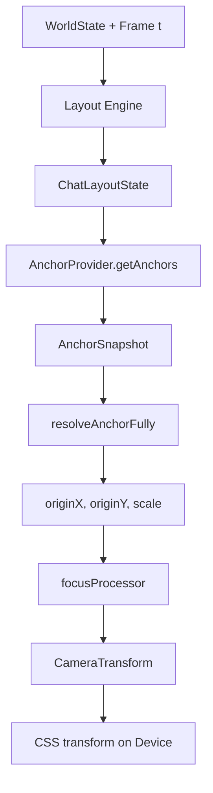

# Anchor & Camera System

> **Complete Guide to Semantic Camera Targeting in Tokovo**

---

## Overview

The anchor system allows camera operations to target **semantic regions** (like "lastMessage", "profile", "inputArea") instead of raw pixel coordinates. This creates resilient, maintainable camera scripts.

```
DSL Event            Compiled Effect         Anchor Resolution         Camera Transform
───────────────────────────────────────────────────────────────────────────────────────
camera.focus(at, {   CameraEffect {          AnchorSnapshot {          { originX: 0.15,
  target: "profile"    type: "focus",          "profile": {x,y,w,h}     originY: 0.08,
})                     anchorId: "profile"   }                           scale: 1.8 }
                     }                            ↓
                                             resolveAnchorFully()
```

---

## Architecture

### Key Components

| Component | Location | Purpose |
|-----------|----------|---------|
| **AnchorProvider** | `apps-*/runtime/adapters/anchors.ts` | App defines anchors |
| **AnchorSnapshot** | `device-camera/anchors/types.ts` | Frame-by-frame anchor rects |
| **Anchor Resolver** | `device-camera/anchors/resolver.ts` | Name → pixel rect → normalized |
| **Effect Processors** | `device-camera/processors/index.ts` | Apply camera effects |
| **Camera Engine** | `renderer/engines/useCameraEngine.ts` | Orchestrates per frame |
| **Layout Engine** | `renderer/engines/useLayoutEngine.ts` | Computes semantic regions |

### Data Flow (Per Frame)



---

## How Apps Define Anchors

### Step 1: Create AnchorProvider

```typescript
// packages/apps-whatsapp/src/runtime/adapters/anchors.ts

import { AnchorProvider, AnchorSnapshot, ChatLayoutState } from "@tokovo/core";

export const WhatsAppAnchors: AnchorProvider = {
    appId: "app_whatsapp",
    
    // Static framing configuration per anchor
    framing: {
        profile: {
            anchorPoint: { x: 0.5, y: 0.5 },  // Center of rect
            paddingPx: 50,
            targetFill: 0.4   // Fill 40% of viewport
        },
        lastMessage: {
            anchorPoint: { x: 0.5, y: 0.5 },
            paddingPx: 40,
            targetFill: 0.6
        }
    },
    
    // Dynamic extraction - called every frame
    getAnchors(world, layout, deviceId): AnchorSnapshot {
        const chatLayout = layout as ChatLayoutState;
        const anchors: Record<string, LayoutRect> = {};
        
        // Map semantic regions from layout
        if (chatLayout?.semantic?.regions) {
            for (const [key, region] of Object.entries(chatLayout.semantic.regions)) {
                anchors[key] = region.rect;
            }
        }
        
        return { anchors, deviceId, appId: "app_whatsapp" };
    }
};
```

### Step 2: Register Provider

```typescript
// In plugin registration
import { registerAnchorProvider } from "@tokovo/core";
import { WhatsAppAnchors } from "./runtime/adapters/anchors";

registerAnchorProvider(WhatsAppAnchors);
```

### Step 3: Layout Must Provide Regions

The Layout Engine must compute `semantic.regions`:

```typescript
// In layout strategy
return {
    semantic: {
        regions: {
            "header": { rect: { x: 0, y: 144, width: 393, height: 126 }, tag: "header" },
            "profile": { rect: { x: 40, y: 160, width: 90, height: 90 }, tag: "profile" },
            "lastMessage": { rect: { x: 36, y: 450, width: 321, height: 66 }, tag: "message" },
            "inputArea": { rect: { x: 0, y: 696, width: 393, height: 156 }, tag: "input" }
        }
    },
    meta: {
        lastMessageId: "msg_123"
    }
};
```

---

## Camera DSL Usage

### Focus (One-Shot Zoom)

```typescript
// Zoom to profile picture and hold
camera.focus(30, { target: "profile", zoom: 1.5, duration: 20 });

// Zoom to last message
camera.anchorFocus(60, "lastMessage", "message");
```

### Track (Smooth Follow)

```typescript
// Follow typing indicator with smooth camera
camera.anchorTrack(90, "typingIndicator", 60, 0.18);
// Args: (at, anchor, duration, smoothing)
// smoothing: 0.08=slow, 0.18=operator, 0.35=snappy
```

### Reset

```typescript
// Return to neutral
camera.reset(150, 30);  // at frame 150, over 30 frames
```

---

## Framing Configuration

### AnchorFraming Properties

| Property | Type | Default | Description |
|----------|------|---------|-------------|
| `anchorPoint` | `{x,y}` | `(0.5, 0.5)` | Where in rect to focus (0-1 normalized) |
| `paddingPx` | `number` | `20` | Padding around target in pixels |
| `targetFill` | `number` | `0.6` | How much of viewport target should fill |

### How anchorPoint Works

```
anchorPoint: { x: 0.5, y: 0.5 }  → Focus on CENTER of rect
anchorPoint: { x: 0.0, y: 0.0 }  → Focus on TOP-LEFT of rect
anchorPoint: { x: 1.0, y: 1.0 }  → Focus on BOTTOM-RIGHT of rect
anchorPoint: { x: 0.2, y: 0.15 } → Focus on left-ish, top-ish (profile avatar)
```

---

## Resolution Pipeline

### 1. Resolve Anchor Name → Rect

```typescript
// resolver.ts
function resolveAnchorWithFallback(
    anchorName: string,
    anchors: Record<string, Rect>,
    viewport?: { width, height }
): ResolvedAnchor
```

**Fallback Chains:**
```typescript
const FALLBACK_CHAINS = {
    lastMessage: ["lastMessage", "content", "app", "device"],
    header: ["header", "app", "device"],
    profile: ["profile", "header", "app", "device"],
};
```

### 2. Rect → Normalized Origin

```typescript
function anchorToOrigin(resolved, framing, viewport): { originX, originY }

// Example:
// rect = { x: 40, y: 100, width: 90, height: 90 }
// framing = { anchorPoint: { x: 0.5, y: 0.5 } }
// viewport = { width: 393, height: 852 }

pointX = 40 + 90 * 0.5 = 85
pointY = 100 + 90 * 0.5 = 145
originX = 85 / 393 = 0.216
originY = 145 / 852 = 0.170
```

### 3. Calculate Scale

```typescript
function calculateFillScale(rect, viewport, targetFill): number

// If rect fills 20% of viewport and targetFill is 0.6:
// scale = 0.6 / 0.2 = 3.0 (clamped to 2.5 max)
```

---

## AppSurface Interaction

`AppSurface` scales content from logical to physical pixels:

```
Logical (Design): 393 × 852  (CSS pixels, 1x)
Physical (Render): 1290 × 2796  (3x scale)
```

**Impact on Anchors:**
- Layout computes rects in **logical** coordinates
- Camera operates on **normalized** 0-1 coordinates
- Final transform applied at physical resolution

So anchors work correctly regardless of scale factor.

---

## Adding a New Anchor

### Example: Focus on Profile Picture

**Step 1: Add rect to Layout Strategy**

```typescript
// packages/apps-whatsapp/src/runtime/layout/chat.ts

export function computeChatLayout(state, config): ChatLayoutState {
    const regions: Record<string, SemanticRegion> = {};
    
    // Header profile avatar
    regions["profile"] = {
        rect: {
            x: config.avatarMargin,          // ~40
            y: config.statusBarHeight + 16,  // ~160
            width: config.avatarSize,        // ~90
            height: config.avatarSize        // ~90
        },
        tag: "profile"
    };
    
    // ... other regions
    return { semantic: { regions }, ... };
}
```

**Step 2: Add framing to AnchorProvider**

```typescript
// packages/apps-whatsapp/src/runtime/adapters/anchors.ts

framing: {
    profile: {
        anchorPoint: { x: 0.5, y: 0.5 },  // Center on avatar
        paddingPx: 30,
        targetFill: 0.5  // Fill 50% of viewport
    }
}
```

**Step 3: Use in DSL**

```typescript
// In episode
camera.focus(30, { target: "profile" });
// Camera zooms to center profile picture
```

---

## Director-Lite (Auto Camera)

When no manual camera events are active, Director-Lite extracts "signals" from events and auto-focuses:

```typescript
// Signals:
// - MESSAGE_RECEIVED → focus lastMessage
// - TYPING_START → focus typingIndicator
// - NOTIFICATION → focus notification

// In useCameraEngine.ts
if (directorEnabled && activeManualEffects.length === 0) {
    // Extract signals, derive focus
}
```

---

## Debugging

### Check Anchor Snapshot

In browser console during dev:
```javascript
window.__TOKOVO_DEBUG_ANCHORS
// Shows current anchor rects
```

### Verify Layout Regions

Add logging to `getAnchors()`:
```typescript
console.log("[Anchors]", JSON.stringify(anchors, null, 2));
```

### Common Issues

| Issue | Cause | Fix |
|-------|-------|-----|
| Focus falls back to device | Anchor not in snapshot | Add rect to layout regions |
| Focus point is wrong | Bad anchorPoint config | Adjust framing.anchorPoint |
| Zoom too aggressive | targetFill too small | Increase targetFill (0.3 → 0.6) |
| Anchor undefined | Provider not registered | Call `registerAnchorProvider()` |

---

## Troubleshooting Guide (Gotchas)

> This section documents common issues encountered when setting up the anchor system.
> Each issue is based on real debugging sessions.

### Critical Setup Checklist ✅

**For anchor focusing to work, ALL of these must be in place:**

```
1. AnchorProvider REGISTERED     → registerAnchorProvider(WhatsAppAnchors)
2. LayoutStrategy REGISTERED     → LayoutRegistry.register({ appId, viewKind, computeLayout })
3. appState.viewMode SET         → world.appState[appId] = { viewMode: "CHAT" }
4. Layout has semantic.regions   → return { semantic: { regions: { profile: { rect } } } }
5. Event type matching           → DSL → lowering → reducer → processor chain
```

---

### Issue 1: `anchors: []` (Empty Anchor Snapshot)

**Symptom:**
```
[focusProcessor] anchors: Array []
[focusProcessor] profile in snapshot? false
```

**Root Causes (check in order):**

1. **AnchorProvider not registered**
   ```typescript
   // ❌ Provider defined but NOT registered
   export const WhatsAppAnchors: AnchorProvider = { ... };
   
   // ✅ Must register in app's index.ts
   import { registerAnchorProvider } from "@tokovo/core";
   registerAnchorProvider(WhatsAppAnchors);
   ```

2. **Layout returns no semantic.regions**
   ```typescript
   // ❌ layout.kind = "TRANSITION" (no semantic data)
   // ✅ layout.kind = "CHAT" (has semantic.regions)
   ```

3. **LayoutStrategy not registered**
   ```typescript
   // ✅ Must register layout strategy
   LayoutRegistry.register({
       appId: APP_IDS.WHATSAPP,
       viewKind: "CHAT",
       computeLayout: computeChatLayout,  // Returns ChatLayoutState with semantic
   });
   ```

4. **appState.viewMode not set**
   ```typescript
   // ❌ Episode world has no appState
   // ✅ Episode preparer must set:
   world.appState = {
       "app_whatsapp": { viewMode: "CHAT", conversationId: "dm_john" }
   };
   ```

---

### Issue 2: Focus works but wrong position

**Symptom:** Camera zooms but centers on wrong spot (e.g., center instead of profile)

**Root Cause:** Fallback to framing.anchorPoint instead of actual rect

**Debug:**
```
[focusProcessor] RESOLVED: { originX: 0.2, originY: 0.15, isFallback: true }
```

When `isFallback: true`, the resolver used framing coordinates instead of actual rect.

**Fix:** Ensure `layout.semantic.regions` contains the anchor:
```typescript
// In layout strategy
regions["profile"] = {
    rect: { x: 40, y: 160, width: 90, height: 90 },
    tag: "profile"
};
```

---

### Issue 3: Event type mismatch (processor not found)

**Symptom:**
```
[processActiveEffects] Looking up processor for type="ANCHOR_FOCUS", found=false
```

**Root Cause:** Event type from lowering doesn't match processor registry

**Event Type Flow:**
```
DSL:      camera.focus("profile")         → type: "FOCUS"
Lowering: cameraV2Lowering()              → type: "focus"      ✅
Reducer:  creates FocusEffect             → type: "focus"      ✅
Processor: processorRegistry.get("focus") → ✅ Found
```

**The lowering handler must output lowercase types:**
```typescript
// lowering/handler.ts
case "FOCUS":
    return [{ ...baseEvent, type: "focus", anchorId: payload?.anchorId }];
```

---

### Issue 4: anchorId not reaching processor

**Symptom:** Effect created but anchorId is "device"

**Root Cause:** Field name mismatch between DSL → lowering → reducer

**The Pipeline:**
```
DSL:      { anchorId: "profile" }
Lowering: { anchorId: payload?.anchorId ?? payload?.anchor }
Reducer:  { anchorId: event.anchorId ?? event.anchor ?? "device" }
```

Each layer must consistently read/write `anchorId`:
```typescript
// reducer/index.ts
case "focus": {
    const effect: FocusEffect = {
        anchorId: (event.anchorId as string) ?? (event.anchor as string) ?? "device",
        // ...
    };
}
```

---

### Issue 5: Layout kind is TRANSITION instead of CHAT

**Symptom:**
```
[WhatsAppAnchors.getAnchors] layout kind=TRANSITION, hasSemantic=false
```

**Root Cause:** useLayoutEngine doesn't know to use CHAT layout

**Fix:** Set `appState.viewMode` in episode world:
```typescript
// packages/compiler/src/v2/prepare.ts - buildInitialWorld()
const appState: Record<string, any> = {};
for (const device of ir.devices) {
    if (device.app) {
        appState[device.app] = {
            viewMode: hasConversations ? "CHAT" : "FEED",
            conversationId: firstConversation?.id,
        };
    }
}
return { ...world, appState };
```

---

## Complete App Setup Example

For a new app to support camera anchors:

```typescript
// 1. Define Anchor Provider
// packages/apps-myapp/src/runtime/adapters/anchors.ts
export const MyAppAnchors: AnchorProvider = {
    appId: "app_myapp",
    framing: {
        avatar: { anchorPoint: { x: 0.5, y: 0.5 }, targetFill: 0.4, paddingPx: 30 },
        content: { anchorPoint: { x: 0.5, y: 0.5 }, targetFill: 0.6, paddingPx: 40 },
    },
    getAnchors(world, layout, deviceId) {
        const appLayout = layout as MyAppLayoutState;
        if (!appLayout?.semantic?.regions) {
            return { anchors: {}, deviceId, appId: "app_myapp" };
        }
        const anchors: Record<string, LayoutRect> = {};
        for (const [key, region] of Object.entries(appLayout.semantic.regions)) {
            anchors[key] = region.rect;
        }
        return { anchors, deviceId, appId: "app_myapp" };
    }
};

// 2. Define Layout Strategy
// packages/apps-myapp/src/layout.ts
export function computeMyAppLayout(ctx: LayoutContext): MyAppLayoutState {
    return {
        kind: "MYAPP",
        semantic: {
            regions: {
                avatar: { rect: { x: 40, y: 150, width: 80, height: 80 }, tag: "avatar" },
                content: { rect: { x: 20, y: 300, width: 353, height: 400 }, tag: "content" },
            }
        },
        meta: {}
    };
}

// 3. Register in index.ts (SIDE EFFECTS)
// packages/apps-myapp/src/index.ts
import { registerAnchorProvider, LayoutRegistry, APP_IDS } from "@tokovo/core";
import { MyAppAnchors } from "./runtime/adapters/anchors";
import { computeMyAppLayout } from "./layout";

// Register anchor provider
registerAnchorProvider(MyAppAnchors);

// Register layout strategy
LayoutRegistry.register({
    appId: "app_myapp",
    viewKind: "MYAPP",
    computeLayout: computeMyAppLayout,
});

// 4. Episodes must have appState.viewMode
// The episode preparer (prepare.ts) sets this automatically
// for apps with conversations
```

---

## Type Reference

```typescript
interface AnchorProvider {
    appId: string;
    framing: Record<string, AnchorFraming>;
    getAnchors(world: unknown, layout: unknown, deviceId: string): AnchorSnapshot;
}

interface AnchorFraming {
    anchorPoint: { x: number; y: number };
    paddingPx?: number;
    targetFill?: number;
}

interface AnchorSnapshot {
    anchors: Record<string, Rect>;
    deviceId: string;
    appId: string;
}

interface Rect {
    x: number;      // Pixels from left
    y: number;      // Pixels from top
    width: number;
    height: number;
}
```

---

## Files Reference

| File | Description |
|------|-------------|
| [device-camera/anchors/types.ts](file:///Users/nishit.gupta/personal/tokovo/packages/device-camera/src/anchors/types.ts) | Core anchor types |
| [device-camera/anchors/registry.ts](file:///Users/nishit.gupta/personal/tokovo/packages/device-camera/src/anchors/registry.ts) | Provider registry |
| [device-camera/anchors/resolver.ts](file:///Users/nishit.gupta/personal/tokovo/packages/device-camera/src/anchors/resolver.ts) | Resolution logic |
| [device-camera/processors/index.ts](file:///Users/nishit.gupta/personal/tokovo/packages/device-camera/src/processors/index.ts) | Effect processors |
| [device-camera/lowering/handler.ts](file:///Users/nishit.gupta/personal/tokovo/packages/device-camera/src/lowering/handler.ts) | DSL → Runtime lowering |
| [device-camera/reducer/index.ts](file:///Users/nishit.gupta/personal/tokovo/packages/device-camera/src/reducer/index.ts) | Event → Effect reducer |
| [renderer/engines/useCameraEngine.ts](file:///Users/nishit.gupta/personal/tokovo/packages/renderer/src/engines/useCameraEngine.ts) | Per-frame orchestration |
| [core/engine/handlers/camera.ts](file:///Users/nishit.gupta/personal/tokovo/packages/core/src/engine/handlers/camera.ts) | Engine camera handler |
| [compiler/v2/prepare.ts](file:///Users/nishit.gupta/personal/tokovo/packages/compiler/src/v2/prepare.ts) | Episode world builder |
| [apps-whatsapp/src/index.ts](file:///Users/nishit.gupta/personal/tokovo/packages/apps-whatsapp/src/index.ts) | WhatsApp registrations |
| [apps-whatsapp/runtime/adapters/anchors.ts](file:///Users/nishit.gupta/personal/tokovo/packages/apps-whatsapp/src/runtime/adapters/anchors.ts) | WhatsApp anchors |
