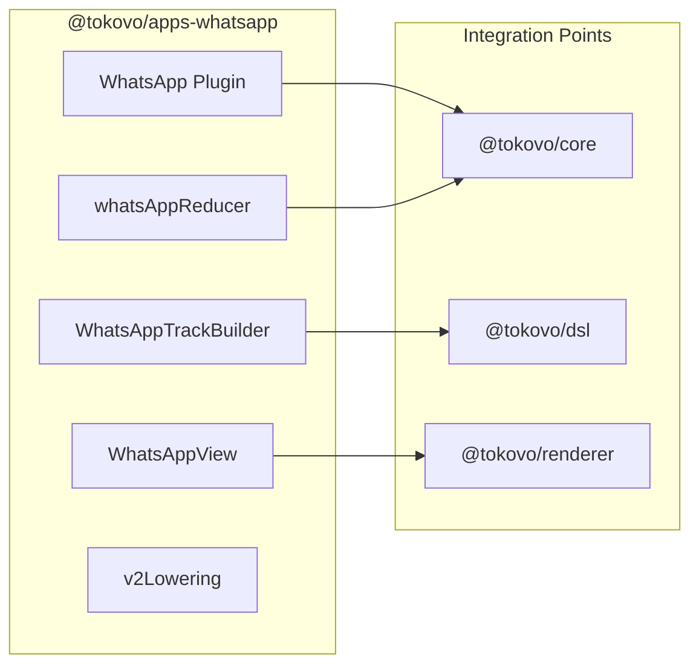
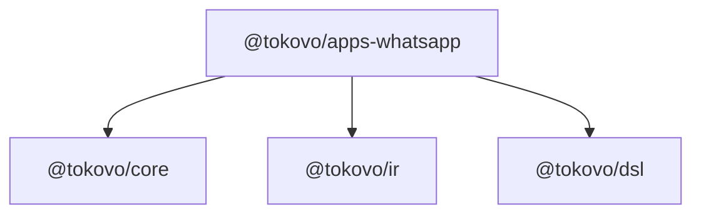

# @tokovo/apps-whatsapp

> **WhatsApp plugin. Full messaging simulation with typing, read receipts, groups, and media.**

---

## Overview

`@tokovo/apps-whatsapp` provides everything needed to simulate WhatsApp:



---

## Installation

```bash
pnpm add @tokovo/apps-whatsapp
```

---

## Quick Start

```typescript
import { WhatsApp, WhatsAppTrackBuilder } from "@tokovo/apps-whatsapp";
import { PluginManager } from "@tokovo/core";
import { episode } from "@tokovo/dsl";

// Register plugin
PluginManager.register(WhatsApp);

// Create episode with WhatsApp
let order = 0;
const getOrder = () => order++;

const ir = episode("whatsapp-demo", { fps: 30, duration: "30s" })
    .device("phone", "iphone16", {
        app: "app_whatsapp",
        conversations: [
            { id: "dm_alex", name: "Alex", avatar: "/avatars/alex.png" }
        ]
    })
    .track("app_whatsapp",
        () => new WhatsAppTrackBuilder(30, "phone", "dm_alex", getOrder),
        wa => {
            wa.at("2s").receive("Alex", "Hey! How are you?");
            wa.span("4s", "6s").typing("me");
            wa.at("6s").send("I'm good! You?");
            wa.at("8s").receive("Alex", "Great! 🎉");
            wa.at("10s").read("Alex");
        }
    )
    .build();
```

---

## WhatsAppTrackBuilder API

### Constructor

```typescript
new WhatsAppTrackBuilder(
    fps: number,
    deviceId: string,
    conversationId: string,
    getOrder: () => number
)
```

---

### Message Methods

#### receive(sender, text, options?)

Receive a message from contact:

```typescript
wa.at("2s").receive("Alex", "Hello!");

// With options
wa.at("2s").receive("Alex", "Hello!", {
    media: { type: "image", url: "/images/photo.jpg" },
    replyTo: "msg_123"
});
```

#### send(text, options?)

Send a message (from "me"):

```typescript
wa.at("5s").send("Hi there!");

// With media
wa.at("5s").send("Check this out", {
    media: { type: "image", url: "/images/cat.jpg" }
});
```

---

### Typing Indicator

```typescript
// Show typing for duration
wa.span("3s", "5s").typing("me");      // You typing
wa.span("3s", "5s").typing("Alex");    // Contact typing
```

---

### Read Receipts

```typescript
// Mark messages as read
wa.at("10s").read("Alex");   // Alex reads your messages
wa.at("10s").read("me");     // You read their messages (blue ticks)
```

---

### Online Status

```typescript
wa.at("0s").online("Alex");
wa.at("30s").offline("Alex");
wa.at("15s").lastSeen("Alex", "today at 2:30 PM");
```

---

### Voice Messages

```typescript
wa.at("5s").voiceMessage("Alex", {
    duration: "0:32",
    waveform: [0.2, 0.5, 0.8, 0.3, 0.6]
});
```

---

### Group Chat

```typescript
// Configure group in device
.device("phone", "iphone16", {
    app: "app_whatsapp",
    conversations: [
        { 
            id: "group_bros", 
            name: "The Bros", 
            type: "group",
            participants: ["Alex", "Sam", "Jordan"]
        }
    ]
})

// Use in track
.track("app_whatsapp",
    () => new WhatsAppTrackBuilder(30, "phone", "group_bros", getOrder),
    wa => {
        wa.at("2s").receive("Alex", "What's up bros!");
        wa.at("4s").receive("Sam", "Not much, you?");
        wa.at("6s").send("Let's hang out!");
    }
)
```

---

## Event Types

| Event Type | Description |
|------------|-------------|
| `WHATSAPP_MESSAGE` | New message (send/receive) |
| `WHATSAPP_TYPING_START` | Start typing indicator |
| `WHATSAPP_TYPING_STOP` | Stop typing indicator |
| `WHATSAPP_READ` | Read receipts |
| `WHATSAPP_ONLINE` | Online status change |
| `WHATSAPP_DELETE` | Delete message |

---

## WhatsApp Plugin Contract

```typescript
const WhatsApp: TokovoPlugin = {
    appId: "app_whatsapp",
    name: "WhatsApp",
    
    // UI Component
    appView: WhatsAppView,
    
    // State reducer
    reducer: whatsAppReducer,
    
    // V2 lowering for compiler
    v2Lowering: {
        eventTypes: [
            "WHATSAPP_MESSAGE",
            "WHATSAPP_TYPING_START",
            "WHATSAPP_TYPING_STOP",
            "WHATSAPP_READ",
        ],
        lower: (event, ctx) => ({ ... })
    },
    
    // Notification adapter
    notificationAdapter: whatsAppNotificationAdapter,
    
    // Semantic anchors
    anchors: [
        { id: "message[last]", resolver: findLastMessage },
        { id: "input", resolver: findInputField },
    ],
    
    // Sound effects
    sounds: [
        { id: "message_sent", url: "/sounds/wa-sent.mp3" },
        { id: "message_received", url: "/sounds/wa-received.mp3" },
    ],
};
```

---

## WorldState Structure

```typescript
// world.appState["app_whatsapp"]
{
    activeConversation: "dm_alex",
    view: "chat"  // "list" | "chat" | "profile"
}

// world.conversations["dm_alex"]
{
    id: "dm_alex",
    name: "Alex",
    avatar: "/avatars/alex.png",
    type: "dm",
    messages: [
        {
            id: "msg_1",
            text: "Hey! How are you?",
            sender: "Alex",
            timestamp: Date,
            status: "delivered" | "read",
            media?: { type: "image", url: string }
        }
    ],
    typing: null | { sender: "Alex", startedAt: number },
    unreadCount: 0,
    online: true,
    lastSeen: "online"
}
```

---

## Dependencies



---

## Complete Example

```typescript
import { episode } from "@tokovo/dsl";
import { WhatsAppTrackBuilder } from "@tokovo/apps-whatsapp";

let order = 0;
const getOrder = () => order++;

export const conversationEpisode = episode("drama-conversation", {
    fps: 30,
    duration: "45s",
    title: "The Confrontation"
})
    .device("phone", "iphone16", {
        app: "app_whatsapp",
        conversations: [
            { id: "dm_sarah", name: "Sarah 💕", avatar: "/avatars/sarah.png" }
        ]
    })
    .track("app_whatsapp",
        () => new WhatsAppTrackBuilder(30, "phone", "dm_sarah", getOrder),
        wa => {
            // Opening
            wa.at("2s").receive("Sarah 💕", "We need to talk...");
            
            // Tension
            wa.span("4s", "8s").typing("me");
            wa.at("8s").send("What's wrong?");
            
            // The reveal
            wa.span("10s", "12s").typing("Sarah 💕");
            wa.at("12s").receive("Sarah 💕", "I saw your Insta story 👀");
            wa.at("14s").receive("Sarah 💕", "Who was that??");
            
            // Response
            wa.span("16s", "20s").typing("me");
            wa.at("20s").send("That's my cousin! She's visiting from out of town 😅");
            
            // Relief
            wa.at("24s").receive("Sarah 💕", "Omg I'm so sorry 😂😂");
            wa.at("26s").receive("Sarah 💕", "I totally overreacted");
            wa.at("28s").send("Haha it's fine babe ❤️");
            
            // Read
            wa.at("30s").read("Sarah 💕");
        }
    )
    .camera(cam => {
        cam.at("0s").set({ scale: 1 });
        cam.at("12s").animate({ scale: 1.15, duration: "0.5s" });  // Drama zoom
        cam.at("24s").animate({ scale: 1, duration: "0.5s" });     // Relief
    })
    .build();
```
