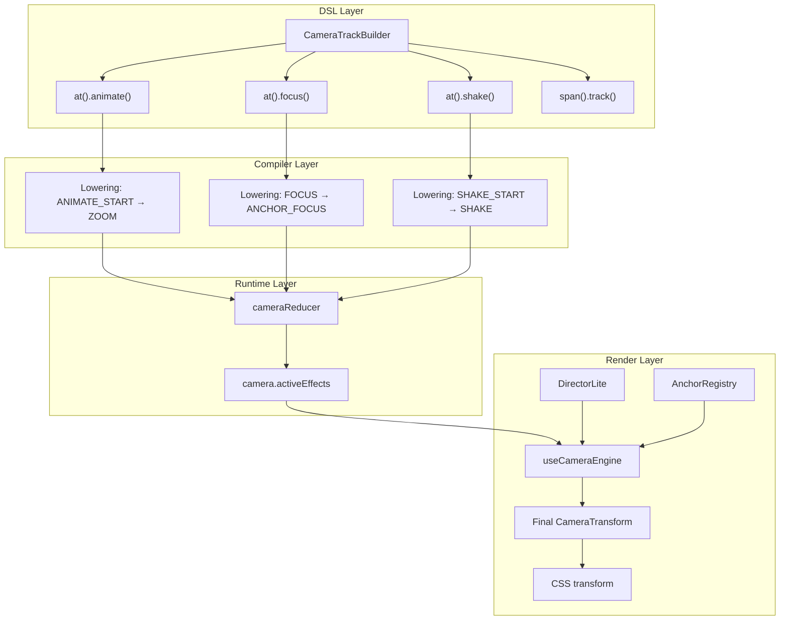

# Camera System Architecture

> Enterprise-grade cinematic camera system for Tokovo video generation.

## System Overview



---

## Current File Locations

| Component | Location | Purpose |
|-----------|----------|---------|
| **CameraController** | `core/src/camera/index.ts` | Effect application, easing |
| **cameraReducer** | `core/src/camera/reducer.ts` | Store effects in state |
| **DirectorLite** | `core/src/director-lite/*` | Auto-camera from signals |
| **AnchorRegistry** | `core/src/anchors/registry.ts` | Semantic anchor resolution |
| **useCameraEngine** | `renderer/src/engines/useCameraEngine.ts` | Frame-by-frame transform |
| **CameraTrackBuilder** | `dsl/src/v2/camera-track.ts` | DSL API |
| **Lowering** | `compiler/src/v2/lowering.ts` | DSL → Runtime events |

---

## Two Camera Modes

### 1. Manual Camera (God Mode)

Full control via `.camera()` track in episode definition.

```typescript
.camera(cam => {
    // Exact values
    cam.at("1s").set({ scale: 1.2, x: -40, y: 20, rotation: 5 });
    cam.at("2s").animate({ scale: 1.5, duration: "0.5s", easing: "cinematic" });
    cam.at("5s").shake({ intensityX: 8, intensityY: 6, decay: 0.85, duration: "0.4s" });
    
    // Semantic anchors
    cam.at("3s").focus("lastMessage", { scale: 1.2, duration: "0.4s" });
    cam.span("10s", "15s").track("inputArea", { scale: 1.05 });
    
    // Reset
    cam.at("20s").reset({ duration: "1s" });
})
```

**Data Flow:**
```
DSL → Lowering → cameraReducer → camera.activeEffects → useCameraEngine → CSS
```

---

### 2. DirectorLite (Auto Camera)

Automatic camera based on event signals. No `.camera()` track needed.

**When active:** No manual camera effects in timeline.

```typescript
// DirectorLite watches for signals:
type SignalType = 
  | "TypingStarted" 
  | "NewMessage" 
  | "MessageRead"
  | "CallIncoming";

// And generates effects automatically:
type DerivedEffect = 
  | "FocusAnchor"  // Semantic anchor focus
  | "PushIn"       // Zoom to target
  | "PullBack"     // Reveal shot
  | "Shake";       // Impact shake
```

**Data Flow:**
```
Events → extractSignals() → deriveDirectorEffects() → DerivedCameraEffect → applyDirectorEffects() → CSS
```

**Priority:** Manual camera always overrides DirectorLite.

---

## Anchor System

### How Apps Provide Anchors

```typescript
// apps-whatsapp/src/runtime/adapters/anchors.ts
export const WhatsAppAnchors: AnchorProvider = {
    appId: "app_whatsapp",
    
    // Static framing config per anchor
    framing: {
        lastMessage: { anchorPoint: { x: 0.5, y: 0.5 }, targetFill: 0.6 },
        inputArea: { anchorPoint: { x: 0.5, y: 0.8 }, targetFill: 0.9 },
        header: { anchorPoint: { x: 0.5, y: 0.15 }, targetFill: 0.9 },
    },
    
    // Dynamic extraction from layout
    getAnchors(world, layout, deviceId): AnchorSnapshot {
        const chatLayout = layout as ChatLayoutState;
        const anchors = {};
        
        // Map semantic regions to rects
        for (const [key, region] of Object.entries(chatLayout.semantic.regions)) {
            anchors[key] = region.rect;
        }
        
        // Computed aliases
        if (chatLayout.meta?.lastMessageId) {
            anchors["lastMessage"] = regions[chatLayout.meta.lastMessageId].rect;
        }
        
        return { anchors, deviceId, appId: "app_whatsapp" };
    }
};
```

### How Camera Resolves Anchors

```typescript
// In useCameraEngine.ts
const anchorSnapshot = getAnchorsForApp(appId, world, layout, deviceId);
// anchorSnapshot = { anchors: { lastMessage: {x, y, w, h}, inputArea: {...} } }

const resolved = resolveAnchorWithFallback("lastMessage", anchorSnapshot.anchors);
// resolved = { rect: {x, y, width, height}, anchor: "lastMessage" }

// Convert rect center to transform origin
const originX = (resolved.rect.x + resolved.rect.width / 2) / viewportWidth;
const originY = (resolved.rect.y + resolved.rect.height / 2) / viewportHeight;
```

---

## Remotion Compatibility

All animation follows Remotion's frame-based pattern:

```typescript
// Core principle: animation = f(frame)
const frame = useCurrentFrame(); // or `t` in our engine

// Calculate progress (0 to 1)
const progress = (t - startFrame) / (endFrame - startFrame);
const clampedProgress = Math.max(0, Math.min(1, progress));

// Apply easing
const easedProgress = applyEasing(clampedProgress, "ease-out");

// Interpolate values
const scale = lerp(1, targetScale, easedProgress);
const translateX = lerp(0, targetX, easedProgress);

// Build transform
return {
    scale,
    translateX,
    translateY,
    originX,
    originY,
};
```

**Key Rules:**
1. Never use CSS transitions
2. Never use useEffect for animation
3. Always derive from `useCurrentFrame()`
4. Results must be deterministic (same frame → same output)

---

## Effect Types

| Type | DSL Method | Lowered To | Reducer Case | Description |
|------|------------|------------|--------------|-------------|
| Set | `set()` | `SET_VIEW` | `CUT` | Instant camera change |
| Zoom | `animate()` | `ZOOM` | `ZOOM` | Scale + translate |
| Focus | `focus()` | `ANCHOR_FOCUS` | `ANCHOR_FOCUS` | Semantic anchor focus |
| Track | `track()` | `ANCHOR_TRACK` | `ANCHOR_TRACK` | Continuous follow |
| Shake | `shake()` | `SHAKE` | `SHAKE` | Screen shake |
| Reset | `reset()` | `RESET` | `RESET` | Return to neutral |

---

## Current Issues (Why Refactor)

1. **Missing Processing** - ZOOM/SHAKE effects stored but not applied
2. **Inconsistent Types** - `effect.type` vs top-level `type`
3. **Case Mismatch** - Reducer uses "focus", engine checks "ANCHOR_FOCUS"
4. **Scattered Code** - 200+ lines of duplicated logic in engine
5. **No Registry** - Adding effects requires touching multiple files

---

## Proposed Package: `@tokovo/device-camera`

### Why New Package?

1. **Growing Complexity** - 7 files in core + 6 in director-lite + engine + anchors
2. **Self-Contained** - Camera doesn't need core's other features
3. **Consistency** - Matches device-keyboard, device-calls, device-notifications
4. **Plugin Pattern** - Camera becomes a first-class plugin

### Package Structure

```
packages/device-camera/
├── src/
│   ├── types/
│   │   ├── effect.ts          # CameraEffect union types
│   │   ├── transform.ts       # CameraTransform
│   │   └── anchor.ts          # Anchor types
│   │
│   ├── reducer/
│   │   └── index.ts           # cameraReducer
│   │
│   ├── director-lite/
│   │   ├── derive.ts          # deriveDirectorEffects
│   │   ├── signals.ts         # extractSignals
│   │   ├── rules.ts           # ViralDramaV1 strategy
│   │   └── types.ts           # DirectorSignal, etc.
│   │
│   ├── processors/
│   │   ├── index.ts           # Registry + processActiveEffects
│   │   ├── types.ts           # EffectProcessor interface
│   │   ├── zoom.ts            # ZoomProcessor
│   │   ├── shake.ts           # ShakeProcessor
│   │   ├── focus.ts           # FocusProcessor
│   │   ├── track.ts           # TrackProcessor
│   │   └── reset.ts           # ResetProcessor
│   │
│   ├── anchors/
│   │   ├── registry.ts        # AnchorRegistry
│   │   └── resolver.ts        # resolveAnchorWithFallback
│   │
│   ├── dsl/
│   │   └── track-builder.ts   # CameraTrackBuilder
│   │
│   ├── lowering/
│   │   └── handler.ts         # Camera event lowering
│   │
│   ├── utils/
│   │   ├── easing.ts          # applyEasing
│   │   ├── math.ts            # lerp, seededRandom
│   │   └── interpolate.ts     # Remotion-style helpers
│   │
│   ├── plugin.ts              # DeviceCameraPlugin
│   └── index.ts               # Public exports
│
├── package.json
├── tsconfig.json
└── README.md
```

---

## Migration Plan

### Phase 1: Create Package Shell
- Create `packages/device-camera/` structure
- Set up package.json with dependencies
- Configure tsconfig.json

### Phase 2: Move Types
- Move camera types from `core/types/`
- Create unified `CameraEffect` union
- Move anchor types

### Phase 3: Move Director-Lite
- Move `core/director-lite/*` → `device-camera/director-lite/`
- Update imports

### Phase 4: Create Processors
- Implement effect processor registry
- Create individual processors
- Move logic from CameraController

### Phase 5: Move Reducer
- Move `core/camera/reducer.ts`
- Standardize effect structure

### Phase 6: Move Engine Logic
- Move anchor resolution from renderer
- Simplify useCameraEngine to use package

### Phase 7: Move DSL
- Move CameraTrackBuilder from dsl
- Update dsl package to re-export

### Phase 8: Update Imports
- Update all packages to use new imports
- Deprecate old locations

---

## API After Refactor

```typescript
// In episode
import { CameraTrackBuilder } from "@tokovo/device-camera";

// In renderer
import { 
    processActiveEffects,
    deriveDirectorEffects,
    resolveAnchorWithFallback,
} from "@tokovo/device-camera";

// Plugin registration
import { DeviceCameraPlugin } from "@tokovo/device-camera";
```

---

# Enterprise Coding Patterns

## Pattern 1: Discriminated Union Types (Type Safety)

**Why:** Compile-time exhaustiveness checking. Add new effect = TypeScript forces you to handle it everywhere.

```typescript
// types/effect.ts

export type CameraEffectType = "zoom" | "shake" | "focus" | "track" | "reset";

// Discriminated union - each type has unique fields
export type CameraEffect = 
  | ZoomEffect 
  | ShakeEffect 
  | FocusEffect 
  | TrackEffect 
  | ResetEffect;

export interface ZoomEffect {
    type: "zoom";  // Discriminant
    id: string;
    startFrame: number;
    endFrame: number;
    targetScale: number;
    targetX?: number;
    targetY?: number;
    easing?: EasingType;
}

export interface ShakeEffect {
    type: "shake";  // Discriminant
    id: string;
    startFrame: number;
    endFrame: number;
    intensity: number;
    frequency?: number;
    decay?: number;
}

// Usage: TypeScript knows exact shape based on type
function handleEffect(effect: CameraEffect) {
    switch (effect.type) {
        case "zoom":
            // TypeScript knows: effect.targetScale exists
            console.log(effect.targetScale);
            break;
        case "shake":
            // TypeScript knows: effect.intensity exists
            console.log(effect.intensity);
            break;
        // If you miss a case, TypeScript errors!
    }
}
```

---

## Pattern 2: Pure Functions (Remotion Compatibility)

**Why:** Deterministic rendering. Same frame → same output. Scrubbable timeline.

```typescript
// processors/zoom.ts

/**
 * PURE FUNCTION - No side effects, no state
 * 
 * Input:  (t, effect, currentTransform)
 * Output: newTransform
 * 
 * Same inputs ALWAYS produce same outputs.
 */
export function processZoom(ctx: EffectProcessorContext): CameraTransform {
    const { t, effect, transform } = ctx;
    const e = effect as ZoomEffect;
    
    // 1. Calculate progress (0 → 1)
    const duration = e.endFrame - e.startFrame;
    const rawProgress = (t - e.startFrame) / duration;
    const progress = Math.max(0, Math.min(1, rawProgress));
    
    // 2. Apply easing
    const easedProgress = applyEasing(progress, e.easing ?? "ease-out");
    
    // 3. Interpolate values
    const scale = lerp(1, e.targetScale, easedProgress);
    const translateX = lerp(0, e.targetX ?? 0, easedProgress);
    const translateY = lerp(0, e.targetY ?? 0, easedProgress);
    
    // 4. Return new transform (immutable)
    return {
        ...transform,
        scale,
        translateX,
        translateY,
    };
}

// Helper: Linear interpolation
function lerp(from: number, to: number, t: number): number {
    return from + (to - from) * t;
}
```

---

## Pattern 3: Strategy Pattern (DirectorLite)

**Why:** Swappable AI camera strategies without code changes.

```typescript
// director-lite/strategy.ts

export interface DirectorStrategy {
    name: string;
    getRules(signalType: string): Rule[];
}

export interface Rule {
    effect: string;
    targetType?: string;
    anchor?: string;
    scale?: number;
    intensity?: number;
    durationFrames: number;
    cooldownFrames: number;
    priority: number;
    category: "framing" | "shake";
}

// Built-in strategy
export const ViralDramaV1: DirectorStrategy = {
    name: "ViralDrama v1",
    getRules(signalType: string): Rule[] {
        switch (signalType) {
            case "NewMessage":
                return [{
                    effect: "FocusAnchor",
                    anchor: "lastMessage",
                    scale: 1.08,
                    durationFrames: 45,
                    cooldownFrames: 30,
                    priority: 100,
                    category: "framing",
                }];
            case "TypingStarted":
                return [{
                    effect: "FocusAnchor",
                    anchor: "inputArea",
                    scale: 1.05,
                    durationFrames: 60,
                    cooldownFrames: 15,
                    priority: 80,
                    category: "framing",
                }];
            // ... more rules
        }
        return [];
    }
};

// Future: Custom strategies
export const DocumentaryCalm: DirectorStrategy = { ... };
export const HorrorTension: DirectorStrategy = { ... };

// Usage
const strategy = episode.cameraStrategy ?? ViralDramaV1;
const rules = strategy.getRules(signal.type);
```

---

## Pattern 4: Registry Pattern (Effect Processors)

**Why:** Add new effects without modifying core code. Open/Closed principle.

```typescript
// processors/index.ts

import { EffectProcessor, EffectProcessorContext } from "./types";
import { zoomProcessor } from "./zoom";
import { shakeProcessor } from "./shake";
import { focusProcessor } from "./focus";
import { trackProcessor } from "./track";
import { resetProcessor } from "./reset";

// Registry: Map effect type → processor
const processorRegistry = new Map<string, EffectProcessor>();

// Built-in processors
processorRegistry.set("zoom", zoomProcessor);
processorRegistry.set("shake", shakeProcessor);
processorRegistry.set("focus", focusProcessor);
processorRegistry.set("track", trackProcessor);
processorRegistry.set("reset", resetProcessor);

// Public API: Register custom processors
export function registerCameraProcessor(processor: EffectProcessor): void {
    processorRegistry.set(processor.type, processor);
}

// Main processing loop
export function processActiveEffects(
    t: number,
    effects: CameraEffect[],
    initialTransform: CameraTransform,
    anchorSnapshot?: AnchorSnapshot
): CameraTransform {
    let transform = initialTransform;
    
    // Filter to active effects only
    const activeEffects = effects.filter(
        e => t >= e.startFrame && t < e.endFrame
    );
    
    // Process each through its registered processor
    for (const effect of activeEffects) {
        const processor = processorRegistry.get(effect.type);
        if (processor) {
            transform = processor.process({
                t,
                effect,
                transform,
                anchorSnapshot,
            });
        }
    }
    
    return transform;
}
```

---

## Pattern 5: Anchor Provider Interface (App Integration)

**Why:** Any app can provide camera anchors. WhatsApp, Twitter, Instagram all work the same way.

```typescript
// In core/anchors/registry.ts (stays in core)

export interface AnchorProvider {
    appId: string;
    
    // Static framing config per anchor type
    framing: Record<string, AnchorFraming>;
    
    // Dynamic extraction from computed layout
    getAnchors(
        world: WorldState, 
        layout: LayoutState, 
        deviceId: string
    ): AnchorSnapshot;
}

export interface AnchorFraming {
    anchorPoint: { x: number; y: number };  // Where in the rect to focus
    paddingPx?: number;                      // Padding around target
    targetFill?: number;                     // How much of screen to fill
}

export interface AnchorSnapshot {
    anchors: Record<string, Rect>;
    deviceId: string;
    appId: string;
}

// WhatsApp implements this
const WhatsAppAnchors: AnchorProvider = {
    appId: "app_whatsapp",
    framing: {
        lastMessage: { anchorPoint: { x: 0.5, y: 0.5 }, targetFill: 0.6 },
        inputArea: { anchorPoint: { x: 0.5, y: 0.8 }, targetFill: 0.9 },
    },
    getAnchors(world, layout, deviceId) {
        // Extract rects from layout engine output
        return { anchors: {...}, deviceId, appId: "app_whatsapp" };
    }
};

// Twitter would implement this
const TwitterAnchors: AnchorProvider = {
    appId: "app_twitter",
    framing: {
        tweet: { anchorPoint: { x: 0.5, y: 0.5 } },
        compose: { anchorPoint: { x: 0.5, y: 0.7 } },
    },
    getAnchors(world, layout, deviceId) { ... }
};
```

---

## Pattern 6: Immer Reducer (State Management)

**Why:** Immutable updates without spread hell. Safe mutations.

```typescript
// reducer/index.ts

import { produce } from "immer";
import { CameraEffect, CameraState } from "../types";

export function cameraReducer(
    draft: WorldState, 
    event: RuntimeEvent
): void {
    if (event.kind !== "CAMERA") return;
    
    // Immer allows "mutations" that become immutable updates
    const camera = ensureCameraState(draft);
    
    switch (event.type) {
        case "ZOOM": {
            // Just push - Immer handles immutability
            camera.activeEffects.push({
                type: "zoom",
                id: `zoom_${event.at}`,
                startFrame: event.at,
                endFrame: event.at + (event.duration ?? 30),
                targetScale: event.payload.scale ?? 1,
                targetX: event.payload.translateX ?? 0,
                targetY: event.payload.translateY ?? 0,
                easing: event.payload.easing ?? "ease-out",
            } as ZoomEffect);
            break;
        }
        
        case "SHAKE": {
            camera.activeEffects.push({
                type: "shake",
                id: `shake_${event.at}`,
                startFrame: event.at,
                endFrame: event.at + (event.duration ?? 15),
                intensity: event.payload.intensity ?? 5,
                frequency: event.payload.frequency ?? 15,
                decay: event.payload.decay ?? 0.8,
            } as ShakeEffect);
            break;
        }
        
        // ... other cases
    }
}

function ensureCameraState(draft: WorldState): CameraState {
    if (!draft.camera) {
        draft.camera = {
            activeEffects: [],
            transform: DEFAULT_TRANSFORM,
        };
    }
    return draft.camera;
}
```

---

## Pattern 7: Frame-Based Animation (Remotion Core)

**Why:** Remotion renders frame-by-frame. Each frame must be self-contained.

```typescript
// In useCameraEngine.ts (renderer)

import { useMemo } from "react";
import { processActiveEffects } from "@tokovo/device-camera";

export function useCameraEngine(input: CameraEngineInput): CameraEngineOutput {
    const { world, t, layoutOutput, anchorSnapshot } = input;
    
    // useMemo for performance - recompute only when deps change
    return useMemo(() => {
        // 1. Get all effects from state
        const effects = world.camera?.activeEffects ?? [];
        
        // 2. Process through registry (PURE)
        const transform = processActiveEffects(
            t,           // Current frame
            effects,     // All effects
            DEFAULT_TRANSFORM,
            anchorSnapshot
        );
        
        // 3. Build CSS (PURE)
        const cameraStyle = buildCameraCSS(transform, layoutOutput);
        
        return { transform, cameraStyle };
    }, [world, t, layoutOutput, anchorSnapshot]);
}

function buildCameraCSS(
    transform: CameraTransform, 
    layout: LayoutEngineOutput
): React.CSSProperties {
    return {
        width: layout.profile.dimensions.width,
        height: layout.profile.dimensions.height,
        transformOrigin: `${transform.originX * 100}% ${transform.originY * 100}%`,
        transform: `
            translate(${transform.translateX + transform.shakeX}px, 
                      ${transform.translateY + transform.shakeY}px)
            scale(${transform.scale})
            rotate(${transform.rotation}deg)
        `,
        transition: "none",  // CRITICAL: No CSS transitions!
    };
}
```

---

## Pattern 8: Procedural Shake (Deterministic)

**Why:** Shake must be identical on every playback. Seeded random.

```typescript
// utils/math.ts

/**
 * Seeded random number generator.
 * Same seed = same sequence of "random" numbers.
 * Uses Mulberry32 algorithm - fast and good distribution.
 */
export function seededRandom(seed: number): () => number {
    return () => {
        let t = seed += 0x6d2b79f5;
        t = Math.imul(t ^ (t >>> 15), t | 1);
        t ^= t + Math.imul(t ^ (t >>> 7), t | 61);
        return ((t ^ (t >>> 14)) >>> 0) / 4294967296;
    };
}

// In ShakeProcessor
export function processShake(ctx: EffectProcessorContext): CameraTransform {
    const { t, effect, transform } = ctx;
    const e = effect as ShakeEffect;
    
    const duration = e.endFrame - e.startFrame;
    const progress = (t - e.startFrame) / duration;
    
    // Procedural shake using frame as seed
    const seed = e.startFrame + (t - e.startFrame);
    const rand = seededRandom(seed);
    
    // Decay over time
    const decayFactor = Math.pow(e.decay ?? 0.8, progress * 10);
    
    // Oscillating shake
    const phase = (t - e.startFrame) * (e.frequency ?? 15) / 30;
    const shakeX = Math.sin(phase * Math.PI * 2) * e.intensity * decayFactor;
    const shakeY = Math.cos(phase * Math.PI * 2 * 1.3) * e.intensity * decayFactor;
    
    return {
        ...transform,
        shakeX: (transform.shakeX || 0) + shakeX,
        shakeY: (transform.shakeY || 0) + shakeY,
    };
}
```

---

## How It All Connects

```
Episode Definition
       ↓
       │  .camera(cam => { cam.at("1s").animate({...}) })
       ↓
CameraTrackBuilder (DSL)
       ↓
       │  Creates TrackEvent: { type: "ANIMATE_START", at: 30, ... }
       ↓
Lowering (Compiler)
       ↓
       │  Transforms to RuntimeEvent: { type: "ZOOM", at: 30, ... }
       ↓
cameraReducer (Package)
       ↓
       │  Stores in: camera.activeEffects.push(ZoomEffect)
       ↓
useCameraEngine (Renderer)
       ↓
       │  At frame 45: processActiveEffects(45, effects, ...)
       │  → ZoomProcessor finds active ZOOM effect
       │  → Calculates progress: (45-30)/(60-30) = 0.5
       │  → Interpolates: scale = lerp(1, 1.5, 0.5) = 1.25
       ↓
CSS Transform
       ↓
       │  style={{ transform: "scale(1.25)" }}
       ↓
Screen
```

---

## Is This Enterprise-Grade?

| Criteria | Implementation | ✅/❌ |
|----------|----------------|------|
| Type Safety | Discriminated unions, exhaustive switches | ✅ |
| Testability | Pure functions, no side effects | ✅ |
| Extensibility | Registry pattern, strategy pattern | ✅ |
| Determinism | Seeded random, frame-based | ✅ |
| Performance | useMemo, O(n) processing | ✅ |
| Separation of Concerns | DSL → Lowering → Reducer → Engine | ✅ |
| Immutability | Immer reducer | ✅ |
| Composability | Effects stack, anchors pluggable | ✅ |
