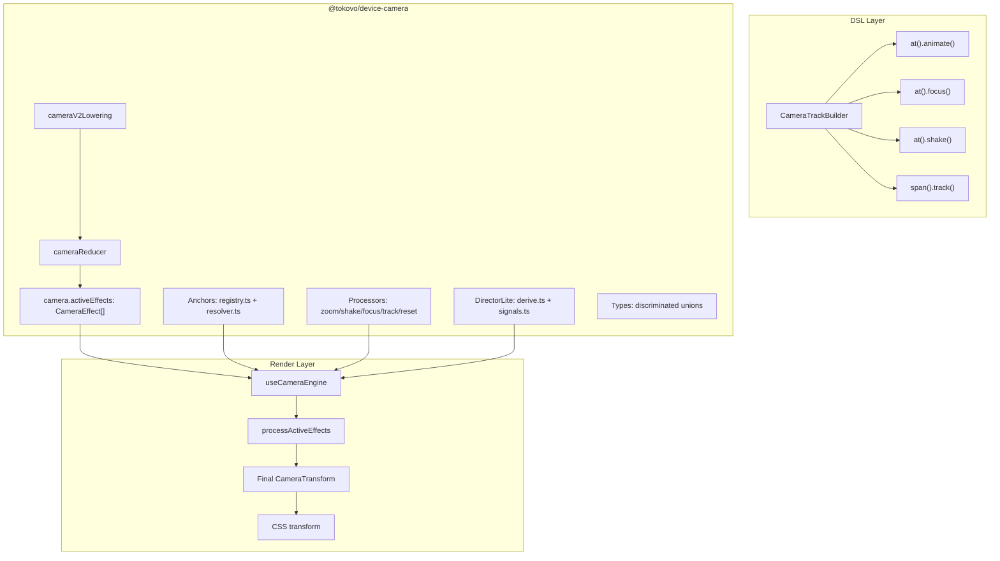

# Camera System Architecture

> Enterprise-grade cinematic camera system for Tokovo video generation.

## System Overview



---

## Current File Locations

| Component | Location | Purpose |
|-----------|----------|---------|
| **Types** | `device-camera/src/types/index.ts` | Discriminated union CameraEffect |
| **cameraReducer** | `device-camera/src/reducer/index.ts` | Store typed effects in state |
| **Processors** | `device-camera/src/processors/index.ts` | Effect registry + processActiveEffects |
| **DirectorLite** | `device-camera/src/director-lite/*` | Auto-camera from signals |
| **Anchors** | `device-camera/src/anchors/*` | Semantic anchor resolution |
| **Lowering** | `device-camera/src/lowering/handler.ts` | DSL → Runtime events |
| **Presets** | `device-camera/src/presets.ts` | Shot presets + composeTimeline |
| **useCameraEngine** | `renderer/src/engines/useCameraEngine.ts` | Frame-by-frame transform |
| **CameraTrackBuilder** | `dsl/src/v2/camera-track.ts` | DSL API |
| **Core re-exports** | `core/src/camera/index.ts` | Backward compat re-exports |

---

## Package Architecture

```
@tokovo/device-camera (single source of truth)
├── src/
│   ├── types/
│   │   └── index.ts         # CameraTransform, CameraEffect, ZoomEffect, etc.
│   │
│   ├── anchors/
│   │   ├── types.ts         # Rect, AnchorFraming, AnchorSnapshot, AnchorProvider
│   │   ├── registry.ts      # registerAnchorProvider, getAnchorsForApp
│   │   └── resolver.ts      # resolveAnchorWithFallback, anchorToOrigin
│   │
│   ├── processors/
│   │   └── index.ts         # zoom/shake/focus/track/reset processors + registry
│   │
│   ├── director-lite/
│   │   ├── types.ts         # DirectorSignal, DerivedEffect
│   │   ├── signals.ts       # extractSignals from events
│   │   ├── strategy.ts      # ViralDramaV1 rules
│   │   └── derive.ts        # deriveDirectorEffects (pure function)
│   │
│   ├── reducer/
│   │   └── index.ts         # cameraReducer - creates typed CameraEffect[]
│   │
│   ├── lowering/
│   │   └── handler.ts       # cameraV2Lowering - ANIMATE_START → ZOOM
│   │
│   ├── presets.ts           # getPreset, composeTimeline
│   ├── utils/index.ts       # easing, lerp, seededRandom
│   ├── plugin.ts            # DeviceCameraPlugin
│   └── index.ts             # Public exports
```

---

## CameraEffect Type (Discriminated Union)

```typescript
// Base fields (all effects have these)
interface EffectBase {
    id: string;
    startFrame: number;
    endFrame: number;
    easing?: EasingType;
    deviceId?: string;  // For multi-device
}

// Discriminant is lowercase `type`
type CameraEffect = 
    | ZoomEffect   // { type: "zoom", targetScale, targetX?, targetY? }
    | ShakeEffect  // { type: "shake", intensity, frequency?, decay? }
    | FocusEffect  // { type: "focus", anchorId, scale? }
    | TrackEffect  // { type: "track", anchorId, smoothing? }
    | ResetEffect; // { type: "reset" }
```

---

## Data Flow

### Manual Camera (DSL)
```
CameraTrackBuilder → IR events → cameraV2Lowering → cameraReducer 
    → camera.activeEffects: CameraEffect[] 
    → useCameraEngine → processActiveEffects → CSS transform
```

### DirectorLite (Auto)
```
Events → extractSignals → deriveDirectorEffects → CameraEffect[]
    → useCameraEngine → processActiveEffects → CSS transform
```

---

## API Examples

### Processing Effects (Renderer)
```typescript
import { 
    processActiveEffects, 
    CameraEffect, 
    DEFAULT_TRANSFORM,
    getAnchorsForApp,
} from "@tokovo/device-camera";

const effects: CameraEffect[] = world.camera.activeEffects;
const anchors = getAnchorsForApp(appId, world, layout, deviceId);

const transform = processActiveEffects(
    t,           // current frame
    effects,     // typed effects
    DEFAULT_TRANSFORM,
    anchors,
    viewport
);
```

### Creating Effects (Reducer)
```typescript
import { cameraReducer } from "@tokovo/device-camera";

// Event: { kind: "CAMERA", type: "ZOOM", at: 30, duration: 60, scale: 1.5 }
// Creates: { type: "zoom", id: "zoom_30", startFrame: 30, endFrame: 90, targetScale: 1.5 }
```

### Anchor Resolution
```typescript
import { 
    resolveAnchorWithFallback,
    registerAnchorProvider,
} from "@tokovo/device-camera";

// Register app anchors
registerAnchorProvider({
    appId: "app_whatsapp",
    framing: { lastMessage: { anchorPoint: { x: 0.5, y: 0.5 }, targetFill: 0.6 } },
    getAnchors(world, layout, deviceId) {
        return { anchors: { lastMessage: { x: 100, y: 500, width: 200, height: 60 } }, ... };
    }
});

// Resolve with fallback
const resolved = resolveAnchorWithFallback("lastMessage", anchors, viewport);
```

---

## Backward Compatibility

`@tokovo/core` re-exports all camera features from `@tokovo/device-camera`:

```typescript
// This still works (but prefer direct import from device-camera)
import { CameraEffect, cameraReducer, getPreset } from "@tokovo/core";
```

---

## Key Design Decisions

1. **Single source of truth** - All camera types in `@tokovo/device-camera`
2. **Discriminated unions** - TypeScript narrows effect types automatically
3. **Flat effects** - No `ActiveCameraEffect` wrapper, effect includes timing
4. **Pure functions** - `processActiveEffects`, `deriveDirectorEffects` are pure
5. **Registry pattern** - Anchors and processors use registries
6. **Lowercase discriminants** - `"zoom"` not `"ZOOM"` for consistency
7. **Enterprise patterns** - Strategy (DirectorLite), Immer (reducer), Frame-based (Remotion)
