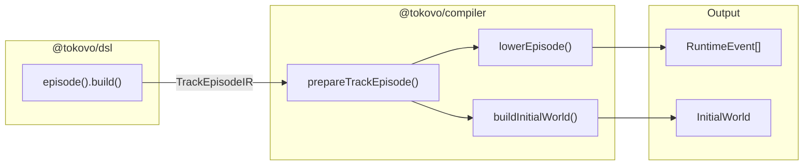
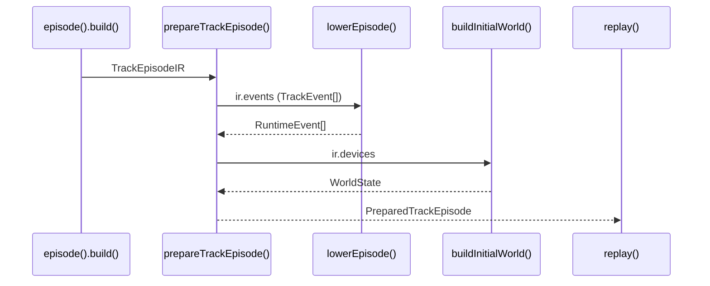
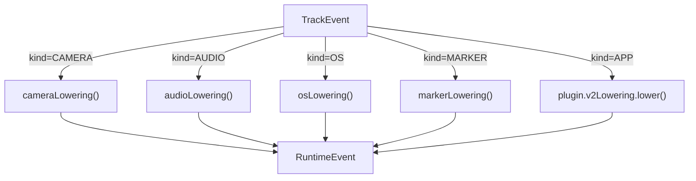
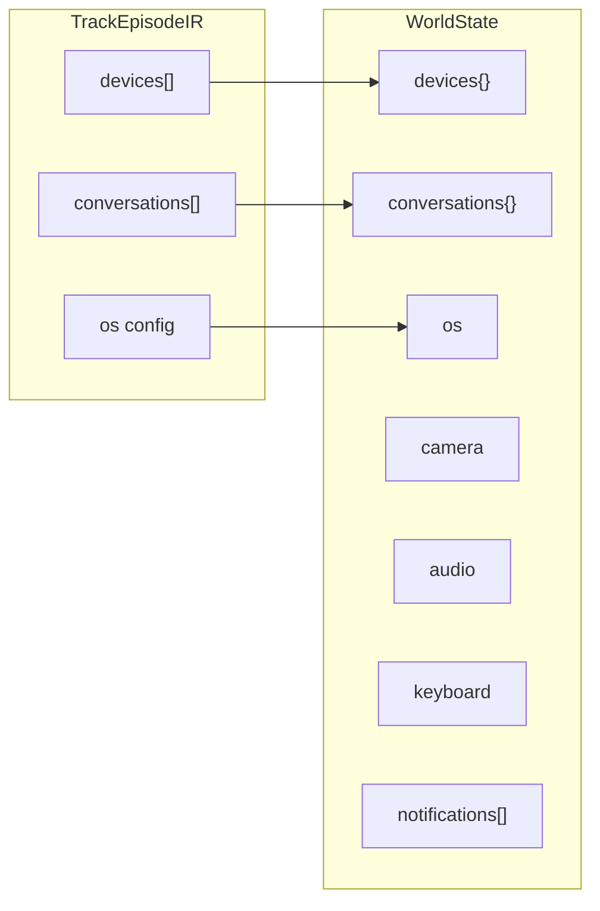
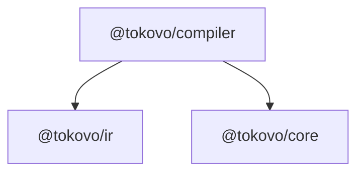

# @tokovo/compiler

> **Compilation layer. Transforms DSL output (TrackEpisodeIR) into engine-ready events (RuntimeEvent[]).**

---

## Overview

`@tokovo/compiler` is the bridge between DSL and Engine:



**Primary Function:** `prepareTrackEpisode(ir, plugins)` → `PreparedTrackEpisode`

---

## Installation

```bash
pnpm add @tokovo/compiler
```

---

## Package Structure

```
packages/compiler/src/
├── index.ts              # Main exports
│
├── v2/                   # V2 Track-based Compiler (USE THIS)
│   ├── index.ts
│   ├── prepare.ts        # prepareTrackEpisode()
│   └── lowering.ts       # lowerEpisode(), lowerTrackEvent()
│
└── legacy/               # ⚠️ DEPRECATED - Beat-based compiler
    └── ...
```

---

## Core Concepts

### 1. PreparedTrackEpisode

The output of `prepareTrackEpisode()`:

```typescript
interface PreparedTrackEpisode {
    /** Episode ID */
    id: string;
    
    /** Frames per second */
    fps: number;
    
    /** Total duration in frames */
    durationInFrames: number;
    
    /** Runtime events (lowered from TrackEvent[]) */
    events: RuntimeEvent[];
    
    /** Initial world state (built from device configs) */
    initialWorld: WorldState;
    
    /** Registered plugins */
    plugins: TokovoPlugin[];
    
    /** Episode metadata */
    metadata: {
        title?: string;
        description?: string;
        markers: Array<{ id: string; frame: number }>;
        sections: Array<{ id: string; start: number; end: number }>;
    };
}
```

---

### 2. prepareTrackEpisode()

Main entry point:

```typescript
import { prepareTrackEpisode } from "@tokovo/compiler";
import { episode } from "@tokovo/dsl";

const ir = episode("demo", { fps: 30, duration: "30s" })
    .device(...)
    .camera(...)
    .build();

// Prepare for engine
const prepared = prepareTrackEpisode(ir, plugins);

// Use with engine
const world = replay(prepared.initialWorld, prepared.events, frame);
```



---

### 3. Lowering Pipeline

The transformation from `TrackEvent` to `RuntimeEvent`:



#### System Event Lowering

System events (CAMERA, AUDIO, OS, MARKER) are handled by built-in lowerers:

```typescript
// Camera event lowering
{ kind: "CAMERA", type: "SET", at: 150, payload: { scale: 1.2 } }
// ↓ becomes
{ kind: "CAMERA", type: "SET", at: 150, payload: { scale: 1.2 } }  // Same structure
```

#### Plugin Event Lowering

Plugin events (kind=APP) are handled by the plugin's `v2Lowering` handler:

```typescript
// Plugin provides v2Lowering
const WhatsApp: TokovoPlugin = {
    appId: "app_whatsapp",
    v2Lowering: {
        eventTypes: ["WHATSAPP_MESSAGE", "WHATSAPP_READ", "WHATSAPP_TYPING_START"],
        lower: (event, context) => {
            // Transform TrackEvent to RuntimeEvent
            return {
                ...event,
                kind: "APP",
                appId: "app_whatsapp",
                // Additional transformations...
            };
        }
    }
};
```

---

### 4. buildInitialWorld()

Constructs initial `WorldState` from device configs:



```typescript
// Input: DeviceConfig from DSL
{
    id: "phone",
    profile: "iphone16",
    app: "app_whatsapp",
    conversations: [
        { id: "dm_alex", name: "Alex", avatar: "/alex.png" }
    ],
    os: { battery: 85, network: "5G" }
}

// Output: WorldState.devices["phone"]
{
    id: "phone",
    profileId: "iphone16",
    foregroundAppId: "app_whatsapp",
    isLocked: false,
    platform: "ios"
}

// Output: WorldState.conversations["dm_alex"]
{
    id: "dm_alex",
    name: "Alex",
    avatar: "/alex.png",
    type: "dm",
    messages: [],
    typing: null,
    unreadCount: 0
}
```

---

### 5. LoweringContext

Context passed to plugin lowering handlers:

```typescript
interface LoweringContext {
    /** Episode being compiled */
    episodeId: string;
    
    /** FPS for time calculations */
    fps: number;
    
    /** All plugins */
    plugins: TokovoPlugin[];
    
    /** All devices */
    devices: DeviceConfig[];
}
```

---

## Key Exports

| Export | Type | Purpose |
|--------|------|---------|
| `prepareTrackEpisode` | function | Main preparation function |
| `PreparedTrackEpisode` | interface | Preparation result type |
| `lowerEpisode` | function | Lower all events |
| `lowerTrackEvent` | function | Lower single event |
| `lowerTrackEvents` | function | Lower event array |
| `createLoweringContext` | function | Create context |
| `LoweringContext` | interface | Context type |
| `PluginLowering` | interface | Plugin lowering handler |

---

## Usage Example

```typescript
import { prepareTrackEpisode } from "@tokovo/compiler";
import { episode } from "@tokovo/dsl";
import { PluginManager, replay } from "@tokovo/core";
import { WhatsApp } from "@tokovo/apps-whatsapp";

// Register plugin
PluginManager.register(WhatsApp);

// Build episode IR
const ir = episode("demo", { fps: 30, duration: "30s" })
    .device("phone", "iphone16", {
        app: "app_whatsapp",
        conversations: [{ id: "dm_alex", name: "Alex" }]
    })
    .camera(cam => cam.at("5s").animate({ scale: 1.2, duration: "0.5s" }))
    .build();

// Prepare for engine
const prepared = prepareTrackEpisode(ir, PluginManager.all());

console.log({
    events: prepared.events.length,
    hasInitialWorld: !!prepared.initialWorld,
    devices: Object.keys(prepared.initialWorld.devices),
});

// Use in engine
const worldAt5Seconds = replay(
    prepared.initialWorld,
    prepared.events,
    150  // frame 150 = 5 seconds at 30fps
);
```

---

## Plugin V2 Lowering Contract

Plugins must implement `v2Lowering` to handle their events:

```typescript
interface PluginLowering {
    /** Event types this plugin handles */
    eventTypes: string[];
    
    /** Transform TrackEvent to RuntimeEvent */
    lower: (event: TrackEvent, context: LoweringContext) => RuntimeEvent;
}

// Example: WhatsApp lowering
const whatsAppLowering: PluginLowering = {
    eventTypes: [
        "WHATSAPP_MESSAGE",
        "WHATSAPP_READ",
        "WHATSAPP_TYPING_START",
        "WHATSAPP_TYPING_STOP",
    ],
    lower: (event, ctx) => ({
        ...event,
        kind: "APP",
        appId: "app_whatsapp",
        at: event.at,
        payload: event.payload,
    }),
};
```

---

## Dependencies



---

## Anti-Patterns

```typescript
// ❌ DON'T: Use legacy compile()
import { compile } from "@tokovo/compiler";
const result = compile(sceneIR);  // DEPRECATED

// ✅ DO: Use prepareTrackEpisode()
import { prepareTrackEpisode } from "@tokovo/compiler";
const prepared = prepareTrackEpisode(ir, plugins);

// ❌ DON'T: Skip plugins
const prepared = prepareTrackEpisode(ir, []);  // App events won't lower!

// ✅ DO: Pass all registered plugins
const prepared = prepareTrackEpisode(ir, PluginManager.all());
```

---

## Debug Output

`prepareTrackEpisode` logs preparation details:

```
[prepareTrackEpisode] Prepared episode: {
    id: "demo",
    trackEvents: 15,
    runtimeEvents: 18,
    devices: 1,
    conversations: 2
}
```
