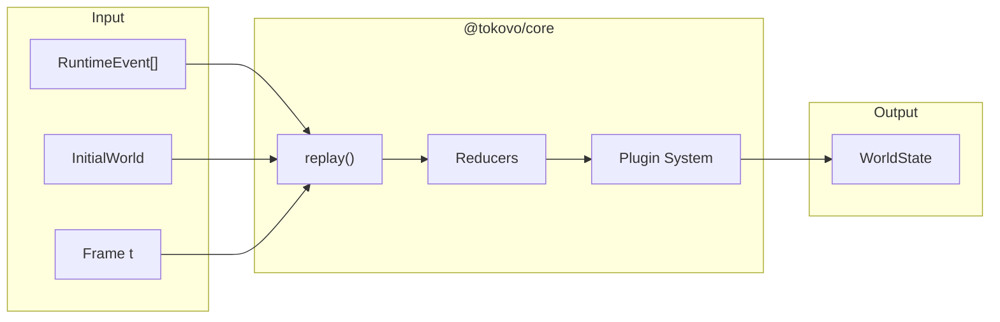
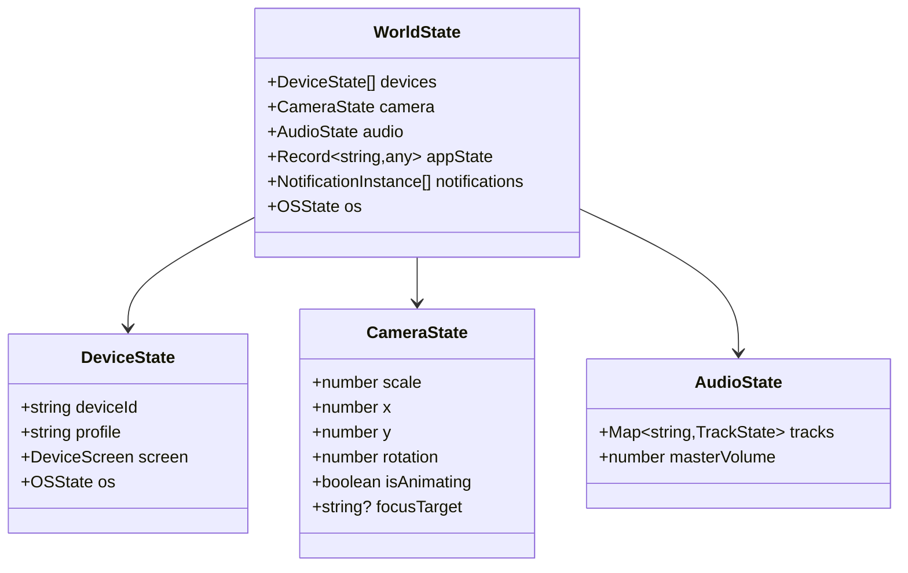
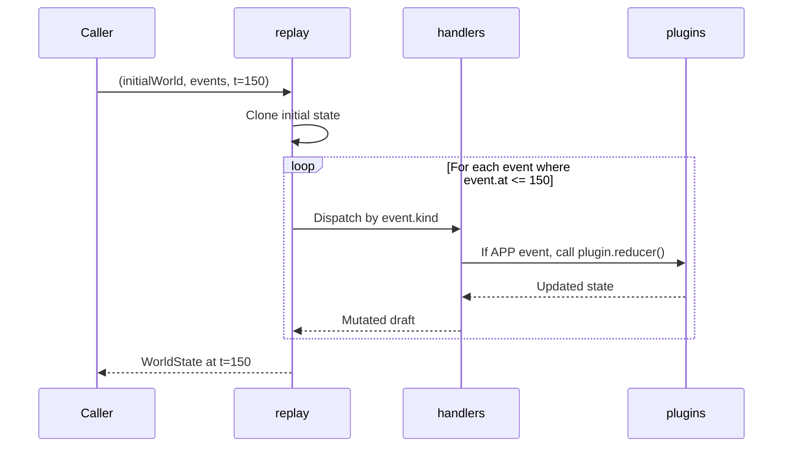
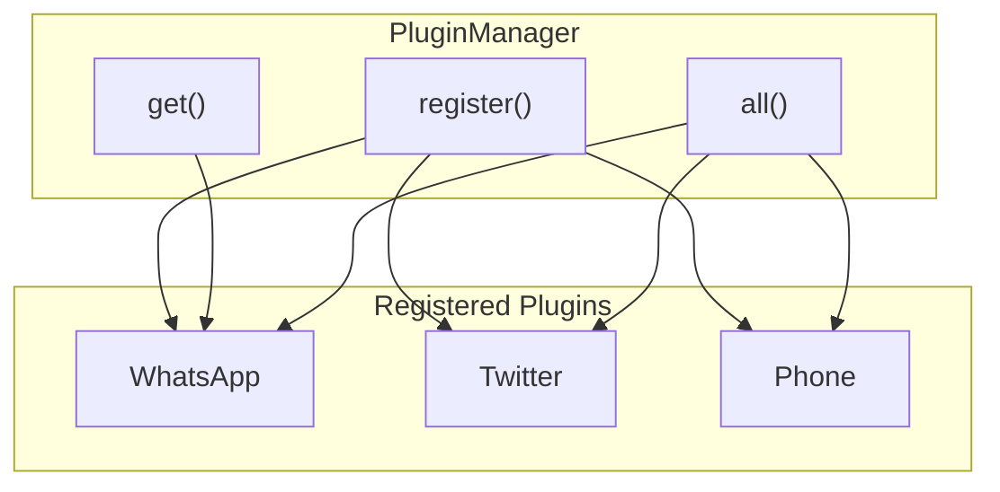
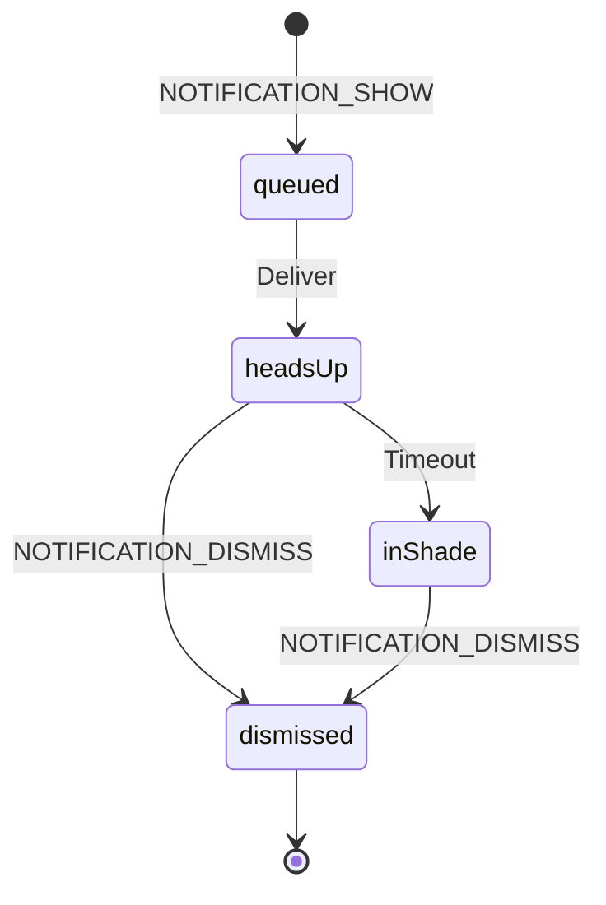
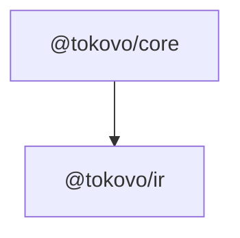

# @tokovo/core

> **The runtime engine. Computes WorldState at any frame by replaying events.**

---

## Overview

`@tokovo/core` is the **runtime engine** that:

1. Takes compiled events + initial world state
2. Replays events up to frame `t`
3. Returns `WorldState` at that frame



**Determinism Contract:** Same inputs → Same output. No side effects.

---

## Installation

```bash
pnpm add @tokovo/core
```

---

## Package Structure

```
packages/core/src/
├── index.ts              # Main exports
├── engine.ts             # replay() function
├── types.ts              # WorldState, NotificationIR (1314 lines)
│
├── engine/               # Modular engine handlers
│   ├── index.ts
│   ├── handlers/         # Event-specific handlers
│   ├── logger.ts         # Debug logging
│   └── ...
│
├── plugin/               # Plugin registration system
│   ├── index.ts
│   └── plugin.ts         # TokovoPlugin interface
│
├── camera/               # Camera state management
│   ├── index.ts
│   └── ...
│
├── audio/                # Audio state management
│   └── ...
│
├── notifications/        # Notification system
│   └── ...
│
├── director-lite/        # Auto-camera system
│   └── ...
│
├── registries/           # App, Sound, Metadata registries
│   └── ...
│
├── anchors/              # Semantic positioning
│   └── ...
│
├── prepare/              # Episode preparation
│   └── ...
│
└── constants.ts          # Magic numbers, defaults
```

---

## Core Concepts

### 1. WorldState (The Universe)

Everything that can be rendered is in `WorldState`:



#### Key WorldState Fields

```typescript
interface WorldState {
    /** All devices in the scene */
    devices: DeviceState[];
    
    /** Camera transform state */
    camera: CameraState;
    
    /** Audio mixer state */
    audio: AudioState;
    
    /** App-specific state (keyed by appId) */
    appState: Record<string, any>;
    
    /** Active notifications */
    notifications: NotificationInstance[];
    
    /** Global OS state */
    os: OSState;
    
    /** Markers reached */
    markers: string[];
    
    /** Current section */
    currentSection?: string;
    
    /** Current frame */
    t: number;
}
```

---

### 2. replay() (Pure Function)

The core engine function:

```typescript
import { replay, createInitialWorld } from "@tokovo/core";

// Compute world at frame 150
const world = replay(
    initialWorld,
    events,
    150,
    { mode: "preview" }
);
```



#### Determinism Contract

```
Given:
  - Same initial WorldState
  - Same events array
  - Same frame t

Output:
  - Identical WorldState every time

No side effects except optional debug logging.
```

---

### 3. Plugin System

Apps register as plugins with all their dependencies:

```typescript
interface TokovoPlugin {
    /** Unique app ID (e.g., "app_whatsapp") */
    appId: string;
    
    /** Display name */
    name: string;
    
    /** React component for app UI */
    appView: React.FC<AppViewProps>;
    
    /** State reducer for app events */
    reducer: AppReducer;
    
    /** V2 lowering handler */
    v2Lowering?: V2LoweringHandler;
    
    /** App metadata (icon, colors) */
    metadata?: AppMetadata;
    
    /** Notification adapter */
    notificationAdapter?: NotificationAdapter;
    
    /** Semantic anchors for framing */
    anchors?: AnchorDefinition[];
    
    /** Sounds this app uses */
    sounds?: SoundDefinition[];
}
```

#### Plugin Registration

```typescript
import { PluginManager } from "@tokovo/core";
import { WhatsApp } from "@tokovo/apps-whatsapp";

// Register plugin
PluginManager.register(WhatsApp);

// Get plugin
const plugin = PluginManager.get("app_whatsapp");

// List all plugins
const plugins = PluginManager.all();
```



---

### 4. App Reducer Pattern

Each plugin provides a reducer that handles its events:

```typescript
type AppReducer = (
    world: WorldState,
    event: RuntimeEvent,
    context: ReducerContext
) => WorldState;

// Example: WhatsApp reducer
const whatsAppReducer: AppReducer = (world, event, ctx) => {
    if (event.type !== "WHATSAPP_MESSAGE") return world;
    
    // Clone and update
    const newWorld = { ...world };
    const appState = newWorld.appState["app_whatsapp"];
    
    // Add message to conversation
    appState.conversations[event.payload.conversationId].messages.push(
        event.payload.message
    );
    
    return newWorld;
};
```

---

### 5. Camera System

Camera state and transforms:

```typescript
interface CameraState {
    /** Zoom level (1 = no zoom) */
    scale: number;
    
    /** X offset (pixels) */
    x: number;
    
    /** Y offset (pixels) */
    y: number;
    
    /** Rotation (degrees) */
    rotation: number;
    
    /** Currently animating? */
    isAnimating: boolean;
    
    /** Animation target values */
    animationTarget?: {
        scale: number;
        x: number;
        y: number;
        startFrame: number;
        endFrame: number;
        easing: string;
    };
    
    /** Semantic focus target */
    focusTarget?: string;
    
    /** Shake state */
    shake?: {
        intensity: number;
        frequency: number;
        startFrame: number;
    };
}
```

---

### 6. Audio System

Audio tracks and mixer:

```typescript
interface AudioState {
    /** Active audio tracks */
    tracks: Map<string, AudioTrackState>;
    
    /** Master volume (0-1) */
    masterVolume: number;
}

interface AudioTrackState {
    /** Track ID */
    id: string;
    
    /** Sound asset ID */
    soundId: string;
    
    /** Current volume (0-1) */
    volume: number;
    
    /** Is playing? */
    isPlaying: boolean;
    
    /** Looping? */
    loop: boolean;
    
    /** Current playback position (frames) */
    playhead: number;
}
```

---

### 7. Notification System

Full notification lifecycle:



```typescript
interface NotificationIR {
    id: string;
    appId: string;
    title: string;
    body: string;
    icon?: string;
    category?: "message" | "call" | "system";
    actions?: Array<{ id: string; label: string }>;
}

interface NotificationInstance {
    id: string;
    ir: NotificationIR;
    state: "queued" | "headsUp" | "inShade" | "dismissed";
    createdAtFrame: number;
    deliveredAtFrame?: number;
    dismissedAtFrame?: number;
}
```

---

## Key Exports

| Export | Type | Purpose |
|--------|------|---------|
| `replay` | function | Compute WorldState at frame t |
| `createInitialWorld` | function | Create default WorldState |
| `PluginManager` | class | Plugin registration singleton |
| `TokovoPlugin` | interface | Plugin contract |
| `AppReducer` | type | Reducer function type |
| `WorldState` | interface | Complete world state |
| `DeviceState` | interface | Device instance state |
| `CameraState` | interface | Camera transform state |
| `AudioState` | interface | Audio mixer state |
| `NotificationIR` | interface | Notification request |
| `NotificationInstance` | interface | Notification state |
| `setCompiler` | function | Set compiler for prep |

---

## Usage Example

```typescript
import { 
    replay, 
    createInitialWorld, 
    PluginManager,
    setCompiler 
} from "@tokovo/core";
import { compile } from "@tokovo/compiler";
import { WhatsApp } from "@tokovo/apps-whatsapp";

// Setup
setCompiler(compile);
PluginManager.register(WhatsApp);

// Prepare episode
const prepared = prepareTrackEpisode(episodeIR, PluginManager.all());

// Compute frame 100
const world = replay(
    prepared.initialWorld,
    prepared.events,
    100,
    { mode: "preview" }
);

// world.devices, world.camera, world.appState["app_whatsapp"]
```

---

## Dependencies



---

## Anti-Patterns

```typescript
// ❌ DON'T: Mutate world directly
world.camera.scale = 2;  // BAD

// ✅ DO: Let replay() handle all mutations
const newWorld = replay(world, events, t);

// ❌ DON'T: Call replay in a loop
for (let f = 0; f < 100; f++) {
    replay(world, events, f);  // Inefficient
}

// ✅ DO: Call replay once per frame needed
const world100 = replay(initialWorld, events, 100);
```

---

## Debug Mode

```typescript
// In browser console
window.__TOKOVO_LOG_EVENTS = true;

// Now replay() logs all events:
// [Tokovo] Frame 50: CAMERA.SET { scale: 1.2 }
// [Tokovo] Frame 75: APP.WHATSAPP_MESSAGE { ... }
```
