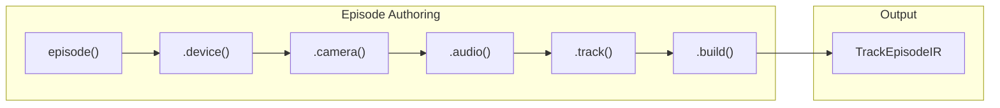
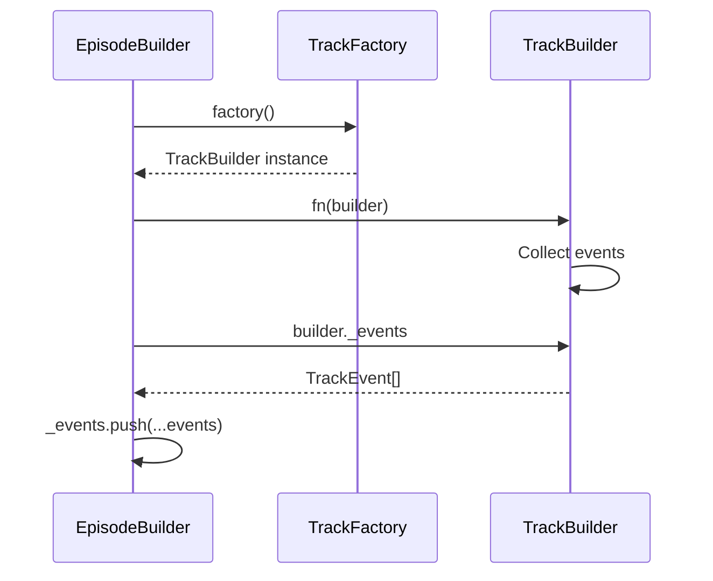
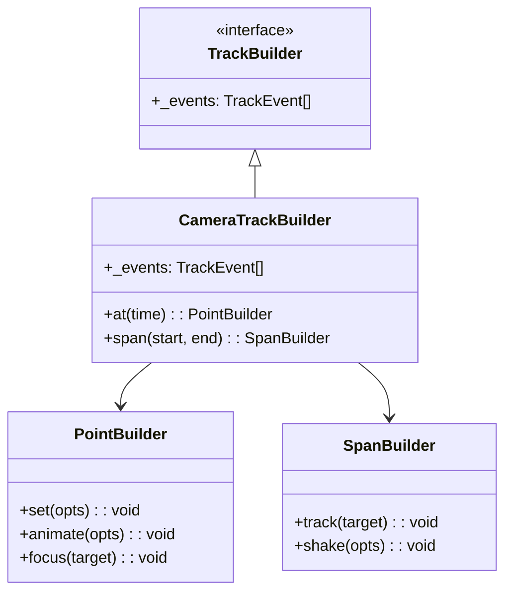
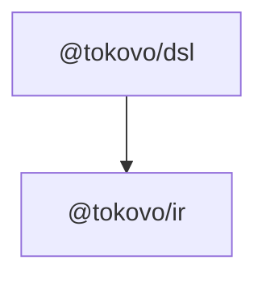

# @tokovo/dsl

> **Domain Specific Language for authoring Tokovo episodes. Fluent, type-safe, track-based.**

---

## Overview

`@tokovo/dsl` provides a fluent API for creating video episodes:



**Primary Entry Point:** `episode(id, config)` returns an `EpisodeBuilder` for fluent chaining.

---

## Installation

```bash
pnpm add @tokovo/dsl
```

---

## Package Structure

```
packages/dsl/src/
├── index.ts              # Main exports
│
├── core/                 # V2 Track-based DSL (USE THIS)
│   ├── index.ts
│   ├── episode.ts        # EpisodeBuilder class
│   └── tracks/           # Track builders
│       ├── camera.ts     # CameraTrackBuilder
│       ├── audio.ts      # AudioTrackBuilder
│       └── os.ts         # OSTrackBuilder
│
├── events/               # Event factory functions
│   └── ...
│
├── helpers/              # Typing simulation, message helpers
│   └── ...
│
├── utils/                # Time parsing, utilities
│   └── time.ts
│
├── tracer.ts             # Debug tracing
│
└── legacy/               # ⚠️ DEPRECATED - Beat-based DSL
```

---

## Quick Start

```typescript
import { episode } from "@tokovo/dsl";

const ir = episode("my-episode", { fps: 30, duration: "30s" })
    .device("phone", "iphone16", {
        app: "app_whatsapp",
        conversations: [
            { id: "dm_alex", name: "Alex", avatar: "/avatars/alex.png" }
        ]
    })
    .camera(cam => {
        cam.at("0s").set({ scale: 1 });
        cam.at("5s").animate({ scale: 1.2, duration: "0.5s" });
    })
    .audio(audio => {
        audio.span("0s", "30s").bgm("lofi_chill", { volume: 0.3 });
    })
    .mark("intro_end", "10s")
    .build();

// ir is TrackEpisodeIR - ready for compilation
```

---

## EpisodeBuilder API

### episode(id, config)

Factory function to create an episode:

```typescript
function episode(id: string, config: TrackEpisodeConfig): EpisodeBuilder;

interface TrackEpisodeConfig {
    fps: number;                    // 30 or 60
    duration: string | number;      // "30s", "1m", or frames
    title?: string;
    description?: string;
}
```

---

### .device(id, profile, options)

Add a device to the scene:

```typescript
.device("phone", "iphone16", {
    app: "app_whatsapp",
    conversations: [
        { id: "dm_alex", name: "Alex" },
        { id: "group_bros", name: "Bros", type: "group", participants: ["alex", "sam"] }
    ],
    os: {
        time: new Date("2024-01-01T10:30:00"),
        battery: 85,
        network: "5G"
    }
})
```

| Param | Type | Description |
|-------|------|-------------|
| `id` | string | Device identifier (e.g., "phone") |
| `profile` | string | Device model ("iphone16", "pixel8") |
| `options.app` | string | Primary app ID |
| `options.conversations` | array | App conversations |
| `options.os` | object | Initial OS state |

---

### .camera(fn)

Add camera track events:

```typescript
.camera(cam => {
    // Point events
    cam.at("0s").set({ scale: 1, x: 0, y: 0 });
    cam.at("5s").animate({ scale: 1.2, duration: "0.5s", easing: "easeInOut" });
    cam.at("10s").focus("dm_alex", { scale: 1.5 });
    cam.at("20s").shake({ intensity: 0.3, duration: "0.3s" });
    cam.at("25s").reset({ duration: "0.5s" });
    
    // Span events
    cam.span("5s", "15s").track("message_bubble");
})
```

#### Camera Methods

| Method | Description |
|--------|-------------|
| `at(time).set(opts)` | Set camera transform immediately |
| `at(time).animate(opts)` | Animate to target values |
| `at(time).focus(target, opts?)` | Focus on semantic anchor |
| `at(time).shake(opts)` | Camera shake effect |
| `at(time).reset(opts?)` | Reset to default |
| `span(start, end).track(target)` | Follow target for duration |

---

### .audio(fn)

Add audio track events:

```typescript
.audio(audio => {
    // Background music
    audio.span("0s", "30s").bgm("lofi_chill", { volume: 0.3 });
    
    // Sound effects
    audio.at("5s").play("notification_ding");
    audio.at("10s").play("message_sent", { volume: 0.8 });
    
    // Transitions
    audio.at("20s").crossfade("lofi_chill", "epic_drums", "2s");
    audio.at("28s").fadeOut("epic_drums", "2s");
})
```

#### Audio Methods

| Method | Description |
|--------|-------------|
| `span(start, end).bgm(id, opts?)` | Background music loop |
| `at(time).play(id, opts?)` | One-shot sound effect |
| `at(time).stop(id)` | Stop specific track |
| `at(time).crossfade(from, to, duration)` | Crossfade between tracks |
| `at(time).fadeOut(id, duration)` | Fade out track |
| `at(time).duck(amount, duration)` | Duck music for voice |

---

### .os(fn)

Add OS state changes:

```typescript
.os(os => {
    os.at("5s").setBattery(50);
    os.at("10s").setNetwork("wifi");
    os.at("15s").setTime(new Date("2024-01-01T12:00:00"));
    os.at("20s").setDND(true);
    os.at("25s").notification({
        id: "n1",
        appId: "app_whatsapp",
        title: "Alex",
        body: "Hey! Where are you?"
    });
})
```

---

### .track(trackId, factory, fn)

Add a plugin track (for app-specific events):

```typescript
import { WhatsAppTrackBuilder } from "@tokovo/apps-whatsapp";

let order = 0;
const getOrder = () => order++;

.track("app_whatsapp",
    () => new WhatsAppTrackBuilder(30, "phone", "dm_alex", getOrder),
    wa => {
        wa.at("2s").receive("Alex", "Hey!");
        wa.span("4s", "6s").typing("me");
        wa.at("6s").send("Hi there!");
        wa.at("8s").read("Alex");
    }
)
```



---

### .mark(id, time)

Add a point marker:

```typescript
.mark("intro_start", "0s")
.mark("intro_end", "10s")
.mark("climax", "25s")
```

---

### .section(id, start, end)

Add a section marker:

```typescript
.section("intro", "0s", "10s")
.section("main", "10s", "25s")
.section("outro", "25s", "30s")
```

---

### .director(style)

Enable auto-camera:

```typescript
.director("ViralDramaV1")  // Auto camera movements
.director("Cinematic")     // Film-style movements
.director("Documentary")   // Subtle, steady
```

---

### .build()

Finalize and return `TrackEpisodeIR`:

```typescript
const ir: TrackEpisodeIR = episode("demo", { fps: 30, duration: "30s" })
    .device(...)
    .camera(...)
    .build();
```

---

## Track Builder Pattern

All track builders follow this pattern:



### at(time) - Point Events

Events that happen at a single moment:

```typescript
cam.at("5s").animate({ scale: 1.2, duration: "0.5s" });
// Creates: { at: 150, kind: "CAMERA", type: "ANIMATE_START", ... }
```

### span(start, end) - Span Events

Events that cover a duration:

```typescript
cam.span("5s", "10s").track("message_bubble");
// Creates: TRACK_START at 150, TRACK_END at 300
```

---

## Time Parsing

Time strings are parsed to frames:

| Format | Example | Result (@ 30fps) |
|--------|---------|------------------|
| Seconds | `"5s"` | 150 |
| Milliseconds | `"500ms"` | 15 |
| Minutes | `"1m"` | 1800 |
| Combined | `"1m30s"` | 2700 |
| Decimal | `"2.5s"` | 75 |
| Raw frames | `90` | 90 |

```typescript
import { parseTimeToFrames } from "@tokovo/dsl";

parseTimeToFrames("5s", 30);    // 150
parseTimeToFrames("1m", 30);    // 1800
parseTimeToFrames(90, 30);      // 90
```

---

## Key Exports

| Export | Type | Purpose |
|--------|------|---------|
| `episode` | function | Create EpisodeBuilder |
| `EpisodeBuilder` | class | Fluent episode API |
| `CameraTrackBuilder` | class | Camera track building |
| `AudioTrackBuilder` | class | Audio track building |
| `OSTrackBuilder` | class | OS state track building |
| `parseTimeToFrames` | function | Time string → frames |
| `Tracer` | class | Debug tracing |
| `keyboard` | helper | Keyboard event helpers |
| `messages` | helper | Message DSL helpers |

---

## Dependencies



---

## Complete Example

```typescript
import { episode } from "@tokovo/dsl";
import { WhatsAppTrackBuilder } from "@tokovo/apps-whatsapp";

let order = 0;
const getOrder = () => order++;

export const demoEpisode = episode("demo-conversation", {
    fps: 30,
    duration: "45s",
    title: "Demo Conversation",
})
    // Setup device
    .device("phone", "iphone16", {
        app: "app_whatsapp",
        conversations: [
            { id: "dm_sarah", name: "Sarah", avatar: "/avatars/sarah.png" },
        ],
        os: { battery: 85, network: "5G" }
    })
    
    // Camera movements
    .camera(cam => {
        cam.at("0s").set({ scale: 1 });
        cam.at("3s").animate({ scale: 1.1, duration: "0.3s" });
        cam.at("10s").focus("dm_sarah.message[last]", { scale: 1.3 });
        cam.at("20s").reset({ duration: "0.5s" });
    })
    
    // Background music
    .audio(audio => {
        audio.span("0s", "45s").bgm("chill_beats", { volume: 0.2 });
    })
    
    // WhatsApp conversation
    .track("app_whatsapp",
        () => new WhatsAppTrackBuilder(30, "phone", "dm_sarah", getOrder),
        wa => {
            wa.at("2s").receive("Sarah", "Hey! Are you coming tonight?");
            wa.span("4s", "7s").typing("me");
            wa.at("7s").send("Yeah! What time?");
            wa.at("10s").receive("Sarah", "8pm at the usual place 🎉");
            wa.at("13s").send("Perfect! See you there 👍");
            wa.at("16s").read("Sarah");
        }
    )
    
    // Markers
    .mark("conversation_start", "2s")
    .mark("conversation_end", "16s")
    .section("intro", "0s", "2s")
    .section("chat", "2s", "20s")
    
    .build();
```

---

## Anti-Patterns

```typescript
// ❌ DON'T: Use raw frame numbers (hard to read)
cam.at(150).set({ scale: 1 });

// ✅ DO: Use time strings
cam.at("5s").set({ scale: 1 });

// ❌ DON'T: Forget .build()
const incomplete = episode("x", { fps: 30, duration: "10s" });

// ✅ DO: Always call .build()
const ir = episode("x", { fps: 30, duration: "10s" }).build();

// ❌ DON'T: Import from legacy
import { beats } from "@tokovo/dsl/legacy";

// ✅ DO: Use V2 episode()
import { episode } from "@tokovo/dsl";
```
