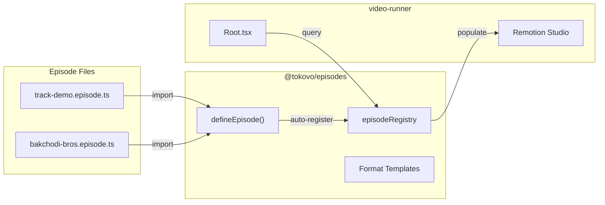
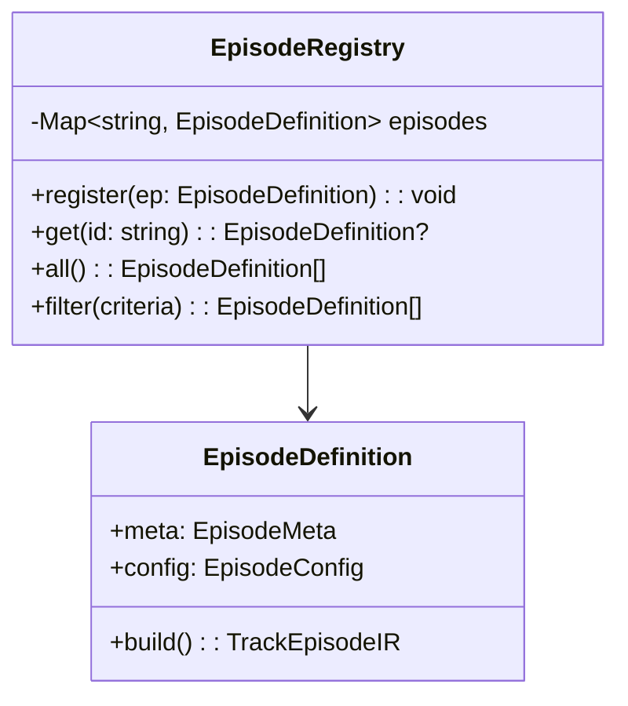
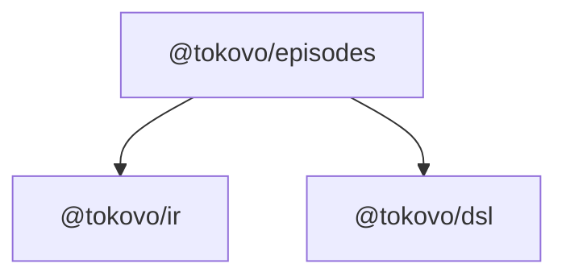

# @tokovo/episodes

> **Episode management with auto-discovery. One file = one episode in Remotion Studio.**

---

## Overview

`@tokovo/episodes` provides the episode registration and discovery system:



**Zero-file discovery:** Define episode → It appears in Remotion Studio automatically.

---

## Installation

```bash
pnpm add @tokovo/episodes
```

---

## Package Structure

```
packages/episodes/src/
├── index.ts              # Main exports
├── schema.ts             # Zod validation schemas
│
├── registry/             # Auto-discovery system
│   ├── index.ts
│   └── episode-registry.ts
│
├── types/                # Episode definition types
│   ├── index.ts
│   └── episode-definition.ts
│
├── templates/            # Video format presets
│   ├── index.ts
│   └── formats.ts
│
├── production/           # Production episodes
│   ├── index.ts          # Barrel (import = register)
│   └── *.episode.ts
│
├── showcases/            # Demo episodes
│   └── index.ts
│
├── tests/                # Test episodes
│   └── index.ts
│
└── legacy/               # V1 episodes (not imported)
```

---

## Quick Start

### 1. Create Episode File

```typescript
// packages/episodes/src/production/my-episode.episode.ts
import { defineEpisode } from "../types/episode-definition";
import { episode } from "@tokovo/dsl/src/v2";
import { WhatsAppTrackBuilder } from "@tokovo/apps-whatsapp/src/dsl/track-builder";

let order = 0;
const getOrder = () => order++;

export default defineEpisode({
    meta: {
        id: "my-episode",
        title: "My Episode",
        category: "production",
    },
    config: {
        format: "1080x1920",
        durationInFrames: 900,
        apps: ["app_whatsapp"],
    },
    build: () => episode("my-episode", { fps: 30, duration: "30s", title: "My Episode" })
        .device("phone", "iphone16", {
            app: "app_whatsapp",
            conversations: [{ id: "dm_contact", name: "Contact", avatar: "" }],
        })
        .track("app_whatsapp",
            () => new WhatsAppTrackBuilder(30, "phone", "dm_contact", getOrder),
            wa => {
                wa.at("1s").receive("Contact", "Hello!");
                wa.at("3s").send("Hi there!");
            }
        )
        .build(),
});
```

### 2. Add to Barrel

```typescript
// packages/episodes/src/production/index.ts
import "./track-demo.episode";
import "./bakchodi-bros.episode";
import "./my-episode.episode";  // Add this
```

### 3. Episode Appears in Remotion Studio!

```
Remotion Studio
└── Production/
    ├── track-demo-v2
    ├── bakchodi-bros
    └── my-episode     ← New!
```

---

## defineEpisode()

The registration function:

```typescript
function defineEpisode(definition: EpisodeDefinition): EpisodeDefinition;

interface EpisodeDefinition {
    meta: EpisodeMeta;
    config: EpisodeConfig;
    build: () => TrackEpisodeIR;
}
```

### EpisodeMeta

```typescript
interface EpisodeMeta {
    /** Unique ID (kebab-case) */
    id: string;
    
    /** Display title */
    title: string;
    
    /** Description */
    description?: string;
    
    /** Category for organization */
    category: "production" | "showcase" | "test";
    
    /** Tags for filtering */
    tags?: string[];
    
    /** Thumbnail image */
    thumbnail?: string;
}
```

### EpisodeConfig

```typescript
interface EpisodeConfig {
    /** Video format ID or custom dimensions */
    format: FormatId | CustomFormat;
    
    /** Total frames */
    durationInFrames: number;
    
    /** Required plugins */
    apps: string[];
}

type FormatId = 
    | "1080x1920"      // Portrait HD
    | "1080x1920@60"   // Portrait HD 60fps
    | "1920x1080"      // Landscape HD
    | "1080x1080"      // Square
    | "iphone-16-pro"  // iPhone 16 Pro native
    | "pixel-8";       // Pixel 8 native
```

---

## Episode Registry

Query registered episodes:

```typescript
import { episodeRegistry } from "@tokovo/episodes";

// Get all
const all = episodeRegistry.all();

// Filter by category
const production = episodeRegistry.filter({ category: "production" });
const showcases = episodeRegistry.filter({ category: "showcase" });

// Get specific episode
const ep = episodeRegistry.get("my-episode");
if (ep) {
    const ir = ep.build();  // Build IR on demand
}
```



---

## Format Templates

Pre-defined video formats:

```typescript
import { getFormat, listFormats, FORMATS } from "@tokovo/episodes";

// Get format details
const format = getFormat("1080x1920");
// { width: 1080, height: 1920, fps: 30, name: "Portrait HD" }

// List all formats
listFormats();
// ["1080x1920", "1080x1920@60", "1920x1080", "1080x1080", "iphone-16-pro", "pixel-8"]

// Use in episode
defineEpisode({
    config: {
        format: "iphone-16-pro",  // 1290×2796 @ 60fps
        durationInFrames: 1800,
        apps: []
    },
    ...
});
```

### Available Formats

| Format ID | Dimensions | FPS | Use Case |
|-----------|------------|-----|----------|
| `1080x1920` | 1080×1920 | 30 | TikTok, Reels |
| `1080x1920@60` | 1080×1920 | 60 | High-quality |
| `1920x1080` | 1920×1080 | 30 | YouTube |
| `1080x1080` | 1080×1080 | 30 | Instagram |
| `iphone-16-pro` | 1290×2796 | 60 | iPhone native |
| `pixel-8` | 1080×2400 | 60 | Android native |

---

## Video-Runner Integration

```typescript
// apps/video-runner/src/Root.tsx
import { episodeRegistry, getFormat } from "@tokovo/episodes";

// Import episode folders (side-effect: registers all episodes)
import "@tokovo/episodes/src/production";
import "@tokovo/episodes/src/showcases";

export const RemotionRoot: React.FC = () => {
    const production = episodeRegistry.filter({ category: "production" });
    const showcases = episodeRegistry.filter({ category: "showcase" });
    
    return (
        <>
            <Folder name="Production">
                {production.map(ep => (
                    <Composition
                        key={ep.meta.id}
                        id={ep.meta.id}
                        component={EpisodeRenderer}
                        durationInFrames={ep.config.durationInFrames}
                        fps={getFormat(ep.config.format).fps}
                        width={getFormat(ep.config.format).width}
                        height={getFormat(ep.config.format).height}
                        defaultProps={{ episodeId: ep.meta.id }}
                    />
                ))}
            </Folder>
            <Folder name="Showcases">
                {showcases.map(renderEpisode)}
            </Folder>
        </>
    );
};
```

---

## Turbo Generator

Generate episodes via CLI:

```bash
pnpm turbo gen episode
```

**Prompts:**
1. Episode ID
2. Title
3. Description
4. Category (production/showcase/test)
5. Format
6. Duration
7. Apps

**Result:**
- Creates `{category}/{id}.episode.ts`
- Auto-appends import to barrel

---

## Key Exports

| Export | Type | Purpose |
|--------|------|---------|
| `defineEpisode` | function | Define and register episode |
| `episodeRegistry` | singleton | Query registered episodes |
| `getFormat` | function | Get format details |
| `listFormats` | function | List available formats |
| `FORMATS` | object | All format definitions |
| `EpisodeMeta` | type | Episode metadata |
| `EpisodeConfig` | type | Episode configuration |
| `EpisodeDefinition` | type | Full episode definition |

---

## Dependencies



---

## Best Practices

```typescript
// ✅ Use format templates
config: { format: "1080x1920", ... }

// ✅ ID matches filename
// my-episode.episode.ts → id: "my-episode"

// ✅ Duration = fps × seconds
config: { durationInFrames: 30 * 30, ... }  // 30s at 30fps

// ✅ Add to barrel after creating
// production/index.ts: import "./my-episode.episode";

// ❌ Don't import legacy episodes
import "./legacy/old-episode";  // Will crash
```
