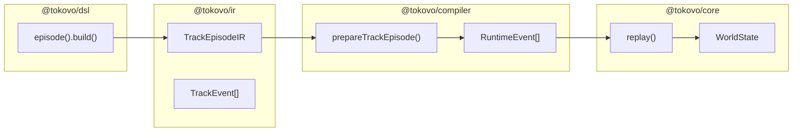
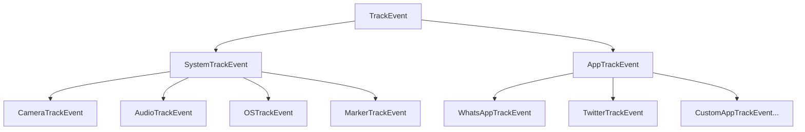
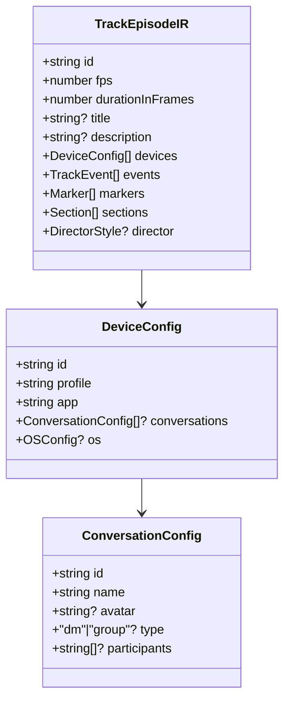
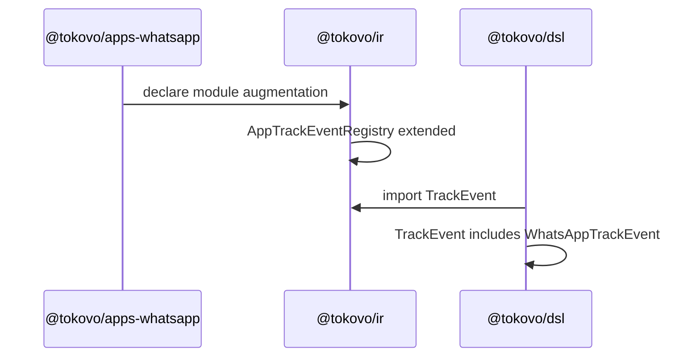
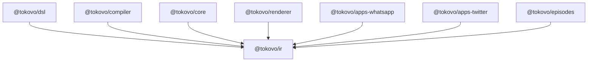

# @tokovo/ir

> **Intermediate Representation types. The foundation of Tokovo's type-safe data pipeline.**

---

## Overview

`@tokovo/ir` is the **foundation package** that defines all data structures flowing through Tokovo:



**Package Role:** Define shared types that all packages depend on. No business logic.

---

## Installation

```bash
pnpm add @tokovo/ir
```

---

## Package Structure

```
packages/ir/
├── package.json
└── src/
    ├── index.ts              # Main exports
    ├── trace.ts              # Debug trace (always exported)
    │
    ├── v2/                   # V2 Track-based IR (USE THIS)
    │   ├── index.ts          # Barrel export
    │   ├── track-event.ts    # TrackEvent union type
    │   ├── episode-ir.ts     # TrackEpisodeIR structure
    │   └── payloads.ts       # Typed payloads for each event
    │
    ├── utils/                # Utility functions
    │   ├── index.ts
    │   └── ...
    │
    └── legacy/               # ⚠️ DEPRECATED - Beat-based IR
        └── ...
```

---

## Core Types Deep Dive

### 1. Trace (Debug Spine)

Every operation in Tokovo carries trace metadata for debugging and explainability:

```typescript
interface Trace {
    /** Episode ID this operation belongs to */
    episodeId: string;
    
    /** Target device */
    deviceId: string;
    
    /** Semantic grouping (beat name) */
    beat: string;
    
    /** Track ID for concurrent operations */
    trackId: string;
    
    /** Index within scene ops array (for ordering) */
    sceneOpIndex: number;
    
    /** Optional source location for debugging */
    source?: {
        file?: string;
        line?: number;
    };
}
```

**Usage Pattern:**

```typescript
import { createTrace } from "@tokovo/ir";

const trace = createTrace({
    episodeId: "bakchodi-bros",
    deviceId: "phone",
    beat: "opening",
    trackId: "main",
});
```

---

### 2. TrackEvent (Universal Event Union)

All DSL events compile to `TrackEvent`. This is the canonical event type.



#### Base Interface

```typescript
interface TrackEventBase {
    /** Start frame (required) */
    at: number;
    
    /** Duration in frames (for span events) */
    duration?: number;
    
    /** Target device (optional - some events are device-agnostic) */
    deviceId?: string;
    
    /** Declaration order for conflict resolution */
    _declarationOrder?: number;
}
```

#### Event Kinds

| Kind | Description | Example Types |
|------|-------------|---------------|
| `CAMERA` | Camera transforms | `SET`, `ANIMATE_START`, `ANIMATE_END`, `FOCUS`, `TRACK_START`, `TRACK_END`, `SHAKE_START`, `SHAKE_END`, `RESET` |
| `AUDIO` | Sound control | `BGM_START`, `BGM_END`, `PLAY`, `STOP`, `CROSSFADE`, `FADE_OUT`, `STOP_ALL` |
| `OS` | System state | `SET_STATE`, `SET_TIME`, `SET_BATTERY`, `SET_NETWORK`, `SET_DND`, `NOTIFICATION_SHOW`, `NOTIFICATION_DISMISS` |
| `MARKER` | Debug/Navigation | `MARK`, `SECTION_START`, `SECTION_END` |
| `APP` | App-specific | Defined by plugins via module augmentation |

#### CameraTrackEvent Example

```typescript
type CameraTrackEvent = TrackEventBase & {
    kind: "CAMERA";
} & (
    | { type: "SET"; payload: { scale?: number; x?: number; y?: number; rotation?: number } }
    | { type: "ANIMATE_START"; payload: { scale?: number; duration: number; easing?: string } }
    | { type: "ANIMATE_END"; payload: {} }
    | { type: "FOCUS"; payload: { target: string; scale?: number } }
    | { type: "SHAKE_START"; payload: { intensity: number } }
    | { type: "SHAKE_END"; payload: {} }
    | { type: "RESET"; payload: { duration?: number } }
);
```

---

### 3. TrackEpisodeIR (DSL Output)

What `episode().build()` returns. The intermediate representation before compilation.



#### Full Interface

```typescript
interface TrackEpisodeIR {
    /** Unique episode identifier (kebab-case) */
    id: string;
    
    /** Frames per second (typically 30 or 60) */
    fps: number;
    
    /** Total duration in frames */
    durationInFrames: number;
    
    /** Human-readable title */
    title?: string;
    
    /** Description */
    description?: string;
    
    /** Device configurations */
    devices: DeviceConfig[];
    
    /** All track events (sorted by frame + declaration order) */
    events: TrackEvent[];
    
    /** Point markers for debugging/navigation */
    markers: Marker[];
    
    /** Section markers for debugging/navigation */
    sections: Section[];
    
    /** Auto-camera director style */
    director?: DirectorStyle;
}
```

---

### 4. DeviceConfig

Defines a device instance in the episode:

```typescript
interface DeviceConfig {
    /** Device ID (e.g., "phone", "tablet") */
    id: string;
    
    /** Device profile (e.g., "iphone16", "pixel8") */
    profile: string;
    
    /** Primary app (e.g., "app_whatsapp") */
    app: string;
    
    /** Conversations for messaging apps */
    conversations?: ConversationConfig[];
    
    /** Initial OS state */
    os?: OSConfig;
}

interface ConversationConfig {
    /** Conversation ID (e.g., "dm_alex", "group_bros") */
    id: string;
    
    /** Display name */
    name: string;
    
    /** Avatar image path */
    avatar?: string;
    
    /** Conversation type */
    type?: "dm" | "group";
    
    /** Participant IDs (for groups) */
    participants?: string[];
}

interface OSConfig {
    /** Initial time */
    time?: Date | number;
    
    /** Battery percentage 0-100 */
    battery?: number;
    
    /** Charging state */
    charging?: boolean;
    
    /** Network type */
    network?: "wifi" | "5G" | "4G" | "3G" | "none";
    
    /** Signal strength 0-4 */
    strength?: number;
    
    /** Do Not Disturb mode */
    dnd?: boolean;
}
```

---

## Advanced Pattern: Module Augmentation

Plugins extend the event registry using TypeScript module augmentation:

```typescript
// In @tokovo/apps-whatsapp/src/types.ts

import { TrackEventBase } from "@tokovo/ir";

// Define WhatsApp-specific events
export type WhatsAppTrackEvent = TrackEventBase & {
    kind: "APP";
    appId: "app_whatsapp";
} & (
    | { type: "WHATSAPP_MESSAGE"; payload: { conversationId: string; message: MessagePayload } }
    | { type: "WHATSAPP_READ"; payload: { conversationId: string; messageId: string } }
    | { type: "WHATSAPP_TYPING_START"; payload: { conversationId: string; senderId: string } }
    | { type: "WHATSAPP_TYPING_STOP"; payload: { conversationId: string; senderId: string } }
);

// Augment the registry
declare module "@tokovo/ir" {
    interface AppTrackEventRegistry {
        app_whatsapp: WhatsAppTrackEvent;
    }
}
```

**Result:** `TrackEvent` now includes `WhatsAppTrackEvent` with full type safety.



---

## Type Guards

Safe runtime type checking:

```typescript
import { 
    isCameraEvent, 
    isAudioEvent, 
    isOSEvent, 
    isMarkerEvent, 
    isAppEvent 
} from "@tokovo/ir";

function handleEvent(event: TrackEvent) {
    if (isCameraEvent(event)) {
        // event is CameraTrackEvent
        console.log("Camera:", event.type);
    }
    
    if (isAppEvent(event)) {
        // event.kind === "APP"
        // event.appId available
        console.log("App:", event.appId);
    }
}
```

---

## Payload Reference

### Camera Payloads

| Type | Payload Fields |
|------|----------------|
| `SET` | `scale?`, `x?`, `y?`, `rotation?` |
| `ANIMATE_START` | `scale?`, `x?`, `y?`, `rotation?`, `duration`, `easing?` |
| `ANIMATE_END` | (empty) |
| `FOCUS` | `target`, `scale?`, `offsetX?`, `offsetY?` |
| `TRACK_START` | `target`, `offset?` |
| `TRACK_END` | (empty) |
| `SHAKE_START` | `intensity`, `frequency?` |
| `SHAKE_END` | (empty) |
| `RESET` | `duration?` |

### Audio Payloads

| Type | Payload Fields |
|------|----------------|
| `BGM_START` | `trackId`, `volume?`, `loop?` |
| `BGM_END` | `trackId` |
| `PLAY` | `soundId`, `volume?` |
| `STOP` | `trackId` |
| `CROSSFADE` | `fromTrackId`, `toTrackId`, `duration` |
| `FADE_OUT` | `trackId`, `duration` |
| `STOP_ALL` | (empty) |

### OS Payloads

| Type | Payload Fields |
|------|----------------|
| `SET_STATE` | All OSConfig fields |
| `SET_TIME` | `time` |
| `SET_BATTERY` | `level`, `charging?` |
| `SET_NETWORK` | `type`, `strength?` |
| `SET_DND` | `enabled` |
| `NOTIFICATION_SHOW` | `notification: NotificationIR` |
| `NOTIFICATION_DISMISS` | `notificationId` |
| `NOTIFICATION_DISMISS_ALL` | (empty) |

---

## Dependencies



**@tokovo/ir has no dependencies.** It is the foundation.

---

## Anti-Patterns

```typescript
// ❌ DON'T: Import from legacy
import { SceneIR, TimelineOp } from "@tokovo/ir/legacy";

// ✅ DO: Use V2 types
import { TrackEpisodeIR, TrackEvent } from "@tokovo/ir";

// ❌ DON'T: Create ad-hoc event types
const event = { kind: "CUSTOM", data: {} };

// ✅ DO: Use module augmentation for new app events
declare module "@tokovo/ir" {
    interface AppTrackEventRegistry {
        my_app: MyAppTrackEvent;
    }
}
```

---

## Summary

| Export | Type | Purpose |
|--------|------|---------|
| `Trace` | interface | Debug metadata for every operation |
| `createTrace` | function | Create trace with defaults |
| `TrackEvent` | type | Union of all event types |
| `TrackEventBase` | interface | Base fields for events |
| `CameraTrackEvent` | type | Camera control events |
| `AudioTrackEvent` | type | Audio control events |
| `OSTrackEvent` | type | OS state events |
| `MarkerTrackEvent` | type | Debug marker events |
| `AppTrackEventRegistry` | interface | Plugin extension point |
| `TrackEpisodeIR` | interface | DSL output structure |
| `DeviceConfig` | interface | Device configuration |
| `ConversationConfig` | interface | Messaging conversation |
| `Marker` | interface | Point marker |
| `Section` | interface | Section marker |
| `isCameraEvent` | function | Type guard |
| `isAudioEvent` | function | Type guard |
| `isOSEvent` | function | Type guard |
| `isMarkerEvent` | function | Type guard |
| `isAppEvent` | function | Type guard |
