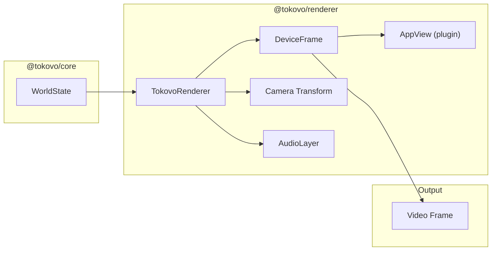
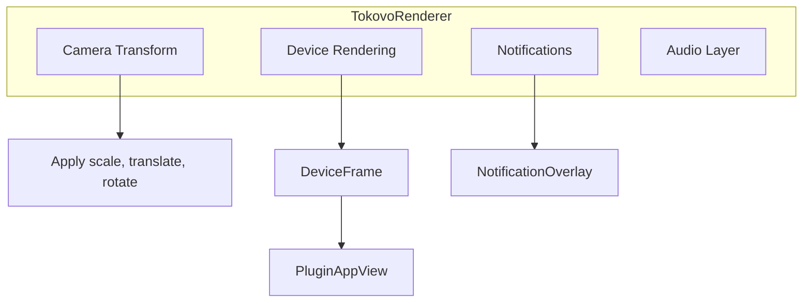
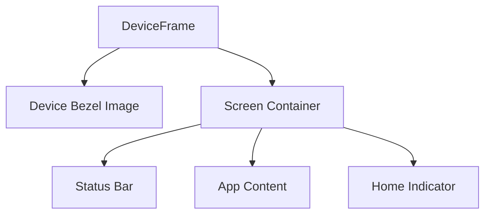
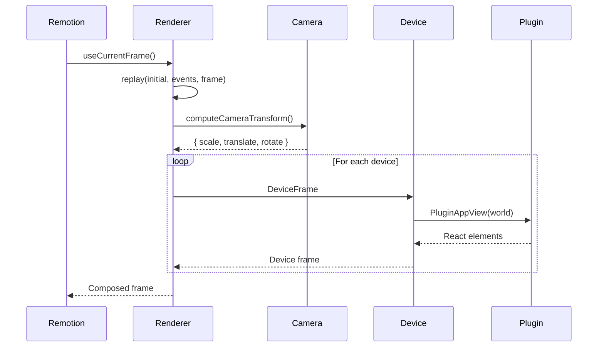
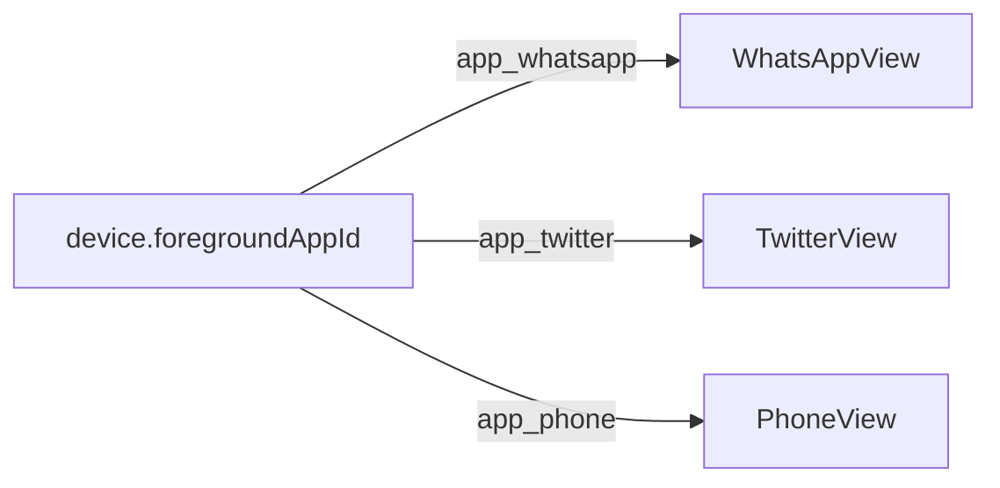
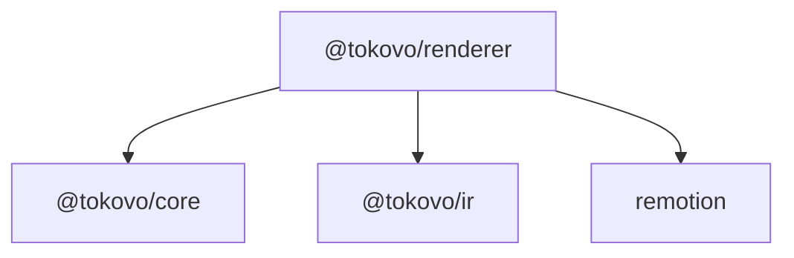

# @tokovo/renderer

> **React/Remotion rendering layer. Renders WorldState into visual output.**

---

## Overview

`@tokovo/renderer` takes `WorldState` and renders it using React and Remotion:



**Primary Component:** `<TokovoRenderer world={world} t={frame} />`

---

## Installation

```bash
pnpm add @tokovo/renderer
```

---

## Package Structure

```
packages/renderer/src/
├── index.ts                    # Main exports
│
├── TokovoRenderer.tsx          # Main renderer component
├── MultiDeviceRenderer.tsx     # Multi-device scenes
├── DeviceFrame.tsx             # Device bezel component
├── AudioLayer.tsx              # Audio playback
│
├── camera-composer.ts          # Camera transform calculations
│
├── layout/                     # Layout strategies
│   └── ...
│
├── os/                         # OS UI (status bar, etc.)
│   └── ...
│
├── overlays/                   # Notification overlays
│   └── ...
│
├── screens/                    # Lock screen, home screen
│   └── ...
│
├── anchor-providers/           # Semantic anchor resolution
│   └── ...
│
├── strategies/                 # Render strategies
│   └── ...
│
└── engines/                    # Render engines
    └── ...
```

---

## Core Components

### 1. TokovoRenderer

Main entry point for rendering:

```typescript
import { TokovoRenderer } from "@tokovo/renderer";

function VideoComposition() {
    const frame = useCurrentFrame();
    const world = useMemo(() => 
        replay(prepared.initialWorld, prepared.events, frame),
        [frame]
    );
    
    return (
        <TokovoRenderer
            world={world}
            t={frame}
            debug={false}
            eventIndex={eventIndex}
            directorEnabled={true}
        />
    );
}
```

#### Props

| Prop | Type | Description |
|------|------|-------------|
| `world` | `WorldState` | Current world state |
| `t` | `number` | Current frame |
| `debug` | `boolean` | Show debug overlays |
| `eventIndex` | `EventIndex` | For director auto-camera |
| `directorEnabled` | `boolean` | Enable auto-camera |
| `layout` | `LayoutConfig` | Custom layout |



---

### 2. DeviceFrame

Renders the device bezel and screen:

```typescript
<DeviceFrame
    device={deviceState}
    profile={deviceProfile}
    platform="ios"
>
    <AppView world={world} />
</DeviceFrame>
```



---

### 3. AudioLayer

Handles audio playback with Remotion:

```typescript
<AudioLayer
    audio={world.audio}
    t={frame}
    fps={30}
/>
```

Renders `<Audio>` components for:
- Background music (BGM)
- Sound effects (SFX)
- Voice clips

---

### 4. Camera Composer

Computes camera transforms:

```typescript
import { computeCameraTransform } from "@tokovo/renderer";

const transform = computeCameraTransform(
    world.camera,
    frame,
    { width: 1080, height: 1920 }
);

// Returns: { scale, translateX, translateY, rotation }
```

Camera effects:
- **Scale** - Zoom in/out
- **Translate** - Pan X/Y
- **Rotation** - Rotate viewport
- **Shake** - Random offset

---

## Rendering Pipeline



---

## Plugin App Views

Plugins provide their own views:

```typescript
// In @tokovo/apps-whatsapp
export const WhatsAppView: React.FC<AppViewProps> = ({ world, t }) => {
    const appState = world.appState["app_whatsapp"];
    const conversation = world.conversations[appState.activeConversation];
    
    return (
        <ChatView
            messages={conversation.messages}
            typing={conversation.typing}
        />
    );
};
```

Renderer dispatches to plugin view based on `device.foregroundAppId`:



---

## Key Exports

| Export | Type | Purpose |
|--------|------|---------|
| `TokovoRenderer` | component | Main renderer |
| `DeviceFrame` | component | Device bezel |
| `AudioLayer` | component | Audio playback |
| `computeCameraTransform` | function | Camera math |
| `MultiDeviceRenderer` | component | Multiple devices |
| `StatusBar` | component | iOS/Android status |
| `LockScreen` | component | Lock screen |
| `NotificationOverlay` | component | Notifications |

---

## Layout Strategies

Different layout modes:

| Strategy | Description |
|----------|-------------|
| `single` | One centered device |
| `side-by-side` | Two devices horizontally |
| `stacked` | Devices vertically |
| `grid` | N×M grid |
| `custom` | Custom positioning |

---

## Dependencies



---

## Usage with Remotion

```typescript
// apps/video-runner/src/EpisodeRenderer.tsx
import { AbsoluteFill, useCurrentFrame, useVideoConfig } from "remotion";
import { TokovoRenderer } from "@tokovo/renderer";
import { replay } from "@tokovo/core";

export const EpisodeRenderer: React.FC<{ episodeId: string }> = ({ episodeId }) => {
    const frame = useCurrentFrame();
    const { fps } = useVideoConfig();
    
    const episode = episodeRegistry.get(episodeId);
    const prepared = useMemo(() => 
        prepareTrackEpisode(episode.build(), plugins),
        [episode]
    );
    
    const world = useMemo(() =>
        replay(prepared.initialWorld, prepared.events, frame),
        [frame, prepared]
    );
    
    return (
        <AbsoluteFill>
            <TokovoRenderer world={world} t={frame} />
        </AbsoluteFill>
    );
};
```

---

## Anti-Patterns

```typescript
// ❌ DON'T: Compute world inside render without memoization
<TokovoRenderer world={replay(initial, events, frame)} />

// ✅ DO: Memoize world computation
const world = useMemo(() => replay(initial, events, frame), [frame]);
<TokovoRenderer world={world} />

// ❌ DON'T: Pass undefined world
<TokovoRenderer world={undefined} />  // Will crash

// ✅ DO: Always pass valid WorldState
<TokovoRenderer world={world ?? createInitialWorld()} />
```
